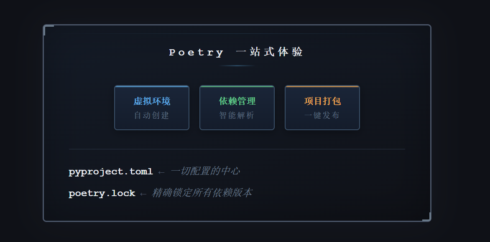
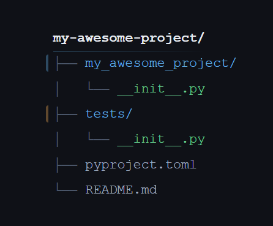
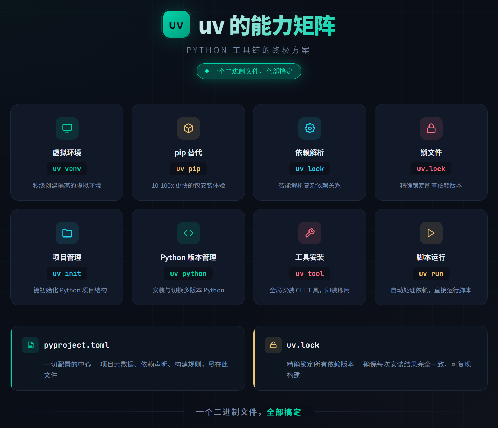
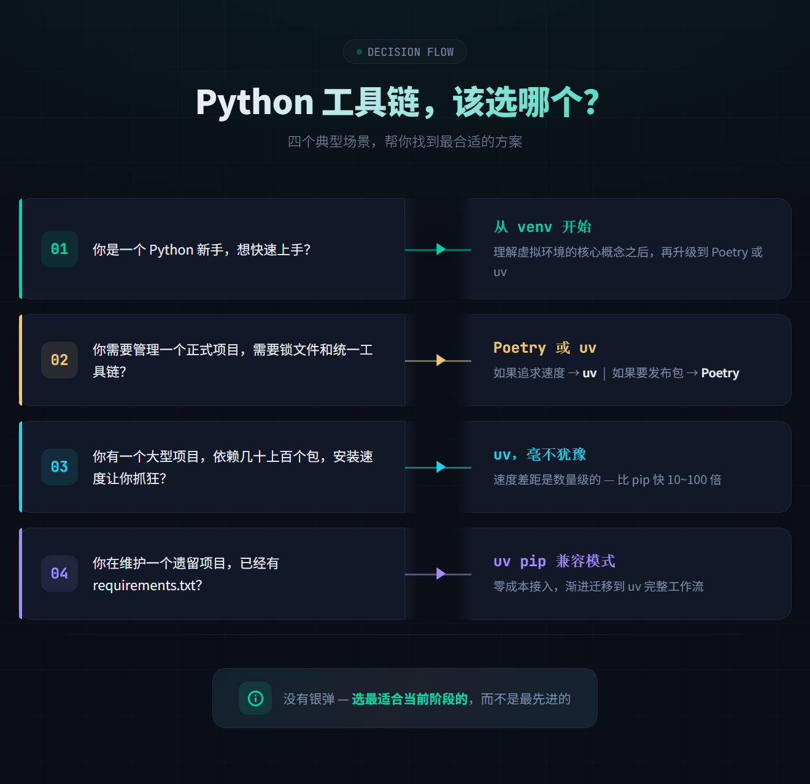

# Python 虚拟环境完全指南：从 venv 到 uv，一文搞懂依赖管理

> 还在为 Python 项目的依赖冲突头疼？还在把全宇宙的包都装在系统环境里？这篇教程带你从零掌握 venv、Poetry、uv 三大虚拟环境方案，彻底告别「在我电脑上能跑」的尴尬。

---

## 目录

1. [前言：一段血泪史](#1-前言一段血泪史)
2. [什么是虚拟环境](#2-什么是虚拟环境)
3. [venv：Python 官方出品](#3-venvpython-官方出品)
4. [Poetry：现代依赖管理利器](#4-poetry现代依赖管理利器)
5. [uv：下一代超快工具](#5-uv下一代超快工具)
6. [三工具深度对比](#6-三工具深度对比)
7. [最佳实践建议](#7-最佳实践建议)
8. [常见问题与排错](#8-常见问题与排错)
9. [总结](#9-总结)

---

## 1. 前言：一段血泪史

想象这样一个场景：

你兴冲冲地用 `pip install requests` 装了爬虫库，写了个项目跑得飞起。两个月后，你接手了同事的项目，运行 `pip install -r requirements.txt`，结果报了一屏幕红字。你折腾了两个小时，发现同事的 Django 项目需要 Django 3.2，而你之前装的爬虫项目依赖 Django 4.1——两个版本在系统里打起来了。

这还没完。你又尝试装另一个项目，这次是 Flask 2.0 的项目，但系统里已经有了 Flask 3.0。你试图降级，发现降级后又破坏了其他项目……

**这就是「依赖地狱」（Dependency Hell）。**


Python 虚拟环境就是为解决这个问题而生的。它让你可以在同一台电脑上，为每个项目创建独立的、隔离的 Python 运行环境。每个环境都有自己的 `site-packages` 目录，互不干扰。

打个比方：

> 系统环境像是所有人共用一个冰箱——你的酸奶和同事的三明治塞在一起，很容易串味。虚拟环境则像是给每个人分配一个独立的小冰箱，你爱放什么放什么，不会影响到别人。

---

## 2. 什么是虚拟环境

### 2.1 核心原理

虚拟环境本质上是一个**包含独立 Python 解释器和第三方库目录的文件夹**。

当你创建一个虚拟环境时，它做了这几件事：

1. 在指定目录下复制（或链接）一份 Python 解释器
2. 创建一个独立的 `site-packages` 目录，用于存放第三方包
3. 修改激活脚本中的环境变量，让 `python` 命令指向这个隔离环境中的解释器


### 2.2 激活机制

「激活」虚拟环境并不神秘。它本质上就是**修改当前 shell 的环境变量**：

- `PATH` 变量前插入虚拟环境的 `bin/`（或 `Scripts/`）目录，这样在终端里输入 `python` 时，系统会优先找到虚拟环境里的 Python
- 设置 `VIRTUAL_ENV` 环境变量，指向虚拟环境根目录
- 修改命令提示符，在开头显示环境名称（如 `(venv)`）

退出虚拟环境时，这些修改会被还原。

### 2.3 虚拟环境 vs 容器

有读者可能会问：既然有 Docker，为什么还要用虚拟环境？

| 维度 | 虚拟环境 (venv/poetry/uv) | 容器 (Docker) |
|------|--------------------------|---------------|
| **隔离级别** | Python 包级别 | 操作系统级别 |
| **启动速度** | 毫秒级 | 秒级 |
| **资源占用** | 几十 MB | 几百 MB 起步 |
| **适用场景** | 本地开发、多项目管理 | 生产部署、服务编排 |
| **学习成本** | 低 | 中高 |

**它们不是非此即彼的关系，而是互补的。** 即使在 Docker 容器内，也推荐使用虚拟环境，因为容器的系统 Python 同样可能被多个进程共享。

---

## 3. venv：Python 官方出品

`venv` 是 Python 3.3 起内置的标准库模块，无需额外安装。它是大多数 Python 开发者的入门选择。

### 3.1 快速上手

#### 创建虚拟环境

```bash
# 在项目根目录执行
python -m venv .venv
```

这条命令会在当前目录下创建一个名为 `.venv` 的文件夹。用 `.venv` 作为名称是社区约定俗成的惯例，因为以点开头的文件在 Linux/macOS 上默认隐藏，不会污染 `ls` 的输出。


几点说明：
- **目录名可以随意**，`.venv`、`venv`、`env` 都是常见选择，推荐 `.venv`
- **建议放在项目根目录**，方便 `.gitignore` 统一忽略
- 创建位置不影响功能，激活后在任何目录都能使用

#### 激活虚拟环境

不同操作系统和 Shell 的激活命令不同：

**Linux / macOS：**

```bash
source .venv/bin/activate
```

**Windows (CMD)：**

```cmd
.venv\Scripts\activate.bat
```

**Windows (PowerShell)：**

```powershell
.venv\Scripts\Activate.ps1
```

> **提示**：如果 PowerShell 报错「无法加载文件」，是因为执行策略限制。运行以下命令解除：
> ```powershell
> Set-ExecutionPolicy -ExecutionPolicy RemoteSigned -Scope CurrentUser
> ```

激活后，你的终端提示符前面会出现 `(.venv)` 标识：

```bash
(.venv) user@machine:~/my-project$
```

这说明你已经进入了虚拟环境，接下来所有的 `pip install` 都会安装到这个隔离环境中。

#### 验证环境

```bash
# 确认 python 路径指向虚拟环境
(.venv) $ which python
/home/user/my-project/.venv/bin/python

# Windows 上使用 where 命令
(.venv) > where python
C:\Users\user\my-project\.venv\Scripts\python.exe
```

#### 退出虚拟环境

```bash
deactivate
```

### 3.2 安装和管理依赖

#### 安装包

```bash
# 激活环境后直接 pip install
# 安装 requests 包，不指定版本 → pip 会装 PyPI 上最新的稳定版
pip install requests
# 安装 Django，版本固定为 4.2.0（== 表示精确匹配该版本）
pip install django==4.2
# 安装 Flask，版本要求在 2.0 及以上、3.0 以下（即任意 2.x 版）
# 引号是为了防止 shell 把 < 当成重定向符号
pip install "flask>=2.0,<3.0"
```

#### 查看已安装的包

```bash
pip list

# 输出示例：
# Package    Version
# ---------- -------
# Django     4.2.0
# pip        23.0
# requests   2.31.0
```

#### 导出依赖列表

```bash
# 导出到 requirements.txt
pip freeze > requirements.txt
```

`requirements.txt` 文件内容示例：

```
asgiref==3.7.2
Django==4.2.0
requests==2.31.0
sqlparse==0.4.4
```

> **注意**：`pip freeze` 会导出**所有**当前环境中的包，包括依赖的依赖。这意味着 `requirements.txt` 里会有很多你并没有「主动」安装的包。

#### 从 requirements.txt 安装

```bash
pip install -r requirements.txt
```

### 3.3 requirements.txt 的进阶用法

对于简单项目，一个 `requirements.txt` 就够了。但如果项目的依赖关系更复杂，你可以这样组织：

```
project/
├── requirements/
│   ├── base.txt        # 所有环境共用的依赖
│   ├── dev.txt         # 开发环境额外依赖（如 pytest, black）
│   └── prod.txt        # 生产环境额外依赖（如 gunicorn）
└── .venv/
```

**base.txt：**

```
Django==4.2.0
requests==2.31.0
python-dotenv==1.0.0
```

**dev.txt：**

```
# 继承 base.txt
-r base.txt

# 开发工具
pytest==7.4.0
black==23.7.0
ruff==0.0.285
ipython==8.14.0
```

**prod.txt：**

```
# 继承 base.txt
-r base.txt

# 生产服务器
gunicorn==21.2.0
```

这样，开发时安装 `dev.txt`，部署时安装 `prod.txt`，灵活且清晰。

### 3.4 venv 的优缺点

**优点：**
- 内置，无需额外安装
- 简单直接，学习成本极低
- 轻量，创建速度快

**缺点：**
- 依赖解析能力弱——`pip` 不会自动解决冲突，只会报错
- 锁定文件不规范——`requirements.txt` 不是标准化的锁文件格式（它本质是依赖清单，不是锁文件）
- 没有项目元数据管理——项目名称、版本、描述等无处安放
- 手动管理 dev/prod 依赖较繁琐

> **锁文件（lock file）记录的是「这次安装实际用到的每一个包及其精确版本」，包括你直接依赖的和它们间接拉进来的传递依赖，目的是让不同机器、不同时间装出完全一致**的环境。


---

## 4. Poetry：现代依赖管理利器

如果说 venv + pip 是手动挡汽车，那 Poetry 就是自动挡——它帮你做了很多本该由你操心的事。

### 4.1 Poetry 解决了什么问题



Poetry 的核心哲学是：**一个项目的所有元信息（名称、版本、依赖、构建配置）都应该集中在一个文件中**，这个文件就是 `pyproject.toml`——遵循 PEP 518 和 PEP 621 标准的配置文件。

对比一下：

| 功能 | venv + pip | Poetry |
|------|-----------|--------|
| 虚拟环境 | 手动创建 | 自动管理 |
| 依赖声明 | requirements.txt | pyproject.toml |
| 锁文件 | 无（或 pip-tools） | poetry.lock |
| 依赖解析 | 简单，经常冲突 | 智能 SAT 求解器 |
| 项目打包 | 手动 setup.py | 一条命令 |
| 发布到 PyPI | 手动 twine | `poetry publish` |

### 4.2 安装 Poetry

**Linux / macOS：**

```bash
curl -sSL https://install.python-poetry.org | python3 -
```

**Windows (PowerShell)：**

```powershell
(Invoke-WebRequest -Uri https://install.python-poetry.org -UseBasicParsing).Content | py -
```

**通过 pipx 安装（推荐）：**

```bash
# 先安装 pipx
pip install pipx
pipx ensurepath

# 再通过 pipx 安装 Poetry
pipx install poetry
```

安装完成后验证：

```bash
poetry --version
# Poetry (version 1.7.1)
```

### 4.3 创建项目

#### 从头创建新项目

```bash
poetry new my-awesome-project
```

这条命令会生成一个标准的项目骨架：


生成的 `pyproject.toml` 内容：

```toml
[tool.poetry]
name = "my-awesome-project"
version = "0.1.0"
description = ""
authors = ["你的名字 <your-email@example.com>"]
readme = "README.md"
packages = [{include = "my_awesome_project"}]

[tool.poetry.dependencies]
python = "^3.9"

[build-system]
requires = ["poetry-core"]
build-backend = "poetry.core.masonry.api"
```

#### 在已有项目中初始化

```bash
cd existing-project
poetry init
```

`poetry init` 是一个交互式向导，会问你项目名称、版本、依赖等，然后生成 `pyproject.toml`。

### 4.4 管理依赖

#### 添加依赖

```bash
# 添加普通依赖
poetry add requests

# 添加指定版本
poetry add django@^4.2

# 添加开发依赖（如测试工具、代码格式化工具）
poetry add --group dev pytest black ruff
```

执行 `poetry add` 后，Poetry 会：

1. 在 `pyproject.toml` 中记录依赖声明
2. 自动解析版本约束，确保与已有依赖不冲突
3. 更新 `poetry.lock`，锁定所有依赖的精确版本
4. 安装包到虚拟环境

**pyproject.toml 更新后：**

```toml
[tool.poetry.dependencies]
python = "^3.9"
requests = "^2.31.0"
django = "^4.2"

[tool.poetry.group.dev.dependencies]
pytest = "^7.4.0"
black = "^23.7.0"
ruff = "^0.0.285"
```

#### 移除依赖

```bash
poetry remove requests
```

#### 查看依赖树

```bash
poetry show --tree
```

输出示例：

```
django 4.2.0 A high-level Python web framework...
├── asgiref >=3.6.0,<4
├── sqlparse >=0.3.1
└── tzdata *
requests 2.31.0 Python HTTP for Humans.
├── certifi >=2017.4.17
├── charset-normalizer >=2,<4
├── idna >=2.5,<4
└── urllib3 >=1.21.1,<3
```

这个树状图非常直观地展示了每个包依赖了什么，帮你理解项目的依赖图景。

### 4.5 虚拟环境管理

Poetry 会自动管理虚拟环境，你通常不需要手动创建。

```bash
# 查看当前项目使用的虚拟环境路径
poetry env info

# 查看所有 Poetry 管理的虚拟环境
poetry env list

# 在虚拟环境中执行命令
poetry run python manage.py runserver
poetry run pytest

# 进入虚拟环境的 Shell（无需手动 source activate）
poetry shell
```

`poetry shell` 是对手动激活的替代——你不需要知道虚拟环境具体在哪里，直接 `poetry shell` 就进去了。退出方式和普通 shell 一样，输入 `exit` 或 Ctrl+D。

```bash
# 删除虚拟环境
poetry env remove python
```

### 4.6 锁文件的重要性

```
项目目录
├── pyproject.toml    ← 「我想要这些包，版本大约这样」
├── poetry.lock       ← 「这就是实际安装的所有包，精确到 commit hash」
└── .venv/
```

- **pyproject.toml**：声明意图。比如「我需要 Django 4.x 版本」。
- **poetry.lock**：记录事实。比如「我实际安装了 Django 4.2.3，它的依赖 sqlparse 是 0.4.4，再往下…」

**锁文件必须提交到版本控制。** 这样团队其他成员 `git clone` 后运行 `poetry install`，会得到**完全一致**的依赖版本，彻底消除「在我电脑上能跑」的问题。

```bash
# 安装所有依赖（依据 poetry.lock）
poetry install

# 仅安装生产依赖，跳过 dev 组
poetry install --only main

# 不安装项目本身，只装依赖
poetry install --no-root
```

### 4.7 Poetry 的优缺点

**优点：**
- 依赖解析器强大，自动检测和解决冲突
- 锁文件确保环境可复现
- `pyproject.toml` 一站式配置
- 内置打包和发布功能
- 开发者体验极佳，命令语义清晰

**缺点：**
- 需要额外安装
- 依赖解析在大型项目中可能较慢（Python 写的解析器）
- 学习曲线比 venv 略高
- 对非标准项目结构有时需要额外配置

---

## 5. uv：下一代超快工具

如果说 Poetry 是自动挡汽车，那 uv 就是电动超跑——它用 Rust 重写了 Python 生态链中最慢的部分，速度快了 10 到 100 倍。

### 5.1 什么是 uv

uv 是由 Astral 公司（也是 Ruff 的创造者）开发的一款用 Rust 编写的极速 Python 包管理器和虚拟环境管理器。它的目标是**替代 pip、pip-tools、virtualenv、poetry 等多个工具**，统一在一个极速的二进制文件里。


### 5.2 安装 uv

**Linux / macOS：**

```bash
curl -LsSf https://astral.sh/uv/install.sh | sh
```

**Windows (PowerShell)：**

```powershell
powershell -ExecutionPolicy ByPass -c "irm https://astral.sh/uv/install.ps1 | iex"
```

**通过 pip 安装：**

```bash
pip install uv
```

**通过 Homebrew (macOS)：**

```bash
brew install uv
```

验证安装：

```bash
uv --version
# uv 0.2.0 (或更新版本)
```

### 5.3 创建项目

```bash
# 创建新项目
uv init my-project
cd my-project
```

生成的结构：

```
my-project/
├── .python-version    ← 指定 Python 版本
├── pyproject.toml     ← 项目配置
├── README.md
└── hello.py           ← 示例文件
```

`pyproject.toml` 内容：

```toml
[project]
name = "my-project"
version = "0.1.0"
description = "Add your description here"
readme = "README.md"
requires-python = ">=3.10"
dependencies = []
```

### 5.4 虚拟环境管理

uv 创建虚拟环境的速度极其惊人：

```bash
# 创建虚拟环境（通常在几十毫秒内完成）
uv venv
```

这会创建 `.venv` 目录，类似 `python -m venv .venv`，但快得多。

```bash
# 指定 Python 版本创建
uv venv --python 3.12

# 激活方式与 venv 完全一样
source .venv/bin/activate  # Linux/macOS
.venv\Scripts\activate     # Windows
```

**速度实测对比：**

| 操作 | venv | Poetry | uv |
|------|------|--------|-----|
| 创建虚拟环境 | ~200ms | ~500ms | ~30ms |
| 安装 Django + 依赖 | ~3s | ~8s | ~0.5s |
| 依赖解析（50 个包） | N/A (pip 不做解析) | ~15s | ~0.3s |

> 以上数据为典型值，实际速度取决于硬件和网络环境，但 uv 快一个数量级是普遍现象。

### 5.5 依赖管理

#### 添加依赖

```bash
# 添加依赖
uv add requests

# 添加开发依赖
uv add --dev pytest black ruff

# 添加指定版本
uv add "django>=4.2,<5.0"
```

执行 `uv add` 后发生的事：

1. 更新 `pyproject.toml`
2. 自动解析所有依赖，确保兼容
3. 生成/更新 `uv.lock` 文件
4. 安装到虚拟环境

整个过程比 Poetry 快 10 倍以上。

#### 安装依赖

```bash
# 按照 uv.lock 精确安装
uv sync

# 仅安装生产依赖
uv sync --no-dev
```

#### 执行命令

```bash
# uv run 在虚拟环境中执行命令，无需手动激活
uv run python hello.py
uv run pytest
uv run flask run
```

`uv run` 是 uv 最让人上瘾的功能之一——**你永远不需要先激活虚拟环境**。直接 `uv run <命令>`，uv 会在项目的虚拟环境中执行它。如果没有虚拟环境，它会自动创建一个。

### 5.6 uv pip 兼容模式

如果你习惯了 pip 的工作流，uv 提供了完全兼容 pip 的子命令：

```bash
# 完全等价于 pip install
uv pip install requests

# 等价于 pip install -r requirements.txt
uv pip install -r requirements.txt

# 等价于 pip freeze
uv pip freeze

# 等价于 pip list
uv pip list
```

区别是，uv 版本**快得多**，并且会做更好的依赖解析。

### 5.7 Python 版本管理

uv 还内置了 Python 版本管理功能，可以自动下载和管理 Python 解释器：

```bash
# 安装指定 Python 版本
uv python install 3.12

# 查看已安装的 Python 版本
uv python list

# 在项目中固定 Python 版本
echo "3.12" > .python-version
```

这意味着你甚至不需要预先安装 Python——uv 可以帮你搞定一切。

### 5.8 uv 的优缺点

**优点：**
- 极快——Rust 实现，性能碾压 Python 实现的工具
- 统一工作流——一个工具覆盖虚拟环境、包管理、依赖解析、Python 版本管理
- `uv run` 免激活体验
- pip 兼容模式，迁移成本低
- 仍在快速发展，社区活跃

**缺点：**
- 较新——API 可能还会有变动（虽然已经趋于稳定）
- 打包/发布到 PyPI 的功能不如 Poetry 成熟
- 文档还在完善中
- 团队可能对引入新工具持保留态度

---

## 6. 三工具深度对比

### 6.1 功能对比表

| 对比项 | venv + pip | Poetry | uv |
|--------|-----------|--------|-----|
| 安装方式 | Python 内置 | 需额外安装 | 需额外安装 |
| 实现语言 | Python | Python | Rust |
| 虚拟环境创建 | `python -m venv .venv` | `poetry env`（自动） | `uv venv` |
| 依赖声明文件 | `requirements.txt` | `pyproject.toml` | `pyproject.toml` |
| 锁文件 | 无（需 pip-tools） | `poetry.lock` | `uv.lock` |
| 依赖解析 | 无 | SAT 求解器 | PubGrub |
| 速度 | ★★☆☆☆ | ★★☆☆☆ | ★★★★★ |
| 学习成本 | ★☆☆☆☆ | ★★★☆☆ | ★★☆☆☆ |
| 打包/发布 | 需 setuptools | `poetry publish` | 开发中 |
| 免激活运行 | 不支持 | `poetry run` | `uv run` |
| Python 版本管理 | 不支持 | 不支持 | `uv python` |
| 社区成熟度 | 最成熟 | 成熟 | 快速增长 |

### 6.2 命令速查表

| 操作 | venv + pip | Poetry | uv |
|------|-----------|--------|-----|
| 创建环境 | `python -m venv .venv` | 创建项目时自动 | `uv venv` |
| 激活环境 | `source .venv/bin/activate` | `poetry shell` | `source .venv/bin/activate` |
| 安装包 | `pip install <pkg>` | `poetry add <pkg>` | `uv add <pkg>` |
| 安装所有依赖 | `pip install -r requirements.txt` | `poetry install` | `uv sync` |
| 卸载包 | `pip uninstall <pkg>` | `poetry remove <pkg>` | `uv remove <pkg>` |
| 导出依赖 | `pip freeze > requirements.txt` | `poetry export` | `uv pip freeze` |
| 运行命令 | 激活后直接运行 | `poetry run <cmd>` | `uv run <cmd>` |
| 查看依赖树 | `pipdeptree`(第三方) | `poetry show --tree` | `uv tree` |

### 6.3 应该选哪个？



---

## 7. 最佳实践建议

### 7.1 总是使用虚拟环境

无论项目大小，永远不要直接在系统 Python 中 `pip install`。

```bash
# ❌ 永远不要这样做
sudo pip install django

# ✅ 总是先创建虚拟环境
python -m venv .venv
source .venv/bin/activate
pip install django
```

### 7.2 将虚拟环境目录加入 .gitignore

```gitignore
# .gitignore
.venv/
venv/
env/
__pycache__/
*.pyc
```

虚拟环境目录通常很大（几百 MB），且包含平台相关的二进制文件，绝不应该提交到版本控制中。

### 7.3 锁定依赖版本

- 使用 Poetry 或 uv 的项目：**提交锁文件**（`poetry.lock` / `uv.lock`）
- 使用 pip 的项目：使用 `pip-tools` 生成锁文件，或至少在 `requirements.txt` 中固定版本号

```txt
# ❌ 不推荐：没有版本约束
requests

# ⚠️ 还行：有范围约束
requests>=2.25,<3.0

# ✅ 推荐：精确锁定（配合 pip-tools）
requests==2.31.0
    certifi==2023.7.22
    charset-normalizer==3.2.0
    idna==3.4
    urllib3==2.0.4
```

### 7.4 区分生产依赖和开发依赖


分离的好处：生产部署时只安装必需的包，减小镜像体积，降低安全风险。

```bash
# Poetry
poetry add django              # 生产依赖
poetry add --group dev pytest  # 开发依赖

# uv
uv add django                  # 生产依赖
uv add --dev pytest            # 开发依赖
```

### 7.5 项目结构模板

一个规范的 Python 项目结构看起来像这样：

```
my-project/
├── .venv/                 ← 虚拟环境（不提交）
├── .gitignore
├── pyproject.toml         ← 项目配置和依赖声明
├── poetry.lock 或 uv.lock ← 锁文件（要提交！）
├── README.md
├── src/                   ← 源代码
│   └── my_project/
│       ├── __init__.py
│       ├── main.py
│       └── utils.py
├── tests/                 ← 测试
│   ├── __init__.py
│   └── test_main.py
└── scripts/               ← 辅助脚本
    └── setup_db.py
```

### 7.6 团队协作清单

新成员加入项目时，应该只需三步就能跑起来：

```bash
# 1. 克隆仓库
git clone https://github.com/team/my-project.git
cd my-project

# 2. 安装依赖（Poetry 示例）
poetry install

# 或使用 uv
uv sync

# 3. 运行
poetry run python src/my_project/main.py

# 或使用 uv
uv run python src/my_project/main.py
```

**关键点**：不需要手动创建虚拟环境，不需要手动激活，不需要手动安装依赖。一个命令搞定一切。

---

## 8. 常见问题与排错

### Q1：激活虚拟环境后，pip install 还是装到了系统目录？

**原因**：可能是激活脚本没有正确执行，或者使用了 `sudo`。

**解决**：

```bash
# 检查 python 和 pip 路径
which python
which pip

# 确认它们指向 .venv 目录下的可执行文件
# 如果指向系统路径，重新激活
deactivate
source .venv/bin/activate

# 另一个办法：不使用激活，直接用虚拟环境的绝对路径
.venv/bin/pip install requests
```

### Q2：Poetry 创建环境时使用了错误的 Python 版本？

```bash
# 指定 Python 版本
poetry env use python3.12

# 或者指定绝对路径
poetry env use /usr/bin/python3.12
```

### Q3：虚拟环境可以移动或重命名吗？

**不建议。** 虚拟环境里的脚本硬编码了路径。如果你移动了项目文件夹，虚拟环境大概率会坏掉。

**正确做法**：删除旧虚拟环境，在新位置重新创建一个。

```bash
rm -rf .venv
python -m venv .venv
pip install -r requirements.txt
```

uv 是例外——它的虚拟环境可以重新定位，因为你通常用 `uv run` 而不是依赖硬编码路径。

### Q4：requirement.txt 和 pyproject.toml 可以共存吗？

可以，但不推荐。如果你在过渡期，可以同时维护两者：

```bash
# 从 pyproject.toml 导出 requirements.txt
poetry export -f requirements.txt --output requirements.txt

# 或在 uv 中
uv pip freeze > requirements.txt
```

### Q5：CI/CD 中应该怎么配置？

**GitHub Actions 示例（使用 uv）：**

```yaml
- name: Install uv
  uses: astral-sh/setup-uv@v2

- name: Install dependencies
  run: uv sync

- name: Run tests
  run: uv run pytest
```

**GitHub Actions 示例（使用 Poetry）：**

```yaml
- name: Install Poetry
  run: pipx install poetry

- name: Set up Python
  uses: actions/setup-python@v5
  with:
    python-version: '3.12'
    cache: 'poetry'

- name: Install dependencies
  run: poetry install

- name: Run tests
  run: poetry run pytest
```

### Q6：我的项目依赖了需要编译的包（如 psycopg2），在 Windows 上装不上？

这类包通常有预编译的 wheel 文件。如果没有，你需要安装对应的 C 编译器。

一个更省心的选择是找替代品：

```bash
# psycopg2（需要编译）→ psycopg2-binary（预编译）
uv add psycopg2-binary

# 或者用纯 Python 实现的替代品
uv add psycopg  # psycopg 3.x，有预编译 wheel
```

---

## 9. 总结

让我们回顾一下三个方案的核心定位：

| venv + pip | Poetry | uv |
|-----------|--------|-----|
| 「手动挡」 | 「自动挡」 | 「电动超跑」 |
| 学习基础概念 | 现代项目管理 | 极速、统一、未来 |
| 从这开始最合适 | 成熟可靠的选择 | 新一代工具链 |

- **venv** 是必备基础。理解它之后，你才真正理解虚拟环境是什么、为什么需要它。
- **Poetry** 是当前生产环境中使用最广泛的现代管理工具。如果你的团队已经在用 Poetry，稳定可靠。
- **uv** 代表了 Python 工具链的未来方向。如果你开始一个新项目，我强烈建议你试试 uv——一旦体验过毫秒级的安装速度，你就回不去了。

最后，记住最重要的原则：**无论你选择哪个工具，一定要用虚拟环境。** 这是成为一个靠谱 Python 开发者的第一步。

---

## 延伸阅读

- [Python venv 官方文档](https://docs.python.org/3/library/venv.html)
- [Poetry 官方文档](https://python-poetry.org/docs/)
- [uv 官方文档](https://docs.astral.sh/uv/)
- [PEP 518 — pyproject.toml 规范](https://peps.python.org/pep-0518/)
- [Python Packaging User Guide](https://packaging.python.org/)

---

*本文写于 2026 年 6 月。工具版本：Python 3.12、Poetry 1.8、uv 0.2+。由于 uv 发展迅速，部分细节可能已有更新，请以官方文档为准。*
