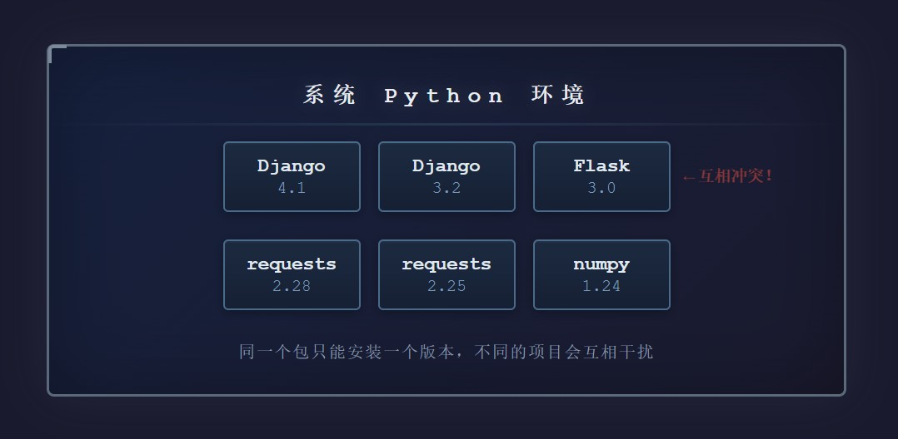
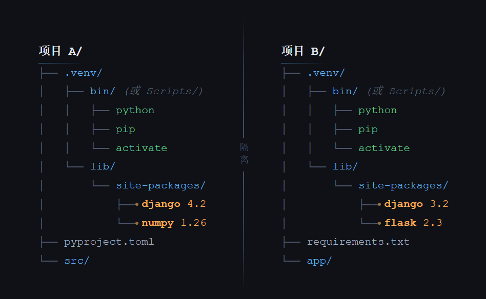
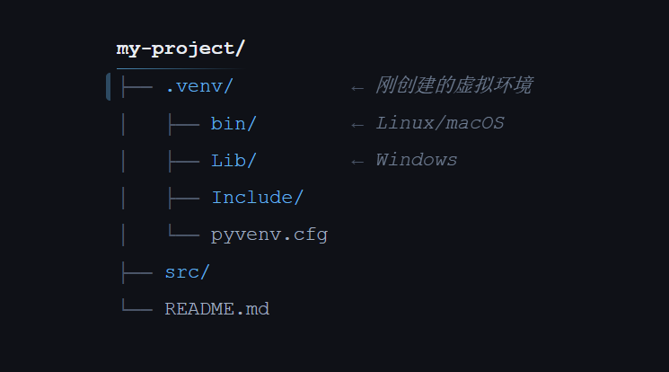
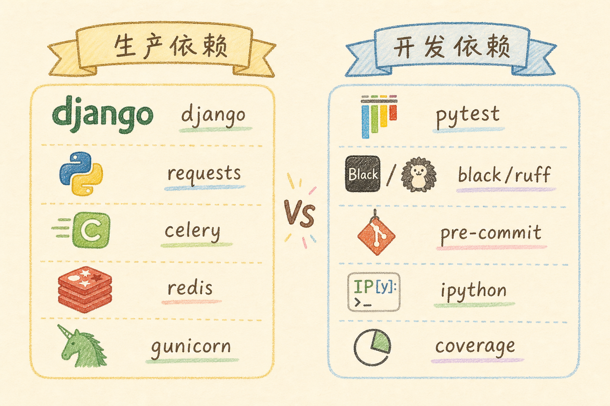


# Python 虚拟环境完全指南：从 venv 到 .venv，一文搞懂环境隔离

> 还在为 Python 项目的依赖冲突头疼？还在把全宇宙的包都装在系统环境里？这篇教程带你从零掌握虚拟环境：它是什么、为什么要用、怎么用 `venv` 创建和激活，以及 Poetry、uv 这类现代工具如何在底层帮你管理虚拟环境。

---

## 目录

1. [前言：一段血泪史](#1-前言一段血泪史)
2. [什么是虚拟环境](#2-什么是虚拟环境)
3. [venv：Python 官方出品](#3-venvpython-官方出品)
4. [现代工具导读：Poetry 和 uv](#4-现代工具导读poetry-和-uv)
5. [最佳实践建议](#5-最佳实践建议)
6. [常见问题与排错](#6-常见问题与排错)
7. [总结](#7-总结)

---

## 1. 前言：一段血泪史

想象这样一个场景：

你兴冲冲地用 `pip install requests` 装了爬虫库，写了个项目跑得飞起。两个月后，你接手了同事的项目，运行 `pip install -r requirements.txt`，结果报了一屏幕红字。你折腾了两个小时，发现同事的 Django 项目需要 Django 3.2，而你之前装的爬虫项目依赖 Django 4.1——两个版本在系统里打起来了。

这还没完。你又尝试装另一个项目，这次是 Flask 2.0 的项目，但系统里已经有了 Flask 3.0。你试图降级，发现降级后又破坏了其他项目……

**这就是「依赖地狱」（Dependency Hell）。**




Python 虚拟环境就是为解决这个问题而生的。它让你可以在同一台电脑上，为每个项目创建独立的、隔离的 Python 运行环境。每个环境都有自己的 `site-packages` 目录，互不干扰。

打个比方：

> 系统环境像是所有人共用一个冰箱——你的酸奶和同事的三明治塞在一起，很容易串味。虚拟环境则像是给每个人分配一个独立的小冰箱，你爱放什么放什么，不会影响到别人。

读完本文，你应该能做到三件事：

1. 解释虚拟环境为什么能隔离不同项目的依赖。
2. 用 `venv` 创建、激活、验证和删除一个本地 Python 环境。
3. 看懂 Poetry、uv 这类工具和虚拟环境的关系，知道何时该去读包管理教程。

本文只讲“依赖装在哪里、环境如何隔离”。至于“依赖版本怎么锁定、`pyproject.toml` 怎么写、Poetry/uv 怎么选”，请继续读系列第 4 篇：[Python 包管理与依赖锁定完全指南](4.python-package-management-tutorial.md)。

---

## 2. 什么是虚拟环境

### 2.1 核心原理

虚拟环境本质上是一个**包含独立 Python 解释器和第三方库目录的文件夹**。

当你创建一个虚拟环境时，它做了这几件事：

1. 在指定目录下复制（或链接）一份 Python 解释器
2. 创建一个独立的 `site-packages` 目录，用于存放第三方包
3. 修改激活脚本中的环境变量，让 `python` 命令指向这个隔离环境中的解释器



### 2.2 激活机制

「激活」虚拟环境并不神秘。它本质上就是**修改当前 shell 的环境变量**：

- `PATH` 变量前插入虚拟环境的 `bin/`（或 `Scripts/`）目录，这样在终端里输入 `python` 时，系统会优先找到虚拟环境里的 Python
- 设置 `VIRTUAL_ENV` 环境变量，指向虚拟环境根目录
- 修改命令提示符，在开头显示环境名称（如 `(venv)`）

退出虚拟环境时，这些修改会被还原。

### 2.3 虚拟环境 vs 容器

有读者可能会问：既然有 Docker，为什么还要用虚拟环境？

| 维度 | 虚拟环境（venv/.venv） | 容器 (Docker) |
|------|--------------------------|---------------|
| **隔离级别** | Python 包级别 | 操作系统级别 |
| **启动速度** | 毫秒级 | 秒级 |
| **资源占用** | 几十 MB | 几百 MB 起步 |
| **适用场景** | 本地开发、多项目管理 | 生产部署、服务编排 |
| **学习成本** | 低 | 中高 |

**它们不是非此即彼的关系，而是互补的。** 即使在 Docker 容器内，也推荐使用虚拟环境，因为容器的系统 Python 同样可能被多个进程共享。

这里的“虚拟环境”指 `.venv/` 这类隔离目录；Poetry、uv 是**管理虚拟环境和依赖的工具**，不是虚拟环境本身。

---

## 3. venv：Python 官方出品

`venv` 是 Python 3.3 起内置的标准库模块，无需额外安装。它是大多数 Python 开发者的入门选择。

### 3.1 快速上手

#### 创建虚拟环境

```bash
# 在项目根目录执行
python -m venv .venv
```

这条命令会在当前目录下创建一个名为 `.venv` 的文件夹。用 `.venv` 作为名称是社区约定俗成的惯例，因为以点开头的文件在 Linux/macOS 上默认隐藏，不会污染 `ls` 的输出。



几点说明：
- **目录名可以随意**，`.venv`、`venv`、`env` 都是常见选择，推荐 `.venv`
- **建议放在项目根目录**，方便 `.gitignore` 统一忽略
- 创建位置不影响功能，激活后在任何目录都能使用

#### 激活虚拟环境

不同操作系统和 Shell 的激活命令不同：

**Linux / macOS：**

```bash
source .venv/bin/activate
```

**Windows (CMD)：**

```cmd
.venv\Scripts\activate.bat
```

**Windows (PowerShell)：**

```powershell
.venv\Scripts\Activate.ps1
```

> **提示**：如果 PowerShell 报错「无法加载文件」，是因为执行策略限制。运行以下命令解除：
> ```powershell
> Set-ExecutionPolicy -ExecutionPolicy RemoteSigned -Scope CurrentUser
> ```

激活后，你的终端提示符前面会出现 `(.venv)` 标识：

```bash
(.venv) user@machine:~/my-project$
```

这说明你已经进入了虚拟环境，接下来所有的 `pip install` 都会安装到这个隔离环境中。

#### 验证环境

```bash
# 确认 python 路径指向虚拟环境
(.venv) $ which python
/home/user/my-project/.venv/bin/python

# Windows 上使用 where 命令
(.venv) > where python
C:\Users\user\my-project\.venv\Scripts\python.exe
```

#### 退出虚拟环境

```bash
deactivate
```

### 3.2 安装和管理依赖

#### 安装包

```bash
# 激活环境后直接 pip install
# 安装 requests 包，不指定版本 → pip 会装 PyPI 上最新的稳定版
pip install requests
# 安装 Django，版本固定为 4.2.0（== 表示精确匹配该版本）
pip install django==4.2
# 安装 Flask，版本要求在 2.0 及以上、3.0 以下（即任意 2.x 版）
# 引号是为了防止 shell 把 < 当成重定向符号
pip install "flask>=2.0,<3.0"
```

#### 查看已安装的包

```bash
pip list

# 输出示例：
# Package    Version
# ---------- -------
# Django     4.2.0
# pip        23.0
# requests   2.31.0
```

#### 导出依赖列表

```bash
# 导出到 requirements.txt
pip freeze > requirements.txt
```

`requirements.txt` 文件内容示例：

```
asgiref==3.7.2
Django==4.2.0
requests==2.31.0
sqlparse==0.4.4
```

> **注意**：`pip freeze` 会导出**所有**当前环境中的包，包括依赖的依赖。这意味着 `requirements.txt` 里会有很多你并没有「主动」安装的包。

#### 从 requirements.txt 安装

```bash
pip install -r requirements.txt
```

### 3.3 requirements.txt 的进阶用法

对于简单项目，一个 `requirements.txt` 就够了。但如果项目的依赖关系更复杂，你可以这样组织：

```
project/
├── requirements/
│   ├── base.txt        # 所有环境共用的依赖
│   ├── dev.txt         # 开发环境额外依赖（如 pytest, black）
│   └── prod.txt        # 生产环境额外依赖（如 gunicorn）
└── .venv/
```

**base.txt：**

```
Django==4.2.0
requests==2.31.0
python-dotenv==1.0.0
```

**dev.txt：**

```
# 继承 base.txt
-r base.txt

# 开发工具
pytest==7.4.0
black==23.7.0
ruff==0.0.285
ipython==8.14.0
```

**prod.txt：**

```
# 继承 base.txt
-r base.txt

# 生产服务器
gunicorn==21.2.0
```

这样，开发时安装 `dev.txt`，部署时安装 `prod.txt`，灵活且清晰。

### 3.4 venv 的优缺点

**优点：**
- 内置，无需额外安装
- 简单直接，学习成本极低
- 轻量，创建速度快

**缺点：**
- 依赖解析能力弱——`pip` 不会自动解决冲突，只会报错
- 锁定文件不规范——`requirements.txt` 不是标准化的锁文件格式（它本质是依赖清单，不是锁文件）
- 没有项目元数据管理——项目名称、版本、描述等无处安放
- 手动管理 dev/prod 依赖较繁琐

> **锁文件（lock file）** 用来固定依赖版本，让不同机器尽量装出一致环境；详细原理放到第 4 篇讲。


---

## 4. 现代工具导读：Poetry 和 uv

学会 `venv` 后，你已经理解了虚拟环境的底层概念。接下来遇到 Poetry、uv 时，不要把它们看成“另一种神秘环境”，它们本质上也是在帮你创建和使用项目专属环境，只是顺手把依赖声明、锁文件、命令运行也一起管了。

| 工具 | 和虚拟环境的关系 | 本篇只需记住 |
|------|------------------|--------------|
| `venv` | Python 内置，只负责创建隔离环境 | 适合入门和最小项目 |
| Poetry | 自动创建/选择虚拟环境，并用 `poetry run` 在里面执行命令 | 更像完整项目管理工具 |
| uv | 自动创建 `.venv`，并用 `uv run` / `uv sync` 管理环境 | 新项目常用，速度很快 |

**Poetry**：现代 Python 项目管理工具，会把项目元信息、依赖声明、锁文件集中管理。它仍然会使用虚拟环境，只是通常不用你手动 `python -m venv`。

下面的命令只是让你看懂 Poetry 的基本使用形态；真正运行前，需要先安装 Poetry，并在包含 `pyproject.toml` 的项目根目录执行。

```bash
poetry install
poetry run python app.py
```

**uv**：新一代 Python 工具链，常见工作流是 `uv sync` 安装依赖，`uv run` 在项目环境里运行命令。没有环境时，它会自动创建 `.venv`。

下面同样只是导读示例；真正运行前，需要先安装 uv，并在 uv 项目根目录执行。

```bash
uv sync
uv run python app.py
```

本篇到这里点到为止。真正的工具选型、`pyproject.toml`、`poetry.lock`、`uv.lock`、依赖升级、安全审计，放在第 4 篇系统讲：[Python 包管理与依赖锁定完全指南](4.python-package-management-tutorial.md)。

---

## 5. 最佳实践建议

### 5.1 总是使用虚拟环境

无论项目大小，永远不要直接在系统 Python 中 `pip install`。

尤其不要加 `sudo` 去装包：它可能改动系统 Python，甚至影响操作系统或其他工具依赖的 Python 包。

```bash
# ❌ 永远不要这样做
sudo pip install django

# ✅ 总是先创建虚拟环境
python -m venv .venv
source .venv/bin/activate
pip install django
```

### 5.2 将虚拟环境目录加入 .gitignore

```gitignore
# .gitignore
.venv/
venv/
env/
__pycache__/
*.pyc
```

虚拟环境目录通常很大（几百 MB），且包含平台相关的二进制文件，绝不应该提交到版本控制中。

### 5.3 知道虚拟环境不等于锁文件

虚拟环境只解决“依赖装在哪里”：它把包装进当前项目的 `.venv/`，不污染系统 Python。

但它不自动解决“到底装哪个版本”：如果你今天装到 `requests==2.31.0`，同事明天可能装到 `requests==2.32.0`。要让团队装出完全一致的版本，需要锁文件。

```txt
# ❌ 只写包名：不同时间可能装到不同版本
requests

# ⚠️ 有范围约束：限制大版本，但仍可能漂移
requests>=2.25,<3.0

# ✅ 精确锁定：更适合可复现环境
requests==2.31.0
```

深入的 `pip-tools`、`poetry.lock`、`uv.lock`、依赖升级和安全审计，请看第 4 篇：[Python 包管理与依赖锁定完全指南](4.python-package-management-tutorial.md)。

### 5.4 区分运行环境和开发工具

初学者先记住：不是所有开发时用到的包，生产环境都需要。

```bash
# 运行项目需要的包
pip install django

# 只在开发时用的工具
pip install pytest ruff
```

真正的生产/开发依赖分组，通常由 Poetry、uv 或 pip-tools 维护，本篇只要求你理解“这些包虽然都装在虚拟环境里，但用途不同”。具体怎么在 Poetry/uv 里分开声明，见下文 §7.1。

### 5.5 项目结构模板

一个规范的 Python 项目结构看起来像这样：

```
my-project/
├── .venv/                 ← 虚拟环境（不提交）
├── .gitignore
├── requirements.txt       ← 入门项目常见依赖清单
├── README.md
├── src/                   ← 源代码
│   └── my_project/
│       ├── __init__.py
│       ├── main.py
│       └── utils.py
├── tests/                 ← 测试
│   ├── __init__.py
│   └── test_main.py
└── scripts/               ← 辅助脚本
	    └── setup_db.py
```

如果项目已经使用 Poetry 或 uv，目录里通常会有 `pyproject.toml` 和对应锁文件；它们的细节放到第 4 篇讲。

### 5.6 团队协作清单

用最基础的 `venv + requirements.txt` 工作流，新成员加入项目时应该这样跑起来：

```bash
# 1. 克隆仓库
git clone https://github.com/team/my-project.git
cd my-project

# 2. 创建并激活虚拟环境
python -m venv .venv
source .venv/bin/activate

# 3. 安装依赖并运行
pip install -r requirements.txt
python src/my_project/main.py
```

Windows PowerShell 激活命令换成：

```powershell
.venv\Scripts\Activate.ps1
```

**关键点**：`.venv/` 不提交，`requirements.txt` 要提交。这样每个人都在自己的虚拟环境里安装同一份依赖清单。

---

## 6. 常见问题与排错

### Q1：激活虚拟环境后，pip install 还是装到了系统目录？

**原因**：可能是激活脚本没有正确执行，或者使用了 `sudo`。

**解决**：

```bash
# 检查 python 和 pip 路径
which python
which pip

# 确认它们指向 .venv 目录下的可执行文件
# 如果指向系统路径，重新激活
deactivate
source .venv/bin/activate

# 另一个办法：不使用激活，直接用虚拟环境的绝对路径
.venv/bin/pip install requests
```

### Q2：虚拟环境创建时用了错误的 Python 版本？

创建虚拟环境时，`python -m venv .venv` 使用的是当前命令里的 `python`。如果它不是你想要的版本，先确认 Python 路径：

```bash
python --version
which python

# 指定某个 Python 创建环境
python3.12 -m venv .venv
```

Windows 可以用 `py` 启动器指定版本：

```powershell
py -3.12 -m venv .venv
```

### Q3：虚拟环境可以移动或重命名吗？

**不建议。** 虚拟环境里的脚本硬编码了路径。如果你移动了项目文件夹，虚拟环境大概率会坏掉。

**正确做法**：删除旧虚拟环境，在新位置重新创建一个。

```bash
rm -rf .venv
python -m venv .venv
pip install -r requirements.txt
```

uv 是例外——它的虚拟环境可以重新定位，因为你通常用 `uv run` 而不是依赖硬编码路径。

### Q4：`requirements.txt` 和 `pyproject.toml` 可以共存吗？

可以，但初学者不要一开始就同时维护两套。建议先选一种权威来源：

- 只用 `venv + pip`：先维护 `requirements.txt`
- 用 Poetry/uv：以 `pyproject.toml` 和锁文件为准

迁移期可以共存，但要在 README 里写清楚“谁是权威”，否则很容易两边版本漂移。

### Q5：CI/CD 中如果使用虚拟环境，应该注意什么？

CI 里通常不需要手动“激活”虚拟环境；更稳定的做法是直接调用虚拟环境里的 Python 或 pip。

```yaml
- name: Set up Python
  uses: actions/setup-python@v5
  with:
    python-version: '3.12'

- name: Create virtual environment
  run: python -m venv .venv

- name: Install dependencies
  run: .venv/bin/pip install -r requirements.txt

- name: Run tests
  run: .venv/bin/python -m pytest
```

如果你的项目使用 Poetry 或 uv，CI 配置会更简单；具体写法见第 4 篇。

### Q6：我的项目依赖了需要编译的包（如 psycopg2），在 Windows 上装不上？

这类包通常有预编译的 wheel 文件。如果没有，你需要安装对应的 C 编译器。

一个更省心的选择是找替代品：

```bash
# psycopg2（需要编译）→ psycopg2-binary（预编译）
pip install psycopg2-binary

# 或者使用新版 psycopg 3.x 的二进制安装方式
pip install "psycopg[binary]"
```

如果你的项目已经使用 uv，对应命令是 `uv add psycopg2-binary` 或 `uv add "psycopg[binary]"`；具体工具选择见第 4 篇。

---

## 7. 总结

### 7.1 生产依赖与开发依赖

用 Poetry 或 uv 时，**运行服务需要的包**和**仅开发/测试用的工具**应分开声明，避免把 pytest、ruff 打进生产镜像。



对照上图：左侧是部署后用户会间接依赖的库（如 django、requests），右侧是只有开发者本机需要的工具（如 pytest、black）。常见写法：

```bash
# Poetry
poetry add django              # 生产依赖
poetry add --group dev pytest  # 开发依赖

# uv
uv add django                  # 生产依赖
uv add --dev pytest            # 开发依赖
```

让我们回顾一下虚拟环境的核心认知：

| 概念 | 一句话记忆 |
|------|------------|
| 虚拟环境 | 给每个项目一个独立的 Python 小房间 |
| `.venv/` | 项目自己的解释器和第三方包目录 |
| 激活环境 | 临时修改当前终端的 `PATH`，让 `python` 指向 `.venv` |
| `requirements.txt` | 入门项目常见依赖清单，但不是严格锁文件 |
| Poetry / uv | 更现代的工具，会自动管理虚拟环境和依赖版本 |

- **先学 `venv`**：它是理解所有 Python 项目环境问题的基础。
- **不要提交 `.venv/`**：虚拟环境是本机产物，应该加入 `.gitignore`。
- **区分环境和版本锁定**：虚拟环境解决“装在哪里”，锁文件解决“装哪个版本”。

最后，记住最重要的原则：**任何 Python 项目都应该有自己的隔离环境。** 学会这一点，再读第 4 篇的包管理与依赖锁定，就会顺很多。

---

## 延伸阅读

- [Python venv 官方文档](https://docs.python.org/3/library/venv.html)
- [Python 包管理与依赖锁定完全指南](4.python-package-management-tutorial.md)
- [Python Packaging User Guide](https://packaging.python.org/)

---

*本文写于 2026 年 6 月。示例以 Python 3.12 和标准库 `venv` 为主；Poetry、uv 等工具的细节请以第 4 篇和官方文档为准。*
