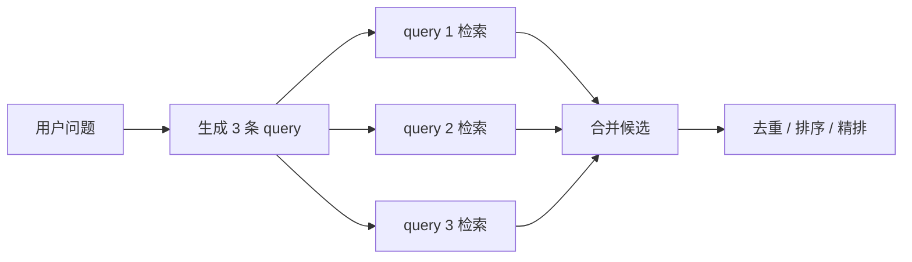
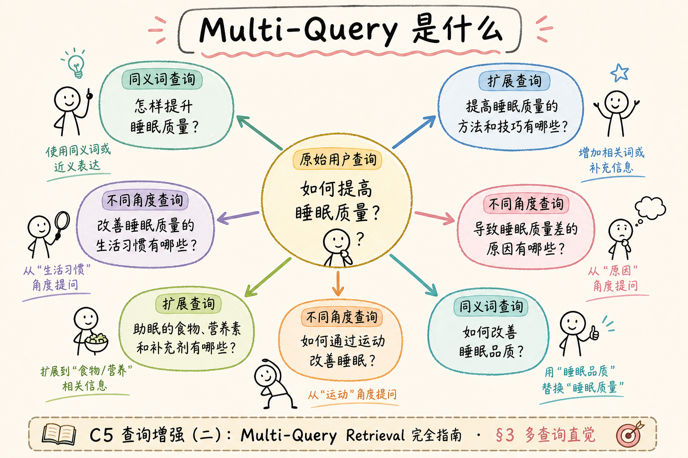
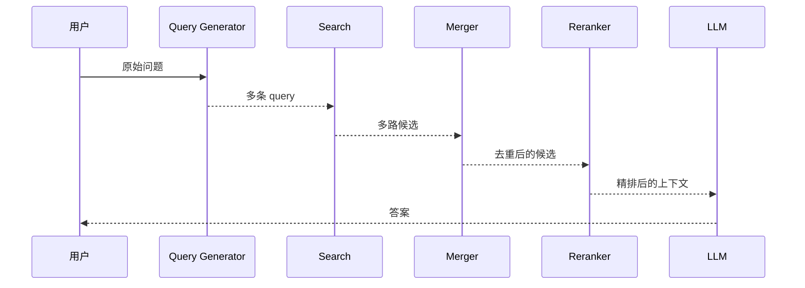
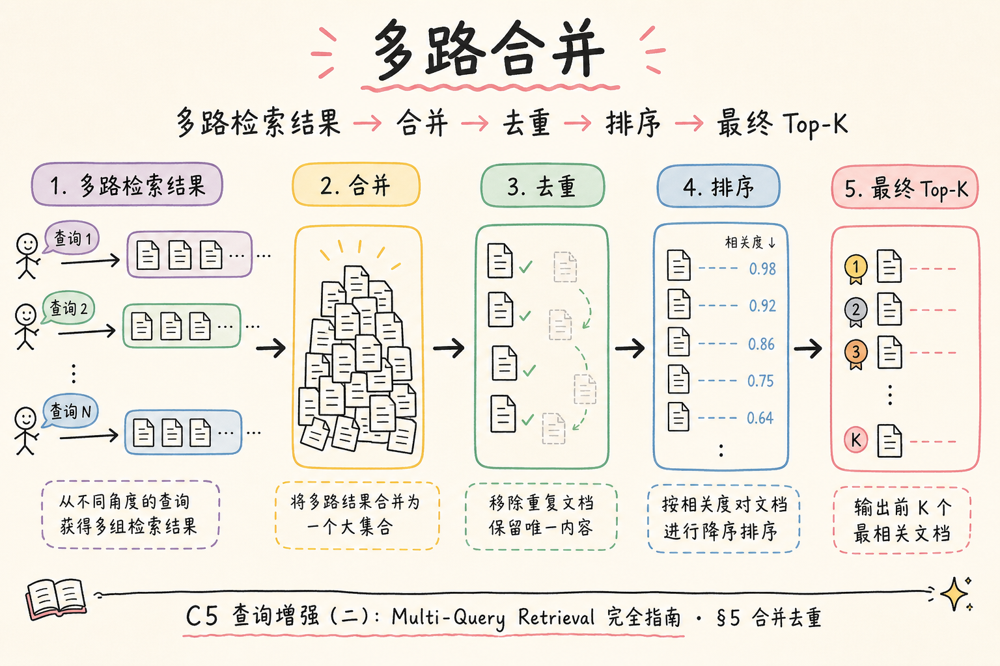
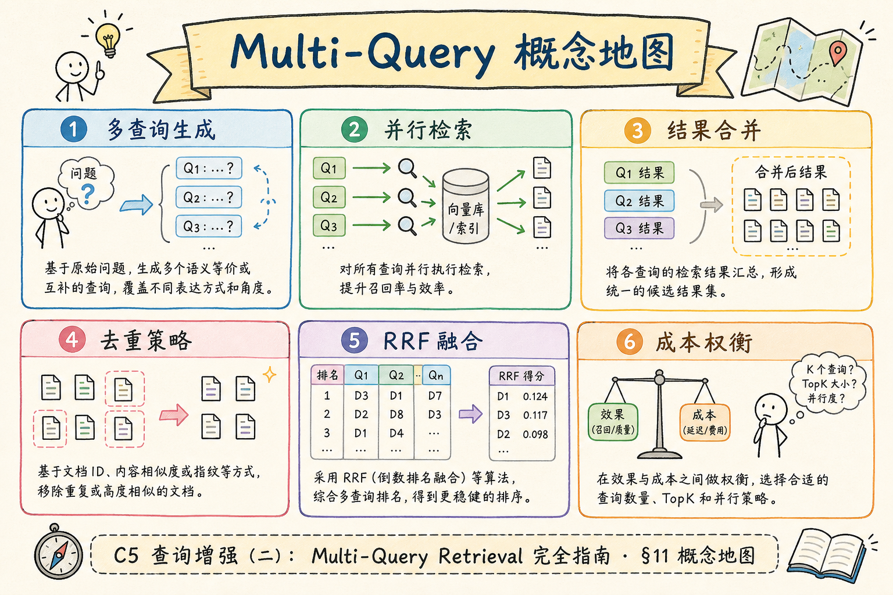

# C5 查询增强（二）：Multi-Query Retrieval 多查询检索入门

用户的一个问题，可能有多种表达角度。只用一条 query 检索时，如果这条 query 没踩中文档关键词，就会漏掉资料。**Multi-Query Retrieval**（多查询检索）就是为同一个问题生成多条不同 query，分别检索后再合并结果。

本文面向已经了解查询改写和混合检索的初学者。读完后，你应该能生成子 query、合并去重检索结果，并知道什么时候应该关闭多查询。

Multi-Query 在企业 RAG 里很常见：制度文档用词正式，用户提问口语化，单条 query 往往只踩中一种说法。它和 HyDE、查询分解可以组合，但初学者应先单独验证「多 query 是否比单 query 更稳」，再叠其他增强。下文按「问题 → 生成 → 合并 → 上线」顺序展开，并在文末给出可勾选的检查清单。

## 目录

- [1. 多查询检索解决什么问题](#1-多查询检索解决什么问题)
- [2. 它和查询改写有什么区别](#2-它和查询改写有什么区别)
- [3. 在 RAG 链路中的位置](#3-在-rag-链路中的位置)
- [4. 子 query 怎么生成](#4-子-query-怎么生成)
- [5. 合并、去重和排序](#5-合并去重和排序)
- [6. 最小 Python 示例](#6-最小-python-示例)
- [7. 成本、延迟和开关](#7-成本延迟和开关)
- [8. 常见错误](#8-常见错误)
- [9. FAQ](#9-faq)
- [10. 总结](#10-总结)

## 1. 多查询检索解决什么问题

多查询检索解决的是“同一个意图有多种说法”的问题。

例如用户问：

```text
出差住酒店公司最多给报多少？
```

可以生成多条 query：

```text
差旅住宿费报销标准
酒店住宿报销上限
出差住宿费用报销政策
```

这些 query 语义接近，但关键词不同。它们分别检索，能提高召回机会。



多查询的目标是提高召回，不是让模型提前回答问题。

### 1.1 什么时候值得开 Multi-Query

| 信号 | 说明 |
| --- | --- |
| 单 query recall@k 偏低 | 评测集上常漏正确 chunk，但人工看文档里其实有答案 |
| 用户说法与文档术语差距大 | 如「报账」「报销」「费用标准」混用 |
| 混合检索里 BM25 与向量各漏一半 | 多 query 相当于多开几个检索入口 |
| 问题本身是单一事实、关键词明确 | 通常不必开，延迟和噪声不划算 |

若你的知识库 chunk 很短、专有名词固定（错误码、条款编号），往往应优先调 BM25 或 metadata filter（见 [88](88.metadata-filter-retrieval-tutorial.md)），而不是先叠多 query。

## 2. 它和查询改写有什么区别

查询改写通常输出一条更好的 query；多查询检索输出多条不同角度的 query。

| 技术 | 输出数量 | 适合问题 |
| --- | --- | --- |
| Query Rewriting | 1 条 | 用户说法口语，需要正式化 |
| Multi-Query Retrieval | 多条 | 可能有多个同义表达或检索入口 |
| Query Decomposition | 多个子问题 | 原问题本身是复合问题 |

如果用户问“住宿费标准”，多查询可以生成“酒店报销上限”“差旅住宿标准”等同义 query。  
如果用户问“北京住宿上限和机票舱位限制分别是什么”，这更像查询分解，因为里面有两个子问题。

## 3. 在 RAG 链路中的位置

多查询通常放在检索前，合并结果后再进入精排。





这里要注意：多查询会增加检索次数。3 条 query 就是至少 3 次检索，如果还叠加 BM25 和向量检索，成本和延迟都会上升。

## 4. 子 query 怎么生成

子 query 要“角度不同，但意图一致”。不要生成互相矛盾的问题。

一个可用 Prompt：

```text
请为下面用户问题生成 3 条用于企业制度文档检索的查询语句。
要求：
1. 每条 query 保留原始意图。
2. 使用不同表达角度或业务术语。
3. 不要回答问题，不要编造具体数字。
4. 每行一条。

用户问题：{question}
```

解析时要做护栏：

| 护栏 | 原因 |
| --- | --- |
| 最多 3-5 条 | 控制延迟和成本 |
| 每条长度有限 | 避免变成长解释 |
| 去掉重复 query | 避免浪费检索 |
| 保留原始问题 | 原 query 也可能最好 |

生成后建议打日志：`original_question`、`generated_queries[]`、`deduped_count`。线上若 recall 突然变差，先看子 query 是否跑题或高度重复，而不是先怀疑向量库。

### 案例

某企业差旅 RAG：用户问「出差住酒店公司最多给报多少？」。单 query 向量检索 top-5 里只有「差旅总则」概述页，没有具体住宿上限段落。开启 Multi-Query 后生成三条子 query：`差旅住宿费报销标准`、`酒店住宿报销上限`、`出差住宿费用报销政策`。BM25 路在第二条命中 `travel-2025#012`（含「一线城市 600 元/晚」），向量路在第一条命中同 chunk 的相邻段。合并去重后该 chunk 保留最高分进入精排，最终答案能引用具体数字。这个 case 说明：多 query 的价值是「换关键词入口」，不是让 LLM 先猜答案。

### 先错对已

```text
-- ❌ 只生成子 query，不保留原始问题
-- 问题：用户原句有时 BM25 分最高，丢掉会漏召回

-- ✅ queries = [question] + generate_queries(question)[:3]

-- ❌ 三条 query 仅换标点：「住宿上限？」「住宿上限」「住宿上限吗」
-- 问题：三路结果几乎相同，延迟三倍、收益为零

-- ✅ 要求不同业务术语：「住宿费标准」「酒店报销上限」「差旅住宿政策」
```

另一条常见错误：子 query 每条 `top_k=20`、共 5 条 query，合并后上百候选直接进 prompt，上下文被噪声占满。应先每路 `top_k=5～10`，合并去重后再 RRF 或 rerank 到 20～30 条。

## 5. 合并、去重和排序

多路检索会返回重复 chunk。合并时必须按稳定 id 去重，例如 `chunk_id`。



最简单策略：同一个 chunk 多次出现时，保留最高分。

```python
def merge_hits(hit_lists: list[list[dict]]) -> list[dict]:
    merged: dict[str, dict] = {}
    for hits in hit_lists:
        for hit in hits:
            chunk_id = hit["chunk_id"]
            if chunk_id not in merged or hit["score"] > merged[chunk_id]["score"]:
                merged[chunk_id] = hit
    return sorted(merged.values(), key=lambda x: x["score"], reverse=True)
```

这段代码的关键是 `chunk_id`。不要用文本内容做去重，因为同一段文字可能有空格、标点或格式差异。

更成熟的系统可以用 RRF 融合排序（见 [94](94.rrf-fusion-tutorial.md)），再接 cross-encoder reranker 做精排（见 [95](95.cross-encoder-rerank-tutorial.md)）。

合并时还可记录「该 chunk 被几条 query 命中」作为次要信号：多次命中且分数都不低，往往说明 chunk 与意图确实相关；但只能作 tie-break，不能替代精排。若同 chunk 被 5 条几乎相同的 query 命中，说明生成阶段失败，应回查 Prompt 或做 query 相似度过滤（余弦 > 0.95 的丢弃一条）。

## 6. 最小 Python 示例

下面示例用假检索函数演示完整流程。

```python
def generate_queries(question: str) -> list[str]:
    return [
        question,
        "差旅住宿费报销标准",
        "酒店住宿报销上限",
    ]


def retrieve(query: str) -> list[dict]:
    fake_db = {
        "差旅住宿费报销标准": [{"chunk_id": "c1", "score": 0.91, "text": "一线城市住宿上限 600 元"}],
        "酒店住宿报销上限": [{"chunk_id": "c1", "score": 0.88, "text": "一线城市住宿上限 600 元"}],
    }
    return fake_db.get(query, [])


question = "出差住酒店公司最多给报多少？"
queries = generate_queries(question)
hit_lists = [retrieve(query) for query in queries]
merged = merge_hits(hit_lists)

print(queries)
print(merged)
```

预期结果里 `c1` 只出现一次，并保留最高分 0.91。这个例子展示了多查询的最小闭环：生成、检索、合并、去重。

## 7. 成本、延迟和开关

多查询会扩大检索面，也会增加成本。上线前至少要记录：

| 指标 | 用途 |
| --- | --- |
| query 数量 | 估算检索放大倍数 |
| 召回率变化 | 判断是否真的更好 |
| 延迟变化 | 判断用户是否能接受 |
| 命中重复率 | 重复过高说明 query 太相似 |
| 最终答案质量 | 避免只提高召回但答案变差 |

建议保留开关：

```python
def retrieve_for_question(question: str, enable_multi_query: bool) -> list[dict]:
    queries = generate_queries(question) if enable_multi_query else [question]
    return merge_hits([retrieve(query) for query in queries])
```

如果线上延迟飙升或召回噪声增加，可以先关掉多查询，而不是临时改代码。

建议把 `enable_multi_query` 与问题类型绑定：FAQ 单事实题默认关，开放问法、制度解读类默认开。灰度时用同一批 query 对比开关前后的 `recall@k`、P95 延迟和答案人工评分，避免凭感觉全量开启。

### 评测

不必一开始上千条。从业务日志或 FAQ 抽 30～50 条，人工标注期望 `chunk_id`，对比单 query 与 Multi-Query：

| 指标 | 说明 |
| --- | --- |
| recall@k | 合并去重后 top-k 是否含标注 chunk |
| 重复率 | 多路 hit 中相同 chunk_id 占比；过高说明 query 太像 |
| P95 延迟 | 含 LLM 生成子 query + N 次检索 |
| 答案完整度 | 人工看是否更易引用正确条款 |

调参顺序：固定 `top_k` 与合并策略 → 只调子 query 条数（2～4）→ 再试是否叠加 HyDE 或改写。每次只改一个旋钮，否则无法归因。把 `queries[]`、合并后 `chunk_ids[]` 写入结构化日志（[190](190.structured-logging-rag-tutorial.md)），便于对比改版前后。

## 8. 常见错误

这一节列出多查询检索最常见的问题。判断标准不是“生成 query 越多越好”，而是最终上下文是否更准。

### 8.1 子 query 互相重复

三条 query 只是换了标点或语序，检索结果会高度重复。应要求不同业务术语或不同角度。

### 8.2 子 query 改变原意

用户问住宿费，子 query 变成餐补标准，就是错误扩展。多查询只能扩表达，不能扩需求。

### 8.3 合并后不去重

重复 chunk 会挤占上下文窗口，让答案引用变窄。必须按 chunk_id 去重。

### 8.4 不控制 top_k

5 条 query 每条取 20 个结果，会产生 100 个候选。后续精排、上下文预算都会变重。

### 8.5 没有按问题类型开启

简单问题可能不需要多查询。应通过评测决定哪些类型收益明显。

### 排错

1. **开了多 query 但 recall 不变**：打印各子 query 的 top-3，若 chunk 集合高度重叠，说明生成无效；收紧 Prompt 或加语义去重。
2. **recall 升、答案反而胡编**：合并后候选噪声变多，精排或 score threshold（[99](99.score-threshold-tutorial.md)）未跟上；先缩小每路 top_k。
3. **延迟翻倍**：子 query 条数过多或串行检索；改并行检索、限制最多 3 条，并缓存同一 session 内相同问题的子 query。
4. **某类问题稳定变差**：子 query 改变原意（如把「住宿」扩成「餐补」）；加护栏：子 query 与原文 embedding 相似度低于阈值则丢弃。
5. **合并后 chunk 重复出现**：未按 `chunk_id` 去重，或去重用文本而非 id；统一稳定 id 策略（见 [57](57.fixed-size-chunking-tutorial.md) 入库规范）。

## 9. FAQ

**Q1：多查询一定比单查询好吗？**  
不一定。它提高召回机会，但也可能引入噪声和延迟。要用评测集验证。

**Q2：生成几条 query 合适？**  
初学阶段建议 3 条以内，加上原始问题。超过 5 条通常要非常谨慎。

**Q3：多查询和 HyDE 能一起用吗？**  
可以，但成本更高。建议先单独评测，再组合，不要一次叠满所有增强。

**Q4：精排前保留多少候选？**  
取决于上下文预算和 reranker 成本。常见做法是多路召回后保留 20-50 个候选进入精排。

## 10. 总结

Multi-Query Retrieval 的价值是用多种表达方式提高召回。它适合用户表达模糊、文档术语多样、单 query 容易漏召回的场景。



初学者先做到四点：

1. 子 query 保留同一意图，只换表达角度。
2. 控制 query 数量和每路 top_k。
3. 合并时按 chunk_id 去重。
4. 记录召回、延迟、重复率和答案质量。

多查询不是默认越多越好。只有当它稳定提高最终答案质量时，才值得开启。

### 本篇检查清单

- [ ] 子 query 保留原意，且与原始问题一并参与检索
- [ ] 子 query 条数 ≤ 5，每条长度与 top_k 受控
- [ ] 合并按 `chunk_id` 去重，保留最高分或 RRF 融合
- [ ] 有 `enable_multi_query` 开关，并打过 30+ 条对比 recall 与延迟
- [ ] 日志含 `generated_queries` 与合并后 `chunk_ids`，出问题可回放

下一步可读 [102 HyDE](102.hyde-tutorial.md)（短问句向量检索不稳时）或 [103 查询分解](103.query-decomposition-tutorial.md)（一句多子问题时），三者边界不要混用。
