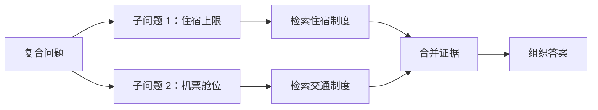
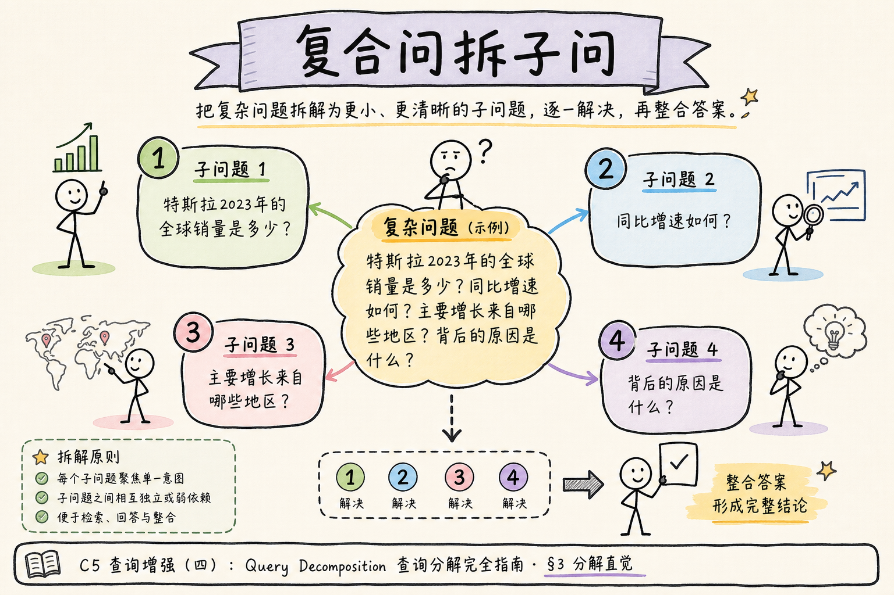
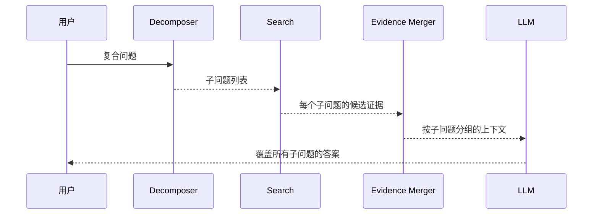
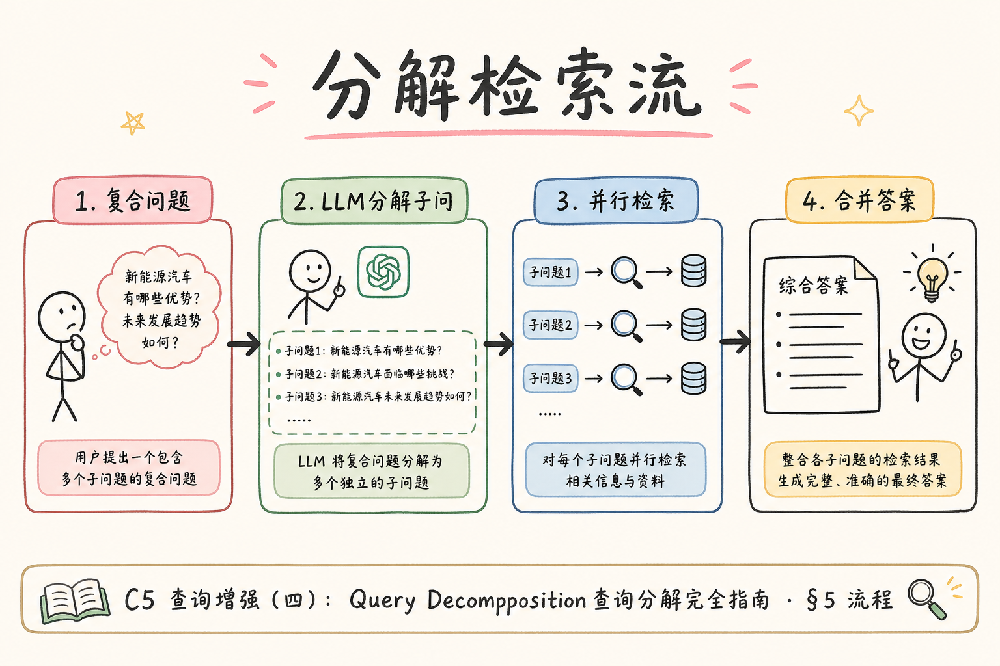
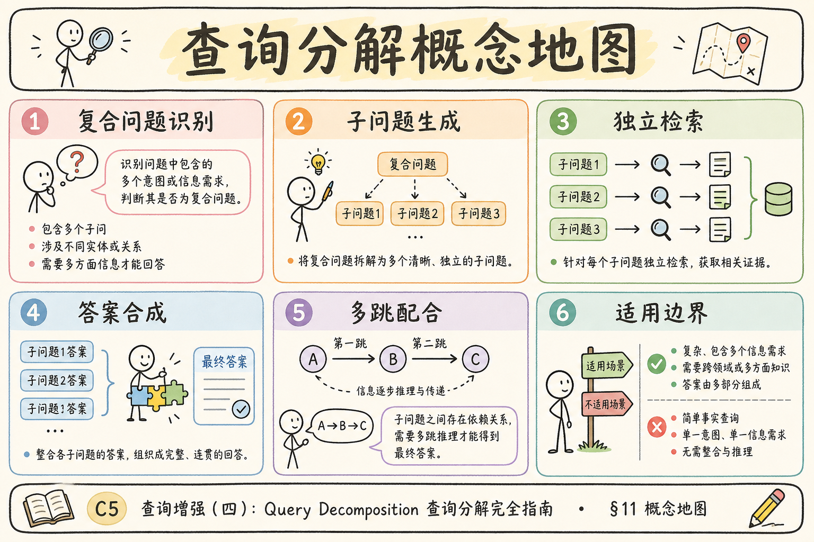

# C5 查询增强（四）：Query Decomposition 查询分解入门

用户有时会把多个问题塞进一句话里，比如“出差住宿上限是多少，机票能报商务舱吗？”如果直接拿整句去检索，系统可能只命中其中一部分。**Query Decomposition**（查询分解）就是把复合问题拆成多个独立子问题，分别检索，再合并证据。

本文面向已经了解 Multi-Query Retrieval 的初学者。读完后，你应该能判断什么问题需要分解，写出最小分解器，并知道它和多查询检索、多跳检索的边界。

查询分解针对「一句多问」：子问题之间通常可并行检索，互不依赖。它与 Multi-Query 的区别在于意图个数，与多跳的区别在于是否存在「后一跳必须知道前一跳实体」。下文给出 Prompt、分组合并与升级多跳的判断标准。

## 目录

- [1. 查询分解解决什么问题](#1-查询分解解决什么问题)
- [2. 它和 Multi-Query 的区别](#2-它和-multi-query-的区别)
- [3. 在 RAG 链路中的位置](#3-在-rag-链路中的位置)
- [4. 子问题怎么生成](#4-子问题怎么生成)
- [5. 分路检索与证据合并](#5-分路检索与证据合并)
- [6. 最小 Python 示例](#6-最小-python-示例)
- [7. 何时升级到多跳检索](#7-何时升级到多跳检索)
- [8. 常见错误](#8-常见错误)
- [9. FAQ](#9-faq)
- [10. 总结](#10-总结)

## 1. 查询分解解决什么问题

查询分解解决的是“一个问题里有多个信息需求”的问题。

例如：

```text
北京出差住宿上限是多少，机票能报商务舱吗？
```

这句话至少包含两个子问题：

```text
北京出差住宿费报销上限是多少？
机票商务舱是否可以报销？
```

如果不拆开，检索器可能只找到住宿制度，漏掉机票舱位规则。



查询分解的目标是提高覆盖率，让答案不漏项。

若只回答第一个子问题，用户会觉得系统「没听全」。分解后的检索次数等于子问题数，成本与 Multi-Query 类似，但合并策略不同：这里要按子问题分组，而不是简单按 chunk 分数合并成一堆。

## 2. 它和 Multi-Query 的区别

Multi-Query 是“同一意图，多种说法”；Query Decomposition 是“多个意图，拆开处理”。

| 技术 | 例子 | 输出 |
| --- | --- | --- |
| Multi-Query | “住宿费上限？”生成“酒店报销标准”“差旅住宿标准” | 多条同义 query |
| Query Decomposition | “住宿上限和机票舱位？” | 多个子问题 |

判断方法很简单：如果每条 query 的答案应该相同，多半是 Multi-Query；如果每个子问题要回答不同事实，就是 Query Decomposition。

## 3. 在 RAG 链路中的位置

查询分解发生在检索前，但它的合并发生在检索后。





重点是“按子问题分组”。不要把所有证据简单混在一起，否则回答模型也可能漏项。

## 4. 子问题怎么生成

一个可用 Prompt：

```text
请把用户问题拆成可以独立检索的子问题。
要求：
1. 只在问题包含多个信息需求时拆分。
2. 每个子问题必须能单独检索。
3. 不要改变原意，不要新增用户没有问的主题。
4. 输出 JSON 数组。

用户问题：{question}
```

示例输出：

```json
[
  "北京出差住宿费报销上限是多少？",
  "机票商务舱是否可以报销？"
]
```

生成后要做校验：子问题数量不要太多；子问题不能脱离原始问题；过短或重复的子问题要合并。

规则分解可处理「A 和 B」「A，B 分别是什么」等固定句式；复杂自然语言（嵌套条件、对比、排除）再交给 LLM，并限制输出 JSON schema。分解器返回单元素数组时，应退化为普通单跳检索，避免无意义多路开销。

### 案例

用户问：「北京出差住宿上限是多少，机票能报商务舱吗？」不分解时，向量检索 top-5 几乎全是差旅住宿制度，机票舱位 chunk 未进候选。分解为两个子问题后并行检索：住宿路命中「北京 600 元/晚」，机票路命中「普通员工经济舱，商务舱需审批」。回答 Prompt 要求按子问题逐项作答，最终输出两段，漏项率明显下降。若把两路 hits 混成一条列表而不分组，模型常只答住宿、忽略机票——分组是分解场景比 Multi-Query 更关键的一步。

### 先错对已

```text
-- ❌ 把「住宿费上限」和「酒店报销标准」拆成两个子问题
-- 问题：同一意图的多说法，应走 Multi-Query，不是分解

-- ✅ 只有「答案应对不同事实」时才分解：住宿上限 vs 机票舱位

-- ❌ 合并：merged = flatten(all_hits) 后直接进 prompt
-- 问题：模型易漏答后几个子问题

-- ✅ groups = [{question, hits}, ...]，Prompt 要求逐项覆盖
```

## 5. 分路检索与证据合并

每个子问题单独检索，再按子问题保存证据。



```python
def retrieve_grouped(sub_questions: list[str]) -> list[dict]:
    groups = []
    for sub_q in sub_questions:
        hits = retrieve(sub_q, top_k=3)
        groups.append({"question": sub_q, "hits": hits})
    return groups
```

回答 Prompt 应明确要求逐项回答：

```text
请根据下面按子问题分组的资料回答用户原问题。
要求：
1. 每个子问题都要回答。
2. 如果某个子问题资料不足，明确说“不确定”。
3. 不要用子问题 A 的资料回答子问题 B。
```

这样能降低“只回答第一个子问题”的概率。

上下文 token 预算建议按子问题均分：每个子问题先取 top-2～3 chunk，再整体裁剪，避免第一个子问题占满窗口。资料不足时，该子问题段落应写「未检索到相关规定」，不要用其他子问题的证据硬凑。

## 6. 最小 Python 示例

下面示例用规则模拟分解和检索。

```python
def decompose(question: str) -> list[str]:
    if "，" in question:
        return [part.strip("？? ") + "？" for part in question.split("，") if part.strip()]
    return [question]


def retrieve(query: str, top_k: int = 3) -> list[str]:
    db = {
        "北京出差住宿上限是多少？": ["北京住宿费上限为 600 元/晚。"],
        "机票能报商务舱吗？": ["普通员工原则上报销经济舱，商务舱需特殊审批。"],
    }
    return db.get(query, [])[:top_k]


question = "北京出差住宿上限是多少，机票能报商务舱吗？"
sub_questions = decompose(question)
groups = [{"question": q, "hits": retrieve(q)} for q in sub_questions]
print(groups)
```

这个例子故意简单，但它展示了查询分解的核心：先拆，再分别查，最后按组回答。

## 7. 何时升级到多跳检索

查询分解适合“并列子问题”。多跳检索适合“后一跳依赖前一跳结果”。

| 问题类型 | 更适合 |
| --- | --- |
| A 和 B 分别是什么？ | 查询分解 |
| 先找到负责人，再查他的审批权限 | 多跳检索 |
| 比较两个制度条款 | 查询分解 + 汇总 |
| 根据第一份文档的实体去找第二份文档 | 多跳检索 |

如果子问题之间没有依赖关系，用查询分解就够了；如果第二个查询必须依赖第一个查询的结果，就进入多跳检索。

对比型问题「A 制度和 B 制度冲突听谁的」：若 A、B 文档 id 已知，用 metadata filter + 分解即可；若必须先检索出冲突条款再查优先级，才接近多跳。不要因问题「看起来复杂」就默认多跳，增加延迟与错误链。

### 评测

评测集应包含：纯单问题（不应分解）、并列双问题、三问题上限 case。指标：

| 指标 | 说明 |
| --- | --- |
| 分解准确率 | 该拆/不该拆是否与人工一致 |
| 子问题覆盖率 | 最终答案是否逐项回应 |
| 漏项率 | 只答部分子问题的比例 |
| 误拆率 | 单问题被拆成多条导致噪声 |

30～50 条即可开工。日志记录 `sub_questions[]`、每组 `hit_chunk_ids`、是否某组为空，便于复盘漏答是分解错还是检索错。

## 8. 常见错误

这一节列出查询分解最常见的坑。核心标准是：拆分后是否更容易完整回答原问题。

### 8.1 把同义改写当分解

“住宿费上限”和“酒店报销标准”是同一意图的不同说法，不是两个子问题。

### 8.2 子问题新增用户没问的主题

用户问住宿和机票，分解器不能额外加“餐补标准”。这会扩大回答范围。

### 8.3 合并证据时丢失分组

所有候选混成一堆后，模型容易漏答。应保留每个子问题对应的证据。

### 8.4 子问题数量失控

拆出十几个子问题会让检索和回答都变慢。初学阶段建议限制在 2-5 个。

### 8.5 不处理资料不足

某个子问题没检索到证据时，答案应该明确“不确定”，不能用别的证据硬答。

### 排错

1. **只答第一个子问题**：检查 context 是否按组组织；Prompt 是否要求逐项回答。
2. **不该拆却拆了**：单事实题被 LLM 过度拆分；加规则「无并列连接词且单一 wh- 问句则不拆」。
3. **子问题跑题**：分解器新增餐补、签证等用户未问主题；Prompt 强调「不要新增主题」并做人工 spot check。
4. **某组永远空**：该路子 query 与文档术语不匹配；对该组试 Multi-Query 或改写，而非重复分解。
5. **延迟线性爆炸**：子问题 > 5；限制最大子问题数，超出则请用户拆问或走对话澄清。

## 9. FAQ

**Q1：查询分解一定要用 LLM 吗？**  
不一定。规则可以处理简单的“和/以及/分别”结构；复杂自然语言再交给 LLM。

**Q2：分解后还要保留原始问题吗？**  
要。最终回答需要原始问题来组织语气和整体结构。

**Q3：子问题可以并行检索吗？**  
可以。大多数查询分解场景适合并行检索，因为子问题之间没有依赖。

**Q4：查询分解会增加成本吗？**  
会。它增加检索次数，也可能增加精排和上下文长度。应通过评测确认收益。

## 10. 总结

Query Decomposition 的价值是把复合问题拆成可独立检索的子问题，避免答案漏项。



初学者先做到四点：

1. 只拆真正包含多个信息需求的问题。
2. 子问题不新增主题、不改变原意。
3. 检索结果按子问题分组保留。
4. 最终回答逐项覆盖，资料不足时明确说明。

当问题之间开始出现依赖关系时，再考虑多跳检索，而不是把查询分解越做越复杂。

### 本篇检查清单

- [ ] 能区分 Multi-Query（同义）与分解（多事实）
- [ ] 分解后子问题 2～5 个，且不新增用户未问主题
- [ ] 检索结果按 `{question, hits}` 分组进 prompt
- [ ] 最终回答逐项覆盖，资料不足时明确说明
- [ ] 30+ 条评测看过漏项率与误拆率

下一步读 [104 多跳检索](104.multi-hop-retrieval-tutorial.md)，当「必须先知道 A 才能查 B」时再升级。
