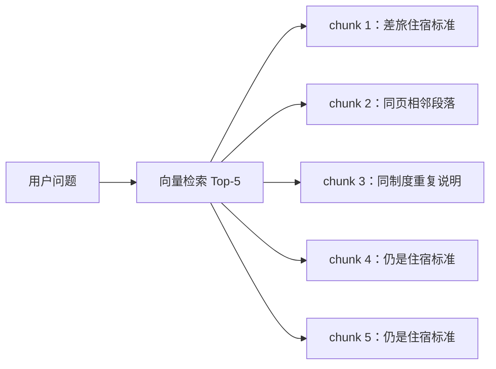
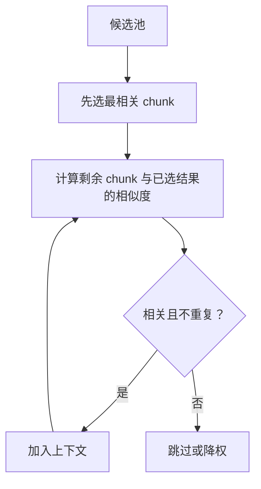
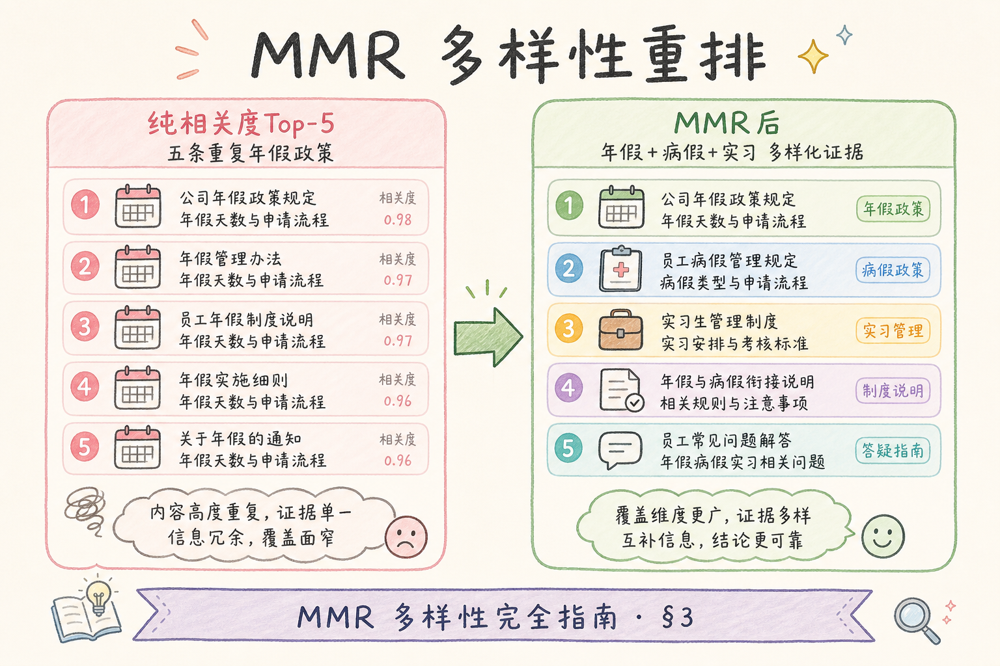
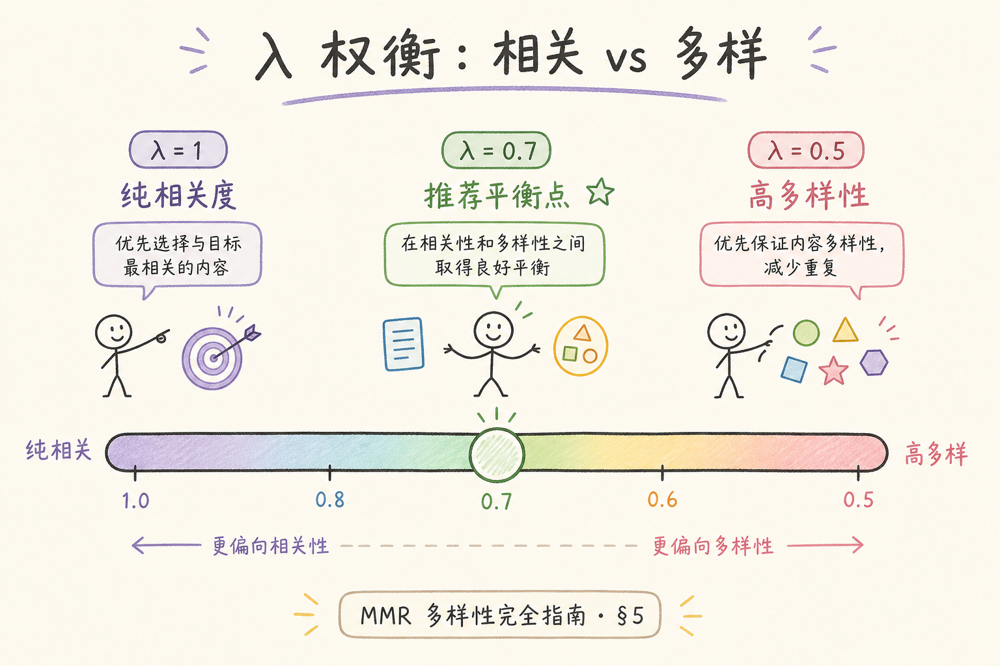
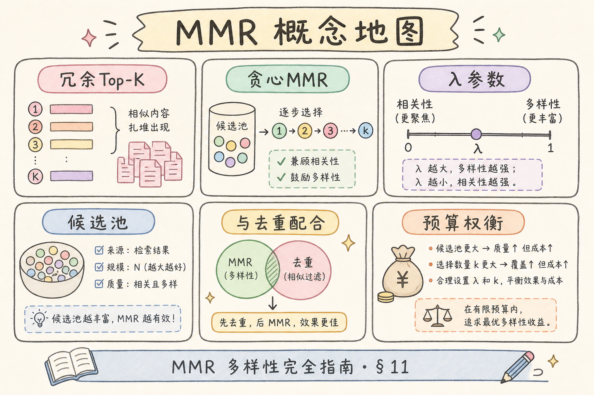

# C5 检索增强（五）：MMR 多样性重排入门

RAG 检索结果经常出现一个问题：Top-K 看起来分数都很高，但内容几乎一样。比如前 5 条全来自同一页、同一段制度的轻微变体。这样会浪费上下文窗口，也会让答案只看到单一角度。**MMR**（Maximal Marginal Relevance，最大边际相关性）就是在“相关”和“多样”之间做平衡的重排方法。

本文面向已经了解 Top-K、向量检索和去重概念的初学者。读完后，你应该能解释 MMR 解决什么问题、参数 `lambda` 怎么影响结果，并写出一个最小可运行的 MMR 选择器。

MMR 是轻量重排：不训练新模型，只在已有候选向量上迭代选择。它常与 chunk 级去重、Cross-Encoder 精排（[95](95.cross-encoder-rerank-tutorial.md)）配合。当 top-k 结果来自同一页、同一制度反复出现时，优先尝试 MMR，再考虑加大召回或换 embedding。

## 目录

- [1. Top-K 为什么会太相似](#1-top-k-为什么会太相似)
- [2. MMR 解决什么问题](#2-mmr-解决什么问题)
- [3. 公式直觉：相关度减重复度](#3-公式直觉相关度减重复度)
- [4. MMR 在 RAG 链路中的位置](#4-mmr-在-rag-链路中的位置)
- [5. 最小 Python 实现](#5-最小-python-实现)
- [6. lambda 参数怎么调](#6-lambda-参数怎么调)
- [7. 与去重和精排的关系](#7-与去重和精排的关系)
- [8. 常见错误](#8-常见错误)
- [9. FAQ](#9-faq)
- [10. 总结](#10-总结)

## 1. Top-K 为什么会太相似

Top-K 检索只关心“每条候选和 query 有多相似”。如果同一份文档被切成很多相邻 chunk，它们都会和 query 很像，于是一起挤进前几名。



这会带来两个问题：上下文被重复内容占满；如果答案还需要“审批流程”或“例外条件”，模型可能根本看不到。

相邻 chunk 因 embedding 相似会集体靠前，这是分块策略（[57](57.fixed-size-chunking-tutorial.md)）与 MMR 要一起考虑的原因。MMR 不能替代「同一 chunk_id 去重」，但能降低「不同 id、内容高度相似」的冗余。

## 2. MMR 解决什么问题

MMR 的目标是：选出来的结果既要和问题相关，又不要彼此太像。

通俗说，MMR 像是在组一个资料包：第一条选最相关的，后面每选一条，都要问“它是不是提供了新信息？”。



MMR 不是为了随机打散结果，而是为了让上下文覆盖更多互补证据。

企业制度库中，用户常问「标准是多少、超标怎么办」：Top-K 可能全是标准句。MMR 在保持第一条最相关的前提下，倾向选入语义距离更远的「审批」「例外」段，使 LLM 同时看到金额与流程。这是索引已固定时的轻量补救，不能替代结构感知分块（[62](62.structure-aware-chunking-tutorial.md)）。

## 3. 公式直觉：相关度减重复度

MMR 常见直觉公式如下：



```text
MMR = lambda × 与 query 的相关度 - (1 - lambda) × 与已选结果的相似度
```

这里的 `lambda` 控制偏好：

| lambda | 倾向 |
| --- | --- |
| 接近 1 | 更重视相关度，结果更像普通 Top-K |
| 接近 0 | 更重视多样性，可能牺牲相关度 |
| 0.5 左右 | 相关和多样折中 |

初学阶段不必死记公式，只要记住：MMR 会惩罚“和已选内容太像”的候选。

`lambda` 可在验证集上网格搜索（如 0.5、0.7、0.9），以**最终答案完整度**为主指标，而非 MMR 内部分数。FAQ 类任务偏相关（高 lambda）；需要汇总多章节、多例外条款的任务可略降 lambda 换覆盖面。

### 案例

用户问「出差住宿标准及超标如何审批？」。向量 top-10 有 7 条来自《差旅办法》第 3 节相邻 chunk，内容都在重复「一线城市 600 元」，没有「超标须部门负责人审批」。对 top-50 候选做 MMR（lambda=0.7）选 8 条后，上下文同时包含「住宿标准」与「审批流程」chunk，答案能同时给出金额与流程。若只做 id 去重而不做 MMR，仍可能 8 条全是标准句、缺审批句。

### 先错对已

```text
-- ❌ 只对 top-5 做 MMR 再取 top-5
-- 问题：候选池无替换空间，MMR 无效

-- ✅ 先召回 30～80，去重后 MMR 选 5～10

-- ❌ lambda=0.2 强行多样，选进「机票舱位」等弱相关 chunk
-- 问题：多样性牺牲了任务相关度

-- ✅ FAQ 从 lambda=0.7 起评，看答案是否更完整而非更散
```

## 4. MMR 在 RAG 链路中的位置

MMR 通常放在初步召回之后、最终上下文组装之前。


注意候选池要比最终上下文大。你不能只拿 Top-5 再做 MMR 选 Top-5，因为没有可替换空间。常见做法是先召回 30-80 条，再用 MMR 选 5-10 条。

MMR 放在 RRF 融合（[94](94.rrf-fusion-tutorial.md)）之后较常见：多路召回合并去重得到较大候选池，再用 MMR 控制进入 prompt 的多样性。若先 MMR 再融合，各路各自的相似簇可能仍会在融合阶段挤占名额，顺序需用评测验证。

## 5. 最小 Python 实现

下面示例用简单向量和余弦相似度演示 MMR。真实项目中，候选向量来自 embedding 或向量库返回结果。



```python
from math import sqrt


def cosine(a: list[float], b: list[float]) -> float:
    dot = sum(x * y for x, y in zip(a, b))
    na = sqrt(sum(x * x for x in a))
    nb = sqrt(sum(y * y for y in b))
    return dot / (na * nb)


def mmr_select(query_vec, candidates, k: int, lambda_: float = 0.7):
    selected = []
    remaining = candidates[:]

    while remaining and len(selected) < k:
        best = None
        best_score = -999
        for item in remaining:
            relevance = cosine(query_vec, item["vector"])
            diversity_penalty = 0
            if selected:
                diversity_penalty = max(cosine(item["vector"], s["vector"]) for s in selected)
            score = lambda_ * relevance - (1 - lambda_) * diversity_penalty
            if score > best_score:
                best = item
                best_score = score
        selected.append(best)
        remaining.remove(best)

    return selected


query = [1.0, 0.0]
candidates = [
    {"id": "a", "text": "住宿标准", "vector": [0.9, 0.1]},
    {"id": "b", "text": "住宿上限", "vector": [0.88, 0.12]},
    {"id": "c", "text": "审批流程", "vector": [0.6, 0.7]},
]

print([x["id"] for x in mmr_select(query, candidates, k=2)])
```

如果只按相关度，可能选 `a` 和 `b`；MMR 则更可能选 `a` 和 `c`，因为 `c` 带来新的信息角度。

生产环境候选应携带预计算 embedding（入库时写入或检索时返回），避免 MMR 阶段重复 embed。时间复杂度约 O(k × n × d)，n 为候选数、k 为选出数，n 控制在 50～100 通常可接受。

## 6. lambda 参数怎么调

`lambda` 没有通用最佳值，要根据任务评测。

| 场景 | 建议起点 |
| --- | --- |
| FAQ 精确问答 | 0.7-0.9，先保证相关 |
| 综述类答案 | 0.5-0.7，增加覆盖面 |
| 多文档对比 | 0.4-0.6，更强调多样 |

调参时不要只看检索分数，要看最终答案是否更完整。MMR 的收益经常体现在“答案不漏角度”，而不是单条 chunk 分数更高。

## 7. 与去重和精排的关系

MMR、去重、精排不是同一件事。

| 技术 | 解决的问题 |
| --- | --- |
| 去重 | 相同 chunk 或近重复内容不要重复出现 |
| MMR | 在相关候选中选更有信息覆盖的组合 |
| Cross-Encoder 精排 | 更准确判断 query 与单条候选是否匹配 |

推荐顺序是：先基础去重，再 MMR 控制多样性，最后根据成本决定是否精排。

去重解决「同一 chunk 出现两次」；MMR 解决「不同 chunk 但信息重复」；精排解决「与 query 是否真匹配」。三者叠加时，不要期望 MMR 替代精排——MMR 不读 query 与 chunk 的细粒度交互，Cross-Encoder 仍负责最后一轮相关性校正。若预算有限，可只对 MMR 输出 top-8 做精排，而不是对全池 50 条精排。

### 评测

选 30～50 条「需要多段证据」的问题（标准+例外、流程+条件），对比纯 top-k 与 MMR 后 context：

| 指标 | 说明 |
| --- | --- |
| 角度覆盖 | 人工标注的必需 topic 是否都出现在 context |
| 重复率 | 选中 chunk 两两相似度均值 |
| 答案完整度 | 是否漏「审批」「例外」等子项 |
| P95 延迟 | MMR 相对 top-k 的额外耗时 |

记录 `lambda`、候选池大小、选中 id 列表，便于复现。若 MMR 后精排 recall 下降，可把 MMR 放在精排前缩小候选，或略提高 lambda。可与 [98 Top-K](98.top-k-retrieval-tutorial.md) 对照：Top-K 只优化单条相关度，MMR 优化集合覆盖。

## 8. 常见错误

这一节列出 MMR 最容易踩的坑。核心判断标准是：多样性必须服务答案质量，而不是为了打散而打散。

### 8.1 候选池太小

只召回 5 条再选 5 条，MMR 没有发挥空间。先扩大候选池，再做选择。

### 8.2 lambda 过低

过度追求多样性会选入不相关内容。生产 FAQ 通常不要把 lambda 调得太低。

### 8.3 把 MMR 当去重

MMR 会降低相似候选优先级，但基础重复 id、重复 chunk 仍然要先去重。

### 8.4 忽略上下文预算

MMR 选出多样 chunk 后，仍要按 token 预算裁剪。多样不代表可以无限塞。

### 8.5 不做答案级评测

只看候选列表变化不够。要看最终答案是否更完整、更少重复、更少漏证据。

### 排错

1. **MMR 前后选中集合几乎相同**：候选池太小或 chunk 本就多样；扩大召回或检查是否只有单一文档命中。
2. **答案变散、跑题**：lambda 过低；提高到 0.7+ 或减小 k。
3. **仍大量重复句**：未做 chunk_id 去重；先 dedup 再 MMR。
4. **精排后效果被抹平**：MMR 在精排之后且精排只认相关度；调整顺序为「召回 → 去重 → MMR → 精排」。
5. **延迟突增**：n×k 过大；缩小候选池或对 embedding 降维缓存。

## 9. FAQ

**Q1：MMR 会不会降低召回准确度？**  
可能会。如果参数太偏多样性，会引入弱相关内容。要用答案质量和命中率一起评测。

**Q2：MMR 要用候选之间的向量吗？**  
通常需要。它要计算候选之间是否相似，所以候选最好带 embedding 向量。

**Q3：已经做去重，还需要 MMR 吗？**  
看场景。去重解决“重复”，MMR 解决“结果过于单一”。两者可以同时存在。

**Q4：MMR 放在精排前还是后？**  
常见做法是召回后先 MMR 控制覆盖，再用精排校正相关性。也可以按成本和效果实验。

## 10. 总结

MMR 的价值是从一堆相关候选中选出“相关且互补”的上下文组合。



初学者先做到四点：

1. 先召回足够大的候选池。
2. 基础去重后再做 MMR。
3. 从 `lambda=0.7` 左右开始评测。
4. 用最终答案质量判断效果，而不是只看检索分数。

当 Top-K 结果高度相似、答案总漏角度时，MMR 是一个值得优先尝试的轻量增强。

### 本篇检查清单

- [ ] 召回池 30～80，MMR 选出数小于池大小
- [ ] 已做 chunk_id 去重，再跑 MMR
- [ ] 从 lambda≈0.7 起评，用答案完整度而不仅是检索分
- [ ] 候选带 embedding，链路顺序与精排关系已验证
- [ ] 30+ 条多证据问题对比过 top-k 与 MMR

可与 [94 RRF](94.rrf-fusion-tutorial.md)、[96 BGE Reranker](96.bge-reranker-tutorial.md) 串联：融合后再 MMR 或 MMR 后再精排，按延迟预算实验。
