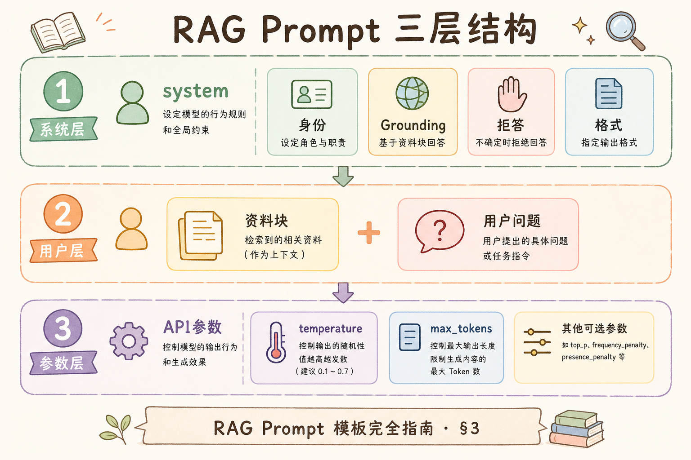
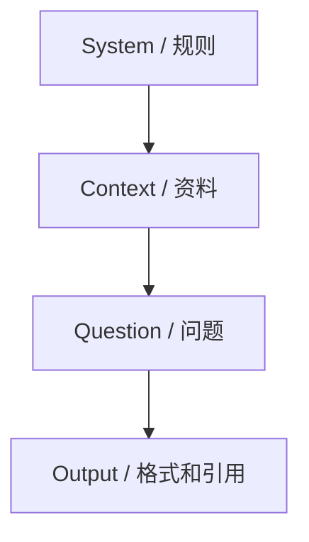
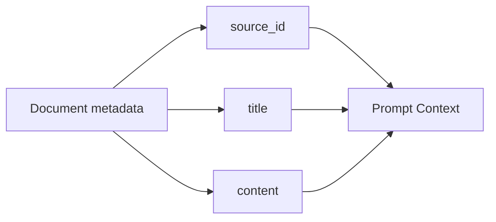
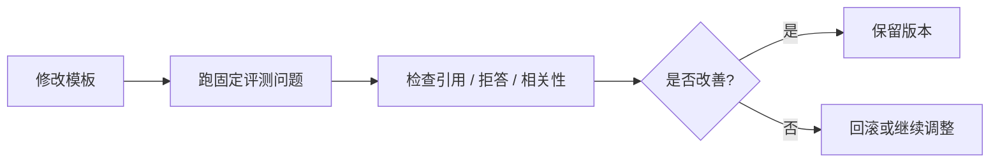
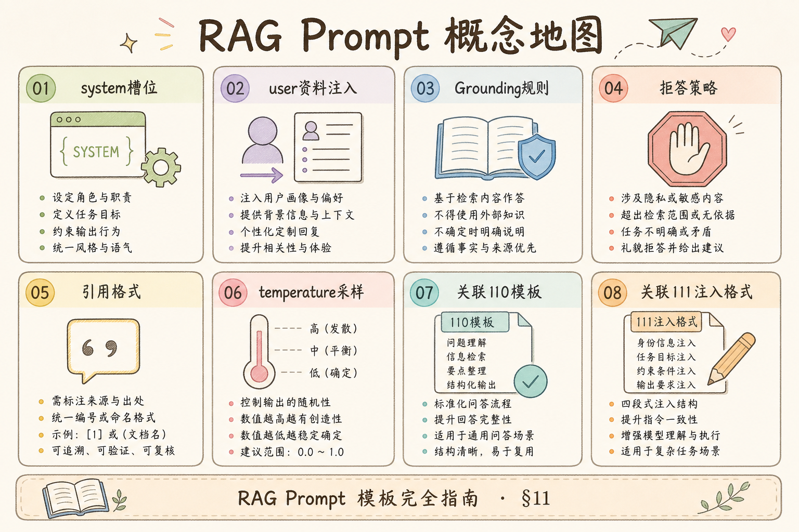

# C5 检索增强（十）：RAG Prompt 模板入门指南

RAG 的最后一步通常是把“用户问题”和“检索到的资料”交给模型生成答案。很多系统答错，不是因为检索完全失败，而是 prompt 没把规则说清楚：资料在哪里、能不能超出资料回答、引用怎么写、没有资料时该怎么办。**RAG Prompt 模板**要解决的就是这“最后一公里”的组织问题。

本文面向刚学完基础 RAG 流程的读者。读完后，你应该能理解一个 RAG Prompt 应该包含哪些部分，如何把 Context 和 Query 放进去，怎样约束引用和拒答，并能写出一个最小可复用模板。

## 目录

- [1. 为什么 Prompt 是 RAG 的最后一公里](#1-为什么-prompt-是-rag-的最后一公里)
- [2. RAG Prompt 模板是什么](#2-rag-prompt-模板是什么)
- [3. 三段式骨架](#3-三段式骨架)
- [4. Context 应该怎么放](#4-context-应该怎么放)
- [5. 引用和拒答规则](#5-引用和拒答规则)
- [6. 最小可运行示例](#6-最小可运行示例)
- [7. 模板如何迭代](#7-模板如何迭代)
- [8. 常见错误](#8-常见错误)
- [9. FAQ](#9-faq)
- [10. 总结](#10-总结)

## 1. 为什么 Prompt 是 RAG 的最后一公里

检索器把资料找回来后，模型并不会自动知道哪些是资料、哪些是用户问题、哪些规则必须遵守。Prompt 模板的作用就是把这些信息摆清楚，让模型按你的产品要求回答。

如果模板只写“请根据以下内容回答”，模型可能会忽略资料边界，也可能在资料不足时补充常识。对于企业知识库，这种“补一补”可能就是幻觉。


这张图说明：Prompt Template 是把检索结果变成可控回答的连接层。

同一套检索结果，换两种 prompt 可能一种严守资料边界、一种自由发挥。企业场景里，模板还要承载 **语气、合规、引用格式、拒答话术** 等产品约束。把模板当成可版本化的配置（而非散落在代码里的字符串拼接），改版时才能回滚、对比评测。

## 2. RAG Prompt 模板是什么

**Prompt 模板**：带变量的提示词骨架。通俗说，它像一张表单，每次把用户问题、检索上下文和输出规则填进去。

一个 RAG Prompt 常见变量包括：

| 变量 | 含义 |
|---|---|
| `question` | 用户当前问题 |
| `context` | 检索到的资料 |
| `chat_history` | 必要的历史对话 |
| `format_instructions` | 输出格式要求 |

模板的目标不是写得越长越好，而是让模型明确三件事：基于什么答，怎么答，什么时候不答。

## 3. 三段式骨架

初学者可以先使用三段式骨架：角色和规则、资料上下文、用户问题和输出要求。

```text
你是一个严谨的知识库问答助手。
规则：
1. 只能基于 <context> 中的资料回答。
2. 如果资料不足，请明确说无法确认。
3. 引用答案所依据的 source_id。

<context>
{context}
</context>

用户问题：
{question}

请用中文回答，最后列出引用来源。
```

这个模板里最重要的是“资料不足时怎么做”。如果不写拒答规则，模型往往会用常识填空。





把 Prompt 拆成这几段后，排查问题会更容易：是规则不清、资料不够，还是输出格式没约束。

### 案例

产品文档问答：检索命中两条——`doc-1` 写“上传成功即可问答”，`doc-2` 写“需等 indexing 完成”。若模板只写“请根据内容回答”，模型常合并成“上传后稍等即可”，把两步状态混成一句。改成显式规则：“若资料冲突，列出不同 source 的说法；不得合并未同时出现的条件”，并强制 `[doc-id]` 标注后，冲突题拒答/分述率明显改善。该 case 表明：**模板要教会模型如何处理资料边界，而不只是贴上 context**。

## 4. Context 应该怎么放

Context 不是把所有检索结果粗暴拼起来。它应该保留来源、标题和片段内容，让模型知道每段资料来自哪里。

推荐格式：

```text
[source_id: doc-1]
title: 文件上传说明
content: 上传成功只表示文件已保存，后台索引完成后才可问答。

[source_id: doc-2]
title: 索引状态
content: 文件状态包括 uploaded、indexing、ready、failed。
```

这样写的好处是引用可以校验。模型如果引用 `doc-3`，程序就能发现它不在本次 context 中。



不要只把正文拼成一大段。没有来源边界，引用和排查都会变困难。

## 5. 引用和拒答规则

RAG Prompt 至少要明确两条规则：引用怎么写，资料不足怎么拒答。

| 情况 | 模板规则 |
|---|---|
| 找到资料 | 回答后列出使用的 `source_id` |
| 资料不足 | 说“根据当前资料无法确认” |
| 问题超出范围 | 不要编造，提示需要补充资料 |
| 多个来源冲突 | 明确指出资料不一致 |

引用规则应该具体，不要只写“请给出引用”。更好的写法是：“每个关键结论后标注来源 ID，例如 `[doc-1]`，只能使用 context 中出现的 source_id。”

拒答不是失败，而是可信系统的一部分。对企业 RAG 来说，不知道时说不知道，比编一个顺滑答案更重要。

可在规则段增加 **一条正面示例 + 一条拒答示例**（各一两句），比堆更多形容词更有效。示例应使用真实 `source_id` 格式，避免模型学到虚构编号。

## 6. 最小可运行示例

下面用 Python 生成一个 RAG Prompt 字符串。它不调用模型，只展示模板如何组装。

运行环境：Python 3.10+。

```python
def format_context(docs: list[dict]) -> str:
    blocks = []
    for doc in docs:
        blocks.append(
            f"[source_id: {doc['source_id']}]\n"
            f"title: {doc['title']}\n"
            f"content: {doc['content']}"
        )
    return "\n\n".join(blocks)


def build_rag_prompt(question: str, docs: list[dict]) -> str:
    context = format_context(docs)
    return f"""你是一个严谨的知识库问答助手。
规则：
1. 只能基于 <context> 中的资料回答。
2. 如果资料不足，请明确说“根据当前资料无法确认”。
3. 每个关键结论后标注来源 ID，例如 [doc-1]。

<context>
{context}
</context>

用户问题：
{question}
"""


docs = [
    {
        "source_id": "doc-1",
        "title": "文件上传说明",
        "content": "上传成功只表示文件已保存，后台索引完成后才可问答。",
    }
]

print(build_rag_prompt("为什么上传后不能马上问答？", docs))
```

这段代码体现了一个关键做法：Prompt 里的 context 由结构化 docs 生成，而不是手工拼一段含糊文本。

### 先错对已

```text
-- ❌ 规则写成一大段散文：模型选择性遵守，拒答率不稳定
-- ❌ context 只有正文无 source_id：引用无法校验，用户无法追溯
-- ❌ 资料不足时无拒答句：模型用常识补全，幻觉更顺滑

-- ✅ 规则用编号清单：只基于 context、不足时明确拒答、引用格式示例
-- ✅ 每条证据带 source_id / title / content，程序可校验引用
-- ✅ 模板版本号 + 固定评测集，每次改动可回归
```

## 7. 模板如何迭代

Prompt 模板不能靠感觉改。每次调整规则后，都应该用一组固定问题测试。

| 观察到的问题 | 可能改法 |
|---|---|
| 答案无引用 | 明确引用格式和位置 |
| 资料不足仍硬答 | 加强拒答规则和示例 |
| 引用不存在 | 程序侧校验 source_id |
| 答案太长 | 规定长度和结构 |
| 漏掉关键限制 | 在规则段增加边界条件 |



建议给模板加版本号。上线后如果答案质量波动，你能知道是哪次模板改动引入了问题。

## 8. 常见错误

第一个错误是把所有规则塞成一大段自然语言。模型更容易遵守清单式、明确编号的规则。

第二个错误是 context 没有来源 ID。没有来源，引用无法校验，用户也无法追溯答案依据。

第三个错误是没有拒答规则。资料不足时，模型很容易用常识补全，导致看似合理的幻觉。

第四个错误是只改 prompt 不看检索结果。如果 context 本身没有关键资料，再好的模板也很难答对。

### 排错

1. **无引用或假引用**：检查模板是否写明格式；程序侧校验 `source_id` 是否属于本次 context
2. **该拒答仍硬答**：加强拒答句并加少量 few-shot；同时查检索是否其实未命中
3. **答案过长**：在 Output 段限制条数、字数或“先结论后依据”结构
4. **规则互相打架**：system 里“尽量详细”与“仅基于资料”并存时，模型会偏向详细；删冲突句
5. **改版后质量波动**：对比 `prompt_template_version` 与评测时间线，锁定引入问题的版本

### 评测

维护 **固定金标准问题集**（30～80 条），覆盖：有资料、资料不足、多源冲突、需列举步骤、多轮指代：

| 指标 | 说明 |
| --- | --- |
| 引用有效率 | 标注的 source 是否支持对应句 |
| 拒答准确率 | 无资料题是否未编造 |
| 冲突处理 | 是否分述或明确不一致 |
| 格式合规 | 长度、语言、列表结构是否符合模板 |

每次只改模板一处（如拒答或引用），跑全量回归，避免多个改动无法归因。模板占用的 token 也应计入 [107 Context 预算](107.context-budget-tutorial.md)，避免规则过长挤掉真实证据。

## 9. FAQ

**Q：Prompt 越长越好吗？**  
不是。长模板会占用上下文，也可能让规则互相冲突。保持清晰、可测试更重要。

**Q：要不要放回答示例？**  
复杂格式可以放少量示例。但示例不要太多，避免挤占真实 context。

**Q：引用应该由模型生成还是程序生成？**  
模型可以选择引用 ID，但程序应校验这些 ID 是否来自本次 context。

**Q：多轮对话要把全部历史放进 prompt 吗？**  
不建议。只放与当前问题相关的必要历史，否则会增加噪声和成本。

## 10. 总结

RAG Prompt 模板负责把问题、资料和回答规则组织成模型能遵守的输入。它不替代检索，也不替代事实校验，但会直接影响答案是否有边界、有引用、能拒答。



初学者可以先用三段式骨架：规则、context、question。再围绕引用、拒答、格式和长度逐步迭代，并用固定测试集验证每次改动。

### 本篇检查清单

- [ ] 三段式骨架：规则、`<context>`、用户问题与输出要求
- [ ] 每条证据含 `source_id`，生成后程序校验引用合法性
- [ ] 资料不足、超出范围、多源冲突三类拒答/分述规则已写明
- [ ] 模板有版本号，改动关联固定评测集回归结果
- [ ] 排障时同时检查检索 context，不单改 prompt

至此 [106 去重](106.retrieval-dedup-tutorial.md)～[110 模板](110.rag-prompt-template-tutorial.md) 形成检索治理到生成控制的闭环；可继续读 [111](111.citation-verification-tutorial.md) 等引用校验专题。
