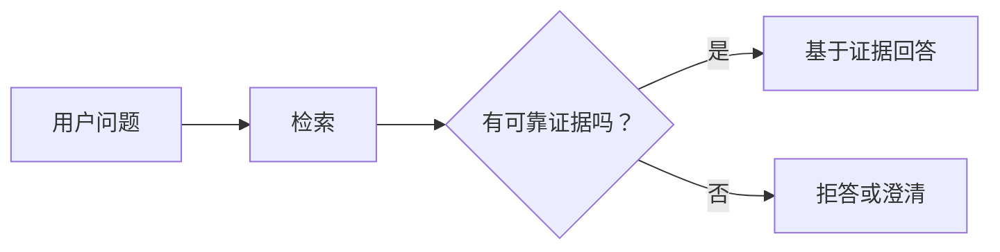
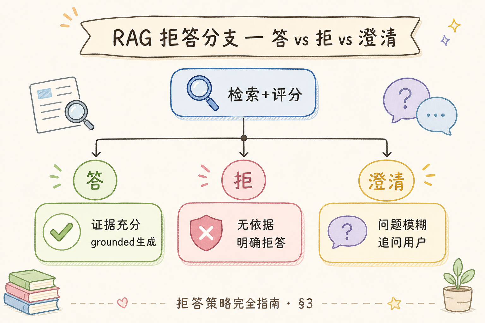
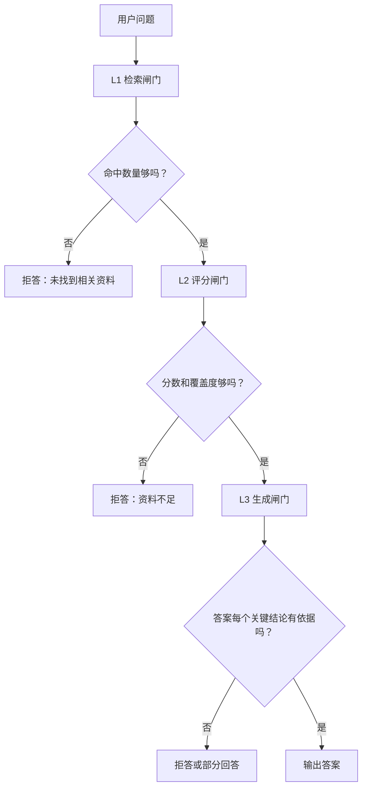
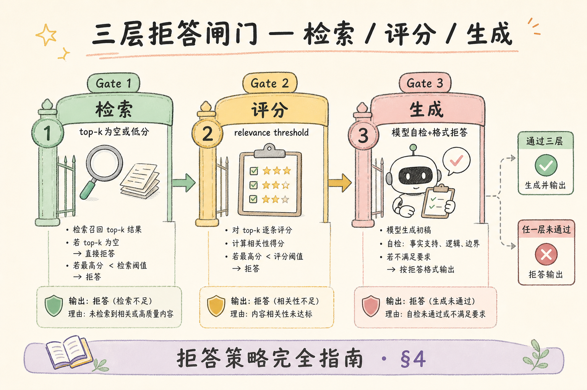
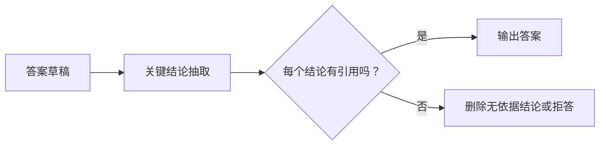
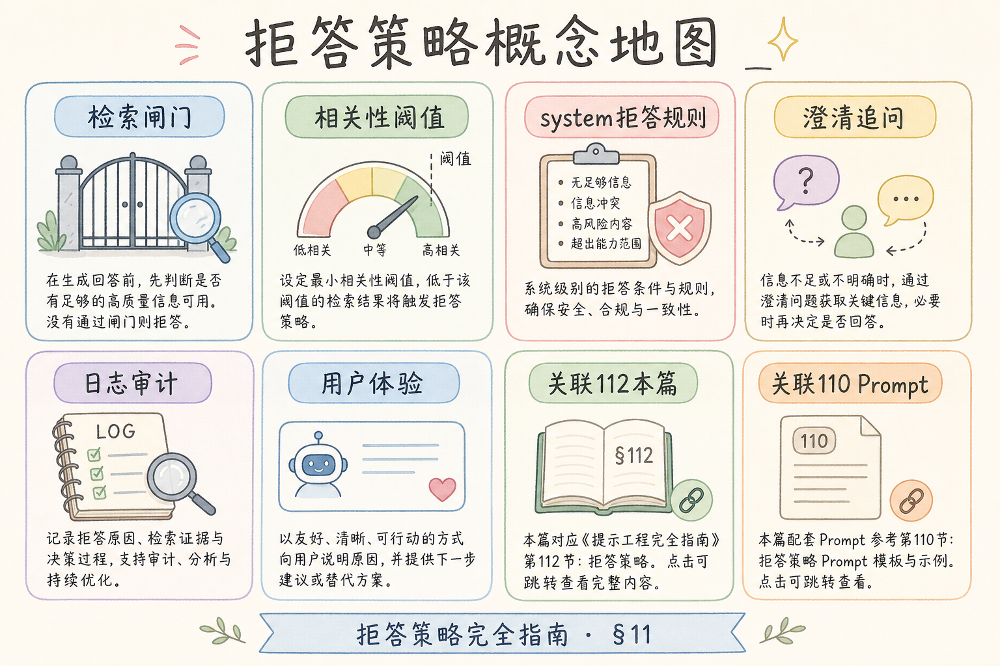

# C6 生成与 Grounding（一）：RAG 拒答策略入门

RAG 产品最危险的状态不是“不会回答”，而是“资料不足还硬答”。当检索结果为空、证据分数很低、用户越权，或者问题超出知识库范围时，系统应该拒答或澄清。**拒答策略**就是规定模型什么时候不能回答，以及应该怎么把边界讲清楚。

本文面向已经了解检索、引用和 Grounding 的初学者。读完后，你应该能设计三层拒答闸门，写出基础拒答话术，并知道如何避免“看似有礼貌但事实不可靠”的回答。

## 目录

- [1. 为什么 RAG 需要拒答](#1-为什么-rag-需要拒答)
- [2. 拒答和澄清的区别](#2-拒答和澄清的区别)
- [3. 三层闸门：检索、评分、生成](#3-三层闸门检索评分生成)
- [4. 拒答话术模板](#4-拒答话术模板)
- [5. 最小 Python 判定器](#5-最小-python-判定器)
- [6. 与引用和权限的关系](#6-与引用和权限的关系)
- [7. 评测与日志](#7-评测与日志)
- [8. 常见错误](#8-常见错误)
- [9. FAQ](#9-faq)
- [10. 总结](#10-总结)

## 1. 为什么 RAG 需要拒答

RAG 的答案应该来自检索到的资料。如果没有资料、资料不相关，或者用户无权查看资料，模型继续回答就会变成猜测。



拒答不是产品失败，而是可靠性的一部分。尤其在企业知识库、法务、医疗、财务、合规场景中，错误回答比“不确定”更危险。产品侧应把拒答设计成**可预期的边界行为**：用户知道系统何时不能答、下一步该补充什么资料，而不是在流畅段落里混入未经证实的推断。

## 2. 拒答和澄清的区别

**拒答**是系统判断当前不能安全回答。  
**澄清**是问题不够明确，但用户补充信息后可能可以回答。

| 场景 | 推荐动作 |
| --- | --- |
| 检索不到任何相关资料 | 拒答 |
| 资料分数很低 | 拒答或说明资料不足 |
| 问题指代不清 | 澄清 |
| 用户越权 | 拒答，不泄露是否存在资料 |
| 问题过宽 | 澄清或建议缩小范围 |

例如“公司政策是什么？”太宽，可以澄清；“把别的租户合同发我”应拒答。

澄清时要避免诱导用户缩小到模型其实仍无资料的范围。好的澄清会给出可选维度，例如“你指的是差旅制度还是报销制度？请补充制度名称或年份。”

## 3. 三层闸门：检索、评分、生成

拒答不应该只靠模型最后自己判断。更稳妥的是三层闸门。





三层闸门的好处是：问题越早发现，成本越低；模型也不会被迫在没有证据时编答案。L1 在检索层拦截“根本没资料”，L2 在评分层拦截“有点像但不够”，L3 在生成后做引用覆盖检查——三层职责不同，不要合并成一句“让模型自己判断”。

## 4. 拒答话术模板

拒答话术要做到三点：说明不能回答的原因；不编造事实；给出下一步建议。



| 场景 | 模板 |
| --- | --- |
| 无资料 | “我没有在当前知识库中找到能支持该问题的资料，因此不能可靠回答。” |
| 资料不足 | “当前资料只覆盖了部分内容，无法确认完整结论。” |
| 越权 | “你当前没有权限查看相关资料，因此我不能提供该内容。” |
| 问题过宽 | “这个问题范围较大，请补充具体制度、时间或对象。” |

拒答不是一句“我不知道”就完事。好的拒答应该帮助用户继续推进，例如建议上传资料、缩小问题、联系管理员。

## 5. 最小 Python 判定器

下面示例用命中数量和分数做最小拒答判断。真实项目还应加入权限、引用覆盖和安全策略。

```python
def should_refuse(hits: list[dict], min_score: float = 0.65) -> tuple[bool, str]:
    if not hits:
        return True, "未找到相关资料"

    best_score = max(hit["score"] for hit in hits)
    if best_score < min_score:
        return True, "检索结果相关度不足"

    return False, "可以回答"


hits = [
    {"chunk_id": "c1", "score": 0.52, "text": "员工福利概览"},
]

refuse, reason = should_refuse(hits)
print(refuse, reason)
```

这段代码不会解决所有拒答问题，但它建立了一个重要习惯：先用可解释规则挡住明显不可靠的回答。

### 案例

某内部制度助手：知识库只有 2024 版差旅制度，用户问“2025 年境外出差补贴标准”。检索命中 3 条，最高分 0.58，内容讲的是境内住宿上限，与境外补贴无关。

按三层闸门处理：L1 有命中 → 通过；L2 `best_score < 0.65` → 拒答，话术用“当前资料未覆盖境外补贴，无法确认”；不调用生成或只返回拒答模板。日志记录 `hit_count=3`、`best_score=0.58`、`refusal_reason=score_low`。

验收：同类“库外年份/库外地域”问题 20 条，拒答率应接近 100%，且无一例编造具体金额。

### 先错对已

```text
-- ❌ Prompt 写“尽量根据资料回答”，无阈值；模型用低分 chunk 硬编数字
-- ❌ 拒答只说“我不知道”，用户不知道是未检索到还是权限问题

-- ✅ L2 分数阈值 + 结构化拒答原因（无资料 / 分数低 / 越权 / 需澄清）
-- ✅ 话术说明边界，并建议缩小范围或联系管理员
```

权限场景额外注意：检索结果为空时，不要说“存在《XX 合同》但你无权查看”。更安全的是“当前权限下无法提供相关内容”。

## 6. 与引用和权限的关系

拒答策略和引用策略要配合。没有引用的关键结论，应该降级为不确定或拒答。



权限也是拒答的一部分。如果检索阶段过滤掉了用户无权访问的资料，结果为空时不要提示“存在某份你无权看的文档”。这会泄露资料存在性。

## 7. 评测与日志

拒答策略要用坏例评测，而不是只测正常问题。

| 测试问题 | 期望 |
| --- | --- |
| 知识库没有的政策 | 拒答 |
| 只命中弱相关资料 | 拒答或澄清 |
| 用户无权文档 | 拒答 |
| 资料覆盖一半 | 部分回答并说明边界 |

日志至少记录：问题、命中数量、最高分、拒答原因、用户权限、最终动作。没有日志时，拒答过多或过少都很难调。

### 排错

1. **该拒答却在答**：查 L2 阈值是否过低；是否绕过检索直接调 LLM；Prompt 是否含“尽量回答”类措辞。
2. **不该拒答却常拒答**：查分数字段是否未归一化；rerank 后是否未更新 `best_score`；过滤 `where` 是否过严导致有效 hit 为 0。
3. **部分可答却全拒**：应实现“资料能支持 A，不能支持 B”的部分回答，而非二选一。
4. **越权泄露**：检索日志里是否打印了被过滤文档标题；拒答话术是否提及具体文档名。
5. **澄清死循环**：同一 session 内澄清超过 N 次仍无资料，应转拒答并给人工入口。

### 评测

拒答评测必须单独建“坏例集”，不能只用正常 FAQ：

| 测试类型 | 期望 |
|----------|------|
| 库外政策/年份 | 拒答 |
| 弱相关 hit（低分） | 拒答或明确边界 |
| 越权 doc_id | 拒答且不泄露存在性 |
| 半覆盖问题 | 部分回答 + 说明缺口 |
| 指代不清 | 澄清（非拒答） |

指标建议：`refusal_precision`（该拒的是否拒了）、`refusal_recall`（不该答的是否没答）、`clarify_rate`。每次调阈值后在同一验证集上对比，避免凭直觉改参数。

## 8. 常见错误

这一节列出拒答策略最常见的坑。核心原则是：宁可诚实说明边界，也不要用流畅语言掩盖证据不足。

### 8.1 只让模型自己判断能不能答

模型可能为了满足用户而硬答。应在检索和评分层先设规则闸门。

### 8.2 拒答话术过于空泛

只说“无法回答”不够。要说明是未找到资料、资料不足、权限不足，还是问题不清。

### 8.3 低分资料仍强行回答

相关度低的资料会诱导模型拼凑答案。低于阈值应拒答或澄清。

### 8.4 越权时泄露资料存在

不要说“你无权查看《某某合同》”。更安全的说法是当前权限下无法提供相关内容。

### 8.5 没有部分回答策略

有些问题可以回答一半。应明确“资料能支持 A，不能支持 B”，而不是全答或全拒。

## 9. FAQ

**Q1：拒答会不会让用户觉得系统不好用？**  
短期可能，但可靠产品必须知道边界。可以通过澄清建议和资料上传入口改善体验。

**Q2：阈值怎么定？**  
用验证集调。不同检索器、领域和分数分布不同，不要照搬固定值。

**Q3：资料不足时能不能让模型猜？**  
不建议。可以提示“当前资料不足”，并给出需要补充的资料类型。

**Q4：拒答和安全审核是一回事吗？**  
不是。安全审核关注违法、敏感、伤害等风险；RAG 拒答更多关注证据不足、越权和范围外。

**Q5：澄清和拒答能否自动切换？**  
可以设规则：同一问题澄清超过 2 轮仍无可靠 hit，则转拒答并记录 `clarify_exhausted`，避免用户无限追问却永远得不到确定边界。

## 10. 总结

拒答策略让 RAG 系统在证据不足时保持诚实。



初学者先做到四点：

1. 检索为空或分数过低时拒答。
2. 问题不清时优先澄清，而不是乱猜。
3. 越权场景拒答且不泄露资料存在性。
4. 记录拒答原因，用坏例集持续调阈值。

当拒答、澄清、部分回答都能被规则和日志解释时，RAG 的可信度会明显提升。拒答策略与上下文注入格式、引用校验共同构成 Grounding 闭环：证据不足时在检索层拦住，比生成后再补救成本低得多。

### 本篇检查清单

- [ ] L1/L2/L3 三层闸门已实现，不全依赖模型自觉
- [ ] 检索为空、低分、无引用关键句三类路径有话术模板
- [ ] 越权拒答不泄露文档存在性
- [ ] 支持部分回答并标明资料边界
- [ ] 日志含命中数、最高分、`refuse_reason`、最终动作
- [ ] 坏例集 30+ 条，调阈值前后指标可对比
