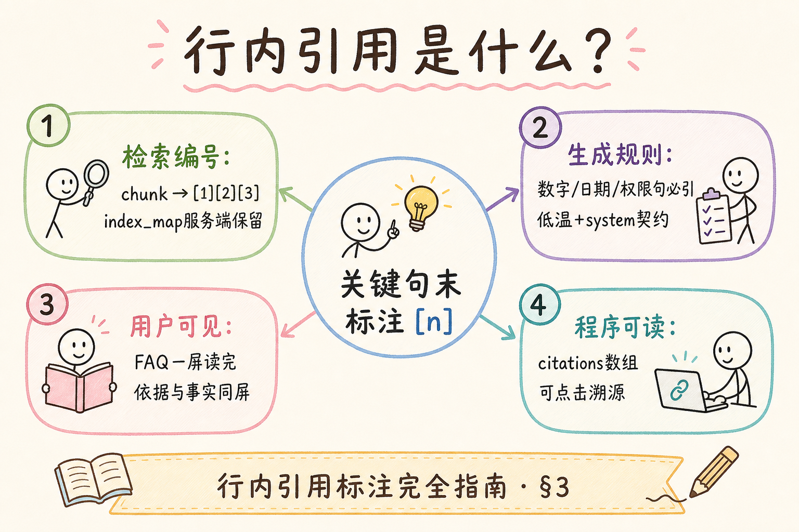
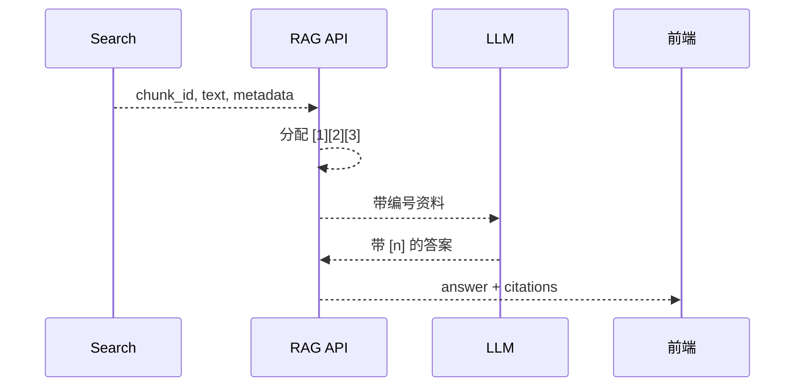
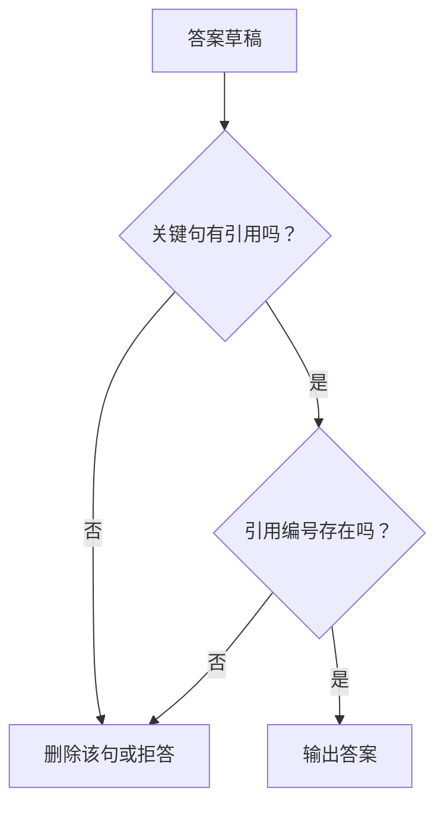
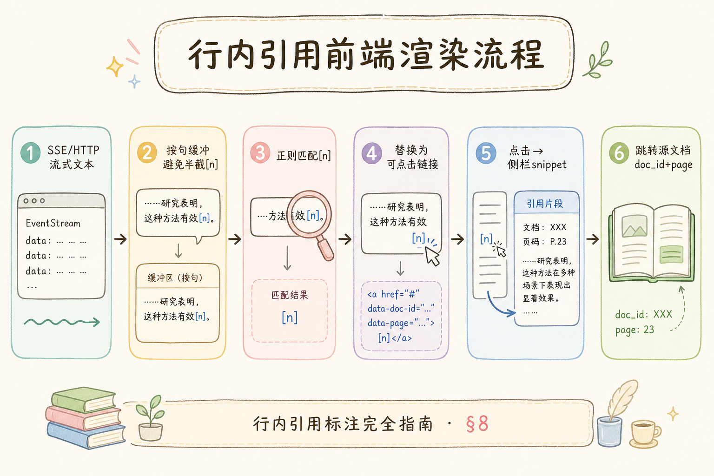
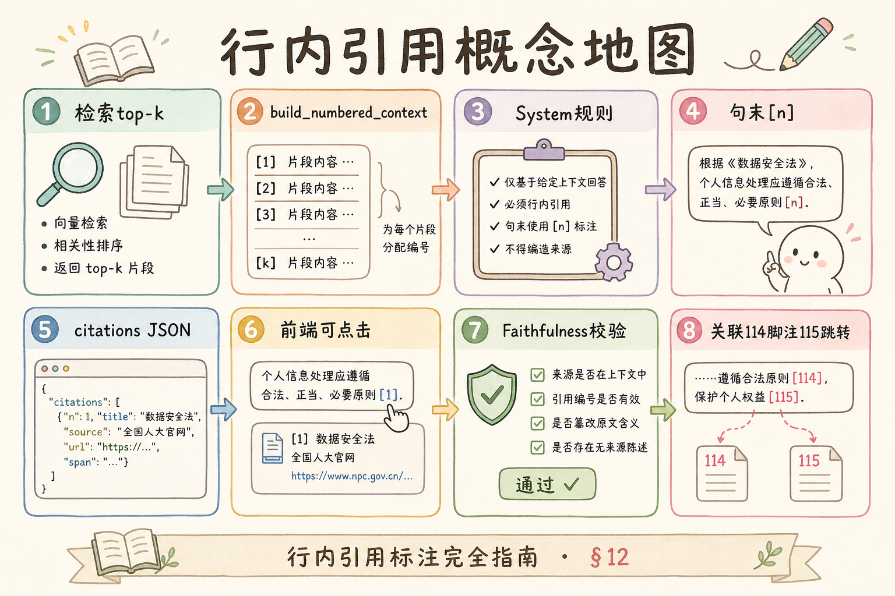

# C6 生成与 Grounding（二）：行内引用标注入门

RAG 答案如果只说“根据资料”，用户仍然不知道哪句话来自哪份资料。**行内引用**就是在答案句子旁边标 `[1]`、`[2]` 这样的编号，让用户一眼看到关键结论的来源。

本文面向已经了解 Grounding 和拒答策略的初学者。读完后，你应该能设计检索 chunk 到引用编号的契约，写出基础 Prompt，并知道哪些句子必须带引用。

## 目录

- [1. 行内引用解决什么问题](#1-行内引用解决什么问题)
- [2. 哪些句子必须带引用](#2-哪些句子必须带引用)
- [3. 编号契约：chunk 到答案](#3-编号契约chunk-到答案)
- [4. Prompt 怎么写](#4-prompt-怎么写)
- [5. 最小数据结构与解析](#5-最小数据结构与解析)
- [6. 与拒答策略的关系](#6-与拒答策略的关系)
- [7. 前端展示建议](#7-前端展示建议)
- [8. 常见错误](#8-常见错误)
- [9. FAQ](#9-faq)
- [10. 总结](#10-总结)

## 1. 行内引用解决什么问题

行内引用解决的是“答案可追溯”的问题。用户看到结论后，可以立刻知道它依赖哪条资料。


没有行内引用时，答案看起来流畅，但用户无法判断哪些结论有依据。对于 FAQ、制度问答、合规问答，行内引用通常是最低要求。

行内引用与 [111 上下文注入格式](111.context-injection-format-tutorial.md) 直接衔接：注入时分配的 `[1][2]` 必须与答案中的编号一一对应。若注入格式不稳定，后续引用校验和源文档跳转都会失效。

## 2. 哪些句子必须带引用

不是每个字都要引用，但关键事实必须引用。

| 内容 | 是否需要引用 |
| --- | --- |
| 金额、日期、比例、时限 | 必须 |
| 政策结论 | 必须 |
| 流程步骤 | 建议 |
| 模型自己的过渡语 | 不需要 |
| 无资料支持的推测 | 不应出现 |

例如：

```text
一线城市住宿费上限为 600 元/晚 [1]。如果超过标准，需要部门负责人审批 [2]。
```

这里两个关键结论分别有来源，用户可以逐句核查。

判断“关键事实”的实用规则：若用户把这句话单独截图发给法务，法务会追问出处吗？会，则必须引用。金额、时限、审批层级、能否/不得类结论，几乎都应带 `[n]`。

## 3. 编号契约：chunk 到答案

引用编号应该由服务端给检索结果分配，而不是让模型自己凭空编。





最小资料注入格式可以是：

```text
[1] 文档：差旅制度，第 3 页
一线城市住宿费上限为 600 元/晚。

[2] 文档：差旅制度，第 4 页
超出标准需部门负责人审批。
```

模型只能引用这些编号，不能生成不存在的 `[9]`。

编号应在**最终进入 Prompt 的 evidence 列表**上分配：先完成 rerank、裁剪、去重，再 `enumerate(hits, start=1)`。若先编号后删 hit，答案里可能出现悬空 `[3]`。

### 案例

差旅制度 FAQ：检索确定 2 条 chunk，服务端注入 `[1]` 住宿上限、`[2]` 超标审批。模型输出：

`一线城市住宿费上限为 600 元/晚 [1]。超出标准需部门负责人审批 [2]。`

验收：`find_missing_citations` 返回空集；`citations[0].chunk_id` 与日志 hits 一致；用户点击 `[1]` 可预览对应片段。同一问题连跑 10 次，编号集合应稳定（除非检索结果本身变化）。

### 先错对已

```text
-- ❌ Prompt 写“请标注来源”，由模型自拟 [1][2] 或段末只放一个 [1]
-- ❌ 前端按出现顺序重排 citations，与正文 [n] 错位

-- ✅ 服务端分配编号 + Prompt 要求关键句末 [n] + 输出后校验 allowed 集合
-- ✅ citations 数组与答案中的 [n] 共用同一套 number 字段
```

## 4. Prompt 怎么写

行内引用 Prompt 要把规则写清楚。


```text
你只能根据给定资料回答。
规则：
1. 每个关键事实句末必须带来源编号，如 [1]。
2. 如果资料不足，明确说无法确认，不要编造。
3. 不要引用不存在的编号。
4. 一个句子可以引用多个来源，如 [1][2]。

资料：
{numbered_context}

用户问题：
{question}
```

这里的重点是“关键事实句末必须带来源编号”。如果只说“请尽量引用”，模型会偷懒。

可在系统消息中补充负面示例：“错误：住宿费 600 元（无编号）；正确：住宿费 600 元 [1]。” 对较小模型尤其有效。脚注式长答案见 [114](114.footnote-citation-tutorial.md)，但编号契约与本节相同。

### 4.1 Prompt 与注入格式的配套关系

| 注入侧 | 生成侧 |
|--------|--------|
| 每段有稳定 `[n]` | 要求关键句末写 `[n]` |
| 裁剪后重编号 | 禁止引用已删除编号 |
| 来源字段完整 | 禁止编造不存在的 `[n]` |

只改 Prompt 而不改注入格式，引用率往往上不去；两者应同一次迭代发布。

## 5. 最小数据结构与解析

服务端应该同时返回答案文本和 citations 数组。

```python
citations = [
    {"number": 1, "chunk_id": "c1", "doc_title": "差旅制度", "page": 3},
    {"number": 2, "chunk_id": "c2", "doc_title": "差旅制度", "page": 4},
]

answer = "一线城市住宿费上限为 600 元/晚 [1]。超出标准需部门负责人审批 [2]。"
```

可以用简单正则检查答案是否引用了不存在的编号：

```python
import re


def find_missing_citations(answer: str, citations: list[dict]) -> set[int]:
    used = {int(x) for x in re.findall(r"\[(\d+)\]", answer)}
    allowed = {item["number"] for item in citations}
    return used - allowed


print(find_missing_citations(answer, citations))
```

如果返回非空集合，说明模型生成了不存在的引用编号，应重新生成或拒答。

还可统计“关键句引用覆盖率”：用规则或轻量模型标出含数字/时限的句子，检查是否含 `\[\d+\]`。覆盖不足时触发 L3 拒答或删句，与 [112 拒答策略](112.refusal-strategy-tutorial.md) 一致。

### 5.1 解析与二次生成策略

| 校验结果 | 建议动作 |
|----------|----------|
| 使用了非法 `[n]` | 重试 1 次并加强 Prompt；仍失败则拒答 |
| 关键句无引用 | 删该句或整段拒答 |
| 合法但 snippet 与句意不符 | 人工抽检；查 chunk 是否切太碎 |

## 6. 与拒答策略的关系

引用检查可以作为拒答闸门的一部分。



如果模型说出了资料没有支持的关键事实，宁可删掉或拒答，也不要让无引用结论进入最终答案。

部分回答场景下，可保留无争议过渡句，但含数字、时限、审批层级的句子必须带 `[n]`，否则与 [112 拒答策略](112.refusal-strategy-tutorial.md) 的 L3 闸门冲突。

## 7. 前端展示建议

前端应让 `[1]` 可点击，点击后展示文档标题、页码和片段预览。

| 展示元素 | 作用 |
| --- | --- |
| `[1]` 编号 | 在正文里提示来源 |
| hover 卡片 | 快速预览来源 |
| 点击跳转 | 打开源文档或侧栏 |
| 来源列表 | 汇总所有引用 |

编号展示要和后端 citations 数组一致。不要让前端按出现顺序重新编号，否则可能和答案文本错位。

移动端可把 `[1]` 做成可点击上标；桌面端 hover 展示 snippet，点击跳转 [115 源文档导航](115.source-document-navigation-tutorial.md)。无论哪种 UI，number 字段必须来自 API，不由前端重算。

### 7.1 展示层与契约层分离

展示层可以换皮肤（上标、角标、侧栏），契约层不变：`answer` 字符串里的 `[n]` 与 `citations[].number` 永远一一对应。A/B 测试 UI 时不要改 number 分配逻辑，否则前后端联调成本会陡增。

## 8. 常见错误

这一节列出行内引用最常见的问题。核心原则是：编号必须可追溯，关键事实必须有来源。



### 8.1 让模型自己编编号

模型可能输出不存在的 `[7]`。编号应由服务端分配，并在输出后校验。

### 8.2 只在段末放一个引用

一段里可能有多个事实。只在最后放 `[1]` 会让用户不知道每个事实对应哪个来源。

### 8.3 引用和证据裁剪顺序错误

如果先编号再裁剪证据，编号可能失效。应在最终证据确定后编号。

### 8.4 无引用结论仍然输出

关键结论没有引用时，应删除、降级为不确定，或触发拒答。

### 8.5 前端重新排序 citations

前端排序会导致编号错位。编号应跟随服务端契约。

### 排错

1. **答案有 [2] 但 citations 只有 1 条**：查裁剪后是否未重编号；查 `find_missing_citations` 是否未接入线上。
2. **每段末尾一个 [1]，中间事实无出处**：加强 Prompt“每个关键事实句末 [n]”；用规则扫描含数字却无 `\[` 的句子。
3. **同一 chunk 被标成 [1] 和 [3]**：去重策略应在编号前合并同 `chunk_id`。
4. **重试后编号漂移**：重试应使用同一 `numbered_context`，不要重新检索打乱顺序。
5. **流式输出时 [n] 闪烁**：先渲染纯文本，complete 后再绑定 citation 元数据。

### 评测

从制度/FAQ 抽 30～50 条，标注每句关键事实应对应的 `chunk_id`：

| 指标 | 说明 |
|------|------|
| 引用存在率 | 关键句是否含 `[n]` |
| 编号合法率 | `[n] ⊆ allowed_numbers` |
| 语义一致率 | `[n]` 的 snippet 是否支持该句（人工或 LLM-judge 抽检） |
| 拒答联动 | 无引用关键句是否被删或拒答 |

调参顺序：固定注入格式与编号逻辑 → 再改 Prompt 措辞 → 最后调前端展示。不要同时改三处，否则无法解释指标波动。

可额外记录 `citation_density`（关键句数 / 带引用句数）随版本的变化，作为发布门禁：密度低于阈值时阻断上线，防止“看起来能答、实际上无出处”的回退。

## 9. FAQ

**Q1：每句话都要引用吗？**  
不是。关键事实要引用，过渡语和总结语可以不引用。

**Q2：一个句子可以有多个引用吗？**  
可以。尤其是对比、合并多个资料来源时，句末可以写 `[1][2]`。

**Q3：行内引用和脚注引用怎么选？**  
短 FAQ 更适合行内引用；长报告可以用脚注或侧栏，正文更清爽。

**Q4：引用编号应该全局唯一吗？**  
通常一次回答内唯一即可。跨回答应使用 chunk_id 或 source_id 追踪。

**Q5：多轮对话里编号会变吗？**  
每一轮应答应独立编号；不要把上一轮 `[1]` 复用到下一轮新证据，除非显式携带同一 `numbered_context` 会话状态。多轮场景更稳妥的做法是每轮重新检索、重新编号，避免用户把旧编号误当成新证据。

## 10. 总结

行内引用让 RAG 答案从“看起来可信”变成“可以核查”。



初学者先做到四点：

1. 服务端给最终证据分配编号。
2. Prompt 要求关键事实句末带编号。
3. 输出后校验编号是否存在。
4. 前端按 citations 数组展示可点击来源。

这四点构成最小闭环。进阶时再接入 rerank 后重编号、多轮会话引用继承、以及与脚注/导航联动的统一 `citation` schema。

当关键结论都能追溯到具体 chunk，RAG 的 Grounding 才算真正落地。行内引用是短答案的默认形态；答案变长时可结合 [114 脚注式引用](114.footnote-citation-tutorial.md) 保持可读性。

### 本篇检查清单

- [ ] 编号在最终 evidence 列表上由服务端分配，非模型自拟
- [ ] Prompt 要求关键事实句末带 `[n]`，非“尽量引用”
- [ ] 输出后 `find_missing_citations` 或等价校验已上线
- [ ] 无引用关键句会删句、拒答或降级为不确定
- [ ] 前端 citations 与正文 `[n]` 共用 number，不重排
- [ ] 30+ 条标注 query 测过引用存在率与编号合法率
