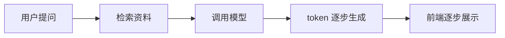
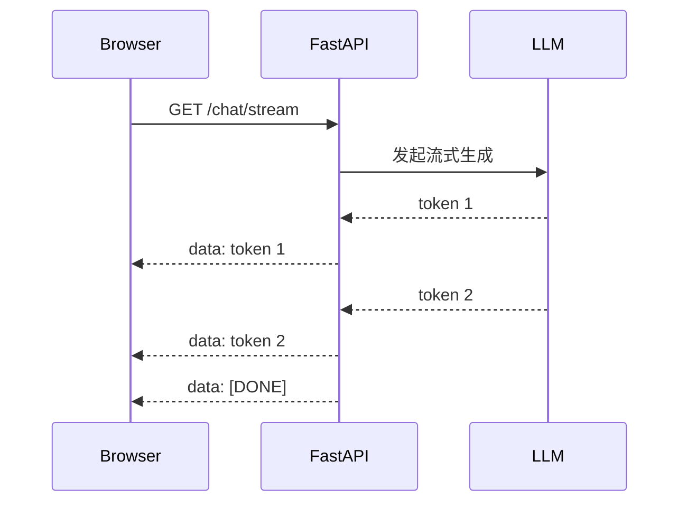
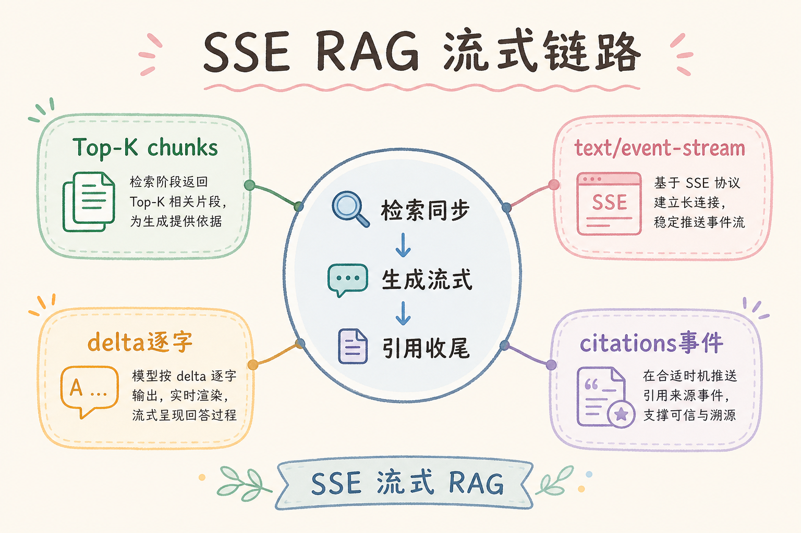
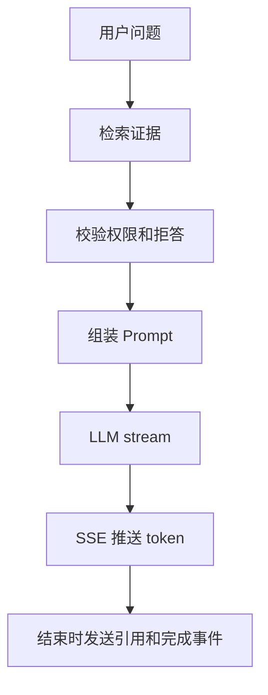
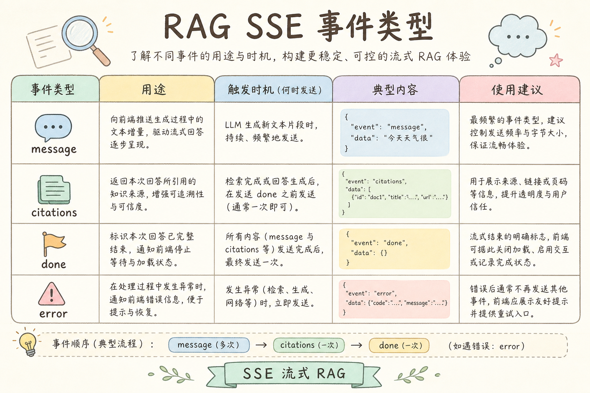
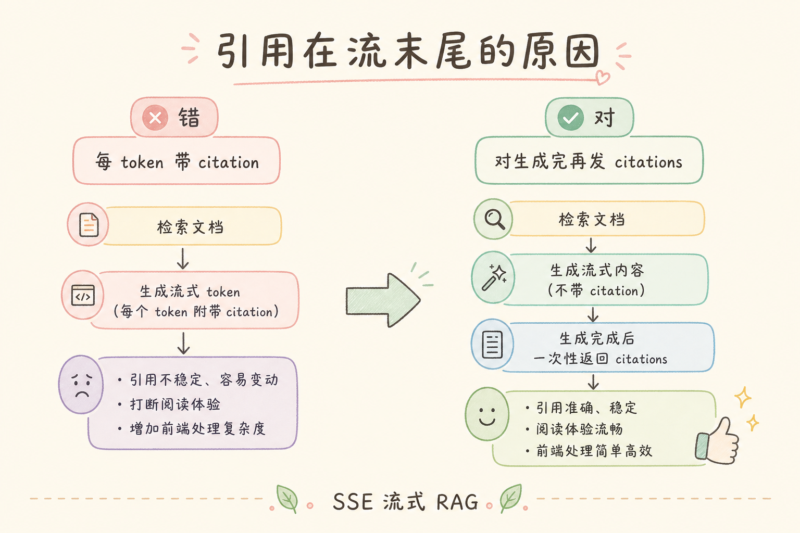

# C6 生成与 Grounding（五）：SSE RAG 流式输出入门

RAG 问答如果等模型完整生成后才返回，用户会觉得页面卡住。**SSE**（Server-Sent Events，服务器推送事件）是一种让后端持续向浏览器发送文本片段的方式，适合把大模型答案一边生成一边显示出来。

本文面向已经了解 FastAPI 和 RAG 基础链路的初学者。读完后，你应该能说明 SSE 解决什么问题、和 WebSocket 的区别，并写出一个最小可运行的流式回答接口。

### 本文边界与动手路径

本文聚焦「服务端单向推送 token」的最小落地，不讲 WebSocket 双向控制（见 [117](117.websocket-rag-streaming-tutorial.md)），也不展开生产级网关全量配置。动手路径如下：

| 步骤 | 你做什么 | 验收 |
| --- | --- | --- |
| A | 跑通 FastAPI `StreamingResponse` | 浏览器或 curl 能看到连续 `data:` |
| B | 前端用 `EventSource` 拼接答案 | 识别 `[DONE]` 后关闭连接 |
| C | 定义 citation / error / done 事件 | 前后端协议文档一致 |
| D | 在代理环境验证不缓冲 | 线上与本地首 token 延迟接近 |

最小交付物：检索与权限判断完成后，答案能边生成边显示，引用在结束时可靠返回。

## 目录

- [1. 为什么 RAG 需要流式输出](#1-为什么-rag-需要流式输出)
- [2. SSE 是什么](#2-sse-是什么)
- [3. SSE 和 WebSocket 怎么选](#3-sse-和-websocket-怎么选)
- [4. RAG 流式链路](#4-rag-流式链路)
- [5. 最小 FastAPI 示例](#5-最小-fastapi-示例)
- [6. 前端如何接收](#6-前端如何接收)
- [7. 错误、结束和引用](#7-错误结束和引用)
- [8. 常见错误](#8-常见错误)
- [9. FAQ](#9-faq)
- [10. 总结](#10-总结)

## 1. 为什么 RAG 需要流式输出

一次 RAG 回答通常要经历检索、组装上下文、调用模型、生成答案。模型生成长答案时可能需要几秒甚至更久。如果页面一直空白，用户很难判断系统是在工作还是已经失败。



流式输出的价值是降低等待感。它不一定让模型更快，但会让用户更早看到结果。

### 1.1 企业场景里的「空白焦虑」

内部知识库问答里，若首 token 超过三秒才出现，用户易重复点击或以为系统宕机。流式展示提供可见反馈；注意它改善的是**感知延迟**，检索慢时仍应在流开始前用首条 SSE 表达 `retrieving` 状态。

### 1.2 和一次性 JSON 回答的分工

| 场景 | 倾向一次性返回 | 倾向 SSE 流式 |
| --- | --- | --- |
| 短答案、后台批处理 | ✓ | |
| 聊天式长回答、需即时反馈 | | ✓ |
| 移动端弱网、需断点提示 | | ✓（配合结束事件） |
| 仅需结构化字段、无自然语言 | ✓ | |

## 2. SSE 是什么

SSE 是浏览器内置的一种单向推送协议。浏览器通过 HTTP 打开一条连接，后端不断往这条连接里写事件。

SSE 数据格式很简单：

```text
data: 第一段答案

data: 第二段答案

data: [DONE]
```

每条事件之间用空行分隔。浏览器端可以用 `EventSource` 接收。



重点是：SSE 是后端到前端的单向流。用户继续输入新消息时，通常重新发起一个请求。

### 2.1 协议细节初学者常忽略

- `Content-Type` 应为 `text/event-stream`；缺少时部分客户端无法解析。
- 每条事件以 `\n\n` 结尾；只写一个换行会导致事件粘连。
- `EventSource` 默认 GET；带复杂 body 的提问需改用 fetch + ReadableStream，协议格式仍可沿用 `data:`。
- 长连接可能被中间层空闲超时切断；生产环境要核对网关 `proxy_read_timeout` 与负载均衡 idle 设置。

## 3. SSE 和 WebSocket 怎么选

SSE 和 WebSocket 都能做实时通信，但适用场景不同。



| 维度 | SSE | WebSocket |
| --- | --- | --- |
| 通信方向 | 服务端到客户端单向 | 双向 |
| 浏览器支持 | 原生 EventSource | 原生 WebSocket |
| 适合 RAG 答案流 | 很适合 | 也可以 |
| 复杂互动 | 一般 | 更适合 |
| 断线重连 | EventSource 自带基础能力 | 需要自己处理更多 |

如果只是“后端不断把答案片段推给前端”，SSE 通常更简单。如果要做多人协作、实时输入状态、双向控制，再考虑 WebSocket。

### 3.1 决策口诀

**只要服务器一直说、客户端偶尔新开一轮提问** → 优先 SSE。**需要同连接里取消、心跳、协作广播** → 再评估 WebSocket。团队若尚无专职连接治理人力，用 SSE 把「检索 → 流式生成 → 引用收尾」跑通，往往比过早引入 WebSocket 更稳。

## 4. RAG 流式链路

RAG 流式输出要注意：检索和上下文组装通常不是流式的，真正流起来的是模型生成阶段。



引用通常在开始生成前就已经确定，因为它来自检索证据。前端可以先展示答案流，结束后再激活引用卡片。

### 案例

某企业差旅制度 RAG：用户问「一线城市住宿标准及超标审批」。链路应为：① 向量检索命中 `travel-policy.md` 两 chunk；② ACL 过滤掉无权限文档；③ 拒答判断通过；④ 开始 LLM 流式生成；⑤ 首条 SSE 可先发 `event: source` 带引用编号；⑥ token 持续 `data:`；⑦ 最后 `event: done`。验收：用户在三秒内看到首字；引用编号与检索 chunk 一致，而非模型临场编造。若检索零命中，应在**开始流式前**返回拒答或澄清，而不是先流一段再道歉。

### 先错对已

```text
-- ❌ 边流式生成边检索：用户已看到半句答案，才发现没有证据
-- 问题：幻觉与合规风险；前端难以回滚已展示内容

-- ✅ 检索、权限、拒答全部完成后，再打开 LLM stream 并推送 SSE
```

```text
-- ❌ 每个 token 单独一条 HTTP 响应（伪流式轮询）
-- 问题：连接开销大、顺序难保证、网关压力大

-- ✅ 单条长连接 StreamingResponse，media_type=text/event-stream
```

```text
-- ❌ 引用只在 Prompt 里给模型看，不通过 SSE 回传前端
-- 问题：用户无法点击溯源，审计无法对齐 chunk_id

-- ✅ 检索结果在 done 前以 citation 事件 JSON 下发，与日志 trace_id 关联
```

## 5. 最小 FastAPI 示例

下面示例不调用真实模型，而是用生成器模拟逐字输出。运行前安装：



```bash
pip install fastapi uvicorn
```

示例代码：

```python
import asyncio
from fastapi import FastAPI
from fastapi.responses import StreamingResponse

app = FastAPI()


async def fake_llm_stream(question: str):
    answer = f"这是关于 {question} 的流式回答。"
    for char in answer:
        await asyncio.sleep(0.05)
        yield char


async def sse_events(question: str):
    async for token in fake_llm_stream(question):
        yield f"data: {token}\n\n"
    yield "data: [DONE]\n\n"


@app.get("/chat/stream")
async def chat_stream(q: str):
    return StreamingResponse(
        sse_events(q),
        media_type="text/event-stream",
        headers={"Cache-Control": "no-cache"},
    )
```

启动：

```bash
uvicorn main:app --reload
```

浏览器访问：

```text
http://127.0.0.1:8000/chat/stream?q=差旅报销
```

你会看到服务端持续返回 `data:` 事件。真实项目只需要把 `fake_llm_stream()` 换成模型 SDK 的流式接口。

### 5.1 接入真实 LLM 时注意

把 SDK 的 `async for chunk in llm.astream(...)` 映射为 `yield f"data: {chunk}\n\n"` 即可。客户端断开时，生成器应能收到取消信号并停止调用模型，避免后台继续烧 token。建议在 `sse_events` 外层包一层 try/except，异常时发送 `event: error` 再关闭流。

## 6. 前端如何接收

浏览器可以用 `EventSource` 接收 SSE：



```ts
const source = new EventSource("/chat/stream?q=差旅报销");

source.onmessage = (event) => {
  if (event.data === "[DONE]") {
    source.close();
    return;
  }
  appendTokenToAnswer(event.data);
};

source.onerror = () => {
  source.close();
  showError("连接中断，请重试");
};
```

这段代码的关键是识别 `[DONE]` 并关闭连接。否则前端可能以为回答还没结束。

### 6.1 渲染性能

高频 token 下不要每个字符触发全量 Markdown 重排。可每 50～100ms 批量追加到缓冲区，或仅对纯文本区增量更新，流结束后再做一次完整渲染。移动端还要限制 DOM 节点增长，过长回答可考虑虚拟列表。

## 7. 错误、结束和引用

流式接口要定义清楚三类事件：

| 事件 | 用途 |
| --- | --- |
| `data` | 普通 token 或文本片段 |
| `error` | 后端发现错误时通知前端 |
| `done` | 回答结束，前端收尾 |

为了简单，很多项目用 `data: [DONE]` 表示结束。更成熟的做法是使用命名事件：

```text
event: citation
data: {"sources":[{"number":1,"title":"差旅制度"}]}

event: done
data: {}
```

不管采用哪种格式，都要保证前端和后端约定一致。

### 7.1 协议版本化

在团队内维护一页「SSE 事件契约」：字段名、是否向后兼容、新增 `type` 时旧客户端如何降级。发布前用契约测试（contract test）跑一遍：mock 检索 + mock LLM，断言事件顺序为 `source → data* → citation → done`。

## 8. 常见错误

这一节列出 SSE RAG 最常见的问题。核心原则是：流式只是传输方式，不能绕过 RAG 的证据和安全检查。

### 8.1 先生成再检索

流式阶段不能跳过检索。应先检索、权限过滤、拒答判断，再开始模型流式生成。

### 8.2 忘记发送结束事件

没有结束事件，前端无法判断回答完成。必须定义 `[DONE]` 或 `done`。

### 8.3 代理缓冲导致不流式

有些网关或代理会缓存响应。需要检查 Nginx、CDN、平台网关是否开启 buffering。

### 8.4 每个 token 都刷新复杂 DOM

前端如果每个 token 都做重布局，会卡顿。可以批量追加或节流渲染。

### 8.5 流式中途丢失引用

引用数据应来自检索结果，建议在结束事件或单独 citation 事件里返回，不要让模型临时编。

### 排错

1. **本地流式、线上整块返回**：查 Nginx `proxy_buffering off`、`X-Accel-Buffering: no`、CDN 是否缓存 GET 流接口。
2. **首 token 很慢但后续正常**：多半是检索或权限阶段耗时，不是 SSE 本身；用结构化日志拆分 `retrieve_ms` 与 `first_token_ms`（见 [190](190.structured-logging-rag-tutorial.md)）。
3. **连接莫名断开**：核对 idle timeout、WAF 规则、HTTP/2 与 SSE 兼容性；必要时降级 HTTP/1.1。
4. **前端重复拼接**：检查是否未关旧 `EventSource` 又新建连接；组件卸载时务必 `close()`。
5. **乱码或 JSON 解析失败**：`data:` 后若放 JSON，避免未转义换行；复杂 payload 用命名事件 + 单行 JSON。

### 评测

不必一开始压测上万并发。从业务抽 20～30 条问答，在相同检索配置下对比「流式 vs 非流式」：

| 指标 | 说明 |
| --- | --- |
| 首 token 延迟（TTFT） | 用户看到第一个字的时间 |
| 完整答案延迟 | 与一次性接口应接近 |
| 引用一致率 | citation 事件与检索 chunk_id 对齐 |
| 断线恢复 | 关 Tab 后后端是否停止生成 |

人工体验评分可简单三分：是否感觉「卡住」、引用是否可点、错误提示是否明确。上线前在预发环境走一遍真实网关路径，比只在 localhost 验证更有代表性。

## 9. FAQ

**Q1：SSE 支持 POST 吗？**  
浏览器原生 `EventSource` 主要使用 GET。需要 POST 时可以用 fetch stream 或自己封装。

**Q2：SSE 能取消生成吗？**  
前端关闭连接后，后端应检测断开并取消模型调用。不同框架处理方式不同。

**Q3：SSE 能传 JSON 吗？**  
可以。`data:` 后面放 JSON 字符串即可，前端收到后 `JSON.parse`。

**Q4：为什么本地能流式，线上不行？**  
常见原因是代理缓冲、压缩、中间层超时或平台不支持长连接。

**Q5：SSE 和 HTTP chunked 是一回事吗？**  
相关但不等同。SSE 在 chunked 之上约定 `data:` 事件格式。

## 10. 总结

SSE 是实现 RAG 答案流式展示的简单方案，适合服务端单向推送 token。

初学者先做到四点：

1. 检索和安全判断完成后再开始流式生成。
2. 后端用 `text/event-stream` 持续发送 `data:`。
3. 前端识别结束事件并关闭连接。
4. 引用、错误和完成状态要有明确协议。

当需求只是“让答案边生成边显示”时，SSE 通常比 WebSocket 更容易落地。

### 本篇检查清单

- [ ] 检索、ACL、拒答在流式开始前完成，日志可拆分各阶段耗时
- [ ] `StreamingResponse` 使用 `text/event-stream`，本地 curl 可见连续事件
- [ ] 前端识别 `[DONE]` 或 `done`，组件卸载时关闭 `EventSource`
- [ ] citation 来自检索结果，与 trace 日志中的 chunk_id 一致
- [ ] 预发环境验证网关不缓冲，TTFT 与本地量级接近
- [ ] 断连后后端停止 LLM 调用，无静默烧 token
