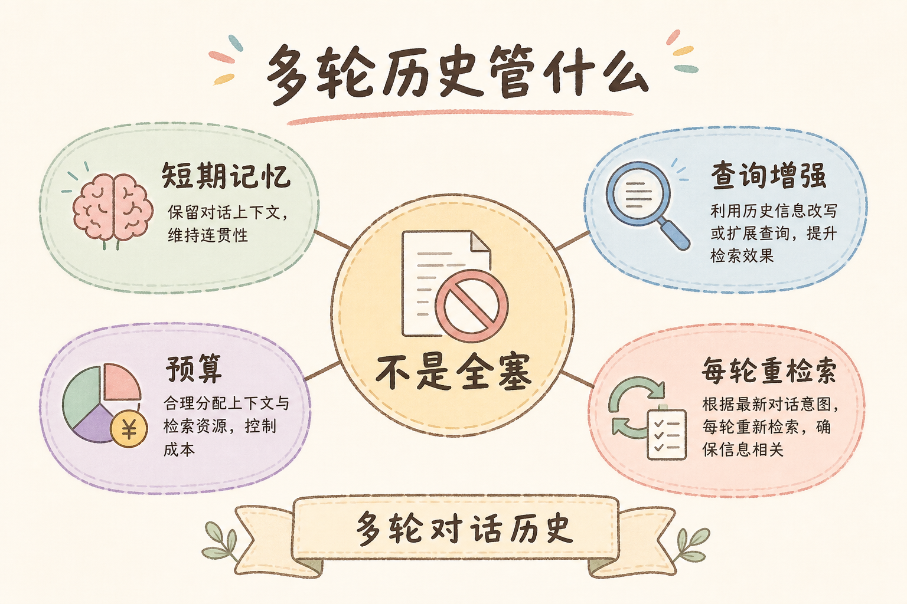
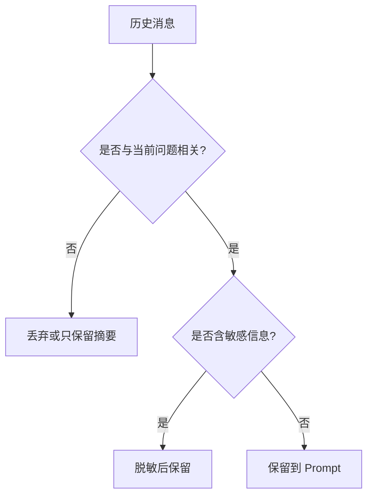
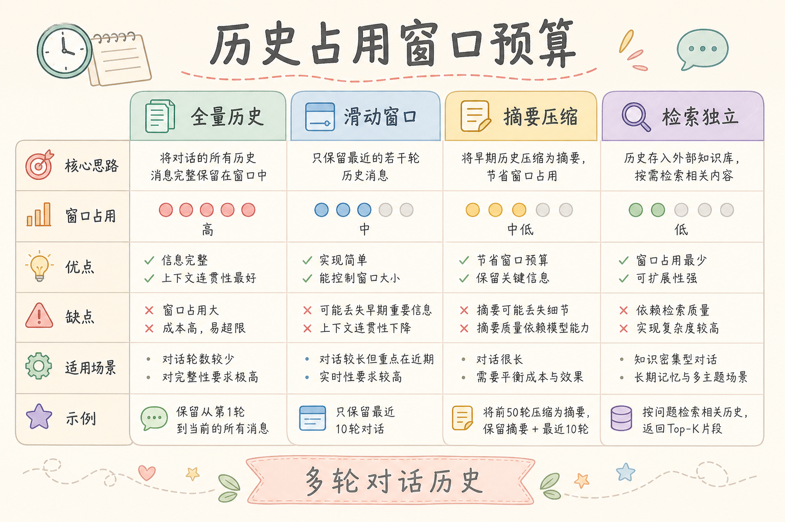
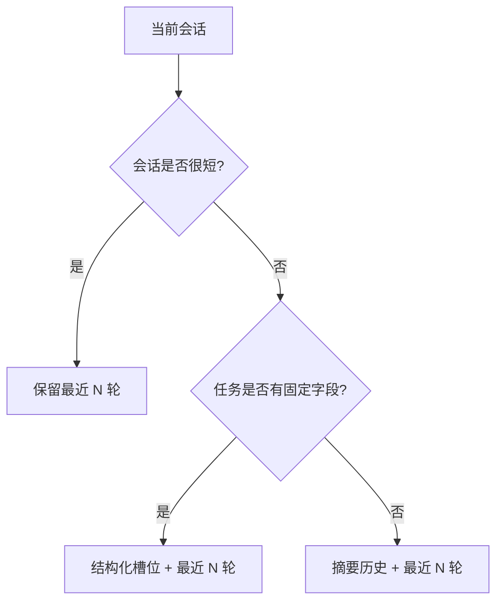
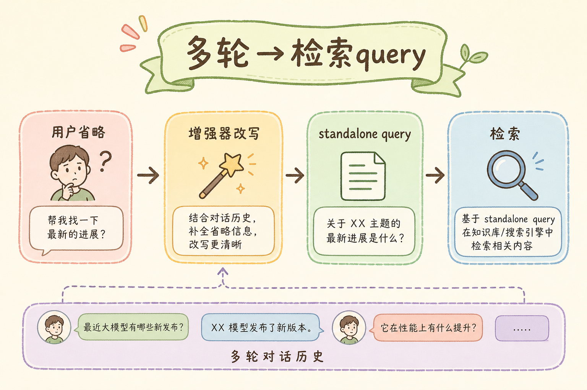

# C8 对话体验（三）：多轮历史管理完全指南

> 多轮问答看起来只是“把之前聊天记录一起发给模型”，但这会带来成本、隐私、上下文污染和回答跑偏。**多轮历史管理**要解决的问题是：在保留必要上下文的同时，不把无关、过期或敏感的历史无限塞进 Prompt。

### 本文边界与动手路径

本文讲历史裁剪与压缩策略，与 [119 摘要记忆](119.summary-memory-tutorial.md)、[120 指代消解](120.coreference-resolution-tutorial.md) 衔接。不讲向量库细节，但会强调历史如何影响检索 query。

| 步骤 | 你做什么 | 验收 |
| --- | --- | --- |
| A | 实现「最近 N 轮」拼接 | 第三句「那特殊商品呢」能带上前文主题 |
| B | 长会话触发摘要或槽位 | token 预算可控，日志有 policy 版本 |
| C | 敏感字段脱敏或不入库 | PII 不出现在长期 history 表 |
| D | 记录 `history_policy` 到 trace | 坏答案可复现当时带了哪些历史 |

---

## 目录

1. [为什么需要多轮历史管理](#1-为什么需要多轮历史管理)
2. [多轮历史是什么](#2-多轮历史是什么)
3. [它解决什么问题](#3-它解决什么问题)
4. [历史记录应该保留什么](#4-历史记录应该保留什么)
5. [三种历史压缩策略](#5-三种历史压缩策略)
6. [最小代码示例](#6-最小代码示例)
7. [常见陷阱与 FAQ](#7-常见陷阱与-faq)
8. [总结](#8-总结)

---

## 1. 为什么需要多轮历史管理

用户常常不会一次把问题问完整：

1. “退款政策是什么？”
2. “那特殊商品呢？”
3. “帮我写一段客服回复。”

第三句里的“特殊商品”和“客服回复”都依赖前文。如果完全不带历史，模型会不知道“那”指什么。

但如果把所有历史都带上，又会出现新问题：

- token 成本越来越高；
- 旧问题干扰新问题；
- 用户之前输入的 PII 被反复发送；
- 模型引用过期上下文；
- 会话很长时回答速度变慢。

所以历史管理的目标是“保留必要上下文”，不是“保留全部聊天”。

### 1.1 成本与质量的平衡

企业 RAG 常按 token 计费。若每轮把完整历史再发给模型，第十轮的成本可能是第一轮的十倍，而新增信息往往只有最后一句。历史管理是在**理解力**与**预算**之间画线：保留任务目标、已确认约束和必要来源，丢弃闲聊与过期主题。

---

## 2. 多轮历史是什么

**多轮历史**：当前问题之前的用户消息、助手回答、系统状态和已确认事实。

通俗说：它是对话里的“上下文记忆”。但这份记忆应该整理后再交给模型，而不是整本流水账都塞进去。


读图时重点看筛选和摘要：历史进入 Prompt 前应先处理。

### 2.1 存储层 vs Prompt 层

生产系统通常两层：数据库保存完整消息供审计与 UI 展示；**进入模型的 history** 经策略裁剪。不要把「DB 里有什么」等同于「模型该看什么」。

---

## 3. 它解决什么问题

| 问题 | 不管理历史 | 管理历史 |
|---|---|---|
| 指代不清 | “那它呢？”无法理解 | 保留当前主题 |
| 成本膨胀 | 每轮都带全部聊天 | 只带必要上下文 |
| 上下文污染 | 旧主题影响新答案 | 按主题或时间裁剪 |
| 隐私风险 | PII 反复发送 | 脱敏或丢弃敏感历史 |
| 调试困难 | 不知道模型看了哪些历史 | 记录 history policy |

历史管理也是质量控制。它会直接影响模型理解用户意图。



### 案例

退款咨询会话：用户先问政策，再问特殊商品，最后要客服话术。若每轮带全部原文，第六轮可能仍夹着五分钟前的天气闲聊，模型语气漂移。采用「最近 4 轮 + 较早摘要」：摘要写「用户咨询退款，已确认签收 7 天内、语气要正式」；最近轮保留「特殊商品」细节。验收：生成客服回复时引用正确政策句，且 Prompt token 较全量历史下降明显；trace 里可看到 `policy=v2_keep4_summarize`。

---

## 4. 历史记录应该保留什么

不是所有历史都同等重要。建议分四类处理：

| 历史类型 | 处理方式 | 例子 |
|---|---|---|
| 当前任务目标 | 保留 | “写一段客服回复” |
| 已确认条件 | 保留 | “语气要正式” |
| 已引用资料 | 可保留来源编号 | “退款政策 [1]” |
| 闲聊和过期主题 | 丢弃或摘要 | “刚才天气不错” |
| 敏感信息 | 脱敏或不带入 | 手机号、身份证号 |



这张图的结论：相关性和敏感性都要判断。

### 先错对已

```text
-- ❌ 数据库全量 messages 直接 join 进 Prompt
-- 问题：成本、污染、PII 反复出境

-- ✅ build_history(policy) 输出裁剪后的上下文块，并记录 policy_id
```

```text
-- ❌ 换话题后仍保留上一轮完整检索证据在 history 里
-- 问题：模型被旧文档牵引，检索 query 也跑偏

-- ✅ 话题切换时清空或压缩旧主题，检索仅跟当前轮
```

---

## 5. 三种历史压缩策略

历史压缩没有统一模板，核心是根据会话长度和任务类型选择保留方式。下面三种策略可以组合使用：短会话先用最近 N 轮，长会话加入摘要，业务流程明确时再抽取结构化槽位。





从图里应得出的结论：历史策略要随会话复杂度升级，不要一开始就把全部历史原样塞给模型。

### 5.1 最近 N 轮

只保留最近几轮对话。

适合简单聊天或短任务，例如最近 3 到 5 轮。

优点是实现简单，缺点是早期关键条件可能被丢掉。

### 5.2 摘要历史

把较早对话压缩成短摘要。

```text
会话摘要：用户正在咨询退款政策，已确认场景为“签收后 7 天内”，希望生成客服回复，语气正式。
```

适合长对话，但要注意摘要可能遗漏或误写条件。

### 5.3 结构化槽位

把历史整理成字段。

| 字段 | 示例 |
|---|---|
| `task` | 生成客服回复 |
| `topic` | 退款政策 |
| `constraints` | 正式语气，不承诺超出政策 |
| `sources` | refund.md#section-2 |

结构化槽位适合业务流程明确的系统，比自然语言摘要更稳定。

### 5.4 与检索 query 的关系

多轮历史不仅影响生成 Prompt，也影响**检索用的问题文本**。第二句「那特殊商品呢」检索前常需改写或指代消解（见 [120](120.coreference-resolution-tutorial.md)）。历史管理过粗会导致改写缺少主题；过细则浪费 token。实践上：检索用「最近 2 轮 + 槽位」，生成用「摘要 + 最近 N 轮 + 证据」。

---

## 6. 最小代码示例

下面示例演示“最近 N 轮 + 简单摘要”的组合。真实项目可以把摘要换成模型生成或规则抽取。



```python
from dataclasses import dataclass


@dataclass
class Message:
    role: str
    content: str


def build_history(messages: list[Message], keep_last: int = 4) -> str:
    old_messages = messages[:-keep_last]
    recent_messages = messages[-keep_last:]

    summary = ""
    if old_messages:
        summary = "较早对话摘要：用户之前围绕同一知识库问题持续追问。"

    recent = "\n".join(
        f"{message.role}: {message.content}"
        for message in recent_messages
    )

    return f"{summary}\n\n最近对话：\n{recent}".strip()
```

使用方式：

```python
history = build_history([
    Message("user", "退款政策是什么？"),
    Message("assistant", "签收后 7 天内可申请退款。"),
    Message("user", "那特殊商品呢？"),
    Message("assistant", "定制商品通常不支持无理由退货。"),
])

print(history)
```

这段代码的重点不是摘要质量，而是展示一个原则：历史进入 Prompt 前应该经过策略处理。

### 6.1 接入生产时

为 `build_history` 增加 `policy_version` 参数并写入日志；摘要函数替换为 LLM 时，约束「只写已确认事实」并保留源消息 id 范围，便于回滚错误摘要。

---

## 7. 常见陷阱与 FAQ

下面这些问题都来自同一个误区：把历史当成“越多越安全”的记忆。对 RAG 聊天来说，历史既可能帮模型理解指代，也可能把旧主题、敏感信息和错误上下文带进新答案。

### 7.1 错：每轮都带完整历史

这会让成本线性增长，并把旧主题持续带入新问题。长会话必须裁剪或摘要。

### 7.2 错：摘要没有版本和来源

摘要可能出错。建议记录摘要生成时间、策略版本和关键来源，方便排查。

### 7.3 错：把敏感信息写进长期记忆

手机号、身份证号、地址等信息不应默认进入长期历史。需要保留时也应脱敏。

### 7.4 FAQ：历史越多，答案越好吗？

不一定。无关历史会干扰回答。真正有用的是当前任务目标、限制条件和必要来源。

### 7.5 FAQ：什么时候用结构化槽位？

当业务流程清晰时使用，例如客服回复、工单处理、报价助手。开放聊天可以先用最近 N 轮加摘要。

### 排错

1. **第二轮开始答非所问**：检查是否未带历史或 `keep_last` 过小；同时看检索 query 是否未改写。
2. **token 暴涨**：打印每轮 `history_tokens`；阈值触发摘要是否生效。
3. **旧政策答案反复出现**：话题切换后摘要未更新，或槽位 `topic` 未刷新。
4. **合规审计失败**：DB 有 PII 但 Prompt 未脱敏——检查 `build_history` 与展示层是否同一数据源。
5. **无法复现坏答案**：trace 缺少 `policy_version` 与裁剪后 history 快照 hash。

### 评测

构造 30～50 条多轮脚本（3～5 轮/条），标注每轮期望是否依赖历史：

| 指标 | 说明 |
| --- | --- |
| 指代理解率 | 含「那/它」的轮次是否答对主题 |
| 平均 history tokens | 对比全量历史的降幅 |
| 污染率 | 换话题后是否仍引用旧主题 |
| 摘要忠实度 | 人工抽查摘要是否丢关键条件 |

对比 `keep_last=2/4/6` 与「摘要+4轮」的 Pareto 曲线，选业务可接受的点，而不是盲目增大 N。

---

## 8. 总结

多轮历史管理的核心是：**让模型记住必要条件，而不是背负整段聊天流水账**。

最小落地方案：

1. 最近几轮直接保留；
2. 更早历史压缩成摘要；
3. 关键任务信息整理成槽位；
4. 敏感信息脱敏或不进入长期记忆；
5. 记录 history policy，方便复现坏答案。

如果一句话记忆：历史不是越多越好，而是越相关、越干净越好。

### 本篇检查清单

- [ ] DB 全量消息与进入 Prompt 的 history 分离，策略函数单一入口
- [ ] 短会话最近 N 轮、长会话摘要或槽位，token 有阈值监控
- [ ] PII 脱敏或不进入长期记忆，合规可说明
- [ ] trace 记录 `policy_version` 与裁剪后 history 摘要
- [ ] 多轮评测集覆盖指代、换话题、客服生成三类场景
- [ ] 检索 query 改写与 history 策略联调，避免「生成懂、检索不懂」
