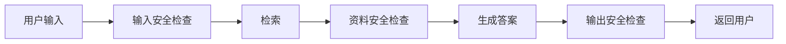
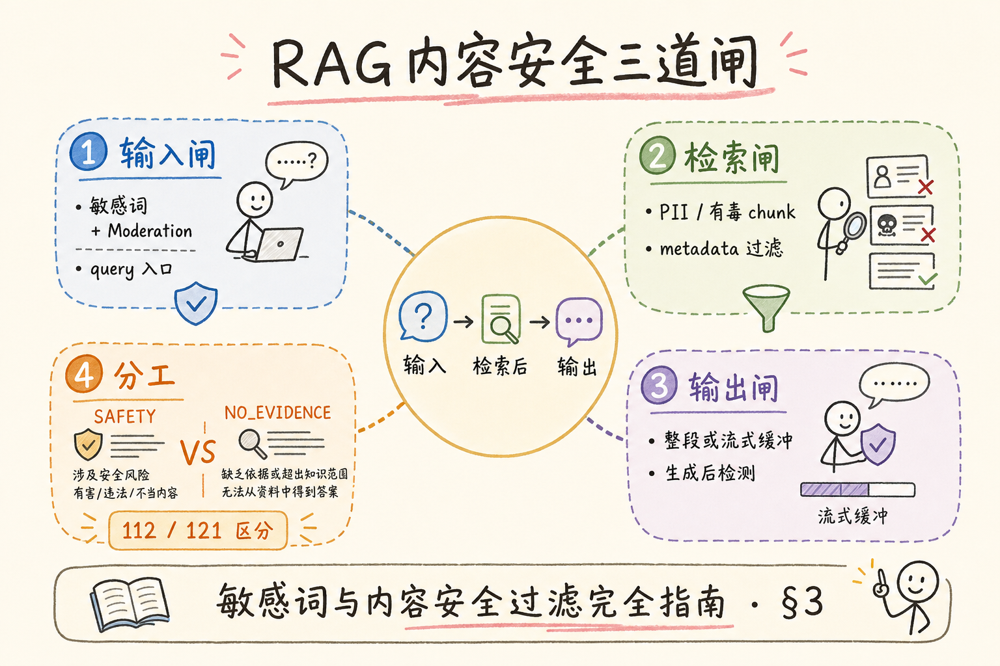
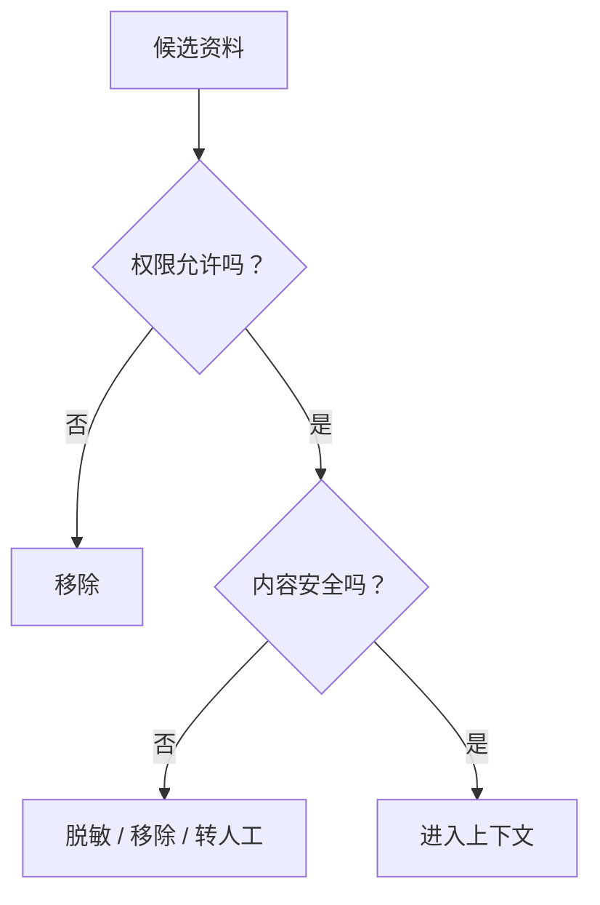
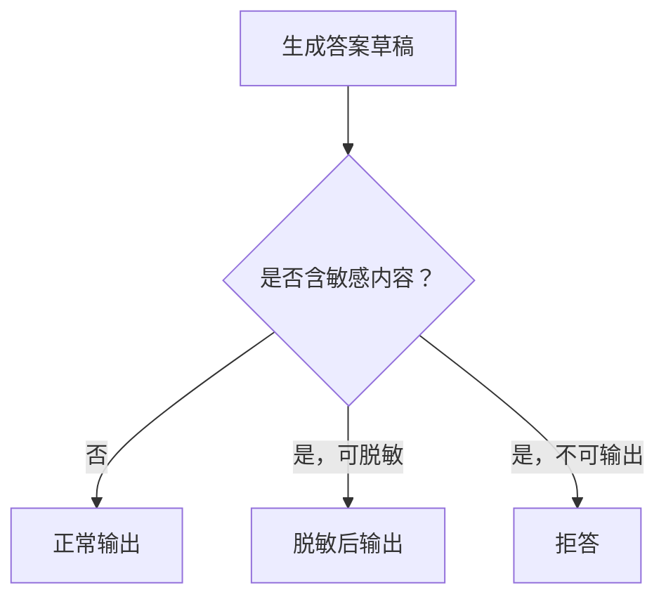
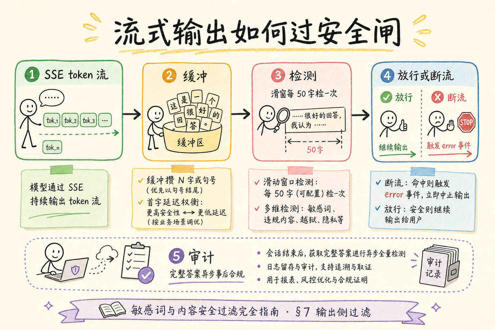
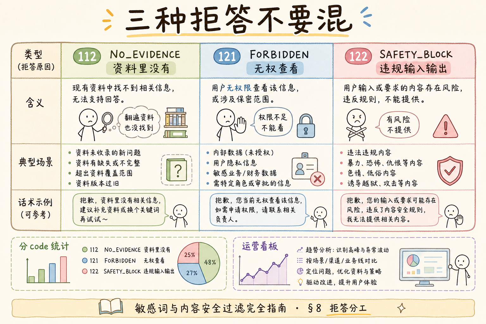

# C6 安全与边界：RAG 内容安全过滤入门

RAG 系统不只要回答准确，还要避免输出危险、违法、隐私泄露或越权内容。**内容安全过滤**就是在用户输入、检索资料和模型输出三个位置做检查，发现风险时拒答、脱敏或转人工。

本文面向已经了解拒答策略和权限过滤的初学者。读完后，你应该能画出 RAG 安全过滤链路，写出一个最小规则过滤器，并知道安全过滤不能替代权限控制。

## 目录

- [1. 内容安全过滤解决什么问题](#1-内容安全过滤解决什么问题)
- [2. 三个检查点：输入、检索、输出](#2-三个检查点输入检索输出)
- [3. 安全过滤和权限过滤的区别](#3-安全过滤和权限过滤的区别)
- [4. 最小规则过滤器](#4-最小规则过滤器)
- [5. PII 脱敏](#5-pii-脱敏)
- [6. 与拒答策略结合](#6-与拒答策略结合)
- [7. 日志与人工复核](#7-日志与人工复核)
- [8. 常见错误](#8-常见错误)
- [9. FAQ](#9-faq)
- [10. 总结](#10-总结)

## 1. 内容安全过滤解决什么问题

内容安全过滤关注“这段内容能不能处理或输出”。例如用户让系统泄露个人手机号、生成危险操作步骤、绕过权限获取合同内容，都需要拦截。



它的目标不是让系统保守到什么都不答，而是在高风险场景下有明确边界。

## 2. 三个检查点：输入、检索、输出

RAG 安全过滤至少有三个检查点。

| 检查点 | 例子 | 动作 |
| --- | --- | --- |
| 输入 | 用户请求导出他人隐私 | 拒答或澄清权限 |
| 检索资料 | chunk 中包含身份证号 | 脱敏或过滤 |
| 输出 | 模型复述敏感字段 | 拦截或改写 |

只做输出检查不够。因为敏感资料一旦进入模型上下文，就可能被模型复述或影响回答。

## 3. 安全过滤和权限过滤的区别

两者经常一起出现，但不是一回事。

| 类型 | 回答的问题 |
| --- | --- |
| 权限过滤 | 这个用户能不能看这份资料 |
| 内容安全过滤 | 这段内容能不能被处理或输出 |





权限通过不代表内容一定能原样输出。例如 HR 管理员有权查看员工资料，但系统仍可能需要隐藏身份证号。

## 4. 最小规则过滤器

下面示例用规则检测敏感词和手机号。真实项目应结合更成熟的审核模型、PII 检测和业务规则。

```python
import re


BLOCKED_KEYWORDS = {"绕过权限", "导出所有密码"}


def safety_check(text: str) -> tuple[bool, str]:
    if any(word in text for word in BLOCKED_KEYWORDS):
        return False, "命中高风险请求"
    if re.search(r"1[3-9]\d{9}", text):
        return False, "包含手机号"
    return True, "ok"


print(safety_check("帮我导出所有密码"))
print(safety_check("我的手机号是 13812345678"))
```

规则过滤器容易误判和漏判，但它适合作为第一层明确边界。

## 5. PII 脱敏

**PII**（Personally Identifiable Information，个人可识别信息）包括手机号、身份证号、邮箱、住址等。RAG 输出时常见做法是脱敏。

```python
import re


def redact_phone(text: str) -> str:
    return re.sub(r"(1[3-9]\d)\d{4}(\d{4})", r"\1****\2", text)


print(redact_phone("联系人手机号：13812345678"))
```

输出应变成：

```text
联系人手机号：138****5678
```

脱敏不是万能的。如果用户没有权限查看某类资料，应先权限拒绝，而不是只脱敏。

## 6. 与拒答策略结合

内容安全过滤可以触发拒答，也可以触发部分回答。



例如答案里包含手机号，可以脱敏；如果用户要求绕过权限，则应该拒答。

## 7. 日志与人工复核

安全过滤需要记录，但日志本身不能泄露敏感内容。



| 字段 | 建议 |
| --- | --- |
| trace_id | 记录 |
| 风险类型 | 记录 |
| 原始敏感内容 | 默认不记录或加密 |
| 处理动作 | 记录：拒答、脱敏、转人工 |
| 用户与租户 | 按合规要求记录 |

高风险命中可以转人工复核，但要避免把敏感内容扩散到更多系统。

## 8. 常见错误

这一节列出内容安全过滤最常见的问题。核心原则是：安全检查要在内容进入和离开模型时都发生。



### 8.1 只检查输出

敏感资料已经进入上下文后，模型可能被影响。检索资料进入模型前也要检查。

### 8.2 用安全过滤替代权限控制

安全过滤不能判断用户是否有权访问文档。权限过滤必须独立存在。

### 8.3 日志保存完整敏感内容

安全系统本身不能变成泄露源。日志应最小化、脱敏或加密。

### 8.4 规则命中后没有用户提示

用户需要知道请求被拒绝的大致原因，但不要暴露安全规则细节。

### 8.5 没有人工复核路径

安全过滤可能误判。重要业务应提供申诉或人工复核流程。

## 9. FAQ

**Q1：内容安全过滤会不会影响正常回答？**  
会有误判可能。需要通过日志、抽样和人工复核持续调规则。

**Q2：敏感资料是否一定不能进入模型？**  
取决于合规要求、权限和模型部署方式。高敏数据应尽量脱敏或使用受控环境。

**Q3：安全过滤应该在前端还是后端做？**  
后端必须做。前端可以辅助提示，但不能作为安全边界。

**Q4：开源审核模型够用吗？**  
要看场景。高风险业务通常需要规则、模型、人工复核和审计日志组合。

## 10. 总结

内容安全过滤让 RAG 系统在输入、检索资料和输出阶段都有风险边界。

初学者先做到四点：

1. 输入、检索资料、输出三个位置都做检查。
2. 权限过滤和安全过滤分开设计。
3. PII 能脱敏时脱敏，不能安全输出时拒答。
4. 安全日志最小化记录，避免二次泄露。

当系统开始接入真实企业资料时，内容安全过滤应和权限、拒答、审计一起设计，而不是上线后再补。
