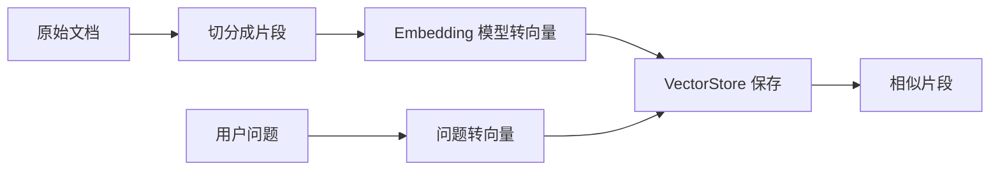
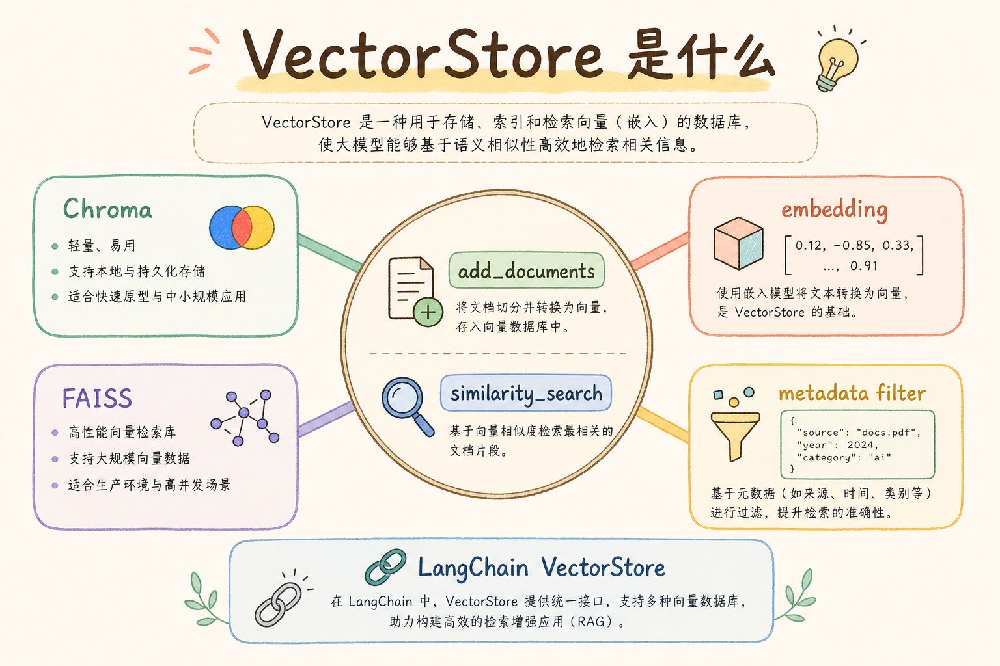
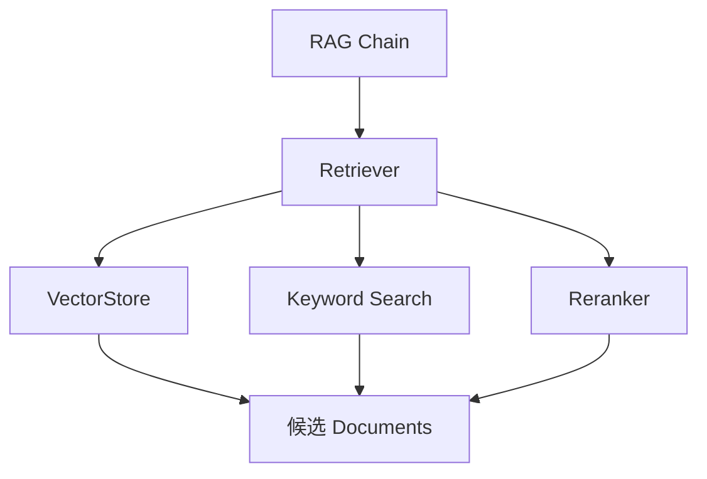
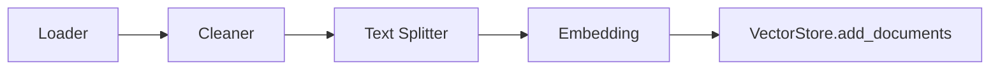
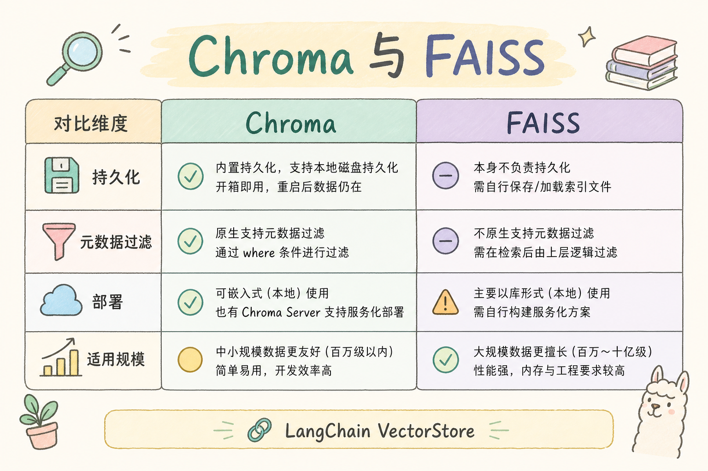
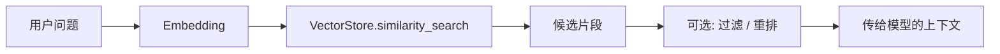
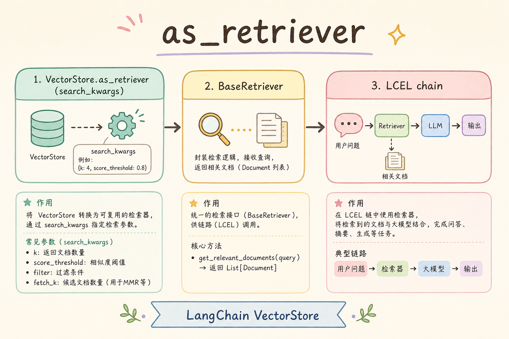

# D 框架与架构（四）：LangChain VectorStore 入门指南

做 RAG 时，文档不能原样塞进模型。常见做法是把文档切成片段，再转换成向量，存进向量数据库。LangChain 里的 **VectorStore** 抽象，就是为了用统一方式对接这些向量存储：写入文档、相似度搜索、返回候选片段。

本文面向初学者。读完后，你应该能理解 VectorStore 是什么、它和 Retriever 的区别、一次写入与查询如何发生，并知道在项目中如何避免“能搜到但不好用”的常见问题。

## 目录

- [1. 为什么需要 VectorStore](#1-为什么需要-vectorstore)
- [2. VectorStore 是什么](#2-vectorstore-是什么)
- [3. 它和 Retriever 的边界](#3-它和-retriever-的边界)
- [4. 写入流程：从文档到向量](#4-写入流程从文档到向量)
- [5. 查询流程：从问题到候选片段](#5-查询流程从问题到候选片段)
- [6. 最小可运行示例](#6-最小可运行示例)
- [7. 元数据和过滤](#7-元数据和过滤)
- [8. 常见错误](#8-常见错误)
- [9. FAQ](#9-faq)
- [10. 总结](#10-总结)

## 1. 为什么需要 VectorStore

大模型不能记住你的全部私有文档。RAG 的做法是：用户提问时，先从文档库里找相关片段，再把这些片段放进 prompt。为了按语义找资料，系统需要把文本转成向量，并能快速搜索相似向量。

**向量**可以理解为一串数字，用来表示文本含义的大致位置。含义接近的文本，向量距离通常更近。VectorStore 就是保存这些向量并支持相似度查询的组件。



这张图说明 VectorStore 同时参与写入和查询，但它不负责生成最终答案。

## 2. VectorStore 是什么

**VectorStore**：向量存储接口，用于保存文本向量，并根据查询向量找出相似文档。通俗说，它像一个按“语义相似度”整理的资料仓库。

VectorStore 通常提供这些能力：

| 能力 | 说明 |
|---|---|
| 添加文档 | 保存文本、向量和元数据 |
| 相似度搜索 | 根据查询找语义接近的片段 |
| 元数据过滤 | 限制来源、租户、分类、时间范围 |
| 删除或更新 | 维护文档版本和索引 |

不同向量数据库的底层实现不同，但 LangChain 的 VectorStore 抽象让应用层用相近方式接入它们。

## 3. 它和 Retriever 的边界

VectorStore 更偏存储和相似度搜索，Retriever 更偏应用层检索入口。Retriever 可以使用 VectorStore，但不等于 VectorStore。

| 对比点 | VectorStore | Retriever |
|---|---|---|
| 关注点 | 向量保存和相似搜索 | 输入问题，返回可用文档 |
| 是否懂业务权限 | 通常只支持过滤条件 | 可以封装权限、重排、混合检索 |
| 是否一定用向量 | 是 | 不一定 |
| 在链路中的位置 | 底层数据能力 | RAG 的资料入口 |





这张图的重点是：VectorStore 可以被 Retriever 调用，但 Retriever 可以做更多应用层控制。

## 4. 写入流程：从文档到向量

VectorStore 的写入不是把整本书一次塞进去。通常要先加载文档、清洗、切分、生成 embedding，再写入。

| 步骤 | 目的 | 常见坑 |
|---|---|---|
| 加载 | 读取 PDF、Markdown、网页等来源 | 丢失标题和来源 |
| 清洗 | 去掉导航、页脚、乱码 | 误删关键内容 |
| 切分 | 控制每个片段长度 | 切太碎或太大 |
| 向量化 | 生成 embedding | 模型版本不一致 |
| 写入 | 保存文本、向量、元数据 | 没有稳定 ID |



写入阶段最重要的是保留元数据。没有 `source_id`、标题、权限标记，后面很难做引用、更新和过滤。

## 5. 查询流程：从问题到候选片段

查询阶段通常会把用户问题也转成向量，然后在 VectorStore 中找相似片段。这个过程看起来简单，但结果质量取决于切分、embedding、过滤和 top_k 设置。





如果用户问的是精确 ID、错误码、订单号，纯向量搜索可能不稳定。这类场景可以结合关键词检索或在元数据里做精确过滤。

## 6. 最小可运行示例

下面用一个内存版“向量库”模拟相似度搜索。为了避免依赖真实 embedding 服务，这里用词集合重叠度代替语义向量，只展示 VectorStore 的接口形状。

运行环境：Python 3.10+。

```python
from dataclasses import dataclass


@dataclass
class Document:
    page_content: str
    metadata: dict


class SimpleVectorStore:
    def __init__(self):
        self.documents: list[Document] = []

    def add_documents(self, docs: list[Document]) -> None:
        self.documents.extend(docs)

    def similarity_search(self, query: str, k: int = 3) -> list[Document]:
        query_words = set(query.lower().split())

        def score(doc: Document) -> int:
            return len(query_words & set(doc.page_content.lower().split()))

        ranked = sorted(self.documents, key=score, reverse=True)
        return [doc for doc in ranked if score(doc) > 0][:k]


store = SimpleVectorStore()
store.add_documents([
    Document("VectorStore 保存文本向量并支持相似度搜索", {"source_id": "vec-1"}),
    Document("Retriever 是 RAG 的资料入口", {"source_id": "ret-1"}),
])

for doc in store.similarity_search("VectorStore 搜索"):
    print(doc.metadata["source_id"], doc.page_content)
```

真实 VectorStore 会用 embedding 向量和索引算法代替词集合重叠，但应用层关心的仍然是：添加文档、查询相似文档、拿回 Document。

## 7. 元数据和过滤

元数据不是装饰字段，而是工程必需品。它决定后续能不能做权限隔离、引用展示、增量更新和问题排查。



建议至少保留这些元数据：

| 字段 | 用途 |
|---|---|
| `source_id` | 引用和排查 |
| `title` | 前端展示 |
| `tenant_id` | 多租户隔离 |
| `doc_type` | 按文档类型过滤 |
| `updated_at` | 增量更新和版本判断 |

例如多租户系统查询时，不能只做相似度搜索，还要加上租户过滤。否则用户可能看到别的客户的资料。

```python
def filter_by_tenant(docs: list[Document], tenant_id: str) -> list[Document]:
    return [doc for doc in docs if doc.metadata.get("tenant_id") == tenant_id]
```

真实项目中，最好在 VectorStore 查询层就使用过滤条件，而不是等文档进入 prompt 后再让模型判断。

## 8. 常见错误

第一个错误是只关注向量库品牌，不关注数据质量。切分混乱、元数据缺失、重复文档太多时，换数据库也很难改善答案质量。

第二个错误是没有稳定文档 ID。没有 ID，更新文档时只能重复插入，久而久之检索结果会出现旧版本和新版本混杂。

第三个错误是把 `top_k` 设置得很大。候选越多不一定越好，噪声会占用上下文窗口。应结合重排和评估来决定数量。

第四个错误是忽略删除和更新。知识库不是一次性导入后永远不变。产品文档、政策、价格更新后，旧向量也要同步处理。

## 9. FAQ

**Q：VectorStore 必须是独立数据库吗？**  
不一定。学习阶段可以用内存或本地文件方案。生产环境通常会使用专门的向量数据库或支持向量索引的搜索引擎。

**Q：向量搜索是不是一定比关键词搜索好？**  
不是。向量适合语义相近的问题，关键词适合精确词、编号、错误码。很多系统会使用混合检索。

**Q：Embedding 模型换了以后要重新入库吗？**  
通常需要。不同模型生成的向量空间不一致，混用会影响相似度搜索。

**Q：VectorStore 能防止模型幻觉吗？**  
不能。它只提供候选资料。模型是否忠实使用资料，还需要 prompt 约束、引用校验和评估。

## 10. 总结

VectorStore 是 RAG 的底层资料仓库：保存文本向量，根据问题找相似片段。它解决的是“如何快速找语义相关资料”，不是“如何最终回答正确”。


初学者落地时优先抓四件事：切分合理、元数据完整、过滤可靠、评估可重复。只要这四件事稳定，VectorStore 才能真正支撑后面的 Retriever 和生成链路。
