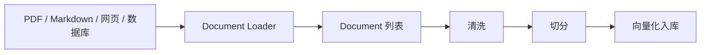
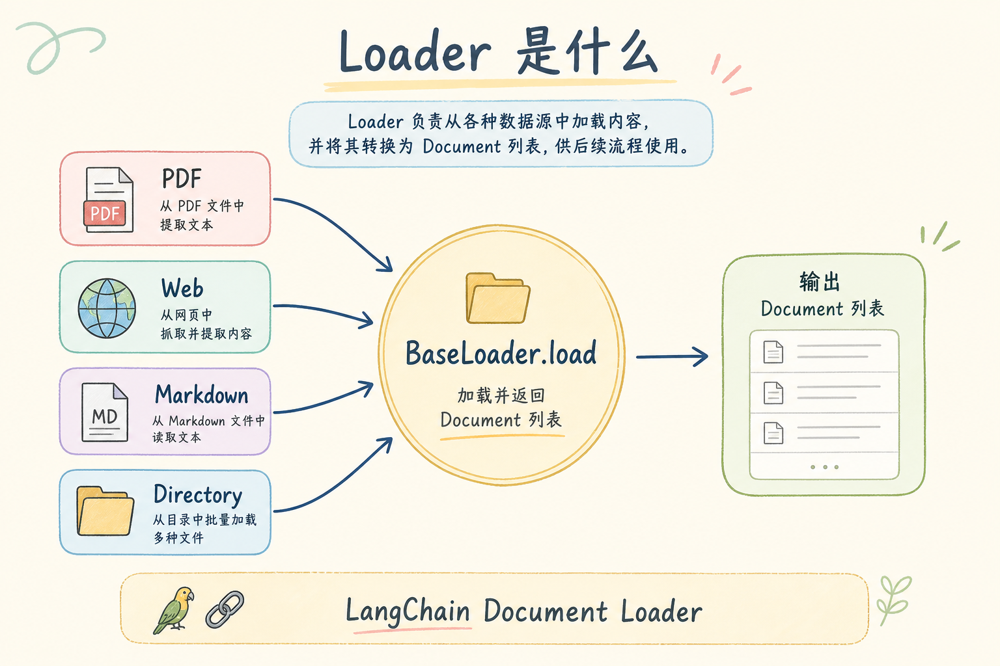
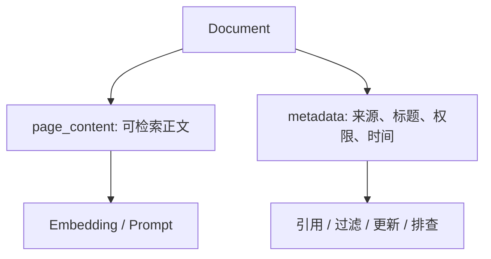
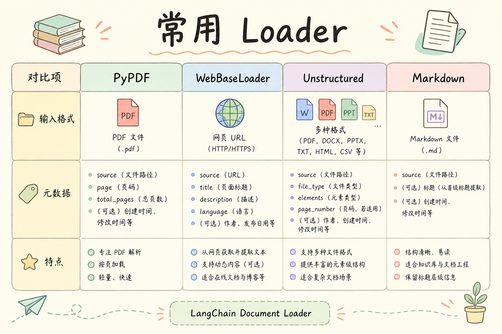
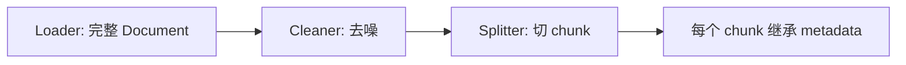

# D 框架与架构（五）：LangChain Document Loader 入门指南

RAG 系统的第一步不是向量数据库，也不是模型，而是把原始资料读进来。如果这一步读错了，后面切分、检索、生成都会跟着错。LangChain 的 **Document Loader** 要解决的就是“从不同来源加载文档，并转成统一 Document 格式”的问题。

本文面向初学者。读完后，你应该能理解 Loader 是什么、它为什么重要、如何保留来源元数据，并能写出一个读取 Markdown 文件的最小加载器。

## 目录

- [1. 为什么 Loader 是 RAG 的入口](#1-为什么-loader-是-rag-的入口)
- [2. Document Loader 是什么](#2-document-loader-是什么)
- [3. Document 的内容和元数据](#3-document-的内容和元数据)
- [4. 从文件到 Document 的流程](#4-从文件到-document-的流程)
- [5. 最小可运行示例](#5-最小可运行示例)
- [6. 加载后要做哪些清洗](#6-加载后要做哪些清洗)
- [7. Loader 和 Splitter 的边界](#7-loader-和-splitter-的边界)
- [8. 常见错误](#8-常见错误)
- [9. FAQ](#9-faq)
- [10. 总结](#10-总结)

## 1. 为什么 Loader 是 RAG 的入口

如果文档加载阶段丢失标题、来源路径或更新时间，后面即使检索命中了，也很难告诉用户答案来自哪里。更严重的是，加载器如果把页眉、导航、广告、重复页脚都当正文写入知识库，检索结果会被噪声污染。

Loader 的职责不是“让模型回答问题”，而是把外部资料可靠地搬进系统。它是数据管道的第一道门。



这张图说明 Loader 位于最前面。入口质量差，后面的步骤很难补救。

## 2. Document Loader 是什么

**Document Loader**：读取某种数据来源，并输出统一 `Document` 对象的组件。通俗说，它像搬运工，把不同格式的资料搬成同一种箱子。

常见来源包括：

| 来源 | Loader 要处理的问题 |
|---|---|
| Markdown | 保留标题、正文、路径 |
| PDF | 处理分页、表格、提取顺序 |
| 网页 | 去掉导航、广告、脚本 |
| 数据库 | 把记录转换成可检索文本 |
| CSV | 决定每行或每组字段如何变成文档 |

初学者不要急着接所有来源。先选一种你项目真正需要的资料格式，把加载、元数据和清洗跑通。

## 3. Document 的内容和元数据

在 LangChain 里，`Document` 通常包含两部分：`page_content` 和 `metadata`。

| 字段 | 作用 | 示例 |
|---|---|---|
| `page_content` | 文档正文 | “退款申请需在订单完成前提交。” |
| `metadata` | 附加信息 | `source_id`、`path`、`title` |

`page_content` 是给检索和模型读的，`metadata` 是给系统控制和追踪用的。两者都重要。





如果只保留正文，不保留元数据，后续很难做引用展示、权限过滤和增量更新。

## 4. 从文件到 Document 的流程

一个稳妥的加载流程通常包括读取文件、提取标题、生成稳定 ID、记录路径和更新时间。

| 步骤 | 目的 |
|---|---|
| 读取文件 | 获取原始文本 |
| 解析标题 | 给前端和引用使用 |
| 生成 `source_id` | 后续引用和更新 |
| 保存路径 | 方便定位原文 |
| 保存更新时间 | 判断是否需要重新入库 |


这里的关键不是代码复杂度，而是信息不要丢。很多 RAG 问题最终追溯到“最初加载时没保存来源”。

## 5. 最小可运行示例

下面写一个读取 Markdown 文件的最小加载器。它会把文件内容放进 `page_content`，并把路径、标题和 source_id 放进元数据。



运行环境：Python 3.10+。

```python
from dataclasses import dataclass
from pathlib import Path
import hashlib


@dataclass
class Document:
    page_content: str
    metadata: dict


def extract_title(text: str, fallback: str) -> str:
    for line in text.splitlines():
        if line.startswith("# "):
            return line.removeprefix("# ").strip()
    return fallback


def make_source_id(path: Path) -> str:
    return hashlib.sha1(str(path.resolve()).encode("utf-8")).hexdigest()[:12]


def load_markdown(path: str) -> Document:
    file_path = Path(path)
    text = file_path.read_text(encoding="utf-8")
    return Document(
        page_content=text,
        metadata={
            "source_id": make_source_id(file_path),
            "path": str(file_path),
            "title": extract_title(text, file_path.stem),
            "updated_at": file_path.stat().st_mtime,
        },
    )


doc = load_markdown("README.md")
print(doc.metadata)
print(doc.page_content[:80])
```

这段代码的重点是元数据。即使后面切分成多个 chunk，每个 chunk 也应该继承这些来源信息。

## 6. 加载后要做哪些清洗

Loader 只负责读入，不代表读入的内容都适合进知识库。加载后通常还需要清洗。

| 噪声 | 处理方式 |
|---|---|
| 网站导航 | 删除重复菜单和页脚 |
| PDF 页码 | 去掉孤立页码 |
| 版权声明 | 视业务需要保留或删除 |
| 多余空行 | 规范化空白 |
| 乱码 | 修正编码或丢弃坏段落 |

清洗要谨慎。不要为了干净，把标题、表格说明、警告信息删掉。建议先抽样查看清洗前后差异，再批量处理。

## 7. Loader 和 Splitter 的边界

Loader 负责“读进来”，Splitter 负责“切成适合检索的片段”。两者不要混在一起。

| 组件 | 主要职责 | 不应该做什么 |
|---|---|---|
| Loader | 读取来源并保留元数据 | 决定 chunk 大小 |
| Splitter | 按规则切分文本 | 重新猜来源路径 |

如果 Loader 阶段就随意切分，后面调整 chunk 策略会很麻烦。更好的做法是先产出完整 Document，再把它交给 Splitter。



这张图的重点是 metadata 传递。切分后的小片段仍然要知道自己来自哪份原文。

## 8. 常见错误

第一个错误是只保存正文，不保存来源。这样用户问“答案来自哪里”时，系统无法给出可信引用。

第二个错误是把网页所有文本都加载进去。导航、推荐文章、版权页脚会反复出现，最后污染检索结果。

第三个错误是 Loader 阶段做太多业务判断。例如把权限过滤写死在 Loader 里，会让同一批文档难以服务不同用户。权限更适合放在检索或查询阶段。

第四个错误是忽略编码和解析失败。批量加载时要记录失败文件，不要静默跳过，否则知识库会缺资料而没人发现。

## 9. FAQ

**Q：Loader 会自动理解文档内容吗？**  
不会。它主要负责读取和转换格式，不负责判断内容是否正确。

**Q：PDF Loader 提取出来很乱怎么办？**  
先抽样检查。如果表格和多栏排版很多，可能需要专门的解析工具或人工整理，而不是直接入库。

**Q：一个文件应该变成一个 Document 还是多个 Document？**  
通常先一个文件一个完整 Document，再由 Splitter 切成多个 chunk。特殊结构化数据可以按记录生成 Document。

**Q：metadata 需要放很多字段吗？**  
不需要多，但关键字段不能少。至少要有稳定来源 ID、路径或 URL、标题、更新时间。

## 10. 总结

Document Loader 是 RAG 的入口，负责把不同来源的资料变成统一 Document。它看起来基础，却直接决定后续能不能引用、更新、过滤和排查。


初学者可以记住：Loader 阶段要少丢信息，多保留来源；清洗和切分可以后置，但来源 metadata 一开始就要设计好。入口稳，后面的 VectorStore、Retriever 和生成链路才有可靠基础。
