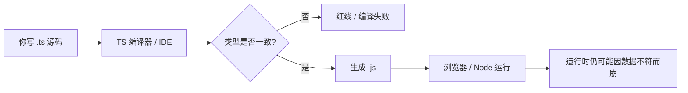
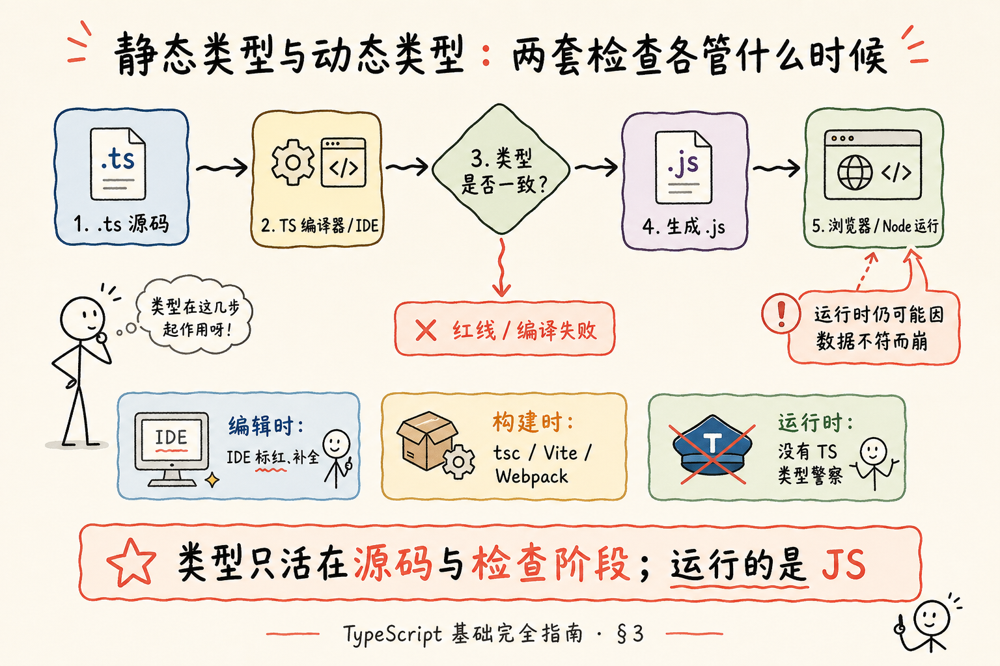
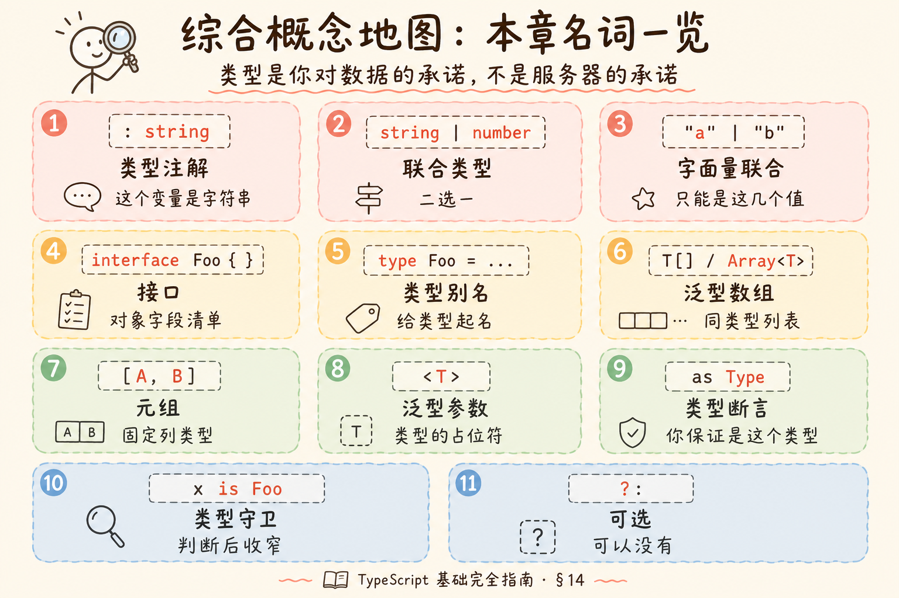
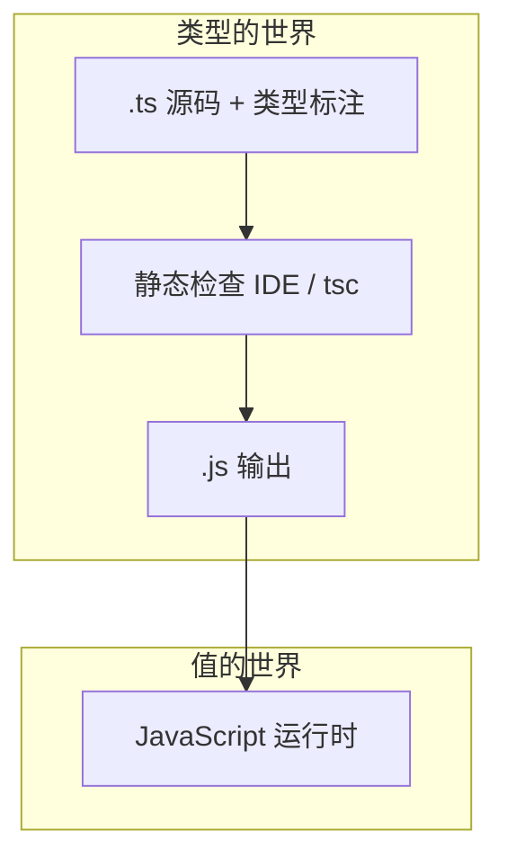
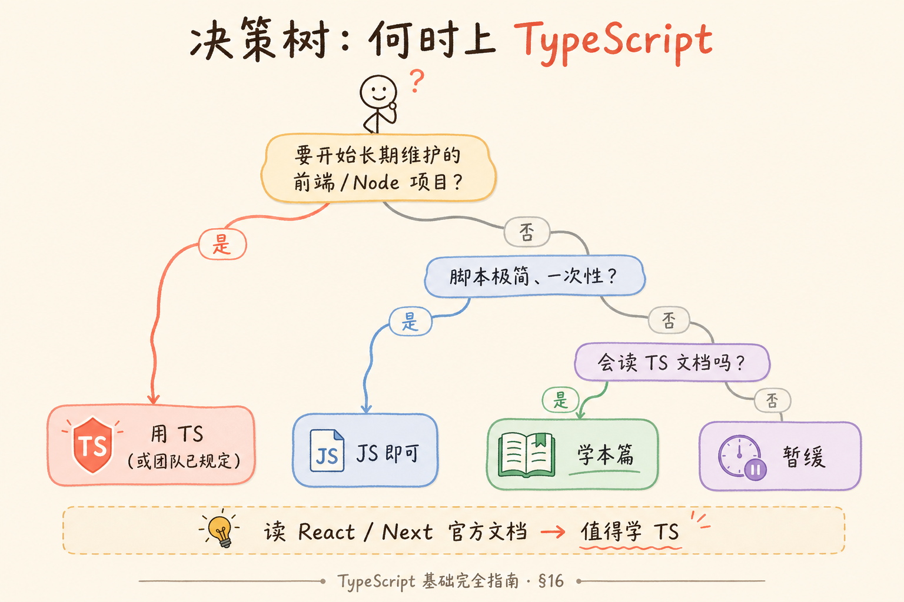

# TypeScript 基础完全指南：从「JavaScript 加类型」到能读懂现代前端代码

> 你打开一份 React 或 Next.js 教程，满屏 `interface`、`string | null`、`useState<User[]>([])`——语法像 JavaScript，却又多出一层「类型」在拦路。JavaScript 能跑，为什么要多学一门 TypeScript？类型标注到底检查什么、不检查什么？这篇是**独立的地基教程**：不绑定某个框架，用概念和表格把 TypeScript 的核心思想讲透；代码只保留说明概念所必需的最小片段。读完应能**读懂**主流前端仓库里的 `.ts` / `.tsx` 文件，并能在空项目里写出带类型的函数与对象描述。若你已在用 Vite/React 写 RAG 前端，系列进阶见 [React 第十一篇：TypeScript 迁移](react/11.typescript-migration.md)。

---

## 目录

1. [前言：拼错字段名，为什么 JavaScript 不拦你](#1-前言拼错字段名为什么-javascript-不拦你)
2. [TypeScript 是什么：带类型的 JavaScript 超集](#2-typescript-是什么带类型的-javascript-超集)
3. [静态类型与动态类型：两套「检查」各管什么时候](#3-静态类型与动态类型两套检查各管什么时候)
4. [工具链概念：`.ts` 怎么变成浏览器能跑的 `.js`](#4-工具链概念ts-怎么变成浏览器能跑的-js)
5. [基础类型：数字、字符串与「没有值」的几种说法](#5-基础类型数字字符串与没有值的几种说法)
6. [数组与元组：一列同类型 vs 固定位置各不同](#6-数组与元组一列同类型-vs-固定位置各不同)
7. [函数类型：参数、返回值与可选参数](#7-函数类型参数返回值与可选参数)
8. [描述对象：interface 与 type 别名](#8-描述对象interface-与-type-别名)
9. [联合类型与字面量类型：「或」与「只能是这几个值之一」](#9-联合类型与字面量类型或与只能是这几个值之一)
10. [类型收窄：让 TypeScript 在分支里「想明白」具体类型](#10-类型收窄让-typescript-在分支里想明白具体类型)
11. [泛型入门：类型参数与「占位符」](#11-泛型入门类型参数与占位符)
12. [枚举与其他常见写法](#12-枚举与其他常见写法)
13. [类型断言：你比编译器更确定时怎么说](#13-类型断言你比编译器更确定时怎么说)
14. [综合概念地图：把本章名词串成一张表](#14-综合概念地图把本章名词串成一张表)
15. [常见陷阱与 FAQ](#15-常见陷阱与-faq)
16. [总结与下一步](#16-总结与下一步)

---

## 1. 前言：拼错字段名，为什么 JavaScript 不拦你

典型场景：你从接口拿到用户对象，在页面里写 `user.nmae`（把 `name` 拼错了）。JavaScript **不会**在保存文件时报错；页面渲染空白，你打开控制台才看见 `undefined`，再一层层 `console.log` 找拼写——这就是**动态类型**的日常代价：变量在**运行时**才暴露真实形状，编辑器只能猜。

企业前端、Node 服务、不少开源库早已默认 **TypeScript**（TS，类型脚本）。不是因为它取代 JavaScript，而是在 JavaScript 之上加了一层**可检查的类型约定**，让 IDE 在你敲错字段名时就画红线，让 `npm run build` 在上线前拦住一批低级错误。

**读完本文，你应该能做到：**

1. 用一句话向同事解释 TypeScript 与 JavaScript 的关系，以及「编译」在这里指什么。
2. 区分 `string`、`number`、`boolean`、`null`、`undefined`、`void`、`any`、`unknown` 的适用场景，并说明为什么新手应少写 `any`。
3. 读懂 `interface User { id: number; name: string }` 与 `type Status = "pending" | "done"` 这类常见写法。
4. 解释「联合类型」与「类型收窄」：为什么 `if (x !== null)` 之后，`x` 的类型会变小。
5. 看懂 `fetchJSON<User[]>(url)` 里尖括号的含义（泛型），并给简单函数写上参数与返回值类型。
6. 列出至少三条「TypeScript 也救不了」的情形（如接口返回与类型声明不一致）。

**前置知识**：能读现代 JavaScript（`const`、箭头函数、对象字面量、`async/await`）。若 ES6+ 仍陌生，请先读 [React 系列第一篇：JavaScript ES6+ 快速入门](react/01.javascript-es6-quickstart.md)。  
**环境**：Node.js 18+（用于运行 `tsc` 或后续框架脚手架）；编辑器推荐 VS Code / Cursor。  
**本文边界（地基篇）**：讲清**语言层**类型概念与最小可运行示例；**不讲** React 组件迁移、Vite 工程配置细节、`tsconfig` 每一项开关、高级类型体操（条件类型、映射类型、`infer` 等）。工程化与框架结合见 [React TypeScript 迁移](react/11.typescript-migration.md) 与 [Next.js 系列](nextjs/README.md)。

### 1.1 什么时候值得学 TypeScript，什么时候可以缓一缓

| 场景 | 建议 |
|------|------|
| 读 React / Vue / Next 官方文档与示例 | **值得学**：示例多为 `.ts` / `.tsx` |
| 个人小脚本、一次性数据处理 | 可先用 JS；体量大再引入 TS |
| 团队协作、接口字段多、长期维护 | **强烈建议** TS，减少「口头约定」 |
| 刚学编程、JS 语法仍吃力 | 先巩固 JS，再学 TS（TS 不替代 JS 语法） |

直觉类比：JavaScript 像**口头约定**的菜谱；TypeScript 像**带勾选框**的菜谱——食材不对，备菜阶段就能发现，而不是上桌才发现没放盐。决策仍以实际团队规范为准：公司仓库若已全 TS，本篇就是必读地基。

---

## 2. TypeScript 是什么：带类型的 JavaScript 超集

**TypeScript**（类型脚本）：由微软维护的开源语言，语法是 **JavaScript 的超集**（superset）。  
通俗说：你写的 TS **几乎都可以当作 JS 来理解**——多出来的主要是**类型标注**和少数 TS 专属语法（如 `interface`、部分枚举写法）；最终给浏览器或 Node 跑的，仍是 **JavaScript**。

**超集**：A 是 B 的超集，指「B 里合法程序，在 A 里通常也合法」。  
通俗说：会 JS 的人学 TS，不是换一门陌生语言，而是**在原有写法上加类型层**。

| 维度 | JavaScript | TypeScript |
|------|------------|------------|
| 文件扩展名 | `.js`、`.jsx` | `.ts`（无 JSX）、`.tsx`（含 JSX） |
| 类型信息 | 运行时才知道 | 编辑期、编译期可检查 |
| 浏览器直接执行 | 可以（或打包后） | **不行**——需先编译/转译为 JS |
| 与 JS 生态 | 本体 | 使用同一 npm 包；类型常来自 `@types/xxx` |

**编译**（compile，编译）：把一种语言翻译成另一种，这里指把 TS **擦掉类型**并转成目标版本的 JS。  
通俗说：TS 里的 `: string` 不会出现在最终 JS 里；类型是**开发时的安全带**，不是运行时的额外负担。

下面是一段最小对比，帮助建立「多出来的只有类型」的印象。

**演示什么**：同一逻辑，JS 无标注，TS 有参数与返回值类型。  
**环境**：Node 18+；TS 需先 `npm install -D typescript`（§4 详述）。  
**预期**：逻辑一致；TS 在保存时若传入数字给 `name` 会提示错误。

```javascript
// JavaScript：能跑，但看不出 greet 要什么
function greet(name) {
  return "Hello, " + name;
}
```

```typescript
// TypeScript：多的是「说明书」
function greet(name: string): string {
  return "Hello, " + name;
}
```

若写 `greet(42)`，TypeScript 会报错：数字不能赋给 `string`。JavaScript 仍会执行并得到 `"Hello, 42"`——**类型检查不改变 JS 运行时规则**，除非你在运行时自己做校验（那是另一类库，如 zod，本篇不展开）。

---

## 3. 静态类型与动态类型：两套「检查」各管什么时候

**动态类型**（dynamic typing）：变量**不绑定**固定类型，同一名称在不同时刻可指向不同形状的值；类型错误多在**运行**时暴露。  
通俗说：JavaScript 默认模式——盒子不贴标签，打开才知道里面是什么。

**静态类型**（static typing）：在**不运行程序**的情况下，根据源码里的类型标注和推断，检查赋值、传参是否匹配。  
通俗说：备菜时对照清单，而不是吃一口才发现拿错了调料。

TypeScript 做的是**静态**检查。需要分清三件事：



1. **编辑时**：IDE 用 TS 语言服务标红、补全。  
2. **构建时**：`tsc` 或 Vite/Webpack 里的 TS 插件；可配置「有类型错误是否阻断发布」。  
3. **运行时**：**没有** TS 类型警察；接口返回的 JSON 若与类型不符，仍可能 `undefined` 或逻辑错误——这叫**类型与运行时不一致**，靠测试、运行时校验或仔细对接 API 文档解决。

与 Python 类型注解的对比（若你读过 [Python 类型注解教程](2.python-type-annotation-tutorial.md)）：

| | Python 注解 + mypy | TypeScript |
|---|-------------------|------------|
| 运行时 | 解释器**不**强制类型 | 同样**不**强制；类型被擦掉 |
| 检查时机 | 可选跑 mypy/pyright | 默认可编译检查 |
| 与语言关系 | 后期叠加 | 从设计起与 JS 一体 |

**不必神化静态类型**：它挡不住恶意数据、挡不住后端改字段不通知你；它主要减少**你自己写错**的那类 bug（拼写、传错类型、漏判空）。



---

## 4. 工具链概念：`.ts` 怎么变成浏览器能跑的 `.js`

**tsc**（TypeScript Compiler）：官方命令行编译器，把 `.ts` 转成 `.js`。  
通俗说：擦类型、改语法的「翻译官」。

**tsconfig.json**：项目根目录下的 JSON 配置文件，告诉 `tsc` 编译哪些文件、目标 JS 版本、是否严格检查等。  
通俗说：整栋楼的「施工规范」——同一套源码，不同规范可产出 ES2015 或 ES2020 的 JS。

初学者只需建立三个概念，不必背全表：

| 配置项（常见） | 白话含义 |
|----------------|----------|
| `strict` | 开启一组严格规则；新项目建议 `true` |
| `target` | 输出 JS 语法版本（如 `ES2020`） |
| `module` | 模块系统（如 `ESNext` 配合打包工具） |
| `include` / `exclude` | 哪些目录参与编译 |

现代前端项目（Vite、Next.js）往往在内部调用 TS 编译，你仍需要 `tsconfig.json`，但不一定手写每一行。**地基篇**知道「存在这个文件、管编译规则」即可；迁移与工程细节见 React 系列第十一篇。

**演示什么**：本地用 `tsc` 编译单文件。  
**前置**：已 `npm init -y` 且 `npm install -D typescript`。  
**步骤**：`npx tsc --init` 生成配置；`npx tsc greet.ts` 得到 `greet.js`。  
**预期**：`greet.js` 里**没有** `: string`，只有普通 JS 函数。

```typescript
// greet.ts
function greet(name: string): string {
  return "Hello, " + name;
}
```

```javascript
// greet.js（编译结果示意）
function greet(name) {
  return "Hello, " + name;
}
```

**类型声明文件**（`.d.ts`）：只含类型、不含实现，给已有 JS 库「补说明书」。  
通俗说：你从 npm 装 `lodash` 时，常另装 `@types/lodash`，让 TS 知道 `_.map` 长什么样。

---

## 5. 基础类型：数字、字符串与「没有值」的几种说法

TypeScript 的内置类型与 JavaScript 的**运行时**类型大体对应，但划分更细，尤其围绕「空」与「任意」。

### 5.1 原始类型一览

| TS 类型 | 对应 JS 值 | 白话 |
|---------|------------|------|
| `string` | `"hello"`、`'a'`、`` `hi` `` | 文本 |
| `number` | `42`、`3.14`、`NaN` | 所有数字（无单独 int/float） |
| `boolean` | `true` / `false` | 是与否 |
| `bigint` | `100n` | 大整数；日常业务较少单独讲 |
| `symbol` | `Symbol()` | 唯一标识；框架内部常见，初学可只知名字 |

**字面量**（literal）：写死的具体值，如 `"ok"`、`42`，也可当作类型（§9 展开）。  
通俗说：不仅说「是字符串」，还说「**必须是** `"ok"` 这一个字符串」。

### 5.2 null、undefined 与 void

**`null`**：表示「故意为空」。  
**`undefined`**：表示「未赋值」或「缺少该属性」。  
在 JS 里二者都可表示「没有」，容易混；TS 在 `strictNullChecks` 下区分得更严。

**`void`**：多用于函数**返回值**，表示「不关心返回值」或「没有 return 有用值」。  
通俗说：`console.log` 那种——你调用它是为了副作用，不是为了拿结果。

```typescript
function logMessage(msg: string): void {
  console.log(msg);
  // 没有 return，或 return; 都可以
}
```

**可选属性**常写成 `name?: string`，等价于 `name: string | undefined`（在严格模式下）。

### 5.3 any 与 unknown：两个「兜底」，待遇天差地别

**`any`**：关闭对该值的类型检查，**传染性**强——赋给 `any` 再赋给别人，检查链断掉。  
通俗说：对编译器说「别管了」；能救急，但容易回到 JS 裸奔。

**`unknown`**：表示「不知道类型」，但**不能**直接当具体类型用，必须先**收窄**（§10）。  
通俗说：「有个盒子，先别乱摸，检查完再打开」——比 `any` 安全，适合接 API 原始 JSON。

| | `any` | `unknown` |
|---|-------|-----------|
| 赋给任意类型 | 可以 | 不可以（需先收窄） |
| 新手默认 | 避免滥用 | 接外部数据时可考虑 |
| 与「偷懒」 | 常用来压错误 | 强迫你写判断 |

**先错后对**：用 `any` 逃避报错。

```typescript
// ❌ 常见偷懒：全网 any，失去 TS 意义
function parse(data: any) {
  return data.user.name; // 编译不报错，运行可能炸
}
```

```typescript
// ✅ 用 unknown + 收窄（见 §10）
function parse(data: unknown) {
  if (typeof data === "object" && data !== null && "user" in data) {
  // 仍需更严谨的结构校验；这里仅说明 unknown 迫使你先判断
  }
}
```

生产代码里，长期保留的 `any` 应带注释说明原因，并计划替换。

---

## 6. 数组与元组：一列同类型 vs 固定位置各不同

**数组类型**（array）：同类型元素的有序列表。写法 `T[]` 或 `Array<T>`。  
通俗说：`string[]` 是「字符串组成的队列」。

```typescript
const tags: string[] = ["ts", "js"];
const scores: Array<number> = [90, 85];
```

**元组**（tuple）：**固定长度、各位置类型可不同**的数组。  
通俗说：表格的一行——第 1 列必须是日期，第 2 列必须是字符串，列数固定。

```typescript
type Point = [number, number]; // [x, y]
const p: Point = [10, 20];

type Entry = [string, number];
const row: Entry = ["alice", 95];
```

元组常见于「返回一对值」：`[Error | null, User | null]`（类似 Go 的 multi-return 风格）。React 的 `useState` 返回的 `[state, setState]` 在类型上也可视为元组。

**只读**：`readonly string[]` 或 `ReadonlyArray<string>` 表示不可 `push` 修改（编译期检查），与 `const` 声明不是同一回事。

---

## 7. 函数类型：参数、返回值与可选参数

函数是 TS 里类型标注最密集的地方之一。核心语法：

```typescript
function add(a: number, b: number): number {
  return a + b;
}
```

**可选参数**：名后加 `?`，调用时可省略；省略时值为 `undefined`。

```typescript
function buildLabel(name: string, prefix?: string): string {
  return prefix ? `${prefix}: ${name}` : name;
}
```

**默认参数**：`function f(x = 0)` 在 TS 里会推断 `x` 为 `number`，通常不必再写 `: number`。

**函数类型**也可单独描述（不立刻实现），用于回调、事件处理器：

```typescript
type CompareFn = (a: number, b: number) => number;
const cmp: CompareFn = (a, b) => a - b;
```

**演示什么**：箭头函数与 `type` 描述同一签名。  
**预期**：`cmp(1, 2)` 为 `number`；若 `cmp` 返回字符串会报错。

**重载**（overload）：同一函数名多套参数/返回类型声明——框架 API 常见，地基篇**了解即可**：看见 `function create(x: string): Foo` 与 `function create(x: number): Bar` 知道是「按参数区分返回类型」，不必急于自己写。

**注意副作用**：标注 `void` 的函数，若你 `return` 了一个值，严格模式下可能警告；async 函数返回的是 `Promise<T>`，不是 `T`。

---

## 8. 描述对象：interface 与 type 别名

对象形状（有哪些字段、各是什么类型）是前端 TS 的核心日常。**两种主要写法**：`interface` 与 `type`。

**interface**（接口）：描述对象（或可被 `implements` 的类）的字段结构。  
通俗说：表格模板——`User` 必须有 `id`、`name`，类型各是什么。

```typescript
interface User {
  id: number;
  name: string;
  email?: string; // 可选
}
```

**type**（类型别名）：给任意类型起名字，不限于对象。  
通俗说：「以后凡是写 `UserId` 就是指 `number`」这类缩写。

```typescript
type UserId = number;
type User = {
  id: UserId;
  name: string;
};
```

### 8.1 interface 与 type 怎么选（直觉版）

| 需求 | 更常见选择 |
|------|------------|
| 描述 API / 组件 props 对象 | `interface`（可 `extends` 合并） |
| 联合、交叉、元组、映射 | `type` |
| 需要声明合并（同名 interface 自动合并） | `interface` |

团队常统一风格：**能 interface 就 interface，复杂组合用 type**。二者在「描述普通对象」时大量重叠，争论不如保持一致。

**extends**（继承/扩展）：在已有形状上追加字段。

```typescript
interface Admin extends User {
  role: "admin";
}
```

**交叉类型**（intersection，`&`）：把多个类型**合在一起**，字段要同时满足。

```typescript
type Named = { name: string };
type Aged = { age: number };
type Person = Named & Aged; // 同时有 name 和 age
```

**索引签名**：动态键名时用 `[key: string]: number` 这类写法描述「键是字符串、值是数字」的字典——读仓库时会见到，写的时候先想清楚是否真的无固定字段。

---

## 9. 联合类型与字面量类型：「或」与「只能是这几个值之一」

**联合类型**（union，`A | B`）：值可以是 A **或** B 之一。  
通俗说：「要么是字符串，要么是数字」——比 `any` 精确，比单一类型宽松。

```typescript
type Id = string | number;
```

**字面量联合**：常用于状态机、枚举式常量。

```typescript
type OrderStatus = "pending" | "paid" | "shipped" | "cancelled";

function setStatus(s: OrderStatus) {
  // s 只能是四个字符串之一
}
```

若写 `setStatus("done")`，编译器报错——**字符串字面量类型**把 typo 挡在编辑期。

与 Python `Literal["a", "b"]` 或 `Union` 类似；读 [Python 类型注解](2.python-type-annotation-tutorial.md) 的读者可对照记忆。

**可辨识联合**（discriminated union，了解即可）：多个 interface 共有一个「标签字段」如 `kind: "circle" | "square"`，switch 时 TS 能自动收窄——Redux action、AST 节点常见；先知道名词，遇到再深挖。

---

## 10. 类型收窄：让 TypeScript 在分支里「想明白」具体类型

**类型收窄**（type narrowing）：在 `if`、`switch`、`typeof`、`in` 等分支里，编译器把联合类型**缩小**到更具体的分支。  
通俗说：安检时分流——过了「是字符串」那道门，后面就不按「数字」处理。

```typescript
function printId(id: string | number) {
  if (typeof id === "string") {
    console.log(id.toUpperCase()); // 这里 id 是 string
  } else {
    console.log(id.toFixed(2)); // 这里 id 是 number
  }
}
```

**typeof** 常用于 `string | number | boolean`；**`in`** 用于判断对象是否有某字段；**`instanceof`** 用于 `class` 实例（面向对象代码）。

**空值收窄**：

```typescript
function greet(name: string | null) {
  if (name === null) {
    return "Guest";
  }
  return "Hello, " + name; // name 此处为 string
}
```

**类型守卫**（type guard）：返回 `x is SomeType` 的函数，把收窄逻辑复用。

```typescript
function isUser(x: unknown): x is User {
  return (
    typeof x === "object" &&
    x !== null &&
    "id" in x &&
    "name" in x
  );
}
```

注意：类型守卫若写得太松，仍可能**运行时**误判；对接外部 JSON 时，生产环境常配合 schema 校验库。地基篇要建立的观念是：**收窄是编译期推理，不是运行时验证**。

---

## 11. 泛型入门：类型参数与「占位符」

**泛型**（generics）：在定义函数、类型、类时，用**类型参数**（如 `T`）占位，调用时再填入具体类型。  
通俗说：函数参数的「参数」是**值**；泛型的「类型参数」是**类型**——`Array<T>` 里的 `T` 换成 `string` 就是 `string[]`。

```typescript
function first<T>(items: T[]): T | undefined {
  return items[0];
}

const n = first([1, 2, 3]);     // T 推断为 number
const s = first(["a", "b"]);    // T 推断为 string
```

**演示什么**：同一 `first` 函数，对不同数组元素类型安全。  
**预期**：`first<number>([1,2])` 可显式指定 `T`；若返回类型与使用处不匹配会报错。

**泛型接口**：

```typescript
interface ApiResponse<T> {
  data: T;
  ok: boolean;
}

type UserList = ApiResponse<User[]>;
```

读前端代码时最常见：`useState<Message[]>([])`、`fetchJSON<Citation>(url)`、`Promise<User>`——尖括号里就是「把 T 填成 `Message[]` / `Citation` / `User`」。

**约束**（`extends`）：`T extends object` 表示 T 至少是对象——限制泛型不能乱填。进阶再学；看见 `T extends keyof X` 知道是在约束「键名范围」即可。

**不必一次学完泛型**：先会**读** `Foo<Bar>`，再会写简单 `function identity<T>(x: T): T`。复杂工具类型是另一档难度。

---

## 12. 枚举与其他常见写法

**enum**（枚举）：为一组命名常量定义集合，可生成运行时对象（取决于 `const enum` 等配置）。  
通俗说：把 `0、1、2` 换成 `Pending、Done` 这种可读名字。

```typescript
enum Direction {
  Up,
  Down,
  Left,
  Right,
}
```

现代风格里，很多人用**字面量联合**代替 `enum`，避免运行时多一层对象、与打包体积的权衡：

```typescript
type Direction = "Up" | "Down" | "Left" | "Right";
```

读旧代码仍会见到 `enum`；新代码团队规范不一，**跟项目现有风格走**。

**只读与 const 断言**（了解即可）：`as const` 让对象字段变成只读字面量类型，用于配置常量、路由表。

---

## 13. 类型断言：你比编译器更确定时怎么说

**类型断言**（type assertion）：用 `value as Type` 或 `<Type>value` 告诉编译器「我比你更清楚它的类型」。  
通俗说：强行贴标签——**不**做运行时转换，只影响类型检查。

```typescript
const el = document.getElementById("app") as HTMLDivElement;
```

滥用断言会**绕过**安全检查，回到「编译过、运行炸」。优先用收窄；断言适合 DOM API、与旧 JS 互操作等编译器实在推不出来的场景。

**非空断言** `user!.name`：断言 `user` 不是 `null`/`undefined`——若实际为空，运行时仍报错。新手慎用。

---

## 14. 综合概念地图：把本章名词串成一张表

| 你看到的写法 | 正式名称 | 通俗说 | 典型场景 |
|--------------|----------|--------|----------|
| `: string` | 类型注解 | 这个变量是字符串 | 变量、参数、返回值 |
| `string \| number` | 联合类型 | 二选一 | ID、多种入参 |
| `"a" \| "b"` | 字面量联合 | 只能是这几个值 | 状态、角色 |
| `interface Foo { }` | 接口 | 对象字段清单 | API、props |
| `type Foo = ...` | 类型别名 | 给类型起名 | 联合、工具类型 |
| `T[]` / `Array<T>` | 泛型数组 | 同类型列表 | 列表数据 |
| `[A, B]` | 元组 | 固定列类型 | 坐标、成对返回 |
| `<T>` | 泛型参数 | 类型的占位符 | `useState<T>`、容器 |
| `as Type` | 类型断言 | 你保证是这个类型 | DOM、遗留 JS |
| `x is Foo` | 类型守卫 | 判断后收窄 | 解析 unknown |
| `?:` | 可选 | 可以没有 | 表单字段、配置项 |





对照上图：类型只活在**源码与检查**阶段；运行的是 JS。初学者最常犯的混淆是以为「写了 `User` 接口，接口返回就一定是 User」——**类型是你对数据的承诺**，不是服务器的承诺。

---

## 15. 常见陷阱与 FAQ

### 15.1 常见陷阱（先错后对）

**陷阱 1：以为 TS 能在运行时拦住错误类型**

```typescript
interface User { name: string }
const u: User = JSON.parse('{"name": 123}'); // 编译可能过，name 实际是 number
```

**结论**：`JSON.parse` 返回 `any` 或需断言；应用层要校验或信任来源。

**陷阱 2：到处 `any`**

```typescript
const data: any = await res.json();
data.usre.name; // 不报错，运行 undefined
```

**结论**：响应体用 `unknown` + 守卫，或代码生成/OpenAPI 类型。

**陷阱 3：可选属性当「一定存在」**

```typescript
interface Config { debug?: boolean }
if (config.debug) { ... } // OK
config.debug.toString(); // 严格模式下可能仍需注意 undefined
```

**陷阱 4：混淆 `interface` 与「类实例」**

`interface` 描述形状，**不**生成运行时代码；`class User` 才会。实现 `interface` 的是类型检查层面的约定。

**陷阱 5：结构类型（structural typing）带来的「多余字段」**

TS 默认**结构相容**：有 `name: string` 的对象可赋给只要求 `{ name: string }` 的类型，**多出来的字段通常不报错**（除非多余字段导致冲突）。通俗说：看「至少有什么」，不是「只能有什么」——与名义类型语言（如部分 Java 场景）直觉不同。

### 15.2 FAQ

**Q：要学 TypeScript 必须先学 JavaScript 吗？**  
A：是。TS 是 JS 超集；不会 JS 语法，TS 无处下手。

**Q：`tsc` 和 Babel、Vite 是什么关系？**  
A：都是转译链路的一环。Vite 开发时常用 esbuild 转 TS（极快），生产构建可能再用另一套；你仍写 TS、仍受益于类型检查，具体工具链由框架决定。

**Q：`strict` 一开全是红线怎么办？**  
A：新项目建议开；旧项目可渐进开启子项。迁移策略见 React 第十一篇。

**Q：TypeScript 和 JSDoc `@param {string}` 一样吗？**  
A：思路类似，都是给编辑器和检查器看；TS 语法更统一、表达力更强，大项目多用 `.ts`。

**Q：学完本篇够写 React 吗？**  
A：够**读**类型、写简单 props 与工具函数；组件迁移、工程配置请接 [React 11](react/11.typescript-migration.md)。

**Q：和 Python typing 学哪一个先？**  
A：看你主栈。前端路线先本篇；全栈可先 Python 注解再本篇，概念可互相迁移。

**Q：需要背熟所有内置工具类型吗（`Partial`、`Pick`、`Omit`…）？**  
A：不必。遇见到文档查；地基先掌握 `interface`、`联合`、`泛型读法`。

---

## 16. 总结与下一步

### 16.1 核心概念速记

1. **TS = JS + 静态类型**；类型在编译后擦掉，运行的是 JS。  
2. **静态检查**防的是「你写错」；**运行时**仍要防「数据不符」。  
3. **基础类型**覆盖值形状；**`null`/`undefined`/`void`** 分清「空」「未设」「无返回」。  
4. **`any` 慎用，`unknown` 更安全**；外部数据先收窄或校验。  
5. **`interface` / `type`** 描述对象与别名；**`|` 联合**、**字面量**描述状态与分支。  
6. **泛型 `T`** 是类型占位符；`Foo<Bar>` 读作「Foo 里 T 换成 Bar」。  
7. **类型断言**是你说服编译器，不是运行时转换。

### 16.2 决策树：何时上 TypeScript

```
要开始长期维护的前端/Node 项目？
├─ 是 → 用 TS（或团队已规定）
└─ 否 → 脚本极简、一次性？
    ├─ 是 → JS 即可
    └─ 否 → 会读 TS 文档吗？
        ├─ 需要 → 学本篇
        └─ 不需要 → 暂缓
```



### 16.3 系列下一步

| 目标 | 推荐阅读 |
|------|----------|
| 在 Vite React 项目里落地 TS | [React 11：TypeScript 迁移](react/11.typescript-migration.md) |
| 补 JavaScript 现代语法 | [React 01：ES6+ 快速入门](react/01.javascript-es6-quickstart.md) |
| 后端/全栈类型思维对照 | [Python 类型注解教程](2.python-type-annotation-tutorial.md) |
| Next.js + TS 全栈 | [Next.js 系列 README](nextjs/README.md) |

本篇刻意留白、进阶可选的主题：**条件类型与映射类型**、**模块解析与 `paths` 别名**、**声明合并与全局增强**、**TS 与 ESLint/Prettier 协作**、**从 OpenAPI 生成类型**——在工程稳定后再查官方 Handbook 或团队规范即可。

---

> **初学者可能仍困惑的点**  
> - 「结构类型」与直觉上的「类必须完全一致」不一致——多读真实 `interface` 即可习惯。  
> - 泛型第一次读 `Array<T>` 会晕——先把它当成「填槽」：`T` = 具体类型。  
> - 框架里的 `tsx` 还涉及 JSX，本篇未展开；语法上把 JSX 当作「返回 UI 的表达式」即可，类型规则仍来自本篇。
