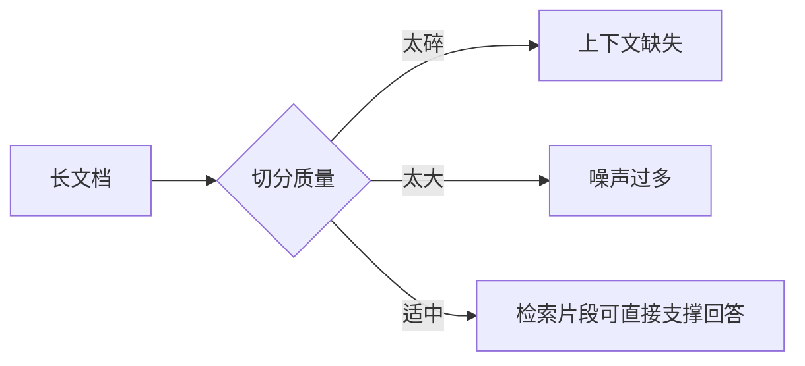
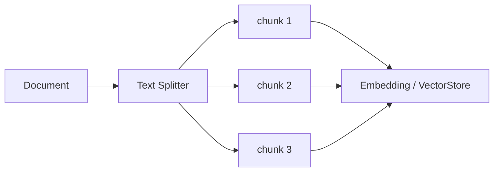
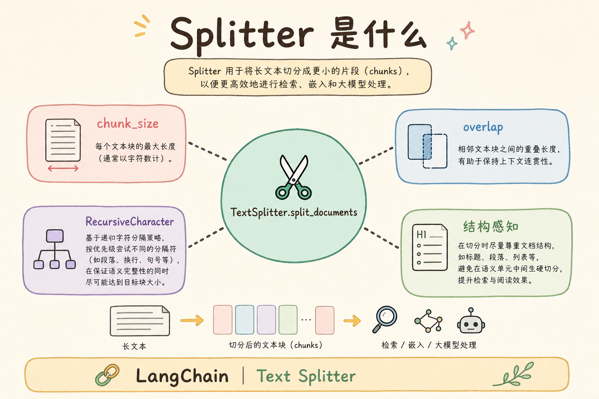
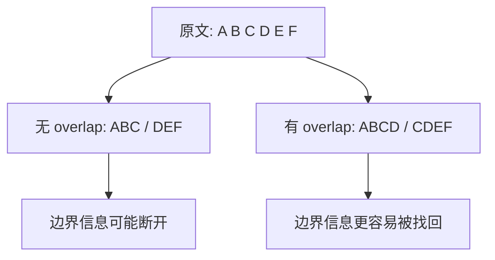
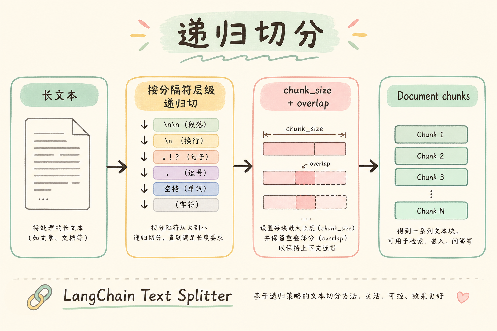
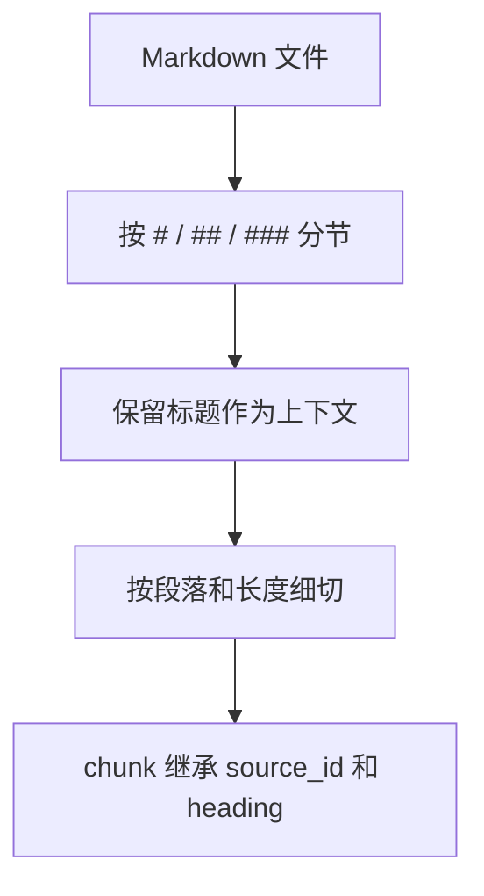

# D 框架与架构（六）：LangChain Text Splitter 入门指南

RAG 里有一个很朴素但很关键的问题：文档太长，不能整篇塞进模型；切得太碎，检索回来又失去上下文。**Text Splitter** 要解决的就是“怎样把长文档切成适合检索和生成的片段”。

本文面向初学者。读完后，你应该能理解 chunk、chunk_size、chunk_overlap 和 separators 的含义，知道切分为什么会影响检索质量，并能写出一个最小切分器来观察效果。

## 目录

- [1. 为什么切分决定检索上限](#1-为什么切分决定检索上限)
- [2. Text Splitter 是什么](#2-text-splitter-是什么)
- [3. 核心参数怎么理解](#3-核心参数怎么理解)
- [4. 切分策略如何影响结果](#4-切分策略如何影响结果)
- [5. 最小可运行示例](#5-最小可运行示例)
- [6. Markdown 文档怎么切](#6-markdown-文档怎么切)
- [7. 如何评估切分质量](#7-如何评估切分质量)
- [8. 常见错误](#8-常见错误)
- [9. FAQ](#9-faq)
- [10. 总结](#10-总结)

## 1. 为什么切分决定检索上限

RAG 检索的是片段，不是整本资料。如果关键答案被切散了，检索器可能只找回半句话；如果一个片段太大，又会把很多无关内容一起带进 prompt。切分质量会直接限制检索质量。

可以把切分想成给书贴索引卡。索引卡太小，读者找不到完整解释；索引卡太大，读者拿到一堆无关内容。



这张图说明：Text Splitter 不是格式化工具，而是 RAG 效果的基础控制点。

## 2. Text Splitter 是什么

**Text Splitter**：把长文本切成多个短片段的组件。通俗说，它负责决定“每张知识卡片写多少内容，以及相邻卡片要不要重复一点”。

切出来的每个片段通常叫 **chunk**。chunk 会被向量化并写入 VectorStore。用户提问时，系统检索到的是这些 chunk，而不是原始整篇文档。



理解这个流程后，就能明白为什么 chunk 的边界会影响答案：模型只能看到被检索回来的片段。

## 3. 核心参数怎么理解

Text Splitter 最常见的参数有三个：`chunk_size`、`chunk_overlap` 和 `separators`。

| 参数 | 白话解释 | 影响 |
|---|---|---|
| `chunk_size` | 每个片段大约多长 | 太小丢上下文，太大带噪声 |
| `chunk_overlap` | 相邻片段重复多少内容 | 缓解边界切断问题 |
| `separators` | 优先按什么符号切 | 保留段落、标题、句子结构 |

**chunk_overlap** 的作用很重要。假设答案跨越两个段落，如果完全不重叠，检索可能只拿到前半段或后半段。适度重叠可以让边界附近的信息更完整。





重叠不是越大越好。重叠太大会增加存储量，也会让检索结果重复。

## 4. 切分策略如何影响结果

同一份文档，不同切分策略会得到完全不同的检索效果。初学者可以先按文档类型选择策略。

| 文档类型 | 推荐思路 |
|---|---|
| Markdown 教程 | 优先按标题和段落切 |
| API 文档 | 保持一个接口说明尽量完整 |
| FAQ | 一问一答尽量在同一 chunk |
| 日志 | 按时间或事件边界切 |
| 表格 | 保留表头和行含义 |

切分策略要服务于“用户会怎么问”。如果用户通常按接口名提问，就要确保接口名和说明在同一个片段里。如果用户按故障现象提问，就要确保现象、原因、处理办法尽量不要被切散。

## 5. 最小可运行示例

下面写一个简单字符切分器，观察 `chunk_size` 和 `chunk_overlap` 的效果。真实 LangChain Splitter 功能更完整，但这个例子足够说明核心概念。



运行环境：Python 3.10+。

```python
def split_text(text: str, chunk_size: int, chunk_overlap: int) -> list[str]:
    if chunk_overlap >= chunk_size:
        raise ValueError("chunk_overlap 必须小于 chunk_size")

    chunks = []
    start = 0
    while start < len(text):
        end = start + chunk_size
        chunks.append(text[start:end])
        start = end - chunk_overlap
    return chunks


text = "退款申请需要在订单完成前提交。发货后需要先退货，再进入退款审核。"
for index, chunk in enumerate(split_text(text, chunk_size=18, chunk_overlap=5), 1):
    print(index, chunk)
```

运行后你会看到相邻片段有一小段重复。这个重复就是为了避免答案刚好卡在切分边界上。

## 6. Markdown 文档怎么切

Markdown 有天然结构：标题、段落、列表、代码块。切分时应尽量保留这些结构，而不是机械地每 N 个字符切一次。

一个实用原则是：先按标题分大块，再按段落或长度分小块。这样每个 chunk 更容易保留主题。



如果 chunk 里没有标题，模型可能不知道这段话属于哪个主题。建议把当前标题写入 metadata，必要时也拼进 chunk 文本开头。

```python
def attach_heading(heading: str, chunk: str) -> str:
    return f"标题：{heading}\n正文：{chunk}"
```

这个小函数展示了一个常见做法：让每个片段带上所属标题，减少上下文丢失。

## 7. 如何评估切分质量

切分质量不能只靠感觉。你可以准备一批真实问题，检查正确答案所在片段是否能被检索回来。

| 检查项 | 判断方式 |
|---|---|
| 答案完整性 | 正确 chunk 是否包含完整答案 |
| 噪声比例 | chunk 是否混入太多无关主题 |
| 边界问题 | 关键句是否被切到两个 chunk |
| 重复程度 | top_k 里是否大量重复 |
| 引用可读性 | 用户看到引用片段是否能理解 |

每次调整 `chunk_size`、`chunk_overlap` 或 separators 后，都应该用同一组问题重新评估。否则你不知道改动到底提升了什么。

## 8. 常见错误

第一个错误是所有文档都用同一套参数。教程、FAQ、API 文档、日志的结构不同，切分策略也应不同。

第二个错误是 chunk 太小。片段只有孤立句子时，检索可能命中关键词，但模型缺少解释上下文。

第三个错误是 chunk 太大。大段内容会把无关信息一起塞进 prompt，模型更容易答偏。

第四个错误是丢失 metadata。切分后每个 chunk 都应该继承来源、标题、权限等信息，否则后面无法引用和过滤。

## 9. FAQ

**Q：chunk_size 应该设多少？**  
没有固定答案。中文教程可以先从几百到一千多字的范围试起，再用评估集调整。

**Q：chunk_overlap 越大越好吗？**  
不是。适度重叠能缓解边界问题，但过大重叠会增加成本和重复结果。

**Q：可以按 token 而不是字符切吗？**  
可以。模型上下文按 token 计算，生产环境常用 token-aware splitter。学习阶段先理解字符切分也可以。

**Q：代码块应该被切开吗？**  
尽量不要。代码块被切开后，片段可能无法解释完整用法。应把代码和前后说明放在同一 chunk 或相邻 chunk 中。

## 10. 总结

Text Splitter 决定知识库中每个可检索片段的边界。它不直接回答问题，却会限制 Retriever 能不能找回完整、有用、可引用的上下文。


初学者可以记住三条原则：按文档结构切，保留必要重叠，切分后继承 metadata。完成这些基础，再去调 embedding、VectorStore 和重排，才更容易定位真正的问题。
