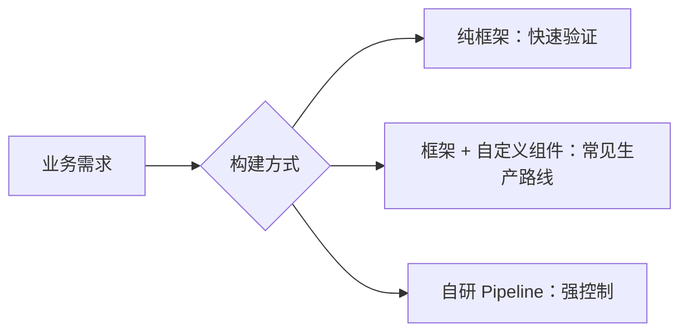
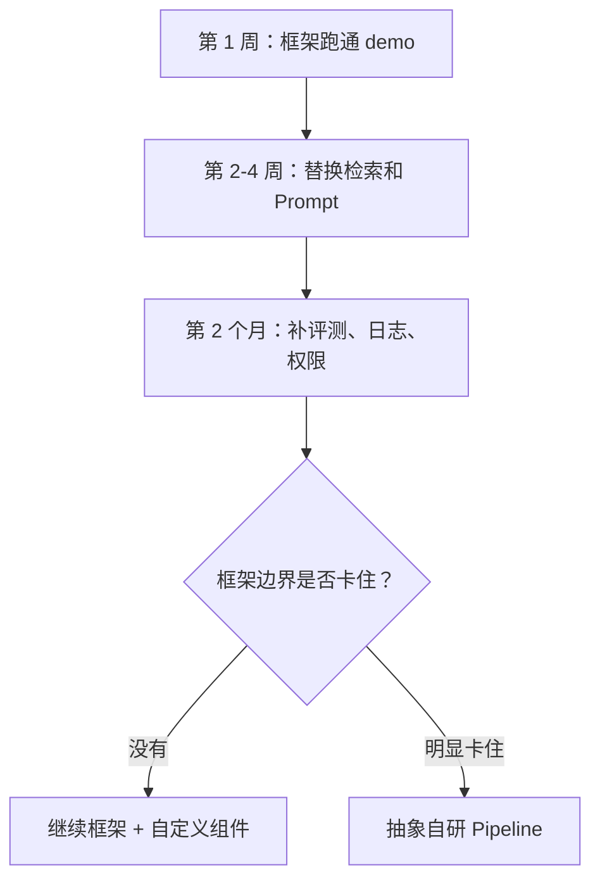
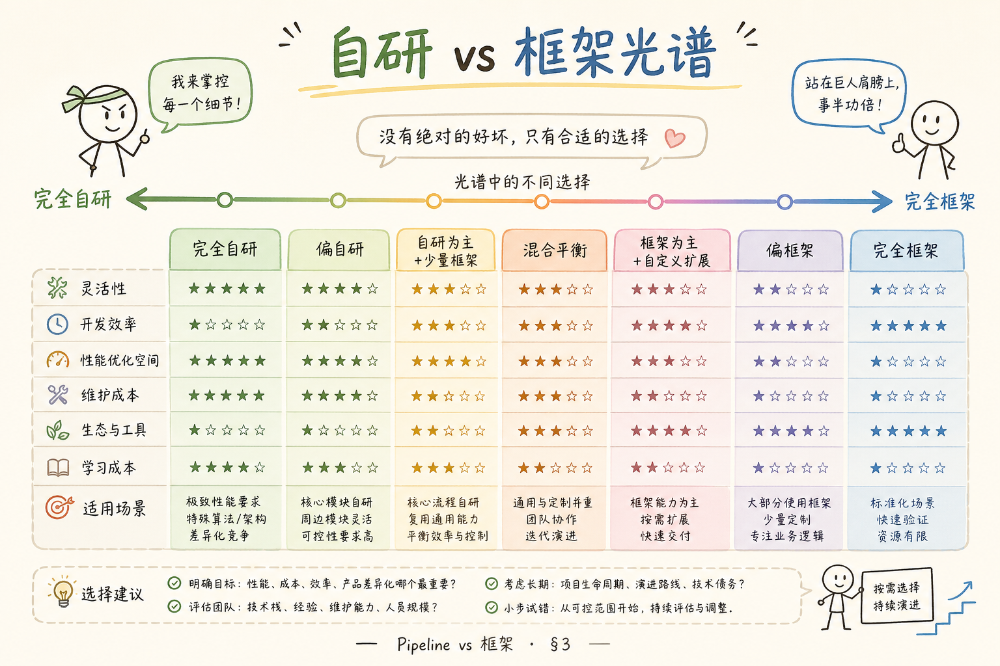
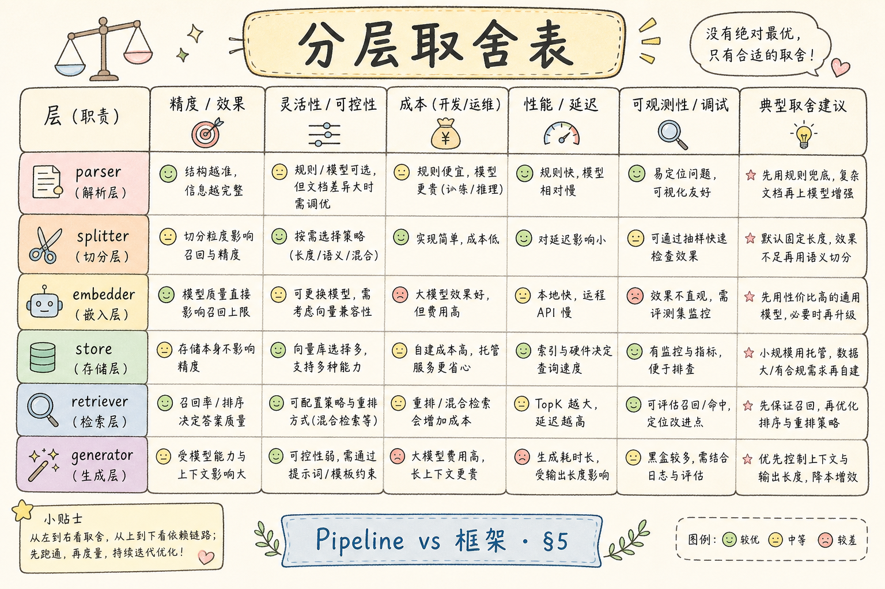
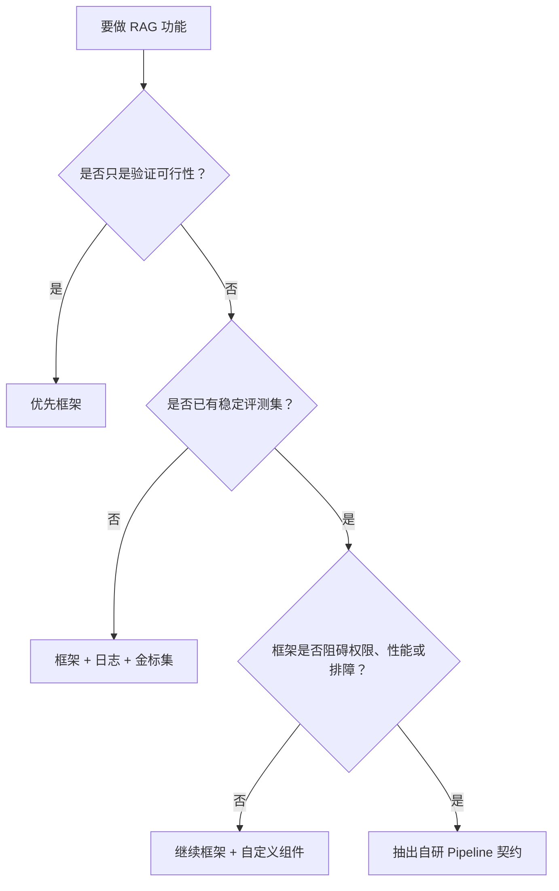

# D 框架与架构（十一）：自研 Pipeline vs 使用框架

做 RAG 项目时，团队很快会遇到一个选择：直接用 LangChain、LlamaIndex、Haystack 这类框架，还是自己写一套 Pipeline？这个问题没有固定答案。正确的判断标准不是“哪个更高级”，而是你的项目现在最缺什么：速度、控制力、可维护性，还是团队协作。

本文面向初学者，用一套可执行的判断框架解释：框架解决什么问题，自研解决什么问题，什么时候该选哪条路。

## 目录

- [1. 先定义 Pipeline 和框架](#1-先定义-pipeline-和框架)
- [2. 三种构建方式](#2-三种构建方式)
- [3. 取舍的核心标准](#3-取舍的核心标准)
- [4. 什么时候用框架](#4-什么时候用框架)
- [5. 什么时候自研 Pipeline](#5-什么时候自研-pipeline)
- [6. 一个实用决策流程](#6-一个实用决策流程)
- [7. 迁移和双轨策略](#7-迁移和双轨策略)
- [8. 常见错误](#8-常见错误)
- [9. FAQ](#9-faq)
- [10. 总结](#10-总结)

## 1. 先定义 Pipeline 和框架

**Pipeline** 在本文里指一条可执行的处理流程，例如：解析问题、检索文档、重排结果、拼 Prompt、调用模型、格式化引用。它强调的是步骤和数据流。

**框架** 是帮你搭建 Pipeline 的工具集合，例如 LangChain、LlamaIndex、Haystack。它们提供组件、接口、默认实现和生态集成。

两者不是对立关系。你可以用框架搭 Pipeline，也可以自己写 Pipeline。



重点不是站队，而是知道每种方式的成本和收益。

## 2. 三种构建方式

初学者可以把选择分成三档：

| 方式 | 通俗解释 | 适合阶段 |
| --- | --- | --- |
| 纯框架 | 尽量使用框架默认组件 | PoC、学习、快速 demo |
| 框架 + 自定义组件 | 框架管编排，关键步骤自己写 | 大多数早期生产项目 |
| 自研 Pipeline | 自己定义接口、流程和运行方式 | 强合规、高性能、深度定制 |

一个常见演进路径是：先用框架跑通，再把关键节点抽出来，最后只在必要时自研。



这条路径的好处是避免一开始过度工程化，同时保留后续迁移空间。

## 3. 取舍的核心标准

判断用不用框架，可以看五个维度：



| 维度 | 更偏框架 | 更偏自研 |
| --- | --- | --- |
| 交付速度 | 需要很快做 demo | 速度不是唯一目标 |
| 控制力 | 默认流程能接受 | 每一步都要可控 |
| 团队经验 | 团队熟悉该框架 | 团队有能力维护抽象 |
| 合规要求 | 内部试点 | 审计、权限、数据边界严格 |
| 调试成本 | 问题容易定位 | 框架黑盒影响排障 |

如果你还没有真实问题集、评测集和线上反馈，不建议过早自研。因为你还不知道真正需要优化的是哪一步。

## 4. 什么时候用框架

框架适合解决“先跑起来”的问题。比如你要在两天内验证：上传文档后能不能问答，引用能不能展示，检索效果大概怎样。

选择框架的常见理由：

1. 已经有文档加载器、向量库连接器、模型封装。
2. 社区示例多，新人能快速模仿。
3. Demo 到原型阶段，速度比长期控制力更重要。
4. 项目还没有形成稳定的业务流程。

但框架不是免责牌。你仍然要检查检索结果、Prompt、权限过滤和异常处理。

## 5. 什么时候自研 Pipeline

自研适合解决“框架抽象挡住你”的问题。比如你需要严格记录每一步输入输出，或必须把权限过滤放在检索前后的指定位置。



更适合自研的信号包括：

| 信号 | 说明 |
| --- | --- |
| 排障经常卡在框架内部 | 日志看不到关键输入输出 |
| 权限和租户规则复杂 | 默认 retriever/filter 不够用 |
| 评测链路强绑定 | 每一步都要打点、回放、对比 |
| 性能瓶颈明确 | 需要控制批处理、缓存、并发 |
| 团队已有稳定接口约定 | 自研不是从零乱写，而是沉淀边界 |

自研不是“所有东西都自己写”。向量库、模型 SDK、PDF 解析器仍然可以使用成熟库。自研的重点是你自己的流程契约。

## 6. 一个实用决策流程

下面这张图可以作为项目评审时的决策树。



决策树里有一个隐含原则：先用数据证明哪里卡住，再决定是否自研。不要因为“听说框架不适合生产”就重写一切。

## 7. 迁移和双轨策略

如果项目已经用了框架，但开始遇到边界，可以用“双轨策略”迁移。

**双轨策略** 是指保留原有框架路径，同时把新 Pipeline 的接口做成一致，逐步替换节点，而不是一次性推倒重来。

示例接口可以这样设计：

```python
from typing import Protocol


class RagPipeline(Protocol):
    def answer(self, question: str, user_id: str) -> dict:
        ...


class LangChainPipeline:
    def answer(self, question: str, user_id: str) -> dict:
        return {"answer": "from langchain", "sources": []}


class CustomPipeline:
    def answer(self, question: str, user_id: str) -> dict:
        return {"answer": "from custom pipeline", "sources": []}
```

这段代码的重点是 `RagPipeline` 协议。业务层只依赖 `answer()`，底层到底是 LangChain 还是自研实现，可以逐步替换。

迁移时建议先替换最痛的节点，例如权限过滤或检索日志，而不是一口气重写所有文档解析、向量存储和模型调用。

## 8. 常见错误

下面这些错误的共同点是：先做技术站队，再补工程证据。实际项目里应该反过来，用问题、数据和接口边界来驱动选择。

### 8.1 只会框架，不懂底层步骤

只会调用框架 API，遇到答案错误就不知道查哪里。至少要能拆出：切分、embedding、检索、重排、Prompt、生成、引用。

### 8.2 自研一切，长期没有业务闭环

自研最容易陷入“还在打磨框架，用户还不能用”。如果没有真实问题集和验收目标，自研会变成无限延期。

### 8.3 同时混用多个框架但没有边界

例如 LangChain 做检索，LlamaIndex 做 Query Engine，Haystack 又做 Pipeline，却没人说清每层职责。混用可以，但必须有接口边界和数据格式约定。

### 8.4 没有评测集就换框架

答案不好时，第一反应不应该是换框架，而是先确认坏在哪里。没有金标问题集、召回检查和坏例分析，换框架只是换一种不确定。

### 8.5 把“框架可替换”写在口头上

真正可替换要体现在接口、测试和数据格式里。否则业务代码直接调用某个框架对象，后续迁移会很痛。

## 9. FAQ

**Q1：生产环境是不是一定要自研？**  
不一定。很多生产项目会长期使用框架，但关键节点会自定义，并补上日志、评测、权限和监控。

**Q2：初学者应该先学框架还是自研？**  
先学 RAG 基本流程，再用框架跑通，最后尝试手写一个最小 Pipeline。这样既能快速上手，也不容易被框架黑盒困住。

**Q3：什么时候说明该迁移了？**  
当问题反复出现在同一个框架边界，比如无法记录关键中间结果、无法插入权限过滤、性能不可控，并且这些问题已经被线上或评测数据证明。

**Q4：自研 Pipeline 的第一步是什么？**  
不是写调度器，而是定义输入输出契约。例如 `answer(question, user_context) -> {answer, sources, trace}`。

## 10. 总结

框架和自研不是信仰选择，而是工程取舍。


初学者可以按这个顺序推进：

1. 用框架快速跑通 RAG 闭环。
2. 用日志和评测看清问题发生在哪一步。
3. 对关键节点做自定义，而不是盲目重写。
4. 当框架边界明确阻碍业务时，再抽象自研 Pipeline。

真正成熟的判断不是“我不用框架”，而是“我知道每个步骤的职责、契约、风险和替换成本”。
