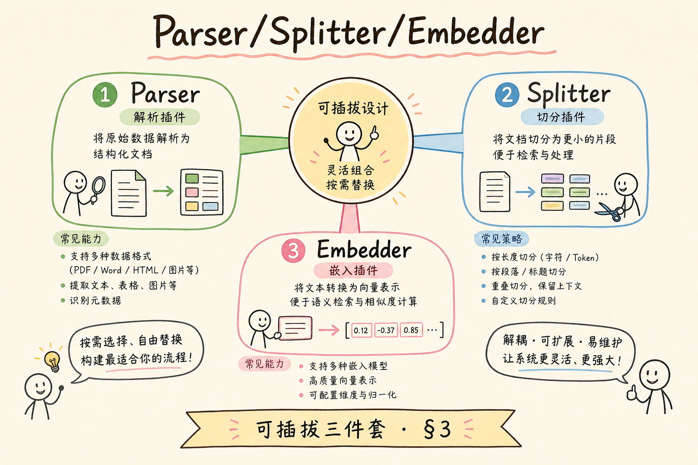
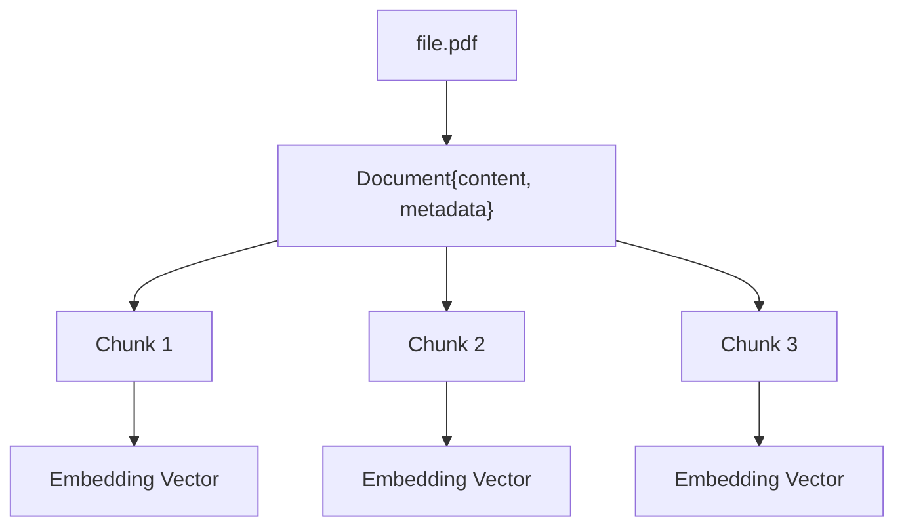
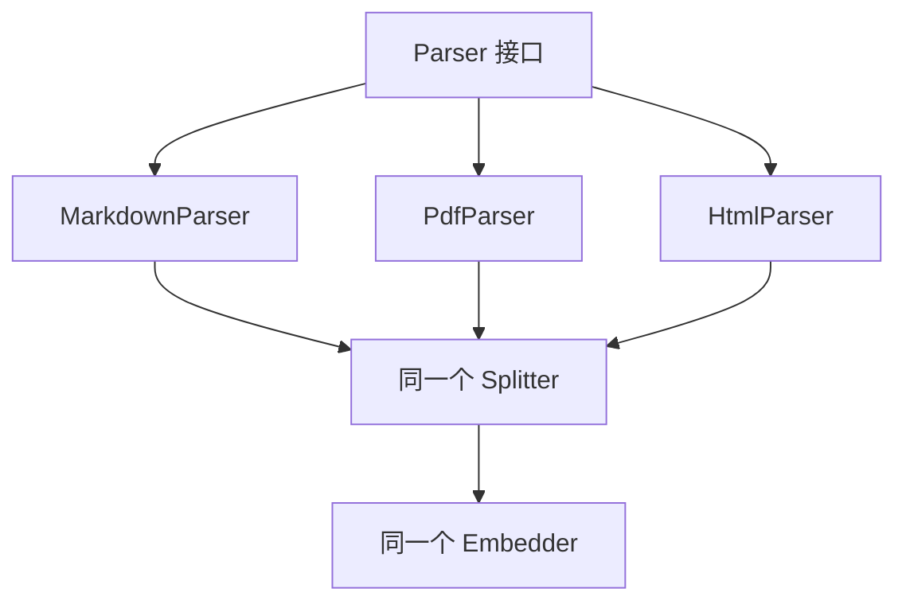
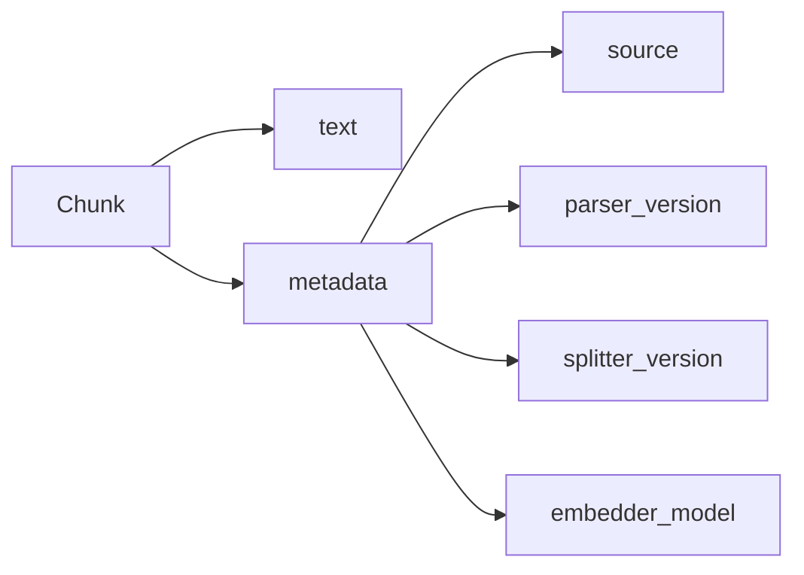
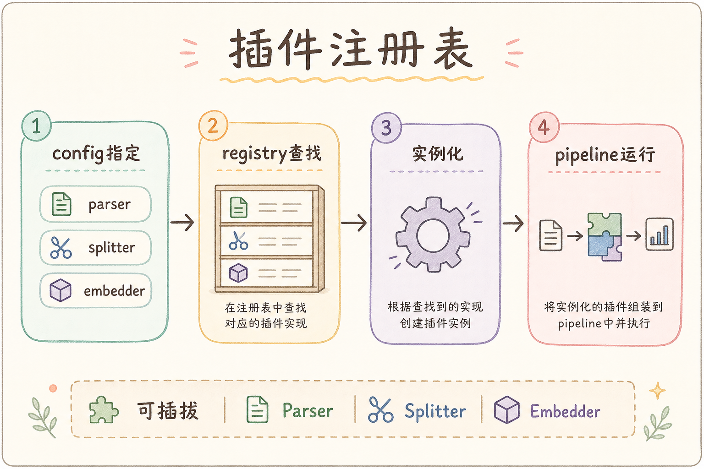

# D 框架与架构（十二）：可插拔 Parser / Splitter / Embedder 入门指南

RAG 知识库最前面的三步经常被低估：解析文件、切分文本、生成向量。刚开始时，你可能只支持 Markdown；过一段时间又要支持 PDF、网页、Word；后来还要换 embedding 模型。如果这些逻辑写死在一起，每次变化都会牵动整条入库管道。

**可插拔 Parser / Splitter / Embedder** 要解决的是入库阶段的可替换问题。本文面向初学者，读完后你应该能理解这三个接口各做什么，为什么要把它们拆开，并能写出一个最小可运行的入库管道骨架。

## 目录

- [1. 为什么入库阶段也要可插拔](#1-为什么入库阶段也要可插拔)
- [2. Parser / Splitter / Embedder 是什么](#2-parser--splitter--embedder-是什么)
- [3. 三者如何组成入库管道](#3-三者如何组成入库管道)
- [4. 接口设计原则](#4-接口设计原则)
- [5. 最小可运行示例](#5-最小可运行示例)
- [6. 如何替换某一环](#6-如何替换某一环)
- [7. 版本、元数据与回滚](#7-版本元数据与回滚)
- [8. 常见错误](#8-常见错误)
- [9. FAQ](#9-faq)
- [10. 总结](#10-总结)

## 1. 为什么入库阶段也要可插拔

RAG 的检索效果很大程度由入库阶段决定。Parser 解析不准，正文会缺失；Splitter 切分不合理，答案会被切散；Embedder 换了模型，向量空间会变化。它们任何一环改变，都可能影响最终问答。

可插拔的目标是让每一环可以独立替换和测试。你可以只换 PDF Parser，不影响 Markdown Parser；只调 Splitter 参数，不改 Embedder；只换 embedding 模型，不重写解析逻辑。


这张图展示的是入库管道的四段。本文重点是前三段的接口边界。

## 2. Parser / Splitter / Embedder 是什么

这三个角色要分清，否则代码很容易变成一个巨大的 `ingest_file()`。

| 角色 | 白话解释 | 输入 | 输出 |
|---|---|---|---|
| Parser | 把文件读成文本 | 文件路径或字节 | Document |
| Splitter | 把长文本切成片段 | Document | Chunk 列表 |
| Embedder | 把文本转成向量 | Chunk 文本 | 向量列表 |

**Parser** 关心格式，例如 PDF、Markdown、HTML。**Splitter** 关心语义边界和长度。**Embedder** 关心模型和向量维度。职责分开后，问题定位会简单很多。

## 3. 三者如何组成入库管道

一次入库可以理解为“文件逐步变形”：文件先变成 Document，Document 变成 Chunks，Chunks 变成向量记录。





每一步都要带着元数据往后传。比如 `source_id`、标题、租户、更新时间，不能在切分或向量化时丢掉。

## 4. 接口设计原则

接口不要一开始设计得很大。先把输入输出形状定清楚，再让具体实现围绕这个形状工作。

```python
from dataclasses import dataclass
from typing import Protocol


@dataclass
class Document:
    content: str
    metadata: dict


@dataclass
class Chunk:
    text: str
    metadata: dict


class Parser(Protocol):
    def parse(self, path: str) -> Document:
        ...


class Splitter(Protocol):
    def split(self, document: Document) -> list[Chunk]:
        ...


class Embedder(Protocol):
    def embed(self, texts: list[str]) -> list[list[float]]:
        ...
```

这个接口的关键是 metadata 一路保留。否则向量写入后，你会知道“搜到了一段文字”，却不知道它来自哪个文件、哪个租户、哪个版本。

## 5. 最小可运行示例

下面实现一个可运行的 Markdown 入库管道。它不用真实 embedding 服务，用文本长度模拟向量，重点是展示组件如何拼接。

运行环境：Python 3.10+。

```python
from dataclasses import dataclass
from pathlib import Path


@dataclass
class Document:
    content: str
    metadata: dict


@dataclass
class Chunk:
    text: str
    metadata: dict


class MarkdownParser:
    def parse(self, path: str) -> Document:
        p = Path(path)
        text = p.read_text(encoding="utf-8")
        return Document(content=text, metadata={"source": str(p), "type": "markdown"})


class ParagraphSplitter:
    def split(self, document: Document) -> list[Chunk]:
        parts = [p.strip() for p in document.content.split("\n\n") if p.strip()]
        return [Chunk(text=part, metadata=document.metadata.copy()) for part in parts]


class FakeEmbedder:
    def embed(self, texts: list[str]) -> list[list[float]]:
        return [[float(len(text)), float(text.count(" "))] for text in texts]


def ingest(path: str, parser, splitter, embedder) -> list[dict]:
    document = parser.parse(path)
    chunks = splitter.split(document)
    vectors = embedder.embed([chunk.text for chunk in chunks])
    return [
        {"text": chunk.text, "metadata": chunk.metadata, "vector": vector}
        for chunk, vector in zip(chunks, vectors)
    ]
```

真实项目中，`FakeEmbedder` 会换成具体 embedding 模型，最后的记录会写入 VectorStore。但整体管道形状不需要改变。

## 6. 如何替换某一环

可插拔的价值在替换时体现。假设你从 Markdown 扩展到 PDF，只需要新增 `PdfParser`，并保证它返回同样的 `Document` 结构。



Splitter 和 Embedder 也一样。你可以把 `ParagraphSplitter` 换成 Markdown 标题切分器，也可以把 `FakeEmbedder` 换成真实模型。只要接口一致，入库主流程就不用大改。

## 7. 版本、元数据与回滚

入库管道一旦可替换，就要记录版本。否则你以后看到一条向量，不知道它是用哪个 Parser、哪个 Splitter、哪个 Embedder 生成的。

建议每个 chunk metadata 里记录：

| 字段 | 用途 |
|---|---|
| `parser_version` | 排查解析差异 |
| `splitter_version` | 排查切分差异 |
| `embedder_model` | 判断是否需要重建索引 |
| `source` | 找回原始文件 |
| `tenant_id` | 做权限过滤 |



如果 embedding 模型换了，通常需要重建这批向量。版本字段能帮助你找出哪些数据需要重跑。

## 8. 常见错误

第一个错误是 Parser 直接切 chunk。这样后面想调整切分策略时，就必须重写解析器。Parser 应尽量输出完整 Document。

第二个错误是 Splitter 丢 metadata。切分后每个 chunk 都必须知道来源和权限信息。

第三个错误是混用不同 embedding 模型生成的向量。不同模型的向量空间不一致，混在一个索引里会影响相似度搜索。

第四个错误是没有记录版本。上线后评估变差时，你无法判断是解析、切分还是 embedding 改动造成的。

## 9. FAQ

**Q：Parser 和 Loader 是一回事吗？**  


有些项目会混用这两个词。本文里 Parser 强调“把格式解析成文本和元数据”，Loader 更泛指“把来源加载进系统”。

**Q：Splitter 要不要知道文件类型？**  
可以知道，但不应依赖具体 Parser 实现。更好的方式是通过 metadata 或配置选择不同 Splitter。

**Q：Embedder 可以逐条调用吗？**  
学习阶段可以。生产环境通常批量调用，减少网络开销和成本。

**Q：什么时候需要重建索引？**  
Parser、Splitter 或 Embedder 的关键逻辑变化时，都应考虑重建或至少局部重建。

## 10. 总结

Parser / Splitter / Embedder 是 RAG 入库阶段的三个关键变化点。把它们拆成接口，不是为了形式上的架构，而是为了能独立替换、测试和回滚。


初学者可以先用一个 Markdown Parser、一个段落 Splitter、一个假 Embedder 跑通流程。等真实文件类型和模型接入时，只替换具体实现，不推翻整条管道。
