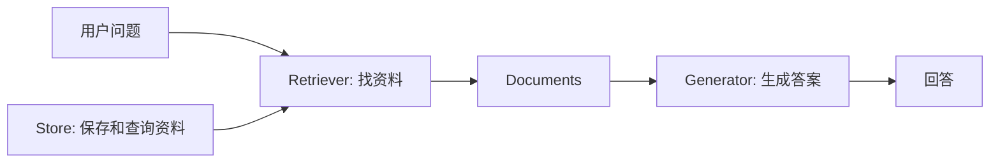
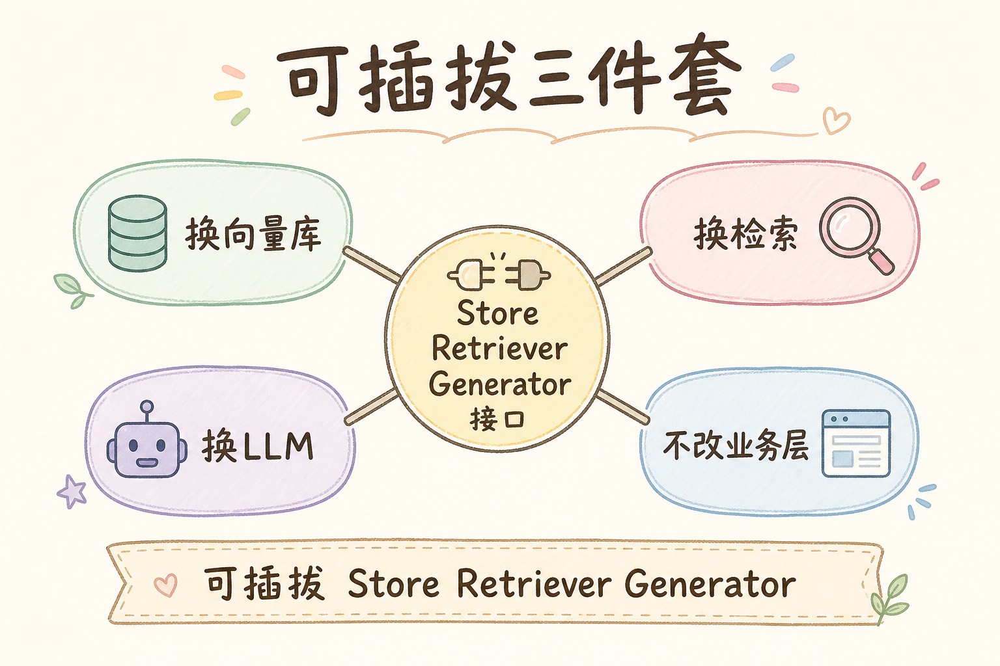
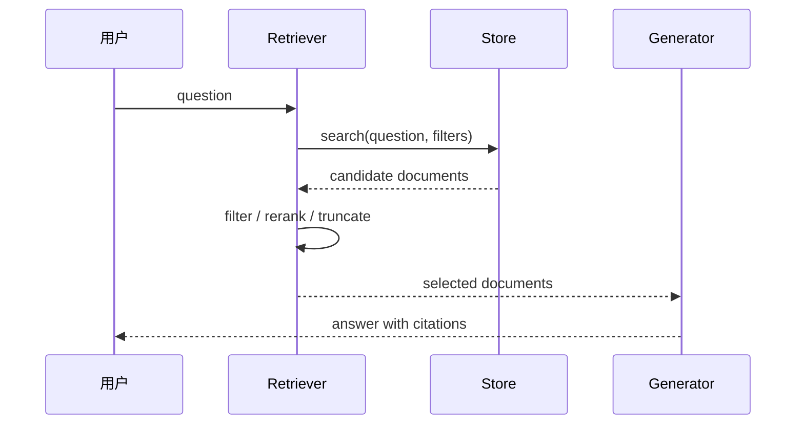
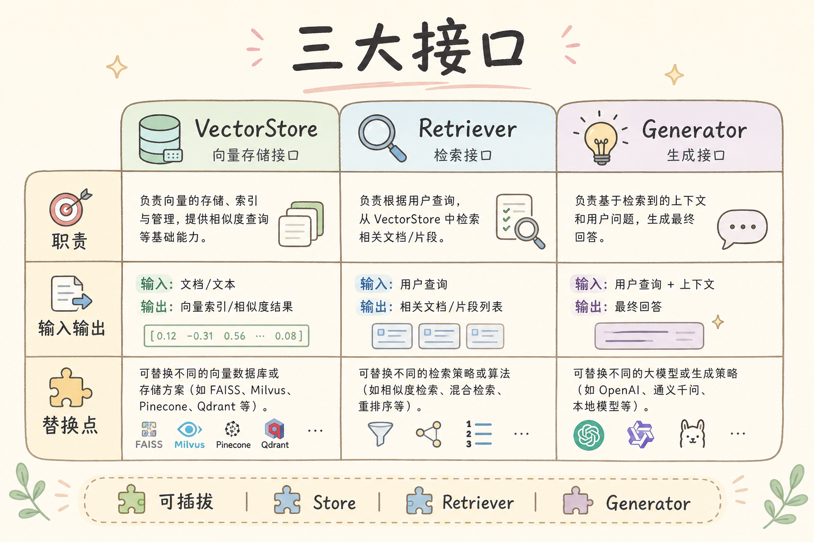
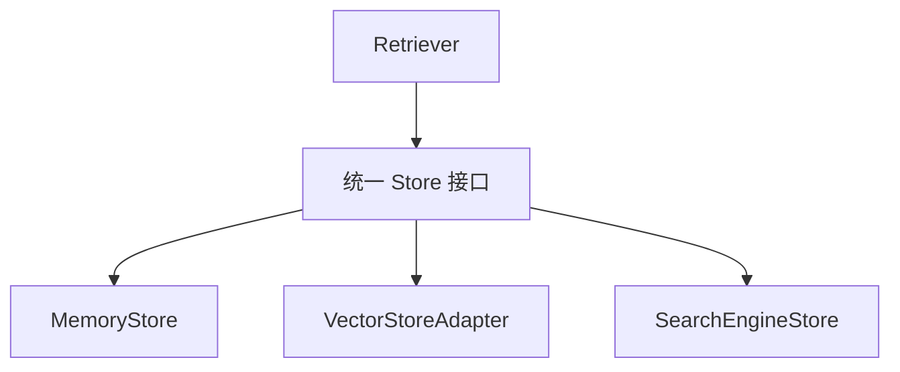

# D 框架与架构（十）：可插拔 Store / Retriever / Generator 入门指南

一个 RAG Demo 很容易写成一条固定链路：固定向量库、固定检索方式、固定模型。问题是项目一旦上线，就会出现变化：本地向量库要换成云服务，普通检索要加重排，模型要从一个供应商切到另一个供应商。如果每次变化都要改一堆 `if/else`，系统会越来越难维护。

**可插拔架构**要解决的就是这个问题：把 Store、Retriever、Generator 这些关键能力拆成接口，让具体实现可以替换。本文面向初学者，读完后你应该能理解这三个角色各做什么，为什么要先定义接口，再写具体实现，并能写出一个最小可运行的插件式 RAG 骨架。

## 目录

- [1. 为什么需要可插拔架构](#1-为什么需要可插拔架构)
- [2. Store / Retriever / Generator 是什么](#2-store--retriever--generator-是什么)
- [3. 三者如何协作](#3-三者如何协作)
- [4. 先定义接口，再写实现](#4-先定义接口再写实现)
- [5. 最小可运行示例](#5-最小可运行示例)
- [6. 如何替换实现](#6-如何替换实现)
- [7. 配置、测试与观测](#7-配置测试与观测)
- [8. 常见错误](#8-常见错误)
- [9. FAQ](#9-faq)
- [10. 总结](#10-总结)

## 1. 为什么需要可插拔架构

在早期 Demo 里，把向量库查询、prompt 拼接和模型调用写进一个函数没有问题。真正的问题出现在变化时：你想替换向量库，却发现生成逻辑也被牵连；你想加权限过滤，却要改模型调用代码；你想做 A/B 测试，却不知道应该在哪一层切换。

可插拔架构的目标不是把代码写复杂，而是把变化点隔离出来。Store 负责存，Retriever 负责找，Generator 负责答。每个角色边界清楚，替换时影响面就小。



这张图展示了最小分层：Store 不直接回答用户，Generator 不直接管底层存储，Retriever 夹在中间组织检索。

## 2. Store / Retriever / Generator 是什么

这三个词第一次出现时容易混在一起。先用白话分清它们。

| 角色 | 白话解释 | 典型职责 |
|---|---|---|
| Store | 资料仓库 | 保存文档、向量、元数据 |
| Retriever | 资料入口 | 根据问题找出相关 Document |
| Generator | 答案生成器 | 基于问题和资料组织答案 |

**Store** 偏底层能力，关心数据怎么保存和查询。**Retriever** 偏应用逻辑，关心哪些资料应该进入上下文。**Generator** 偏语言生成，关心如何基于资料回答。

一个常见误区是让 Generator 自己去查数据库。这样短期省事，长期会让生成层和存储层耦合。更稳的做法是让 Generator 只接收已经准备好的上下文。

## 3. 三者如何协作

一次完整问答可以拆成三段：Store 提供候选能力，Retriever 选择合适文档，Generator 基于文档回答。





这里最重要的是 Retriever 的中间处理。它可以做权限过滤、去重、重排和上下文预算控制。Store 不一定知道这些业务规则，Generator 也不应该承担这些规则。

## 4. 先定义接口，再写实现

**接口**就是一份约定：这个组件接收什么，返回什么。初学者可以把接口理解成“插座形状”。只要插头形状一致，后面就可以换不同电器。



下面是三个最小接口：

```python
from typing import Protocol


class Store(Protocol):
    def search(self, query: str, k: int) -> list[dict]:
        ...


class Retriever(Protocol):
    def retrieve(self, question: str) -> list[dict]:
        ...


class Generator(Protocol):
    def generate(self, question: str, docs: list[dict]) -> str:
        ...
```

这段代码不实现业务，只定义形状。形状稳定后，内存 Store、向量 Store、关键词 Retriever、混合 Retriever、不同模型 Generator 都可以接进来。

## 5. 最小可运行示例

下面用纯 Python 写一个可插拔骨架。它不依赖真实向量库和模型，重点是展示三层怎么连接。

运行环境：Python 3.10+。

```python
class MemoryStore:
    def __init__(self, docs: list[dict]):
        self.docs = docs

    def search(self, query: str, k: int = 3) -> list[dict]:
        words = set(query.lower().split())

        def score(doc: dict) -> int:
            return len(words & set(doc["text"].lower().split()))

        ranked = sorted(self.docs, key=score, reverse=True)
        return [doc for doc in ranked if score(doc) > 0][:k]


class SimpleRetriever:
    def __init__(self, store: MemoryStore):
        self.store = store

    def retrieve(self, question: str) -> list[dict]:
        docs = self.store.search(question, k=3)
        return [doc for doc in docs if doc.get("visible", True)]


class TemplateGenerator:
    def generate(self, question: str, docs: list[dict]) -> str:
        if not docs:
            return "没有找到足够资料，暂时不能可靠回答。"
        context = "\n".join(f"- [{d['id']}] {d['text']}" for d in docs)
        return f"问题：{question}\n基于以下资料回答：\n{context}"


store = MemoryStore([
    {"id": "doc-1", "text": "Retriever 负责根据问题找资料。", "visible": True},
    {"id": "doc-2", "text": "Generator 负责基于资料生成答案。", "visible": True},
])
retriever = SimpleRetriever(store)
generator = TemplateGenerator()

question = "Retriever Generator 分别做什么"
docs = retriever.retrieve(question)
print(generator.generate(question, docs))
```

这个例子的价值在于替换点清楚。你可以只换 `MemoryStore`，也可以只换 `TemplateGenerator`，调用方不需要知道内部细节。

## 6. 如何替换实现

可插拔不是为了“多写几个类”，而是为了在变化出现时少改代码。比如从内存搜索换成向量搜索，只要新 Store 仍然提供 `search(query, k)`，Retriever 就可以继续工作。



Generator 也一样。开发环境可以用模板生成器，生产环境可以接真实大模型，测试环境可以用 FakeGenerator 固定输出。

| 替换对象 | 为什么替换 | 调用方是否应大改 |
|---|---|---|
| Store | 本地换云端、关键词换向量 | 不应大改 |
| Retriever | 加权限过滤、混合检索、重排 | 不应大改 |
| Generator | 换模型、换输出格式 | 不应大改 |

如果替换一个组件导致整个项目大面积修改，说明接口边界还不够清楚。

## 7. 配置、测试与观测

可插拔架构需要配套三件事：配置选择实现，测试固定行为，日志观察每一步。

配置可以很简单：

```python
def build_store(kind: str):
    if kind == "memory":
        return MemoryStore([])
    if kind == "vector":
        raise NotImplementedError("这里接真实向量库")
    raise ValueError(f"未知 store 类型: {kind}")
```

这个工厂函数把“选哪个实现”的逻辑集中起来，避免散落在业务代码里。

观测也很重要。至少记录：使用了哪个 Store、Retriever 返回了哪些 `doc_id`、Generator 最终是否引用了这些文档。没有这些日志，出了错就很难判断是哪一层的问题。

## 8. 常见错误

第一个错误是接口太大。一个 Store 接口如果同时负责搜索、生成、权限、审计，就很难替换。接口应该围绕单一职责设计。

第二个错误是只抽象类名，不抽象数据形状。比如每个 Store 返回的字段都不同，Retriever 仍然要写大量兼容逻辑。统一返回结构比统一类名更重要。

第三个错误是把可插拔写成到处 `if/else`。选择实现应该集中在配置或工厂层，业务流程里尽量面向接口。

第四个错误是没有测试替换能力。至少要写一个测试证明同一个 Retriever 能接不同 Store，或者同一个业务流程能接 FakeGenerator。

## 9. FAQ

**Q：小项目需要可插拔架构吗？**  
如果只是一次性 Demo，不需要太早抽象。但只要你预期会换向量库、换模型或做多租户，就应该尽早把边界画清楚。

**Q：接口应该设计多通用？**  
先满足当前业务，不要追求能覆盖所有未来场景。好的接口通常是从真实重复变化里长出来的。

**Q：可插拔会不会降低性能？**  
通常接口层开销很小。真正影响性能的是检索、重排、模型调用和网络请求。

**Q：Retriever 可以直接依赖具体向量库吗？**  
学习阶段可以。项目变复杂后，建议通过 Store 或适配器隔离具体实现，方便替换和测试。

## 10. 总结

可插拔 Store / Retriever / Generator 的核心是分离变化点：Store 管资料，Retriever 管找资料，Generator 管生成答案。接口稳定后，底层实现可以替换，业务链路不必跟着大改。


初学者可以先用内存实现把接口跑通，再逐步接真实向量库和模型。不要一开始追求复杂架构，但要从第一天就避免把所有逻辑写进一个无法替换的大函数。
