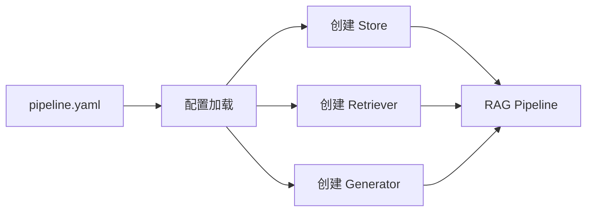
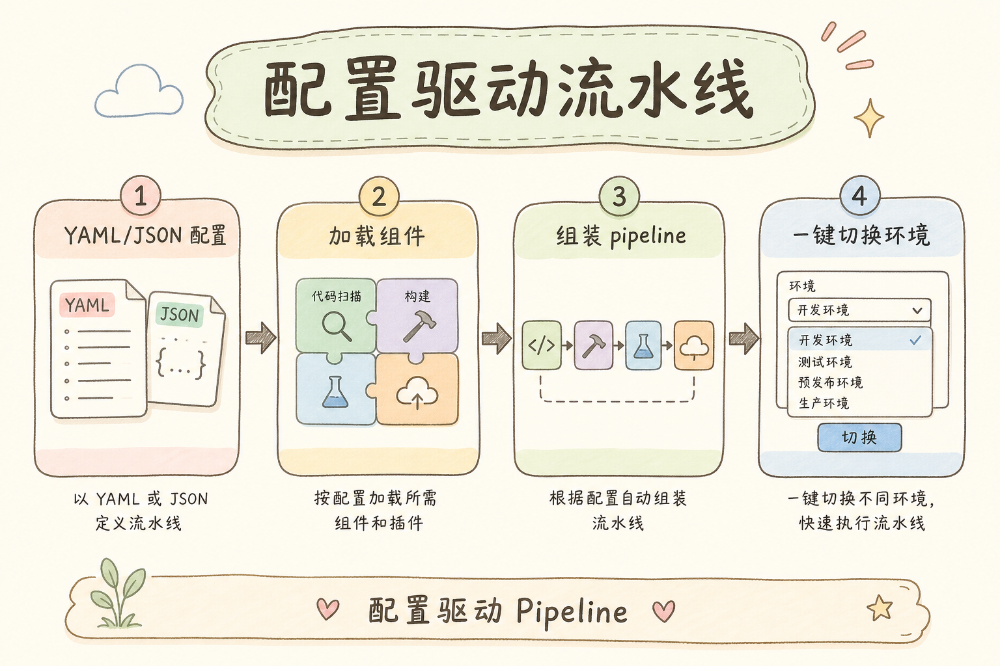
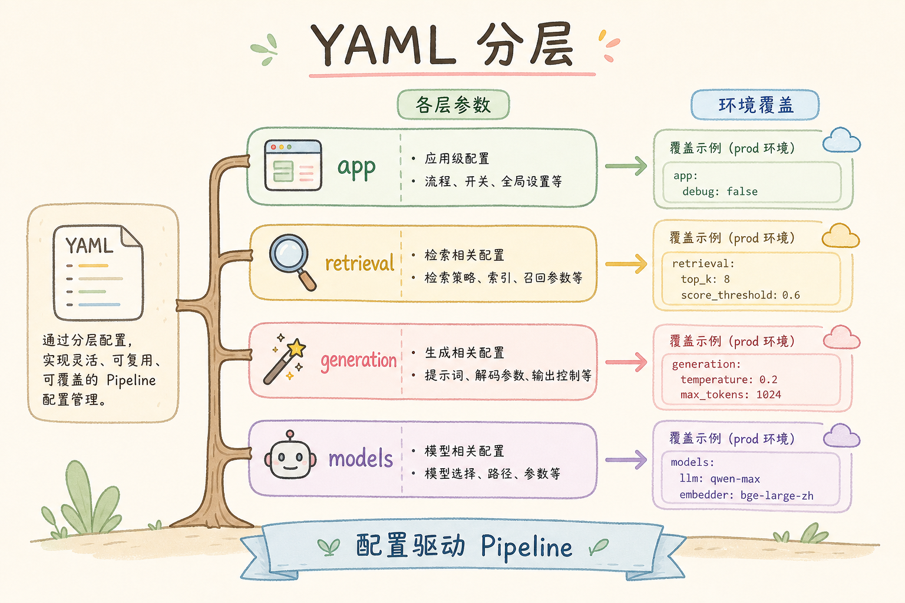
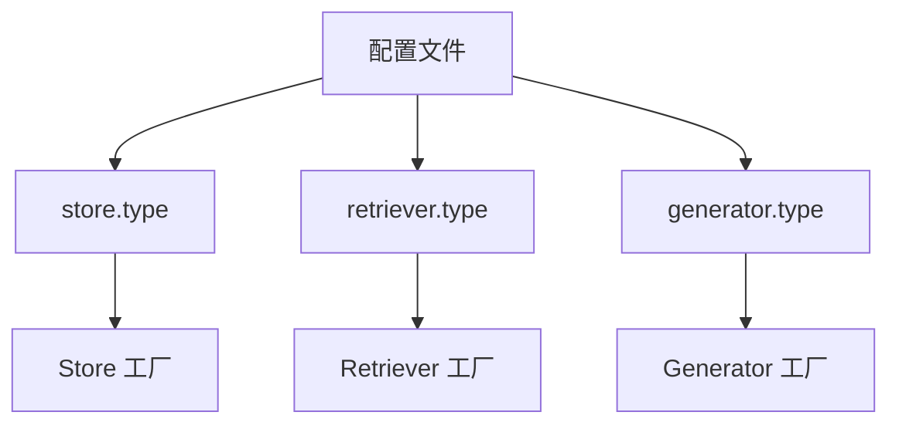
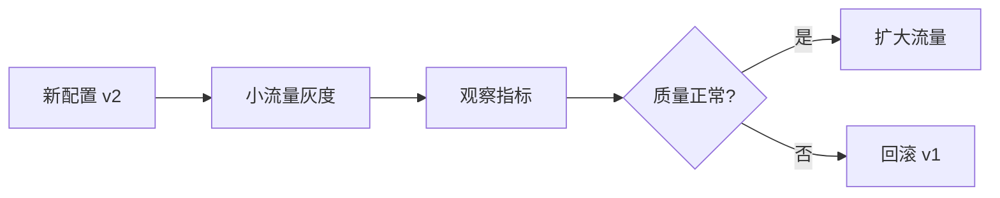

# D 框架与架构（十一）：配置驱动管道组装入门指南

RAG 系统上线后，经常需要调整模型、向量库、top_k、切分参数、是否启用重排。如果每次调整都要改代码、发版、回滚，迭代会很慢。**配置驱动管道**要解决的是：把经常变化的组装参数放到配置里，让代码负责按配置创建组件。

本文面向已经理解 Store、Retriever、Generator 的初学者。读完后，你应该能理解配置驱动是什么、它解决什么问题、配置文件应该怎么分层，并能写出一个根据配置创建 RAG 管道的最小示例。

## 目录

- [1. 为什么要配置驱动](#1-为什么要配置驱动)
- [2. 配置驱动是什么](#2-配置驱动是什么)
- [3. 哪些内容适合放配置](#3-哪些内容适合放配置)
- [4. 配置文件结构](#4-配置文件结构)
- [5. 最小可运行示例](#5-最小可运行示例)
- [6. 配置校验与默认值](#6-配置校验与默认值)
- [7. 灰度、回滚与观测](#7-灰度回滚与观测)
- [8. 常见错误](#8-常见错误)
- [9. FAQ](#9-faq)
- [10. 总结](#10-总结)

## 1. 为什么要配置驱动

RAG 系统的很多变化不是业务代码变化，而是策略变化：检索条数从 3 改到 5，模型从小模型切到大模型，重排从关闭改为开启。这些变化如果写死在代码里，每次都要重新发布。

配置驱动的目标是把“组件怎么组装、参数怎么取值”从代码里抽出来。代码仍然负责执行和校验，配置负责描述选择。



这张图说明：配置不是替代代码，而是告诉代码如何组装。

## 2. 配置驱动是什么

**配置驱动**：把可变策略写进配置文件或配置中心，程序读取配置后创建对应组件。通俗说，就是把“这次用哪套管道”写在说明书里，而不是焊死在代码里。

配置驱动通常包含三层：

| 层级 | 例子 | 作用 |
|---|---|---|
| 组件选择 | `retriever: hybrid` | 选择用哪个实现 |
| 参数 | `top_k: 5` | 控制组件行为 |
| 环境差异 | `dev/prod` | 不同环境使用不同资源 |

配置驱动不是让非技术人员随便改系统。配置仍然需要校验、版本、权限和回滚。

## 3. 哪些内容适合放配置

适合放配置的内容通常有两个特点：经常变、但不改变核心代码结构。



| 适合放配置 | 不适合放配置 |
|---|---|
| 模型名称 | 复杂业务分支逻辑 |
| top_k / temperature | 权限判断核心代码 |
| 是否启用 rerank | 数据库事务逻辑 |
| 向量库集合名 | 安全密钥明文 |
| prompt 模板版本 | 未测试的新代码路径 |

密钥不要直接写在普通配置文件里。配置可以引用环境变量，例如 `${OPENAI_API_KEY}`，真正的密钥由部署环境提供。

## 4. 配置文件结构

一个简单的 RAG 配置可以按 store、retriever、generator 三段组织。

```yaml
pipeline:
  name: default-rag
  version: v1

store:
  type: memory
  collection: docs-dev

retriever:
  type: vector
  top_k: 5
  rerank: false

generator:
  type: chat
  model: gpt-4o-mini
  temperature: 0.2
  prompt_version: rag-v3
```

这份配置表达了“用什么组件、带什么参数”。代码读取后，根据 `type` 选择具体实现。





配置结构越清晰，后面排查问题越容易。

## 5. 最小可运行示例

下面用 Python 字典模拟配置，并根据配置创建组件。它不依赖真实向量库和模型，重点是展示“配置 → 工厂 → 管道”的形状。

运行环境：Python 3.10+。

```python
class MemoryStore:
    def __init__(self, docs):
        self.docs = docs


class VectorRetriever:
    def __init__(self, store, top_k: int):
        self.store = store
        self.top_k = top_k

    def retrieve(self, question: str):
        return self.store.docs[: self.top_k]


class TemplateGenerator:
    def __init__(self, model: str):
        self.model = model

    def generate(self, question: str, docs: list[str]):
        return f"[{self.model}] 基于 {len(docs)} 条资料回答：{question}"


def build_pipeline(config: dict):
    if config["store"]["type"] != "memory":
        raise ValueError("示例只支持 memory store")

    store = MemoryStore(["资料 A", "资料 B", "资料 C"])
    retriever = VectorRetriever(store, top_k=config["retriever"]["top_k"])
    generator = TemplateGenerator(model=config["generator"]["model"])
    return retriever, generator


config = {
    "store": {"type": "memory"},
    "retriever": {"type": "vector", "top_k": 2},
    "generator": {"type": "chat", "model": "demo-model"},
}

retriever, generator = build_pipeline(config)
docs = retriever.retrieve("什么是配置驱动？")
print(generator.generate("什么是配置驱动？", docs))
```

这个例子体现了配置驱动的核心：业务调用不关心组件是怎么创建的，只使用组装好的管道。

## 6. 配置校验与默认值

配置必须校验。否则一个拼写错误可能让系统上线后才失败。

| 校验项 | 示例 |
|---|---|
| 必填字段 | `retriever.top_k` 必须存在 |
| 类型 | `top_k` 必须是整数 |
| 范围 | `top_k` 在 1 到 20 之间 |
| 枚举 | `retriever.type` 只能是允许值 |
| 依赖关系 | 启用 rerank 时必须配置 reranker |

```python
def validate_config(config: dict) -> None:
    top_k = config.get("retriever", {}).get("top_k")
    if not isinstance(top_k, int) or not 1 <= top_k <= 20:
        raise ValueError("retriever.top_k 必须是 1 到 20 的整数")

    model = config.get("generator", {}).get("model")
    if not isinstance(model, str) or not model:
        raise ValueError("generator.model 必须是非空字符串")
```

配置加载失败时，系统应该拒绝启动或拒绝切换，而不是带着错误配置继续运行。

## 7. 灰度、回滚与观测

配置驱动带来灵活性，也带来误操作风险。上线前要有灰度和回滚策略。



至少要记录每次请求使用的配置版本。否则用户反馈某个回答异常时，你无法知道当时跑的是哪套管道。

建议记录：pipeline version、model、retriever type、top_k、prompt version、是否启用 rerank。

## 8. 常见错误

第一个错误是把配置当代码执行。配置应该描述选择和参数，不应该承载复杂业务逻辑。

第二个错误是没有校验。配置文件能被解析，不代表配置合法。

第三个错误是配置没有版本。没有版本就无法做灰度、回滚和问题追踪。

第四个错误是把密钥写进配置仓库。普通配置文件不应保存真实 API Key 或数据库密码。

## 9. FAQ

**Q：配置应该用 YAML、JSON 还是数据库？**  
学习阶段 YAML 或 JSON 足够。生产环境可以接配置中心，但核心仍是结构清楚和可校验。

**Q：所有参数都要配置化吗？**  
不需要。只配置经常变化且安全可控的参数。过度配置会让系统更难理解。

**Q：配置改了要不要重启服务？**  
取决于系统设计。热更新更灵活，但要更严格校验和回滚；初期重启加载更简单可靠。

**Q：Prompt 模板算配置吗？**  
可以算。建议给 prompt 模板单独版本，并记录每次请求使用的版本。

## 10. 总结

配置驱动管道组装的目标是把 RAG 系统中经常变化的策略参数抽出来，让代码按配置创建 Store、Retriever 和 Generator。它提升迭代速度，但前提是配置可校验、可版本化、可回滚。


初学者可以先从 top_k、模型名、prompt 版本这些低风险参数开始配置化。等管道边界稳定后，再逐步扩展到检索策略、重排和多环境配置。
