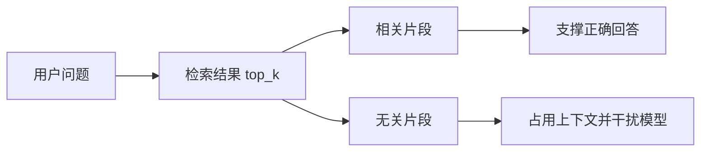
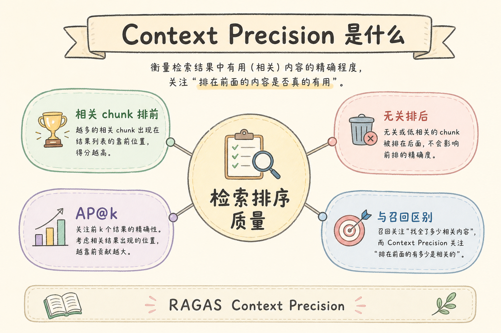
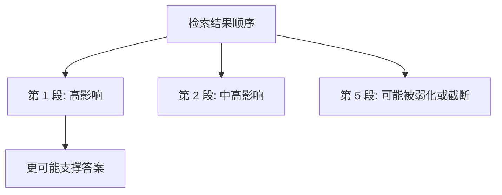
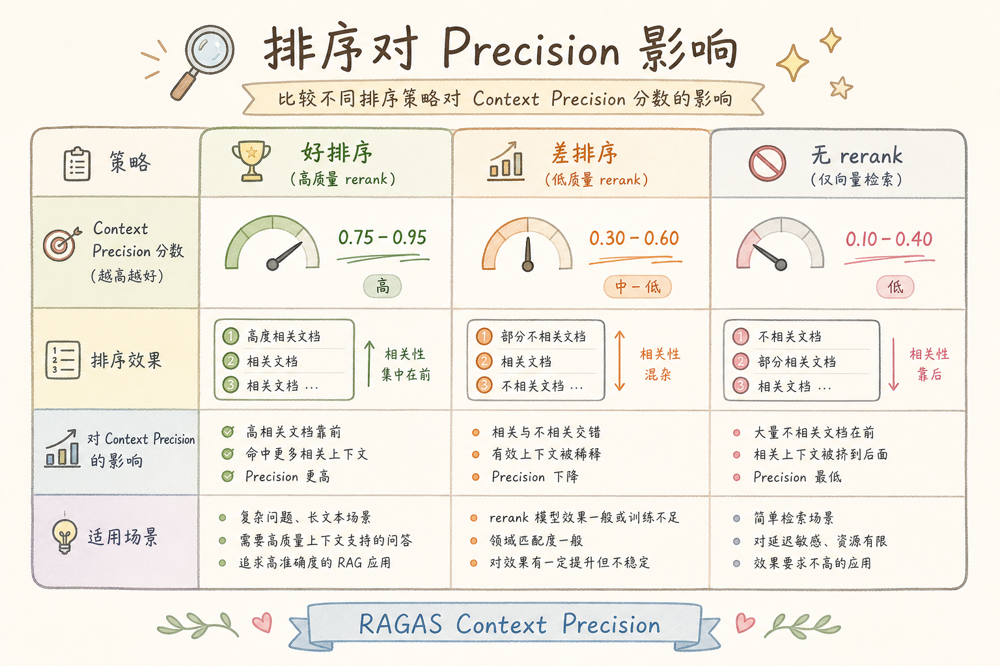
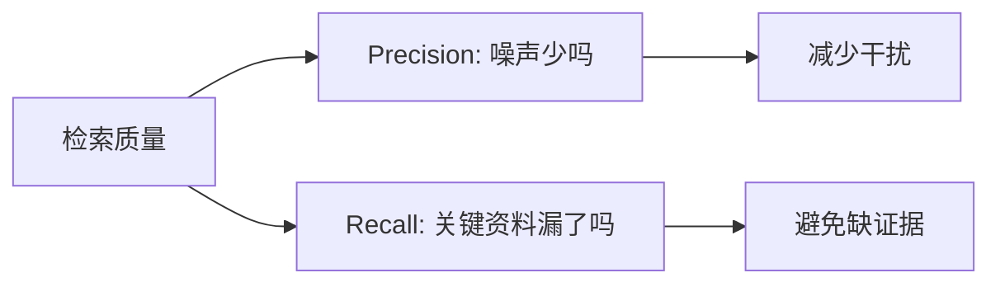
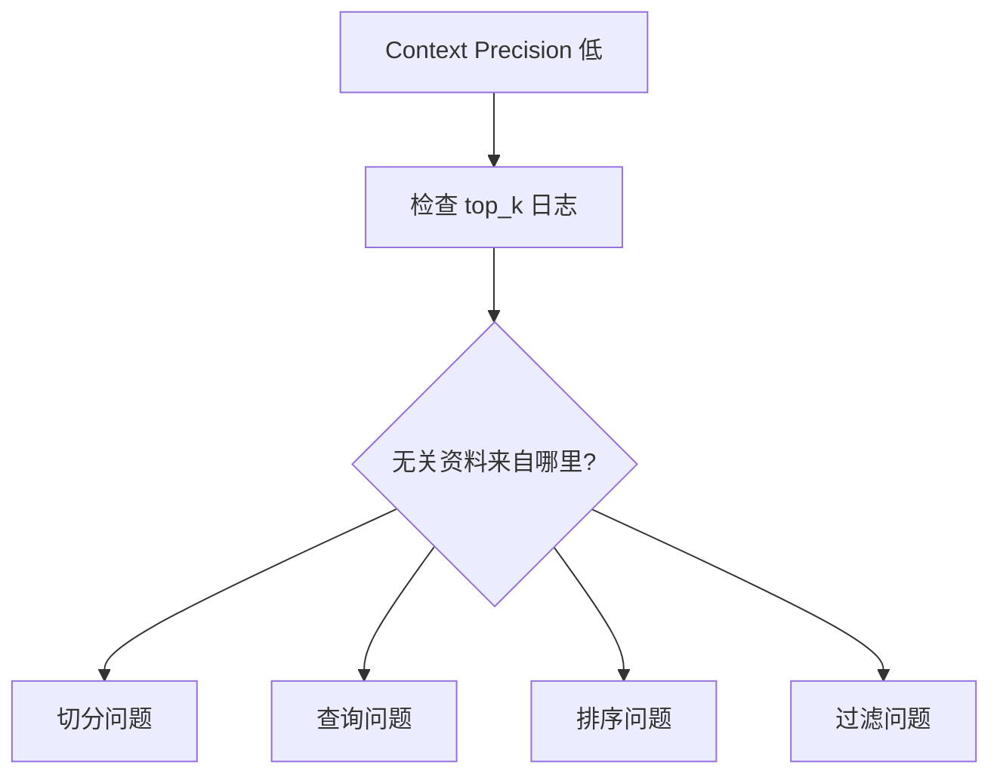

# E 评测与观测（一）：RAGAS Context Precision 入门指南

RAG 系统检索到资料后，常见问题不是“完全没资料”，而是“资料里混了很多无关内容”。模型看到无关内容，可能答偏、引用错，甚至把噪声当事实。**Context Precision** 要衡量的就是：检索结果排在前面的上下文，有多少真的对回答有帮助。

本文面向刚开始做 RAG 评测的读者。读完后，你应该能理解 Context Precision 是什么、它解决什么问题、为什么它和排序有关，并能用一个简单例子手算这个指标。

## 目录

- [1. 为什么只看召回不够](#1-为什么只看召回不够)
- [2. Context Precision 是什么](#2-context-precision-是什么)
- [3. 排序为什么重要](#3-排序为什么重要)
- [4. 手算一个例子](#4-手算一个例子)
- [5. 它和 Context Recall 的区别](#5-它和-context-recall-的区别)
- [6. 如何准备评测数据](#6-如何准备评测数据)
- [7. 如何改进 Context Precision](#7-如何改进-context-precision)
- [8. 常见错误](#8-常见错误)
- [9. FAQ](#9-faq)
- [10. 总结](#10-总结)

## 1. 为什么只看召回不够

假设用户问“上传后为什么不能马上问答”。系统找回 5 段资料，其中 1 段真正讲上传索引，另外 4 段分别讲登录、计费、UI、部署。关键资料确实被找回了，但噪声太多，模型仍然可能答得不稳定。

这就是只看“有没有找回正确资料”不够的原因。我们还要看正确资料是否排得靠前、无关资料是否太多。



Context Precision 关注的是检索结果里的“含金量”，尤其是靠前位置的含金量。

## 2. Context Precision 是什么

**Context Precision**：衡量检索上下文中相关片段排得是否靠前的指标。通俗说，它问的是：“前面拿给模型看的资料，是不是大多真的有用？”

它适合发现这类问题：

| 问题 | 表现 |
|---|---|
| 无关资料太多 | top_k 里有大量噪声 |
| 排序不佳 | 正确资料在很后面 |
| 检索词太泛 | 找到很多看似相关但不能回答的问题 |
| 切分太粗 | 一个 chunk 里混了多个主题 |

在 RAGAS 中，Context Precision 通常会借助评测模型判断每段 context 是否有助于回答。你也可以先用人工标注理解它。

## 3. 排序为什么重要

模型处理上下文时，靠前资料更容易影响答案；同时上下文窗口有限，靠后的资料可能被截断或被注意力弱化。因此相关片段排在第 1 位和第 5 位，效果可能完全不同。





Context Precision 不是只数“相关片段有几个”，还关心相关片段在列表中的位置。

## 4. 手算一个例子

假设检索结果前 5 条相关性如下，`1` 表示相关，`0` 表示无关：



```text
rank:      1  2  3  4  5
relevant:  1  0  1  0  0
```

计算时关注每个相关位置上的 precision：

| 位置 | 是否相关 | 截至该位置的 Precision |
|---|---|---|
| 1 | 是 | 1/1 = 1.00 |
| 2 | 否 | 不计入相关位置 |
| 3 | 是 | 2/3 = 0.67 |

平均后得到大约 `(1.00 + 0.67) / 2 = 0.835`。这说明相关资料虽然有两条，但第二条排到第 3 位，指标被拉低。

如果相关性变成：

```text
rank:      1  2  3  4  5
relevant:  0  0  1  1  0
```

相关资料仍然有两条，但都靠后，Context Precision 会更低。

## 5. 它和 Context Recall 的区别

Context Precision 和 Context Recall 常一起看。

| 指标 | 关注问题 | 白话解释 |
|---|---|---|
| Context Precision | 找回来的资料是否少噪声、排序好 | “拿来的资料准不准” |
| Context Recall | 该找的关键资料有没有找全 | “该拿的资料有没有漏” |



高 Precision 低 Recall 表示资料很干净但可能漏关键信息；低 Precision 高 Recall 表示关键资料在里面，但噪声也很多。

## 6. 如何准备评测数据

做 Context Precision 评测，需要准备问题、检索结果和相关性判断。初学阶段可以先人工标注小集合。

| 字段 | 说明 |
|---|---|
| `question` | 用户问题 |
| `contexts` | 系统检索到的片段列表 |
| `answer` | 系统回答，可选 |
| `relevance` | 每个 context 是否支持回答 |

建议从真实用户问题中抽 20 到 50 条，覆盖高频问题、容易混淆的问题和业务高风险问题。

不要只用开发者自己编的简单问题。简单问题往往检索很准，发现不了排序和噪声问题。

## 7. 如何改进 Context Precision

Context Precision 低，通常说明噪声太多或排序不好。可以从几个方向改。

| 问题来源 | 改进方式 |
|---|---|
| 查询太泛 | 做 query rewriting 或补全上下文 |
| 切分太粗 | 调整 chunk_size 和标题保留 |
| 向量检索不准 | 加关键词检索或混合检索 |
| 排序不好 | 加 reranker |
| 权限或类型混入 | 在检索前或检索中加过滤 |



先看检索日志，再决定改哪里。不要一看到分数低就直接换模型。

## 8. 常见错误

第一个错误是只看最终回答，不看检索列表。模型有时能从噪声中猜对答案，但检索质量仍然很差。

第二个错误是把 top_k 调小来提高 Precision。这样可能让噪声变少，但也可能牺牲 Recall，漏掉关键资料。

第三个错误是用过于简单的问题评测。简单问题容易让指标虚高，不能代表真实场景。

第四个错误是不保存排序。Context Precision 和顺序强相关，打乱顺序后指标含义会变化。

## 9. FAQ

**Q：Context Precision 高就代表答案一定好吗？**  
不一定。它只说明检索上下文更干净，答案质量还取决于生成、引用和拒答策略。

**Q：Context Precision 低一定是向量库问题吗？**  
不一定。可能是切分、查询改写、过滤、重排或评测数据问题。

**Q：应该和哪些指标一起看？**  
建议和 Context Recall、Faithfulness、Answer Relevancy 一起看。

**Q：人工标注相关性会不会主观？**  
会，所以要写清楚标注规则，例如“能直接支持回答关键结论才算相关”。

## 10. 总结

Context Precision 衡量的是检索结果是否干净、相关资料是否排在前面。它帮助你发现“关键资料虽然在，但噪声太多”的问题。


初学者可以先用少量真实问题手工标注相关性，观察 top_k 结果，再决定改查询、切分、过滤还是重排。它不是唯一指标，但非常适合排查 RAG 上下文噪声。
