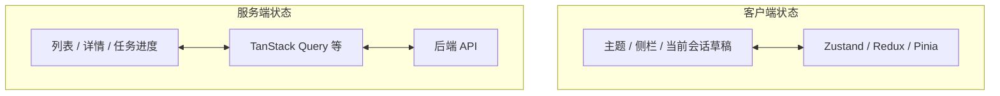
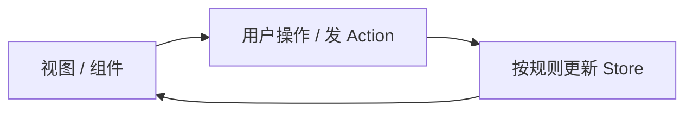
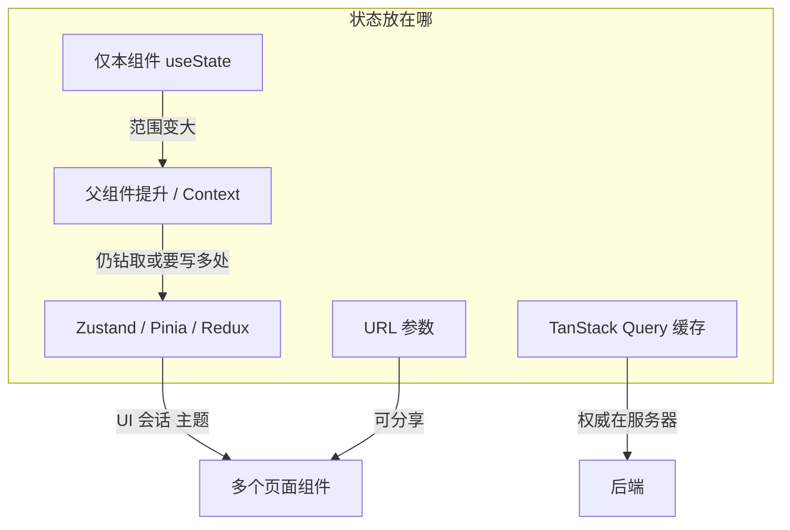

# 前端状态管理完全指南：从 useState 到 Zustand、Redux 与 Pinia

> 聊天页记着 `messages`，文档页记着 `documents`，顶栏还要显示「当前用户」——三个组件各写一套 `useState`，上传成功后要在两处手动 `setState` 才能同步。或者你把数据放在最外层父组件，往下传了五层 `props`，中间四层根本不用这些数据，只为「接力」。这类痛点多到一定程度，就会听到同事说：「上 Redux 吧」「Zustand 很轻」「Vue 用 Pinia」。这篇是**独立的地基教程**：用概念和对比表讲清**客户端全局状态**是什么、三种主流库各解决什么问题、与 **TanStack Query**（服务端状态）如何分工。代码只保留理解概念所需的最小片段，不绑定具体 RAG 项目。若你已在跟 React 系列，服务端列表缓存见 [React 第十二篇：TanStack Query](react/12.tanstack-query.md)；本篇补的是「多页面共享的 UI / 会话状态」这一层。

---

## 目录

1. [前言：状态散落在组件里会怎样](#1-前言状态散落在组件里会怎样)
2. [先分清两类状态：客户端 vs 服务端](#2-先分清两类状态客户端-vs-服务端)
3. [不用库时：useState、提升状态与 Context](#3-不用库时usestate提升状态与-context)
4. [什么时候才需要 Zustand / Redux / Pinia](#4-什么时候才需要-zustand--redux--pinia)
5. [全局状态管理的共同概念](#5-全局状态管理的共同概念)
6. [Redux：单一 Store 与可预测的数据流](#6-redux单一-store-与可预测的数据流)
7. [Zustand：极简 Store + Hook](#7-zustand极简-store--hook)
8. [Pinia：Vue 生态的官方全局 Store](#8-piniavue-生态的官方全局-store)
9. [三库横向对比与选型](#9-三库横向对比与选型)
10. [与 TanStack Query、URL 状态怎么配合](#10-与-tanstack-queryurl-状态怎么配合)
11. [综合概念地图](#11-综合概念地图)
12. [常见陷阱与 FAQ](#12-常见陷阱与-faq)
13. [总结与下一步](#13-总结与下一步)

---

## 1. 前言：状态散落在组件里会怎样

典型场景：知识库助手有 **聊天**、**文档列表**、**侧栏用户信息** 三个区域。聊天里 `useState` 存了 `messages`；文档页又 `useEffect` 拉了一遍 `documents`；用户点了「深色模式」，只有设置页记得 `theme`，回到聊天页又变回浅色——**同一份「应在全站生效」的数据，被复制成多份局部 state**，改一处忘另一处，就是前端里最常见的「状态不同步」。

另一种场景：**属性钻取**（prop drilling）。父组件有 `user`，子、孙、曾孙组件层层传 `user={user}`，中间层完全不读 `user`，只为传给更深处。代码可读性差，改字段名要动一串文件。

**状态**（state，状态）：界面在某一刻的「数据快照」——显示什么文字、列表有几条、弹窗开没开、用户选中的 tab 等。  
通俗说：屏幕背后的**记事本**；记事本变了，React/Vue 重新画界面。

**全局状态管理**（global state management）：把多组件都要用的那份记事本，放到**组件树外面的公共仓库**，用统一规则读写，避免每人兜里藏一本复印件。  
通俗说：公司用**共享网盘**代替微信传来传去——Zustand、Redux、Pinia 都是不同品牌的网盘客户端。

**读完本文，你应该能做到：**

1. 区分**客户端状态**与**服务端状态**，并说明为什么「文档列表」往往不该只塞进 Redux。
2. 解释 prop drilling 是什么，以及 `useState` + 提升、`Context` 各自适合到哪一步。
3. 用白话说明 Redux 的 Store、Action、Reducer、Dispatch 在数据流里各扮演什么角色。
4. 说出 Zustand 与 Redux 在「样板代码量」和「心智模型」上的主要差异。
5. 说明 Pinia 在 Vue 生态中的位置，以及与 React 侧 Zustand 的粗略对应关系。
6. 用决策树判断：小项目继续 `useState`、何时引入库、何时用 TanStack Query 管接口数据。

**前置知识**：能读 React 函数组件与 `useState`（[React 系列第二篇](react/02.vite-jsx-first-component.md) 程度），或 Vue 3 的 `ref` / `reactive` 基本概念。  
**环境**：概念篇不强制安装；若动手试代码，需 Node 18+ 与对应框架脚手架。  
**本文边界（地基篇）**：讲清**概念与选型**；**不讲** Redux Toolkit 全 API、中间件源码、Pinia 插件生态、时间旅行调试器配置、与 SSR 水合的每一细节。工程落地可在团队选定库后对照官方文档；RAG 系列里列表轮询仍以 [TanStack Query](react/12.tanstack-query.md) 为主栈。

### 1.1 什么时候值得读本篇

| 场景 | 建议 |
|------|------|
| 只有一两个页面、状态不跨路由共享 | 先掌握 `useState`，本篇可扫 §2、§4 决策树 |
| 多路由、多组件共享用户/主题/购物车式状态 | **值得读** §5–§9 |
| 主要痛点是接口缓存、轮询、重复请求 | 优先 [TanStack Query](react/12.tanstack-query.md)，再读本篇 §10 |
| 团队技术栈是 Vue 3 | 重点 §8 Pinia，§6–§7 作 React 对照 |
| 面试要答「Redux 数据流」 | §5–§6 必看 |

---

## 2. 先分清两类状态：客户端 vs 服务端

初学者最容易犯的错：**把所有从接口来的数据都塞进全局 Store**。实际上现代前端会先把状态**按来源**切开。

**客户端状态**（Client State）：由浏览器端产生、主要服务于 UI 交互，不一定有对应「数据库里的一行」。  
典型例子：侧栏是否折叠、当前选中的 tab、未发送完的聊天草稿、向导第几步、主题 `light`/`dark`。

**服务端状态**（Server State）：权威数据在服务器，前端通过 HTTP/WebSocket **取副本** 展示；服务器上别人改了，你的副本会**过期**。  
典型例子：用户列表、订单详情、文档索引状态 `pending`/`done`、分页搜索结果。

| 维度 | 客户端状态 | 服务端状态 |
|------|------------|------------|
| 权威来源 | 当前页面 / 用户操作 | 后端 API |
| 是否「过期」 | 一般不过期，除非你主动改 | 会过期，需刷新、轮询、失效 |
| 多组件共享 | 常需全局库或 Context | 更宜用 Query/SWR 等**请求缓存库** |
| 离线后 | 仍可改 UI 状态 | 可能 stale（陈旧） |



对照上图：**左边**适合本篇三类库；**右边**适合 Query 一类——不是 Redux 不能存列表，而是 Query 专为「缓存 + 失效 + 重试 + 轮询」设计，省事且不易错。企业 RAG 前端里，`documents` 列表走 Query、`currentThreadId` 或 UI 布局走 Zustand，是常见分工（§10 展开）。

**不必非此即彼**：同一条 `messages` 若在聊天页是「当前会话的展示」，可放客户端 Store；若还要持久化到服务器、多端同步，则发送/拉取仍靠 API，Store 里放的是**视图层副本** + 乐观更新策略——那是主线篇工程话题，地基篇只需记住：**先问数据权威在谁那儿**。

---

## 3. 不用库时：useState、提升状态与 Context

在引入 Zustand/Redux/Pinia 之前，React 自带三层递进手段，弄清它们**能走到哪一步**，才不至于「一上来就 Redux」。

### 3.1 组件内 useState

**useState**（React Hook）：在单个函数组件里声明一块状态，改了就重渲染该组件（及子树）。  
通俗说：**组件私人的小本本**。

只适合：开关、输入框值、本卡片展开/收起——**不需要**兄弟组件或远房 cousin 组件知道。

### 3.2 提升状态（Lifting State Up）

**提升状态**：把 state 挪到**最近的共同父组件**，再通过 `props` 下发与回调上报。  
通俗说：兄弟吵架，把账本提到**他俩都能见到的家长**那里统一记。

适合：两个子组件要**双向联动**（如筛选框 + 列表），且共同父层不深、中间没有大量无关组件。父层过深或传递链过长时，就会演变成 prop drilling。

### 3.3 Context

**Context**（React 上下文）：在子树顶部 `Provider` 注入一个值，深层子组件 `useContext` 直接读，**不必层层传 props**。  
通俗说：在部门里广播通知，不用逐桌传纸条。

适合：**读多写少**、变化不特别频繁的全局配置——主题、语言、当前登录用户**只读**展示、设计系统 token。  
不适合：高频更新的复杂业务（如每秒刷新的聊天列表）——Context 值一变，**所有**消费该 Context 的子组件都可能重渲染，需配合 `memo`、拆分 Context 等优化，否则性能与调试都吃力。

**演示什么**：Context 解决「深层读 user」；**不演示**完整项目。  
**预期**：理解「Provider 包一层，深处 `useContext`」；与 Zustand 的差异是 Context 无内置「按字段订阅」、无 DevTools 时间旅行。

```jsx
// 概念片段：ThemeContext
const ThemeContext = React.createContext("light");

function App() {
  const [theme, setTheme] = useState("light");
  return (
    <ThemeContext.Provider value={{ theme, setTheme }}>
      <DeepChild />
    </ThemeContext.Provider>
  );
}

function DeepChild() {
  const { theme } = useContext(ThemeContext);
  return <p>当前主题：{theme}</p>;
}
```

Vue 3 里粗略对应：`provide` / `inject`，以及小应用直接用 `reactive` 挂模块级单例——Pinia 则是**正式版**的 provide/inject + DevTools。

---

## 4. 什么时候才需要 Zustand / Redux / Pinia

用决策表代替「必须上库」的迷信：

| 信号 | 更可能需要的方案 |
|------|------------------|
| 仅父子两层传 props | `useState` + 提升 |
| 全站主题、语言、登录用户展示 | `Context` 或轻量 Zustand |
| 5 层以上 prop drilling，且多处要写 | **全局 Store 库** |
| 多处写同一业务状态，已出现不同步 bug | **全局 Store 库** |
| 需要时间旅行调试、严格 action 日志（合规/大团队） | **Redux**（常配合 RTK） |
| 想要最少样板、快速出活 | **Zustand**（React）或 **Pinia**（Vue） |
| 数据主要来自 GET/POST，痛点是缓存与轮询 | **TanStack Query**，不是 Redux 首选 |

**什么时候不必用**：Demo 单页、状态不超过 3 处、团队没人熟悉 Redux——强行引入只会增加「action 类型字符串」维护成本。

**什么时候不必用 Redux 而用 Zustand**：中等复杂度、不需要 Middleware 生态、团队想要「写一个 `create` 就能用」——Zustand 在 React 社区近年很常见。

**什么时候选 Pinia**：项目已是 **Vue 3**；Pinia 为官方推荐，替代 Vuex 4。React 项目**不要**为了「听说 Pinia 好」硬套——Pinia 绑定 Vue 响应式系统。

---

## 5. 全局状态管理的共同概念

无论 Redux、Zustand 还是 Pinia，都在解决类似问题，先掌握**共同词汇**，再学各库方言。

### 5.1 单一数据源（Single Source of Truth）

**单一数据源**：同一种业务事实在内存里**只存一份**，各处读同一份，避免副本打架。  
通俗说：全公司只有**一本总账**，不是每个部门各记一本再对账。

### 5.2 单向数据流（Unidirectional Data Flow）

**单向数据流**：修改状态走**固定路径**（例如：发意图 → 算出新状态 → 视图更新），不鼓励任意组件直接改全局变量。  
通俗说：改总账必须走**审批流**，不能谁都在账本上乱涂。



读图时看箭头**单向**：视图不直接改 Store 内部对象（理想情况下），而是「声明我要发生什么」，由统一函数算出下一状态。

### 5.3 不可变更新（Immutable Updates）

**不可变更新**（immutable update）：更新时**不原地改**对象/数组，而是返回**新副本**，让库能对比前后差异、触发精准重渲染。  
通俗说：改账不是用橡皮擦涂原页，而是**新开一页**写清新版。

Redux 强制习惯不可变；Zustand/Pinia 在简单场景可用「可变写法」（内部有时用 `immer`），但概念上仍建议把「替换引用」当作默认思路。

### 5.4 选择器（Selector）

**选择器**：从 Store 里**派生**出一小块数据给组件用，避免整个 Store 变一点就全树重渲染。  
通俗说：你只订**日报栏目**，不用每天重读整本杂志。

例如 Store 里有 `users` 数组，选择器 `selectCurrentUser` 只根据 `currentUserId` 返回一个对象——组件订阅选择器结果即可。

---

## 6. Redux：单一 Store 与可预测的数据流

**Redux**：JavaScript 应用的可预测状态容器，与框架无关，在 React 中最常见；常配合 **Redux Toolkit**（RTK，官方推荐的简化写法）。  
通俗说：带**总账 + 审批单 + 会计规则**的财务系统——规矩多，大团队可追溯每一次改动。

### 6.1 核心四件套

| 名词 | 白话 |
|------|------|
| **Store**（仓库） | 全应用**唯一**的大对象，树形状态 |
| **Action**（动作） | 描述「发生了什么」的**普通对象**，必有 `type` 字段，可带 `payload` |
| **Reducer**（归约器） | 纯函数：`(旧状态, action) => 新状态`，**不能**在里面发请求、不能改入参 |
| **Dispatch**（派发） | 把 action **交给** Store 的函数，触发 reducer 计算 |

**纯函数**（pure function）：同样输入永远同样输出，无副作用。  
通俗说：Reducer 像**计算器**，不能偷偷打电话（副作用放在 middleware 或 `createAsyncThunk` 里）。

**演示什么**：最小计数器逻辑；**环境**：概念理解即可。  
**预期**：`dispatch({ type: 'increment' })` 后 state.count 加 1。

```javascript
// 极简 reducer（非 RTK 写法，便于看清概念）
function counterReducer(state = { count: 0 }, action) {
  switch (action.type) {
    case "increment":
      return { count: state.count + 1 };
    case "decrement":
      return { count: state.count - 1 };
    default:
      return state;
  }
}
```

React 里用 `useSelector` 读、`useDispatch` 发；旧版还有 `connect` HOC，新项目以 Hooks 为主。

### 6.2 Redux Toolkit（RTK）解决了什么

手写 Redux 曾以**样板代码多**著称：`type` 常量、`actionCreator`、`reducer` 拆多文件。  
**Redux Toolkit** 提供 `createSlice`：在一个文件里同时定义 `initialState`、`reducers`、`actions`，内部用 **Immer** 让你写「像可变」的代码、产出不可变结果。

**Middleware**（中间件）：在 `dispatch` 到进 reducer **之间**插入逻辑，如日志、异步 `redux-thunk`、持久化。  
通俗说：审批流上的**复印留档**或**先外联确认再入账**。

**RTK Query**：RTK 自带的**服务端状态**层（定义 API slice、`useGetXQuery`）——与 TanStack Query 定位重叠，团队若已全栈 Redux 可选用；否则 React 项目更常见 Query + Zustand 分工。

### 6.3 Redux 适合谁

- 大型团队要**统一 action 日志**、时间旅行调试（Redux DevTools）。
- 复杂客户端状态机、多模块协作，已有 Redux 遗产。
- 愿意接受**学习曲线**换**可预测性**。

### 6.4 Redux 不必吓到自己

地基篇不必背全 API。面试常问「数据流」：  
**UI → dispatch(action) → reducer → 新 state → UI 重渲染**。  
能画这条线，就掌握了 Redux 80% 的叙事核心。

### 6.5 RTK 的 createSlice 在概念上做了什么

**createSlice**（创建切片）：把「初始状态 + 改状态的几种方式 + 自动生成的 action」收进**一个模块**，名字常叫 `userSlice`、`chatSlice`。  
通俗说：总账里**分科目**——每个 slice 管自己那一页，最后合并进同一个 Store。

你仍可以把它理解成：**用户点击** → 调用 `slice.actions.xxx()` → 内部等价于 dispatch 了一个带 `type` 的 action → **immer** 帮你生成新 state → 组件 `useSelector` 看到新值。  
与手写 `switch(action.type)` 相比，只是少写了字符串常量、文件更短；**数据流方向没变**。

面试或读仓库时若见到 `useAppDispatch`、`useAppSelector`，多为 RTK 项目模板生成的类型安全封装——知道它们是 `useDispatch` / `useSelector` 的 TS 版即可，地基篇不必配置 store 文件。

---

## 7. Zustand：极简 Store + Hook

**Zustand**（德语「状态」）：轻量 React 状态库，API 围绕 `create` 与自定义 Hook。  
通俗说：**共享网盘 + 订阅通知**——没有 Redux 那套正式 action 类型，但依然可以是单一 Store、可按字段订阅。

### 7.1 心智模型

```typescript
// 概念片段：create 返回一个 hook
import { create } from "zustand";

const useBearStore = create((set) => ({
  bears: 0,
  increase: () => set((state) => ({ bears: state.bears + 1 })),
}));
```

组件里 `const bears = useBearStore((s) => s.bears)`：**只订阅** `bears`，别的字段变不一定重渲染——类似选择器。

与 Redux 对比：

| 维度 | Redux（经典） | Zustand |
|------|---------------|---------|
| Store 数量 | 通常一个根 Store，再分 slice | 可多个小 `create`，按功能拆 |
| 修改方式 | dispatch(action) → reducer | 直接调 `set` 或 store 上的方法 |
| 样板代码 | 多（RTK 已减轻） | 少 |
| DevTools | 成熟 | 可接 middleware 支持 |
| 适用框架 | React 为主，也有其他绑定 | **React** |

**先错后对**：把 Zustand 当成「全局可变对象」到处 `getState().xxx = yyy`。

```javascript
// ❌ 绕过 set，破坏订阅与可预测性
useBearStore.getState().bears = 10;
```

```javascript
// ✅ 通过 set 或封装好的 action 方法
useBearStore.getState().increase();
```

### 7.2 何时优先 Zustand

- 中小型 React 应用，要共享 `user`、`sidebarOpen`、`draftMessage`。
- 团队不想维护 action 类型枚举。
- 与 TanStack Query 并列：Query 管 `documents`，Zustand 管 `ui` 与「当前选中的 threadId」。

### 7.3 局限（诚实边界）

- 超大应用若要求**每一步操作可审计**，Redux 生态更成熟。
- 异步与缓存策略不如 Query 专业——**别用 Zustand 替代请求缓存库**。
- 非 React 场景有 [`zustand/vanilla`](https://github.com/pmndrs/zustand)，但本篇读者多半在 React/Vue 二选一。

---

## 8. Pinia：Vue 生态的官方全局 Store

**Pinia**：Vue 官方推荐的状态库，替代 Vuex 4，面向 **Vue 3** + Composition API。  
通俗说：Vue 世界的「正式共享仓库」——和 Zustand 一样追求少样板，但语法是 Vue 的 `defineStore`。

### 8.1 三个核心概念

| Pinia 概念 | 白话 | 粗略对照 |
|------------|------|----------|
| **State** | Store 里的数据 | Redux state 的一片 / Zustand 里的字段 |
| **Getters** | 从 state 算出来的只读派生值 | Redux selector / 计算属性 `computed` |
| **Actions** | 改 state 的方法，**可 async** | dispatch + thunk / Zustand 里的函数 |

```javascript
// 概念片段：defineStore
import { defineStore } from "pinia";

export const useUserStore = defineStore("user", {
  state: () => ({ name: "", isLoggedIn: false }),
  getters: {
    displayName: (state) => state.name || "游客",
  },
  actions: {
    async login(credentials) {
      const res = await fetch("/api/login", { /* ... */ });
      this.name = res.name;
      this.isLoggedIn = true;
    },
  },
});
```

组件中 `const userStore = useUserStore()`，用 `storeToRefs` 解构保持响应式——细节见 Vue 文档，地基篇记住 **「一个 store 一个领域」** 即可。

### 8.2 Pinia vs 旧版 Vuex

**Vuex**（4.x）：Vue 2/3 时代的官方库，**mutations** 同步、**actions** 异步，样板多。  
**Pinia**：去掉 mutations，**actions 里直接改 state**（仍可组织异步），多 Store 无需嵌套 modules，TypeScript 友好。

新项目 **Vue 3 选 Pinia**，不必再学 Vuex mutations，除非维护老项目。

### 8.3 Pinia 与 Zustand / Redux 的栈边界

- **Pinia 只用于 Vue**；React 项目选 Zustand 或 Redux。
- 三者都管**客户端全局状态**；都**不替代** Axios/fetch 的缓存层——Vue 侧对应 Query 库常是 TanStack Query for Vue 或 Pinia 外的请求层。

---

## 9. 三库横向对比与选型

### 9.1 总表

| | Redux (+ RTK) | Zustand | Pinia |
|---|---------------|---------|-------|
| 主要框架 | React（可其他） | React | **Vue 3** |
| 学习曲线 | 陡 | 平缓 | 平缓（会 Vue 即可） |
| 样板代码 | 中～多（RTK 减负） | 少 | 少 |
| 数据流严格度 | 高 | 中（约定靠团队） | 中 |
| 异步 | thunk、RTK Query、listener | 在 action 里写 async | actions 原生 async |
| DevTools | 很强 | 可选 | Vue DevTools 集成 |
| 典型场景 | 大型/强审计客户端状态 | 中小 React 共享 UI 状态 | Vue 全站 store |

### 9.2 选型决策树

```
你的框架是 Vue 3？
├─ 是 → 需要全局客户端状态？→ Pinia
└─ 否（React）→ 痛点主要是接口缓存/轮询？
    ├─ 是 → TanStack Query（+ 可选 Zustand 管 UI）
    └─ 否 → 状态复杂且团队要严格 action 追溯？
        ├─ 是 → Redux Toolkit
        └─ 否 → 想要最少代码？→ Zustand
            └─ 状态很少、仅主题/用户？→ Context 也许够
```

### 9.3 可以组合，不必单选

常见「组合拳」：

- **React**：TanStack Query（`documents`、`user profile`）+ Zustand（`sidebar`、`theme`、`activeChatId`）。
- **React 大型**：RTK + RTK Query，或 Redux + TanStack Query 并存（注意边界）。
- **Vue 3**：Pinia（UI / 会话）+ TanStack Query（列表与详情）。

切忌：**把所有 JSON 都 normalize 进 Redux entity map**，而不用 Query——能写，但多数团队维护成本更高。

### 9.4 用 RAG 助手想一遍（概念练习）

不贴完整项目，只练**分类**：

| 数据 | 建议归宿 | 理由 |
|------|----------|------|
| 文档列表与 `index_status` | TanStack Query | 来自 API，会轮询过期 |
| 当前高亮的 `documentId` | URL `?doc=` 或 Zustand | 可分享链接则用 URL |
| 侧栏「知识库」折叠与否 | Zustand 或 localStorage | 纯 UI，与服务器无关 |
| 聊天 `messages` 当前线程 | 组件 state 或 Zustand | 流式追加频繁；是否要跨路由保留定产品 |
| 登录用户展示名 | Query 或 Context | 读多写少，变更频率低 |

练完这张表，比死记「Redux 好还是 Zustand 好」更有用——**先分类，再选库**。

---

## 10. 与 TanStack Query、URL 状态怎么配合

### 10.1 TanStack Query 不是「全局状态库」的替代品

[React 第十二篇](react/12.tanstack-query.md) 已强调：**服务端状态**用 `useQuery` / `useMutation`，自带缓存、`invalidateQueries`、轮询。  
它与 Zustand **正交**：Query 回答「这份 API 数据新不新」；Zustand 回答「侧栏开着吗、当前 thread 是哪个」。

| 数据示例 | 更合适的归宿 |
|----------|----------------|
| `GET /api/documents` 列表 | TanStack Query |
| 上传后刷新列表 | `invalidateQueries` |
| 当前选中的 `documentId`（仅 UI 高亮） | Zustand 或 URL query |
| 深色模式 | Zustand / Context / localStorage |
| 聊天 `messages` 流式追加 | 本地 state 或 Zustand；发送仍走 API/SSE |

### 10.2 URL 也是状态

**URL 状态**：把 `?tab=docs`、`/chat/:threadId` 放在地址栏里，刷新可分享、可收藏。  
通俗说：**状态写在书签上**——适合「当前打开哪条对话、哪一页列表」，不必什么都进 Store。

实践顺序建议：**能放 URL 的放 URL** → 服务端数据 Query → 其余客户端再 Zustand/Pinia/Redux。

### 10.3 本地持久化

主题、语言、token（注意安全）常配合 **localStorage** + Store 水合。  
**持久化**（persist）插件 Redux-persist、Zustand persist、Pinia 插件——地基篇知道「可以刷页面后恢复」即可；token 存哪、是否 HttpOnly Cookie 属安全篇，不在此展开。

---

## 11. 综合概念地图

| 你遇到的问题 | 概念 / 工具 | 记住一句 |
|--------------|-------------|----------|
| 只有一个组件用 | `useState` | 别过度设计 |
| 兄弟组件联动 | 提升状态 | 共同父组件记账 |
| 深层只读配置 | Context / provide-inject | 读多写少 |
| 多页面共享 UI 状态 | Zustand / Pinia / Redux | 单一数据源 |
| 接口列表与缓存 | TanStack Query | 服务端状态专家 |
| 可分享、可刷新保留 | URL 路由参数 | 书签即状态 |
| 改状态要走流程 | Action → Reducer | Redux 核心叙事 |
| 从 store 取一片 | Selector / getter | 少重渲染 |



---

## 12. 常见陷阱与 FAQ

### 12.1 常见陷阱

**陷阱 1：凡数据必 Redux**

把 `documents` 全塞进 Redux，自己写 `loading`/`error`/`refetch`——重复造 Query 的轮子。

**陷阱 2：把服务端列表复制到 Store 后永不再拉**

上传成功只 `push` 本地数组，与别人改动的服务器数据不一致——应 `invalidate` 或重新 `fetch`。

**陷阱 3：Context 塞高频更新的大对象**

整个 `messages` 数组放进 Context，每条 SSE 都触发大范围重渲染。

**陷阱 4：Zustand 不使用选择器**

`const store = useBearStore()` 订阅整个 store，任何字段变都重渲染。

**陷阱 5：在 Reducer 里写副作用**

`fetch`、改 DOM、`Date.now()` 随机塞 reducer——破坏纯函数，调试噩梦；副作用放 thunk / `useEffect` / Query。

**陷阱 6：Vue 项目误用 Zustand**

Zustand 为 React 设计；Vue 3 用 Pinia，否则响应式与组件生命周期对不上。

### 12.2 FAQ

**Q：学 Redux 还是 Zustand 先？**  
A：React 新手先懂 `useState` 与 Context，再 Zustand 上手快；要进大厂维护老项目或面试 Redux 数据流，补 Redux + RTK。

**Q：Pinia 和 Vuex 学哪个？**  
A：新项目 Pinia；维护 Vue 2 老库才重点 Vuex。

**Q：Jotai、Recoil、MobX 呢？**  
A：同为状态方案；本篇聚焦路线图列出的 Zustand/Redux/Pinia。原子化状态（Jotai）适合细粒度订阅，是进阶选型。

**Q：全局状态要不要 TypeScript？**  
A：推荐。Store 形状清晰可减少字段拼错，见 [TypeScript 基础](13.typescript-basics-tutorial.md)。

**Q：Next.js App Router 用什么？**  
A：客户端组件里仍可用 Zustand；服务端组件不直接持客户端 Store——注意 `'use client'` 边界，细节见 [Next.js 系列](nextjs/README.md)。

**Q：和 [路线图](ENTERPRISE_RAG_ROADMAP.md) 第 21 条的关系？**  
A：路线图把本篇列为前端能力之一；RAG 系列默认 Query 管文档与索引，全局库管 UI/会话时再引入即可。

**Q：多个 Zustand store 还是一个大的？**  
A：按**业务域**拆多个 `create` 往往更清晰（`useUiStore`、`useChatUiStore`），避免一个巨型对象牵一发动全身；与 Redux 多 slice 思路类似。

**Q：状态管理要不要一开始就上？**  
A：不必。等出现「第三处要写同一字段」或「prop 传了四层」再引入，迁移成本更低；早引入的唯一理由是团队规范强制。

---

## 13. 总结与下一步

### 13.1 核心概念速记

1. **先分客户端状态与服务端状态**——后者优先 Query 类库。  
2. **prop drilling** 是信号，不是耻辱；小项目 `useState` + 提升往往够。  
3. **Redux** = 单一 Store + action + reducer + dispatch，严格可追踪。  
4. **Zustand** = 轻量 `create` + Hook，React 中小而美共享状态。  
5. **Pinia** = Vue 3 官方 Store，state/getters/actions，替代 Vuex。  
6. **URL、Query、Store** 三层分工，比「一个库打天下」更稳。

### 13.2 推荐阅读顺序

| 目标 | 文档 |
|------|------|
| React 请求与轮询 | [React 12：TanStack Query](react/12.tanstack-query.md) |
| TypeScript 读 Store 类型 | [13：TypeScript 基础](13.typescript-basics-tutorial.md) |
| useEffect 与本地 state | [React 03：数据请求](react/03.use-effect-data-fetching.md) |
| 全栈 RAG 前端闭环 | [Next.js 系列 README](nextjs/README.md) |

### 13.3 刻意留白（进阶可选）

本篇未展开：**Redux middleware 链**、**RTK Listener**、**Zustand persist 与 SSR 水合**、**Pinia 插件与 setup store 语法**、**XState 状态机**、**Jotai/Recoil 原子模型**、**WebSocket 推送与 Store 同步**。工程选定库后按官方文档深入；RAG 聊天流仍以系列第七～九篇 SSE + 本地 `messages` 为主，再按需把 `threadId` 提到 Store 或 URL。

---

> **初学者可能仍困惑的点**  
> - 「全局」不等于「所有变量」——只把**跨路由、多组件要写**的抬进 Store。  
> - Redux 和 Zustand 不是敌人；很多团队 Query + Zustand 共存。  
> - Pinia 与 Zustand **不能跨框架混用**，选型先定 React 还是 Vue。
