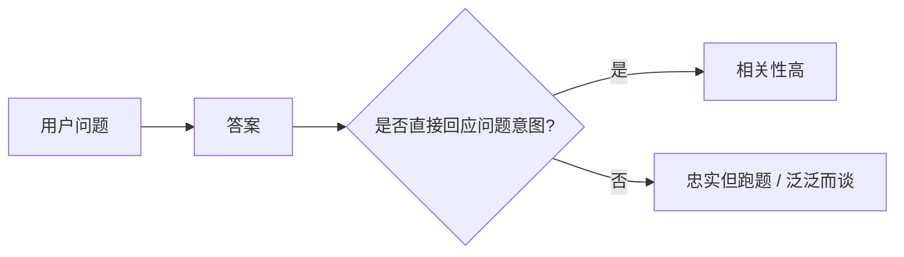
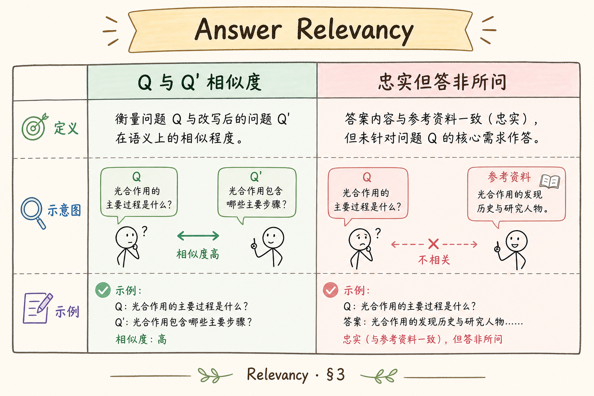
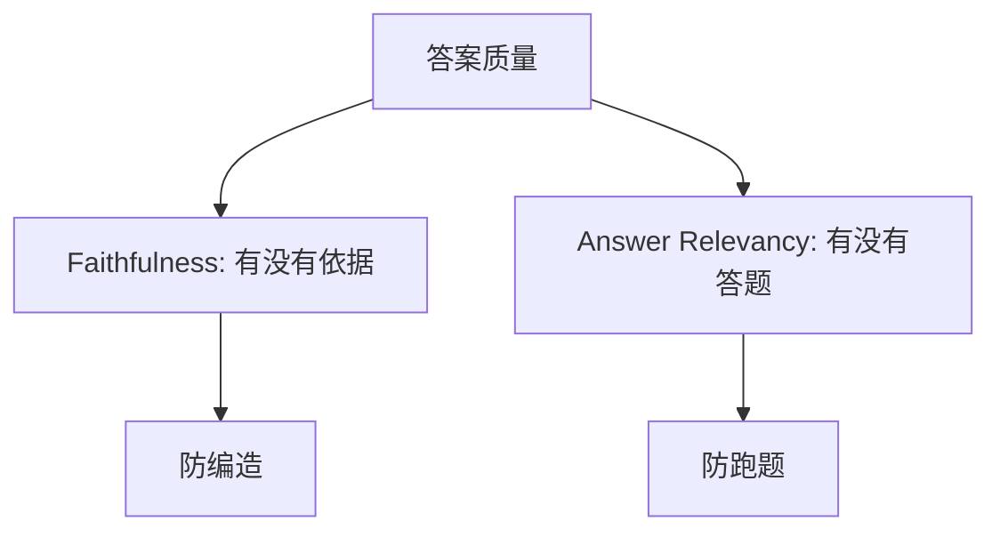
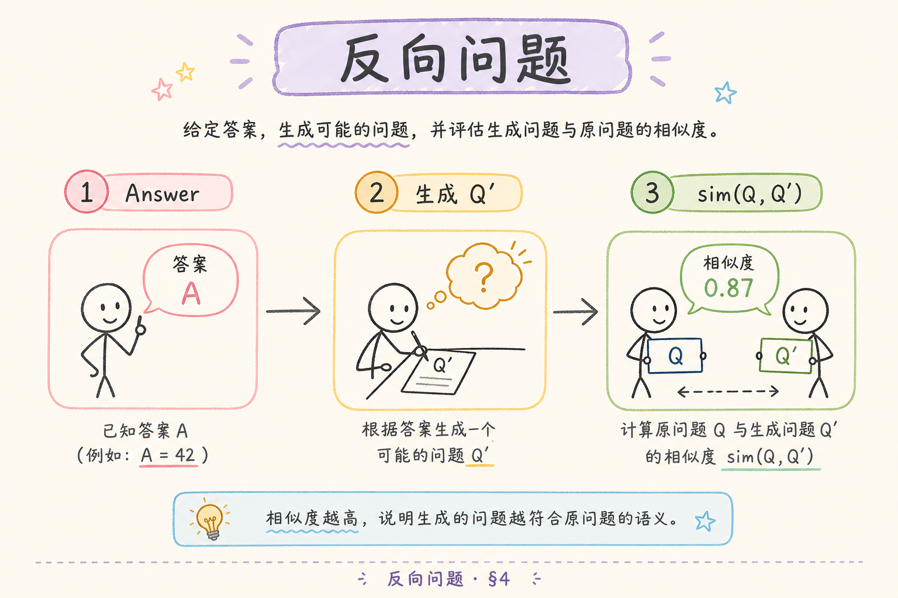
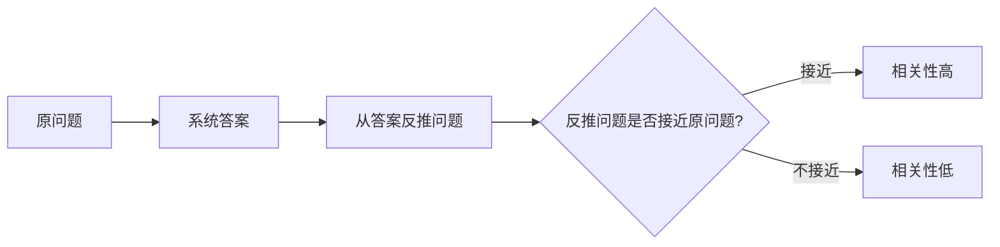
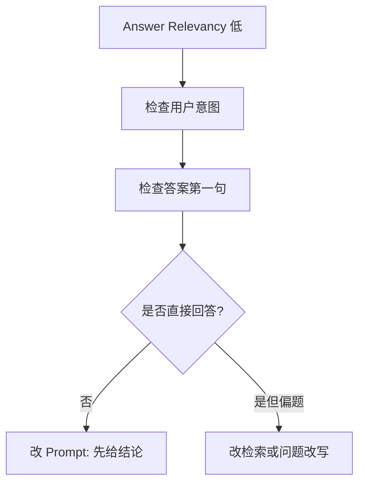

# E 评测与观测（四）：RAGAS Answer Relevancy 入门指南

有些 RAG 答案没有编造，也引用了资料，但仍然让用户不满意。原因是它没有真正回答用户的问题：用户问“上传后多久能问答”，系统回答了一大段“文件上传是什么”。**Answer Relevancy** 要衡量的就是答案是否紧扣问题。

本文面向刚开始做 RAG 评测的读者。读完后，你应该能理解 Answer Relevancy 是什么、它和 Faithfulness 的区别、如何手工判断答案是否相关，并知道如何改进“忠实但跑题”的回答。

## 目录

- [1. 为什么忠实也可能跑题](#1-为什么忠实也可能跑题)
- [2. Answer Relevancy 是什么](#2-answer-relevancy-是什么)
- [3. 它和 Faithfulness 的区别](#3-它和-faithfulness-的区别)
- [4. 手工判断相关性](#4-手工判断相关性)
- [5. RAGAS 的反向问题直觉](#5-ragas-的反向问题直觉)
- [6. 如何准备评测样本](#6-如何准备评测样本)
- [7. 如何提升 Answer Relevancy](#7-如何提升-answer-relevancy)
- [8. 常见错误](#8-常见错误)
- [9. FAQ](#9-faq)
- [10. 总结](#10-总结)

## 1. 为什么忠实也可能跑题

RAG 答案可能完全基于资料，却没有回应用户真正关心的点。例如资料里有上传、索引、状态机三块内容，用户只问“失败后怎么重试”，模型却把三块内容都总结了一遍。

这种答案不是幻觉，但用户仍然要自己从长段文字里找答案。Answer Relevancy 就是用来发现这类问题。



相关性关注的是“答没答到点上”，不是“资料有没有支持”。

## 2. Answer Relevancy 是什么

**Answer Relevancy**：衡量答案是否与用户问题相关、是否直接回应问题意图。通俗说，就是问：“用户问 A，系统有没有真的答 A？”

低相关性的常见表现：

| 表现 | 例子 |
|---|---|
| 泛泛介绍 | 问“怎么重试”，答“什么是索引任务” |
| 回答过宽 | 问一个参数，答整套架构 |
| 遗漏关键点 | 问“能不能”，只解释背景 |
| 转移主题 | 问权限，答性能优化 |

Answer Relevancy 高的答案通常短而准：先回应问题，再补必要解释。

## 3. 它和 Faithfulness 的区别

Answer Relevancy 和 Faithfulness 解决不同问题。

| 指标 | 关注点 | 低分含义 |
|---|---|---|
| Faithfulness | 答案是否被上下文支持 | 可能编造或过度推断 |
| Answer Relevancy | 答案是否回应问题 | 可能跑题或答非所问 |





一个答案可以 faithful 但不 relevant。例如它正确总结了资料，却没有回答用户问的具体问题。

## 4. 手工判断相关性

手工判断时，先把用户问题改写成“用户到底要什么”。然后看答案是否直接满足这个需求。



示例：

```text
question:
上传文件后为什么不能马上问答？

bad answer:
文件上传是 RAG 系统的重要入口，常见格式包括 PDF、Markdown 和 TXT。

better answer:
因为上传只表示文件已保存，后台还要解析、切分、向量化并写入知识库。索引完成后才可以问答。
```

坏答案没有编造，但没有解释“为什么不能马上问答”。更好的答案直接回应原因。

可以用这张表做人工检查：

| 检查项 | 问法 |
|---|---|
| 是否回应问题类型 | 用户问原因、步骤、对比还是判断？ |
| 是否先给结论 | 用户能否第一句看到答案？ |
| 是否少讲无关背景 | 有没有大段偏题介绍？ |
| 是否覆盖关键限制 | 有没有漏掉条件和边界？ |

## 5. RAGAS 的反向问题直觉

RAGAS 的 Answer Relevancy 直觉常被解释为：根据答案反推出可能的问题，再看这些反推问题和原问题是否相近。



如果一个答案能反推出的问题是“什么是文件上传”，而原问题是“为什么上传后不能马上问答”，说明答案偏离了用户意图。

## 6. 如何准备评测样本

Answer Relevancy 评测需要覆盖多种问题意图。不要只准备“介绍一下”这类宽泛问题。

| 问题类型 | 示例 |
|---|---|
| 原因 | 为什么上传后不能马上问答？ |
| 步骤 | 如何重试失败索引任务？ |
| 对比 | Access Token 和 Refresh Token 有什么区别？ |
| 判断 | 当前用户能否访问这个知识库？ |
| 限制 | 哪些文件类型不支持上传？ |

真实用户问题越具体，越能测出系统是否答到点上。

## 7. 如何提升 Answer Relevancy

相关性低不一定是模型差，常见原因是问题理解、检索上下文或 Prompt 组织不清。

| 问题来源 | 改进方式 |
|---|---|
| 多轮问题指代不清 | 做指代消解和 query enhancement |
| Context 太杂 | 提升 Context Precision |
| Prompt 没要求先答结论 | 要求先直接回答，再解释 |
| 输出太发散 | 限制结构和长度 |
| 问题类型未识别 | 在模板中区分原因、步骤、对比、判断 |



一个实用规则是：答案第一段必须回应用户问题，背景解释放后面。

## 8. 常见错误

第一个错误是用长答案掩盖跑题。长不代表相关，很多长答案只是把资料都复述了一遍。

第二个错误是只看 Faithfulness。答案完全有依据，也可能没有回应用户问题。

第三个错误是测试问题太宽。宽问题很容易得到看似相关的答案，难以暴露问题。

第四个错误是忽略用户问题类型。原因题、步骤题、对比题需要不同回答结构。

## 9. FAQ

**Q：Answer Relevancy 高就代表答案正确吗？**  
不一定。它只说明答到了问题，还要看 Faithfulness 和事实依据。

**Q：答案包含额外背景会扣分吗？**  
不一定。只要先直接回答问题，少量背景有帮助。大量无关背景会降低相关性。

**Q：如何快速人工判断？**  
遮住问题只看答案，如果你反推出的问题和原问题明显不同，相关性就有问题。

**Q：多轮对话会影响相关性吗？**  
会。没有正确理解历史上下文，答案很容易答偏。多轮场景应先做问题改写或指代消解。

## 10. 总结

Answer Relevancy 衡量答案是否真正回应用户问题。它解决的是“忠实但跑题”的问题，和 Faithfulness 互补。


初学者可以先练习识别问题意图，再检查答案第一段是否直接回应。自动评测之外，也要人工抽查具体问题类型，避免系统只会泛泛总结资料。
