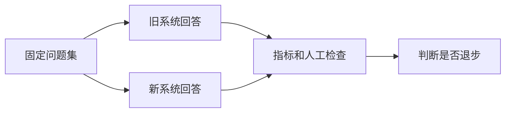
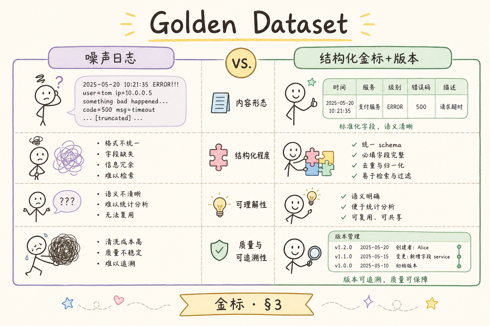
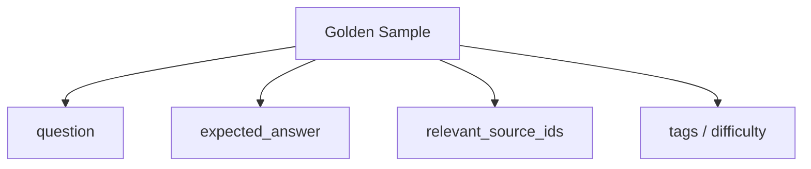
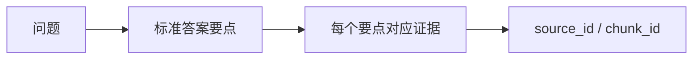
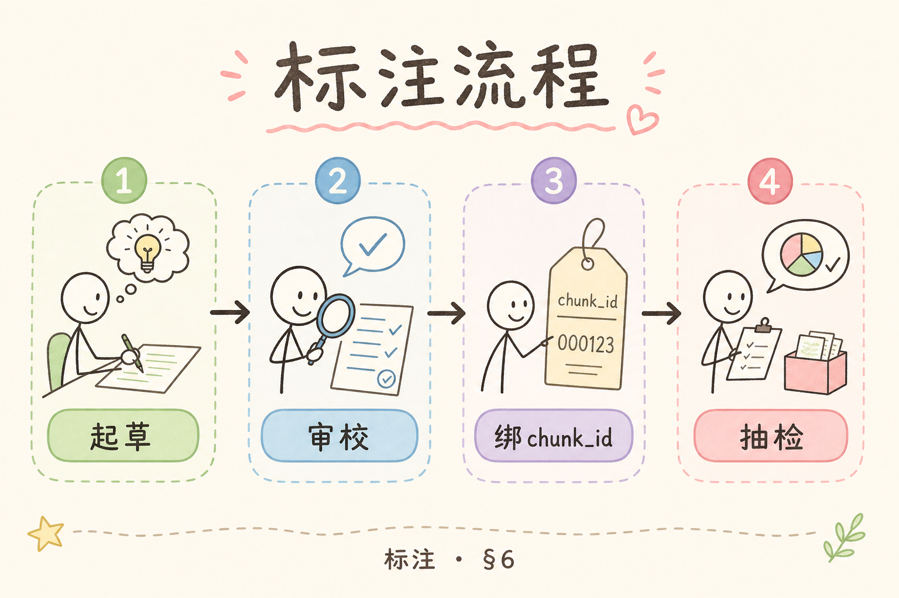
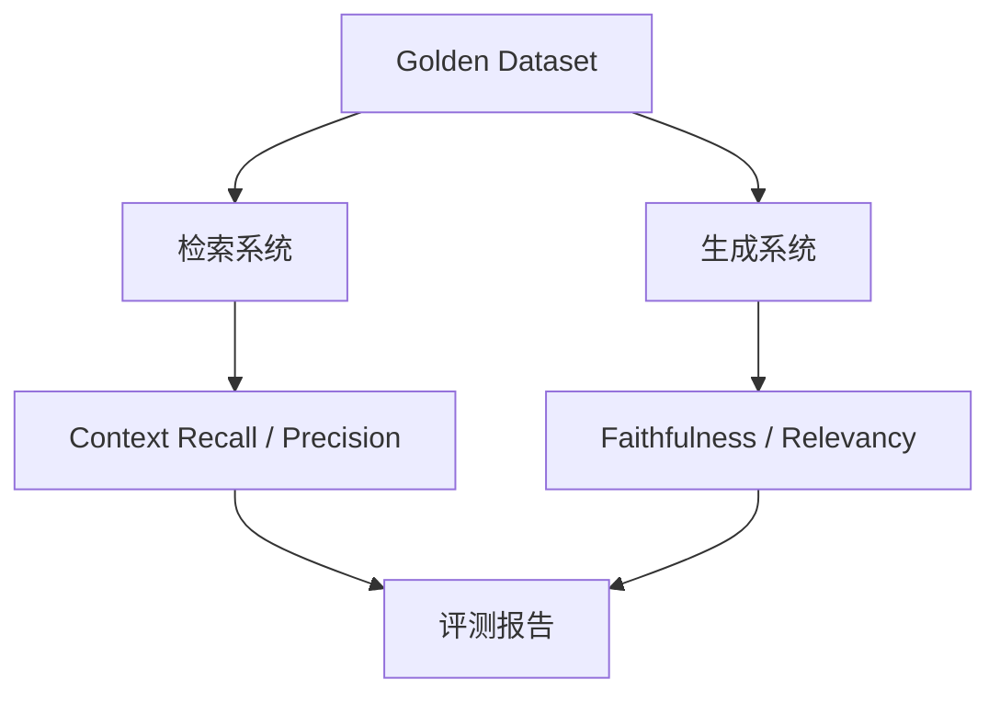
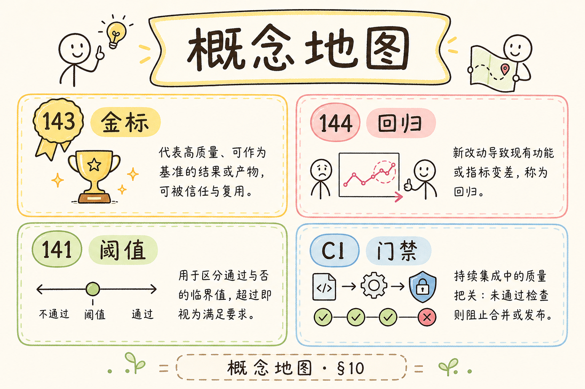

# E 评测与观测（五）：Golden Dataset 构建入门指南

没有 Golden Dataset，RAG 评测很容易变成凭感觉调参：今天觉得检索不错，明天换了 prompt 又不知道有没有退步。**Golden Dataset** 要解决的是基准问题：准备一批有标准答案、关键证据和评价规则的问题，用它反复检查系统质量。

本文面向刚开始做 RAG 评测的读者。读完后，你应该能理解 Golden Dataset 是什么、它有什么用、最小字段应该包含哪些，并能从 20 条高价值问题开始搭建自己的评测集。

## 目录

- [1. 为什么没有金标就难评测](#1-为什么没有金标就难评测)
- [2. Golden Dataset 是什么](#2-golden-dataset-是什么)
- [3. 最小字段 Schema](#3-最小字段-schema)
- [4. 冷启动：前 20 条从哪里来](#4-冷启动前-20-条从哪里来)
- [5. 如何标注标准答案和证据](#5-如何标注标准答案和证据)
- [6. 版本管理与更新](#6-版本管理与更新)
- [7. 如何接入自动评测](#7-如何接入自动评测)
- [8. 常见错误](#8-常见错误)
- [9. FAQ](#9-faq)
- [10. 总结](#10-总结)

## 1. 为什么没有金标就难评测

如果没有固定测试集，每次优化 RAG 系统都很难判断好坏。你可能只看几个临时问题，觉得答案变好了，但实际上某些关键场景已经退步。

Golden Dataset 的作用是让评测可重复。系统变了，问题集不变，就能比较检索、生成和引用是否真的改善。



这张图说明：金标数据集是对比变化的尺子。

## 2. Golden Dataset 是什么

**Golden Dataset**：一组经过人工确认的高质量评测样本。每条样本通常包含问题、标准答案、相关证据、标签和评价要求。

它不是随便收集的一堆问题，而是带有“正确依据”的测试资产。

| 内容 | 作用 |
|---|---|
| 问题 | 模拟真实用户输入 |
| 标准答案 | 说明理想回答应包含什么 |
| 证据文档 | 标注应该命中的资料 |
| 标签 | 区分权限、上传、检索、评测等主题 |
| 难度 | 区分简单、组合、多跳问题 |

有了这些字段，你才能评估 Recall、Precision、Faithfulness 和 Answer Relevancy。

## 3. 最小字段 Schema

初学阶段可以先用 JSONL 或 CSV 管理。每行一条样本。

```json
{
  "id": "gold-001",
  "question": "上传文件后为什么不能马上问答？",
  "expected_answer": "因为上传只表示文件已保存，后台还要解析、切分、向量化并写入知识库，完成后才可问答。",
  "relevant_source_ids": ["upload-001", "index-queue-002"],
  "tags": ["upload", "indexing"],
  "difficulty": "easy"
}
```

最小字段不要太多，但 `question`、`expected_answer`、`relevant_source_ids` 必须认真写。否则后面无法评估答案是否正确、证据是否找回。





## 4. 冷启动：前 20 条从哪里来

第一版不要追求大而全。先做 20 条高价值样本，覆盖最常见和最容易出错的问题。

来源可以包括：

| 来源 | 示例 |
|---|---|
| 真实客服问题 | 用户反复问的上传、权限、价格 |
| 产品关键流程 | 登录、上传、索引、问答、引用 |
| 高风险限制 | 权限边界、不可回答场景 |
| 线上失败案例 | 曾经答错或答偏的问题 |
| 专家指定问题 | 业务负责人认为必须答对的问题 |

建议分布不要全是简单事实题。至少加入一些对比题、步骤题、边界题和无法回答题。

## 5. 如何标注标准答案和证据

标准答案要写“必须包含的要点”，不要写成文学化长文。这样更利于后续判断。

示例：

| 字段 | 写法 |
|---|---|
| question | “上传后为什么不能马上问答？” |
| expected_answer | “上传只保存文件；还需后台索引；ready 后才能问答。” |
| relevant_source_ids | `upload-api.md#status`, `index-worker.md#pipeline` |

证据标注要具体到片段 ID 或文档锚点。只写“上传文档”太粗，后续很难判断检索是否命中正确位置。



如果一个问题没有明确证据，先不要放进金标集。

## 6. 版本管理与更新

Golden Dataset 是会变化的。产品文档更新、业务规则变化、用户问题变化时，金标也要更新。



| 版本动作 | 说明 |
|---|---|
| 新增样本 | 新场景或线上失败案例 |
| 修改答案 | 业务规则变化 |
| 废弃样本 | 问题不再有效 |
| 调整证据 | 文档重构或 chunk 变化 |

建议每条样本保留 `version` 或在文件层管理版本。评测报告也要记录使用的是哪个 dataset 版本。

## 7. 如何接入自动评测

Golden Dataset 可以驱动多种评测：检索评测、生成评测和端到端回归。



一个实用流程是：先用 `relevant_source_ids` 检查检索是否命中，再用 `expected_answer` 和 contexts 检查回答质量。

自动评测不能替代人工，但能稳定发现明显回归。

## 8. 常见错误

第一个错误是只存问题，不存标准答案和证据。这样只能做演示，不能做评测。

第二个错误是样本太简单。全是“什么是 X”会让系统分数虚高，无法覆盖真实风险。

第三个错误是长期不更新。业务规则变了，旧金标就可能误导评测。

第四个错误是把金标写得过于口语化。标准答案应强调要点和证据，而不是追求表达风格。

## 9. FAQ

**Q：第一版需要多少条？**  
20 条就可以开始。关键是质量高、覆盖核心风险。后续再逐步扩展到 50、100 条。

**Q：Golden Dataset 能自动生成吗？**  
可以辅助生成，但关键样本需要人工确认问题、答案和证据。

**Q：标准答案必须唯一吗？**  
不必逐字唯一，但关键要点必须明确。可以写成要点列表。

**Q：线上问题都要放进去吗？**  
不需要。优先放高频、高风险、曾经失败且有代表性的问题。

## 10. 总结

Golden Dataset 是 RAG 评测的基准资产。它让系统改动有可重复的检查标准，而不是靠临时问题和主观感觉判断。



初学者先做 20 条高价值样本，每条包含问题、标准答案要点和相关证据 ID。把这套小集合跑稳定，再逐步扩展评测覆盖面。
