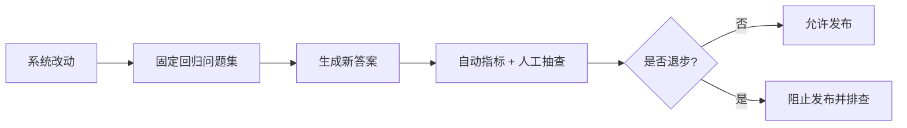
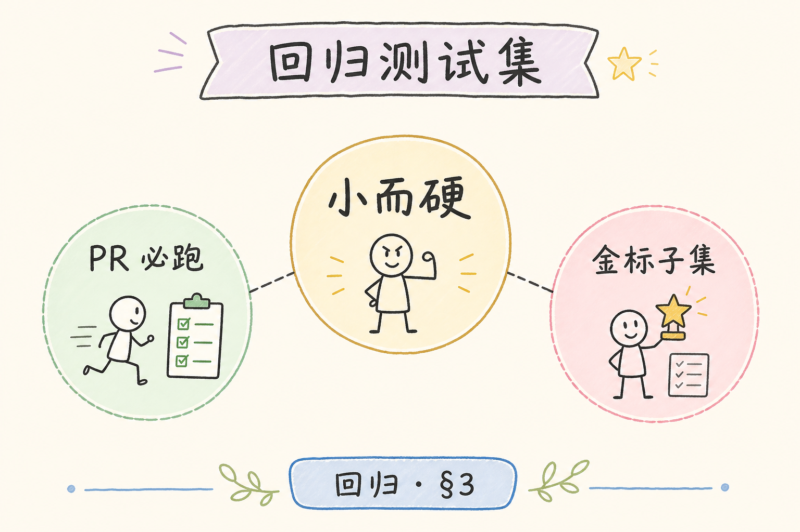
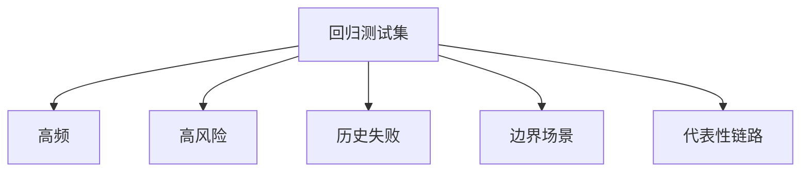
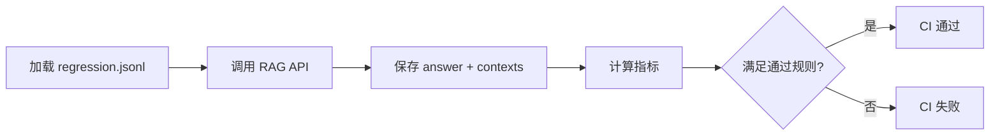
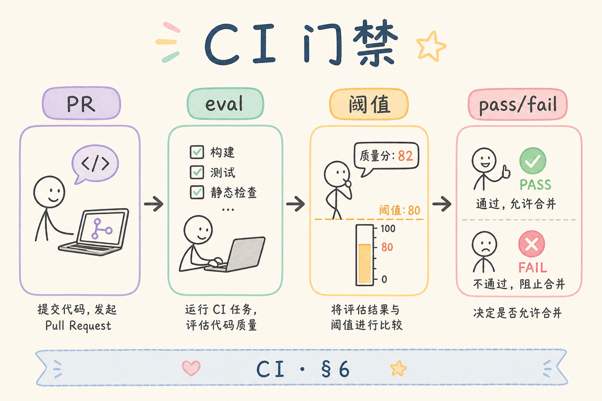

# E 评测与观测（六）：回归测试集维护入门指南

RAG 系统会不断变化：文档更新、切分参数调整、Prompt 改写、模型替换、检索策略升级。每次改动都可能让某些旧问题退步。**回归测试集**要解决的是发布前确认：以前必须答对的问题，现在还答得对吗？

本文面向刚开始把 RAG 评测工程化的读者。读完后，你应该能理解回归测试集和 Golden Dataset 的关系，知道应该覆盖哪些样本，如何设置阈值和处理不稳定用例，并能设计一个最小 CI 门禁流程。

## 目录

- [1. 为什么 RAG 需要回归测试](#1-为什么-rag-需要回归测试)
- [2. 回归测试集是什么](#2-回归测试集是什么)
- [3. 应该覆盖哪些样本](#3-应该覆盖哪些样本)
- [4. 阈值与通过规则](#4-阈值与通过规则)
- [5. 最小 CI 流程](#5-最小-ci-流程)
- [6. 如何处理 Flaky 用例](#6-如何处理-flaky-用例)
- [7. 维护节奏](#7-维护节奏)
- [8. 常见错误](#8-常见错误)
- [9. FAQ](#9-faq)
- [10. 总结](#10-总结)

## 1. 为什么 RAG 需要回归测试

普通后端改动可以靠单元测试检查输入输出。RAG 系统更复杂：同一个问题的答案可能因检索、模型、Prompt 或文档变化而波动。没有回归测试，团队很难知道一次“优化”有没有破坏旧能力。

例如你为了提高 Recall 调大 top_k，结果引入大量噪声，Faithfulness 下降。回归测试可以在发布前发现这类退步。

回归测试的核心是“固定集合反复跑”。

## 2. 回归测试集是什么

**回归测试集**：用于持续检查系统是否退步的一组样本。它可以来自 Golden Dataset，但更强调发布门禁和长期维护。

| 数据集 | 重点 |
|---|---|
| Golden Dataset | 定义标准答案和证据 |
| 回归测试集 | 反复运行，检测改动是否破坏旧能力 |

回归集不一定包含所有金标样本。它应该优先包含核心路径、高风险问题、历史失败案例和业务必须答对的问题。

## 3. 应该覆盖哪些样本

一个实用回归集至少覆盖五类问题。

| 类型 | 示例 |
|---|---|
| 高频问题 | 用户最常问的上传、权限、状态 |
| 高风险问题 | 涉及价格、权限、安全、合规 |
| 历史失败问题 | 曾经答错、漏检、引用错 |
| 边界问题 | 资料不足、无权限、冲突资料 |
| 代表性链路 | 检索、重排、引用、拒答 |

不要让回归集只包含容易题。容易题只能证明系统还活着，不能证明系统质量稳定。

如果线上出现一次严重错误，修复后应把对应样本加入回归集。

## 4. 阈值与通过规则

回归测试需要明确“什么算通过”。不要只输出一堆分数。

| 指标 | 示例规则 |
|---|---|
| Context Recall | 核心问题必须命中至少一个金标 source_id |
| Faithfulness | 平均分不低于 0.8 |
| Answer Relevancy | 低于阈值的样本不得超过 5% |
| 安全拒答 | 无权限问题必须拒答 |
| 引用合法性 | 引用 ID 必须来自本次 context |

阈值要从业务风险出发。权限、安全、价格类问题可以更严格；普通解释类问题可以允许人工复核。

## 5. 最小 CI 流程

一个最小 CI 门禁可以分为四步：准备问题、跑系统、计算指标、判断通过。

初期可以只在发布前手动跑，稳定后再接入 CI。不要一开始就追求全自动复杂平台，先保证结果可重复、可排查。

## 6. 如何处理 Flaky 用例

**Flaky 用例**是指结果不稳定的测试样本：同样系统、同样问题，多次运行分数忽高忽低。LLM 评测里这很常见。

处理方式：

| 原因 | 处理 |
|---|---|
| 问题太模糊 | 改写问题，明确目标 |
| 标准答案不清 | 补充关键要点 |
| 评测模型波动 | 固定评测模型和参数 |
| 检索结果不稳定 | 固定索引版本或检查排序 |
| 样本本身争议大 | 从门禁集移到观察集 |

不要简单删除所有失败样本。先判断失败是系统问题、评测问题还是样本定义问题。

## 7. 维护节奏

回归测试集需要持续维护，否则会过期。

建议节奏：

| 时间 | 动作 |
|---|---|
| 每次线上事故后 | 加入对应问题 |
| 每次文档大改后 | 更新相关 source_id |
| 每周或每两周 | 抽查失败和边界样本 |
| 每次大版本发布前 | 跑完整回归集 |

回归集越大，运行成本越高。可以分层：PR 跑小集，发布前跑中集，夜间跑全量。

## 8. 常见错误

第一个错误是回归集经常换。集合一直变，就无法判断系统是否真的退步。

第二个错误是只看平均分。平均分可能掩盖高风险问题失败。关键样本应有硬性规则。

第三个错误是没有保存失败上下文。只知道某条失败，不知道当时检索了什么，就无法排查。

第四个错误是把所有 Flaky 都当系统问题。评测样本和评测模型本身也可能不稳定。

## 9. FAQ

**Q：回归集和金标集要分开吗？**  
可以重叠。金标集是标准资产，回归集是其中更适合反复跑门禁的一部分。

**Q：回归测试集多大合适？**  
初期 20 到 50 条即可。成熟后可以分层扩展，但要控制运行成本。

**Q：CI 失败一定不能发布吗？**  
高风险样本失败应阻止发布。低风险波动可以人工确认，但要记录决策。

**Q：模型输出每次不同怎么办？**  
尽量固定参数，保存上下文和回答。对关键场景使用更稳定的评测规则和人工抽查。

## 10. 总结

回归测试集让 RAG 系统在持续变化中保持底线。它回答的是“以前必须做对的事情，现在还对吗”。

初学者可以从 Golden Dataset 中挑出 20 条关键样本，设定清晰通过规则，保存每次回答和上下文。先形成发布前必跑的流程，再逐步接入 CI 和分层门禁。
