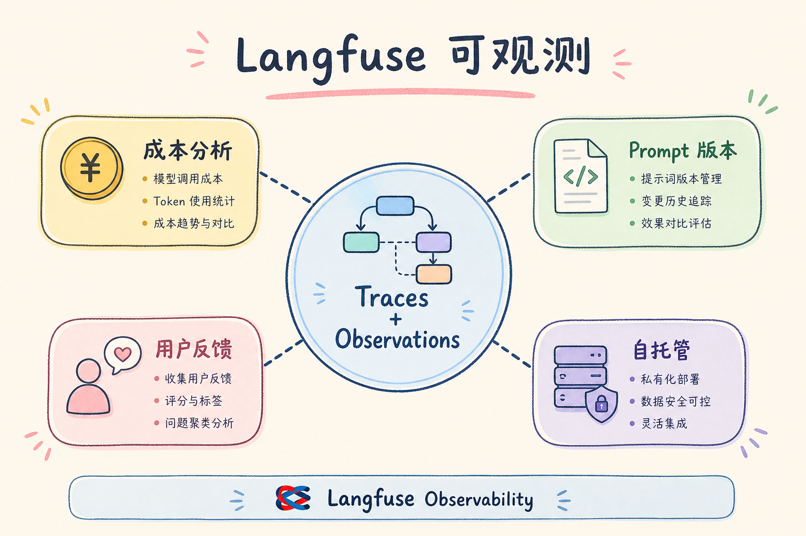
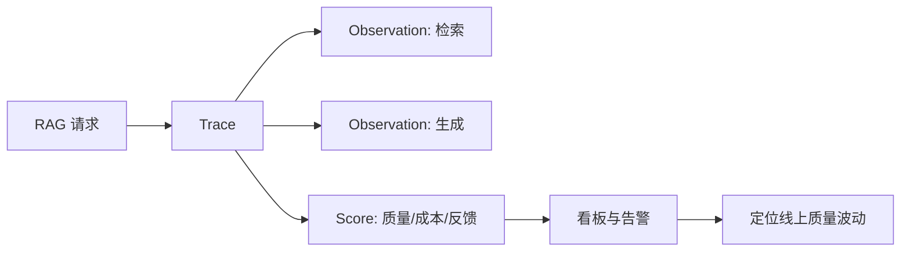
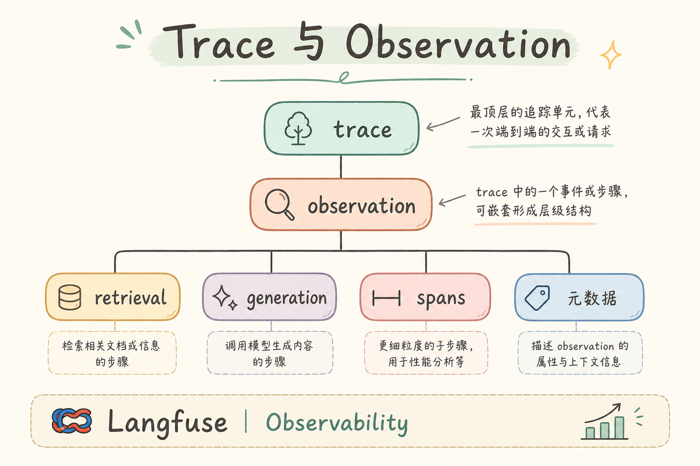
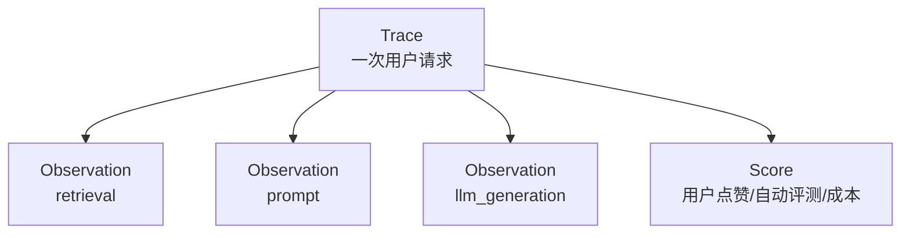
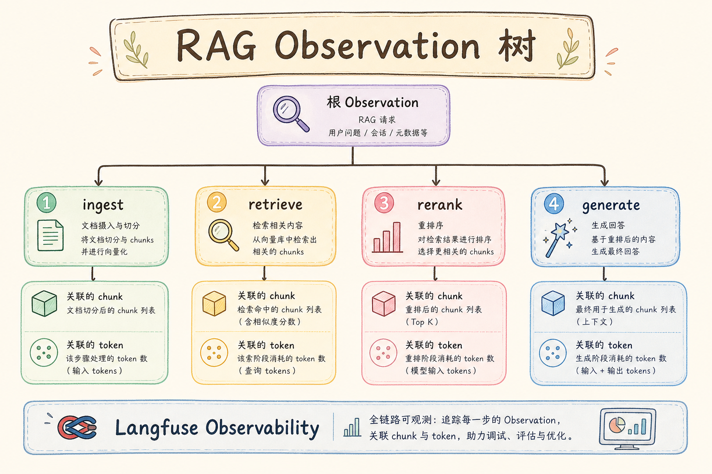
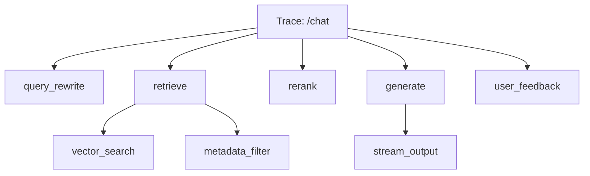
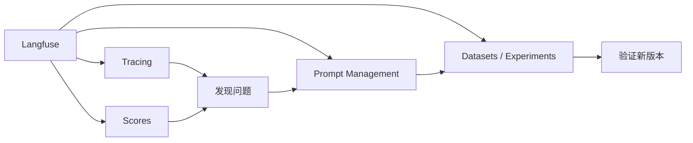

# E 评测与观测（十）：Langfuse 可观测性完全指南

> [147 LangSmith](147.langsmith-tracing-tutorial.md) 把 LangChain 链接上 trace 很快，但团队若 **自研 Pipeline**（[135 自研 vs 框架](135.pipeline-vs-framework-tutorial.md)）、要 **数据留在内网**、或 **前端也要看成本看板**，常会看 **Langfuse**——开源 LLM 工程平台，支持 **Trace、Session、Score、Prompt 版本**，可 **自托管**。这篇是 [企业 RAG 路线图](ENTERPRISE_RAG_ROADMAP.md) **E 模块主线篇**（路线图第 **165** 条）。前置：[147 LangSmith](147.langsmith-tracing-tutorial.md)（对照阅读）；与 149～152 bad case 系列 **共用 trace 字段契约**。

---

## 目录

1. [前言：观测平台要解决的四件事](#1-前言观测平台要解决的四件事)
2. [本文边界与动手路径](#2-本文边界与动手路径)
3. [Langfuse 是什么](#3-langfuse-是什么)
4. [核心概念：Trace、Observation、Score](#4-核心概念traceobservationscore)
5. [部署：云托管 vs Docker 自托管](#5-部署云托管-vs-docker-自托管)
6. [Python SDK 接入 RAG](#6-python-sdk-接入-rag)
7. [记录检索与生成：Observation 树](#7-记录检索与生成observation-树)
8. [打分与用户反馈](#8-打分与用户反馈)
9. [Prompt 管理与版本](#9-prompt-管理与版本)
10. [先错对对：五种典型翻车](#10-先错对对五种典型翻车)
11. [与 LangSmith、自建 ELK 对照](#11-与-langsmith自建-elk-对照)
12. [综合概念地图](#12-综合概念地图)
13. [常见陷阱与 FAQ](#13-常见陷阱与-faq)
14. [总结与系列下一步](#14-总结与系列下一步)

---

## 1. 前言：观测平台要解决的四件事

RAG 上线后，负责人至少每周要答：

1. **慢在哪**——检索还是生成？  
2. **错在哪**——解析、切块、检索、胡编？  
3. **花多少**——token 与 embedding 成本？  
4. **哪版配置**——chunk、top_k、reranker 是哪个 [171 参数版本](154.param-version-management-tutorial.md)？

Langfuse 用 **统一数据模型** 收这四类问题，并开放 API 给 [170 A/B](153.ab-experiment-rag-tutorial.md) 与看板。

**Langfuse**：开源 LLM 应用观测与评测平台，记录 trace、支持人工/自动评分、Prompt 版本管理，提供 Cloud 与自托管。  
通俗说：**自带仓库的 RAG 飞行记录仪 + 记分牌**。

**读完本文，你应该能做到：**

1. 说明 Langfuse 与 LangSmith 的 **选型差异**。  
2. Docker 起本地 Langfuse 并收到第一条 trace。  
3. 用 Python SDK 记录 **retrieve → generate** 两层 observation。  
4. 为 bad case 写 **Score** 并关联 `trace_id`。  
5. 把 `param_version` 写入 trace metadata。

---

## 2. 本文边界与动手路径

**档位：E 主线篇（165）。**

**本文讲：** 概念、部署、SDK、RAG 埋点、打分、Prompt 版本、与 bad case 衔接。  
**本文不讲：** K8s 高可用全套、替换 Grafana 基础设施、Langfuse 源码贡献指南。

### 2.1 动手路径

| 步骤 | 验收 |
|------|------|
| A | `docker compose up` 或注册 Cloud | UI 可访问 |
| B | 创建 project，拿 public/secret key | SDK 连通 |
| C | §6 最小 RAG 埋点 | UI 见 trace 树 |
| D | 为一条 trace 打 Score | 看板可见 |
| E | metadata 写 `param_version` | 可按版本筛选 |

---

## 3. Langfuse 是什么

读下图时，先看「Langfuse 观测是什么」想表达的主线：它把本节的概念关系压缩成一张可对照的图。



下面这张图说明 Langfuse 在生产 RAG 中的职责。读图时重点看：它把请求、检索、生成、评分和用户反馈放到同一个观测面板里。



结论：Langfuse 解决的是“线上发生了什么”。它让质量、成本、延迟和用户反馈能被持续观察。

| 模块 | 作用 |
|------|------|
| Tracing | 嵌套 observation 树 |
| Sessions | 多轮对话聚合（对接 [118 历史](118.multi-turn-history-tutorial.md)） |
| Scores | 人工 👍👎 或 API 自动分 |
| Prompts | 提示词版本与 A/B |
| Dashboard | 延迟、成本、分数趋势 |

### 3.1 为什么主线要会 Langfuse

- **自托管**：金融、政务常见 **数据不出 VPC**；  
- **框架无关**：自研 [138 配置管道](138.config-driven-pipeline-tutorial.md) 也能埋点；  
- **开源**：可审计数据存哪、保留多久。

---

## 4. 核心概念：Trace、Observation、Score

读下图时，先看「Trace Observation Score」想表达的主线：它把本节的概念关系压缩成一张可对照的图。



下面这张图解释 Langfuse 的三层对象。读图时重点看：Trace 是整次请求，Observation 是中间步骤，Score 是评价结果。



初学者可以把 Trace 看作一次订单，Observation 是订单里的每个工序，Score 是最后的质检记录。

- **Trace**：一次 `ask` 端到端，含 `id`、`session_id`、`metadata`。  
- **Observation**：树节点，`type` 可为 `SPAN`、`GENERATION`、`RETRIEVER` 等；记录 `input`、`output`、`usage`、`latency`。  
- **Score**：事后贴到 trace 上的数或布尔，如 `faithfulness=0.2`、`user_thumbs_down=true`。

**与 [147 LangSmith](147.langsmith-tracing-tutorial.md)**：Trace≈Trace，Observation≈Run/Span，Score≈Feedback/Annotation。

---

## 5. 部署：云托管 vs Docker 自托管
观测平台的部署方式会影响成本、数据边界和维护工作量。云托管上手快，适合 PoC 和小团队；Docker 自托管更可控，但要自己负责存储、升级、备份和权限。

### 5.1 Langfuse Cloud

最快上手：注册 → 创建 project → SDK 指向 `https://cloud.langfuse.com`。

### 5.2 自托管 Docker Compose

官方提供 `docker-compose.yml`：Postgres + ClickHouse（版本以官方为准）+ Web。  
**验收**：内网 `http://langfuse.internal` 能登录；**备份 Postgres** 即备份 trace 元数据。

### 5.3 环境隔离

`dev` / `staging` / `prod` **分 project**；生产 Key **仅后端** 持有，前端用 **session 级只读** 若需嵌入组件。

---

## 6. Python SDK 接入 RAG

```python
from langfuse import Langfuse
from langfuse.decorators import langfuse_context, observe

lf = Langfuse()

@observe()
def retrieve(query: str, top_k: int = 5):
  # 内部：向量 + BM25，见 [93 混合检索](93.hybrid-search-tutorial.md)
  docs = hybrid_search(query, top_k)
  langfuse_context.update_current_observation(
      output={"chunk_ids": [d["chunk_id"] for d in docs]},
      metadata={"top_k": top_k},
  )
  return docs

@observe()
def rag_answer(query: str, param_version: str):
  langfuse_context.update_current_trace(metadata={"param_version": param_version})
  docs = retrieve(query)
  context = "\n\n".join(d["text"] for d in docs)
  answer = llm.generate(context, query)  # [110 Prompt](110.rag-prompt-template-tutorial.md)
  return answer

# 调用
rag_answer("年假几天？", param_version="pv-2025-07-01")
lf.flush()  # 短脚本确保发送
```

**验收**：UI 中 trace 展开 **retrieve 子节点 + 根 generation**。

---

## 7. 记录检索与生成：Observation 树

读下图时，先看「RAG Observation 树」想表达的主线：它把本节的概念关系压缩成一张可对照的图。



下面这张图展示一棵建议记录的 RAG Observation 树。读图时重点看：检索和生成要分开记，否则 bad case 很难归因。



这样记录后，质量下降时可以快速判断是改写错、过滤错、召回差、排序差，还是生成不忠实。

对照上图可以得出一个实用结论：先确认「RAG Observation 树」里的主流程，再去调整具体参数或实现细节。

### 7.1 检索节点必记字段

检索节点的核心目标是让你能复盘“系统到底拿了哪些证据”。字段不用一开始很多，但下面这几项缺了就很难排障。

| 字段 | 用途 |
|------|------|
| `query` | 实际检索式（改写后见 [100 Query Rewriting](100.query-rewriting-tutorial.md)） |
| `chunk_id` / `doc_id` | 对齐 [51](51.metadata-chunk-id-tutorial.md)、[50](50.metadata-doc-id-tutorial.md) |
| `score` | _dense / _sparse / fused |
| `preview` | 前 200 字（全文按需拉） |

### 7.2 生成节点必记字段

生成节点要回答“模型基于什么生成、花了多少成本、有没有被版本影响”。这些字段能把答案质量、延迟和成本放到同一条 trace 里看。

| 字段 | 用途 |
|------|------|
| `model` | 路由见 [168 多模型](168.multi-model-routing-tutorial.md) |
| `prompt_name` + `version` | 对接 §9 |
| `usage` | input/output tokens |

### 7.3 对接 Bad Case 归因

| Observation 异常 | 读 |
|------------------|-----|
| retrieve 空 | [151](151.bad-case-retrieval-miss-tutorial.md) |
| retrieve 文乱 | [149 解析](149.bad-case-parsing-tutorial.md) |
| retrieve 断句 | [150 切块](150.bad-case-chunking-tutorial.md) |
| 生成与 context 不符 | [152 胡编](152.bad-case-hallucination-tutorial.md) |

---

## 8. 打分与用户反馈

```python
lf.score(
    trace_id=trace_id,
    name="user_feedback",
    value=0,  # 点踩
    comment="说年假20天，手册10天",
)
```

产品 **点踩** 应 **必写 trace_id**（[116 SSE](116.sse-rag-streaming-tutorial.md) `done` 事件带回）。算法每周拉 **低分 trace** 过 149～152 决策树。

自动分：可调用 [141 Faithfulness](141.ragas-faithfulness-tutorial.md) 评判后 `lf.score(name="faithfulness", value=0.3)`。

---

## 9. Prompt 管理与版本

Langfuse **Prompts** 存 `name`、`version`、`labels`（如 `production`）。RAG 系统 prompt（[110 篇](110.rag-prompt-template-tutorial.md)）变更时：

1. 新版本 `v3` 创建；  
2. `production` 标签指向 `v3`；  
3. trace metadata 记 `prompt_version=v3`；  
4. 与 [171 参数版本](154.param-version-management-tutorial.md) **同一变更单**。

---

## 10. 先错对对：五种典型翻车
下面的错法适合当排障清单看：它们不是语法问题，而是会让评估、追踪或坏例分析失去证据链，最后只能靠猜测定位问题。

### 10.1 错：只 trace LLM 不 trace 检索

**对**：RAG **检索必须是子 observation**。

### 10.2 错：flush 前进程退出

**对**：脚本末尾 `lf.flush()`；服务用 **批量发送** SDK 配置。

### 10.3 错：全量存 chunk 全文导致存储爆炸

**对**：preview + `chunk_id` 回源（向量库/对象存储）。

### 10.4 错：Score 无命名规范

**对**：`user_feedback` / `faithfulness` / `context_recall` 统一枚举。

### 10.5 错：自托管不备份

**对**：Postgres 定时快照；trace 也是 **资产**。

---

## 11. 与 LangSmith、自建 ELK 对照

| 能力 | LangSmith | Langfuse | 自建 ELK |
|------|-----------|----------|----------|
| LangChain 一键 | 强 | 中 | 弱 |
| 自托管 | 弱 | 强 | 强 |
| LLM 语义字段 | 强 | 强 | 需自建 |
| 上手速度 | 快 | 中 | 慢 |

**结论**：LangChain 深度 → 先 [147](147.langsmith-tracing-tutorial.md)；要自托管/多框架 → 本篇；已有成熟 OTel → 可 **Langfuse 作 LLM 专用层**。

---

## 12. 综合概念地图

读下图时，先看「Langfuse 概念地图」想表达的主线：它把本节的概念关系压缩成一张可对照的图。


下面这张概念地图把 Langfuse 的主要能力串起来。读图时重点看：观测、评分、Prompt 版本和实验是同一条质量闭环。



结论：Langfuse 不只是“看日志”，更适合作为生产 RAG 的持续改进工作台。

---


## 13. 常见陷阱与 FAQ
最后用 FAQ 把观测和评估拉回日常使用。真正要检查的是：一次回答能不能被追踪、能不能被打分、能不能定位到具体失败环节。

### 13.1 初学者最常踩的三坑

下面三坑都和“有没有把链路记录下来”有关。初学者可以先把它们当成上线前检查清单，而不是等事故发生后再补观测。

1. **只看最终答案，不看链路**——Langfuse 的价值在 **可复现的中间态**。  
2. **没有金标就调参**——没有 [160 Golden Dataset](143.golden-dataset-tutorial.md) 时，A/B 只是 **主观吵架**。  
3. **工具买了不用**——装了 LangSmith/Langfuse 却不给每次请求打 `trace_id`，等于 **黑盒上线**。

### 13.2 FAQ 精选

**Q1：PoC 阶段要不要上观测？**  
要。**最小集**：`request_id` + 检索 Top-5 `chunk_id` + 模型名 + 延迟。完整平台可后补，但 **字段契约** 第一天就定。

**Q2：和 RAGAS 指标怎么配合？**  
RAGAS 回答 **「好不好」**；观测平台回答 **「哪一步坏了」**。建议：金标跑 RAGAS 批次，线上 bad case 用 trace 下钻。

**Q3：成本会不会爆？**  
Trace 存全文 context 很贵。生产用 **采样**（如 5%）+ **摘要字段**（chunk_id、score、前 200 字预览），全文按需拉取。

**Q4：多环境怎么隔离？**  
`project` / `environment` 标签：`dev` / `staging` / `prod` 分开；**禁止** 把 prod trace 当训练数据未经脱敏。

**Q5：谁负责看板？**  
工程搭管道，**产品 + 领域专家** 每周过 bad case；研发负责 **归因到模块**（解析/切块/检索/生成）。

**Q6：失败请求要不要记 trace？**  
**更要记**。超时、空检索、解析异常——没有失败 trace，你永远在猜。

**Q7：和 [147 LangSmith](147.langsmith-tracing-tutorial.md) / [148 Langfuse](148.langfuse-observability-tutorial.md) 二选一？**  
LangChain 深度用 LangSmith 顺手；要 **自托管、开源、多框架** 看 Langfuse。也可 **双写** 过渡期，但统一 `trace_id`。

**Q8：如何证明一次修复有效？**  
回归集 [161](144.regression-test-set-tutorial.md) 上 **同题同参** 对比；再看线上 **7 日 bad case 率**。

**Q9：实习生能维护吗？**  
把 **归因决策树** 贴在 wiki（本篇系列 149～152）；观测 UI 只读权限给全员，写权限限研发。

**Q10：面试怎么讲？**  
30 秒：**「RAG 上线后我用 trace 把 bad case 分到 ingest/retrieve/generate，用金标 + A/B 验证改动，参数版本可回滚。」**

## 14. 总结与系列下一步

1. **Langfuse = 开源可自托管的 RAG 观测主线**。  
2. **Observation 树** 必须含检索层。  
3. **Score + metadata** 连接 bad case 与 [171 参数版本](154.param-version-management-tutorial.md)。  
4. 与 [147 LangSmith](147.langsmith-tracing-tutorial.md) **互补而非互斥**。  
5. 149～152 是读完 trace 后的 **归因手册**。

| 目标 | 阅读 |
|------|------|
| Bad Case：解析 | [149 篇](149.bad-case-parsing-tutorial.md) |
| Bad Case：检索 | [151 篇](151.bad-case-retrieval-miss-tutorial.md) |
| A/B 实验 | [153 篇](153.ab-experiment-rag-tutorial.md) |

---

*系列：E 评测与观测 · 路线图第 165 条 · 主线篇*


### 14.1 Langfuse 深度补充：成本与多租户

**成本看板**：按 `model`、`param_version` 聚合 `usage.total_tokens`；与 [209 Embedding 成本](ENTERPRISE_RAG_ROADMAP.md) 对账。**多租户**：`metadata.tenant_id`（[166 租户](166.tenant-isolation-backend-tutorial.md)）过滤 trace；Score 也带 tenant，防 A 租户点踩污染 B 租户分析。

**Session 分析**：多轮 [118 历史](118.multi-turn-history-tutorial.md) 用 `session_id` 串 trace；第二轮检索 miss 常因 **未做 [109 对话增强](109.conversation-query-enhancement-tutorial.md)**——在 Session 视图一眼可见。

**自托管运维**：ClickHouse 磁盘监控；超过 90 天 trace **冷归档 S3**，保留 `trace_id` + 低分 Score 索引。


## 15. Langfuse 自托管与埋点

Langfuse 适合 **数据不出内网** 与 **多框架并存**。Docker Compose 起服务后，第一件事是配 Postgres 备份，第二件事是建 dev/staging/prod 三个 project。

RAG 埋点铁律：**retrieve 必须是子 observation**，记录 query、chunk_id、score、preview；generate 记录 model、prompt_version、token。根 trace 写 param_version、experiment_id、tenant_id（多租户见路线图 183）。

用户点踩调用 `score(name=user_feedback, value=0)`，comment 写用户原话。算法每周拉低分 trace 走 149～152 决策树。自动 Faithfulness 可批写 score，与 [141 RAGAS](141.ragas-faithfulness-tutorial.md) 同向。

Prompt 版本在 Langfuse 管理时，变更必须同步 [171 manifest](154.param-version-management-tutorial.md)。生产标签 `production` 只指向经过回归的 version。

与 [147 LangSmith](147.langsmith-tracing-tutorial.md) 可双写两周再切流。成本看板按 model、param_version 聚合 token，防止「Faithfulness 升了但账单翻倍」无察觉。


## 16. 练习与自检

动手一：Docker 起 Langfuse，SDK 发一条含 retrieve 子节点的 trace。动手二：打 user_feedback Score。动手三：按 param_version 筛选。

自检：Observation 与 Run 对应关系？retrieve 必记字段？自托管备份策略？

误区：只 trace LLM；flush 遗漏；Score 命名混乱；prompt 变更不记版本。

与 [147](147.langsmith-tracing-tutorial.md) 对照表能口述。bad case 用 Score 聚类后走 149～152。

## 17. 从零到一的 Langfuse 周计划

**周一**：Cloud 或 Docker 起服务，创建 project，SDK 发 ping trace。**周二**：RAG 两层 observe：retrieve + generate。**周三**：Score 接口接用户点踩。**周四**：Prompt 建 rag_system v1，打 production 标签。**周五**：按 param_version 筛 trace，写周报。

自托管常见坑：磁盘满、未 backup Postgres、升级未读 release note。运维要把 Langfuse 当 **小型数据库应用** 对待，不是「扔个容器不管」。

多框架埋点：自研 [138 管道](138.config-driven-pipeline-tutorial.md) 用 @observe 即可，不必强行 LangChain。关键是 **树形结构** 与 **字段命名** 统一，便于日后迁平台。

Session 视角：多轮对话把同一 session_id 的 trace 串起来，看第二轮是否因 **未改写 query** 导致 [151 检索遗漏](151.bad-case-retrieval-miss-tutorial.md)。这在客服场景极高频。

成本：Dashboard 按周看 token，与财务估算 [209 Embedding 成本](ENTERPRISE_RAG_ROADMAP.md) 对账。Faithfulness 提升若以 **十倍 token** 为代价，产品可能不买单——护栏指标不是摆设。

与 bad case 四篇：Score 聚类后，解析类问题常伴随 **retrieve 文乱**；切块类 **命中但断句**；检索类 **gold 探针失败**；胡编类 **prompt 含 gold 仍矛盾**。Langfuse 是 **入口**，决策树是 **手册**。

验收：能在 UI 找到一条 trace，展开 retrieve 子节点，读出 chunk_id 与 score，并打出 user_feedback。全团队达到此水平，E 模块观测才算落地。

## 18. 综合案例：Score 驱动迭代

**背景**：一周 user_feedback 点踩 42 条，faithfulness 自动评均值 0.62。**按 param_version 筛**：pv-2025-06 点踩率 8%，pv-2025-07-hybrid 点踩率 4%。**结论**：[170 hybrid 实验](153.ab-experiment-rag-tutorial.md) 有效，升 production 指针 [171](154.param-version-management-tutorial.md)。

**反例**：faithfulness 低但点踩少，可能是 **问题太难用户未察觉**，需 [160 金标](143.golden-dataset-tutorial.md) 补难例。

Langfuse Session 发现：多轮第二轮起 miss 激增，补 [109 对话增强](109.conversation-query-enhancement-tutorial.md)。

自托管磁盘告警案例：未归档三月，ClickHouse 满导致丢 trace——运维纳入 [207 结构化日志](ENTERPRISE_RAG_ROADMAP.md) 同级重视。

## 20. E 模块联动与职业素养

企业 RAG 的成熟度不靠「是否用上向量库」，而靠 **能否把一次用户差评还原成可复现链路**。Langfuse 观测与 Score 是其中一环。你必须熟悉：**金标** [160](143.golden-dataset-tutorial.md)、**回归** [161](144.regression-test-set-tutorial.md)、**RAGAS** [156～159](139.ragas-context-precision-tutorial.md)、**观测** [164 LangSmith](147.langsmith-tracing-tutorial.md) / [165 Langfuse](148.langfuse-observability-tutorial.md)、**归因四步** [166～169](149.bad-case-parsing-tutorial.md)、**实验** [170](153.ab-experiment-rag-tutorial.md)、**版本** [171](154.param-version-management-tutorial.md)。

**ingest 段** 回到 C1：[36 PDF](36.pdf-text-extraction-tutorial.md) 到 [56 多模态](56.multimodal-image-text-tutorial.md)。**chunk 段** 回到 C2：[57](57.fixed-size-chunking-tutorial.md) 到 [65 Parent](65.parent-document-retriever-tutorial.md)。**检索段** 回到 [91 Dense](91.dense-retrieval-tutorial.md)、[92 Sparse](92.sparse-retrieval-rag-tutorial.md)、[93 Hybrid](93.hybrid-search-tutorial.md)、[100 改写](100.query-rewriting-tutorial.md)。**生成段** 回到 [33 幻觉](33.llm-hallucination-tutorial.md)、[110 Prompt](110.rag-prompt-template-tutorial.md)、[112 拒答](112.refusal-strategy-tutorial.md)、[141 Faithfulness](141.ragas-faithfulness-tutorial.md)。

每周五用三十分钟做 **E 模块例会**：一个指标（Faithfulness 或点踩率）、五条 trace、一个实验结论、一个 pv 变更。坚持八周，团队会形成 **共同语言**，不再为「模型笨」争吵。

**面试最后一问**：讲一次你亲历的 bad case，如何从 trace 定位到解析/切块/检索/胡编，如何单变量实验验证，如何 param_version 回滚。能讲清楚者，已超越多数「只会调 top_k」的候选人。

**合规提醒**：trace 与 Record 可能含用户 query 中的个人信息，脱敏与保留周期遵守公司安全政策（路线图 G 轨 PII、审计）。观测不是 **无限记日志**，而是 **记对字段、记够排障、记到合规**。

**下一步学习**：人工评测 [172](155.human-evaluation-rag-tutorial.md)；检索调试台（路线图 199）；全栈看板（路线图 201）。E 模块学完后，你已具备 **生产化迭代闭环**，可进入 F 轨工程交付。

**背诵卡片（可选）**：观测回答「哪一步坏了」；评测回答「好不好」；实验回答「改动是否有效」；版本回答「当时用的啥配置」。四句话覆盖 E 模块面试八十分。动手时永远 **先 trace 后改参**，先 **单变量** 后组合，先 **离线回归** 后线上灰度——三条纪律比任何工具名字都重要。

**交付物检查**：读完本篇后，你应能在自己的 RAG 项目里指出：观测字段是否含 chunk_id 与 param_version；是否能在十五分钟内用 149～152 树归因一条真实差评；是否能为下一次参数变更写出实验假设与回滚条件。三项都能做到，本篇才算 **真正读完**，而非收藏夹吃灰。

## 21. 全系列复盘：E 模块九篇一张图

```text
163 TruLens（了解）── 在线三角抽样
164 LangSmith（主线）─┐
165 Langfuse（主线）──┴─ 观测：trace 下钻
166 解析 bad case ── C1 轨 36～56
167 切块 bad case ── C2 轨 57～65
168 检索遗漏（主线）── 93 hybrid、100 改写
169 生成胡编（主线）── 33 理论、141 Faithfulness
170 A/B 实验 ── 单变量 + 护栏
171 参数版本 ── manifest + 回滚
```

**一周冲刺计划**：周一 147+148 接通 trace；周二 149 源文 diff；周三 150 chunk 边界；周四 151 gold 探针；周五 152 Faithfulness 核验；周末 170+171 写实验与 manifest。第二周用 TruLens 抽样验证三角分桶是否与人工归因一致。

**与 DeepEval、RAGAS 关系**：离线 RAGAS 定基线，DeepEval 挡 CI，TruLens 看尾部，LangSmith/Langfuse 定位链路——五件套各司其职，不是「选一个就够」。

**常见团队分工**：数据工程负责 166～167 与 ingest；算法负责 168～169 与检索生成；平台负责 164～165 与 171；产品负责 170 实验设计与金标维护。单人学习则按文件编号顺序推进。

**质量门禁建议**：新版本 pv 上线前——回归集 Faithfulness 不降超过 1pp；P95 延迟不超旧版 10%；点踩率周环比不升。任一失败则回滚 parent_version。

**引用与溯源**：生成侧见 [113 行内](113.inline-citation-tutorial.md)、[115 导航](115.source-document-navigation-tutorial.md)；流式见 [116 SSE](116.sse-rag-streaming-tutorial.md)。观测与引用结合，用户才能从差评走到可点击证据。

**最后强调**：bad case 不是耻辱，是 **迭代燃料**。没有 trace 的 bad case 是八卦；有 trace 与 param_version 的 bad case 是 **数据集与实验假设来源**。把 166～169 决策树贴在显示器旁，比再买一个向量库更能提升答案质量。

## 22. 实操巩固（必读）

请你现在打开自己的 RAG 项目或教程 PoC，完成三件事：第一，为最近一次问答找到或构造等价于 LangSmith trace 的完整记录，至少包含检索结果列表与最终 prompt。第二，用 166～169 四篇的决策树对一条差评分类，写下证据而不是猜测。第三，在纸上写出当前系统的 param_version 字符串，若写不出，说明版本管理尚未开始，请优先阅读 171 并创建 manifest。

观测平台选型无需纠结：LangChain 为主选 LangSmith，自研或合规选 Langfuse，亦可短期双写。关键是 chunk_id、param_version、experiment_id 字段统一。TruLens 作了解档，适合在 staging 对三角分桶，引导团队讨论「检索坏还是生成坏」。

解析与切块问题常被误当成模型问题。只要 trace 里原文与源文件不一致，或 chunk 语义不完整，就不要调 temperature。检索遗漏时 hybrid 与改写是第一档手段，胡编且 context 含 gold 时才盯 prompt 与拒答。每次改动走 A/B，每次上线记 pv，每次回滚有 parent。

金标与回归集是 **前提**，不是可选项。没有 160 与 161，实验只是争论。RAGAS 指标与线上点踩率应同向变动；若背离，检查评判 prompt、抽样或产品入口变化。

面向面试：用三分钟讲清「一次 bad case 如何从 trace 定位到模块、如何用实验验证、如何回滚」。这比背诵向量库 API 更能体现 E 模块素养。

面向生产：trace 脱敏、保留周期、失败请求必记、客服会贴链接。E 模块不是实验室装饰，是上线后的操作系统。

若你刚学完 163～171，下一步建议 172 人工评测，并把路线图 199 检索调试台列入 backlog。坚持每周例会三十分钟，八周后团队答复质量通常会显著稳定，因为你们不再盲人摸象。

E 模块与 C 轨、D 轨的衔接：ingest 出问题回到 36～56，检索出问题回到 91～103，生成出问题回到 29～34 与 110～112。不要跨模块乱调参。文档版本 48 与参数版本 171 同时维护，避免「内容新、管道旧」或相反。

TruLens 三角、RAGAS 四指标、点踩率、Faithfulness 自动评——指标多时要 **分桶看**，不要合成一个神秘分数。实验 170 只改一把尺，版本 171 记下每一次尺的长度。这是本批九篇最核心的纪律，请写入团队 wiki 首页。

## 23. 术语对照与读者服务

初学者常混淆观测与评测：LangSmith 与 Langfuse 记录「发生了什么」，RAGAS 与 TruLens 评判「好不好」。混淆会导致工具买重复或互相推诿。bad case 四篇是「为什么不好」的归因手册，不是新的工具广告。A/B 与 param_version 是「如何安全地变好」的制度。

阅读顺序建议：先 164 或 165 接通 trace，再 166～169 练归因，再 170～171 做变更。163 TruLens 可插读。每篇动手路径表的验收项务必打勾，否则只读不练等于未学。

感谢你把 E 模块学完。企业 RAG 的护城河往往不是最大模型，而是 **可追溯、可实验、可回滚** 的工程习惯。愿你在真实项目里用 trace 终结扯皮，用金标终结拍脑袋，用 param_version 终结「上周那个配置谁还记得」。


### 附录：E 模块联动速查

本篇属于路线图 **E. 评测、观测与迭代**（163～171）。推荐闭环：**金标（160）→ RAGAS 离线分（156～159）→ 观测 trace（164 LangSmith / 165 Langfuse）→ bad case 四步归因（166～169）→ A/B 验证（170）→ param_version 登记（171）**。解析阶段问题回跳 **C1 轨 [36 PDF](36.pdf-text-extraction-tutorial.md)～[56 多模态](56.multimodal-image-text-tutorial.md)**；切块问题回跳 **[57 固定分块](57.fixed-size-chunking-tutorial.md)～[65 Parent](65.parent-document-retriever-tutorial.md)**；检索遗漏优先 **[93 混合检索](93.hybrid-search-tutorial.md)** 与 **[100 查询改写](100.query-rewriting-tutorial.md)**；生成胡编对照 **[33 幻觉](33.llm-hallucination-tutorial.md)** 与 **[141 Faithfulness](141.ragas-faithfulness-tutorial.md)**。每次线上变更在 trace metadata 写 `param_version`，在 Git 提交 manifest，在回归集留 before/after 分数——三线对齐才称得上工程化 RAG。初学者请把本篇与相邻编号文章串读一周：工具篇（163～165）建立观测，归因篇（166～169）建立排障肌肉记忆，实验与版本篇（170～171）建立变更纪律。缺任何一块，线上都会退回「凭感觉调 top_k」的作坊状态。配图见 `image/langfuse-observability/prompts/`，风格 hand-drawn-edu、16:9 中文，与全系列一致。

## 附录：工程化 RAG 迭代宣言（系列共用）

我们承诺：每一次线上用户差评都能在七十二小时内对应到一条 trace 或等价日志；每一个 param_version 都能在 Git 找到 manifest；每一次参数变更都有离线回归或 A/B 证据。我们拒绝「感觉好像好了」的上线方式。

解析阶段对照第三十六至五十六篇：PDF、表格、HTML、DOCX、编码、OCR、多模态各有一套失败信号。切块阶段对照第五十七至六十五篇：固定、递归、句子、重叠、结构、Markdown、Parent。检索阶段对照第九十一至一百零三篇：稠密、稀疏、混合、改写、多查询。生成阶段对照第三十三篇幻觉理论与第一百一十至一百一十二篇 prompt 与拒答。

LangSmith 与 Langfuse 是主线观测工具，不是可选项。TruLens 与 RAGAS 是质量尺子，不是装饰品。bad case 四篇是团队共同语言，不是算法私藏。A/B 与 param_version 是变更法律，不是事后补票。

每周例会四问：点踩率变了吗？Faithfulness 变了吗？P95 延迟变了吗？本周实验结论是什么？四问答不清，说明观测或版本管理仍欠债。

单人学习者：用一周接通 trace，一周练四篇归因，一周写第一个 manifest 与实验设计书。三周后你应能独立处理一条真实差评全流程。

多人团队：数据对 ingest，算法对 retrieve 与 generate，平台对观测与版本，产品对金标与实验。边界清晰可减少互相甩锅。

合规：trace 脱敏，保留周期书面化，用户删除权对接会话与日志删除 API。观测数据也是个人数据载体。

图文要求：如本篇加入信息图，图前要说明读图重点，图后要给结论；不要让图片脱离所在小节。

路线图 E 模块完结后，你已进入「能迭代」阶段，而非「能 demo」阶段。下一阶段 F 轨将把能力封装为 API 与界面。请带着 param_version 与 trace 习惯进入全栈篇。

如果你只记住一句话：先 trace，后归因，再实验，终版本。其余工具名都会随生态演变，这条纪律不会过时。

本批九篇对应路线图第一百六十三至一百七十一条，文件编号第一百四十六至一百五十四。档位标注「了解」「主线」「地基」见 batch mapping 文档。初学者按编号顺序阅读，遇到 ingest 疑问跳 C1，遇到检索疑问跳 C4C5，遇到生成疑问跳 C6 与第三十三篇。

动手验收再强调：接通一次 trace，完成一次源文 diff，完成一次 gold 探针，完成一次 Faithfulness 人工核验，写出一份实验设计书，写出一份 manifest YAML。六项齐，E 模块毕业。

与同事协作时，把 trace 链接当作 bad case 第一附件，把 param_version 当作变更第一字段，把回归集 diff 当作上线第一门禁。文化比工具更难，但文化靠重复仪式养成。

祝你在企业 RAG 路上，少踩「黑盒调参」的坑，多建「可复盘」的系统。坚持学习。

再读一遍本篇核心章节摘要，对照你当前项目打勾：我能否在观测 UI 找到检索 Top-K？我能否解释本次问答的 param_version？我能否把最近一条差评归入四步归因之一？我能否在改动前写出 A/B 假设？四问皆能，本篇目标达成；若有否，带着问题重读对应小节，比盲目刷下一篇更有效。请继续阅读系列相关篇章。

最后提醒：生成胡编、检索遗漏、切块错误、解析错误四类问题在用户侧都表现为「机器人胡说」，只有 trace 与归因树能把争论变成工程任务。把第一百六十六至一百六十九篇打印成决策树贴在工位旁，配合第一百六十四或一百六十五篇的观测链接，你的 RAG 团队会少开很多无效会议。版本管理第一百七十一条不是官僚主义，而是事故后十分钟回滚的保险绳。感谢阅读，欢迎反馈改进建议。
