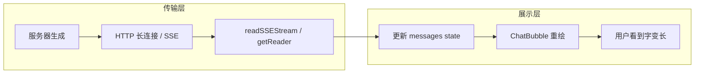
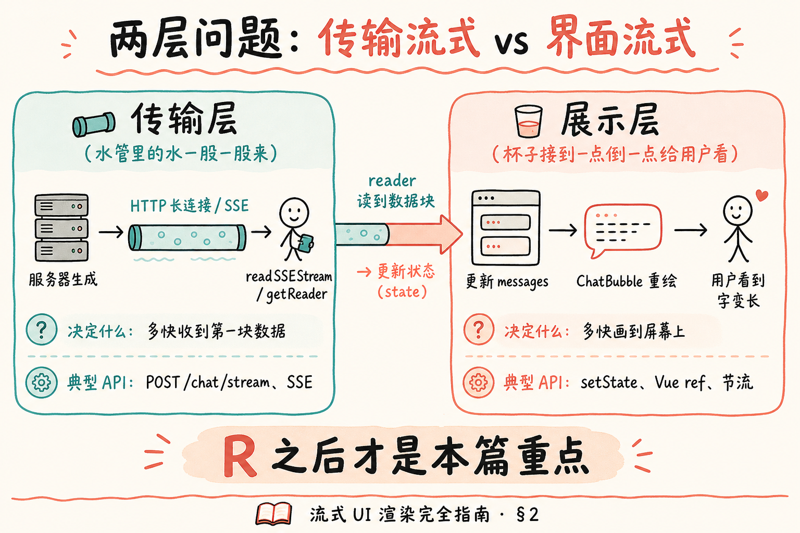
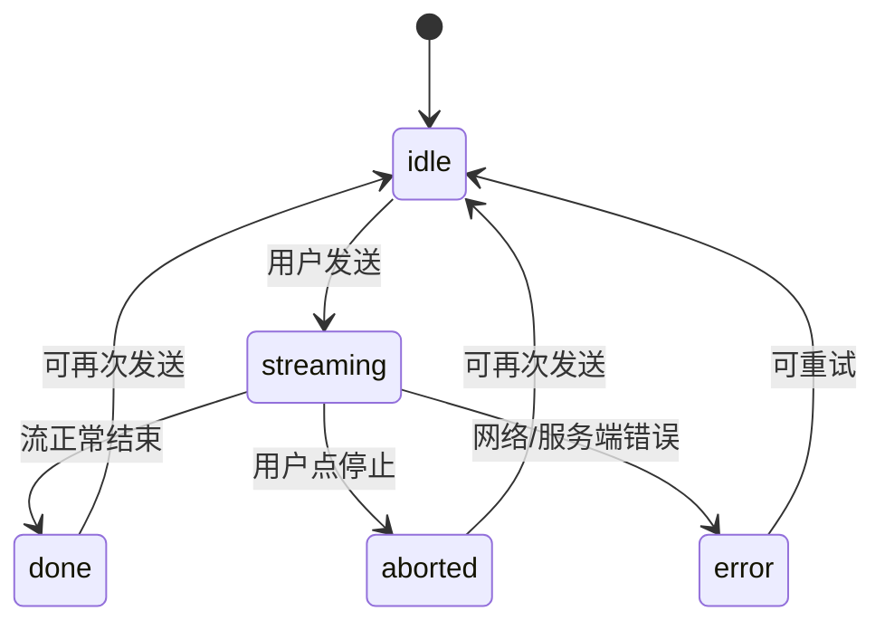
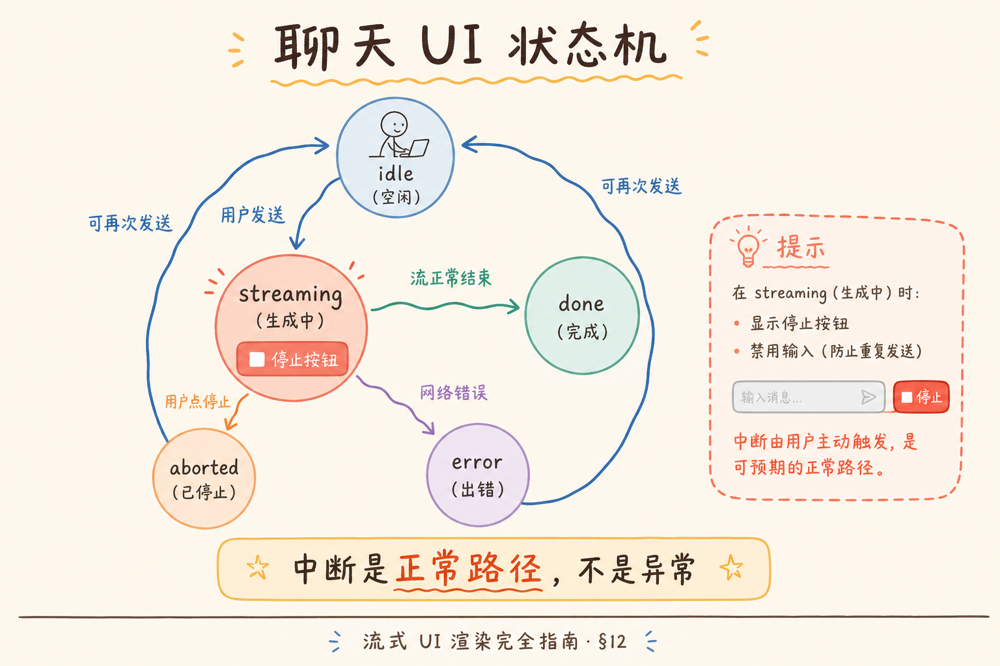
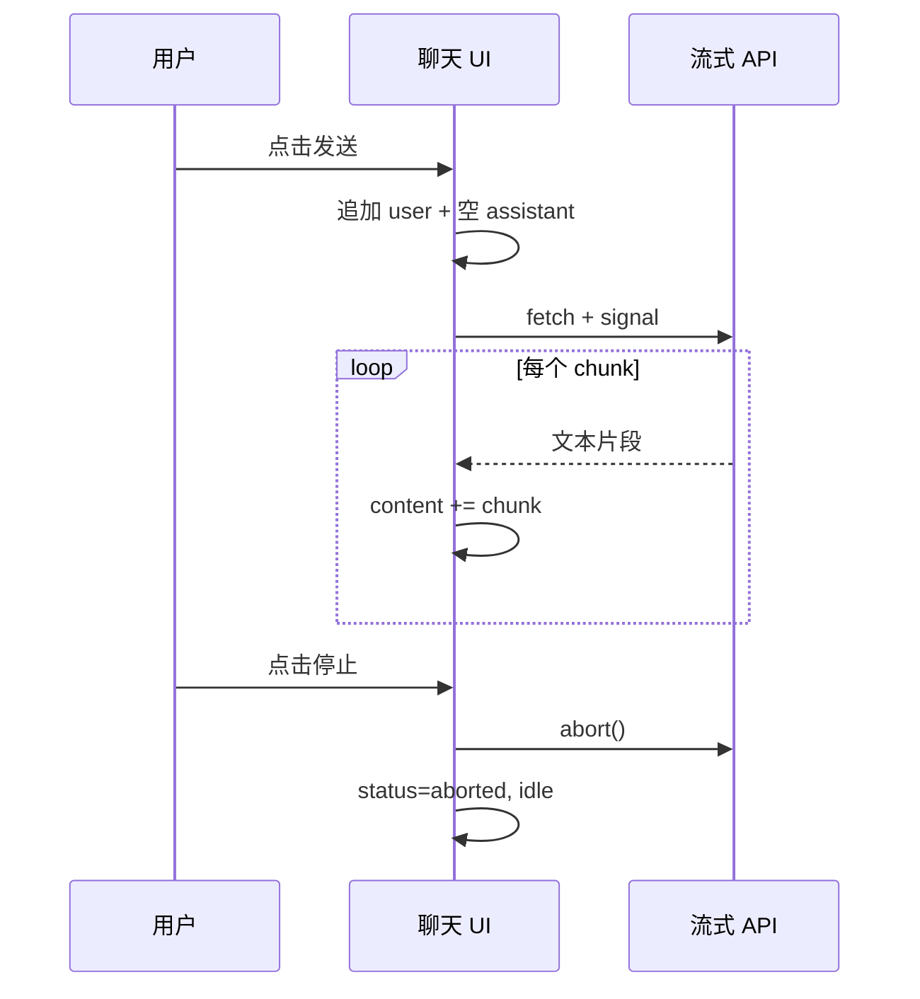
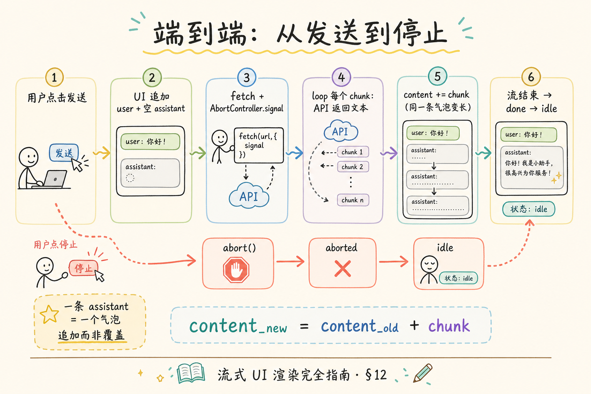

# 流式 UI 渲染完全指南：逐字显示、中断与用户感知

> 你用过 ChatGPT 或知识库问答：回答不是「转圈十秒然后一整段出现」，而是**字一个个往外蹦**。背后往往是服务器边生成边推送（SSE 或流式 HTTP），但用户眼睛看到的其实是**前端怎么把一小段一小段文字画到屏幕上**——以及点「停止」时，界面和后端请求如何一起收尾。协议与 `fetch` 读流见 [SSE 教程](7.sse-tutorial.md) 与 [React 第七篇](react/07.sse-streaming-chat.md)；这篇是**独立的地基教程**：站在 **UI 渲染** 角度，讲清打字机效果、状态机、中断、竞态、性能与 Markdown 时机，代码只保留说明概念的最小片段。读完应能**设计**聊天页的状态与交互，再对照系列篇目落地实现。

---

## 目录

1. [前言：用户等的是「第一个字」，不是「整段 JSON」](#1-前言用户等的是第一个字不是整段-json)
2. [两层问题：传输流式 vs 界面流式](#2-两层问题传输流式-vs-界面流式)
3. [用户感知：首字延迟、打字机与「假流式」](#3-用户感知首字延迟打字机与假流式)
4. [聊天 UI 的状态模型](#4-聊天-ui-的状态模型)
5. [逐字显示：chunk、token 与追加渲染](#5-逐字显示chunktoken-与追加渲染)
6. [框架里更新界面：React 为例](#6-框架里更新界面react-为例)
7. [中断：AbortController 与 UI 收尾](#7-中断abortcontroller-与-ui-收尾)
8. [竞态：停止、重发、串台与请求 ID](#8-竞态停止重发串台与请求-id)
9. [性能：更新太勤会怎样](#9-性能更新太勤会怎样)
10. [滚动、光标与辅助功能](#10-滚动光标与辅助功能)
11. [Markdown 与富文本：为何流式更难](#11-markdown-与富文本为何流式更难)
12. [综合概念地图与 UI 状态机](#12-综合概念地图与-ui-状态机)
13. [常见陷阱与 FAQ](#13-常见陷阱与-faq)
14. [总结与下一步](#14-总结与下一步)

---

## 1. 前言：用户等的是「第一个字」，不是「整段 JSON」

典型场景：知识库助手调用大模型，后端要 15 秒才生成完整回答。若前端仍用第三篇那种 `await res.json()`，界面在这 15 秒里只有 **loading 转圈**——用户不知道是在「卡住」还是「正在想」。ChatGPT 类产品把**第一个 token（词元）到达的时间**压到 1 秒内并在屏幕上立刻显示，主观体验就从「慢」变成「正在回答」。

**流式 UI 渲染**（streaming UI rendering）：把**陆续到达**的文本片段，以**递增方式**呈现在界面上（常见为气泡内文字变长），而不是等全文就绪再一次 `innerHTML` 或 `setState` 整段替换。  
通俗说：字幕**跟着播音逐句上屏**，不是等整部电影配音完再贴一整块字幕。

**中断**（abort / cancel，中止）：用户在生成过程中点「停止」，前端应**切断仍在进行的网络读流**，并把 UI 从「生成中」切到「已停止 / 可继续输入」；理想情况下后端也停止算力（取决于协议与实现）。  
通俗说：用户喊「别说了」——既要**闭嘴**（UI），也要尽量**挂电话**（请求）。

**读完本文，你应该能做到：**

1. 区分**传输层流式**（SSE、`ReadableStream`）与**展示层流式**（气泡文字变长），并说明二者为何常一起出现、又可以脱钩。
2. 画出聊天页最小**状态机**：空闲、生成中、已完成、已中断、出错。
3. 解释「逐字显示」在实现上多为 **chunk 追加**，以及 assistant 消息在 `messages` 数组里如何表示「正在变长的一条」。
4. 说明 `AbortController` 在 UI 层的职责，以及停止后应保留还是丢弃已生成文字。
5. 识别**竞态**（连续提问、停止后立刻重发）并说出「请求 ID / 忽略过期 chunk」的思路。
6. 知道高频 `setState` 的性能问题与**批量/节流**方向；知道流式 Markdown 为何要放到专门一篇。

**前置知识**：HTTP 与 `fetch` 基本概念（[REST API 设计](5.rest-api-design-tutorial.md)）；React `useState` 或 Vue `ref` 任一即可读懂 §6 对照。  
**环境**：概念篇不强制跑项目；动手实现请接 [React 第七篇](react/07.sse-streaming-chat.md) 或 [Next 第七篇](nextjs/07.sse-streaming-chat.md)。  
**本文边界（地基篇）**：聚焦 **UI 状态、感知、中断与陷阱**；**不讲** SSE 帧格式全文、Nginx 缓冲、OpenAI SDK 参数、后端 Python 生成器实现细节——后者见 [7.sse-tutorial.md](7.sse-tutorial.md) 与系列实战篇。

### 1.1 与系列教程的分工

| 文档 | 侧重点 |
|------|--------|
| 本篇 | 界面怎么「长出来」、怎么停、怎么不串台 |
| [SSE 教程](7.sse-tutorial.md) | 协议、`EventSource`、服务端推送、部署 |
| [React 07](react/07.sse-streaming-chat.md) | Vite + FastAPI 可运行聊天页 |
| [React 08](react/08.markdown-message-render.md) | 流式结束后再 Markdown 或增量渲染 |
| [前端状态管理](14.frontend-state-management-tutorial.md) | 多会话 `messages` 是否进全局 Store |

---

## 2. 两层问题：传输流式 vs 界面流式

初学者常把「服务器推流」和「打字机效果」混成一件事。实际上可以拆开：

**传输层流式**：一次 HTTP 响应的 **body 分多次到达**（`Transfer-Encoding: chunked` 或 SSE 的 `data:` 行）。浏览器通过 `fetch` + `response.body.getReader()` 或 `EventSource` 消费。  
通俗说：**水管里的水是一股一股来的**。

**展示层流式**：每收到一段文本，就在 DOM / 虚拟 DOM 里**追加**到当前气泡。  
通俗说：**杯子接到一点就倒一点给用户看**。



对照上图：**R 之后**才是本篇重点。理论上你也可以传输层一次性拿全文，展示层用 `setInterval` **假流式**一个字一个字显示（§3）——传输不是流式，体验却像流式。

| 层次 | 决定什么 | 典型 API |
|------|----------|----------|
| 传输层 | 多快收到第一块数据 | `POST /chat/stream`、SSE |
| 展示层 | 多快画到屏幕上 | `setState`、Vue `ref`、节流 |
| 两者解耦？ | 可以 | 先 `json()` 全文再客户端打字机动画 |



**首 token 时间**（Time To First Token，TTFT）：从发起请求到**收到第一块有效内容**的间隔——主要由模型与网络决定，前端只能如实展示。  
**首字上屏时间**：还取决于你在展示层是否**每 chunk 立即渲染**——这是前端可控的。

### 3.3 与「列表三态」的对比

第三篇列表页有 **loading / error / success** 三态：一次请求对应一种结局。流式聊天是 **loading 与 success 合并成「边加载边成功」**——从第一个 chunk 起就在 success 路径上变长，直到 `done` 或 `aborted`。若仍用「全屏转圈直到流结束」，就浪费了流式的意义。

| 列表页（一次性 JSON） | 流式聊天 |
|----------------------|----------|
| loading 时只见转圈 | 第一个 chunk 后就有字 |
| success 时整表替换 | success 是 `content` 连续变长 |
| error 一次失败 | error 可在中途断流（网络） |
| 无「用户主动取消」 | **aborted** 是常态之一 |

设计组件时，assistant 气泡可同时显示：**正文变长** + 角标「生成中」或底部小点动画——让用户知道还没 `done`，避免误以为回答已结束。

---

## 3. 用户感知：首字延迟、打字机与「假流式」

### 3.1 为什么产品偏爱「打字机」

心理学上，**有进展的等待**比**无反馈的等待**更短。流式 UI 把「等待整段答案」变成「已经能读开头」——即使总时长不变，满意度往往更高。

**打字机效果**（typewriter effect）：文字随时间**逐渐变长**的视觉效果。  
实现上常见两种：

1. **真流式**：网络每来一个 chunk，界面追加一段（与模型输出同步）。
2. **假流式**：全文已在内存，用定时器每次多显示几个字符（适合已缓存的回答、或非 LLM 场景）。

| | 真流式 | 假流式 |
|---|--------|--------|
| 数据何时齐全 | 结束时才齐全 | 开始时已齐全 |
| 能否反映模型真实速度 | 能 | 不能（速度由定时器定） |
| 中断意义 | 可省算力、停网络 | 仅停动画 |
| RAG / LLM 聊天 | **首选** | 多用于回放、动效 |

### 3.2 「逐字」不等于「每次一个字」

口语说「逐字显示」，实现里多数是 **按 chunk（块）追加**：模型可能一次推一个词、几个 token 或一行 SSE `data:`。UI 层应**原样拼接**字符串，不必强行拆成单字 `setInterval`——除非产品明确要求匀速打字机动画。

**Token**（词元）：大模型生成文本的最小单位之一，可能是一个字、一个词或子词片段。  
通俗说：模型「吐」出来的**小碎片**；前端通常**不必**理解 token，只把解码后的 **UTF-8 文本** 接到 `content` 字符串末尾即可。

---

## 4. 聊天 UI 的状态模型

流式聊天页至少需要两类 UI 状态：**消息列表**与**会话控制**。

### 4.1 消息列表

每条消息常见字段：

| 字段 | 含义 |
|------|------|
| `id` | 稳定 key，列表渲染用 |
| `role` | `user` / `assistant` / `system` |
| `content` | 文本；流式时 assistant 的 `content` **持续增长** |
| `status`（可选） | `streaming` / `done` / `aborted` / `error` |

**关键设计**：当前正在生成的那条 assistant 消息，在流式过程中**只有一条**处于 `streaming`；每收到 chunk 就更新**同一条**的 `content`，而不是每条 chunk 新建一条消息——否则界面会变成「几十条碎气泡」。

通俗说：**一条回答 = 一个气泡**，回答变长 = **同一个气泡里的字变多**。

### 4.2 会话控制状态

与输入框、按钮相关的状态，常与传输层联动：

| 状态 | 输入框 | 发送按钮 | 停止按钮 |
|------|--------|----------|----------|
| `idle`（空闲） | 可输入 | 可点 | 隐藏 |
| `streaming`（生成中） | 常禁用 | 禁用 | **显示** |
| `error` | 可输入 | 可点 | 隐藏 |

**演示什么**：最小消息类型（概念用 TypeScript 形状）。  
**预期**：读懂字段即可，不必此刻跑通。

```typescript
type Message = {
  id: string;
  role: "user" | "assistant";
  content: string;
  status?: "streaming" | "done" | "aborted" | "error";
};
```

用户点发送后典型顺序：追加一条 `user` → 追加一条空 `assistant`（`streaming`）→ 循环追加 `content` → 流结束标 `done`；若中断则标 `aborted`（§7）。

### 4.3 输入框草稿与发送中状态

除 `messages` 外，输入框自身常有 **draft**（草稿）字符串：仅在 `idle` 时与 `input` 双向绑定；进入 `streaming` 后清空或锁定输入，避免用户误以为「还能边生成边改问题」。若产品支持「重新编辑上一条 user 消息」，属于高级交互，必须配合 `abort` 与清空未完成 assistant（§13 FAQ）。

---

## 5. 逐字显示：chunk、token 与追加渲染

### 5.1 追加而非替换

流式过程中对**当前 assistant 消息**应使用**追加**（append）语义：

```
content_new = content_old + chunk
```

**先错后对**：

```javascript
// ❌ 每次用 chunk 覆盖整条 content —— 屏上永远只有最新几个字
setMessages((msgs) =>
  msgs.map((m) =>
    m.id === streamingId ? { ...m, content: chunk } : m
  )
);
```

```javascript
// ✅ 拼接到已有 content 末尾
setMessages((msgs) =>
  msgs.map((m) =>
    m.id === streamingId ? { ...m, content: m.content + chunk } : m
  )
);
```

**演示什么**：`map` 更新数组中一条；**前置**：已有一条 `streaming` 的 assistant。  
**预期**：多次调用后 `content` 为各 chunk 顺序拼接。

### 5.2 解码与边界

从 `ReadableStream` 读到的往往是 **Uint8Array**，需 `TextDecoder` 按 UTF-8 解码。多字节字符可能被拆在两个 chunk 之间——应使用 `decoder.decode(value, { stream: true })` 处理**不完整字符**，避免乱码。这是传输层细节，但**乱码会直接体现在 UI**；完整工具函数见 React 第七篇 `readSSEStream`。

### 5.3 流结束信号

除文字 chunk 外，服务器可能发：

- SSE 的 `[DONE]` 或空 `data:` 表示结束；
- 最后的 JSON 元数据（如 `citations`）——常在**流结束后**再 `setState` 一次（第九篇引用 UI）。

UI 应在收到结束信号后：把 `status` 从 `streaming` 改为 `done`，恢复 `idle` 控制状态，并允许下一次发送。

---

## 6. 框架里更新界面：React 为例

概念上 Vue 3 同理：`messages` 用 `ref([])`，chunk 到达时改 `messages.value[i].content += chunk`。

### 6.1 为何常用「函数式 setState」

`setMessages(prev => ...)` 基于**最新**列表更新，避免闭包里拿到旧的 `messages`，在快速连续 chunk 时丢字。流式场景应优先函数式更新。

### 6.2 不要在 useEffect 里「拉」流式对话

第三篇列表页：`useEffect` + `fetch` + `json()` 很合适。  
流式发送：**由用户点击触发**的 `async function handleSend()` 里 `fetch` + 读流循环——不是 effect 依赖自动重跑。否则 Strict Mode、依赖变化会导致**重复请求**或难清理的 reader。

| 模式 | 适用 |
|------|------|
| `useEffect` + 一次 `json()` | 列表、详情 |
| 事件处理函数 + `while read()` | 聊天发送、流式生成 |

### 6.3 与 Server Component 的边界（Next.js）

Next.js App Router 里，**读流、useState、AbortController** 必须在 **`'use client'`** 组件中。不要把 `getReader()` 写在 Server Component 的 `async function Page()` 里——服务器上无法做浏览器那套交互式中断。见 [Next 第六篇 RAG 骨架](nextjs/06.rag-frontend-skeleton.md)。

---

## 7. 中断：AbortController 与 UI 收尾

**AbortController**（中止控制器）：浏览器标准 API，把 `signal` 传给 `fetch`，调用 `abort()` 会**拒绝**进行中的 fetch 并停止 body 流。  
通俗说：给请求系上**牵绳**，用户点停止就拽绳子。

```javascript
// 概念片段：一次发送对应一个 controller
const controller = new AbortController();

const res = await fetch("/api/chat/stream", {
  method: "POST",
  body: JSON.stringify({ question }),
  signal: controller.signal,
});

// 停止按钮：onClick={() => controller.abort()}
```

### 7.1 UI 上停止后应做什么

建议顺序（概念清单）：

1. 调用 `controller.abort()`，结束 `read()` 循环（通常进入 `catch`，判断 `AbortError`）。
2. 将当前 assistant 消息的 `status` 设为 `aborted`（或 `done` + 角标「已停止」——产品选择）。
3. 会话控制状态回到 `idle`：启用输入框、隐藏停止按钮。
4. **保留已生成文字**（默认）：用户已读内容不应消失；若产品要求「停止即丢弃」需明确规格。

**AbortError**：`abort()` 后 fetch/read 抛出的错误名；应**区分**于网络错误——中断不是 bug，不要弹「请求失败」吓用户。

### 7.2 后端是否停下

前端 `abort()` **不保证** GPU 上模型立刻停算——取决于连接关闭后服务端是否检测断开。UI 层仍应中断：**用户侧立即响应**；算力节省是后端优化项。

### 7.3 组件卸载时也要 abort

用户离开聊天页、React 卸载组件时，应在 `useEffect` 清理函数里 `controller.abort()`，避免**后台仍在读流**、卸载后仍 `setState`（内存泄漏 + React 警告）。

---

## 8. 竞态：停止、重发、串台与请求 ID

**竞态**（race condition）：多个异步操作完成顺序与发起顺序不一致，导致**旧回答覆盖新回答**或**碎 chunk 拼错气泡**。

典型场景：

1. 用户问 A，未结束又问 B（若未禁用发送）。
2. 用户问 A，点停止，立刻问 B——A 的迟到 chunk 仍到达。
3. 网络重试导致同一问题两条流交错。

**防护思路**：

| 手段 | 作用 |
|------|------|
| `streaming` 时禁用发送 | 最简单，多数产品采用 |
| 每轮请求 `requestId` / `generationId` | chunk 回调里比对，不匹配则**丢弃** |
| 新请求 `abort()` 上一轮 | 同一 `controller` 引用或 abort 旧 controller |
| 只更新「当前 streamingId」 | `map` 时校验 `m.id === currentStreamingId` |

```javascript
// 概念：过期 chunk 直接 return
function onChunk(chunk, requestId) {
  if (requestId !== activeRequestIdRef.current) return;
  appendToStreamingMessage(chunk);
}
```

**串台**：用户看到的问题与回答错位，或两条回答交替闪烁——几乎都是**未丢弃过期 chunk** 或未 **abort** 旧流。

---

## 9. 性能：更新太勤会怎样

模型推送很快时，可能**每秒几十次** `setState` + 整列表重渲染 + Markdown 解析（若每 chunk 都解析会更惨）。

### 9.1 症状

- 输入卡顿、滚动掉帧；
- 低端手机发热；
- React DevTools 里渲染次数爆炸。

### 9.2 缓解方向（概念级）

| 策略 | 白话 |
|------|------|
| **节流 / 批量** | 例如每 50ms 合并多次 chunk 再 `setState` 一次 |
| **`requestAnimationFrame`** | 与屏幕刷新对齐，每帧最多更新一次 |
| **流式阶段纯文本** | 生成中用 `<pre>` 或纯文本；**结束后再** Markdown（第八篇） |
| **memo 子组件** | 每条 `ChatBubble` `React.memo`，仅 streaming 那条频繁更新 |
| **虚拟列表** | 极长会话历史才需要 |

地基篇不必实现节流代码；实现前记住：**展示层可以比传输层「慢一点画」**，用 30～50ms 批量往往肉眼无差、帧率更好。若 chunk 本身已很慢（模型限速），则不必再节流——**先测量再优化**，避免过早优化。

### 9.3 React 18 自动批处理

React 18 在事件处理、部分异步场景会**合并**多次 `setState`。但不要依赖批处理处理所有读流回调——`read()` 循环里的 `await` 之后是否批处理与运行环境有关，高频流仍建议显式节流。

---

## 10. 滚动、光标与辅助功能

### 10.1 自动滚到底部

新字出现时，用户期望看到**最新一行**。常见做法：

- 列表容器 `ref`，在 `content` 变化后 `scrollTop = scrollHeight`；
- 或 `scrollIntoView` 对准最后一条气泡。

**细节**：若用户**手动往上滚**读历史，不应强行拉回底部——可加「是否在底部附近」判断，仅贴底时自动滚（产品细节，地基篇知道有这回事即可）。

### 10.2 闪烁光标（可选）

部分产品在 `streaming` 气泡末尾显示 `▍` 或 CSS 动画光标，强化「还在说」。流结束移除。纯视觉，不影响数据模型。

### 10.3 无障碍（a11y）

- 生成中可用 `aria-live="polite"` 区域通知读屏**有新内容**，但过高频更新会让读屏用户崩溃——可对 `aria-live` 区域做**节流**或仅在完成时播报。
- 「停止」按钮需有明确 `aria-label`（如「停止生成」）。
- 极长回答可考虑提供「跳到最新」浮动按钮，减轻手动滚动负担（尤其移动端）。

---

## 11. Markdown 与富文本：为何流式更难

**Markdown**：用 `*`、`#`、`` ` `` 等标记渲染标题、列表、代码块。  
流式时问题：**未闭合的标记**会导致整段解析抖动——例如只收到 `` ```py `` 还没有闭合，高亮会闪。

常见产品策略：

| 策略 | 说明 |
|------|------|
| 流式阶段纯文本，结束后 Markdown | 最简单稳定（系列第八篇） |
| 增量 Markdown 库 | 每 chunk 重解析，需可容忍闪烁 |
| 仅对已完成消息 Markdown | 历史中 `done` 用 `react-markdown`，`streaming` 用纯文本 |

**XSS**：Markdown 渲染 HTML 时要消毒（第八篇）。流式不减轻安全责任——**只要渲染用户可见 HTML 就要消毒**。

### 11.1 流结束后的「第二次更新」

RAG 场景里，**引用列表**（`citations`）常在全文生成完后由服务器在**最后一个事件**或**单独字段**里给出。UI 上常见模式：

1. 流式阶段只更新 `content`；
2. `done` 时把 `citations` 写入同一条 assistant 消息，或触发侧栏展开；
3. 若引用晚于文字到达，引用区可显示 skeleton，避免布局猛跳。

这属于「展示层分阶段」：用户先读字，再看到脚注链接——与 [React 第九篇](react/09.citation-source-ui.md) 衔接。地基篇只需记住：**不必强求每个 chunk 都带完整元数据**。

---

## 12. 综合概念地图与 UI 状态机

### 12.1 名词对照表

| 你看到的现象 | 概念 | 记住一句 |
|--------------|------|----------|
| 字一个个出来 | 展示层追加 `content` | 一条 assistant 一个气泡 |
| 点停止立刻能输入 | `abort` + 控制状态回 `idle` | 中断是正常路径 |
| 上一问的答案混入下一问 | 竞态 | `requestId` 或禁用连发 |
| 屏上只有最新几个字 | 覆盖而非追加 | 用 `content + chunk` |
| 转圈很久才出字 | 非流式或 TTFT 长 | 检查是否 `json()` 等全文 |
| 全文瞬间出来再慢慢显示 | 假流式 | 传输非流式 |

### 12.2 UI 状态机（单会话）



读图时看：**streaming** 是唯一需要显示「停止」、禁用输入的状态；进入 **done / aborted / error** 后都要落回可交互的 **idle**（除非产品锁定多步向导）。



### 12.3 端到端数据流（复习）





---

## 13. 常见陷阱与 FAQ

### 13.1 常见陷阱

**陷阱 1：等 `res.json()` 做聊天**  
整段到达才渲染——无流式体验；应用 `body.getReader()` 或 SSE 解析。

**陷阱 2：每个 chunk 新建一条 message**  
界面碎裂；应更新同一条 `streaming` 消息。

**陷阱 3：停止后不 `abort`**  
后台仍读流，可能 `setState` 到已卸载组件或下一条会话。

**陷阱 4：停止后弹红色 Error Toast**  
`AbortError` 应静默或轻提示「已停止」。

**陷阱 5：流式时每 chunk 全量 Markdown**  
性能差、样式跳；改为结束后渲染或节流。

**陷阱 6：未处理 UTF-8 分包**  
偶发乱码；`TextDecoder` 的 `stream: true` 见第七篇。

### 13.2 FAQ

**Q：流式 UI 一定要用 SSE 吗？**  
A：不必。只要是**可分块读取**的 HTTP body（含不少 LLM 的 streaming JSON 行），UI 层追加逻辑相同。SSE 是常见格式之一，见 [SSE 教程](7.sse-tutorial.md)。

**Q：WebSocket 呢？**  
A：双向实时用 WebSocket；**单向**「模型→浏览器」SSE 往往更简单。UI 追加逻辑类似，只是读流 API 不同。

**Q：Vue 怎么做？**  
A：`ref` 存 `messages`，`fetch` + `reader` 同 React；在 `onUnmounted` 里 `abort`。

**Q：流式内容要不要进 Zustand？**  
A：单页聊天 `useState` 够；多 Tab 会话、跨路由恢复再考虑全局 Store，见 [状态管理篇](14.frontend-state-management-tutorial.md)。

**Q：和路线图第 22 条的关系？**  
A：[企业 RAG 路线图](ENTERPRISE_RAG_ROADMAP.md) 列「流式 UI」为前端能力；本篇讲 UI 层，第七～八篇系列文落地 RAG 聊天。

**Q：能否在服务端组件流式 HTML？**  
A：Next.js 有 RSC 流式 HTML，与「聊天气泡逐字」是不同机制；LLM 聊天页一般是 **Client 读 API 流**，不要混为一谈。

**Q：用户快速连点发送怎么办？**  
A：除禁用按钮外，可在 UI 层队列化（「上一条结束再发下一条」）或自动 `abort` 上一条——产品二选一，但必须处理竞态（§8）。

**Q：生成中能编辑已发送的用户消息吗？**  
A：多数产品禁止；若允许「编辑并重发」，应 `abort` 当前流、清空或归档未完成 assistant，并递增 `requestId`，否则极易串台。

---

## 14. 总结与下一步

### 14.1 核心概念速记

1. **传输流式**负责「数据陆续到」；**展示流式**负责「界面陆续长」——可解耦。  
2. 一条 assistant 回答 = **一个气泡**，`content` **追加** chunk。  
3. 会话 UI 用 **idle / streaming / done / aborted / error** 控制按钮与输入。  
4. **AbortController** 连接「停止」按钮与 `fetch`；区分 `AbortError` 与真错误。  
5. **requestId** 与「streaming 时禁用发送」防串台。  
6. 高频更新考虑**节流**；Markdown 宜**结束后再渲染**或纯文本流式。以上六点覆盖流式聊天 UI 的主干决策。

### 14.2 推荐阅读顺序

| 目标 | 文档 |
|------|------|
| 协议与 `EventSource` | [7：SSE 教程](7.sse-tutorial.md) |
| React 可运行聊天页 | [React 07](react/07.sse-streaming-chat.md) |
| Markdown 与 XSS | [React 08](react/08.markdown-message-render.md) |
| Next.js 聊天实现 | [Next 07](nextjs/07.sse-streaming-chat.md) |
| 引用与侧栏 | [React 09](react/09.citation-source-ui.md) |

### 14.3 刻意留白（进阶可选）

本篇未展开：**节流实现代码**、**RSC `useChat` 类封装**、**多模态流式（图片块）**、**语音朗读同步字幕**、**离线重放录制流**。工程上在第七篇跑通后，按产品要求加批量更新与 Markdown 策略即可。

---

> **初学者可能仍困惑的点**  
> - 「逐字」多半是 **chunk 变长**，不是定时器一个字一个字蹦（除非假流式）。  
> - 停止 = **正常业务流程**，不是异常；UI 与 `abort` 要成对设计。  
> - 流式解决的是**体验**，不替代**答案是否正确**——检索与引用在 RAG 里另有篇章。
