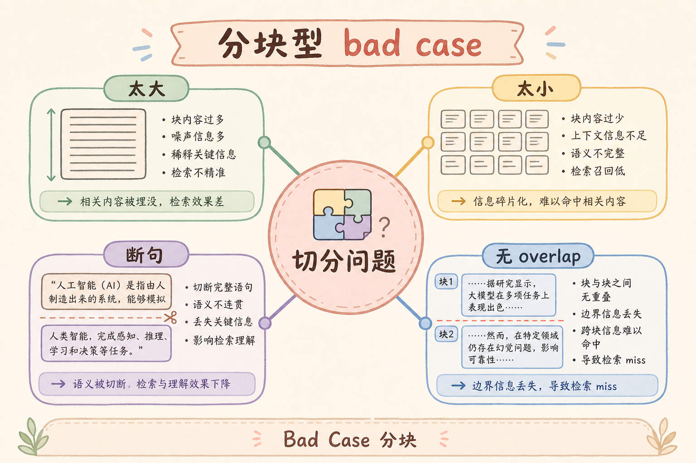
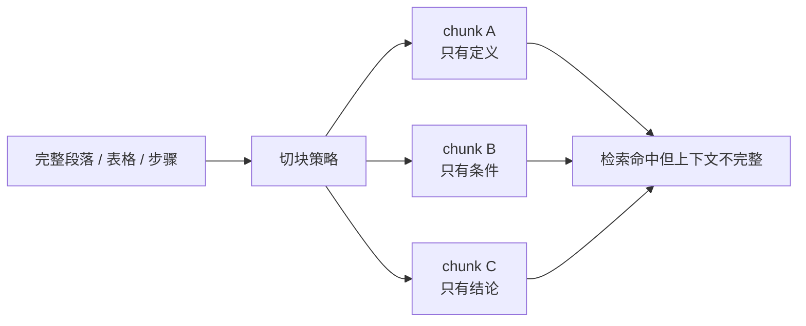
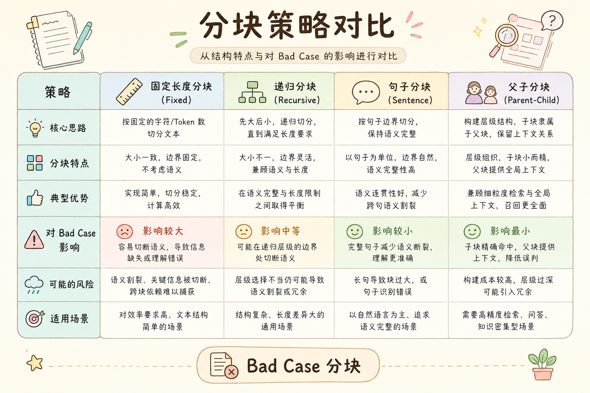
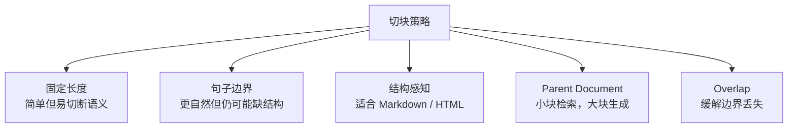
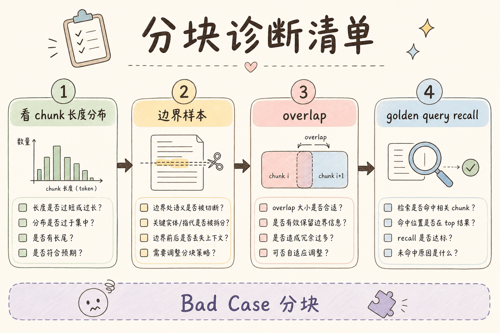
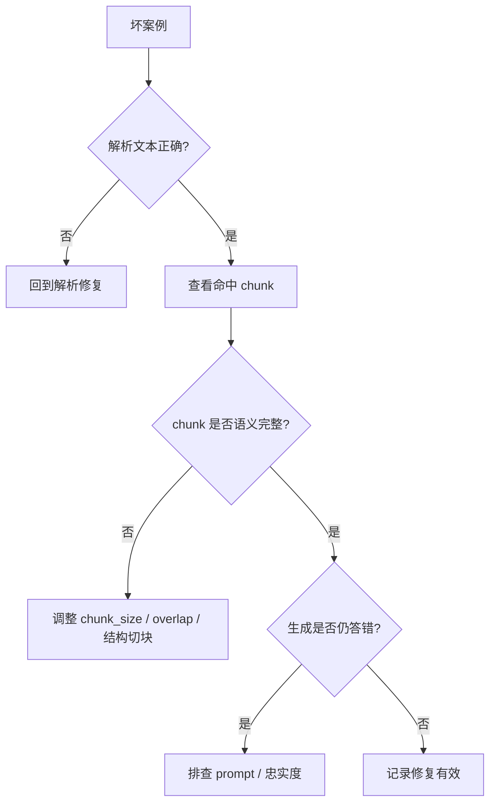
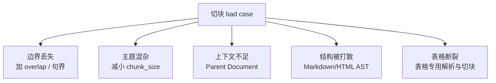

# E 评测与观测（十二）：Bad Case 归因之切块错误完全指南

> 解析对了，用户问「试用期多久」，检索命中的 chunk 却是 **「试用」和「期考核」被切成两半** 的两段——BM25 勉强命中其中一段，LLM 看到残缺句，答成「试用考核为期三个月」。这是 **切块（Chunking）** 型 bad case。这篇是路线图 **167**，地基篇。前置：[57 固定分块](57.fixed-size-chunking-tutorial.md)、[60 overlap](60.chunk-overlap-tutorial.md)、[62 结构分块](62.structure-aware-chunking-tutorial.md)；用 [147/148](147.langsmith-tracing-tutorial.md) trace 看 **命中 chunk 边界**；与 [149 解析](149.bad-case-parsing-tutorial.md)、[151 检索](151.bad-case-retrieval-miss-tutorial.md) 交叉验证。

---

## 目录

1. [前言：刀口不对，检索全白费](#1-前言刀口不对检索全白费)
2. [本文边界与动手路径](#2-本文边界与动手路径)
3. [切块型 bad case 是什么](#3-切块型-bad-case-是什么)
4. [trace 上如何识别切块问题](#4-trace-上如何识别切块问题)
5. [C2 切块策略对照 57～65](#5-c2-切块策略对照-5765)
6. [chunk_size 与 overlap 诊断](#6-chunk_size-与-overlap-诊断)
7. [结构感知与 Markdown AST](#7-结构感知与-markdown-ast)
8. [Parent Document 与层次索引](#8-parent-document-与层次索引)
9. [诊断清单与 Golden 探针](#9-诊断清单与-golden-探针)
10. [修复 Playbook](#10-修复-playbook)
11. [先错对对：五种典型误判](#11-先错对对五种典型误判)
12. [综合概念地图](#12-综合概念地图)
13. [常见陷阱与 FAQ](#13-常见陷阱与-faq)
14. [总结与系列下一步](#14-总结与系列下一步)

---

## 1. 前言：刀口不对，检索全白费

[57 固定长度](57.fixed-size-chunking-tutorial.md) §8 先错对对已经演示：**句中断开** 会让关键条件落在两个 chunk 的缝里。上线后这类问题表现为：

- 检索 **分数中等**（命中半个关键词）；  
- 上下文 **缺主语或缺结论**；  
- [152 胡编](152.bad-case-hallucination-tutorial.md) 或 [33 幻觉](33.llm-hallucination-tutorial.md) **忠实性胡编**——模型 **补全** 了残缺句。

**切块型 bad case 定义**：入库文本正确，但 **分块边界不合理**，导致 **单 chunk 无法承载完整语义单元**，使检索或生成失败。

---

## 2. 本文边界与动手路径

**档位：E 地基篇（167）。**

**本文讲：** 识别、C2 策略对照、size/overlap、结构分块、Parent、修复。  
**本文不讲：** 语义分块 LLM 全自动（路线图深入项）。

### 2.1 动手路径

| 步骤 | 验收 |
|------|------|
| A | trace 中复制命中 chunk 全文 | 是否语义完整 |
| B | 在源文档定位对应段 | 边界是否切断 |
| C | 调 overlap 或改结构分块 | 同 query recall 提升 |
| D | 登记 [171 参数版本](154.param-version-management-tutorial.md) | `chunk_policy` 变更 |

---

## 3. 切块型 bad case 是什么

读下图时，先看「切块型 bad case」想表达的主线：它把本节的概念关系压缩成一张可对照的图。



下面这张图说明切块型 bad case 的位置。读图时重点看：原文解析可能是对的，但切块把完整语义切散了，导致检索命中后仍无法回答。



结论：切块问题不是“没搜到”，而是“搜到了碎片”。修复方向通常是调整边界、overlap、结构感知或 Parent Document。

对照上图可以得出一个实用结论：先确认「切块型 bad case」里的主流程，再去调整具体参数或实现细节。

### 3.1 与解析错、检索漏区分

| 类型 | 源文 | 单 chunk 语义 |
|------|------|---------------|
| [149 解析](149.bad-case-parsing-tutorial.md) | 已坏 | — |
| **切块** | 对 | **不完整** |
| [151 检索](151.bad-case-retrieval-miss-tutorial.md) | 对 | 完整 chunk 存在但未命中 |

---

## 4. trace 上如何识别切块问题

在 [148 Langfuse](148.langfuse-observability-tutorial.md) retrieve observation：

1. 看 **Top-1 chunk** 是否 **以连词/逗号开头** 或 **突然断句**；  
2. 用 `chunk_id`（[51](51.metadata-chunk-id-tutorial.md)）在源文 **前后各读 200 字**；  
3. 若答案在 **相邻 chunk** 另一半 → 切块问题坐实。

**探针 query**：从 [160 金标](143.golden-dataset-tutorial.md) 取 **必须跨句回答** 的题（含「且」「但是」「不包括」）。

---

## 5. C2 切块策略对照 57～65

读下图时，先看「切块策略对照」想表达的主线：它把本节的概念关系压缩成一张可对照的图。



下面这张图对比几类切块策略。读图时重点看：策略没有绝对好坏，要看文档结构和问法。



初学者可以先用固定长度加 overlap 起步，但一旦出现标题、表格、步骤被切散，就应考虑结构感知或 Parent Document。

| 文章 | 策略 | 适用 | 常见 bad case |
|------|------|------|---------------|
| [57](57.fixed-size-chunking-tutorial.md) | 固定长度 | PoC | 句中断 |
| [58](58.recursive-character-chunking-tutorial.md) | 递归分隔 | 通用 | 分隔符选错 |
| [59](59.sentence-boundary-chunking-tutorial.md) | 句子边界 | 制度条文 | 超长单句 |
| [60](60.chunk-overlap-tutorial.md) | 重叠 | 补缝 | overlap 仍不够 |
| [61](61.chunk-size-tradeoff-tutorial.md) | 大小权衡 | 调参 | 过大引入噪声 |
| [62](62.structure-aware-chunking-tutorial.md) | 结构感知 | 手册 | 标题与正文分离 |
| [63](63.markdown-ast-chunking-tutorial.md) | MD AST | 技术 Wiki | 代码块被切 |
| [64](64.html-dom-chunking-tutorial.md) | HTML DOM | 帮助中心 | div 边界 |
| [65](65.parent-document-retriever-tutorial.md) | 父文档 | 长条命中 | 子块太碎 |

---

## 6. chunk_size 与 overlap 诊断

读 [61 篇](61.chunk-size-tradeoff-tutorial.md)：

- **过小**：定义与例外 **分到不同 chunk**；  
- **过大**：多主题混一块，[93 检索](93.hybrid-search-tutorial.md) 精度降；  
- **overlap=0**：[60 篇](60.chunk-overlap-tutorial.md) 缝上关键词 **两边都只有一半**。

**实验**：固定解析器，只改 `chunk_size` / `overlap`，在 [170 A/B](153.ab-experiment-rag-tutorial.md) 框架下跑 [161 回归集](144.regression-test-set-tutorial.md)。

---

## 7. 结构感知与 Markdown AST

员工手册常见 **「第三章 → 3.1 → 3.1.1」**——[62 结构分块](62.structure-aware-chunking-tutorial.md) 按标题切，避免 **条号与正文分离**。  
技术文档用 [63 Markdown AST](63.markdown-ast-chunking-tutorial.md)：**代码块、表格** 保持原子单元。

---

## 8. Parent Document 与层次索引

[65 Parent Document](65.parent-document-retriever-tutorial.md)：检索 **小子块**，生成用 **父段落**。trace 里若小子块语义碎但 **parent 字段完整**，属 **设计如此**；若未实现 parent 却用小碎块 → bad case。

---

## 9. 诊断清单与 Golden 探针

读下图时，先看「切块诊断清单」想表达的主线：它把本节的概念关系压缩成一张可对照的图。



下面这张图给出切块问题的诊断顺序。读图时重点看：先排除解析，再看命中的 chunk 是否包含完整回答材料。



这张图避免一个常见误判：解析没排除时就调切块，最后只是把错误文本切得更精致。

| 检查项 | 通过标准 |
|--------|----------|
| 金标句能否在单 chunk 找全 | 是 |
| 条号与内容同块 | 是 |
| overlap ≥ 关键句长度 15% | 建议 |
| 代码块未被切断 | 是 |

---

## 10. 修复 Playbook

1. trace 定位 `chunk_id`；  
2. 判断策略层级（固定 → 递归 → 结构）；  
3. 调参或换 Splitter（[130 LangChain Text Splitter](130.langchain-text-splitter-tutorial.md)、[136 可插拔](136.pluggable-parser-splitter-embedder-tutorial.md)）；  
4. **全量重 embed**（[171 版本](154.param-version-management-tutorial.md) 新 `chunk_policy`）；  
5. [147/148](147.langsmith-tracing-tutorial.md) 对比修复前后 trace。

---

## 11. 先错对对：五种典型误判
下面这些切块错误表面只是参数选择，实际会直接影响召回和引用：切太碎会丢上下文，切太粗会稀释重点，overlap 用错还会制造重复证据。

### 11.1 错：解析未排除就调 overlap

**对**：先 [149](149.bad-case-parsing-tutorial.md)。

### 11.2 错：chunk 越大越好

**对**：见 [61 tradeoff](61.chunk-size-tradeoff-tutorial.md)。

### 11.3 错：命中了就说检索没问题

**对**：命中 **错块** 也是切块/检索问题。

### 11.4 错：只改 prompt 让模型「联系上下文」

**对**：上下文 **没进 Top-K** 时 prompt 无效。

### 11.5 错：不重跑 embedding

**对**：切块变必须 **重 embed**。

---

## 12. 综合概念地图

读下图时，先看「切块 bad case 概念地图」想表达的主线：它把本节的概念关系压缩成一张可对照的图。


下面这张概念地图总结切块 bad case 的修复杠杆。读图时重点看：不同症状要改不同参数。



结论：切块调参要从症状出发，而不是盲目追求更大或更小的 chunk。

---


## 13. 常见陷阱与 FAQ
最后用 FAQ 收束坏例分析的边界。坏例不是为了“证明系统很差”，而是把失败归因到解析、切块、召回、重排或生成中的具体一层。

### 13.1 初学者最常踩的三坑

下面三坑会让切块问题被误判成召回或大模型问题。排查时先确认 chunk 是否完整、边界是否合理，再去调整检索参数。

1. **只看最终答案，不看链路**——切块归因的价值在 **可复现的中间态**。  
2. **没有金标就调参**——没有 [160 Golden Dataset](143.golden-dataset-tutorial.md) 时，A/B 只是 **主观吵架**。  
3. **工具买了不用**——装了 LangSmith/Langfuse 却不给每次请求打 `trace_id`，等于 **黑盒上线**。

### 13.2 FAQ 精选

**Q1：PoC 阶段要不要上观测？**  
要。**最小集**：`request_id` + 检索 Top-5 `chunk_id` + 模型名 + 延迟。完整平台可后补，但 **字段契约** 第一天就定。

**Q2：和 RAGAS 指标怎么配合？**  
RAGAS 回答 **「好不好」**；观测平台回答 **「哪一步坏了」**。建议：金标跑 RAGAS 批次，线上 bad case 用 trace 下钻。

**Q3：成本会不会爆？**  
Trace 存全文 context 很贵。生产用 **采样**（如 5%）+ **摘要字段**（chunk_id、score、前 200 字预览），全文按需拉取。

**Q4：多环境怎么隔离？**  
`project` / `environment` 标签：`dev` / `staging` / `prod` 分开；**禁止** 把 prod trace 当训练数据未经脱敏。

**Q5：谁负责看板？**  
工程搭管道，**产品 + 领域专家** 每周过 bad case；研发负责 **归因到模块**（解析/切块/检索/生成）。

**Q6：失败请求要不要记 trace？**  
**更要记**。超时、空检索、解析异常——没有失败 trace，你永远在猜。

**Q7：和 [147 LangSmith](147.langsmith-tracing-tutorial.md) / [148 Langfuse](148.langfuse-observability-tutorial.md) 二选一？**  
LangChain 深度用 LangSmith 顺手；要 **自托管、开源、多框架** 看 Langfuse。也可 **双写** 过渡期，但统一 `trace_id`。

**Q8：如何证明一次修复有效？**  
回归集 [161](144.regression-test-set-tutorial.md) 上 **同题同参** 对比；再看线上 **7 日 bad case 率**。

**Q9：实习生能维护吗？**  
把 **归因决策树** 贴在 wiki（本篇系列 149～152）；观测 UI 只读权限给全员，写权限限研发。

**Q10：面试怎么讲？**  
30 秒：**「RAG 上线后我用 trace 把 bad case 分到 ingest/retrieve/generate，用金标 + A/B 验证改动，参数版本可回滚。」**

## 14. 总结与系列下一步
最后把本篇的关键判断整理成清单，方便你回头复习，也方便继续阅读系列里的下一篇。

### 14.1 本篇要点回顾

本篇是 [企业 RAG 路线图](ENTERPRISE_RAG_ROADMAP.md) **E 模块** 的一环。E 模块主线是：**先有金标与指标 → 再有观测 → 再会归因 bad case → 再用实验与版本管理迭代**。

### 14.2 系列下一步

切块问题修完后，通常还要重新看解析、检索和参数版本。下面这些文章能帮你判断“刀口修好了以后，下一层还要不要动”。

| 目标 | 阅读 |
|------|------|
| Bad Case：解析 | [149 解析](149.bad-case-parsing-tutorial.md) |
| Bad Case：检索 | [151 检索](151.bad-case-retrieval-miss-tutorial.md) |
| 固定分块 | [57 固定分块](57.fixed-size-chunking-tutorial.md) |
| 参数版本 | [154 参数版本](154.param-version-management-tutorial.md) |

### 14.3 学习目标自检

这一节用于检查你是否能把“切块错”从解析错和检索漏里分出来，并给出可验证的修复动作。

- [ ] 能口述本篇在 E 模块中的位置  
- [ ] 能列出至少三个与前序文章的衔接点  
- [ ] 能完成一篇中的「动手路径」验收  
- [ ] 能在观测 UI 或日志里找到一次完整 RAG trace  
- [ ] 能把一个真实 bad case 写到归因树的一叶子上  

### 14.4 面试 30 秒版

见 §12 FAQ Q10。

### 14.5 30 分钟作业

1. 选一条你项目里的 **真实用户问题**；  
2. 在 LangSmith 或 Langfuse（或最小 JSON 日志）里拉出 **完整 trace**；  
3. 用 149～152 决策树写 **归因假设**；  
4. 写一条 **可验证的修复实验**（对接 [170 A/B](153.ab-experiment-rag-tutorial.md)）；  
5. 在 [171 参数版本](154.param-version-management-tutorial.md) 表里登记本次改动的参数。

---

> **初学者可能仍困惑的点**  
> - **观测 ≠ 评测**：前者定位，后者打分。  
> - **了解档** 也要会 **最小集成**，否则面试说不清。  
> - Bad case 系列要 **交叉验证**：解析错会像检索漏，生成胡编有时是检索空。  
> - 任何改动 **必须可回滚**——见参数版本篇。


### 14.6 切块归因深度补充：调参记录表

| 实验 | chunk_size | overlap | Recall@5 | 备注 |
|------|------------|---------|----------|------|
| baseline | 512 | 64 | | |
| exp1 | 800 | 128 | | |

每次实验 **新 param_version**（[171](154.param-version-management-tutorial.md)），**禁止** 覆盖旧索引。结构分块 [62](62.structure-aware-chunking-tutorial.md) 对 **条款编号** 场景通常优于盲目加大 size。

**与 [65 Parent Document](65.parent-document-retriever-tutorial.md)**：若已 parent 仍 bad case，查 **子块是否过碎**（<100 token）或 **父块未随检索返回**。


## 15. 切块归因案例精读

切块错时，源文复制正确，但 **单 chunk 承载不了完整语义**。trace 常见：Top-1 以逗号或连词开头、条号与正文分家、代码块只剩半函数。

先 [149 排除解析](149.bad-case-parsing-tutorial.md)，再用 chunk_id 在源文前后各读两百字。答案在相邻 chunk 另一半 → 坐实切块。

策略升级路径：[57 固定](57.fixed-size-chunking-tutorial.md) → [58 递归](58.recursive-character-chunking-tutorial.md) → [62 结构](62.structure-aware-chunking-tutorial.md) → [63 Markdown AST](63.markdown-ast-chunking-tutorial.md) → [65 Parent](65.parent-document-retriever-tutorial.md)。

调 overlap 与 chunk_size 要做 [170 A/B](153.ab-experiment-rag-tutorial.md)，每次新 [171 pv](154.param-version-management-tutorial.md)，**全量 re-embed**。盲目加大 chunk 会引入噪声，见 [61 tradeoff](61.chunk-size-tradeoff-tutorial.md)。

金标探针选含「且、但是、不包括」的题，专测边界缝。


## 16. 练习与自检

动手一：trace 复制 Top-1 chunk，在源文定位是否断句。动手二：调 overlap 前后 Recall 对比。动手三：登记新 chunk_policy 到 [171](154.param-version-management-tutorial.md)。

自检：57～65 策略选型？Parent 与子块关系？为何重 embed？

误区：未排除 [149](149.bad-case-parsing-tutorial.md)；chunk 越大越好；命中错块当检索对。

与 [151](151.bad-case-retrieval-miss-tutorial.md) 联调：语义完整仍不命中才是检索问题。

## 17. 切块归因周课与清单

**每日**： 金标里选一条「跨句答案」，看 Top-1 是否语义完整。**每周**： 对比 chunk_size/overlap 实验记录在 [170 A/B](153.ab-experiment-rag-tutorial.md) 台账。**每月**： 评估是否升级 [62 结构分块](62.structure-aware-chunking-tutorial.md) 或 [65 Parent](65.parent-document-retriever-tutorial.md)。

制度类文档：条号与正文同块是 **底线**。技术 Wiki：代码块、表格原子不可切。对话类 FAQ：可略小 chunk，但 overlap 要够。

与 [60 overlap](60.chunk-overlap-tutorial.md) 关系：overlap 不是万能胶，太大引入重复噪声，见 [61 tradeoff](61.chunk-size-tradeoff-tutorial.md)。结构分块往往是 **比盲目 overlap 更优** 的第一步。

重 embed 提醒：改 chunk 必新 collection 或索引代际，登记 [171 pv](154.param-version-management-tutorial.md)。只改磁盘 JSON 不改向量是 **隐形事故**。

排障顺序：先 [149 解析](149.bad-case-parsing-tutorial.md)，再本篇，再 [151 检索](151.bad-case-retrieval-miss-tutorial.md)。半句话命中多半是切块；整段没有是解析。

团队口诀：**「刀口在缝上，检索救不了。」**

## 18. 综合案例：条号与正文分离

**背景**：问「试用期多长」，命中 chunk 仅「三个月」无「试用期」主语。**源文** 条号 3.2 与正文被 [57 固定切](57.fixed-size-chunking-tutorial.md) 切开。**修**：[62 结构分块](62.structure-aware-chunking-tutorial.md) 按标题，overlap 128，新 pv [171](154.param-version-management-tutorial.md)。**Recall@5** 升 18pp。

**对比**：[65 Parent](65.parent-document-retriever-tutorial.md) 方案检索子块返回父段，适合超长条款式。

## 20. E 模块联动与职业素养

企业 RAG 的成熟度不靠「是否用上向量库」，而靠 **能否把一次用户差评还原成可复现链路**。切块型 bad case 是其中一环。你必须熟悉：**金标** [160](143.golden-dataset-tutorial.md)、**回归** [161](144.regression-test-set-tutorial.md)、**RAGAS** [156～159](139.ragas-context-precision-tutorial.md)、**观测** [164 LangSmith](147.langsmith-tracing-tutorial.md) / [165 Langfuse](148.langfuse-observability-tutorial.md)、**归因四步** [166～169](149.bad-case-parsing-tutorial.md)、**实验** [170](153.ab-experiment-rag-tutorial.md)、**版本** [171](154.param-version-management-tutorial.md)。

**ingest 段** 回到 C1：[36 PDF](36.pdf-text-extraction-tutorial.md) 到 [56 多模态](56.multimodal-image-text-tutorial.md)。**chunk 段** 回到 C2：[57](57.fixed-size-chunking-tutorial.md) 到 [65 Parent](65.parent-document-retriever-tutorial.md)。**检索段** 回到 [91 Dense](91.dense-retrieval-tutorial.md)、[92 Sparse](92.sparse-retrieval-rag-tutorial.md)、[93 Hybrid](93.hybrid-search-tutorial.md)、[100 改写](100.query-rewriting-tutorial.md)。**生成段** 回到 [33 幻觉](33.llm-hallucination-tutorial.md)、[110 Prompt](110.rag-prompt-template-tutorial.md)、[112 拒答](112.refusal-strategy-tutorial.md)、[141 Faithfulness](141.ragas-faithfulness-tutorial.md)。

每周五用三十分钟做 **E 模块例会**：一个指标（Faithfulness 或点踩率）、五条 trace、一个实验结论、一个 pv 变更。坚持八周，团队会形成 **共同语言**，不再为「模型笨」争吵。

**面试最后一问**：讲一次你亲历的 bad case，如何从 trace 定位到解析/切块/检索/胡编，如何单变量实验验证，如何 param_version 回滚。能讲清楚者，已超越多数「只会调 top_k」的候选人。

**合规提醒**：trace 与 Record 可能含用户 query 中的个人信息，脱敏与保留周期遵守公司安全政策（路线图 G 轨 PII、审计）。观测不是 **无限记日志**，而是 **记对字段、记够排障、记到合规**。

**下一步学习**：人工评测 [172](155.human-evaluation-rag-tutorial.md)；检索调试台（路线图 199）；全栈看板（路线图 201）。E 模块学完后，你已具备 **生产化迭代闭环**，可进入 F 轨工程交付。

**背诵卡片（可选）**：观测回答「哪一步坏了」；评测回答「好不好」；实验回答「改动是否有效」；版本回答「当时用的啥配置」。四句话覆盖 E 模块面试八十分。动手时永远 **先 trace 后改参**，先 **单变量** 后组合，先 **离线回归** 后线上灰度——三条纪律比任何工具名字都重要。

**交付物检查**：读完本篇后，你应能在自己的 RAG 项目里指出：观测字段是否含 chunk_id 与 param_version；是否能在十五分钟内用 149～152 树归因一条真实差评；是否能为下一次参数变更写出实验假设与回滚条件。三项都能做到，本篇才算 **真正读完**，而非收藏夹吃灰。

## 21. 全系列复盘：E 模块九篇一张图

```text
163 TruLens（了解）── 在线三角抽样
164 LangSmith（主线）─┐
165 Langfuse（主线）──┴─ 观测：trace 下钻
166 解析 bad case ── C1 轨 36～56
167 切块 bad case ── C2 轨 57～65
168 检索遗漏（主线）── 93 hybrid、100 改写
169 生成胡编（主线）── 33 理论、141 Faithfulness
170 A/B 实验 ── 单变量 + 护栏
171 参数版本 ── manifest + 回滚
```

**一周冲刺计划**：周一 147+148 接通 trace；周二 149 源文 diff；周三 150 chunk 边界；周四 151 gold 探针；周五 152 Faithfulness 核验；周末 170+171 写实验与 manifest。第二周用 TruLens 抽样验证三角分桶是否与人工归因一致。

**与 DeepEval、RAGAS 关系**：离线 RAGAS 定基线，DeepEval 挡 CI，TruLens 看尾部，LangSmith/Langfuse 定位链路——五件套各司其职，不是「选一个就够」。

**常见团队分工**：数据工程负责 166～167 与 ingest；算法负责 168～169 与检索生成；平台负责 164～165 与 171；产品负责 170 实验设计与金标维护。单人学习则按文件编号顺序推进。

**质量门禁建议**：新版本 pv 上线前——回归集 Faithfulness 不降超过 1pp；P95 延迟不超旧版 10%；点踩率周环比不升。任一失败则回滚 parent_version。

**引用与溯源**：生成侧见 [113 行内](113.inline-citation-tutorial.md)、[115 导航](115.source-document-navigation-tutorial.md)；流式见 [116 SSE](116.sse-rag-streaming-tutorial.md)。观测与引用结合，用户才能从差评走到可点击证据。

**最后强调**：bad case 不是耻辱，是 **迭代燃料**。没有 trace 的 bad case 是八卦；有 trace 与 param_version 的 bad case 是 **数据集与实验假设来源**。把 166～169 决策树贴在显示器旁，比再买一个向量库更能提升答案质量。

## 22. 实操巩固（必读）

请你现在打开自己的 RAG 项目或教程 PoC，完成三件事：第一，为最近一次问答找到或构造等价于 LangSmith trace 的完整记录，至少包含检索结果列表与最终 prompt。第二，用 166～169 四篇的决策树对一条差评分类，写下证据而不是猜测。第三，在纸上写出当前系统的 param_version 字符串，若写不出，说明版本管理尚未开始，请优先阅读 171 并创建 manifest。

观测平台选型无需纠结：LangChain 为主选 LangSmith，自研或合规选 Langfuse，亦可短期双写。关键是 chunk_id、param_version、experiment_id 字段统一。TruLens 作了解档，适合在 staging 对三角分桶，引导团队讨论「检索坏还是生成坏」。

解析与切块问题常被误当成模型问题。只要 trace 里原文与源文件不一致，或 chunk 语义不完整，就不要调 temperature。检索遗漏时 hybrid 与改写是第一档手段，胡编且 context 含 gold 时才盯 prompt 与拒答。每次改动走 A/B，每次上线记 pv，每次回滚有 parent。

金标与回归集是 **前提**，不是可选项。没有 160 与 161，实验只是争论。RAGAS 指标与线上点踩率应同向变动；若背离，检查评判 prompt、抽样或产品入口变化。

面向面试：用三分钟讲清「一次 bad case 如何从 trace 定位到模块、如何用实验验证、如何回滚」。这比背诵向量库 API 更能体现 E 模块素养。

面向生产：trace 脱敏、保留周期、失败请求必记、客服会贴链接。E 模块不是实验室装饰，是上线后的操作系统。

若你刚学完 163～171，下一步建议 172 人工评测，并把路线图 199 检索调试台列入 backlog。坚持每周例会三十分钟，八周后团队答复质量通常会显著稳定，因为你们不再盲人摸象。

E 模块与 C 轨、D 轨的衔接：ingest 出问题回到 36～56，检索出问题回到 91～103，生成出问题回到 29～34 与 110～112。不要跨模块乱调参。文档版本 48 与参数版本 171 同时维护，避免「内容新、管道旧」或相反。

TruLens 三角、RAGAS 四指标、点踩率、Faithfulness 自动评——指标多时要 **分桶看**，不要合成一个神秘分数。实验 170 只改一把尺，版本 171 记下每一次尺的长度。这是本批九篇最核心的纪律，请写入团队 wiki 首页。

## 23. 术语对照与读者服务

初学者常混淆观测与评测：LangSmith 与 Langfuse 记录「发生了什么」，RAGAS 与 TruLens 评判「好不好」。混淆会导致工具买重复或互相推诿。bad case 四篇是「为什么不好」的归因手册，不是新的工具广告。A/B 与 param_version 是「如何安全地变好」的制度。

阅读顺序建议：先 164 或 165 接通 trace，再 166～169 练归因，再 170～171 做变更。163 TruLens 可插读。每篇动手路径表的验收项务必打勾，否则只读不练等于未学。

感谢你把 E 模块学完。企业 RAG 的护城河往往不是最大模型，而是 **可追溯、可实验、可回滚** 的工程习惯。愿你在真实项目里用 trace 终结扯皮，用金标终结拍脑袋，用 param_version 终结「上周那个配置谁还记得」。


### 附录：E 模块联动速查

本篇属于路线图 **E. 评测、观测与迭代**（163～171）。推荐闭环：**金标（160）→ RAGAS 离线分（156～159）→ 观测 trace（164 LangSmith / 165 Langfuse）→ bad case 四步归因（166～169）→ A/B 验证（170）→ param_version 登记（171）**。解析阶段问题回跳 **C1 轨 [36 PDF](36.pdf-text-extraction-tutorial.md)～[56 多模态](56.multimodal-image-text-tutorial.md)**；切块问题回跳 **[57 固定分块](57.fixed-size-chunking-tutorial.md)～[65 Parent](65.parent-document-retriever-tutorial.md)**；检索遗漏优先 **[93 混合检索](93.hybrid-search-tutorial.md)** 与 **[100 查询改写](100.query-rewriting-tutorial.md)**；生成胡编对照 **[33 幻觉](33.llm-hallucination-tutorial.md)** 与 **[141 Faithfulness](141.ragas-faithfulness-tutorial.md)**。每次线上变更在 trace metadata 写 `param_version`，在 Git 提交 manifest，在回归集留 before/after 分数——三线对齐才称得上工程化 RAG。初学者请把本篇与相邻编号文章串读一周：工具篇（163～165）建立观测，归因篇（166～169）建立排障肌肉记忆，实验与版本篇（170～171）建立变更纪律。缺任何一块，线上都会退回「凭感觉调 top_k」的作坊状态。配图见 `image/bad-case-chunking/prompts/`，风格 hand-drawn-edu、16:9 中文，与全系列一致。

## 附录：工程化 RAG 迭代宣言（系列共用）

我们承诺：每一次线上用户差评都能在七十二小时内对应到一条 trace 或等价日志；每一个 param_version 都能在 Git 找到 manifest；每一次参数变更都有离线回归或 A/B 证据。我们拒绝「感觉好像好了」的上线方式。

解析阶段对照第三十六至五十六篇：PDF、表格、HTML、DOCX、编码、OCR、多模态各有一套失败信号。切块阶段对照第五十七至六十五篇：固定、递归、句子、重叠、结构、Markdown、Parent。检索阶段对照第九十一至一百零三篇：稠密、稀疏、混合、改写、多查询。生成阶段对照第三十三篇幻觉理论与第一百一十至一百一十二篇 prompt 与拒答。

LangSmith 与 Langfuse 是主线观测工具，不是可选项。TruLens 与 RAGAS 是质量尺子，不是装饰品。bad case 四篇是团队共同语言，不是算法私藏。A/B 与 param_version 是变更法律，不是事后补票。

每周例会四问：点踩率变了吗？Faithfulness 变了吗？P95 延迟变了吗？本周实验结论是什么？四问答不清，说明观测或版本管理仍欠债。

单人学习者：用一周接通 trace，一周练四篇归因，一周写第一个 manifest 与实验设计书。三周后你应能独立处理一条真实差评全流程。

多人团队：数据对 ingest，算法对 retrieve 与 generate，平台对观测与版本，产品对金标与实验。边界清晰可减少互相甩锅。

合规：trace 脱敏，保留周期书面化，用户删除权对接会话与日志删除 API。观测数据也是个人数据载体。

图文要求：如本篇加入信息图，图前要说明读图重点，图后要给结论；不要让图片脱离所在小节。

路线图 E 模块完结后，你已进入「能迭代」阶段，而非「能 demo」阶段。下一阶段 F 轨将把能力封装为 API 与界面。请带着 param_version 与 trace 习惯进入全栈篇。

如果你只记住一句话：先 trace，后归因，再实验，终版本。其余工具名都会随生态演变，这条纪律不会过时。

本批九篇对应路线图第一百六十三至一百七十一条，文件编号第一百四十六至一百五十四。档位标注「了解」「主线」「地基」见 batch mapping 文档。初学者按编号顺序阅读，遇到 ingest 疑问跳 C1，遇到检索疑问跳 C4C5，遇到生成疑问跳 C6 与第三十三篇。

动手验收再强调：接通一次 trace，完成一次源文 diff，完成一次 gold 探针，完成一次 Faithfulness 人工核验，写出一份实验设计书，写出一份 manifest YAML。六项齐，E 模块毕业。

与同事协作时，把 trace 链接当作 bad case 第一附件，把 param_version 当作变更第一字段，把回归集 diff 当作上线第一门禁。文化比工具更难，但文化靠重复仪式养成。

祝你在企业 RAG 路上，少踩「黑盒调参」的坑，多建「可复盘」的系统。坚持学习。

再读一遍本篇核心章节摘要，对照你当前项目打勾：我能否在观测 UI 找到检索 Top-K？我能否解释本次问答的 param_version？我能否把最近一条差评归入四步归因之一？我能否在改动前写出 A/B 假设？四问皆能，本篇目标达成；若有否，带着问题重读对应小节，比盲目刷下一篇更有效。请继续阅读系列相关篇章。

最后提醒：生成胡编、检索遗漏、切块错误、解析错误四类问题在用户侧都表现为「机器人胡说」，只有 trace 与归因树能把争论变成工程任务。把第一百六十六至一百六十九篇打印成决策树贴在工位旁，配合第一百六十四或一百六十五篇的观测链接，你的 RAG 团队会少开很多无效会议。版本管理第一百七十一条不是官僚主义，而是事故后十分钟回滚的保险绳。感谢阅读，欢迎反馈改进建议。
