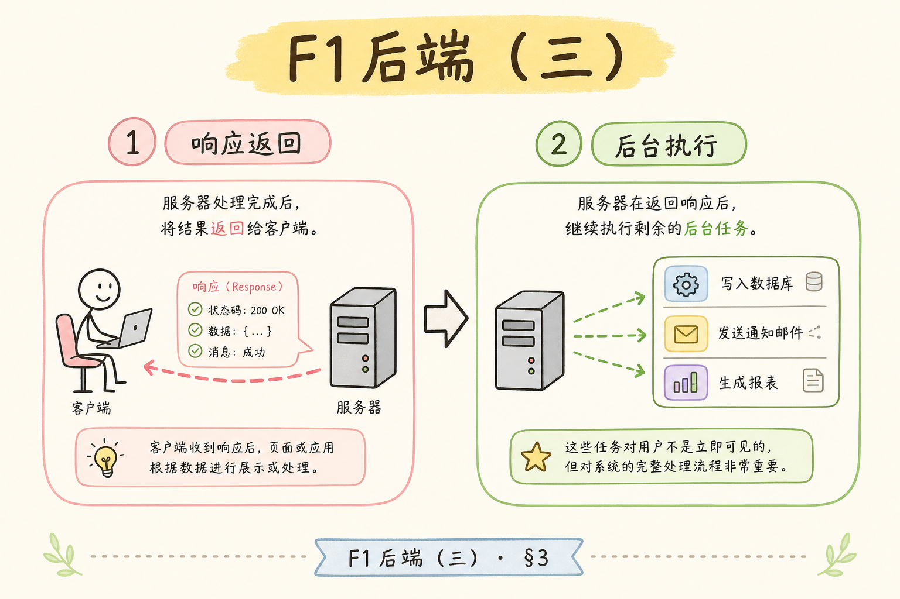
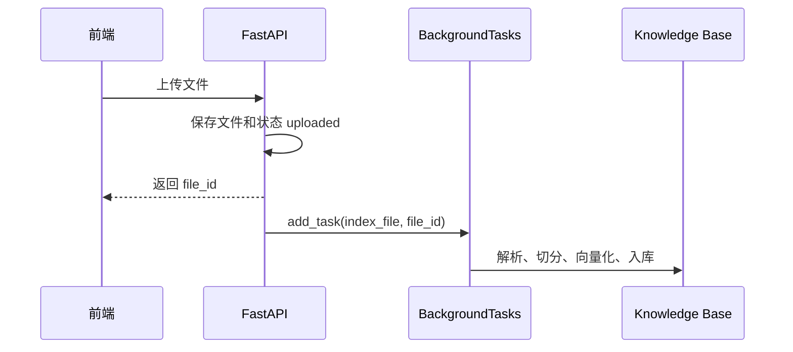
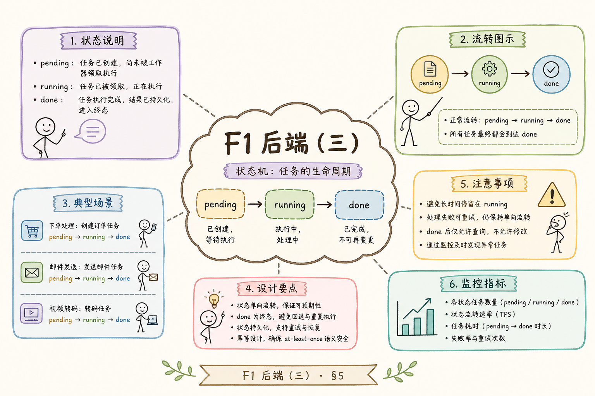
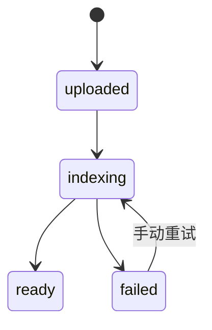
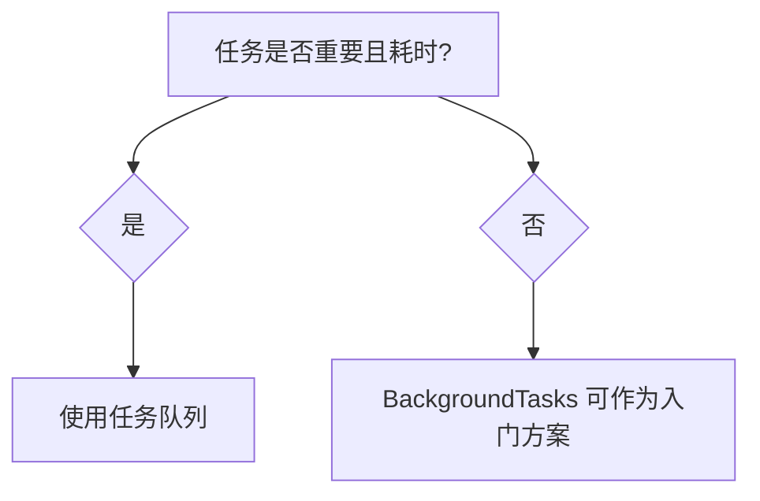
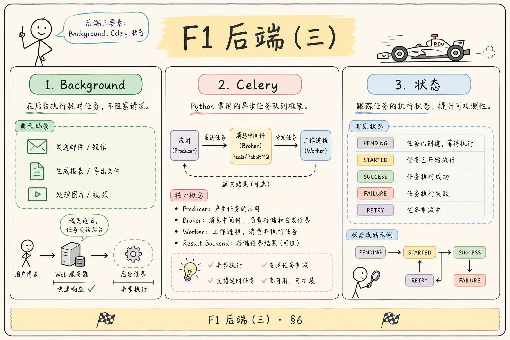

# F1 后端（三）：FastAPI BackgroundTasks 入门指南

> 上传接口若同步等待解析、切分、向量化，用户会卡在转圈页，网关也可能 504。**BackgroundTasks** 是 FastAPI 自带的轻量方案：先返回 `file_id`，再在同一个进程里继续跑索引——适合把 RAG 异步链路跑通，再决定是否上 Celery。

RAG 文件上传后，解析、切分、生成向量和写入知识库都可能很慢。如果上传接口一直等这些任务完成，用户会卡在请求里，服务也更容易超时。FastAPI 的 **BackgroundTasks** 可以在返回响应后继续做一些轻量后台工作，适合入门阶段理解“响应先返回，任务随后执行”的模式。

本文面向刚开始写 RAG 后端的读者。读完后，你应该能理解 BackgroundTasks 是什么、适合什么场景、不适合什么场景，并能写出一个“上传成功后后台更新索引状态”的最小示例。本篇是异步队列系列的起点；任务变重后请继续阅读 [159 Celery](159.celery-async-queue-tutorial.md) 与 [161 状态机](161.index-task-state-machine-tutorial.md)。

## 目录

- [1. 为什么上传接口不能一直等](#1-为什么上传接口不能一直等)
- [2. BackgroundTasks 是什么](#2-backgroundtasks-是什么)
- [3. 它在 RAG 索引流程中的位置](#3-它在-rag-索引流程中的位置)
- [4. 最小可运行示例](#4-最小可运行示例)
- [5. 状态机：uploaded / indexing / ready / failed](#5-状态机uploaded--indexing--ready--failed)
- [6. 什么时候不要用 BackgroundTasks](#6-什么时候不要用-backgroundtasks)
- [7. 日志、错误与重试](#7-日志错误与重试)
- [8. 常见错误](#8-常见错误)
- [9. FAQ](#9-faq)
- [10. 总结](#10-总结)

## 1. 为什么上传接口不能一直等

上传只是接收文件。索引才是把文件变成可检索资料。索引可能需要读文件、解析 PDF、切分文本、调用 embedding API、写向量库。任何一步慢或失败，都会拖住 HTTP 请求。

更好的用户体验是：上传接口快速返回 `file_id` 和状态，后台继续处理。前端通过状态接口查看是否完成。


这张图的重点是：用户请求不必等完整索引结束。

### 1.1 用户侧会发生什么

若上传接口同步等待索引，10MB PDF 可能占用连接 30～120 秒。移动端弱网时，用户以为“卡死”而重复点击上传，产生重复任务。先返回 `file_id`，前端展示“处理中”并轮询状态，体验更接近网盘或文档平台。

### 1.2 服务侧风险

| 风险 | 同步等待索引 | 先返回再后台处理 |
|------|--------------|------------------|
| 网关 / LB 超时 | 常见 30～60s 即 504 | 上传接口通常 <1s |
| Worker 连接占用 | 长连接占满线程池 | 短请求释放连接 |
| 失败反馈 | 超时后用户不知成败 | `failed` + `error` 可展示 |
| 水平扩展 | 多副本各跑各的后台任务 | 需外部队列（见 159） |

初学阶段用 BackgroundTasks 理解“拆请求”即可；生产多实例时，进程内后台任务无法跨机器协调，必须升级队列。

## 2. BackgroundTasks 是什么

**BackgroundTasks** 是 FastAPI 提供的轻量后台任务机制。通俗说，它允许你在响应返回后，让同一个应用进程继续执行一个函数。

它适合：

| 适合场景 | 例子 |
|---|---|
| 轻量异步收尾 | 写日志、发送通知 |
| 开发阶段后台处理 | 小文件索引、状态更新 |
| 不需要跨进程可靠队列 | 本地 Demo 或低风险任务 |

它不等于 Celery 这类任务队列。进程退出、服务重启、任务耗时太长时，BackgroundTasks 的可靠性有限。

### 2.1 执行时机（直觉）

BackgroundTasks 基于 Starlette：响应体发送完毕后，在**同一 ASGI 请求生命周期内**依次执行 `add_task` 注册的任务。不是独立进程，也不是持久化队列；任务列表随请求结束而执行，执行完才释放与该请求相关的资源。

### 2.2 与 `asyncio.create_task` 的区别

| 方式 | 特点 | RAG 索引 Demo |
|------|------|----------------|
| BackgroundTasks | 与 FastAPI 集成，同步/异步函数均可注册 | 推荐入门 |
| `create_task` | 需自己管理异常与生命周期 | 灵活但易漏错误处理 |
| 线程池 `run_in_executor` | CPU 密集可能缓解 GIL | 仍占 Web 进程资源 |

索引若含阻塞 I/O（读盘、调 API），BackgroundTasks 里跑同步函数往往够用；极重 CPU 解析仍建议独立 worker（159 起）。

## 3. 它在 RAG 索引流程中的位置

BackgroundTasks 可以放在上传接口后面，负责启动索引函数。





这个模式适合先把链路跑通。生产环境如果任务重要、耗时长、需要重试和分布式执行，应该升级到专门队列。

### 3.1 在整条 F1 链路中的位置


158 解决“别让上传接口堵死”；159 起解决“任务可靠、可扩展、可恢复”。没有状态机（161），即便用了 BackgroundTasks，前端仍不知道何时能问答。

## 4. 最小可运行示例

下面示例用内存字典模拟文件状态。真实项目应使用数据库保存状态。


安装依赖：

```bash
pip install fastapi uvicorn
```

示例代码：

```python
import time
from fastapi import BackgroundTasks, FastAPI

app = FastAPI()
files = {}


def index_file(file_id: str) -> None:
    files[file_id]["status"] = "indexing"
    try:
        time.sleep(2)
        files[file_id]["chunks"] = 12
        files[file_id]["status"] = "ready"
    except Exception as exc:
        files[file_id]["status"] = "failed"
        files[file_id]["error"] = str(exc)


@app.post("/files/{file_id}")
def upload(file_id: str, background_tasks: BackgroundTasks):
    files[file_id] = {"status": "uploaded"}
    background_tasks.add_task(index_file, file_id)
    return {"file_id": file_id, "status": "uploaded"}


@app.get("/files/{file_id}")
def get_status(file_id: str):
    return files.get(file_id, {"status": "not_found"})
```

运行后，上传接口会立即返回，几秒后状态会从 `uploaded` 变成 `ready`。

### 4.1 本地验证步骤

1. 保存为 `main.py`，执行 `uvicorn main:app --reload`
2. `POST /files/demo-1`（可用 Swagger `/docs`）
3. 立刻 `GET /files/demo-1`，应看到 `uploaded` 或 `indexing`
4. 约 2 秒后再次查询，应变为 `ready`，且 `chunks` 为 12

### 4.2 从 Demo 到生产的替换点

| Demo 做法 | 生产应替换为 |
|-----------|--------------|
| 内存 `files` 字典 | PostgreSQL / Redis 任务表（161） |
| `time.sleep(2)` 模拟 | 真实 Parser + Embedder + VectorStore |
| 无 `task_id` | 独立任务 ID，便于审计与重试 |
| 无日志 | 结构化日志 + `file_id` 关联 |

代码形状可保持不变，只替换 `index_file` 内部实现与存储后端。

## 5. 状态机：uploaded / indexing / ready / failed

后台任务必须配合状态机。否则前端不知道文件是否可问答，后端也难以排查失败。





四个状态可以这样理解：

| 状态 | 含义 |
|---|---|
| `uploaded` | 文件已保存，尚未开始处理 |
| `indexing` | 正在解析、切分、向量化 |
| `ready` | 已可被 RAG 检索 |
| `failed` | 索引失败，需要查看错误或重试 |

状态要写入数据库或持久存储。内存字典只适合演示。

### 5.1 前端如何配合

初期可用**轮询**：上传成功后每 2～3 秒 `GET /files/{file_id}`，直到 `ready` 或 `failed`。不要在 `indexing` 时开放问答按钮，否则用户会问“为什么搜不到刚传的文件”。`failed` 时展示 `error` 并提供“重试”（新请求触发重新 `add_task` 或入队，见 162 幂等）。

### 5.2 何时增加 `queued`

单进程 Demo 可从 `uploaded` 直接进 `indexing`。一旦引入 Celery（159），应在入队后先标 `queued`，worker 拉起后再标 `indexing`，避免用户以为“已开始处理”实则还在 Redis 里排队。

## 6. 什么时候不要用 BackgroundTasks

BackgroundTasks 不是可靠任务队列。以下场景不建议继续使用它：

| 场景 | 更合适方案 |
|---|---|
| 大文件处理很慢 | Celery、RQ、ARQ 等队列 |
| 需要失败重试 | 专门任务队列 |
| 多实例部署 | 外部队列和共享数据库 |
| 任务不能丢 | 持久化队列 |
| 需要进度上报 | 任务表 + worker |



初学阶段可以先用它理解流程，但要知道它的边界。

### 6.1 迁移信号清单

出现以下任一情况，建议停止新增 BackgroundTasks 索引逻辑，改为 159 的队列方案：

- 单文件索引 P95 超过 30 秒
- 部署 ≥2 个 API 副本（任务可能重复执行或丢失）
- 需要自动重试 embedding 429（163）
- 运维要求“重启不丢任务”
- 需要按租户限流或拆分优先级队列

## 7. 日志、错误与重试

后台任务的错误不会直接返回给上传请求，所以必须记录日志和状态。



建议至少保存：

| 字段 | 用途 |
|---|---|
| `file_id` | 定位任务 |
| `status` | 当前阶段 |
| `error` | 失败原因 |
| `started_at` | 排查耗时 |
| `finished_at` | 判断完成时间 |

如果任务失败，把状态置为 `failed`，并提供一个重试接口。不要让失败悄悄消失。

### 7.1 后台任务里的日志

`index_file` 内至少打三条：开始（`indexing`）、成功（`ready` + chunk 数）、失败（异常类型 + message）。日志带上 `file_id`，便于与 API 访问日志关联。生产环境用 JSON 结构化日志，避免只在 stdout 里留一句 `Error`。

### 7.2 手动重试接口（形状）

重试不必改上面示例的数据结构：新增 `POST /files/{file_id}/retry`，校验当前为 `failed`，将状态置回 `uploaded` 或 `indexing`，再 `background_tasks.add_task(index_file, file_id)`。重试前若已部分写入向量，必须配合 [162 幂等](162.idempotent-reindex-tutorial.md)，否则重复 chunk 会污染检索。

## 8. 常见错误

第一个错误是把 BackgroundTasks 当成生产级队列。它没有完整的持久化、分布式调度和重试能力。

第二个错误是不保存状态。用户只能看到上传成功，却不知道索引是否完成。

第三个错误是在后台任务里吞掉异常。异常必须写入日志和状态字段。

第四个错误是把大文件处理放在同一个 Web 进程里跑太久。长任务会影响服务稳定性，应迁移到 worker。

### 8.1 其他易踩坑

| 现象 | 常见原因 | 处理 |
|------|----------|------|
| 返回 200 但永远不 `ready` | 后台异常未写 `failed` | try/except 写状态 + 日志 |
| 重启后任务消失 | 进程内任务不持久化 | 上 Celery 或重启后扫 `indexing` 超时任务 |
| 多实例重复索引 | 两副本各 `add_task` | 单写入点 + 队列，或 DB 乐观锁 |
| 上传很快、问答很慢 | 未等 `ready` 就检索 | 前端门禁 + API 校验状态 |

## 9. FAQ

**Q：BackgroundTasks 会阻塞当前响应吗？**  
响应会先返回，任务随后执行。但任务仍在应用进程里运行，不适合承载重任务。

**Q：服务重启后任务还会继续吗？**  
通常不会。需要可靠执行时，应使用持久化任务队列。

**Q：它适合 RAG 文件索引吗？**  
适合学习和小规模 Demo。生产环境建议使用 Celery、ARQ、RQ 等任务队列。

**Q：前端怎么知道任务完成？**  
提供状态查询接口，例如 `GET /files/{file_id}`，返回 uploaded、indexing、ready 或 failed。

**Q：能在 BackgroundTasks 里再调 LLM 做摘要吗？**  
可以，但耗时与失败面更大。Demo 可接受；生产建议与索引拆成独立任务或队列。

**Q：和 `def upload(...): asyncio.create_task(...)` 比哪个好？**  
入门用 BackgroundTasks 更贴合 FastAPI 文档与测试习惯；复杂并发自己管任务组时用 asyncio。

## 10. 总结

FastAPI BackgroundTasks 适合帮助初学者理解“接口快速返回，后台继续处理”的模式。它可以用于小规模 RAG 上传索引 Demo，但不是可靠任务队列。

实现时要配合状态机、日志和错误记录。等任务变重、部署变多、失败需要重试时，就应该迁移到专门的异步队列。下一篇 [159 Celery](159.celery-async-queue-tutorial.md) 讲如何把索引交给独立 worker，并配合 [161 状态机](161.index-task-state-machine-tutorial.md)、[162 幂等](162.idempotent-reindex-tutorial.md)、[163 重试与死信](163.retry-dead-letter-tutorial.md) 组成可运维的索引管道。
