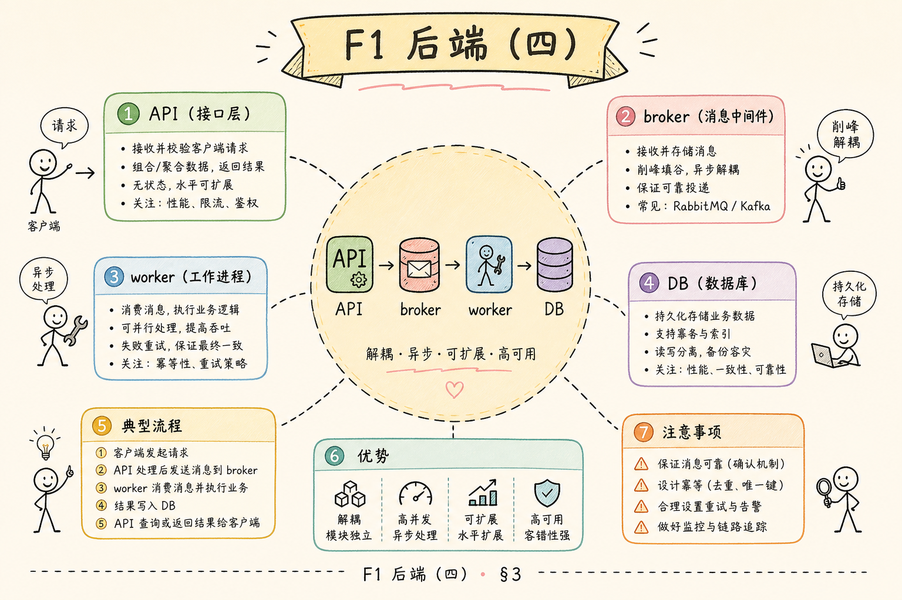
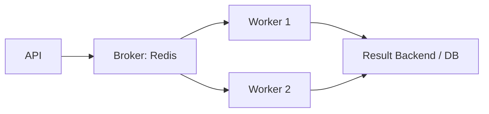
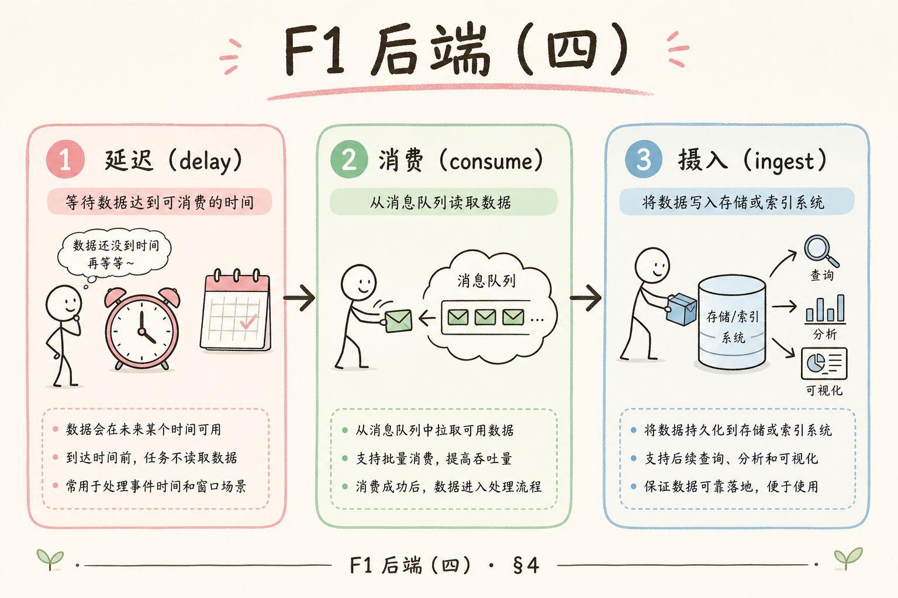
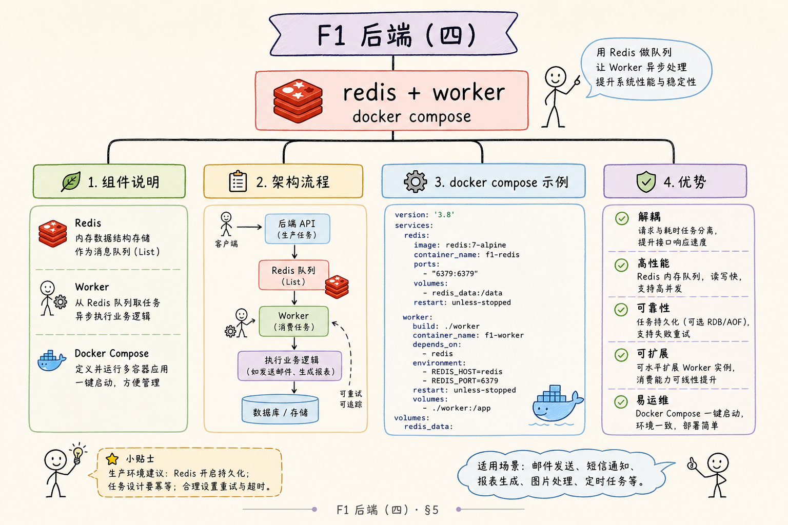
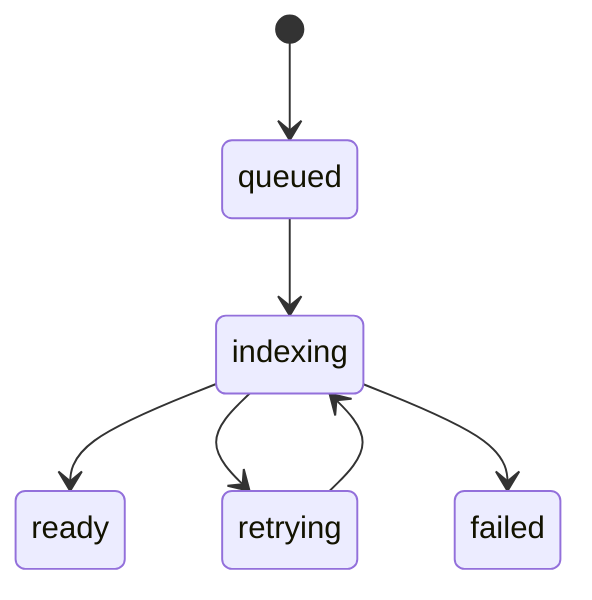
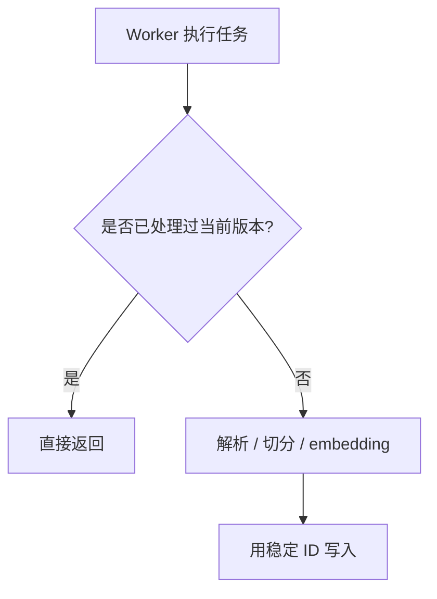
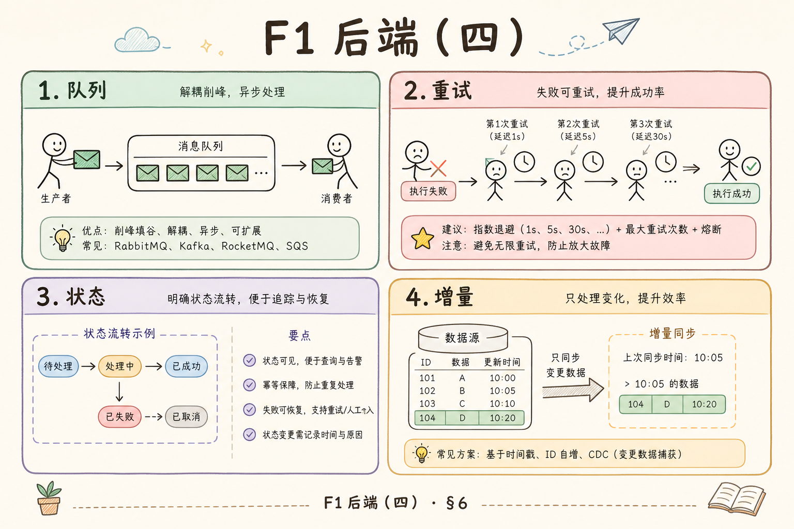

# F1 后端（四）：Celery RAG 异步任务队列入门指南

> BackgroundTasks 扛不住大文件、多副本和自动重试时，就需要把索引从 Web 进程里拆出去。**Celery** 是 Python 生态里最常用的分布式任务队列：API 只负责入队，worker 专门跑解析、embedding 和写库。

当 RAG 系统开始处理较大的文件、较多用户上传或较慢的 embedding 调用时，FastAPI BackgroundTasks 就不够稳了。你需要一个真正的任务队列，把耗时任务交给 worker 执行，并支持重试、状态记录和扩展。Celery 就是 Python 生态里常用的异步任务队列。

本文面向刚开始做 RAG 后端工程化的读者。读完后，你应该能理解 Celery 是什么、它解决了 BackgroundTasks 的哪些问题、RAG 索引任务如何入队，并能搭出一个最小的 API + worker 流程。请与 [161 状态机](161.index-task-state-machine-tutorial.md)、[162 幂等](162.idempotent-reindex-tutorial.md)、[163 重试](163.retry-dead-letter-tutorial.md) 一起落地。

## 目录

- [1. 为什么 RAG 需要任务队列](#1-为什么-rag-需要任务队列)
- [2. Celery 是什么](#2-celery-是什么)
- [3. Broker、Worker、Result Backend](#3-brokerworkerresult-backend)
- [4. RAG 索引任务流程](#4-rag-索引任务流程)
- [5. 最小可运行示例](#5-最小可运行示例)
- [6. 状态、重试与幂等](#6-状态重试与幂等)
- [7. 什么时候升级队列设计](#7-什么时候升级队列设计)
- [8. 常见错误](#8-常见错误)
- [9. FAQ](#9-faq)
- [10. 总结](#10-总结)

## 1. 为什么 RAG 需要任务队列

RAG 索引任务通常包括解析、清洗、切分、embedding、写入 VectorStore。它们耗时长、可能失败、可能需要重试。把这些逻辑放在 Web 请求里，会导致超时和不稳定。

任务队列的作用是把“接收请求”和“执行重活”拆开。API 只负责创建任务，worker 负责慢慢处理。


这张图的重点是：Web 服务和索引 worker 可以独立扩展。

### 1.1 从 BackgroundTasks 迁过来的理由

[158](158.fastapi-background-tasks-tutorial.md) 里索引与 HTTP 同进程。以下情况会迅速触顶：

| 症状 | 根因 | 队列能做什么 |
|------|------|--------------|
| 上传 OK、检索没有新文档 | 进程重启丢任务 | Broker 持久化 + 可重投 |
| 高峰全体变慢 | Web 与索引抢 CPU | 独立扩 worker |
| embedding 429 成片失败 | 无退避重试 | `retry` + countdown（163） |
| 两副本重复索引 | 各跑各的后台任务 | 单队列消费 + 幂等（162） |

### 1.2 RAG 索引作为“天然后台任务”

索引具备后台任务的全部特征：输入是 `file_id` 而非用户等待的同步结果；步骤可分钟级；依赖外部 Parser、Embedding API、向量库；失败应可恢复。这类任务几乎总是“API 受理 + 队列执行”。

## 2. Celery 是什么

**Celery**：Python 的分布式任务队列框架。通俗说，它像一个任务分发系统：API 把任务放进队列，worker 从队列取任务执行。

Celery 适合：

| 场景 | 说明 |
|---|---|
| 耗时任务 | 文件解析、embedding、批量处理 |
| 失败重试 | API 调用失败后自动重试 |
| 多 worker 扩展 | 增加 worker 数量提升处理能力 |
| 定时任务 | 定期重建索引或清理失败任务 |

它不是 RAG 专用工具，而是通用后台任务系统。RAG 只是非常适合使用它的场景之一。

### 2.1 心智模型

把 Celery 想成**餐厅**：API 是前台只接单；Broker 是传菜口；Worker 是后厨；业务数据库里的 `index_tasks` 是订单状态屏（给顾客看）。Result Backend 更像后厨内部的便签，不能替代订单屏。

### 2.2 与 RQ、ARQ 的粗对比

| 框架 | 特点 | 何时考虑 |
|------|------|----------|
| Celery | 生态成熟、功能全 | 复杂 RAG、多队列、定时任务 |
| RQ | 极简 Redis 队列 | 小团队、任务类型少 |
| ARQ | async Python | 见 [160](160.bull-arq-node-queue-tutorial.md) |

本篇以 Celery 为代表讲透 Broker / Worker / 重试；换 RQ 时概念仍适用。

## 3. Broker、Worker、Result Backend

Celery 有三个核心角色。

| 角色 | 白话解释 | 常见选择 |
|---|---|---|
| Broker | 任务队列，负责传递任务 | Redis、RabbitMQ |
| Worker | 执行任务的进程 | Celery worker |
| Result Backend | 保存任务结果或状态 | Redis、数据库 |





在 RAG 项目里，任务状态最好写入业务数据库。Celery 的结果后端可以辅助查看，但不应替代业务状态表。

### 3.1 本地最小拓扑

```text
终端 1: redis-server
终端 2: celery -A tasks worker --loglevel=info
终端 3: uvicorn api:app
```

API 与 worker **必须能连同一 Broker**；worker 与 API 无需同机，但需能读对象存储、向量库和业务库。

### 3.2 业务状态 vs Result Backend

| 数据 | 放哪里 | 原因 |
|------|--------|------|
| `status=indexing`、失败原因 | PostgreSQL `index_tasks` | 前端查询、审计 |
| Celery `task.id`、返回值 | Redis backend（可选） | 运维调试 |
| 文件内容、chunk | 对象存储 + 向量库 | 非消息体 |

前端不应直接读 Celery result key；统一走 [161](161.index-task-state-machine-tutorial.md) 的状态 API。

## 4. RAG 索引任务流程

一个 RAG 索引任务通常这样走：







状态含义：

| 状态 | 含义 |
|---|---|
| `queued` | 已入队，等待 worker |
| `indexing` | worker 正在处理 |
| `retrying` | 临时失败，等待重试 |
| `ready` | 索引完成 |
| `failed` | 多次失败后停止 |

状态机比“成功/失败”更有用，因为用户和运维都能看到任务卡在哪一步。

### 4.1 API 侧推荐顺序

1. 校验上传、写对象存储  
2. 插入 `index_tasks`，`status=queued`  
3. `index_file.delay(file_id)`，保存 `celery_task_id`（可选）  
4. 返回 `task_id` / `file_id` 给前端  

切勿先 `delay` 再写库：worker 可能比 API 事务更快，读到“任务不存在”。

### 4.2 Worker 侧阶段

在 `indexing` 内可再记子阶段（日志或 `stage` 字段）：`parsing` → `splitting` → `embedding` → `writing`。初学四态即可；排障频繁后再拆。

## 5. 最小可运行示例

下面是最小 Celery 任务。实际运行需要 Redis。

安装依赖：

```bash
pip install celery redis
```

`tasks.py`：

```python
from celery import Celery
import time

celery_app = Celery(
    "rag_tasks",
    broker="redis://localhost:6379/0",
    backend="redis://localhost:6379/1",
)


@celery_app.task(bind=True, max_retries=3)
def index_file(self, file_id: str):
    try:
        print(f"indexing {file_id}")
        time.sleep(2)
        return {"file_id": file_id, "status": "ready", "chunks": 12}
    except Exception as exc:
        raise self.retry(exc=exc, countdown=10)
```

API 入队示例：

```python
from tasks import index_file


def upload_done(file_id: str) -> dict:
    task = index_file.delay(file_id)
    return {"file_id": file_id, "task_id": task.id, "status": "queued"}
```

启动 worker：

```bash
celery -A tasks worker --loglevel=info
```

这个例子展示了最小链路：API 创建任务，worker 执行任务，任务结果进入 backend。

### 5.1 验证清单

- Redis 已监听 `6379`  
- worker 日志出现 `indexing {file_id}`  
- `task.id` 可在 Flower 或 `celery -A tasks result <id>` 查看（若配置了 backend）  
- 故意让 `time.sleep` 前 `raise Exception`：应看到重试与 `countdown=10`  

### 5.2 与真实 RAG 的衔接点

把 `time.sleep(2)` 换成：`parse_file` → `split_text` → `embed_chunks` → `upsert_vector_store`。`return` 中的 `chunks` 写入业务表；`self.retry` 仅捕获**可重试**异常（163），永久错误直接 `failed` 勿重试。

## 6. 状态、重试与幂等

Celery 支持重试，但你仍然要设计业务幂等。**幂等**就是同一个任务重复执行，也不会写出重复或错误数据。

RAG 索引常见幂等策略：

| 问题 | 做法 |
|---|---|
| 同文件重复入队 | 用 file_id 或 content_hash 去重 |
| 重试重复写向量 | 写入前删除旧 chunk 或使用稳定 chunk_id |
| 任务中途失败 | 每一步记录状态，可安全重跑 |
| 多 worker 同时处理 | 加锁或任务状态 CAS 更新 |



没有幂等设计，重试可能会制造重复数据。

### 6.1 Celery 重试与业务状态同步

`self.retry` 触发时，建议把业务表标为 `retrying` 并 `attempts += 1`，避免前端长期显示 `indexing` 却无进展。达 `max_retries` 后标 `failed` 或进死信（163）。重试间隔对 embedding 限流应指数退避，不要固定 10 秒打满 API。

### 6.2 幂等细节见 162

稳定 `chunk_id`、`content_hash`、先删后写或 upsert 的完整讨论在 [162](162.idempotent-reindex-tutorial.md)。队列只保证“再执行一次”；幂等保证“再执行一次结果仍正确”。

## 7. 什么时候升级队列设计

Celery 起步很快，但随着规模增加，需要更严格的队列设计。



| 信号 | 需要考虑 |
|---|---|
| 任务堆积 | 增加 worker 或拆分队列 |
| embedding 限流 | 控制并发和速率 |
| 大文件占用内存 | 分块处理 |
| 高优先级任务 | 多队列和优先级 |
| 失败难排查 | 增加死信队列和错误表 |

不要等任务全部堆死才加观测。队列长度、失败率、平均耗时、重试次数都应该记录。

### 7.1 多队列示例（概念）

| 队列名 | 任务 | 并发建议 |
|--------|------|----------|
| `index_small` | <5MB 文本 | 较高 |
| `index_large` | 大 PDF、扫描件 | 低，防 OOM |
| `reindex` | 全库重建 | 夜间批跑，限流 |

`index_file` 路由到不同 queue，避免一个大 PDF 堵死所有小文件。

### 7.2 观测指标

- Broker 队列深度（Redis `LLEN` 或 RabbitMQ 管理台）  
- Worker 消费速率、任务 P95 耗时  
- `retrying` / `failed` 占比  
- embedding 429 次数与退避是否生效  

## 8. 常见错误

第一个错误是把 Celery 结果后端当业务状态表。业务状态需要可查询、可展示、可审计，最好写入自己的数据库。

第二个错误是没有幂等。重试一旦发生，就可能重复写入向量或重复创建索引记录。

第三个错误是无限重试。重试要有次数、间隔和最终失败状态。

第四个错误是所有任务放一个队列。大文件索引可能堵住轻量任务，成熟后应按任务类型拆队列。

### 8.1 部署与配置类

| 错误 | 后果 |
|------|------|
| worker 与 API 连不同 Redis DB | 任务永远不被消费 |
| 未设 `task_acks_late` 且 worker 被 kill | 任务可能丢 |
| 在 task 里传巨大 binary | Broker 膨胀、变慢 |
| 忽略时区与 `countdown` | 重试高峰叠加 |

消息体只传 `file_id`、`knowledge_base_id` 等 ID，文件走对象存储（与 [160](160.bull-arq-node-queue-tutorial.md) 相同原则）。

## 9. FAQ

**Q：Celery 和 BackgroundTasks 怎么选？**  
学习和轻量任务可以用 BackgroundTasks；重要、耗时、需要重试或多实例执行的任务用 Celery。

**Q：Broker 必须用 Redis 吗？**  
不必须，RabbitMQ 也常见。学习阶段 Redis 更容易启动。

**Q：任务结果存在 Redis 就够了吗？**  
不够。面向用户的文件状态、失败原因、索引版本应写入业务数据库。

**Q：Celery 能保证任务永不丢吗？**  
它能提高可靠性，但仍需要正确配置确认机制、持久化、重试和幂等。

**Q：一个 file 多次上传会多个 Celery 任务吗？**  
通常会。应用层用 `content_hash` 或“进行中的任务”去重，避免重复入队。

**Q：能用 Celery Beat 做定时全库重建吗？**  
可以，但务必限流、幂等，并单独队列，避免与实时上传抢 worker。

## 10. 总结

Celery 把 RAG 中耗时的索引工作从 Web 请求中拆出来，让 API 快速返回，让 worker 专门处理重任务。它适合文件解析、embedding、重建索引等后台工作。

初学者落地时要同时设计状态机、重试和幂等。只会把任务丢进队列还不够，真正可靠的 RAG 后台任务必须能追踪、能重试、能安全重复执行。下一篇 [160](160.bull-arq-node-queue-tutorial.md) 介绍 Node 与轻量 Python 队列选型；[161](161.index-task-state-machine-tutorial.md)～[163](163.retry-dead-letter-tutorial.md) 补齐状态、幂等与失败收敛。
