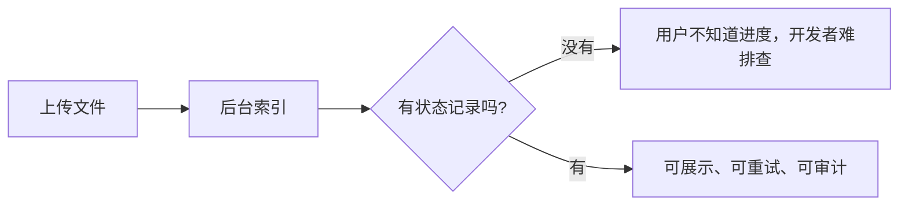
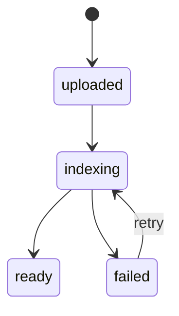
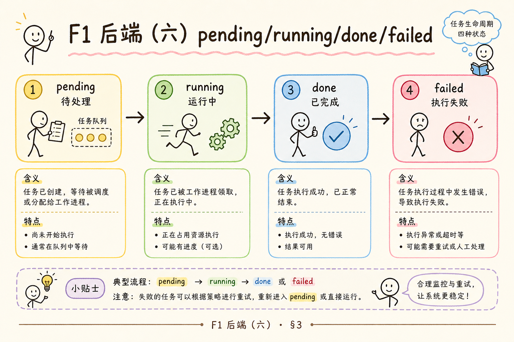
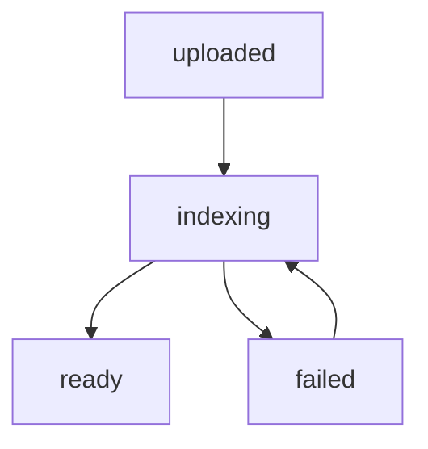
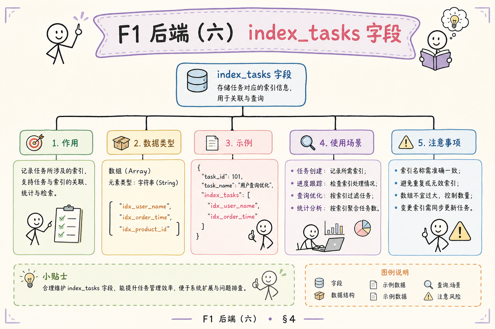
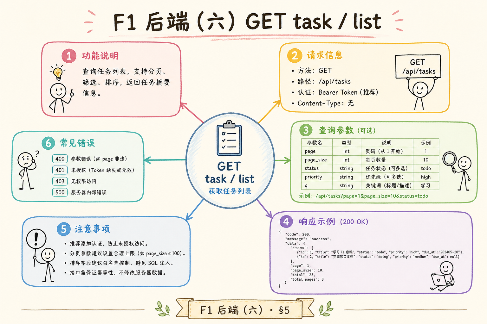
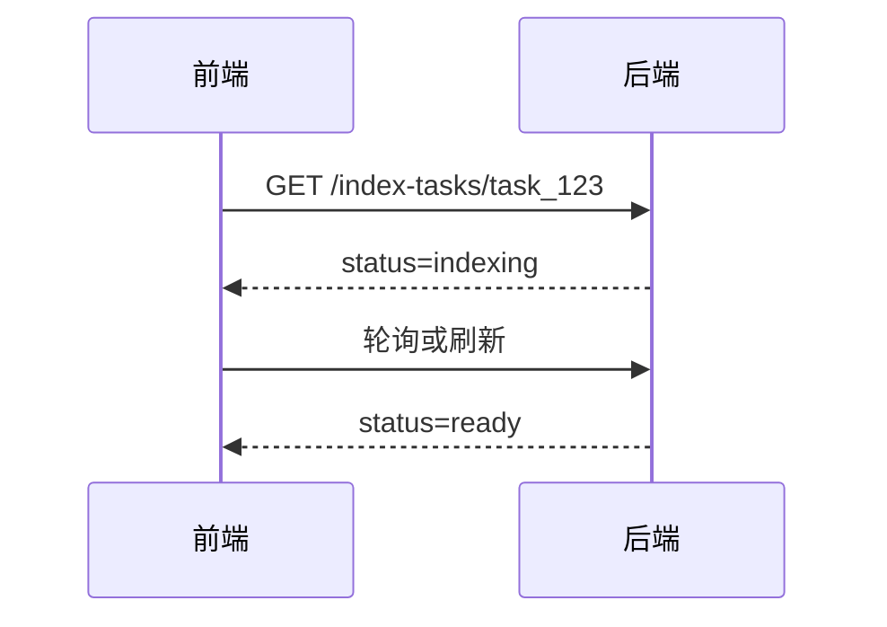
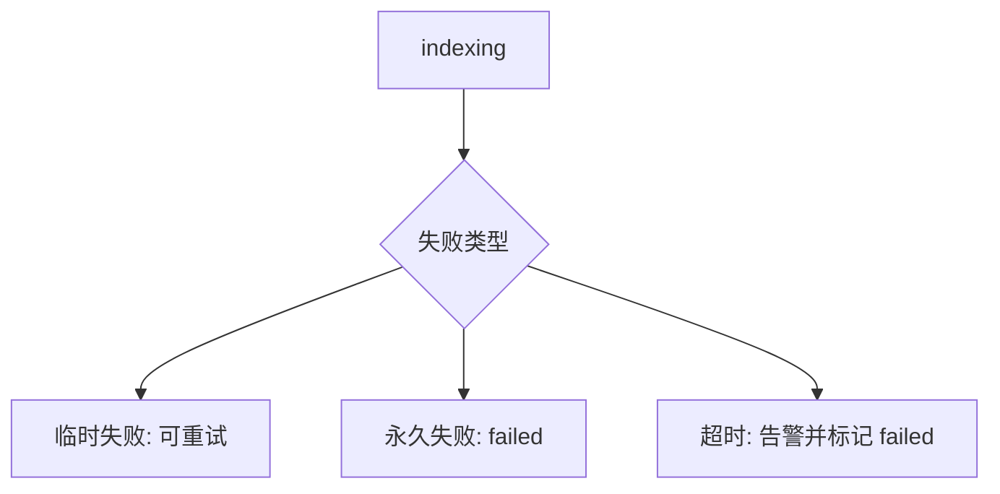

# F1 后端（六）：索引任务状态机入门指南

> 队列负责“什么时候跑”，状态机负责“跑到哪一步了”。没有 `uploaded → indexing → ready / failed`，用户只会看到“已上传”，运维也无法区分排队、执行中与真失败。

RAG 文件上传后，后台会解析、切分、向量化、写入知识库。这个过程可能成功、失败、重试，也可能卡在某一步。如果系统只记录“上传成功”，用户和开发者都不知道文件到底能不能问答。**索引任务状态机**要解决的就是这个问题：让每个文件处理过程都有清晰状态、可查询进度和可排查失败原因。

本文面向刚开始做 RAG 后端的读者。读完后，你应该能理解状态机是什么、为什么 RAG 索引需要它、最小四态模型如何设计，并能写出一个简单任务状态表和 API 形状。本篇连接 [158](158.fastapi-background-tasks-tutorial.md)～[160](160.bull-arq-node-queue-tutorial.md) 的异步执行与 [162](162.idempotent-reindex-tutorial.md)、[163](163.retry-dead-letter-tutorial.md) 的可靠写入。

## 目录

- [1. 为什么没有状态就不可运维](#1-为什么没有状态就不可运维)
- [2. 状态机是什么](#2-状态机是什么)
- [3. RAG 索引的最小四态模型](#3-rag-索引的最小四态模型)
- [4. 状态表怎么设计](#4-状态表怎么设计)
- [5. API 如何暴露状态](#5-api-如何暴露状态)
- [6. Worker 如何更新状态](#6-worker-如何更新状态)
- [7. 异常、重试与超时](#7-异常重试与超时)
- [8. 常见错误](#8-常见错误)
- [9. FAQ](#9-faq)
- [10. 总结](#10-总结)

## 1. 为什么没有状态就不可运维

用户上传文件后，最常问的是“什么时候能问”。如果后端没有状态，前端只能显示“已上传”，但实际上文件可能还没开始解析，也可能已经失败。

对开发者来说，没有状态也无法排查问题。你不知道失败发生在解析、切分、embedding 还是写库；也不知道任务是否还在排队。



状态机的价值是把后台黑盒变成可观察流程。

### 1.1 产品侧后果

| 无状态 | 有状态 |
|--------|--------|
| 用户反复刷新、重复上传 | 明确“处理中 / 可问答 / 失败” |
| 客服无法解释进度 | 可查 `task_id`、失败原因 |
| 无法做 SLA 统计 | 可算 `uploaded→ready` 耗时 P95 |
| 重试靠人工清库 | `failed` 一键重试（配合 162） |

### 1.2 与队列的关系

队列解决调度；状态机描述生命周期。Celery 任务在 Redis 里不等于用户眼里的“正在索引”——**业务库里的 `status` 才是产品真相**（159、160 均强调这一点）。

## 2. 状态机是什么

**状态机**：用有限个状态描述一个对象在流程中的位置，并规定状态之间可以如何切换。通俗说，它像快递物流：已揽收、运输中、派送中、已签收，每一步都有明确含义。

在 RAG 索引里，文件任务也需要类似状态。一个任务不能随便从 `ready` 跳回 `uploaded`，也不能失败后悄悄变成成功。状态切换要有规则。



这张图就是最小状态机。它定义了文件从上传到可检索的基本路径。

### 2.1 合法迁移 vs 非法迁移

| 迁移 | 是否允许 | 说明 |
|------|----------|------|
| `uploaded` → `indexing` | 是 | worker 开始消费 |
| `indexing` → `ready` | 是 | 成功写完向量 |
| `indexing` → `failed` | 是 | 不可恢复或达最大重试 |
| `failed` → `indexing` | 是 | 人工或 API 重试 |
| `ready` → `failed` | 慎 | 仅当后续校验发现数据损坏 |
| `ready` → `uploaded` | 否 | 破坏语义，应新版本重索引 |

实现时用 DB 条件更新：`UPDATE ... WHERE status='indexing'`，避免旧 worker 覆盖新状态。

### 2.2 状态机不是 UI 文案

前端展示可以写“处理中”，库里的枚举应保持稳定 `indexing`。文案多变、枚举稳定，日志和指标才能聚合。

## 3. RAG 索引的最小四态模型

初学阶段可以先用四个状态。

| 状态 | 含义 | 前端展示 |
|---|---|---|
| `uploaded` | 文件已保存，尚未开始索引 | 已上传，等待处理 |
| `indexing` | 正在解析、切分、向量化 | 处理中 |
| `ready` | 已写入知识库，可检索 | 可问答 |
| `failed` | 索引失败 | 处理失败，可重试 |

这个模型足够覆盖大多数入门场景。后续可以再增加 `queued`、`retrying`、`cancelled` 等状态。





状态不要设计太多。状态越多，前端和后端都要处理更多分支。先从少量明确状态开始。

### 3.1 何时加 `queued` 与 `retrying`

引入 [159](159.celery-async-queue-tutorial.md) 后建议加 `queued`：已 `delay` 但 worker 未领取。引入自动重试后加 `retrying`（163），与“仍在首次执行”的 `indexing` 区分，避免用户以为卡死。

### 3.2 与文件表、任务表分离

小 Demo 可把状态挂在 `files` 行上。生产更常见：

- `files`：文件元数据、存储路径  
- `index_tasks`：每次索引尝试一条（含 `attempts`、错误）  

同一 `file_id` 多次重建会有多条 task，便于审计。

## 4. 状态表怎么设计

状态需要持久化，不能只放内存。一个最小任务表可以包含：



| 字段 | 用途 |
|---|---|
| `task_id` | 唯一任务 ID |
| `file_id` | 对应上传文件 |
| `status` | 当前状态 |
| `error` | 失败原因 |
| `attempts` | 已尝试次数 |
| `created_at` | 创建时间 |
| `updated_at` | 更新时间 |

示例 SQL：

```sql
create table index_tasks (
  task_id text primary key,
  file_id text not null,
  status text not null,
  error text,
  attempts integer not null default 0,
  created_at timestamp not null,
  updated_at timestamp not null
);
```

生产系统还应保存 `tenant_id`、`knowledge_base_id`、`content_hash` 和索引版本，用于权限、幂等和排查。

### 4.1 推荐索引

```sql
-- 概念示例，按实际方言调整
create index idx_index_tasks_file_id on index_tasks(file_id);
create index idx_index_tasks_status_updated on index_tasks(status, updated_at);
```

便于：按文件查最新任务；扫描长时间 `indexing` 的超时任务。

### 4.2 `error` 字段写什么

存**可展示且可分类**的信息：`error_type`（如 `parse_error`）+ 简短 `error_message`。堆栈进日志，不要整段 traceback 给前端。永久错误与临时错误分类见 [163](163.retry-dead-letter-tutorial.md)。

## 5. API 如何暴露状态

前端需要通过 API 查询状态。最小接口可以是：

```http
GET /index-tasks/{task_id}
```

返回示例：

```json
{
  "task_id": "task_123",
  "file_id": "file_456",
  "status": "indexing",
  "error": null,
  "attempts": 1
}
```

如果状态是 `ready`，前端可以提示用户开始问答；如果是 `failed`，前端可以展示失败原因和重试按钮。





初期可以轮询状态。后续如果需要实时体验，再考虑 SSE 或 WebSocket。

### 5.1 轮询策略

| 阶段 | 建议间隔 | 说明 |
|------|----------|------|
| 刚上传 | 1～2s | 尽快反映 `queued`→`indexing` |
| `indexing` 超过 30s | 3～5s | 降负载 |
| `ready` / `failed` | 停止轮询 | 终态 |

可加 `Retry-After` 或响应字段 `poll_after_ms` 提示前端退避。

### 5.2 按 `file_id` 查最新任务

除 `GET /index-tasks/{task_id}` 外，常提供 `GET /files/{file_id}/index-status` 返回**最新一条**任务，方便上传页只拿 `file_id` 的场景（158）。

## 6. Worker 如何更新状态

Worker 执行任务时，要在关键阶段更新状态。不要只在最后写成功或失败。

```python
def run_index_task(task_id: str, file_id: str):
    update_task(task_id, status="indexing", attempts_increment=True)
    try:
        text = parse_file(file_id)
        chunks = split_text(text)
        vectors = embed_chunks(chunks)
        write_vector_store(file_id, chunks, vectors)
        update_task(task_id, status="ready", error=None)
    except Exception as exc:
        update_task(task_id, status="failed", error=str(exc))
        raise
```

这段代码的重点是：失败要写状态和错误原因，成功要明确写 `ready`。不要让任务异常只出现在日志里。

### 6.1 谁负责更新哪一步

| 时机 | 更新者 | 状态 |
|------|--------|------|
| 上传完成、入队前 | API | `queued` 或 `uploaded` |
| worker 领取任务 | Worker | `indexing` |
| 成功写库 | Worker | `ready` |
| 可重试失败 | Worker / 队列 | `retrying` |
| 终局失败 | Worker | `failed` |

API 与 worker 不要同时写终态；约定**单向推进**。

### 6.2 与幂等写库的顺序

向量化写入应遵循 [162](162.idempotent-reindex-tutorial.md)：先稳定 `chunk_id`，再 upsert。`ready` 应在**向量与元数据一致提交后**再标，避免“状态 ready 但检索为空”。

## 7. 异常、重试与超时

状态机必须考虑异常。常见异常包括解析失败、文件不存在、embedding 超时、向量库写入失败。

| 异常 | 状态处理 |
|---|---|
| 临时网络失败 | 进入 retrying 或保留 failed 后允许重试 |
| 文件格式不支持 | failed，提示用户 |
| 权限错误 | failed 或 rejected |
| 任务长时间无更新 | 标记超时并告警 |



不要无限重试。重试次数、间隔和最终失败状态都要明确。

### 7.1 `indexing` 超时扫描

定时任务（或 Celery Beat）查询：

```text
status = 'indexing' AND updated_at < now() - interval '30 minutes'
```

标为 `failed` 或 `stale`，并告警。worker 可能已崩溃但状态未改（158 进程内任务、worker OOM 均会发生）。

### 7.2 重试与死信衔接

达最大 `attempts` 后，不仅 `failed`，还可写入死信表供运维 replay（163）。状态机与死信是**同一任务的不同视角**：用户看 `failed`，运维看死信详情。

## 8. 常见错误

第一个错误是只有成功状态，没有处理中和失败状态。用户无法知道文件卡在哪里。


第二个错误是错误原因只写日志，不写任务表。前端和运营无法自助排查。

第三个错误是允许非法状态跳转。例如已 `ready` 的任务被旧 worker 写回 `failed`，会造成混乱。

第四个错误是没有超时检测。任务卡死后永远停在 `indexing`，用户只能等待。

### 8.1 并发与多副本

| 问题 | 对策 |
|------|------|
| 两个 worker 同时处理同一 `task_id` | 入队前去重；DB `FOR UPDATE` 或乐观锁 |
| 重试时旧 worker 仍在跑 | 版本号 / `lease_expires_at` |
| 用户连点重试 | API 幂等：仅 `failed` 可转 `indexing` |

## 9. FAQ

**Q：状态要存数据库还是 Redis？**  
面向用户和审计的状态建议存数据库。Redis 可以做临时队列或缓存，但不应是唯一记录。

**Q：是否需要进度百分比？**  
初期不需要。先把 uploaded、indexing、ready、failed 做准。百分比需要更细的阶段统计。

**Q：失败后能不能直接重跑？**  
可以，但要保证幂等，避免重复写入向量或旧结果污染新结果。

**Q：状态机和队列是什么关系？**  
队列负责调度任务，状态机负责描述任务生命周期。两者互补。

**Q：`ready` 之后用户改文件怎么办？**  
应触发新 `content_hash`、新 `index_task` 或 `reindexing` 状态，而不是覆盖旧任务历史。

**Q：能否用 Celery result 代替任务表？**  
不建议。result 过期、难关联租户、难审计；任务表是产品契约。

## 10. 总结

索引任务状态机让 RAG 文件处理过程可见、可查、可重试。它是上传、队列、索引和前端体验之间的关键连接层。

初学者先做好四态模型：uploaded、indexing、ready、failed。再配合任务表、状态 API、worker 状态更新和失败原因记录，系统就具备基本可运维能力。在此基础上阅读 [162 幂等](162.idempotent-reindex-tutorial.md) 与 [163 重试死信](163.retry-dead-letter-tutorial.md)，索引管道才算闭环。
