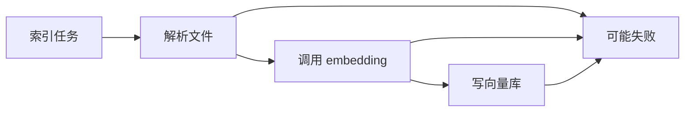
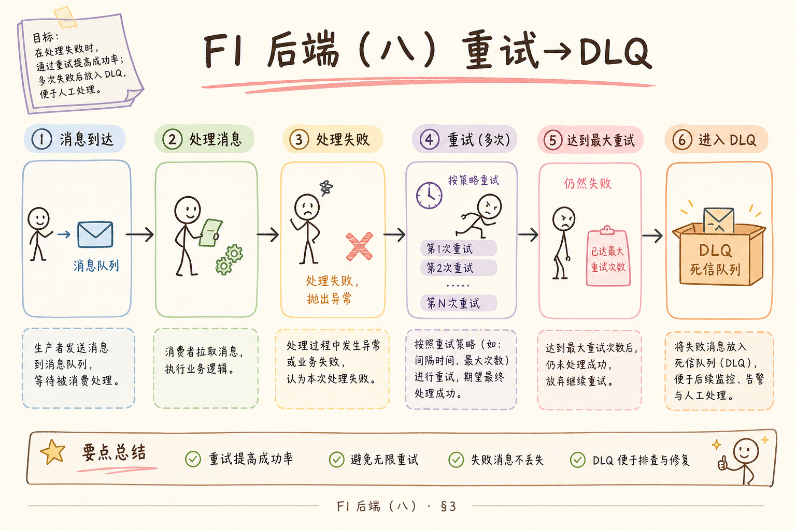
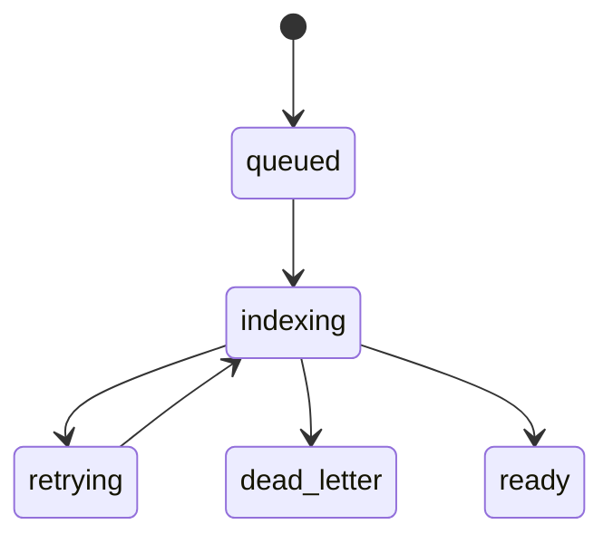
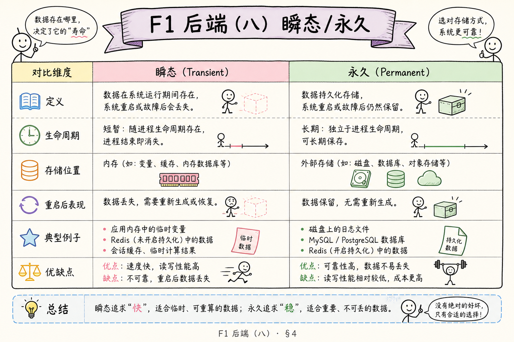
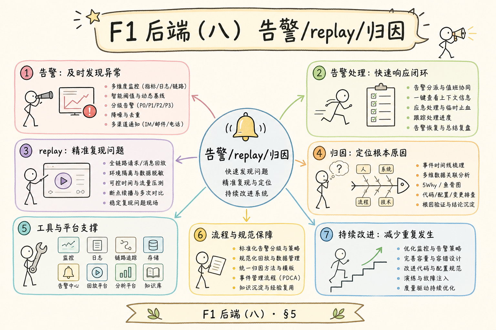
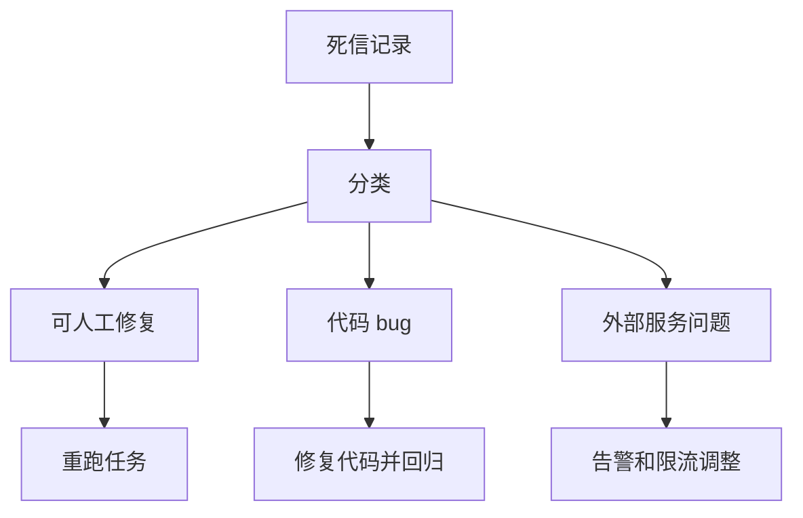

# F1 后端（八）：索引失败重试与死信入门指南

> 索引链路一定会失败：解析、限流、写库、worker 重启。可靠系统不是祈祷不失败，而是**临时错误自动重试**、**永久错误快速失败**、**多次失败进死信**供人工处理——且全程配合 [162 幂等](162.idempotent-reindex-tutorial.md)。

RAG 索引任务一定会失败：PDF 解析失败、embedding API 超时、向量库写入异常、队列 worker 重启。可靠系统不是假设任务永不失败，而是把失败分层处理：能重试的自动重试，不能重试的进入死信，方便人工排查。**重试与死信**要解决的就是后台任务失败后的收敛问题。

本文面向刚开始做 RAG 任务队列的读者。读完后，你应该能理解什么失败适合重试，什么是死信队列，如何设计重试次数和退避时间，并能写出一个最小的失败处理流程。请与 [159](159.celery-async-queue-tutorial.md) 队列、[161 状态机](161.index-task-state-machine-tutorial.md) 状态同步一起落地。

## 目录

- [1. 为什么失败是常态](#1-为什么失败是常态)
- [2. 重试是什么](#2-重试是什么)
- [3. 死信是什么](#3-死信是什么)
- [4. 哪些失败该重试](#4-哪些失败该重试)
- [5. 重试策略怎么设计](#5-重试策略怎么设计)
- [6. 最小可运行示例](#6-最小可运行示例)
- [7. 运维和告警](#7-运维和告警)
- [8. 常见错误](#8-常见错误)
- [9. FAQ](#9-faq)
- [10. 总结](#10-总结)

## 1. 为什么失败是常态

后台索引链路依赖很多外部条件。文件可能坏，网络可能抖，模型服务可能限流，向量库可能短暂不可用。如果没有失败处理，任务会卡住或丢失，用户只看到“处理中”永远不结束。



失败处理的目标不是掩盖错误，而是让每个失败有去处：重试、失败状态、死信、告警。

### 1.1 没有失败分层时会发生什么

| 情况 | 用户感受 | 系统后果 |
|------|----------|----------|
| 网络闪断 | 永远“处理中” | `indexing` 假活 |
| 坏 PDF | 无限重试 | 队列被垃圾任务占满 |
| embedding 429 | 立即连打 API | 限流加剧 |
| worker OOM | 任务静默丢失 | 无死信、无告警 |

[161](161.index-task-state-machine-tutorial.md) 提供可见状态；本篇提供**失败后往哪走**。

### 1.2 失败处理在三件套中的位置


重试若没有 162，会重复写向量；有 162 若无 163，临时错误仍可能把任务永远留在 `retrying`。

## 2. 重试是什么

**重试**：任务失败后，系统在稍后重新执行一次。通俗说，就是遇到临时问题先再试几次。

适合重试的通常是临时失败：

| 失败 | 是否适合重试 |
|---|---|
| 网络超时 | 适合 |
| embedding API 429 | 适合，但要等待 |
| 向量库短暂不可用 | 适合 |
| 文件格式不支持 | 不适合 |
| 用户无权限 | 不适合 |

重试不能无限进行。要设置最大次数，否则一个坏文件会一直占用队列资源。

### 2.1 重试与业务状态的对应

每次重试应更新 [161](161.index-task-state-machine-tutorial.md)：`attempts += 1`，临时失败标 `retrying` 或保持 `indexing` 并刷新 `updated_at`。用户不必知道第几次重试，但运维需要 `attempts` 排查。

### 2.2 重试风暴

大量任务同时失败若用相同固定间隔重试，会在同一秒再次打爆 embedding API。退避 + 抖动（见第 5 节）把重试摊开。

## 3. 死信是什么

**死信**（Dead Letter）：多次处理仍失败、或不适合继续重试的任务。通俗说，它是“自动系统处理不了，需要人工或专门流程看”的失败任务。

死信记录至少要包含：

| 字段 | 用途 |
|---|---|
| `task_id` | 定位任务 |
| `file_id` | 定位文件 |
| `error_type` | 区分失败类型 |
| `error_message` | 具体失败原因 |
| `attempts` | 尝试次数 |
| `last_failed_at` | 最近失败时间 |





死信不是垃圾桶。它是排查入口和后续修复依据。

### 3.1 死信 vs 用户看到的 `failed`

| 视角 | 展示 |
|------|------|
| 用户 | `failed` + 可读原因 + 重试按钮 |
| 运维 | 死信表 / DLQ，含堆栈、attempts、原始 payload |
| 审计 | 保留 `error_type` 统计 |

用户不需要术语 “Dead Letter”；后台需要可查询、可 replay 的死信存储。

### 3.2 实现形态

- **独立队列**：RabbitMQ DLX、Bull failed set  
- **数据库表**：`index_dead_letters`，与 `index_tasks` 关联  
- **对象存储归档**：超大错误上下文  

初期用 DB 表即可，关键是**可检索 + 可手动重投**。

## 4. 哪些失败该重试

判断是否重试，要区分临时错误和永久错误。



| 错误类型 | 示例 | 处理 |
|---|---|---|
| 临时错误 | 网络超时、限流、服务暂不可用 | 自动重试 |
| 永久错误 | 文件损坏、格式不支持 | 标记 failed 或死信 |
| 权限错误 | 用户无权访问知识库 | 不重试，拒绝 |
| 代码错误 | 解析器 bug | 死信并告警 |

一个实用规则是：外部服务暂时不可用可以重试；输入本身无效不应重试。

### 4.1 错误分类实现（概念）

```python
# 概念片段，非替换第 6 节示例
RETRYABLE = (TimeoutError, ConnectionError, RateLimitError)
PERMANENT = (UnsupportedFormatError, PermissionError)
```

Celery 里 `except PERMANENT: mark_failed()` 不 `retry`；`except RETRYABLE: raise self.retry(...)`。

### 4.2 灰色地带

| 错误 | 建议 |
|------|------|
| 单页 PDF 解析超时 | 有限次重试，可能文件过大 |
| 5xx 无 body | 重试 |
| 4xx 除 429 | 多数永久 |
| 向量维度不匹配 | 永久，需换模型重建 |

灰色错误应记入 `error_type`，事后用指标调策略。

## 5. 重试策略怎么设计

重试策略至少包含最大次数、等待时间和退避方式。

| 参数 | 示例 |
|---|---|
| 最大次数 | 3 次 |
| 初始等待 | 10 秒 |
| 退避 | 每次等待翻倍 |
| 抖动 | 增加随机延迟，避免同时重试 |





重试间隔不要太短。比如 embedding API 已经限流，马上重试只会继续失败。

### 5.1 指数退避公式（直觉）

第 `n` 次重试等待可设为：`min(cap, base * 2^n) + random_jitter`。例如 base=10s，cap=300s，则 10 → 20 → 40… 封顶 5 分钟。429 响应若带 `Retry-After`，应优先遵从。

### 5.2 与 Celery / Bull 参数对应

| 概念 | Celery | BullMQ |
|------|--------|--------|
| 最大次数 | `max_retries` | `attempts` |
| 等待 | `countdown` / `retry_backoff` | `backoff` 配置 |
| 死信 | 自定义 errback 写表 | `failed` job + 消费 |

框架负责调度；**分类哪些异常可重试**仍是业务代码责任。

## 6. 最小可运行示例

下面用 Python 模拟重试和死信。真实项目可以用 Celery、Bull、ARQ 等队列框架实现。

运行环境：Python 3.10+。

```python
dead_letters = []


class TemporaryError(Exception):
    pass


class PermanentError(Exception):
    pass


def index_file(file_id: str, attempt: int) -> None:
    if file_id.endswith(".bad"):
        raise PermanentError("文件格式不支持")
    if attempt < 2:
        raise TemporaryError("embedding 服务暂时不可用")
    print("indexed", file_id)


def run_with_retry(file_id: str, max_attempts: int = 3) -> None:
    for attempt in range(1, max_attempts + 1):
        try:
            index_file(file_id, attempt)
            return
        except TemporaryError as exc:
            if attempt == max_attempts:
                dead_letters.append({"file_id": file_id, "error": str(exc), "attempts": attempt})
        except PermanentError as exc:
            dead_letters.append({"file_id": file_id, "error": str(exc), "attempts": attempt})
            return


run_with_retry("doc.pdf")
run_with_retry("doc.bad")
print(dead_letters)
```

这个例子展示了基本分流：临时错误可以重试，永久错误直接进入死信。

### 6.1 运行预期

- `doc.pdf`：前两次 `TemporaryError`，第三次成功，**不进** `dead_letters`  
- `doc.bad`：第一次 `PermanentError`，**立即**进 `dead_letters`  
- 对照 [162](162.idempotent-reindex-tutorial.md)：若 `index_file` 会写向量，重试路径也必须幂等  

### 6.2 接到真实队列

把 `run_with_retry` 换成 Celery task 的 `self.retry` + `on_failure` 回调写 `dead_letters` 表；状态机用 [161](161.index-task-state-machine-tutorial.md) 同步 `retrying` / `failed`。

## 7. 运维和告警

死信需要有人看。否则只是把失败从队列挪到另一个角落。

建议监控：

| 指标 | 含义 |
|---|---|
| 重试次数 | 是否有外部服务波动 |
| 死信数量 | 是否有任务长期失败 |
| 失败类型分布 | 哪类问题最多 |
| 平均处理时间 | 队列是否积压 |
| 最老死信年龄 | 是否无人处理 |



死信处理后，应该能手动重跑任务，并记录处理结果。

### 7.1 值班 playbook（简）

1. 死信突增 → 看 `error_type` 是否集中 429/5xx → 调 embedding 限流或退避  
2. `parse_error` 突增 → 是否新格式、是否坏样本 → 修 parser 或标永久失败  
3. 最老死信 >24h → 指派处理或自动提醒  
4. replay 前确认 [162](162.idempotent-reindex-tutorial.md) 已上线  

### 7.2 告警阈值示例

| 指标 | 建议阈值（起步） |
|------|------------------|
| 死信 1h 增量 | >10 条 P2 |
| 队列深度 | >1000 且持续 15min P2 |
| 重试率 | >30% P3 |
| `indexing` 超时任务 | >0 条 P2 |

阈值按业务量调整；先有指标再谈优化。

## 8. 常见错误

第一个错误是无限重试。坏文件会反复占用队列，拖慢其他任务。


第二个错误是不区分错误类型。文件格式错误不该和网络超时一样处理。

第三个错误是死信没有上下文。只有“失败”两个字，无法排查。

第四个错误是没有幂等。重试会重复写入向量，导致知识库污染。

### 8.1 与状态机冲突

| 错误 | 后果 |
|------|------|
| 进死信但 UI 仍 `indexing` | 用户无限等待 |
| 重试未增 `attempts` | 无法判断是否该停 |
| replay 不产生新 `task_id` | 审计断裂 |

replay 建议新任务或新 `attempt`，并记 `replayed_from` 死信 ID。

## 9. FAQ

**Q：死信队列一定要单独队列吗？**  
不一定。初期可以用数据库表记录 dead_letter 状态。关键是可查询、可处理。

**Q：所有失败都应该进入死信吗？**  
不是。临时失败先重试；达到最大次数或永久失败再进入死信。

**Q：用户能看到死信吗？**  
用户不需要看到“死信”这个术语，但应该看到文件处理失败和可操作提示。

**Q：重试和幂等哪个更重要？**  
都重要。没有重试，临时失败无法恢复；没有幂等，重试可能写坏数据。

**Q：429 要重试几次？**  
少而慢，遵从 `Retry-After`，并全局限流；否则重试放大限流。

**Q：死信清理策略？**  
处理并 replay 成功后归档；未处理保留至少 30 天供审计（按合规调整）。

## 10. 总结

索引失败重试与死信让 RAG 后台任务从“失败就丢”变成“失败可恢复、不可恢复可排查”。它是生产化索引管道的基本能力。

初学者先区分临时错误和永久错误，设置最大重试次数，记录死信详情，并保证索引任务幂等。这样后台任务才不会因为一次失败变成长期不可用。至此 [158](158.fastapi-background-tasks-tutorial.md)～163 形成完整异步索引链路：入门后台 → 队列选型 → 状态可见 → 写入安全 → 失败收敛。
