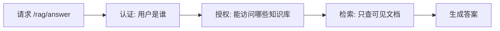
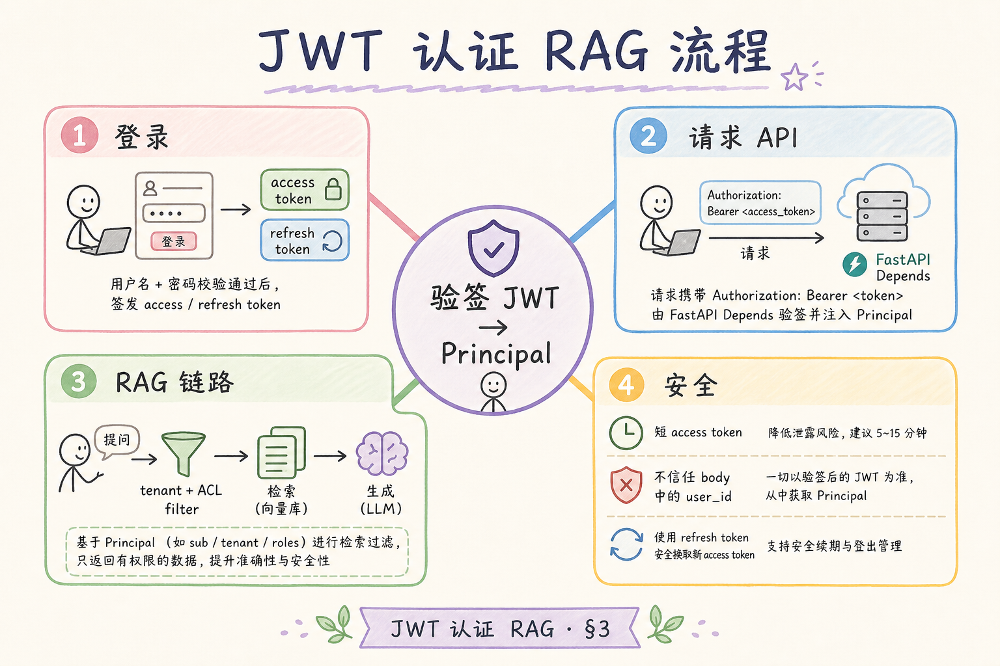
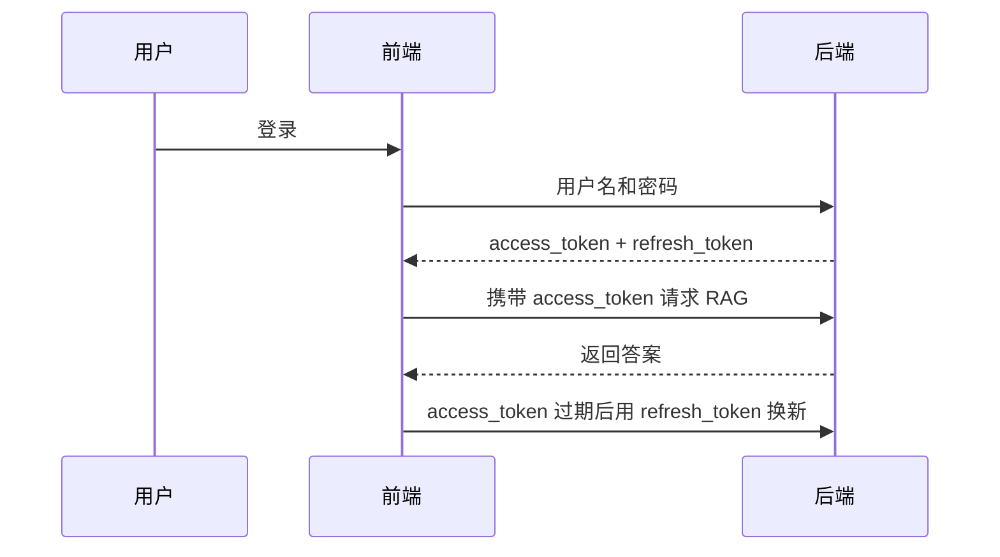
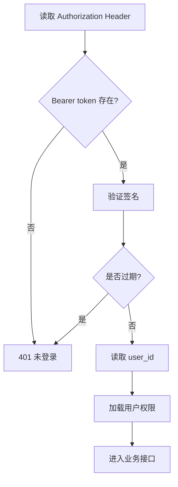
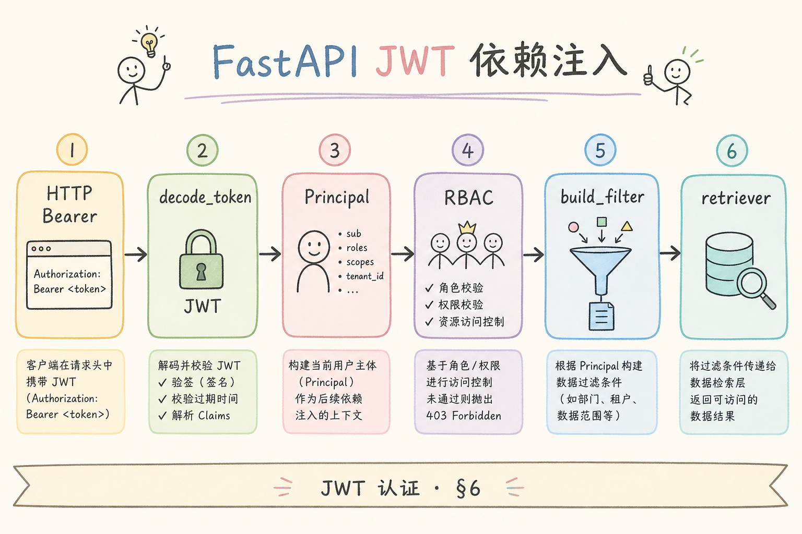
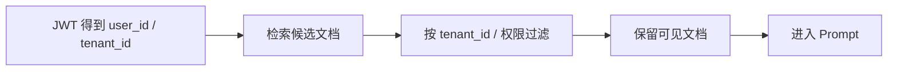

# F 后端与 API（九）：JWT 认证 RAG API 入门指南

RAG API 如果没有身份认证，就像把公司资料库门口的门禁拆掉。用户是谁、能看哪个知识库、能上传哪些文件、能调用哪些接口，都必须先确认。**JWT** 常用于前后端分离系统里的身份凭证，它能让后端在每次请求中识别用户。

本文面向刚开始写 RAG 后端的读者。读完后，你应该能理解 JWT 是什么、Access Token 和 Refresh Token 的区别、如何在 FastAPI 中保护接口，以及为什么认证之后还必须做文档权限过滤。

## 目录

- [1. 为什么 RAG API 必须先做身份](#1-为什么-rag-api-必须先做身份)
- [2. JWT 是什么](#2-jwt-是什么)
- [3. Access Token 与 Refresh Token](#3-access-token-与-refresh-token)
- [4. 一次认证请求如何流转](#4-一次认证请求如何流转)
- [5. FastAPI 最小示例](#5-fastapi-最小示例)
- [6. 把认证接进 RAG 检索](#6-把认证接进-rag-检索)
- [7. 安全边界与过期处理](#7-安全边界与过期处理)
- [8. 常见错误](#8-常见错误)
- [9. FAQ](#9-faq)
- [10. 总结](#10-总结)

## 1. 为什么 RAG API 必须先做身份

RAG 系统通常连接内部文档、客户资料、订单记录或业务知识库。模型本身不会天然知道“当前用户能看什么”。如果后端没有在检索前做权限过滤，模型可能拿到不该给当前用户看的资料。

认证的第一步是确认“你是谁”。授权的下一步是确认“你能做什么、能看什么”。JWT 主要帮助后端完成认证，但不能自动替你完成所有授权。



这张图的重点是顺序。不能先检索再让模型决定是否回答，权限必须在资料进入 prompt 前完成。

## 2. JWT 是什么

**JWT**（JSON Web Token）：一种把身份声明打包成字符串的令牌。通俗说，它像一张带签名的通行证，后端可以检查签名来确认它没有被篡改。

JWT 通常由三段组成：

```text
header.payload.signature
```

| 部分 | 白话解释 | 内容示例 |
|---|---|---|
| header | 说明令牌类型和签名算法 | `alg=HS256` |
| payload | 保存身份声明 | `sub=user_123`、`exp=过期时间` |
| signature | 防篡改签名 | 用密钥计算 |

JWT 的 payload 默认只是编码，不是加密。不要把密码、密钥、身份证号等敏感信息直接放进去。

## 3. Access Token 与 Refresh Token

很多系统会使用两种令牌：Access Token 和 Refresh Token。

| 令牌 | 作用 | 生命周期 |
|---|---|---|
| Access Token | 调用普通 API | 短，例如 15 分钟 |
| Refresh Token | 换新的 Access Token | 较长，例如 7 天 |

Access Token 短，是为了降低泄露后的风险。Refresh Token 长，是为了让用户不用频繁登录，但它更敏感，应更严格保护。





这张图说明：普通业务接口应使用 Access Token；Refresh Token 只用于刷新令牌，不应到处传。

## 4. 一次认证请求如何流转

前端调用受保护接口时，通常把 Access Token 放在 `Authorization` 请求头里。

```http
Authorization: Bearer eyJhbGciOi...
```

后端收到请求后要做几件事：取出 token、验证签名、检查过期时间、读取用户 ID、加载用户权限。



认证失败返回 401，权限不足返回 403。区分这两个状态，对前端体验和排查都很重要。

## 5. FastAPI 最小示例

下面用 FastAPI 演示一个受 JWT 保护的接口。为了突出流程，示例使用 `python-jose`。

安装依赖：

```bash
pip install fastapi uvicorn python-jose[cryptography]
```

示例代码：

```python
from datetime import datetime, timedelta, timezone

from fastapi import Depends, FastAPI, HTTPException
from fastapi.security import HTTPAuthorizationCredentials, HTTPBearer
from jose import JWTError, jwt

app = FastAPI()
security = HTTPBearer()

SECRET_KEY = "dev-secret-change-me"
ALGORITHM = "HS256"


def create_access_token(user_id: str) -> str:
    payload = {
        "sub": user_id,
        "exp": datetime.now(timezone.utc) + timedelta(minutes=15),
    }
    return jwt.encode(payload, SECRET_KEY, algorithm=ALGORITHM)


def get_current_user(
    credentials: HTTPAuthorizationCredentials = Depends(security),
) -> dict:
    token = credentials.credentials
    try:
        payload = jwt.decode(token, SECRET_KEY, algorithms=[ALGORITHM])
    except JWTError:
        raise HTTPException(status_code=401, detail="无效或过期的 token")

    user_id = payload.get("sub")
    if not user_id:
        raise HTTPException(status_code=401, detail="token 缺少用户信息")
    return {"user_id": user_id}


@app.get("/rag/answer")
def answer(question: str, user: dict = Depends(get_current_user)):
    return {
        "user_id": user["user_id"],
        "question": question,
        "answer": "这里接入受权限保护的 RAG 回答。",
    }
```

生产环境不要使用示例里的固定弱密钥。密钥应来自环境变量或密钥管理服务，并定期轮换。

## 6. 把认证接进 RAG 检索

认证完成后，RAG 系统还要根据用户身份过滤文档。常见做法是在文档 metadata 中保存 `tenant_id`、`owner_id` 或权限标签。

```python
def retrieve_visible_docs(question: str, user: dict) -> list[dict]:
    tenant_id = user["tenant_id"]
    candidates = vector_search(question, k=20)
    visible = [
        doc for doc in candidates
        if doc["metadata"].get("tenant_id") == tenant_id
    ]
    return visible[:5]
```

这段代码体现了核心原则：过滤要发生在资料进入 prompt 之前。不要把所有候选文档给模型，再要求模型“不要泄露”。





如果你的系统是多租户 RAG，这一步是安全底线。

## 7. 安全边界与过期处理

JWT 认证常见安全点包括密钥管理、过期时间、撤销机制和传输安全。

| 安全点 | 建议 |
|---|---|
| 密钥 | 不写死在代码里，使用环境变量 |
| 过期 | Access Token 保持较短有效期 |
| 撤销 | 重要系统可维护 token 版本或黑名单 |
| 传输 | 生产环境必须使用 HTTPS |
| 存储 | 浏览器端避免暴露给不可信脚本 |

JWT 的一个特点是后端可以无状态验证，但这也意味着“已发出去的 token”在过期前可能仍可用。需要强撤销时，要引入服务端状态，例如用户 `token_version`。

## 8. 常见错误

第一个错误是把 JWT 当加密容器。JWT payload 可以被解码查看，不要放敏感信息。

第二个错误是只认证不授权。知道用户是谁，不等于知道他能看哪些文档。RAG 检索必须结合权限过滤。

第三个错误是 token 永不过期。长时间有效的 Access Token 泄露后风险很高。

第四个错误是把权限判断交给模型。模型不是安全边界，权限必须由后端代码和数据过滤保证。

## 9. FAQ

**Q：JWT 和 Session 哪个更好？**  
没有绝对答案。JWT 适合前后端分离和多服务调用；Session 更容易服务端撤销。选择取决于系统架构和安全要求。

**Q：JWT payload 能放角色信息吗？**  
可以放少量稳定声明，例如 `role`，但关键权限最好仍从服务端加载或校验，避免角色变化后旧 token 继续生效。

**Q：Refresh Token 应该放哪里？**  
要根据前端形态决定。浏览器应用通常要重点防 XSS 和 CSRF，生产设计需要结合 Cookie、SameSite、HttpOnly 等策略。

**Q：模型回答里需要显示用户身份吗？**  
通常不需要。身份用于权限控制，不应无意义地暴露给用户或写入模型上下文。

## 10. 总结

JWT 能帮助 RAG API 识别当前用户，但它只是安全链路的一部分。真正可靠的 RAG 权限控制，还需要在检索前根据用户身份过滤知识库和文档。


初学者可以记住两句话：认证解决“你是谁”，授权解决“你能看什么”。RAG 的安全底线是让不可见资料永远不要进入 prompt，而不是指望模型帮你保密。
