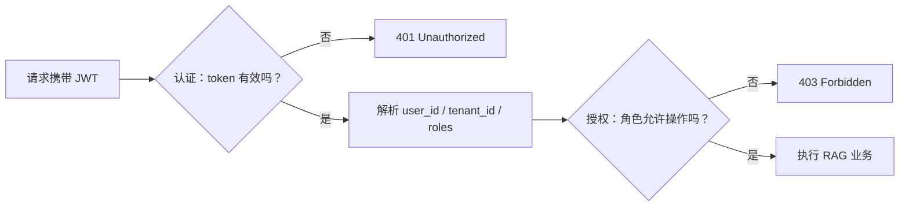
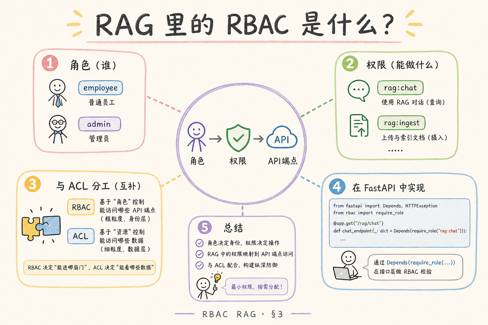
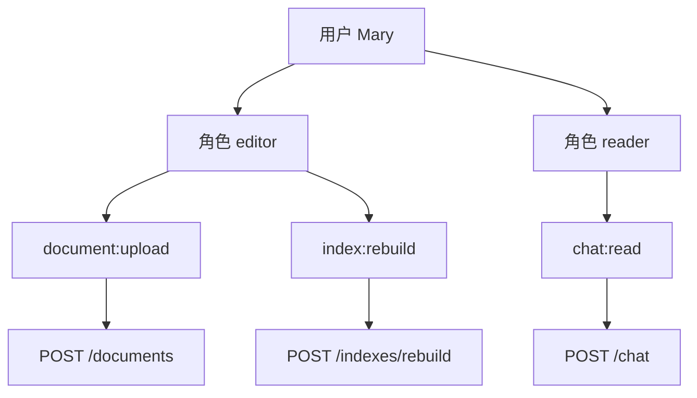
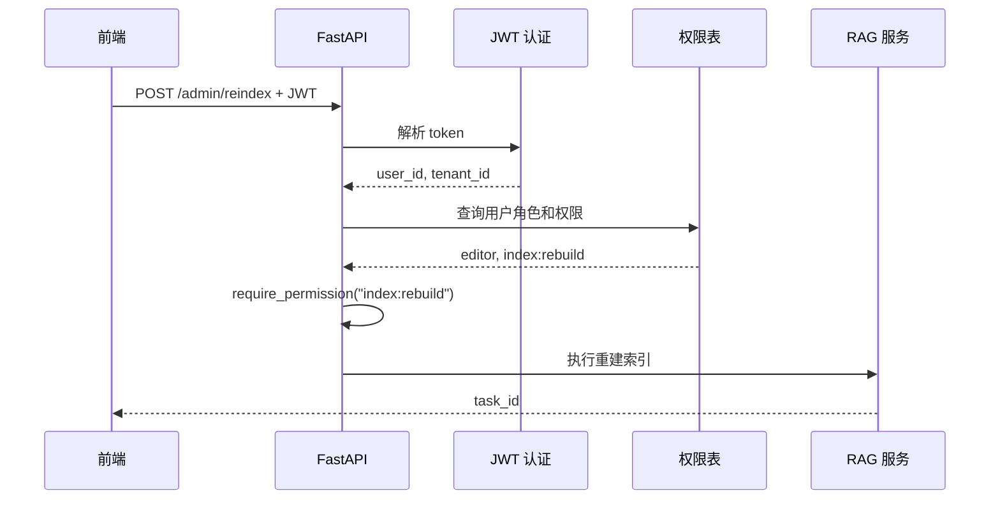
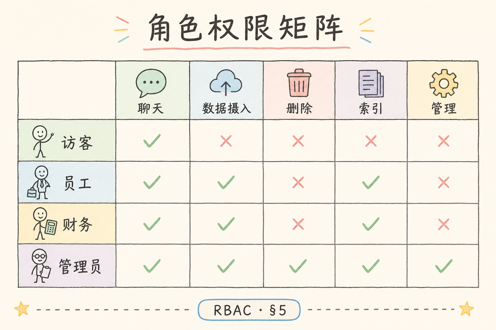
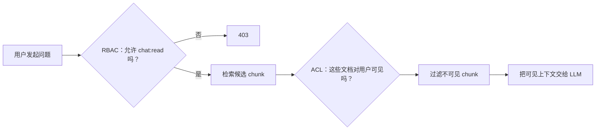

# F 后端与 API（十）：RBAC 角色权限 RAG 入门

RAG 系统接入登录之后，很多团队会以为“用户已经认证，所以可以访问系统”。这只解决了“你是谁”，还没有解决“你能做什么”。**RBAC**（Role-Based Access Control，基于角色的访问控制）就是用“角色”来管理操作权限：管理员可以建知识库，普通成员只能检索，审计人员只能查看日志。

本文面向刚做完 JWT 登录的初学者。读完后，你应该能给 RAG 后端加上最小可用的角色检查，并知道它和 ACL、多租户隔离分别管什么。

## 目录

- [1. 先分清认证和授权](#1-先分清认证和授权)
- [2. RBAC 解决什么问题](#2-rbac-解决什么问题)
- [3. RAG 系统里的角色与权限](#3-rag-系统里的角色与权限)
- [4. 请求经过 RBAC 的流程](#4-请求经过-rbac-的流程)
- [5. 最小 FastAPI 实现](#5-最小-fastapi-实现)
- [6. RBAC 与 ACL 如何配合](#6-rbac-与-acl-如何配合)
- [7. 权限缓存和变更](#7-权限缓存和变更)
- [8. 常见错误](#8-常见错误)
- [9. FAQ](#9-faq)
- [10. 总结](#10-总结)

## 1. 先分清认证和授权

**认证**（Authentication）回答“这个请求是谁发来的”。常见做法是用户登录后拿到 JWT，后端从 token 中解析出 user_id、tenant_id 等身份信息。

**授权**（Authorization）回答“这个用户是否允许做这件事”。比如同一个用户能不能上传文档、删除知识库、查看审计日志，都属于授权问题。

下面这张图把两件事拆开看。认证失败，请求根本进不了业务；认证通过后，还要继续做角色权限判断。



从图里要记住一个结论：401 是“我不知道你是谁”，403 是“我知道你是谁，但你不能做这件事”。

## 2. RBAC 解决什么问题

RBAC 的核心是把权限挂到角色上，再把角色分配给用户。它解决的是“不要在每个接口里手写一堆用户名判断”的问题。

没有 RBAC 时，代码很容易变成这样：

```python
if username == "alice" or username == "boss":
    delete_document(doc_id)
```

这段代码的问题不是不能运行，而是不可维护：新加一个管理员要改代码，换一个知识库也要改代码，测试也很难覆盖。

有 RBAC 后，判断变成“用户是否拥有某个权限”：

```python
if "document:delete" in current_user.permissions:
    delete_document(doc_id)
```

权限从代码里抽出来之后，就可以放到数据库、配置中心或后台管理页面里维护。

## 3. RAG 系统里的角色与权限

在一个面向企业知识库的 RAG 系统里，可以先从三个角色开始，不要一上来设计十几种角色。

| 角色 | 通俗解释 | 常见权限 |
| --- | --- | --- |
| `reader` | 只能提问和查看有权访问的资料 | `chat:read`、`source:read` |
| `editor` | 可以维护知识库内容 | `document:upload`、`document:delete`、`index:rebuild` |
| `admin` | 管理成员、权限和审计 | `member:manage`、`audit:read`、`role:manage` |

这里有两个容易混淆的词：

**资源**（Resource）：被操作的对象，比如文档、知识库、索引任务、审计日志。

**权限**（Permission）：允许做的动作，常用 `资源:动作` 命名，例如 `document:upload`。

初学者可以把 RBAC 当成一张映射表：





这张图说明：接口不需要认识 Mary，只需要检查当前用户最终拥有的权限集合。

## 4. 请求经过 RBAC 的流程

RAG API 的一次请求通常要经过四步：解析身份、加载角色、展开权限、检查接口要求。



关键点是：权限检查应该发生在业务执行之前。不要先开始上传文件、重建索引，再在中途发现用户没权限。

## 5. 最小 FastAPI 实现

下面的例子演示最小的 RBAC 写法。为了便于复制运行，它用内存字典模拟数据库；真实项目中只需要把 `USER_ROLES` 和 `ROLE_PERMISSIONS` 换成数据库查询。



运行前需要：

```bash
pip install fastapi uvicorn
```

示例代码：

```python
from dataclasses import dataclass
from fastapi import Depends, FastAPI, HTTPException, Header

app = FastAPI()

USER_ROLES = {
    "u1": ["reader"],
    "u2": ["reader", "editor"],
    "u3": ["admin"],
}

ROLE_PERMISSIONS = {
    "reader": {"chat:read", "source:read"},
    "editor": {"chat:read", "source:read", "document:upload", "index:rebuild"},
    "admin": {"chat:read", "source:read", "document:upload", "index:rebuild", "audit:read"},
}


@dataclass
class CurrentUser:
    user_id: str
    roles: list[str]
    permissions: set[str]


def get_current_user(x_user_id: str = Header(...)) -> CurrentUser:
    roles = USER_ROLES.get(x_user_id, [])
    permissions: set[str] = set()
    for role in roles:
        permissions |= ROLE_PERMISSIONS.get(role, set())
    return CurrentUser(user_id=x_user_id, roles=roles, permissions=permissions)


def require_permission(permission: str):
    def checker(user: CurrentUser = Depends(get_current_user)) -> CurrentUser:
        if permission not in user.permissions:
            raise HTTPException(status_code=403, detail=f"missing permission: {permission}")
        return user

    return checker


@app.post("/chat")
def chat(user: CurrentUser = Depends(require_permission("chat:read"))):
    return {"message": "可以提问", "user_id": user.user_id}


@app.post("/indexes/rebuild")
def rebuild_index(user: CurrentUser = Depends(require_permission("index:rebuild"))):
    return {"task_id": "task_001", "created_by": user.user_id}
```

启动：

```bash
uvicorn main:app --reload
```

测试普通读者访问重建索引接口：

```bash
curl -X POST http://127.0.0.1:8000/indexes/rebuild -H "x-user-id: u1"
```

预期返回 403，因为 `u1` 只有 `reader` 角色。再换成编辑者：

```bash
curl -X POST http://127.0.0.1:8000/indexes/rebuild -H "x-user-id: u2"
```

这次会返回 `task_id`。这就是最小 RBAC 的闭环：接口声明自己需要什么权限，依赖函数负责判断当前用户是否拥有它。

## 6. RBAC 与 ACL 如何配合

**ACL**（Access Control List，访问控制列表）是把权限直接挂到某个资源上。通俗说，RBAC 管“你是什么角色”，ACL 管“你能不能看这份具体文档”。

RAG 系统里通常两者都需要：

| 问题 | 更适合谁 | 例子 |
| --- | --- | --- |
| 谁能上传文档？ | RBAC | editor 可以上传 |
| 谁能查看某个知识库？ | ACL | 财务知识库只给财务组 |
| 谁能看审计日志？ | RBAC | admin 可以查看 |
| 检索时哪些 chunk 能进上下文？ | ACL | 只返回用户可见文档的 chunk |

两者的检查顺序可以这样理解：



RBAC 不能替代 ACL。如果只检查“用户可以提问”，但检索阶段没有过滤文档，就会把别人的资料送进大模型上下文。

## 7. 权限缓存和变更

权限查询可能出现在每个请求里，所以很多系统会缓存用户权限。缓存可以提高性能，但也带来一个风险：管理员刚撤销权限，旧缓存还让用户继续访问。

初学者可以先采用三条保守规则：

| 规则 | 做法 |
| --- | --- |
| 缓存时间短 | 权限缓存 TTL 控制在几十秒到几分钟 |
| 关键操作实时查 | 删除文档、导出数据、改角色时不只信缓存 |
| 权限版本号 | 用户权限变化后递增 `permission_version`，token 或缓存版本不一致就刷新 |

JWT 里可以放角色，但不要把它当成唯一事实来源。因为 JWT 一旦签发，在过期前通常不会自动变化；如果角色变动很频繁，应在后端做二次校验。

## 8. 常见错误

这一节把 RBAC 在 RAG 项目里最容易踩的坑集中列出来。建议先看错误表现，再对照自己的接口、角色表和检索过滤逻辑逐项检查。

### 8.1 只设计 admin 和 user

`admin/user` 二分法太粗。结果通常是普通用户权限不够，管理员权限又过大。建议至少拆成 `reader`、`editor`、`admin`，后续再按业务增加 `auditor`、`tenant_admin`。

### 8.2 用前端隐藏按钮当安全措施

前端隐藏按钮只能改善体验，不能保证安全。用户仍然可以直接调用 API。真正的权限检查必须在后端接口里完成。

### 8.3 把 RBAC 当成文档可见性过滤

RBAC 适合判断“能不能执行某类动作”，不适合判断“能不能看某份具体文档”。文档可见性要靠 ACL、部门标签、租户隔离或属性规则补充。

### 8.4 权限名随手写

今天写 `doc:upload`，明天写 `document:create`，很快就会失控。建议统一用 `资源:动作`，并维护一份权限清单。

### 8.5 忘记测试拒绝路径

权限测试不能只测成功。每个关键接口至少要测“无 token”“无权限角色”“有权限角色”三种情况。

## 9. FAQ

**Q1：RBAC 必须上 Casbin 吗？**  
不必须。小项目可以先用数据库表或配置字典。角色继承、复杂策略、多租户规则越来越多时，再考虑 Casbin 这类策略引擎。

**Q2：角色应该放在 JWT 里吗？**  
可以放少量角色用于快速判断，但不要完全依赖它。权限频繁变化或安全要求高时，应在后端查询最新权限版本。

**Q3：租户管理员是不是全局管理员？**  
不是。`tenant_admin` 只能管理自己租户内的成员、知识库和任务；全局管理员才可以跨租户操作。

**Q4：上传文档后，检索阶段还要检查权限吗？**  
要。上传权限只说明用户能写入资料，不代表所有人都能检索这些资料。

## 10. 总结

RBAC 的目标不是把权限系统做复杂，而是把“谁能做什么”从业务代码里抽出来。对初学者来说，先做到四件事就够了：


1. 用角色聚合权限，不在接口里写用户名特判。
2. 接口声明需要的权限，后端统一检查。
3. RBAC 管动作，ACL 管具体文档可见性。
4. 权限变化后处理缓存和 JWT 过期问题。

下一篇可以继续看多租户隔离：它解决的是“不同企业、团队、空间之间的数据边界”，和本文的角色权限经常一起出现。
