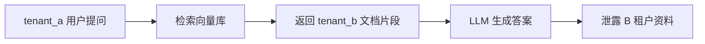
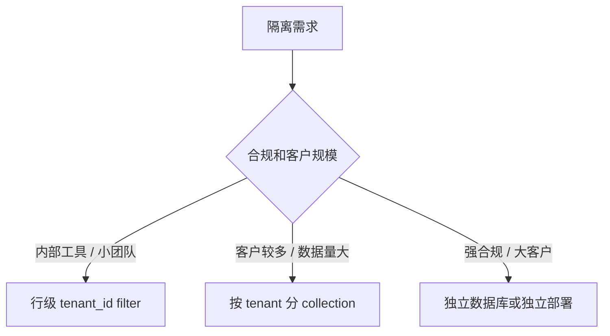
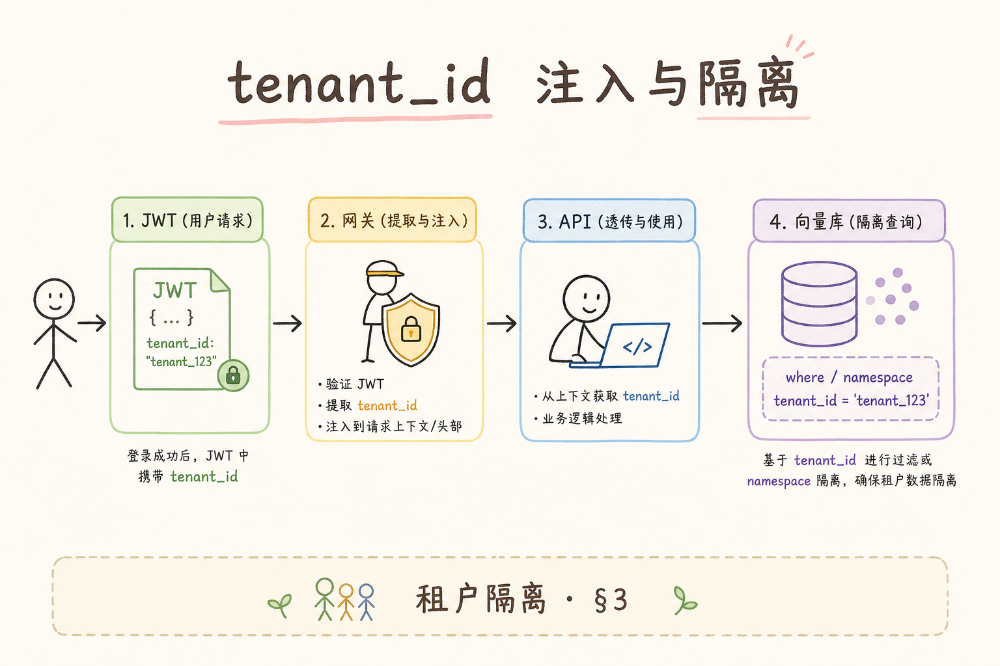
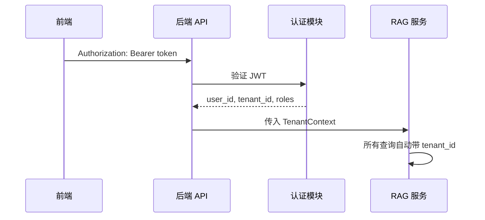
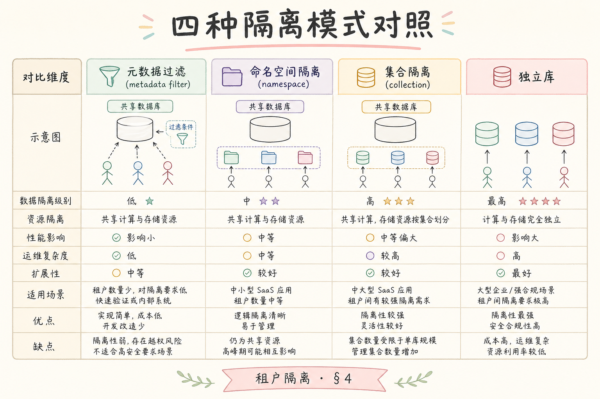
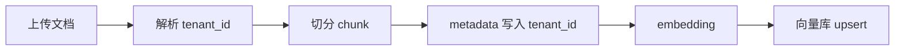

# F 后端与 API（十一）：多租户 tenant_id 后端隔离入门

SaaS 型 RAG 系统通常会服务多个公司、部门或项目空间。用户登录之后，后端不仅要知道“这个人是谁”，还要知道“这个人属于哪个租户”。**tenant_id** 就是租户标识：它把不同客户的数据边界明确分开，避免 A 公司查到 B 公司的文档。

本文面向已经了解 JWT、RBAC 和 metadata filter 的初学者。读完后，你应该能在后端 API、异步任务、检索过滤和日志里正确传递 tenant_id。

## 目录

- [1. tenant_id 解决什么问题](#1-tenant_id-解决什么问题)
- [2. 多租户隔离的四种层级](#2-多租户隔离的四种层级)
- [3. 请求里的 tenant_id 从哪里来](#3-请求里的-tenant_id-从哪里来)
- [4. Ingest 和检索都要带 tenant_id](#4-ingest-和检索都要带-tenant_id)
- [5. 最小 FastAPI 示例](#5-最小-fastapi-示例)
- [6. 数据库、向量库和对象存储](#6-数据库向量库和对象存储)
- [7. 测试隔离是否真的生效](#7-测试隔离是否真的生效)
- [8. 常见错误](#8-常见错误)
- [9. FAQ](#9-faq)
- [10. 总结](#10-总结)

## 1. tenant_id 解决什么问题

**租户**（tenant）可以理解为一个独立客户、团队或空间。多租户系统里，很多用户共用同一套后端服务，但每个租户的数据必须彼此隔离。

如果 RAG 后端只检查 user_id，不检查 tenant_id，就可能出现这种事故：



tenant_id 的作用是把每一次读写操作都限制在当前租户边界内。它不是前端展示字段，而是后端安全边界的一部分。

## 2. 多租户隔离的四种层级

租户隔离可以做得很轻，也可以做得很重。初学者先理解四个层级：

| 层级 | 做法 | 优点 | 代价 |
| --- | --- | --- | --- |
| 行级隔离 | 每条记录带 `tenant_id` | 成本低，容易开始 | 每个查询都必须过滤 |
| collection 隔离 | 每租户一个向量 collection | 检索边界更清楚 | collection 数量会增长 |
| 数据库隔离 | 每租户独立数据库/schema | 数据边界强 | 运维成本高 |
| 服务隔离 | 每租户独立部署 | 安全和定制最强 | 成本最高 |

大多数早期 RAG 项目会从行级隔离或 collection 隔离开始。无论选择哪种，都必须能回答一个问题：当前请求最多能读写哪些租户的数据？



这张图不是绝对标准，而是一个起点。真正选择时还要看数据量、合规要求、运维能力和成本。

## 3. 请求里的 tenant_id 从哪里来

tenant_id 不应该由前端随便传。更稳妥的方式是登录后把租户信息写入 JWT，后端从 token 中解析出来。

请求链路可以这样设计：





这里的关键是 **TenantContext**：它是当前请求的租户上下文，通常包含 `tenant_id`、`user_id`、角色和 trace_id。业务层不要到处重新解析 token，而是接收一个已经验证过的上下文对象。

## 4. Ingest 和检索都要带 tenant_id

**Ingest** 是把文档写入知识库的过程，包括上传、解析、切分、embedding 和入库。只在检索时过滤 tenant_id 不够，写入时也要把 tenant_id 放进 metadata。

一次正确的写入链路应该是：





检索时再使用同一个 tenant_id 做过滤：

```python
filter = {"tenant_id": current.tenant_id}
hits = vector_store.search(query_vector, filter=filter, top_k=5)
```

这两步缺一不可。写入时没存 tenant_id，检索时就无法可靠过滤；检索时忘了 filter，写入再规范也挡不住越权结果。

## 5. 最小 FastAPI 示例

下面示例用内存列表模拟文档库，演示 tenant_id 如何贯穿上传和检索。真实项目中可以把 `DOCUMENTS` 换成数据库和向量库。

运行前需要：

```bash
pip install fastapi uvicorn
```

示例代码：

```python
from dataclasses import dataclass
from fastapi import Depends, FastAPI, Header

app = FastAPI()

DOCUMENTS: list[dict] = []


@dataclass
class TenantContext:
    tenant_id: str
    user_id: str


def get_context(
    x_tenant_id: str = Header(...),
    x_user_id: str = Header(...),
) -> TenantContext:
    return TenantContext(tenant_id=x_tenant_id, user_id=x_user_id)


@app.post("/documents")
def ingest_document(text: str, ctx: TenantContext = Depends(get_context)):
    doc = {
        "tenant_id": ctx.tenant_id,
        "created_by": ctx.user_id,
        "text": text,
    }
    DOCUMENTS.append(doc)
    return {"ok": True, "tenant_id": ctx.tenant_id}


@app.get("/search")
def search(q: str, ctx: TenantContext = Depends(get_context)):
    hits = [
        doc for doc in DOCUMENTS
        if doc["tenant_id"] == ctx.tenant_id and q in doc["text"]
    ]
    return {"hits": hits}
```

启动：

```bash
uvicorn main:app --reload
```

写入两个租户的数据：

```bash
curl -X POST "http://127.0.0.1:8000/documents?text=tenant_a_secret" -H "x-tenant-id: tenant_a" -H "x-user-id: u1"
curl -X POST "http://127.0.0.1:8000/documents?text=tenant_b_secret" -H "x-tenant-id: tenant_b" -H "x-user-id: u2"
```

用 tenant_a 搜 tenant_b 的内容：

```bash
curl "http://127.0.0.1:8000/search?q=tenant_b_secret" -H "x-tenant-id: tenant_a" -H "x-user-id: u1"
```

预期返回空列表。这就是最小隔离验收：A 租户不能读到 B 租户的数据。

## 6. 数据库、向量库和对象存储

tenant_id 不能只出现在一个地方。RAG 后端通常有三类存储：

| 存储 | 应该怎么隔离 |
| --- | --- |
| 业务数据库 | 文档表、任务表、日志表都带 `tenant_id` |
| 向量库 | metadata filter 或按租户 collection |
| 对象存储 | bucket/path 中包含租户前缀，下载前校验租户 |

对象存储很容易被忽略。例如文件实际存在 `s3://kb/docs/a.pdf`，如果下载接口只检查文件名，不检查租户，就可能被猜路径访问。更稳妥的路径是 `s3://kb/tenant_a/docs/a.pdf`，并且后端下载前仍然检查当前 tenant_id。

## 7. 测试隔离是否真的生效

隔离测试不能只测“自己能读自己的”。至少要测三类：

| 测试 | 预期 |
| --- | --- |
| tenant_a 写入，tenant_a 检索 | 能命中 |
| tenant_a 写入，tenant_b 检索 | 不能命中 |
| 无 tenant_id 请求 | 直接拒绝 |

如果系统有异步任务，还要测试任务状态接口。例如 tenant_a 创建的索引任务，tenant_b 不能通过 task_id 查到进度。

建议把越权测试放进自动化测试，而不是只靠人工点页面。多租户问题一旦线上出现，通常就是数据泄露级别的问题。

## 8. 常见错误

这一节列的是多租户 RAG 后端最常见的隔离漏洞。它们大多不是语法错误，而是“某条链路忘了带 tenant_id”。

### 8.1 tenant_id 只在前端

前端传 tenant_id 只能作为显示或选择，不应作为安全事实。后端必须从可信 token 或服务端会话中得到 tenant_id。

### 8.2 ingest 不写 tenant metadata

文档写入时没带 tenant_id，后面检索就无法过滤。这个问题通常要靠数据迁移才能补救。

### 8.3 只隔离向量库，不隔离原文

向量检索过滤了 tenant_id，但原文下载、引用预览、PDF 高亮接口没有过滤，一样会泄露资料。

### 8.4 异步任务丢失 tenant_id

后台任务如果只拿 file_id，不拿 tenant_id，可能把任务结果写进错误租户。任务 payload 里必须有 tenant_id。

### 8.5 日志不带 tenant_id

排查事故时，如果日志没有 tenant_id，就很难判断影响范围。请求日志、任务日志、检索日志都应带 tenant_id 和 trace_id。

## 9. FAQ

**Q1：tenant_id 应该放 JWT 还是 header？**  
可信来源应该是 JWT 或服务端会话。header 可以用于内部服务传递，但入口层必须验证，不能让外部用户随便改。

**Q2：按租户分 collection 后还需要 ACL 吗？**  
需要。collection 隔离解决租户边界；ACL 解决同一租户内部哪些用户能看哪些文档。

**Q3：租户切换怎么做？**  
用户如果属于多个租户，切换时应由后端确认成员关系，再签发或刷新当前租户上下文。

**Q4：测试环境可以共用生产 collection 吗？**  
不建议。测试数据、生产数据和开发数据应有明确环境隔离，避免误删和误检索。

## 10. 总结

tenant_id 是 SaaS RAG 的基本安全边界。它必须贯穿认证、上传、异步任务、检索、原文下载、日志和测试。


初学者可以先做到四个检查点：

1. tenant_id 来自可信认证结果，不来自随意 header。
2. 写入文档和 chunk 时保存 tenant_id。
3. 每次检索和原文访问都过滤 tenant_id。
4. 自动化测试覆盖跨租户越权场景。

做到这些之后，再根据数据规模和合规要求决定是继续行级隔离，还是升级到 collection、数据库或服务级隔离。
