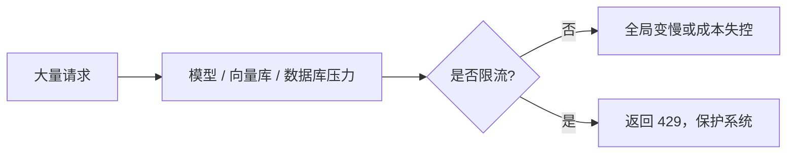
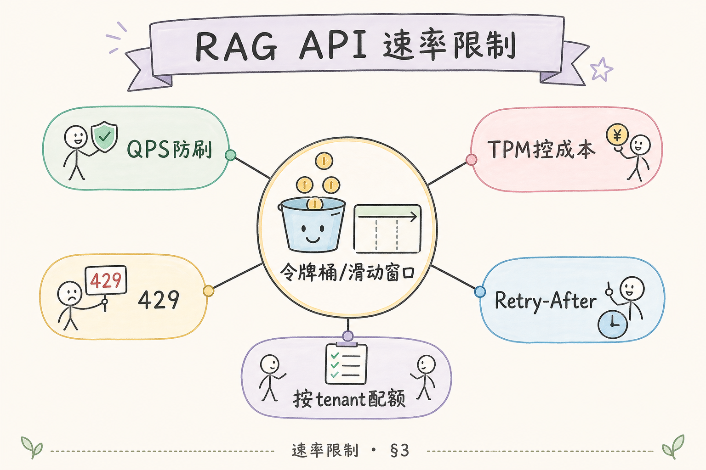
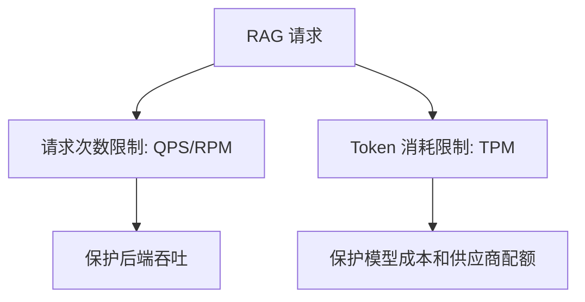
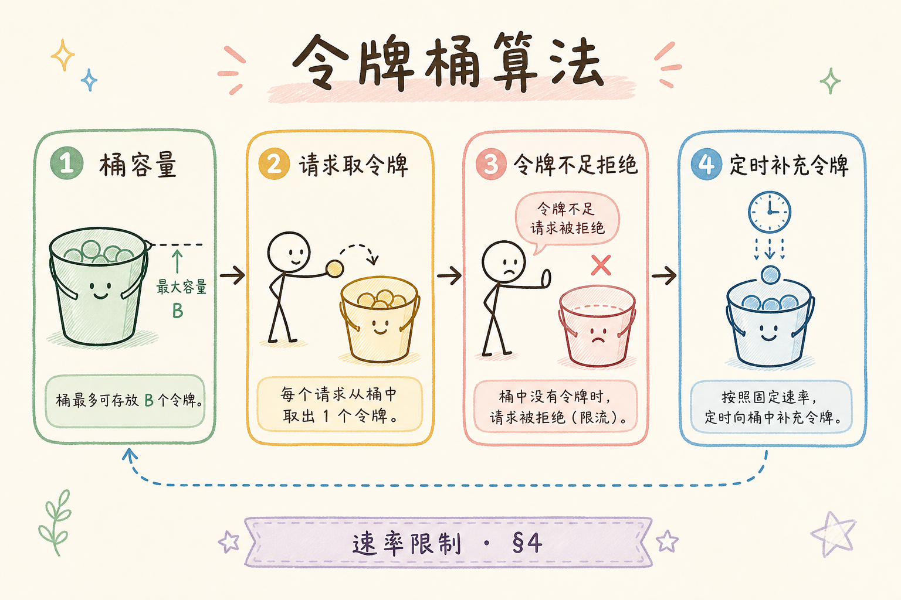
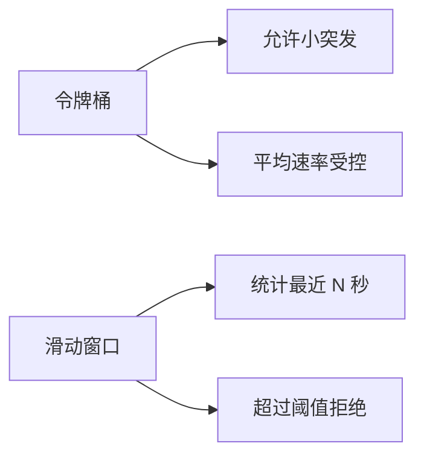
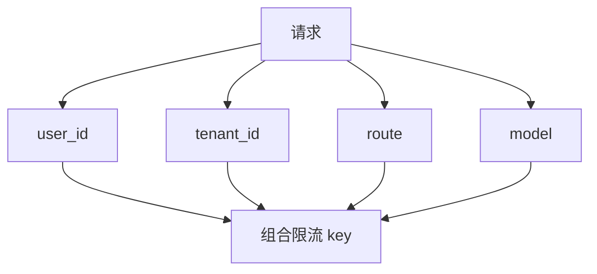

# F 后端与 API（十四）：Rate Limiting 速率限制入门指南

RAG API 通常会调用模型、向量库和 embedding 服务，这些资源都有成本和容量。如果一个用户短时间内疯狂请求，系统可能变慢、账单暴涨，甚至影响其他用户。**Rate Limiting** 要解决的是：限制单位时间内的请求量，让系统保持公平、可控和可用。

本文面向刚开始做 RAG API 生产化的读者。读完后，你应该能理解速率限制是什么、QPS 和 TPM 有什么区别、令牌桶和滑动窗口怎么理解，并能写出一个 FastAPI + Redis 的最小限流思路。

## 目录

- [1. 为什么 429 是保护机制](#1-为什么-429-是保护机制)
- [2. Rate Limiting 是什么](#2-rate-limiting-是什么)
- [3. QPS、RPM、TPM 分别限制什么](#3-qpsrpmtpm-分别限制什么)
- [4. 令牌桶与滑动窗口](#4-令牌桶与滑动窗口)
- [5. 限流维度怎么选](#5-限流维度怎么选)
- [6. 最小 FastAPI 思路](#6-最小-fastapi-思路)
- [7. 返回给前端什么](#7-返回给前端什么)
- [8. 常见错误](#8-常见错误)
- [9. FAQ](#9-faq)
- [10. 总结](#10-总结)

## 1. 为什么 429 是保护机制

HTTP 429 表示 Too Many Requests，也就是请求太多。它不是“系统坏了”，而是系统主动保护自己和其他用户。

在 RAG 系统里，一次请求可能触发检索、重排、模型生成和日志记录。如果没有限流，少数异常用户或脚本就可能耗尽资源。



限流的目的不是刁难用户，而是保护服务稳定性。

## 2. Rate Limiting 是什么

**Rate Limiting**：限制某个对象在一定时间内可以发起多少请求或消耗多少资源。通俗说，它像地铁闸机：不是禁止进站，而是控制进入速度。

常见限制对象包括：

| 对象 | 例子 |
|---|---|
| IP | 同一个 IP 每分钟最多 60 次 |
| 用户 | 每个用户每分钟最多 20 次 |
| 租户 | 每个企业客户每天最多 10 万 token |
| API Key | 每个 key 独立计数 |
| 接口 | 上传接口和问答接口分开限制 |

RAG 系统通常要同时按用户、租户和成本资源限流。

## 3. QPS、RPM、TPM 分别限制什么

限流不只看请求次数，还要看 token 消耗。

| 指标 | 含义 | 适合限制 |
|---|---|---|
| QPS | 每秒请求数 | 瞬时压力 |
| RPM | 每分钟请求数 | 普通 API 调用频率 |
| TPM | 每分钟 token 数 | 模型成本和模型供应商限额 |





一个用户每分钟只发 5 个请求，但每次都要求生成超长答案，也可能消耗大量 token。因此 QPS 和 TPM 要分开看。

## 4. 令牌桶与滑动窗口

**令牌桶**：系统按固定速度往桶里放令牌，请求来时取走令牌。桶空了就限流。它允许短时间小突发，但长期受平均速率约束。

**滑动窗口**：统计最近一段时间内的请求数，例如最近 60 秒内最多 100 次。它更直观，适合普通 API 限流。





初学阶段可以先实现固定窗口或滑动窗口，理解计数逻辑后再看令牌桶。

## 5. 限流维度怎么选

限流维度决定公平性。只按 IP 限流可能误伤公司网络；只按用户限流可能挡不住整个租户滥用。

建议至少考虑：

| 维度 | 适用场景 |
|---|---|
| 用户级 | 防单个用户刷接口 |
| 租户级 | 防一个客户占满资源 |
| API Key 级 | 对外开放 API |
| 接口级 | 上传、问答、重建索引分开 |
| 模型级 | 防某个模型配额耗尽 |



一个常见 key 是 `tenant:{tenant_id}:route:{route}:minute:{timestamp}`。

## 6. 最小 FastAPI 思路

下面示例用伪代码展示 Redis 计数限流。重点是思路，不是完整生产实现。

```python
import time
from fastapi import HTTPException


def rate_limit(redis, key: str, limit: int, window_seconds: int) -> None:
    count = redis.incr(key)
    if count == 1:
        redis.expire(key, window_seconds)
    if count > limit:
        raise HTTPException(status_code=429, detail="请求过于频繁，请稍后再试")


def build_limit_key(user_id: str, route: str) -> str:
    minute = int(time.time() // 60)
    return f"rate:user:{user_id}:route:{route}:minute:{minute}"
```

这个实现是固定窗口：同一分钟内超过阈值就拒绝。生产环境可以进一步使用滑动窗口、令牌桶、Lua 脚本保证原子性。

## 7. 返回给前端什么

限流响应要让前端知道多久后可以重试。

建议返回：

| 信息 | 用途 |
|---|---|
| HTTP 429 | 标准限流状态 |
| `Retry-After` | 建议多少秒后重试 |
| 错误文案 | 给用户可理解提示 |
| request_id | 方便排查 |

示例：

```http
HTTP/1.1 429 Too Many Requests
Retry-After: 30
```

前端不要在收到 429 后立即疯狂重试。应等待 `Retry-After`，并提示用户稍后再试。

## 8. 常见错误

第一个错误是只按 IP 限流。公司网络、代理或移动网络会让很多用户共享一个 IP，容易误伤。

第二个错误是只限制请求数，不限制 token。长上下文和长输出会绕过次数限制，继续制造高成本。

第三个错误是错误提示不清楚。用户只看到“失败”，不知道是限流还是系统错误。

第四个错误是限流状态不进日志。没有日志就无法区分真实高峰、攻击、误配置或异常重试。

## 9. FAQ

**Q：限流应该放网关还是应用里？**  
两者都可以。网关适合粗粒度保护，应用层适合按用户、租户、模型和业务规则限流。

**Q：429 会不会影响用户体验？**  
会，但比系统整体变慢或崩溃更好。关键是提示清楚，并给出重试时间。

**Q：免费用户和付费用户限额一样吗？**  
通常不同。限流策略应结合套餐、租户和成本预算。

**Q：限流能防所有攻击吗？**  
不能。它是保护手段之一，还需要认证、权限、WAF、审计和异常检测。

## 10. 总结

Rate Limiting 用来控制 RAG API 的请求频率和资源消耗，保护模型配额、后端吞吐和系统公平性。429 不是失败，而是有意识的保护。


初学者先实现用户级或租户级固定窗口限流，再逐步加入 TPM、滑动窗口、令牌桶和分层策略。限流必须配合日志和清晰前端提示，才能真正可用。
