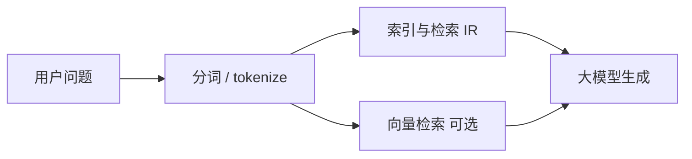

# NLP / IR / LLM 基础（一）：中文分词与英文 Tokenization 完全指南

> 你做 RAG 知识库：用户问「报销流程怎么走」，检索却把「流程走」和「怎么走」拆得乱七八糟；调 OpenAI 发现同一段中文比英文贵、还容易超长截断——根子往往在你还没弄清 **「字 / 词 / token」** 在三套系统里各指什么。英文有空格，看似「按词切开」就行；中文连续汉字没有天然边界，要先 **分词** 再谈 TF-IDF、BM25 或 Embedding。大模型内部也不按「人类的一个词」算长度，而是按 **tokenizer** 吐出的 **token（词元）** 计费、占上下文。这篇是 [企业 RAG 路线图](ENTERPRISE_RAG_ROADMAP.md) **B 轨第一篇**、博客主目录独立 **地基教程**：用概念和表格讲清分词与 tokenization 为何不同、常见算法直觉、对检索与 LLM 的影响；代码只保留说明用的最小片段。TF-IDF、BM25、Embedding 见路线图第 25～32 条后续篇。

---

## 目录

1. [前言：三个「词」不是同一个词](#1-前言三个词不是同一个词)
2. [NLP、IR、LLM：本文站在哪条链路](#2-nlpirllm本文站在哪条链路)
3. [粒度：字符、词与子词](#3-粒度字符词与子词)
4. [英文 tokenization：从空格到 BPE](#4-英文-tokenization从空格到-bpe)
5. [中文为何必须分词](#5-中文为何必须分词)
6. [中文分词的主流思路](#6-中文分词的主流思路)
7. [子词切分：中英汇合点](#7-子词切分中英汇合点)
8. [三套系统里的「词」对照](#8-三套系统里的词对照)
9. [对 RAG 与检索的直接影响](#9-对-rag-与检索的直接影响)
10. [中英混合、数字与专有名词](#10-中英混合数字与专有名词)
11. [综合概念地图与决策提示](#11-综合概念地图与决策提示)
12. [常见陷阱与 FAQ](#12-常见陷阱与-faq)
13. [总结与系列下一步](#13-总结与系列下一步)

---

## 1. 前言：三个「词」不是同一个词

典型困惑：

- 产品经理说「限制 100 个词」，工程师按 **100 个 token** 截断，上线后中文用户发现回答半截没了。
- 用 `jieba` 分出「南京市 / 长江大桥」，检索「南京市长」时又切成「南京 / 市长」——**歧义切分**导致召不回正确文档。
- 英文 `running` 在 LLM 里可能是 `run` + `ning` 两个 token，你却按整词算进 BM25 词表。

**分词**（word segmentation，中文常叫「中文分词」）：把连续汉字序列切成有意义的 **词** 序列，如「我爱自然语言处理」→「我 / 爱 / 自然语言处理」。  
通俗说：给没有空格的句子**加隐形的空格**——让机器知道「自然语言处理」是一个整体。

**Tokenization**（词元化 / 标记化）：把文本切成模型或索引使用的 **token** 单元；英文、中文、多语言模型往往用同一套 **子词** 规则（如 BPE）。  
通俗说：把句子切成模型「吃得下」的**小碎片**，碎片不一定是词典里的词。

**Token**（词元）：切分后的最小单位之一；LLM API 的 **计费、上下文长度、流式输出** 常以 token 计。  
通俗说：模型内部的「字数统计单位」——和你在 Word 里看到的「字数」往往**不一致**。

**读完本文，你应该能做到：**

1. 区分 **人类词**、**检索词项（term）**、**LLM token** 三种粒度，并举例说明为何不能混用。
2. 解释英文从「按空格分」到 **BPE / SentencePiece** 子词化的动机。
3. 说明中文无空格带来的 **歧义** 与分词在 IR 里的作用。
4. 说出 **jieba** 等工具在工程里解决什么、不解决什么。
5. 描述子词 tokenization 如何同时服务中文与英文，以及 **OOV**（未登录词）问题如何缓解。
6. 结合 RAG：分词/token 选择如何影响 **倒排索引、chunk 边界、计费与截断**（细节在后续篇展开）。

**前置知识**：能读 Python 字符串、知道「字符串是一串 Unicode 字符」即可；[Python 类型注解](2.python-type-annotation-tutorial.md) 非必须。  
**环境**：概念篇不强制安装；试分词可 `pip install jieba`（§6）。  
**本文边界（地基篇）**：讲清 **概念与选型**；**不讲** Transformer 注意力、训练 tokenizer、各模型 `tiktoken` 完整词表。BM25 公式、向量维度见路线图后续篇。

### 1.1 为什么 RAG 工程师要先学这一课

| 环节 | 和分词/token 的关系 |
|------|---------------------|
| 建倒排索引 | 中文要先定「词项」怎么切 |
| BM25 / TF-IDF | 词频统计的对象是 term，不是字 |
| Embedding | 多数模型吃 token 或子词，不是整句一字 |
| 调 LLM | `max_tokens`、计费、上下文窗口全是 token |
| Chunking | 按字符切可能切断词，按 token 切更贴模型 |

---

## 2. NLP、IR、LLM：本文站在哪条链路

**NLP**（Natural Language Processing，自然语言处理）：让计算机处理人类语言的任务总称——分词、句法、翻译、问答等。  
通俗说：**教机器「读懂人话」** 的学科与工程集合。

**IR**（Information Retrieval，信息检索）：从大规模文档集合里找出与查询相关的内容——搜索引擎、企业知识库检索。  
通俗说：**在书堆里找相关章节**；RAG 的「R」就是检索这一步。

**LLM**（Large Language Model，大语言模型）：参数量巨大的预训练语言模型，按 token 预测下一段文本。  
通俗说：**接龙高手**——你给上文，它续写；RAG 的「G」用检索结果喂给它做 grounded 生成。



读图时看 **Seg**：同一问句，给 **倒排索引** 的分词方式可能与给 **GPT tokenizer** 的方式不同——**不必强行统一**，但要清楚各自用哪套。

### 2.1 IR 与 NLP 在「切词」上的历史分工

早期搜索引擎（英文）靠 **空格 + 词干** 就能跑；中文网页普及后，**分词**成为中国大陆 IR 工程的必修课。今天大模型把 **tokenization** 推到台前，但 **企业知识库** 里大量 PDF、制度、表格仍靠 **关键词匹配 + BM25** 作基线或 hybrid 的一翼——所以「中文分词」没有因为向量检索而消失，只是 **任务分工** 变了：  
- 稀疏检索：**你负责**选 jieba/IK 与词典；  
- 向量与生成：**模型负责**内部 token，**你负责**别超长度、别送脏字符。

---

## 3. 粒度：字符、词与子词

| 粒度 | 例子（中文） | 例子（英文） | 特点 |
|------|--------------|--------------|------|
| **字符** | 自、然、语、言 | h, e, l, l, o | 无歧义、序列长、语义弱 |
| **词** | 自然语言、处理 | natural, language | 符合直觉；中文要先「猜边界」 |
| **子词** | 自然 / 语言 / 处理 或更碎 | nat, ural, lang | 词表有限、可组合新词 |

**词表**（vocabulary）：模型或索引允许的 token/词项集合。  
通俗说：**认字表**——表外的字要靠子词拼或标成未知符。

**OOV**（Out-of-Vocabulary，未登录词）：不在词表里的词——新人名、产品代号、错别字。  
通俗说：认字表上没有的词。子词切分把 `OpenAI` 拆成 `Open` + `AI` 等，减轻 OOV；纯词级英文则整词进表或变 `UNK`。

### 3.1 字级 n-gram：不分词时的折中

若不先做中文分词，可把连续字符切成 **n-gram**（长度为 n 的滑动窗口），如「自然语言」→ 2-gram：`自然`、`然语`、`语言`。  
通俗说：**用固定长度小窗户扫过去**，不猜词边界，但索引会变大、噪声增多。

| 方式 | 优点 | 缺点 |
|------|------|------|
| 词级（分词后） | 语义集中、索引较小 | 分词错则全盘受影响 |
| 字级 | 无分词歧义 | 单字语义弱、 posting 多 |
| 字符 n-gram | 折中、实现简单 | 存储与计算成本高 |

工业界中文 **词级 + 领域词典** 仍最常见；n-gram 多见于特定搜索引擎或作为 **召回补充**。路线图 BM25 篇会默认词项；你若选 n-gram，须在文档里写清「term = 2-gram 字对」以免团队误解。

---

## 4. 英文 tokenization：从空格到 BPE

### 4.1 朴素按空格（whitespace）

英文句子 `Natural language processing is fun` 按空格得 5 个「词」。  
**局限**：标点粘着词（`processing.`）、缩写（`don't`）、复合词、大小写归一化都没统一规则；**更不适合**直接给神经网络当固定词表。

### 4.2 规范化预处理

工程上常先做：**小写化**（是否保留看任务）、去多余空白、处理标点。  
检索里 `Apple` 与 `apple` 是否同一 term 要事先定规则，否则索引分裂。

### 4.3 BPE（Byte Pair Encoding，字节对编码）

**BPE**：从字符级开始，反复合并语料里**最常见相邻符号对**，得到子词词表。  
通俗说：像玩「合体」游戏——`th` 和 `e` 老挨着就合成 `the` 一块。

GPT、LLaMA 等主流 LLM 的 tokenizer 多基于 **BPE** 或相近算法（如 **SentencePiece** 实现的 unigram/BPE）。  
效果：`unhappiness` 可能变成 `un` + `happiness` 或更碎——**token 数 ≠ 英文单词数**。

### 4.4 WordPiece 与 SentencePiece（了解即可）

**WordPiece**（BERT 常用）：类似 BPE，合并时优化似然；前缀常标 `##`。  
**SentencePiece**：把空格也编成符号，**不依赖**按空格预分；对 **中日韩** 与多语言更友好，许多多语言 Embedding 模型采用。

地基篇记住：**现代 LLM 英文也不是「一个词一个 token」**。

### 4.5 从文本到 token id

Tokenizer 最后输出往往是 **整数 id 序列**（再喂给神经网络）；人眼看到的是 `encode` 后的数字列表或 `decode` 回来的字符串。  
通俗说：**每个碎片有一个学号**——模型只认学号，不认「你好」这两个字的形状。

同一字符串「重复 encode」应得到相同 id 序列；换模型版本（如 GPT-3.5 → GPT-4 不同编码）则 **同一句话 token 数可能变**——升级模型时要 **重估** 上下文与成本，不能照搬旧数字。

---

## 5. 中文为何必须分词

英文：`I love NLP` 空格即边界。  
中文：`我爱自然语言处理`——没有空格，若按**单字**切：「我 / 爱 / 自 / 然 / 语 / 言 / 处 / 理」，「自然语言处理」这个术语的语义被打散，TF-IDF 里「自然」和「语言」共现统计会偏离人类理解。

### 5.1 歧义切分经典例

**「南京市长江大桥」** 可切为：

- 南京市 / 长江 / 大桥
- 南京 / 市长 / 江大桥（荒诞但算法上可能）

**「结婚的和尚未结婚的」**——「和尚」与「和 / 尚未」歧义。  
通俗说：中文分词是在**猜意图**；检索错切 → 查不到或查错。

### 5.2 仅按字不是「错」，是「另一种任务」

字符级模型、部分 Embedding 直接吃汉字序列也可以工作，但 **经典倒排 + BM25** 中文工业界仍普遍 **先分词**（或至少 n-gram 字）。路线图 [BM25](ENTERPRISE_RAG_ROADMAP.md#26)、[倒排索引](ENTERPRISE_RAG_ROADMAP.md#27) 篇会默认你有「词项」概念。

---

## 6. 中文分词的主流思路

### 6.1 基于词典（最大匹配）

维护大词典，从左到右贪心匹配最长词（**正向最大匹配** FMM 等）。  
优点：快、可解释、可塞领域词。缺点：未登录词、歧义句易错。

**演示什么**：`jieba` 默认词典分词。  
**环境**：`pip install jieba`。  
**预期**：输出用 `/` 分隔的词序列。

```python
import jieba

text = "我爱自然语言处理"
print("/".join(jieba.cut(text)))
# 典型：我/爱/自然语言处理
```

**自定义词典**：企业知识库可把「报销流程」「OKR」加入 `jieba.load_userdict`，减少切错。  
通俗说：告诉分词器「这些词在我们公司是一个整体」。

### 6.2 基于统计与序列标注（HMM / CRF）

把每个字标成「词首 / 词中 / 词尾 / 单字词」，用 **HMM**（隐马尔可夫）或 **CRF**（条件随机场）学转移概率。  
通俗说：不只会背词典，还能根据上下文**猜**「这里更像新词开头还是词中间」。`jieba` 内部结合词典与统计。

### 6.3 基于深度学习（了解即可）

BiLSTM-CRF、BERT 标注等，准确率更高，部署更重。多数 RAG **离线建索引** 用 `jieba` + 领域词典够起步；**不必**第一篇就上深度分词。

### 6.4 搜索引擎里的「分词器」

Elasticsearch **IK Analysis**、Solr 中文分词等：与 `jieba` 类似问题——**索引时**与**查询时**应用**同一套**分词配置，否则「索引有、查询切法不同」会漏召。

### 6.5 分词模式：精确 vs 全模式（jieba 直觉）

`jieba.cut` 默认 **精确模式**，适合检索；**全模式**把句子里所有可能的词都扫出来，冗余多，**不适合**直接建 BM25 主索引。  
**搜索引擎模式** `cut_for_search` 会对长词再切子词，提高召回——例如「中华人民共和国」可能再出「中华」等，查询「中华」也能命中。  
通俗说：**索引可以略「肥」一点换召回**，但要在评测集上看是否引入太多噪声。

---

## 7. 子词切分：中英汇合点

大模型与许多 Embedding API **不问你** jieba 怎么切；它们用自己训练的 **tokenizer**（常为 SentencePiece / BPE，在大量中英混合语料上训练）。

同一句中文：

| 系统 | 可能的样子 |
|------|------------|
| jieba | 自然语言 / 处理 |
| GPT 类 tokenizer | 更碎的若干 token id |
| 字符级 | 每字一个符号 |

**多语言 tokenizer**（如部分 `cl100k_base`、各模型自有编码）对中文往往 **一字或多字对应 1～数个 token**，同样 100 汉字，token 数可能大于 100 也可能因合并略少——**必须以具体模型计数工具为准**。

**演示什么**：用 `tiktoken` 粗看英文 token 数（需安装 `tiktoken`，可选）。  
**预期**：`"hello world"` 的 token 数通常小于字符数；与中文对比感受差异。

```python
# 可选：pip install tiktoken
import tiktoken
enc = tiktoken.get_encoding("cl100k_base")  # GPT-4 等常用之一
print(len(enc.encode("Natural language processing")))
print(len(enc.encode("自然语言处理")))
```

**结论**：RAG 里 **检索侧分词** 与 **模型侧 token** 可以各用各的工具；要对齐的是 **业务指标**（召回、答案质量、成本），不是强行「一种切法走天下」。

### 7.1 同一问题在 RAG 里的两条路径（概念 walkthrough）

用户问：「公司的年假政策是多少天？」

1. **稀疏检索路径**：问句经 jieba → `公司 / 年假 / 政策 / 多少 / 天`（停用词或略）→ 在倒排里找含这些 term 的 chunk。若「年假」被切成「年 / 假」，相关文档可能漏掉。  
2. **向量路径**：整句或问句文本经 Embedding 模型内部 tokenizer → 向量 → 与 chunk 向量比相似度；分词错误影响较小，但 **chunk 边界** 仍影响语义完整。  
3. **LLM 路径**：检索到的 chunk + 问题一起 `encode` 成 token 序列 → 不能超过 context；中文 policy 全文很长时，要先靠 chunk 筛选，而不是整库塞进 prompt。

这条 walkthrough 说明：**分词主要折磨第 1 条路径**；三条路径同时在典型 hybrid RAG 里出现，所以分词仍值得学。

---

## 8. 三套系统里的「词」对照

| 场景 | 单位 | 谁决定 | 典型工具 |
|------|------|--------|----------|
| 人类阅读 | 词/字 | 语言习惯 | 人眼 |
| 稀疏检索 IR | term（词项） | 分词器配置 | jieba、IK、whitespace+stem |
| 稠密向量 Embedding | token → 向量 | 模型 tokenizer | 模型自带 |
| LLM 生成 | token | 模型 tokenizer | tiktoken、HuggingFace `tokenizer` |

**Stemming**（词干提取，英文 IR）：`running` → `run`，减少词形变化。  
**停用词**（stop words）：`的、是、the、a` 等是否进索引——中文「的」是否停用有争议，领域而定。

**先错后对**：

```
❌ 用 len("中文段落") 当 GPT 的 max_tokens
✅ 用对应模型的 encode 数 token，再留生成余量
```

```
❌ 索引用 jieba 精细模式，查询用字符 bigram，不做同配置
✅ 索引与查询同一 analyzer / 同一 jieba 模式
```

---

## 9. 对 RAG 与检索的直接影响

### 9.1 倒排索引与 BM25（预告）

倒排表：`词项 → [文档列表]`。中文 **「报销」** 若被切成 **「报 / 销」**，用户搜「报销」可能对不上整词 posting。  
**领域词典**、**同义词扩展**是补救；根子仍是分词质量。

### 9.2 Chunk 切分

按 **固定字符数** 切 chunk 可能从「自然语言」中间砍断；按 **句号 / 标题** 结构切更稳。按 **token 数** 切 chunk 更贴 LLM 上下文，但离线要先 tokenize 一遍。路线图 [分块篇](ENTERPRISE_RAG_ROADMAP.md#c2-分块chunking) 会展开；本篇只建立：**切之前要想「按什么单位量长度」**。

### 9.3 Embedding 输入长度

Embedding 模型有 **最大 token**；超长文本要截断或分块再平均/池化。中文长文若按字估长度会 **低估** token，导致 API 报错。

### 9.4 LLM 上下文与计费

**Context Window**（上下文窗口）：模型一次能看的 token 上限（含输入+输出）。  
中文同样内容往往比英文 **占用更多 token** → 同样 128k 窗口能塞的中文「字数」更少，**费用**可能更高（按 token 计价时）。流式 UI 里的「字」与账单上的 token 再次脱钩，见 [流式 UI 篇](15.streaming-ui-rendering-tutorial.md)。

### 9.5 估 token 的工程习惯

上线前对典型用户问句、典型 chunk 用 **官方或 HuggingFace tokenizer** 跑一遍 `len(encode(text))`，记下 P50/P95。  
Prompt 模板里的 system 固定文案也要算进输入 token——不是只数用户那一句话。  
通俗说：**预算要像旅行装箱**，衣服（system）+ 礼物（检索 chunk）+ 随身包（用户问题）+ 还要留空间（max_tokens 给回答）——都按 **同一把尺子** 量。

---

## 10. 中英混合、数字与专有名词

企业文档常见：`使用 Python 的 pandas 处理 OKR 数据`、`API 版本 v2.3.1`。

| 类型 | 分词/token 注意 |
|------|-----------------|
| 英文单词 | 多被整词或子词识别；保持大小写策略一致 |
| 数字 | 可能单独成 token；版本号勿被切成无意义碎片 |
| 中英夹杂 | jieba 多能识别英文块；别手动删空格破坏英文词 |
| 产品名 | 加入自定义词典：`text-embedding-3-small` 一整条 |

**全角 / 半角**：`，` vs `,` 规范化可减少索引噪声；清洗见路线图文本清洗篇。

### 10.1 多语言与跨语言检索（了解即可）

**多语言 Embedding**（如 multilingual-e5、bge-m3）在多种语言上联合训练，内部 tokenizer 通常能处理中英日韩混合句子。  
通俗说：**一个模型认多种写法**——仍不等同于「不用分词」；稀疏索引那条路该 jieba 仍 jieba。

**跨语言检索**：用户中文问、文档英文存（或反之）时，向量检索更有优势；BM25 则要求语言一致或翻译对齐。分词/token 问题从「怎么切」变成「怎么对齐语义空间」——属路线图 Embedding 与评测篇，本篇只需知道 **语言混用会放大 token 与分词配置复杂度**。

---

## 11. 综合概念地图与决策提示

### 11.1 名词速查

| 名词 | 通俗说 |
|------|--------|
| 分词 | 中文加「隐形空格」 |
| tokenization | 切成模型认的 id 碎片 |
| BPE | 高频相邻符号合并成子词 |
| OOV | 词表里没有的词 |
| term | 检索索引里的一栏 |
| 歧义切分 | 同一句多种合法切法 |

### 11.2 决策提示（RAG 起步）

```
建中文 BM25 / Elasticsearch 索引？
├─ 是 → jieba 或 IK + 领域自定义词典；查询与索引同配置
└─ 否，仅向量检索？
    └─ Embedding 用何模型？→ 按该模型 tokenizer 估长、截断 chunk
        └─ 再接 LLM → 输入+输出 token 预算分开算，留 20%～40% 给生成
```

### 11.3 与路线图 B 轨衔接

| 路线图条 | 本篇铺垫 |
|----------|----------|
| 25 TF-IDF | term 从哪来 → 分词 |
| 26 BM25 | 同左 |
| 27 倒排索引 | 词项 = 分词结果 |
| 32 Embedding | token 进编码器 |
| 34 Token 计费 | token ≠ 字 |
| 35 Context Window | token 上限 |

---

## 12. 常见陷阱与 FAQ

### 12.1 常见陷阱

**陷阱 1**：中文按字建 BM25，却用「词」的心理写查询。  
**改**：统一 term 粒度，或明确用 character n-gram 并写进文档。

**陷阱 2**：`max_tokens=1000` 当「1000 个汉字」。  
**改**：`encode` 后计数；中文预留更多 token。

**陷阱 3**：索引与查询用不同分词器。  
**改**：同一 pipeline 配置。

**陷阱 4**：忽视自定义词典，公司专有名总被切碎。  
**改**：维护 `userdict`，随产品迭代更新。

**陷阱 5**：以为 Embedding 与 LLM 共用 jieba 结果当输入。  
**改**：API 吃原始字符串或模型规定格式；分词是检索层的事。

**陷阱 6**：英文只做 lower case，不做子词意识——调试 LLM 时惊讶 `token` 数比 `word` 多。

**陷阱 7**：把分词结果用空格拼回字符串再送 Embedding，以为「帮模型分好词了」。  
**改**：多数 Embedding API 要 **原始文本**；多此一举可能破坏子词边界，除非文档明确要求预处理格式。

### 12.2 FAQ

**Q：还要学正则分词吗？**  
A：简单英文 whitespace 够演示；生产 IR/LLM 以工具链（jieba、tiktoken、HF tokenizer）为主。

**Q：中文检索只用向量不用分词行吗？**  
A：可以，但混合系统里 BM25 仍常作补充；懂分词利于调 hybrid 检索。

**Q：GPT tokenizer 和 jieba 结果能互转吗？**  
A：无通用一一对应；不要强行映射。

**Q：繁体中文？**  
A：分词器要支持繁体词表或 opencc 归一；与简体混索引要定规范。

**Q：标点算不算 term？**  
A：看分词器；多数会剥离或单独处理。标点密集表格可能影响检索，清洗阶段处理。

**Q：代码块怎么分词？**  
A：代码 often 按字符/子词；勿对 `foo_bar` 乱切。路线图「代码块保留完整性」chunk 策略与此相关。

**Q：和路线图第 24 条关系？**  
A：本篇即 B 轨起点；后续 TF-IDF/BM25 默认你已理解 term 与 token 区别。

---

## 13. 总结与系列下一步

### 13.1 核心概念速记

1. **中文分词**为 IR 定「词项」；**tokenization** 为 LLM/Embedding 定「词元」。  
2. 英文现代模型多用 **子词**，不是空格一词。  
3. **歧义**是中文分词核心难点；**领域词典**是工程捷径。  
4. **索引与查询**必须用同一分词策略。  
5. **计费与窗口**按 token；不能用汉字数心算。  
6. RAG 里检索与生成可用 **不同切分**，但要各自选对工具。以上六点贯穿 B 轨后续各篇；动手建索引前建议用十条真实业务问句做一次分词肉眼检查。

### 13.2 推荐阅读

| 目标 | 文档 |
|------|------|
| 路线图 B/C 轨全貌 | [ENTERPRISE_RAG_ROADMAP.md](ENTERPRISE_RAG_ROADMAP.md) |
| 流式里的 token | [15：流式 UI 渲染](15.streaming-ui-rendering-tutorial.md) |
| 检索调试台 | [React 13](react/13.retrieval-debug-console.md) |

### 13.3 刻意留白

本篇未展开：**TF-IDF/BM25 公式**、**倒排 posting 结构**、**训练 BPE 语料**、**WPE 与 tiktoken 词表差异表**、**日文韩语分词**。下一篇建议接路线图 **25 TF-IDF** 或博客续篇「稀疏检索基础」；动手练习可从 `jieba` 加公司专有名词词典开始，并对照 `tiktoken` 看同句中英文 token 数差异，建立正确的数量级直觉即可。

---

> **初学者可能仍困惑的点**  
> - 「词」在聊天里是一种感觉，在账单里是 token 数——**先问你在哪一层**。  
> - jieba 切得好不等于 GPT token 少——**两套系统**。  
> - 分词错了可以靠向量检索补，但 **hybrid 时代两者都懂更稳**。  
- 升级 LLM 模型版本时，记得 **重新统计 token**，不要复制旧项目的窗口配置。  
- 评测检索质量时，把 **分词结果打印出来** 看一眼，往往比盲调参数更快发现问题。
