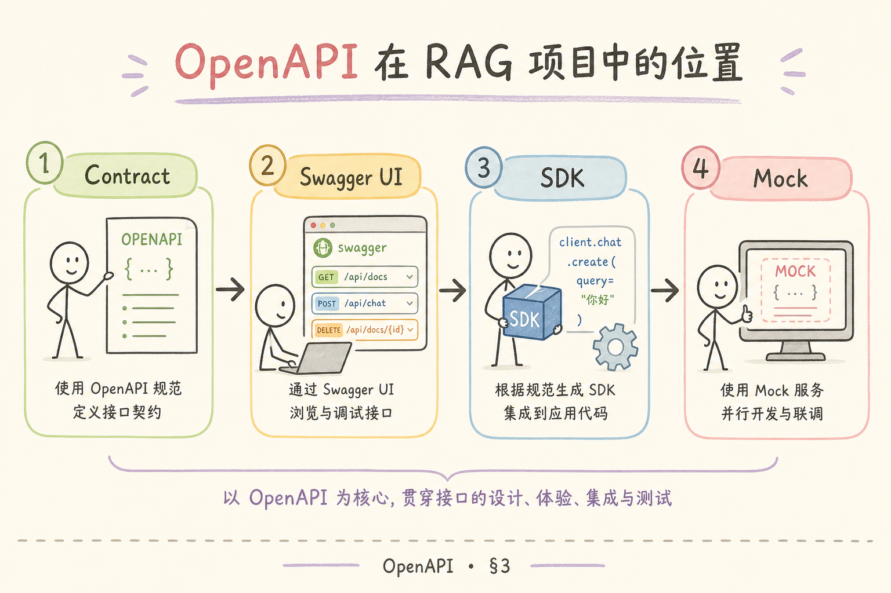
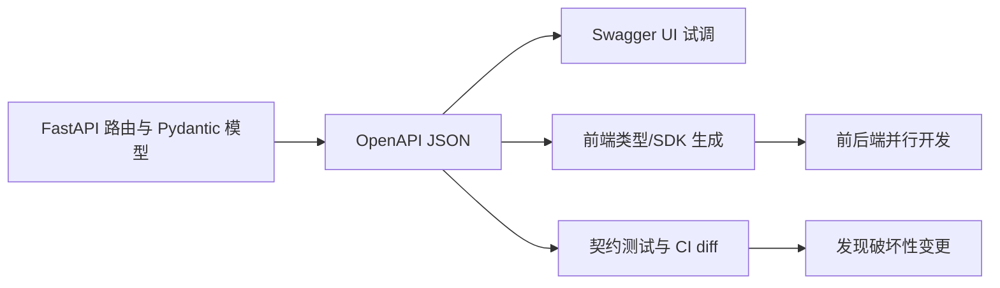
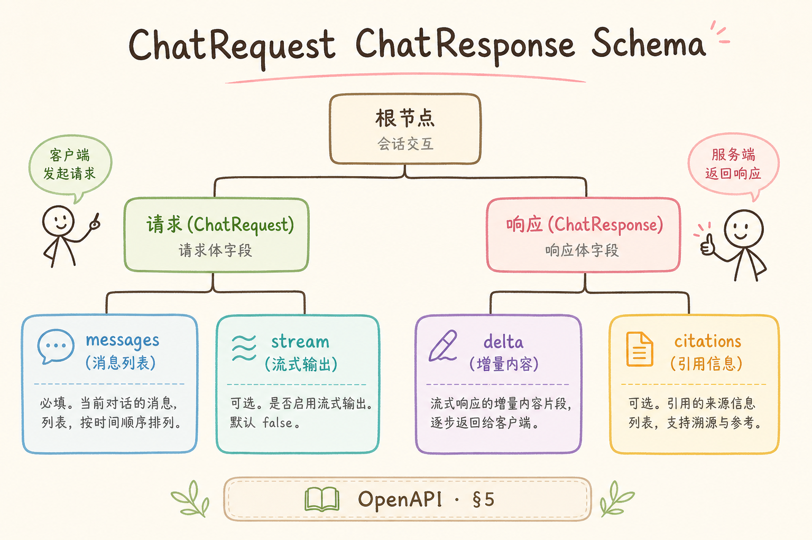
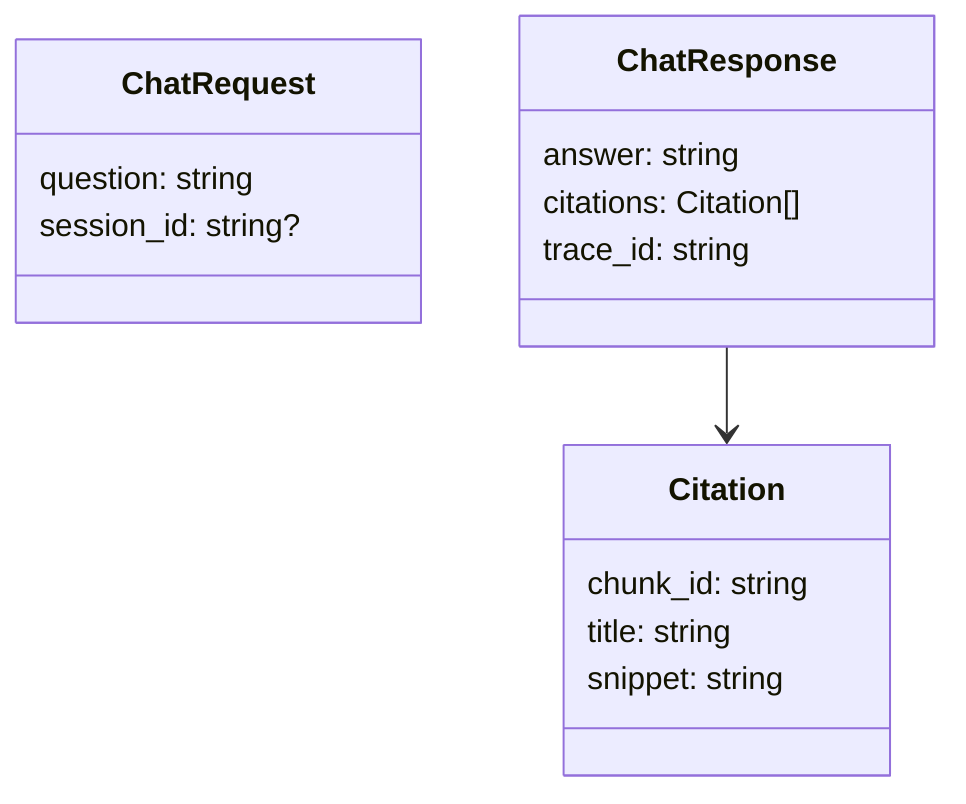
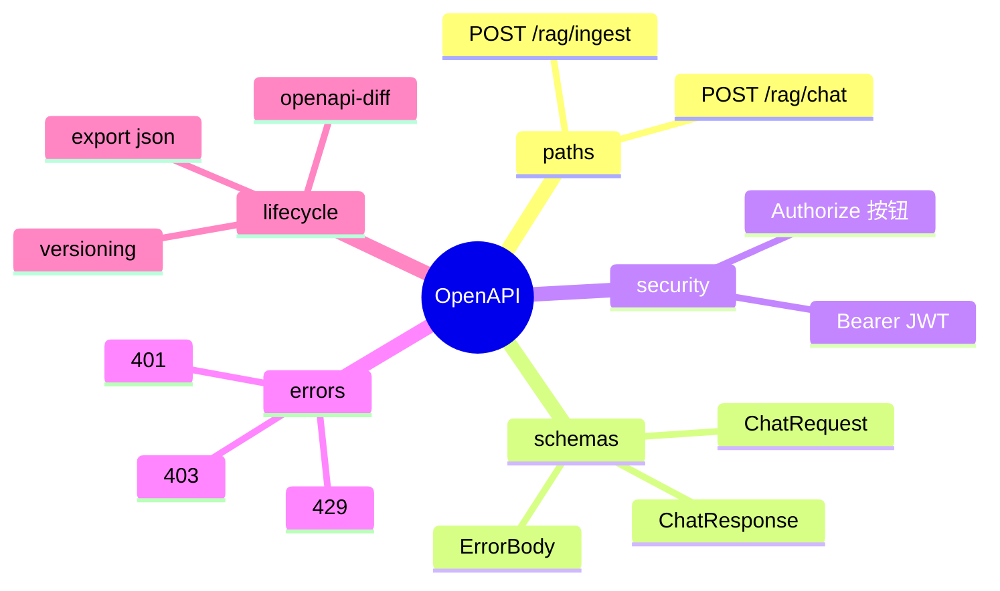

# F 后端与 API（十五）：OpenAPI / Swagger 文档完全指南

> 前端 [171 聊天 UI](171.chat-message-list-ui-tutorial.md) 要对接 `/rag/chat`——若只有 **口头约定**，字段一改 **联调地狱**。**OpenAPI**（原 Swagger 规范）用 **机器可读** 的 schema 描述 REST API；FastAPI **自动生成** `/openapi.json` 与 `/docs` Swagger UI。路线图 **187**，**F 轨了解篇**——**知道即可**，但 **PoC 就应启用**。

---

## 目录

1. [前言：文档是前后端契约](#1-前言文档是前后端契约)
2. [本文边界与动手路径](#2-本文边界与动手路径)
3. [OpenAPI 是什么](#3-openapi-是什么)
4. [FastAPI 自动生成](#4-fastapi-自动生成)
5. [Schema：ChatRequest / ChatResponse](#5-schemachatrequest--chatresponse)
6. [securitySchemes 与 JWT [164]](#6-securityschemes-与-jwt-164)
7. [错误码与 429 [169]](#7-错误码与-429-169)
8. [导出、版本、CI](#8-导出版本ci)
9. [综合实战：完善 Mini-RAG OpenAPI](#9-综合实战完善-mini-rag-openapi)
10. [先错对对：五种典型翻车](#10-先错对对五种典型翻车)
11. [综合概念地图](#11-综合概念地图)
12. [常见陷阱与 FAQ](#12-常见陷阱与 FAQ)
13. [总结与系列下一步](#13-总结与系列下一步)

---

## 1. 前言：文档是前后端契约

**OpenAPI Specification**：描述 REST API 路径、方法、参数、请求/响应 JSON Schema、鉴权方式的 **YAML/JSON 标准**。  
**Swagger UI**：浏览器里 **试调 API** 的界面，读 OpenAPI 渲染。  
通俗说：**菜单 + 说明书**——菜名（path）、做法（method）、配料（schema） **写清楚**。

它解决的是“接口靠口头约定”的问题：前端不知道字段类型，测试不知道失败响应，后端改了字段没人发现。OpenAPI 的用法是把路由、请求体、响应体、鉴权和错误码都写成机器可读的契约，再由 Swagger UI、SDK 生成器和 CI 共同使用。

本篇会回答：OpenAPI 是什么、有什么用、解决什么协作问题、怎么用 FastAPI 生成文档，以及在 Mini-RAG 项目里的最小用法。

RAG 典型端点应出现在文档：

- `POST /auth/login`  
- `POST /rag/chat`  
- `POST /rag/ingest`（[165 RBAC](165.rbac-rag-tutorial.md)）  
- SSE 流式 [116](116.sse-rag-streaming-tutorial.md)（OpenAPI 3.1 对 stream 支持需查版本）

---

## 2. 本文边界与动手路径

**档位：F 轨了解篇（187）。**  
**目标**：能打开 `/docs` 试调；能 export `openapi.json` 给前端。

本文不追求讲完 OpenAPI 规范的每个字段，只教 Mini-RAG 项目最需要的五件事：路径、Schema、JWT 鉴权、错误码、版本导出。动手路径是：先让 FastAPI 自动生成，再补充安全和错误响应，最后把 `openapi.json` 交给前端和 CI。

---

## 3. OpenAPI 是什么

下面这张图把 OpenAPI 的价值放到前后端协作链路里看：后端不是单独写一份说明，而是把可机器读取的契约交给前端、测试和 CI 共用。



初学者可以把 OpenAPI 当成“接口的结构化说明书”。普通 Markdown 文档只能给人读，OpenAPI 还能被工具读取并生成页面、类型、SDK 和测试。



从图里应得出的结论是：OpenAPI 的核心价值不是“页面好看”，而是让接口字段、状态码、鉴权方式变成团队共享的单一事实来源。

价值：

1. **并行开发**——前端 Mock；  
2. **SDK 生成**——openapi-generator；  
3. **契约测试**——响应符合 schema；  
4. ** onboarding**——新人 **自助试 API**。

---

## 4. FastAPI 自动生成

FastAPI 会根据路由、Pydantic 模型和 `responses` 参数生成 OpenAPI。下面代码演示最小配置：给应用命名、给 `/rag/chat` 声明响应模型，并把常见失败状态码写进文档。

这一步的目标不是炫技，而是让接口定义尽量从代码自动产生，减少“代码改了文档没改”的概率。

对于 Mini-RAG，至少要把聊天、上传、索引任务和鉴权相关接口纳入自动文档。

```python
app = FastAPI(
    title="Enterprise Mini-RAG API",
    version="1.0.0",
    description="JWT + RBAC + tenant isolation. See roadmap F-track.",
)

@router.post("/rag/chat", response_model=ChatResponse, responses={
    401: {"description": "Invalid JWT"},
    403: {"description": "ACL_DENIED or RBAC"},
    429: {"description": "Rate limited"},
})
async def chat(...): ...
```

访问 `http://localhost:8000/docs` 会看到 Swagger UI。初学者验收时至少点开 `/rag/chat`，确认成功响应、`401`、`403`、`429` 都能在页面中看到。

---

## 5. Schema：ChatRequest / ChatResponse

先看一个最小 schema 关系图：请求模型描述用户发什么，响应模型描述前端能稳定拿到什么，引用字段则承接前文的 citation 设计。

Schema 是前后端最容易扯皮的地方。字段是否必填、字符串最大长度、引用数组长什么样，都应该在这里说清。

RAG 的响应尤其要固定 `citations` 和 `trace_id`，否则前端很难做引用展示和问题排查入口。





这张图提醒初学者：schema 不是后端内部类型，而是前端、测试、文档共同依赖的公开合同。

```python
class ChatRequest(BaseModel):
    question: str = Field(..., min_length=1, max_length=2000, examples=["年假有多少天？"])
    session_id: str | None = None

class Citation(BaseModel):
    chunk_id: str
    title: str
    snippet: str

class ChatResponse(BaseModel):
    answer: str
    citations: list[Citation] = []
    trace_id: str
```

与 [113 引用](113.inline-citation-tutorial.md) 字段 **对齐**，前端 TypeScript **可 codegen**。

---

## 6. securitySchemes 与 JWT [164]

受保护的 RAG API 不能只在代码里检查 JWT，还要在 OpenAPI 里声明鉴权方式。否则前端和测试同学不知道该带什么 Header，Swagger UI 也不会出现 Authorize 按钮。

本节的用法是：先让 Swagger UI 知道 Bearer Token 的位置，再用真实 JWT 试调一次受保护接口。

这样做也能提前发现“代码需要鉴权，但文档没写鉴权”的集成问题。

```python
app = FastAPI(
    swagger_ui_init_oauth={...},
)

from fastapi.openapi.utils import get_openapi

def custom_openapi():
    if app.openapi_schema:
        return app.openapi_schema
    schema = get_openapi(title=app.title, version=app.version, routes=app.routes)
    schema["components"]["securitySchemes"] = {
        "BearerAuth": {"type": "http", "scheme": "bearer", "bearerFormat": "JWT"}
    }
    schema["security"] = [{"BearerAuth": []}]
    app.openapi_schema = schema
    return schema
```

Swagger UI **Authorize** 按钮粘贴 [164 JWT](164.jwt-auth-rag-tutorial.md) token 后，就可以试调需要登录的接口。生产环境是否开放 Swagger UI 另看 §12.3，不要因为方便调试就把内部接口裸露到公网。

---

## 7. 错误码与 429 [169]

统一 **ErrorBody**：

错误响应也要有 Schema。下面的 `ErrorBody` 让前端能稳定读取 `code`、`message` 和可选的 `retry_after`，而不是只能解析一段不可预测的字符串。

RAG 项目里失败响应很常见：权限拒绝、限流、请求太长、检索为空。把这些写进 OpenAPI，集成方才能按状态码处理。

对用户体验来说，错误码不是后端细节，而是前端显示重试、登录、联系管理员等动作的依据。

```python
class ErrorBody(BaseModel):
    code: Literal["ACL_DENIED", "RATE_LIMIT", "VALIDATION_ERROR"]
    message: str
    retry_after: int | None = None
```

[169 限流](169.rate-limiting-api-tutorial.md) 的 429 **必须** 出现在 `responses` 表。

这样当前端收到 `RATE_LIMIT` 时，就能根据 `retry_after` 做倒计时，而不是反复重试把限流打得更严重。

---

## 8. 导出、版本、CI

Swagger UI 适合人看，`openapi.json` 适合机器用。导出后可以交给前端生成类型，也可以在 CI 中和上一版做 diff，提前发现删字段、改类型这类破坏性变更。

因此 `/docs` 是开发入口，`openapi.json` 才是团队协作和自动化检查的制品。

建议把导出的 JSON 作为构建产物保存，方便前端锁定版本，也方便 CI 对比变更。

如果团队已有 SDK 生成流程，也应从这份制品生成，而不是各端各自手写类型。

```bash
curl http://localhost:8000/openapi.json -o openapi/v1.json
```

CI：`openapi-diff` 检测 **破坏性变更**（删字段、改类型）。

生产：**关闭公开 /docs** 或 **VPN**；json artifact **发前端**。

---

## 9. 综合实战：完善 Mini-RAG OpenAPI

下面这份 Checklist 是本篇最小交付物。做完后，前端可以靠 `openapi/v1.json` 对接，测试可以按状态码造用例，后端改接口时也有 CI 提醒。

- [ ] 所有路由有 `response_model`  
- [ ] 401/403/429  documented  
- [ ] JWT securityScheme  
- [ ] export json 提交仓库 `openapi/v1.json`

---

## 10. 先错对对：五种典型翻车
下面这些错误会让 API 文档从“协作契约”退化成“摆设”。OpenAPI 的价值在于前后端、测试和 SDK 都能复用同一份结构化描述。

### 10.1 错：手写文档与代码两套

**现象**：字段改了文档未改。  
**对**：FastAPI 自动生成 + CI diff。

### 10.2 错：Schema 过宽 any

**现象**：前端无法类型安全。  
**对**：Pydantic 严格模型。

### 10.3 错：不文档 401/403/429

**现象**：集成方踩坑。  
**对**：responses 枚举全状态码。

### 10.4 错：生产暴露 Swagger 无 auth

**现象**：接口被扫描。  
**对**：dev 开 /docs；prod 关闭或 IP 白名单。

### 10.5 错：版本号缺失

**现象**：破坏性变更静默上线。  
**对**：URL /v1/ 或 header API-Version。


---

## 11. 综合概念地图

把本文内容合起来看，OpenAPI 需要同时覆盖路径、数据结构、鉴权、错误码和版本管理。

读图时不要只看 `paths`，还要看 `schemas`、`security` 和 `errors`。这些部分缺任何一个，接口文档都只能覆盖成功路径。

真正可用的 OpenAPI 文档应该让新人不问后端，也能完成一次登录、一次聊天请求和一次错误处理。

因此发布前要按图逐项核对，不要只验证 Swagger 页面能打开。




读这张图时重点看边界：只写成功响应不够，鉴权、限流和破坏性变更也必须进入契约。

---

---

## 12. 常见陷阱与 FAQ

这一节把 OpenAPI 初学者最容易混淆的点集中收束，重点不是背工具名，而是理解“契约”在工程协作中的作用。

### 12.1 OpenAPI 和 Swagger 是什么关系？

OpenAPI 是规范，Swagger UI 是读取规范后生成的浏览器试调页面。通俗说，OpenAPI 是菜单数据，Swagger UI 是把菜单渲染出来的点菜屏。

### 12.2 为什么不建议手写接口文档？

手写文档很容易和真实代码分叉。FastAPI 让路由、Pydantic 模型和错误响应自动进入 `/openapi.json`，前端、测试和 CI 都围绕这份文件工作，维护成本更低。

### 12.3 生产环境能公开 `/docs` 吗？

公网默认不要裸开。可以在内网、VPN、白名单或登录保护下使用 Swagger UI；对外协作时更推荐导出 `openapi.json` 或生成 SDK。

### 12.4 SSE 流式接口怎么描述？

OpenAPI 可以描述路径、鉴权、媒体类型和基础响应，但事件流里的 `event`、`data`、结束标记常要补充文字示例。不要让前端只靠猜测实现流式解析。

## 13. 发布前检查清单

- 所有公开路由都有 `response_model`，不要只返回裸 `dict`。
- `401`、`403`、`429`、`422` 这类失败响应写进 `responses`。
- JWT 使用 `BearerAuth`，Swagger UI 的 Authorize 能试调受保护接口。
- 导出的 `openapi/v1.json` 进入版本库或制品库。
- CI 能发现删字段、改类型、删除状态码这类破坏性变更。

## 14. 总结与系列下一步

OpenAPI 的价值在于把 API 从“口头约定”变成“可机器检查的契约”。对 Mini-RAG 项目来说，最小落地路径是：FastAPI 路由声明 `response_model`，Pydantic 模型定义请求和响应，JWT 与错误码写进文档，最后导出 `openapi.json` 给前端和 CI。

下一步可以读 [171 聊天 UI](171.chat-message-list-ui-tutorial.md)，用本文导出的接口契约去约束前端请求和响应类型。
