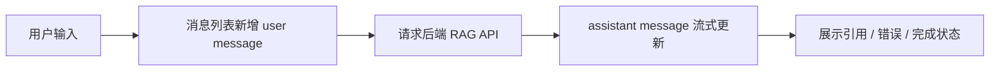
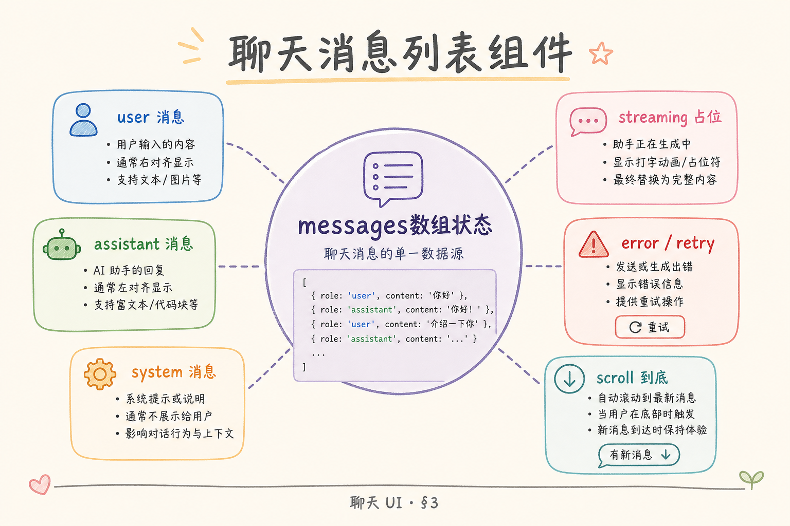
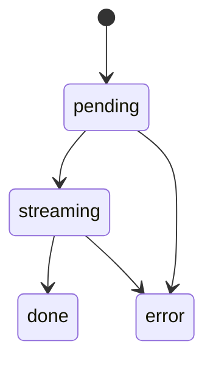
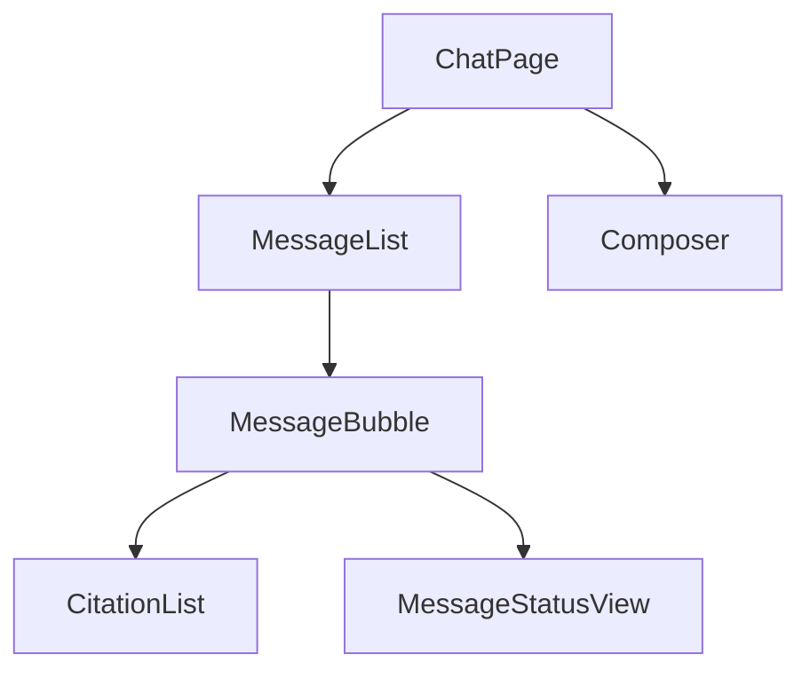
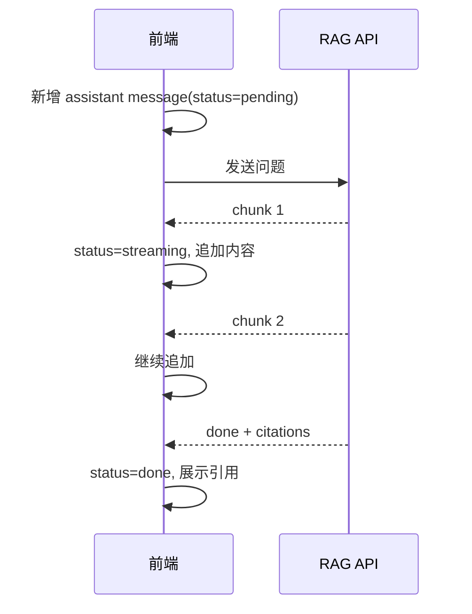
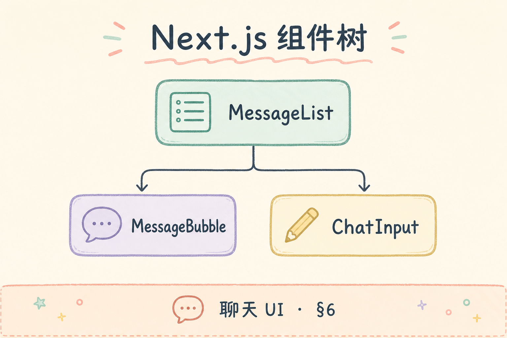

# G 前端与体验（一）：聊天消息列表 UI 入门指南

RAG 产品最后呈现给用户的，往往是一个聊天界面。检索、引用、流式输出、错误状态都要通过消息列表表达出来。如果消息列表只做成“几段文字从上往下排”，用户会看不出答案是否还在生成、引用来自哪里、失败后该怎么办。

本文面向刚开始写前端的读者。读完后，你应该能理解聊天消息列表 UI 要解决什么问题，如何设计 Message 数据模型，如何拆分 List、Bubble、Input 组件，并知道流式输出、滚动和错误状态的基本处理方式。

## 目录

- [1. 聊天 UI 在 RAG 产品里承担什么](#1-聊天-ui-在-rag-产品里承担什么)
- [2. 消息列表是什么](#2-消息列表是什么)
- [3. Message 数据模型](#3-message-数据模型)
- [4. 组件拆分](#4-组件拆分)
- [5. 流式输出状态](#5-流式输出状态)
- [6. 滚动与自动跟随](#6-滚动与自动跟随)
- [7. 引用、错误和空状态](#7-引用错误和空状态)
- [8. 常见错误](#8-常见错误)
- [9. FAQ](#9-faq)
- [10. 总结](#10-总结)

## 1. 聊天 UI 在 RAG 产品里承担什么

聊天 UI 不是简单的文本容器。它要帮助用户判断三件事：系统是否理解了问题，答案是否仍在生成，答案依据来自哪里。尤其是 RAG 场景，引用和来源比普通聊天更重要。

一个基本 RAG 聊天界面通常包含用户消息、助手消息、生成中状态、引用列表、错误提示和输入框。



这张图说明：消息列表要跟 API 状态同步，而不是等请求结束后一次性插入文本。

## 2. 消息列表是什么

**消息列表**是按时间顺序展示对话记录的区域。它不仅展示文本，还承载角色、状态、引用、时间和错误信息。

| 元素 | 作用 |
|---|---|
| User Bubble | 展示用户问题 |
| Assistant Bubble | 展示模型回答 |
| Streaming Indicator | 告诉用户仍在生成 |
| Citations | 展示 RAG 来源 |
| Error State | 说明请求失败或无法回答 |
| Composer/Input | 输入下一条问题 |

不要把消息列表写成一个巨大组件。它会很快混入滚动、渲染、输入、网络请求和错误处理，难以维护。

## 3. Message 数据模型

先设计数据模型，再写 UI。一个实用的 Message 可以包含 id、role、content、status、citations 和 error。

```ts
type Role = "user" | "assistant";
type MessageStatus = "pending" | "streaming" | "done" | "error";

type Citation = {
  sourceId: string;
  title: string;
  snippet?: string;
};

type Message = {
  id: string;
  role: Role;
  content: string;
  status: MessageStatus;
  citations?: Citation[];
  error?: string;
};
```

这个模型的重点是把状态显式写出来。不要用 `content === ""` 猜测是否生成中，也不要用字符串里是否包含“错误”来判断失败。





显式状态能让 UI 更稳定：pending 显示占位，streaming 逐字更新，done 展示引用，error 展示重试入口。

## 4. 组件拆分

一个清晰的拆分方式是：页面负责数据流，MessageList 负责列表，MessageBubble 负责单条消息，Composer 负责输入。



这种拆分的好处是职责清楚。滚动逻辑放在 MessageList，单条消息样式放在 MessageBubble，引用展示放在 CitationList，输入提交放在 Composer。

一个简化 React 组件形状如下：

```tsx
function MessageList({ messages }: { messages: Message[] }) {
  return (
    <div className="message-list">
      {messages.map((message) => (
        <MessageBubble key={message.id} message={message} />
      ))}
    </div>
  );
}

function MessageBubble({ message }: { message: Message }) {
  return (
    <article className={`bubble bubble-${message.role}`}>
      <p>{message.content}</p>
      {message.status === "streaming" && <span>生成中...</span>}
      {message.error && <strong>{message.error}</strong>}
      {message.citations?.length ? (
        <CitationList citations={message.citations} />
      ) : null}
    </article>
  );
}
```

这段代码没有样式细节，重点是渲染条件来自 Message 状态，而不是分散在多个临时变量里。

## 5. 流式输出状态

RAG 聊天经常使用流式输出。前端收到一段 token，就把当前 assistant message 的 content 追加一段。这样用户不用等完整答案生成完。



实现时要注意：引用通常在最后返回，内容在流式过程中不断更新。不要因为 citations 暂时为空，就判断回答没有来源。

## 6. 滚动与自动跟随

聊天列表的滚动体验很容易出问题。用户在底部时，新内容应该自动跟随；用户向上查看历史时，不应该强行把他拉到底部。



| 状态 | 行为 |
|---|---|
| 用户接近底部 | 新消息自动滚到底 |
| 用户正在看历史 | 保持当前位置 |
| 发送新问题 | 通常滚到底部 |
| 流式生成 | 仅在接近底部时跟随 |

```ts
function isNearBottom(el: HTMLElement, threshold = 80) {
  return el.scrollHeight - el.scrollTop - el.clientHeight < threshold;
}
```

这个函数用来判断用户是否接近底部。它比每次都强制 `scrollToBottom()` 更符合真实使用习惯。

## 7. 引用、错误和空状态

RAG UI 必须认真处理引用。引用不是装饰，它告诉用户答案依据来自哪里。可以先做一个简单 CitationList，展示标题和片段。

```tsx
function CitationList({ citations }: { citations: Citation[] }) {
  return (
    <ul className="citations">
      {citations.map((citation) => (
        <li key={citation.sourceId}>
          <strong>{citation.title}</strong>
          {citation.snippet ? <p>{citation.snippet}</p> : null}
        </li>
      ))}
    </ul>
  );
}
```

错误状态也要具体。网络断开、无权限、没有检索到资料、模型超时，对用户的提示和重试方式都不同。

| 状态 | 用户提示 |
|---|---|
| 空对话 | 显示可提问范围和示例问题 |
| 无资料 | “当前资料不足，无法可靠回答” |
| 无权限 | “你没有访问该知识库的权限” |
| 请求超时 | “生成超时，请重试” |

## 8. 常见错误

第一个错误是只存字符串数组。没有 role、status、citations，后面很难支持流式、引用和错误状态。

第二个错误是每次更新都重建整个列表。长对话会导致性能问题。至少要保证 key 稳定，必要时再考虑虚拟列表。

第三个错误是强制滚到底。用户看历史时被拉回底部，会明显影响体验。应先判断是否接近底部。

第四个错误是把引用藏得太深。RAG 产品的可信度来自来源，引用应该跟答案一起出现，而不是只放在调试面板。

## 9. FAQ

**Q：消息 id 可以用数组下标吗？**  
不建议。插入、重试、删除都会让下标变化。应使用服务端 id 或前端生成的稳定 id。

**Q：Markdown 渲染应该放在哪里？**  
通常放在 MessageBubble 内部。要注意代码块、链接和 HTML 安全，不要直接渲染不可信 HTML。

**Q：引用应该显示全文吗？**  
不需要。默认显示标题和关键片段，点击后再展开原文或定位到来源。

**Q：流式输出失败后怎么处理？**  
把当前 assistant message 标为 `error`，保留已生成内容或提示可重试。不要悄悄删除失败消息。

## 10. 总结

聊天消息列表是 RAG 产品的主要交互界面。它要表达的不只是文本，还有角色、生成状态、引用、错误和滚动行为。


初学者可以先做好三件事：设计清楚 Message 数据模型，按 List / Bubble / Input 拆组件，用显式状态处理 pending、streaming、done 和 error。这样后续接入真实 RAG API、引用和流式输出时，界面不会被临时逻辑拖垮。
