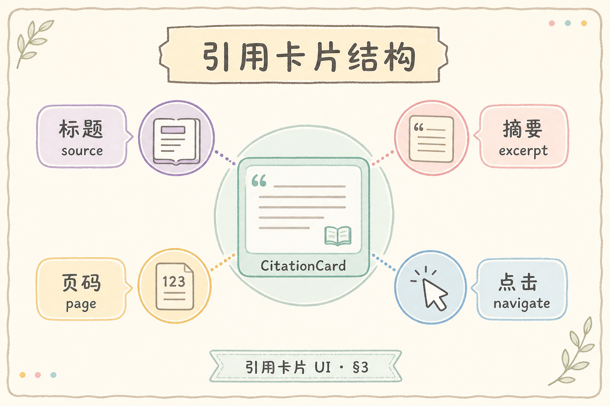
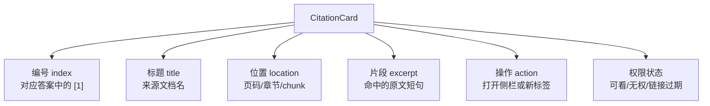
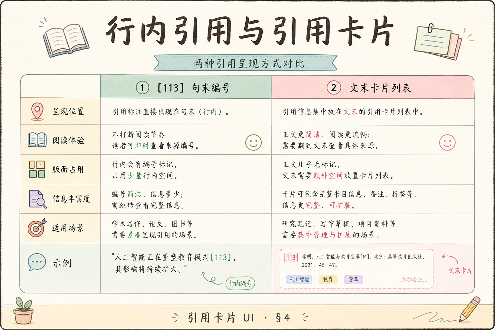
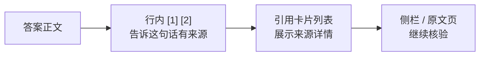
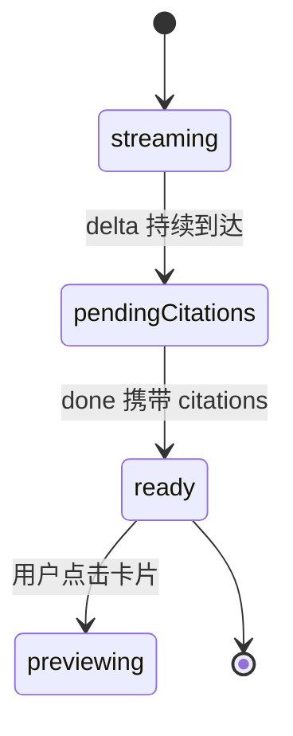

# F2 前端（六）：引用卡片 UI 完全指南

这篇讲的是 RAG 答案后面的“来源卡片”应该怎么设计和实现。引用卡片不是装饰，它解决的是一个核心信任问题：用户凭什么相信这段回答来自资料，而不是模型自己编的。

**引用**（citation）：答案里标出的资料来源。
通俗说：像论文里的参考文献，告诉读者“这句话是从哪里来的”。

**引用卡片**：把来源标题、摘要、页码、相关片段、跳转链接集中展示的 UI。
通俗说：它是答案旁边的证据盒。

## 目录

- [1. 引用卡片解决什么问题](#1-引用卡片解决什么问题)
- [2. 本文边界与目标](#2-本文边界与目标)
- [3. 卡片里应该放什么](#3-卡片里应该放什么)
- [4. 行内引用和卡片列表如何分工](#4-行内引用和卡片列表如何分工)
- [5. citations JSON 契约](#5-citations-json-契约)
- [6. CitationCard 组件](#6-citationcard-组件)
- [7. 与流式回答如何衔接](#7-与流式回答如何衔接)
- [8. 常见错误](#8-常见错误)
- [9. FAQ](#9-faq)
- [10. 总结与下一步](#10-总结与下一步)

## 1. 引用卡片解决什么问题

RAG 的卖点是“基于资料回答”。但如果页面只显示答案，不显示来源，用户仍然无法核验。引用卡片让用户可以从答案跳回原文，检查模型有没有误解资料。

它主要解决三件事：

| 问题 | 引用卡片的作用 |
|---|---|
| 答案可信度 | 展示来源标题、片段和位置 |
| 排错 | 发现检索到的资料是否不相关 |
| 产品闭环 | 用户能从答案跳到原文继续阅读 |

引用卡片不是越复杂越好。初学者先保证编号一致、字段清晰、权限正确，再考虑缩略图和高级交互。

## 2. 本文边界与目标

本文只讲前端卡片 UI 和数据契约，不重新讲 RAG 检索算法，也不讲 PDF 高亮定位。后续文章会把卡片点击连接到侧栏预览和 PDF 定位。

读完后你应该能：

- 设计一个最小可用的 citation 数据结构。
- 实现一个 `CitationCard` 组件。
- 处理行内 `[1]` 与卡片编号的一致性。
- 避免无权文档、空链接、过长片段导致的体验问题。

## 3. 卡片里应该放什么

下面这张图把引用卡片拆成几个区域。读图时重点看：每个字段都服务于“让用户核验来源”，不是为了堆信息。





最小字段建议如下：

| 字段 | 作用 | 示例 |
|---|---|---|
| `index` | 对齐答案中的 `[1]` | `1` |
| `title` | 告诉用户资料名 | `"员工手册 2026"` |
| `excerpt` | 展示命中的原文片段 | `"年假需提前三天申请"` |
| `location` | 辅助定位 | `"第 12 页"` |
| `url` | 跳转或预览 | `"/docs/handbook?page=12"` |

## 4. 行内引用和卡片列表如何分工

行内引用负责“句子级提示”，卡片列表负责“展开核验”。不要让两者承担同一件事。





结论：行内引用要轻，卡片要详细。用户读答案时不应被大量来源信息打断；当他想确认来源时，再看卡片或打开原文。

## 5. citations JSON 契约

后端返回的 `citations` 建议稳定，不要每次版本都改字段名。下面是一个适合前端渲染的结构：

```json
[
  {
    "index": 1,
    "title": "员工手册 2026",
    "excerpt": "年假需提前三天在系统中提交申请。",
    "location": "第 12 页",
    "url": "/preview/doc-123?page=12",
    "allowed": true
  }
]
```

字段解释：

- `index` 必须和答案里的 `[1]` 一致。
- `excerpt` 不宜太长，通常 80-160 个中文字符足够。
- `allowed` 用来表达权限，不能因为前端隐藏按钮就假设安全。

## 6. CitationCard 组件

下面代码演示最小组件。前置条件：项目使用 React；样式可以用 CSS、Tailwind 或组件库自行替换。

```tsx
type Citation = {
  index: number;
  title: string;
  excerpt: string;
  location?: string;
  url?: string;
  allowed: boolean;
};

export function CitationCard({ citation }: { citation: Citation }) {
  const disabled = !citation.allowed || !citation.url;

  return (
    <article className="citation-card">
      <div className="citation-card__index">[{citation.index}]</div>
      <div className="citation-card__body">
        <h3>{citation.title}</h3>
        {citation.location && <p className="muted">{citation.location}</p>}
        <p>{citation.excerpt}</p>
        <button disabled={disabled}>
          {disabled ? "无法打开来源" : "查看原文"}
        </button>
      </div>
    </article>
  );
}
```

预期行为：有权限并且有 `url` 时按钮可点；无权限或缺链接时，按钮禁用并给出诚实文案。

## 7. 与流式回答如何衔接

引用卡片最好在 `done` 事件后统一展示。流式过程中答案还没完整，引用编号也可能还在变化，提前展示会造成编号错位。



实现上可以把状态拆开：

- `content`：流式增长的答案文本。
- `citations`：完成后设置的来源列表。
- `citationReady`：控制引用是否可点击。

这样做比在每个 `delta` 里重排引用更稳。

## 8. 常见错误

这一节聚焦引用卡片的信任问题。只要编号、权限或来源片段有一处不可靠，用户就很难继续相信整套 RAG 回答。

### 8.1 卡片编号和行内编号不一致

如果正文里 `[2]` 指向 A 文档，卡片里 `[2]` 却是 B 文档，用户会立刻失去信任。编号应由后端统一生成，前端只渲染。

### 8.2 excerpt 过长

卡片不是原文阅读器。过长片段会撑破布局，也会让用户不知道重点在哪里。

### 8.3 无权文档仍可点击

前端隐藏不等于安全。后端也必须校验权限，前端只负责展示“无权查看”。

### 8.4 score 直接暴露给普通用户

检索分数对工程排错有用，但普通用户通常不理解。可以在调试模式展示，默认不放主 UI。

## 9. FAQ

**Q1：引用卡片和脚注是不是重复？**

不重复。脚注适合阅读流，卡片适合核验来源。两者可以共存。

**Q2：没有 URL 的来源怎么办？**

不要伪造链接。可以显示标题和片段，并标注“当前不可打开原文”。

**Q3：引用卡片应该排序吗？**

通常按正文首次出现顺序排序，用户最容易对应。

**Q4：同一个文档多个 chunk 怎么展示？**

初期可以展示多张卡片；后续可以按文档合并，并在卡片内列多个位置。

## 10. 总结与下一步

引用卡片的核心是可核验：编号一致、字段清楚、权限诚实、点击后能回到原文。它不只是 UI 组件，而是 RAG 产品建立信任的关键环节。


下一篇可以继续做“侧边栏原文预览”，让用户点击引用后不用离开当前对话页面就能检查资料。
