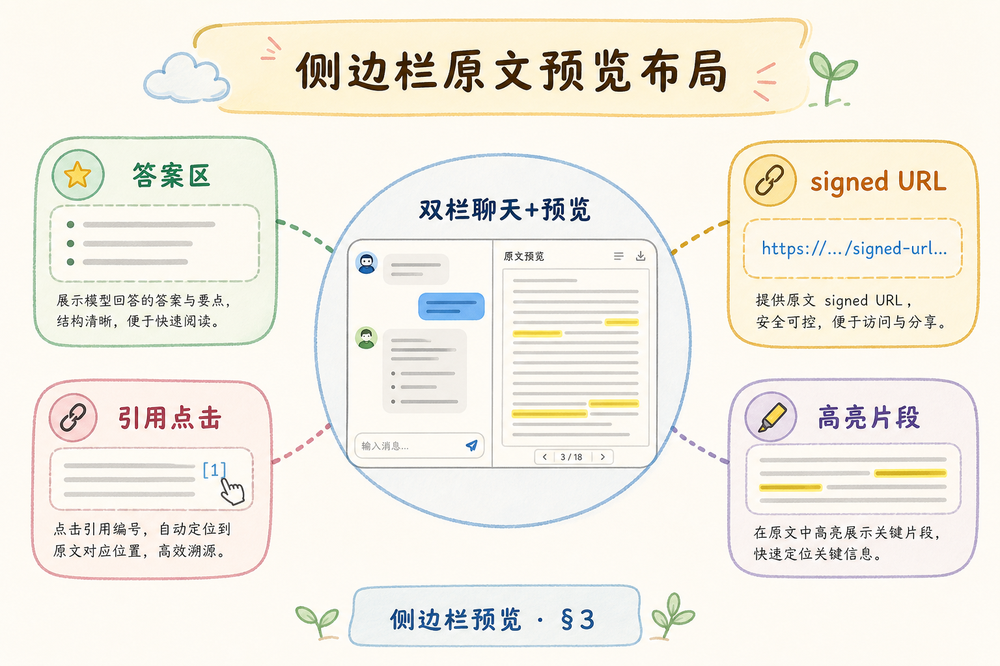
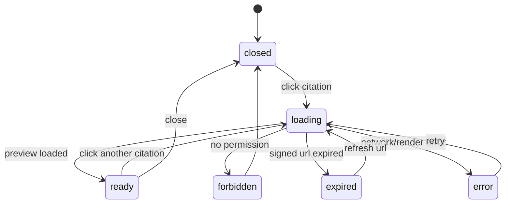
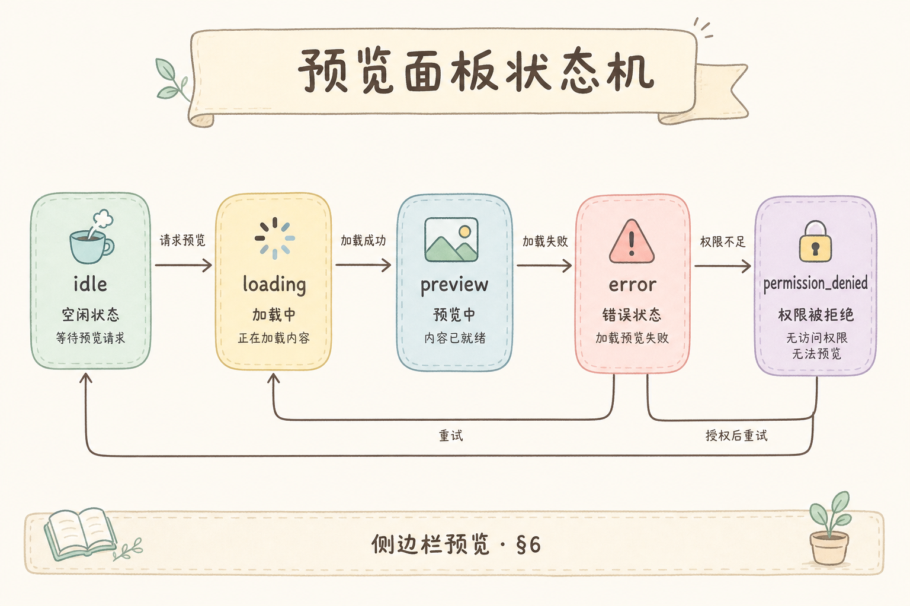
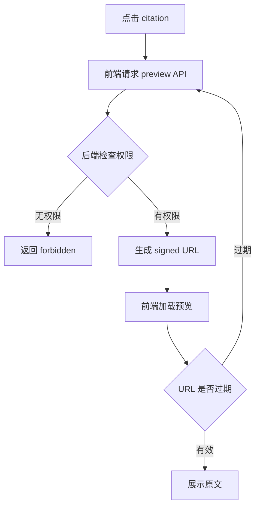

# F2 前端（七）：侧边栏原文预览完全指南

这篇讲的是：用户点击引用卡片后，如何在页面右侧打开原文预览。RAG 产品只展示答案和引用还不够，用户还需要快速核验“原文到底怎么说”。侧边栏预览就是为这个动作服务的。

**侧边栏预览**（preview sidebar）：在当前页面旁边打开资料内容。
通俗说：不用离开聊天页面，就能把答案和原文并排看。

**signed URL**：带签名和过期时间的临时访问链接。
通俗说：像一张限时门票，过期后就不能继续访问文件。

## 目录

- [1. 侧栏预览解决什么问题](#1-侧栏预览解决什么问题)
- [2. 本文边界与目标](#2-本文边界与目标)
- [3. 双栏布局](#3-双栏布局)
- [4. 预览状态机](#4-预览状态机)
- [5. 按文档类型选择预览器](#5-按文档类型选择预览器)
- [6. signed URL 与权限](#6-signed-url-与权限)
- [7. PreviewSidebar 组件](#7-previewsidebar-组件)
- [8. 常见错误](#8-常见错误)
- [9. FAQ](#9-faq)
- [10. 总结与下一步](#10-总结与下一步)

## 1. 侧栏预览解决什么问题

如果用户点击引用后跳到新标签页，他需要在两个页面之间来回切换。侧栏预览把答案和原文放在同一个工作区里，适合法务、客服、知识库问答等需要核验来源的场景。

| 场景 | 没有侧栏 | 有侧栏 |
|---|---|---|
| 检查答案依据 | 来回切页面 | 答案和原文并排看 |
| 多个引用对比 | 容易迷路 | 点击卡片切换预览 |
| 权限失败 | 可能白屏或 403 | 显示明确错误态 |

侧栏不是万能阅读器。它适合快速核验，长时间阅读仍然可以提供“打开完整文档”按钮。

## 2. 本文边界与目标

本文只讲前端侧栏预览的结构、状态和权限处理，不展开 PDF 高亮算法。PDF 定位和高亮会在下一篇单独讲。

读完后你应该能：

- 设计一个桌面双栏、移动端抽屉的布局。
- 根据文档类型选择 Markdown、HTML、PDF 或纯文本预览器。
- 处理 loading、ready、error、forbidden、expired 状态。
- 用 signed URL 避免永久暴露文件地址。

## 3. 双栏布局

下面这张图展示侧栏在页面里的位置。读图时重点看：消息列表仍是主区域，侧栏是核验区域，不应该抢走全部空间。




桌面端可以使用左右双栏；移动端空间不足，建议改成 bottom sheet 或全屏抽屉。不要在手机上硬塞 40% 宽度的侧栏。

一个基本布局可以这样理解：

```text
desktop:
| chat messages 65% | preview sidebar 35% |

mobile:
| chat messages |
| bottom sheet preview |
```

## 4. 预览状态机

侧栏不是只有“打开/关闭”两种状态。它需要处理加载、成功、无权限、链接过期、预览失败等情况。



这张图的结论是：错误态要可解释、可恢复。不要让 iframe 白屏，也不要只显示“加载失败”四个字。

## 5. 按文档类型选择预览器

不同文档需要不同预览方式。不要用一个 iframe 解决所有问题。

| 文档类型 | 推荐预览方式 | 注意点 |
|---|---|---|
| Markdown | 本地 Markdown renderer | 防 XSS，限制 HTML |
| HTML | sandbox iframe | 配 CSP 和域名白名单 |
| PDF | PDF.js / react-pdf | 大文件懒加载 |
| TXT | `<pre>` 或简单文本组件 | 保留换行 |
| Office | 转 PDF 或只提供下载 | 浏览器直开不稳定 |

初期可以先支持 Markdown、PDF、纯文本三类。不要为了“全能预览”把安全边界做乱。

## 6. signed URL 与权限

侧栏预览最容易被忽视的是权限。引用卡片能看到，不代表原文一定能打开；原文链接也不应该是永久公开地址。





结论：权限校验必须在后端做；signed URL 要有过期时间；前端要准备“链接过期，重新加载”的恢复路径。

## 7. PreviewSidebar 组件

下面是一个最小组件。前置条件：点击引用后传入 `citationId`，后端 `/api/v1/preview/:id` 返回预览信息。

```tsx
type PreviewState =
  | { status: "closed" }
  | { status: "loading" }
  | { status: "ready"; title: string; url: string; mime: string }
  | { status: "forbidden" }
  | { status: "expired" }
  | { status: "error"; message: string };

function PreviewBody({ state }: { state: PreviewState }) {
  if (state.status === "closed") return null;
  if (state.status === "loading") return <p>正在加载原文...</p>;
  if (state.status === "forbidden") return <p>你没有权限查看这份文档。</p>;
  if (state.status === "expired") return <p>链接已过期，请重新加载。</p>;
  if (state.status === "error") return <p>{state.message}</p>;

  if (state.mime === "application/pdf") {
    return <iframe title={state.title} src={state.url} />;
  }

  return <iframe title={state.title} src={state.url} sandbox="allow-scripts" />;
}
```

预期行为：不同状态显示不同内容；ready 状态才加载预览；无权限和过期都有明确文案。

## 8. 常见错误

这一节列出侧栏预览从 Demo 走向真实产品时最容易忽略的问题。重点不是“能不能打开”，而是打开后是否安全、可读、可恢复。

### 8.1 侧栏只显示 chunk 文本

chunk 只能说明命中了哪一小段，不能替代原文。侧栏应该尽量能打开原文位置。

### 8.2 使用永久公开 URL

永久 URL 一旦泄露，就绕过了系统权限。生产环境应使用 signed URL 或后端代理。

### 8.3 移动端强行双栏

手机屏幕太窄，双栏会让聊天和原文都不可读。应使用抽屉或全屏预览。

### 8.4 切换引用不卸载旧 iframe

旧 iframe 可能继续播放、加载或保留错误状态。切换 citation 时应更新 key 或明确重置状态。

## 9. FAQ

**Q1：为什么不用新标签页？**

可以提供新标签页作为补充，但侧栏更适合快速核验和对照阅读。

**Q2：iframe 安全吗？**

取决于内容来源和 sandbox 配置。对不可信 HTML 必须限制脚本、域名和权限。

**Q3：signed URL 多久过期合适？**

通常几分钟到几十分钟。太短影响阅读，太长增加泄露风险。

**Q4：侧栏要缓存吗？**

可以缓存元数据和短时间 URL，但要处理过期刷新，不要缓存无权限结果太久。

## 10. 总结与下一步

侧栏预览的目标是让用户快速核验来源。实现时要抓住三件事：布局不打断主流程，状态清楚可恢复，权限和临时链接不能省。


下一篇继续讲 PDF 高亮定位：当用户打开 PDF 后，如何跳到对应页并标出相关文本。
