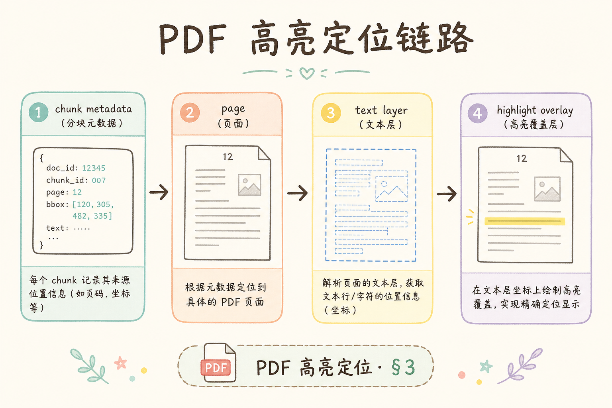
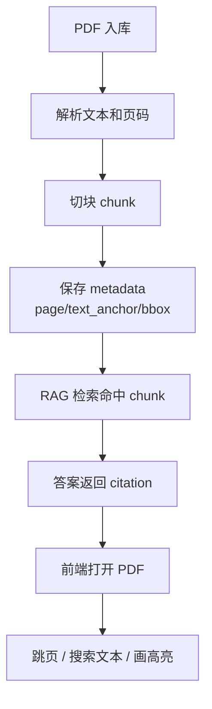
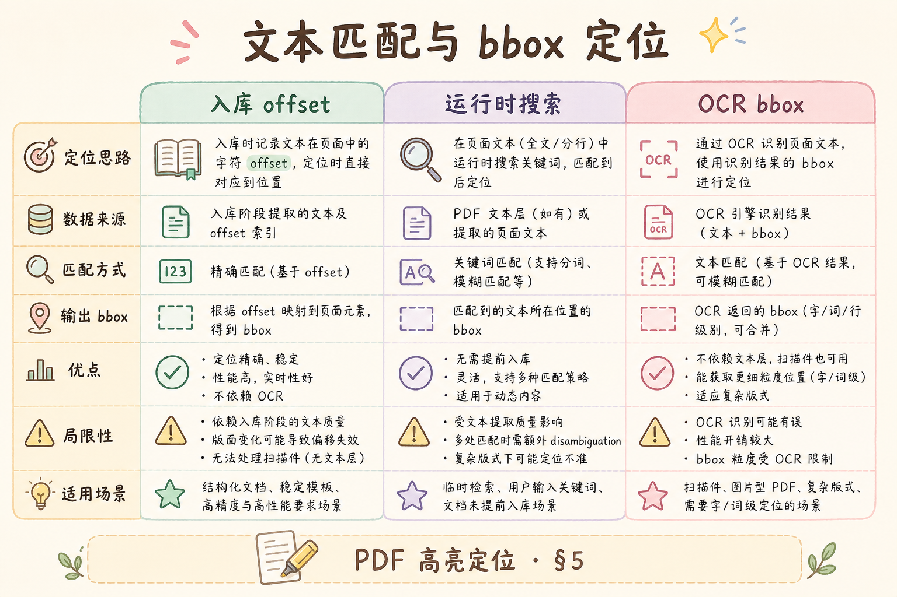
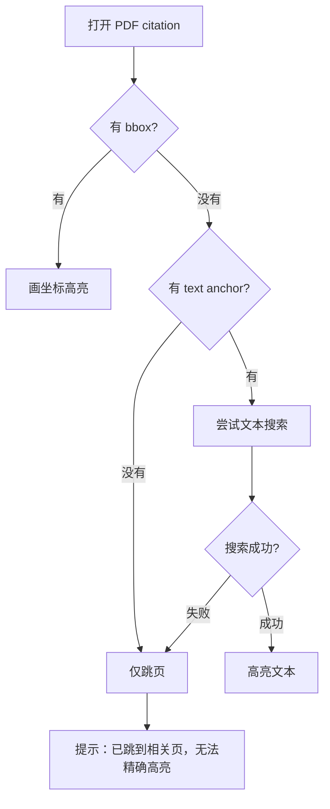

# F2 前端（八）：PDF 高亮定位完全指南

这篇讲的是：RAG 答案引用了 PDF 里的某段文字时，前端如何打开 PDF、跳到对应页，并尽量把相关文字高亮出来。它是“引用可核验”的最后一环。

**PDF 高亮定位**：在 PDF 预览器中找到并标出引用对应的原文位置。
通俗说：用户点来源后，不只是打开整份 PDF，而是尽量把他带到“证据所在的那一页、那一段”。

**text anchor**：用于定位文本的一小段原文锚点。
通俗说：像地图上的门牌号，帮助系统在 PDF 里找到对应句子。

## 目录

- [1. PDF 定位解决什么问题](#1-pdf-定位解决什么问题)
- [2. 本文边界与目标](#2-本文边界与目标)
- [3. 定位链路](#3-定位链路)
- [4. 入库时应该存什么](#4-入库时应该存什么)
- [5. 三种定位策略](#5-三种定位策略)
- [6. 前端最小实现思路](#6-前端最小实现思路)
- [7. 扫描件与 OCR 降级](#7-扫描件与-ocr-降级)
- [8. 常见错误](#8-常见错误)
- [9. FAQ](#9-faq)
- [10. 总结与下一步](#10-总结与下一步)

## 1. PDF 定位解决什么问题

PDF 通常很长，合同、年报、手册动辄几十页。只给用户一个 PDF 链接，等于让用户自己重新搜索证据。高亮定位把“来源可点击”升级为“证据可到达”。

| 能力 | 用户体验 |
|---|---|
| 只打开 PDF | 用户还要自己找 |
| 跳到页码 | 用户知道大概位置 |
| 文本高亮 | 用户直接看到证据 |
| bbox 精准框选 | 对表格、扫描件更友好 |

初学者要先接受一个事实：PDF 定位不可能永远精准。不同 PDF 的文本层、排版、扫描质量差异很大，所以要做降级策略。

## 2. 本文边界与目标

本文讲前端预览和定位策略，不深入讲后端 PDF 解析库。后端可以用 PyMuPDF、pdfplumber 或其他工具在入库阶段提取页码、文本和坐标。

读完后你应该能：

- 设计 citation metadata，让前端有定位依据。
- 区分页码跳转、文本搜索、bbox 高亮三种策略。
- 在无法精准定位时给用户诚实降级。
- 避免 0-based / 1-based 页码混乱。

## 3. 定位链路

下面这张图展示从入库到点击引用的完整链路。读图时重点看：前端能不能高亮，取决于入库时有没有保存足够 metadata。





这张图的结论：PDF 高亮不是前端单方面能解决的问题。后端入库阶段必须提前保存定位线索。

## 4. 入库时应该存什么

一个 citation 至少要包含文档 ID 和页码；想做高亮，还需要文本锚点或坐标。

```json
{
  "doc_id": "contract-2026",
  "title": "采购合同.pdf",
  "page": 12,
  "text_anchor": "乙方应在收到发票后十个工作日内付款",
  "bbox": [0.12, 0.34, 0.88, 0.39]
}
```

字段解释：

| 字段 | 作用 |
|---|---|
| `doc_id` | 找到是哪份 PDF |
| `page` | 先跳到大概页 |
| `text_anchor` | 在页面文本层里搜索 |
| `bbox` | 用坐标画高亮框 |

**bbox**（bounding box，边界框）：一段内容在页面上的坐标范围。
通俗说：像在纸上用荧光笔框出的矩形区域。

## 5. 三种定位策略

不同项目可以按成本逐步升级。不要一开始就追求最难的 bbox。





| 策略 | 需要的 metadata | 优点 | 缺点 |
|---|---|---|---|
| 页码跳转 | `page` | 最容易实现 | 只能到页，不能到句子 |
| 文本搜索 | `page + text_anchor` | 对文本型 PDF 友好 | 多栏、换行、乱码会失败 |
| bbox 高亮 | `page + bbox` | 最精准 | 入库成本高，坐标要归一化 |

建议路线：先做页码跳转，再加文本搜索；只有当业务强依赖精确定位时，再做 bbox。

## 6. 前端最小实现思路

下面是一个概念性 React 片段。前置条件：你已经有 PDF 预览组件，并能控制当前页。

```tsx
type PdfCitation = {
  url: string;
  page: number;
  text_anchor?: string;
  bbox?: [number, number, number, number];
};

function openPdfCitation(citation: PdfCitation) {
  const pageIndex = citation.page - 1; // 后端给用户页码，前端组件常用 0-based
  setPdfUrl(citation.url);
  setCurrentPage(pageIndex);

  if (citation.bbox) {
    setHighlight({ pageIndex, bbox: citation.bbox });
    return;
  }

  if (citation.text_anchor) {
    searchTextOnPage(pageIndex, citation.text_anchor);
  }
}
```

预期行为：优先使用 bbox；没有 bbox 时用文本搜索；再不行至少跳到页码。注意 `page - 1` 这一行，它专门处理页码基准差异。

## 7. 扫描件与 OCR 降级

**OCR**（Optical Character Recognition，光学字符识别）：把图片里的文字识别成可搜索文本。
通俗说：扫描件本来只是图片，OCR 会尽量把图片里的字“抄”成文本。

扫描件通常没有可靠文本层，文本搜索可能失败。这时可以采用下面的降级链路：



这张图的重点是“诚实降级”。不要在无法确认位置时画一个假的高亮框。

## 8. 常见错误

这一节总结 PDF 定位最常见的实现风险。PDF 的难点在于格式差异很大，所以宁可诚实降级，也不要给用户一个看似精准但实际错误的高亮。

### 8.1 页码 0-based 和 1-based 混用

用户看到的 PDF 页码通常从 1 开始，很多组件内部页码从 0 开始。接口文档必须写清楚。

### 8.2 没有文本层仍假装高亮

扫描件搜索不到文字时，应提示“只能跳页”，不要随便画框误导用户。

### 8.3 一次渲染所有页

大 PDF 会非常卡。应按当前页和附近页懒加载。

### 8.4 citation excerpt 与 PDF 高亮不一致

如果卡片片段和高亮文字对不上，用户会怀疑系统胡编。应在入库阶段统一生成 excerpt 和 text_anchor。

## 9. FAQ

**Q1：一定要用 bbox 吗？**

不一定。多数入门项目先做页码跳转和文本搜索就够了。

**Q2：多栏 PDF 为什么难？**

多栏排版会让文本抽取顺序和视觉顺序不一致，搜索锚点可能跨栏失败。

**Q3：PDF 密码保护怎么办？**

前端不应绕过权限。后端需要先确认用户有权限，再生成可预览链接。

**Q4：高亮失败是不是系统错误？**

不一定。可以把它当成降级：答案和来源仍可用，只是不能精确标出句子。

## 10. 总结与下一步

PDF 高亮定位的核心是 metadata：页码、文本锚点、bbox。前端负责把这些线索转成跳页、搜索和高亮；后端负责在入库时保存足够可靠的线索。


到这里，前端引用体验已经形成闭环：答案里有引用，引用卡片可核验，侧栏可预览，PDF 可以尽量定位。后续可以继续进入生产管理台、成本监控和高级 RAG 能力。
