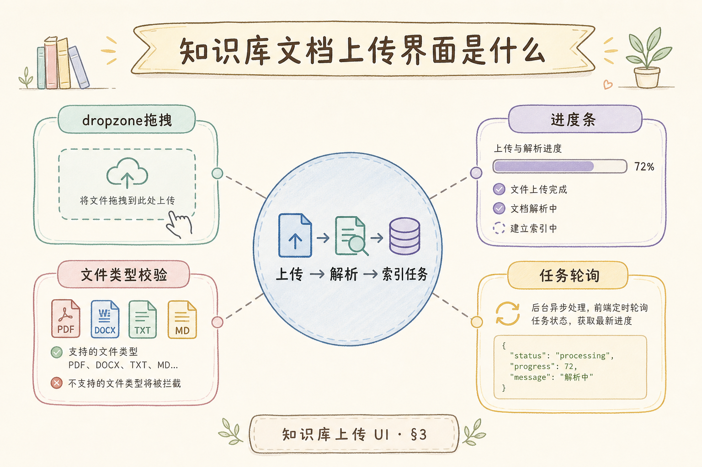
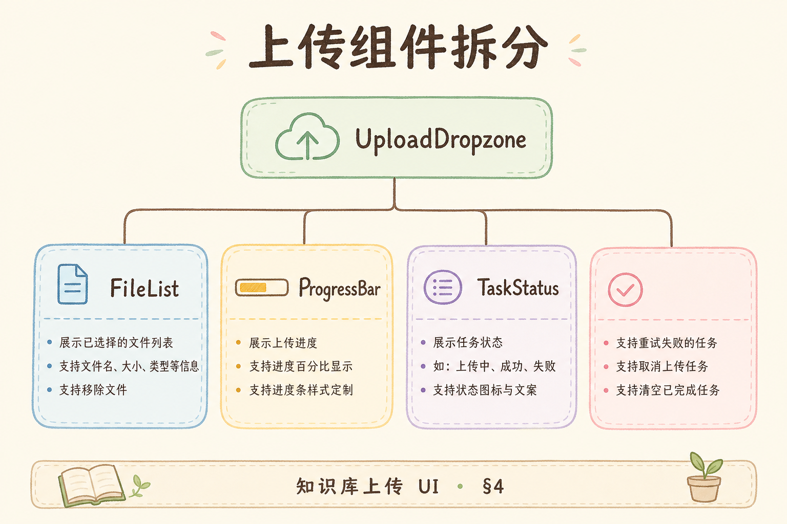
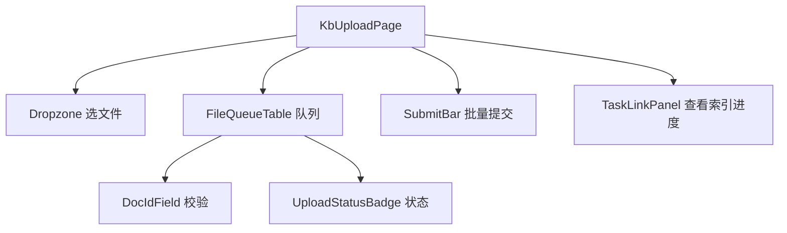
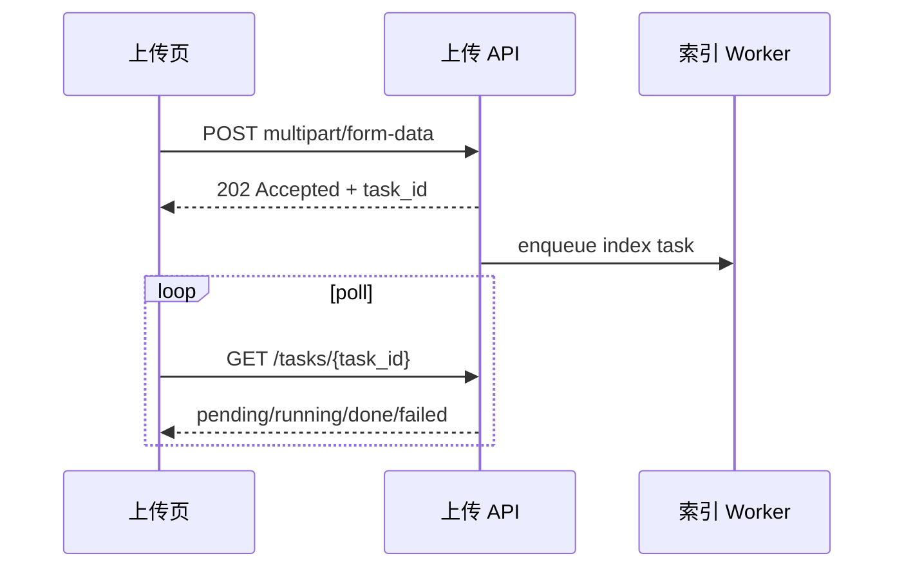
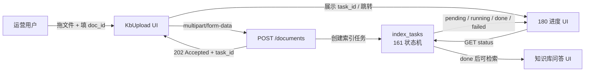

# F2 前端（九）：知识库文档上传界面完全指南

> 后端 [157 multipart 上传](157.file-upload-multipart-tutorial.md) 返回 **202 + task_id** 后，用户仍停留在 **知识库管理页**——若没有 **拖拽上传区、文件列表、元数据表单、进度入口**，运营只能 curl。**知识库文档上传界面** 把 **选文件 → 填 doc_id → 提交 → 看见任务** 串成一条可点击路径。本篇是 [企业 RAG 路线图](ENTERPRISE_RAG_ROADMAP.md) **F2 前端主线篇**（路线图 **196**）。前置：[157 上传](157.file-upload-multipart-tutorial.md)、[161 索引任务状态机](161.index-task-state-machine-tutorial.md)、[170 OpenAPI](170.openapi-swagger-docs-tutorial.md)、[164 JWT](164.jwt-auth-rag-tutorial.md)。

---

## 目录

1. [前言：上传界面是知识库产品的「进货口」](#1-前言上传界面是知识库产品的进货口)
2. [本文边界与动手路径](#2-本文边界与动手路径)
3. [上传界面是什么](#3-上传界面是什么)
4. [与后端 API 的契约对齐](#4-与后端-api-的契约对齐)
5. [组件拆分：Dropzone / FileQueue / MetaForm](#5-组件拆分dropzone--filequeue--metaform)
6. [multipart 客户端：FormData 与进度条](#6-multipart-客户端formdata-与进度条)
7. [上传后与索引任务状态联动](#7-上传后与索引任务状态联动)
8. [先错对对：五种典型翻车](#8-先错对对五种典型翻车)
9. [综合实战：KbUploadPage 最小实现](#9-综合实战kbuploadpage-最小实现)
10. [校验、权限与错误展示](#10-校验权限与错误展示)
11. [综合概念地图](#11-综合概念地图)
12. [常见陷阱与 FAQ](#12-常见陷阱与-faq)
13. [总结与系列下一步](#13-总结与系列下一步)

## 1. 前言：上传界面是知识库产品的「进货口」

企业 RAG 的 **第一条用户故事** 往往是：「把这份 PDF 放进知识库，明天问答能用。」后端 [157 篇](157.file-upload-multipart-tutorial.md) 已把 **multipart/form-data**、**对象存储**、**202 异步任务** 讲清；[161 篇](161.index-task-state-machine-tutorial.md) 定义了 **pending → running → done | failed** 的单一事实来源。前端若仍是一个裸 `<input type="file">`，会出现三类痛点：

1. **运营不知道 doc_id 规则**——随手填 `test.pdf` 导致检索与 [50 doc_id](50.metadata-doc-id-tutorial.md) 元数据混乱；  
2. **大文件无反馈**——用户以为卡死，重复点击上传，触发 [162 幂等](162.idempotent-reindex-tutorial.md) 边界；  
3. **上传成功 ≠ 可检索**——界面不引导去看 **索引进度**（[180 篇](180.index-progress-ui-tutorial.md)），客服被问爆「为什么搜不到」。

**知识库文档上传界面（Kb Document Upload UI）**：在管理后台或知识库详情页内，提供 **拖拽区、待传队列、元数据表单、批量限制提示、提交后任务跳转** 的 React 组件集合。  
通俗说：**网盘上传页的企业版**——但字段要对齐 RAG 的 `doc_id`、`tenant_id`、`content_hash` 语义，且 **绝不** 在浏览器里做 embed。

**读完本文，你应该能做到：**

1. 用 **FormData** 对接 `POST /api/v1/documents`，展示 **上传字节进度**（XHR/fetch 可选）。  
2. 解析 **202** 响应里的 `task_id`，跳转或内嵌 **进度组件**（衔接 [161](161.index-task-state-machine-tutorial.md)）。  
3. 实现 **扩展名白名单、单文件大小、并发上传数** 的前端预校验，与后端 413/415 对齐。  
4. 在 JWT 场景下 **带头鉴权**（[164](164.jwt-auth-rag-tutorial.md)），处理 401/403/429（[169](169.rate-limiting-api-tutorial.md)）。  
5. 识别 §8 五种错法：同步等待索引、用 filename 当 doc_id、无任务反馈、重复提交、泄露原始路径。

### 1.1 F2 前端链位置

```text
188 聊天消息列表
...
196 知识库文档上传界面 ← 本篇
197 解析/索引进度展示
198 重建索引操作
199 检索调试台
```

**学习顺序**：先能 **传文件拿 task_id**（本篇），再 [180](180.index-progress-ui-tutorial.md) 看 **running 到哪一步**，最后 [181](181.reindex-ui-tutorial.md) 处理 **运维重跑**。

### 1.2 术语双轨速查

| 中文 | English | 一句话 |
|------|---------|--------|
| 拖拽上传区 | Dropzone | 接收拖放与点击选文件的区域 |
| 待传队列 | Upload queue | 本地选中、尚未提交或正在提交的文件列表 |
| 多部分表单 | multipart/form-data | 文件字节与文本字段同一 POST |
| 异步接受 | 202 Accepted | 已接收请求，索引在后台进行 |
| 索引任务 | index task | 上传后触发的解析/embed 流水线 |

### 1.3 读完本篇的最小交付物

1. 页面 **`/kb/upload`** 可拖拽 PDF/DOCX/MD 并提交；  
2. 成功响应后列表出现 **task_id** 链接或内嵌进度条占位；  
3. **doc_id** 有格式校验（如 `^[a-z0-9][a-z0-9-_]{2,63}$`）；  
4. 单文件超限时 **前端拦截** 并提示与后端一致的上限；  
5. §8 先错对对表能口述给同事。

### 1.4 为什么「上传界面」值得单独成篇

很多团队把上传当成 **一个 input 控件**，却把索引、检索、聊天各写一长篇。结果联调时才发现：**运营流程卡在「不知道怎么传、传完干嘛」**。上传界面是 **F2 与 F1 的接缝**：它必须懂 HTTP 202，却不必懂 HNSW。把它写清楚，能减少 **一半「上传成功但搜不到」的伪 bug 工单**——真 bug 往往在 worker，但用户描述总是「上传坏了」。

### 1.5 与路线图 196 的验收标准

路线图 **196** 要求的是 **可交付界面**，不是 Demo 截图。验收建议：**新人按本文 §9 从零搭页，30 分钟内完成一次真实 PDF 上传并在任务 API 看见 pending**。通过即算本篇达标。

## 2. 本文边界与动手路径

**档位：F2 主线篇（路线图 196，厚实现导向）。**

**本文讲：** React 上传 UI、FormData、202 处理、与 161 任务联动、错误态、无障碍基础。  
**本文不讲：** 分片续传（TUS）、断点续传全书、病毒扫描实现、Worker 内 ingest 逻辑（属 F1）。

### 2.1 动手路径表

| 步骤 | 你做什么 | 验收 |
|------|----------|------|
| A | 读 §3～§4，对照 [170 OpenAPI](170.openapi-swagger-docs-tutorial.md) | 字段名一致 |
| B | 搭 Dropzone + 单文件上传 | Network 见 multipart |
| C | 接 202，存 task_id | 列表可点 |
| D | 加 doc_id 校验与 tenant | 非法 id 红框 |
| E | 跟做 §9 KbUploadPage | 端到端 demo |
| F | §8 先错对对 | 五种错法 |

**环境：** Node 18+；`npx create-next-app@latest rag-admin --typescript --app --tailwind`；后端本地 [157](157.file-upload-multipart-tutorial.md) 已启。

### 2.2 沿用前文

| 概念 | 来自 |
|------|------|
| multipart 与 202 | [157 上传](157.file-upload-multipart-tutorial.md) |
| 任务四态 | [161 状态机](161.index-task-state-machine-tutorial.md) |
| doc_id 语义 | [50 metadata doc_id](50.metadata-doc-id-tutorial.md) |
| JWT 请求头 | [164 JWT](164.jwt-auth-rag-tutorial.md) |
| API 类型 | [170 OpenAPI](170.openapi-swagger-docs-tutorial.md) |

### 2.3 常见页面路由与导航

建议上传入口在 **知识库侧边栏** 固定项「导入文档」，而非埋在设置深处。面包屑：`知识库 / {kbName} / 上传`。上传成功后 **保留在队列页** 展示任务，而不是立即 redirect——redirect 会打断批量上传心流。

### 2.4 与设计稿协作要点

给设计师的 brief：**上传区要最大视觉权重**；doc_id 输入框 **等宽字体** 便于辨认连字符；错误态 **行内** 展示，勿只用顶部 toast（批量时用户看不到是哪一行失败）。

## 3. 上传界面是什么

上传页在知识库运营链路里负责“进货”，它把本地文件变成后端可处理的文档任务。





这张图要强调一点：上传成功只是文件到达服务器，真正能问答要等索引任务完成。

对照上图：

- **左侧/顶部**：知识库选择、`tenant_id`（多租户时只读展示）；  
- **中央 Dropzone**：拖入或点击，`accept` 限制 MIME/扩展名；  
- **队列列表**：文件名、大小、doc_id 输入、移除按钮；  
- **提交**：逐条或批量 `POST /documents`；  
- **结果区**：`task_id`、链到 [180 进度 UI](180.index-progress-ui-tutorial.md)。

### 3.1 与「聊天里传附件」的区别

[171 聊天 UI](171.chat-message-list-ui-tutorial.md) 可能在 user 消息带 **file chip**——那是 **会话级附件**，往往 **不进向量库** 或走短链。本篇是 **知识库入库**：必须 **doc_id**、走 **索引任务**，产品入口通常在 **管理后台 / 知识库设置**，而非聊天输入框旁。

### 3.2 页面信息架构建议

```text
KbUploadPage
├── KbHeader (知识库名、配额提示)
├── Dropzone
├── FileQueueTable
│   └── FileQueueRow × N
│       ├── 文件名 / 大小
│       ├── DocIdField
│       └── UploadStatusBadge
├── SubmitBar (全部上传 / 清空)
└── RecentTasksPanel → 衔接 180
```

### 3.3 非功能需求速览

| 维度 | 建议 |
|------|------|
| 可发现性 | 空状态文案写清支持格式与上限 |
| 防重复 | 提交中 disable 按钮 + requestId |
| 可访问性 | Dropzone 可键盘聚焦、aria 描述 |
| 观测 | 埋点：upload_start / upload_202 / upload_fail |

### 3.4 运营场景走查（三条真实故事）

**故事 A：季度制度更新。** HR 每季度替换《员工手册》PDF。运营打开知识库上传页，拖入新版文件，将 doc_id 保持为 `employee-handbook`（与 [50 doc_id](50.metadata-doc-id-tutorial.md) 约定一致），提交后界面展示 task_id 并自动展开索引进度。若 [49 增量](49.incremental-update-tutorial.md) 检测到 hash 变化，worker 会走完整流水线；运营无需理解 embed，只需看见 [161](161.index-task-state-machine-tutorial.md) 的 `done`。

**故事 B：批量入职包。** 一次拖入五份 DOCX，队列五行各自 slug 化 doc_id，运营批量改前缀为 `onboarding-2025-`，点「上传全部」。前端应 **限制并发**（例如同时最多三个 POST），避免打满网关与 Celery 队列。每行独立状态，失败行可单独重试，不影响已成功拿到 task_id 的行。

**故事 C：误传加密 PDF。** 后端 parse 阶段失败，[180 进度](180.index-progress-ui-tutorial.md) 显示 `encrypted_pdf`。上传 UI 本身无法预知，但应在 **帮助链接** 中说明「请上传未加密可提取文本的 PDF」——减少无效工单。

### 3.5 与对象存储路径的「用户零感知」

[157 篇](157.file-upload-multipart-tutorial.md) 强调存储路径用 uuid，**前端永远不要把服务器路径展示给运营**。用户只需知道 doc_id 与原始文件名；`storage_path` 是 F1 内部字段。若详情页要展示「源文件」，用 **预签名下载 URL**，而非裸路径。

### 3.6 拖拽边界与移动端（工程备忘）

Citrix 虚拟桌面常导致拖放失效——**点击选文件** 必须与拖拽同等权重。iOS Safari 对 `accept` 行为特殊，必要时提示用桌面浏览器上传大文件。文件夹拖入应提示「请选单个文件」，除非后端提供 batch 端点。弱网下 XHR 超时后允许 **单行重试**，勿 silent fail。队列总字节和可设上限，防止一次选过多大文件拖垮 worker。以上边界场景应写入 QA 清单，与 [157](157.file-upload-multipart-tutorial.md) 联调时一并回归。

## 4. 与后端 API 的契约对齐

前端 **不要猜字段名**。以 [157](157.file-upload-multipart-tutorial.md) 与 [170 OpenAPI](170.openapi-swagger-docs-tutorial.md) 为准：

```typescript
// types/upload.ts — 与 OpenAPI 生成类型对齐
export interface DocumentUploadResponse {
  task_id: string;
  status: "pending";
  doc_id: string;
}

export interface UploadFormFields {
  doc_id: string;
  tenant_id?: string;
  file: File;
}
```

**HTTP 语义：**

- **202 Accepted**： body 含 `task_id`，**不是** 200 OK——UI 文案应写「已提交索引」，勿写「上传成功可问答」；  
- **413**：文件过大——前端应预判 `MAX_BYTES`；  
- **409**：doc_id 冲突或幂等拒绝——提示改 id 或走 [181 重建](181.reindex-ui-tutorial.md)；  
- **401/403**：跳转登录或权限说明。

### 4.1 doc_id 生成策略

| 策略 | 适用 | 风险 |
|------|------|------|
| 用户手填 | 强运营、需可读 id | 空格、中文、重复 |
| 由文件名 slug 化 | 快速 PoC | 重名覆盖 |
| 上传前服务端预分配 | 企业规范 | 多一次 API |

推荐：**默认 slug 化预填 + 可编辑 + 实时校验**，保存时与 [50 doc_id](50.metadata-doc-id-tutorial.md) 规则一致。

### 4.2 tenant_id 与多租户

[183 多租户](183.multi-tenant-isolation-tutorial.md) 场景下，`tenant_id` 通常 **从 JWT 解析**，表单 **只读展示**，禁止用户改 tenant 传别家数据——这是 **安全底线**，不是 UI 美化。

### 4.3 OpenAPI 驱动的表单字段同步

建议从 [170 OpenAPI](170.openapi-swagger-docs-tutorial.md) codegen 出 `DocumentUploadResponse` 与错误体类型，上传页 **禁止手写** 与后端不一致的字段名（如 `taskId` vs `task_id`）。当后端新增可选字段 `tags`、`acl_group`（[53 ACL](53.metadata-acl-tutorial.md)）时，UI 用 **feature flag** 渐进露出，避免老后端未部署时整页报错。

### 4.4 状态码决策表（前端路由）

| HTTP | 前端行为 |
|------|----------|
| 202 | 行态转 accepted，展示 task_id |
| 400 | 高亮 doc_id 或表单字段 |
| 401 | 跳转登录，保留队列草稿（sessionStorage） |
| 403 | 模态说明无 kb:write 权限 |
| 409 | 提示 doc_id 冲突，建议改 id 或 [181 重建](181.reindex-ui-tutorial.md) |
| 413 | 文件过大，行内红色提示 |
| 429 | 展示 Retry-After 倒计时 [169](169.rate-limiting-api-tutorial.md) |
| 5xx | 可重试按钮 + trace_id 供工单 |

### 4.5 与 content_hash 的展示策略

hash 一般由 **后端计算**（[157](157.file-upload-multipart-tutorial.md) 读 body 后 sha256）。高级模式可在上传成功后只读展示 hash 前八位，帮助运维对账 [49 增量](49.incremental-update-tutorial.md)；普通运营默认隐藏，减少认知负担。

## 5. 组件拆分：Dropzone / FileQueue / MetaForm

组件拆分不是为了炫技，而是为了让错误态、批量态和任务态各自可测。





这张图的结论是：Dropzone 只管选文件，任务状态要交给独立面板，否则后续接 [180 进度 UI](180.index-progress-ui-tutorial.md) 会很难维护。

### 5.1 Dropzone

职责：**接收 File[]**，过滤类型与大小，写入 **客户端队列 state**（尚未上传）。

```tsx
// components/kb/Dropzone.tsx
"use client";

import { useCallback } from "react";

const ACCEPT = {
  "application/pdf": [".pdf"],
  "text/markdown": [".md"],
  "application/vnd.openxmlformats-officedocument.wordprocessingml.document": [".docx"],
};
const MAX_BYTES = 50 * 1024 * 1024;

export function Dropzone({ onFiles }: { onFiles: (files: File[]) => void }) {
  const onDrop = useCallback(
    (e: React.DragEvent) => {
      e.preventDefault();
      const list = Array.from(e.dataTransfer.files).filter((f) => f.size <= MAX_BYTES);
      if (list.length) onFiles(list);
    },
    [onFiles]
  );

  return (
    <div
      role="button"
      tabIndex={0}
      onDragOver={(e) => e.preventDefault()}
      onDrop={onDrop}
      className="border-2 border-dashed rounded-xl p-12 text-center cursor-pointer hover:bg-gray-50"
      onClick={() => document.getElementById("kb-file-input")?.click()}
    >
      <p className="text-lg font-medium">拖拽文件到此处，或点击选择</p>
      <p className="text-sm text-gray-500 mt-2">支持 PDF、DOCX、Markdown，单文件最大 50MB</p>
      <input
        id="kb-file-input"
        type="file"
        multiple
        accept={Object.keys(ACCEPT).join(",")}
        className="hidden"
        onChange={(e) => {
          const list = Array.from(e.target.files ?? []).filter((f) => f.size <= MAX_BYTES);
          if (list.length) onFiles(list);
          e.target.value = "";
        }}
      />
    </div>
  );
}
```

### 5.2 FileQueueRow 与 MetaForm

每行一个 **待传项**：`localId`、`file`、`docId`、`status: idle | uploading | accepted | error`。

**MetaForm** 可复用为侧栏：批量设置 **同一前缀 doc_id**（如 `handbook-2025-` + 序号），减少运营手工输入。

### 5.3 RecentTasksPanel

展示本会话已拿到的 `task_id` 列表，链到 `GET /index-tasks/{id}` 或内嵌 [180](180.index-progress-ui-tutorial.md) 组件——让用户 **上传后不必离开页面** 也能看见「排队中」。

### 5.4 FileQueueRow 状态机细化

建议将每行 `phase` 细分为：`idle` → `uploading` → `accepted` | `error`，其中 `uploading` 只表示 **HTTP 传输**，`accepted` 表示 **已 202**。不要把 `accepted` 写成「已完成」——那是 [161](161.index-task-state-machine-tutorial.md) 的 `done`。可选第四态 `tracking`：已嵌入 IndexProgressPanel 且任务未终态。

### 5.5 批量 meta：标签与 ACL 字段（可选）

企业客户常要求上传时勾选 **部门可见范围**。若 OpenAPI 有 `acl_group` 字段，在 MetaForm 用多选组件，默认值从知识库配置读取。记住：[53 ACL](53.metadata-acl-tutorial.md) 过滤发生在 **检索前**，上传时写错标签会导致 **永久搜不到**（对目标用户），表单旁应链到权限说明文档。

### 5.6 组件测试与 Storybook 清单

| Story | 断言 |
|-------|------|
| EmptyDropzone | 空状态文案含格式说明 |
| QueueThreeFiles | 三行 doc_id 可独立编辑 |
| UploadingProgress | 进度条 0～100 单调增 |
| AcceptedWithTask | 显示 task_id 链接 |
| Error413 | 行内错误，可重试 |

## 6. multipart 客户端：FormData 与进度条

multipart 客户端流程可以拆成“构造 FormData、提交、拿 task_id、轮询任务”四步。




这张图的结论是：上传进度和索引进度是两件事，前端必须分别展示。

### 6.1 fetch 提交（无上传进度）

```typescript
export async function uploadDocument(
  fields: UploadFormFields,
  token: string
): Promise<DocumentUploadResponse> {
  const form = new FormData();
  form.append("doc_id", fields.doc_id);
  form.append("file", fields.file);
  if (fields.tenant_id) form.append("tenant_id", fields.tenant_id);

  const res = await fetch("/api/v1/documents", {
    method: "POST",
    headers: { Authorization: `Bearer ${token}` },
    body: form,
  });

  if (res.status === 202) return res.json();
  if (res.status === 413) throw new Error("file_too_large");
  if (res.status === 409) throw new Error("doc_id_conflict");
  throw new Error(`upload_failed_${res.status}`);
}
```

**注意：** 不要手动设置 `Content-Type: multipart/form-data`——浏览器会自动带 `boundary`。

### 6.2 XMLHttpRequest 上传进度（可选）

大文件运营需要 **字节级进度条**。`fetch` 直到近年才逐步支持 upload progress，稳妥做法是用 **XHR** 或 **axios onUploadProgress**：

```typescript
export function uploadWithProgress(
  fields: UploadFormFields,
  token: string,
  onProgress: (ratio: number) => void
): Promise<DocumentUploadResponse> {
  return new Promise((resolve, reject) => {
    const xhr = new XMLHttpRequest();
    const form = new FormData();
    form.append("doc_id", fields.doc_id);
    form.append("file", fields.file);

    xhr.upload.onprogress = (e) => {
      if (e.lengthComputable) onProgress(e.loaded / e.total);
    };
    xhr.onload = () => {
      if (xhr.status === 202) resolve(JSON.parse(xhr.responseText));
      else reject(new Error(String(xhr.status)));
    };
    xhr.onerror = () => reject(new Error("network"));
    xhr.open("POST", "/api/v1/documents");
    xhr.setRequestHeader("Authorization", `Bearer ${token}`);
    xhr.send(form);
  });
}
```

**心智分离：** 此进度是 **传到 API/对象存储**，不是 **索引进度**——后者由 [161](161.index-task-state-machine-tutorial.md) 的 `running` 与可选 `progress` 字段表示，在 [180 篇](180.index-progress-ui-tutorial.md) 展开。

### 6.3 并发上传与队列调度

多文件「上传全部」时，推荐 **池化并发**（pool size = 3）：

```typescript
async function mapPool<T, R>(items: T[], limit: number, fn: (item: T) => Promise<R>): Promise<R[]> {
  const results: R[] = [];
  let i = 0;
  const workers = Array.from({ length: limit }, async () => {
    while (i < items.length) {
      const idx = i++;
      results[idx] = await fn(items[idx]);
    }
  });
  await Promise.all(workers);
  return results;
}
```

避免 `Promise.all` 无限制同时十个 fiftyMB 文件把浏览器内存打满。单文件失败 **不阻断** 其余文件，最后汇总「成功 4，失败 1」。

### 6.4 断点续传与分片（了解边界）

本篇不实现 TUS 分片；若产品路线图要求 **GB 级** 视频讲义入库，应单独立项。当前 50MB 上限下，XHR 进度 + 重试足够。重试策略：网络错误 **指数退避最多三次**；413/409 **勿自动重试**。

### 6.5 BFF 与 CORS

与 [171 聊天](171.chat-message-list-ui-tutorial.md) 相同，可选 Next.js Route Handler **代传 JWT**，避免浏览器直连内网 API 的 CORS 复杂化：

```typescript
// app/api/v1/documents/route.ts
import { cookies } from "next/headers";

export async function POST(req: Request) {
  const token = cookies().get("access_token")?.value;
  const form = await req.formData();
  const upstream = await fetch(`${process.env.RAG_API}/api/v1/documents`, {
    method: "POST",
    headers: token ? { Authorization: `Bearer ${token}` } : {},
    body: form,
  });
  return new Response(await upstream.text(), { status: upstream.status });
}
```

## 7. 上传后与索引任务状态联动

上传 UI 的 **终态** 不是「进度条 100%」，而是 **拿到 task_id 且任务进入可查询状态**。

### 7.1 最小轮询（过渡）

在尚未接 [180 专用进度组件](180.index-progress-ui-tutorial.md) 时，可 **每 2s GET 一次** `index-tasks/{id}`，直到 `done | failed`（注意退避与页面卸载时 `clearInterval`）：

```typescript
export async function pollTaskUntilSettled(
  taskId: string,
  token: string,
  signal?: AbortSignal
): Promise<"done" | "failed"> {
  for (;;) {
    const res = await fetch(`/api/v1/index-tasks/${taskId}`, {
      headers: { Authorization: `Bearer ${token}` },
      signal,
    });
    const task = await res.json();
    if (task.status === "done") return "done";
    if (task.status === "failed") return "failed";
    await new Promise((r) => setTimeout(r, 2000));
  }
}
```

### 7.2 UI 状态机（客户端）

```text
idle → uploading (字节进度) → accepted (202) → tracking (pending/running) → done | failed
```

**failed** 应展示 [161](161.index-task-state-machine-tutorial.md) 的 `error_code`，并提供 **重试上传** 或 **联系管理员**——不要只显示「失败」二字。

### 7.3 与增量 [49](49.incremental-update-tutorial.md)

若后端因 **content_hash 不变** 直接 `done (skipped)`，UI 应识别并提示「内容未变，已跳过索引」——避免运营以为系统坏了。

### 7.4 会话级任务历史与跨页恢复

`RecentTasksPanel` 可将 `{ task_id, doc_id, createdAt }[]` 写入 `sessionStorage`，用户刷新上传页仍能看见 **本轮上传任务**。跨设备恢复靠 **服务端** `GET /documents/{doc_id}/index-tasks`，不要指望 localStorage 长期可靠。

### 7.5 与聊天附件上传的代码复用边界

[171 聊天 UI](171.chat-message-list-ui-tutorial.md) 的附件可能复用 **Dropzone 样式**，但 **业务逻辑勿混用**：聊天附件 API 若不走索引，共用 hook 会导致误调 `POST /documents`。抽 **纯 UI** `FilePicker`，注入不同 `onSubmit` 实现。

### 7.6 上传完成后的 CTA 设计

`done` 后优先 CTA：**「在检索调试台试一条 query」**（[199](199.retrieval-debug-console-tutorial.md)），次要 CTA：「返回文档列表」。**不要** 默认跳转聊天页——新入库文档可能还未被用户列入当前会话知识库范围（多库路由产品更需注意）。

## 8. 先错对对：五种典型翻车

上传 UI 的错误往往不是“按钮不能点”，而是用户以为文件已经可检索，实际后端还在排队、解析或索引。下面这些对照先帮你建立边界：前端负责收集文件和展示状态，真正的解析、切块、Embedding 和入库应由后端任务完成。

| 错 | 对 |
|----|-----|
| 上传接口返回后弹窗「已成功，去问答吧」 | 202 只表示 **任务已创建**；检索可用以 [161](161.index-task-state-machine-tutorial.md) **done** 为准 |
| 用 `file.name` 直接当 doc_id | 独立 **doc_id 字段**，slug 化并校验；存储路径用 uuid（[157](157.file-upload-multipart-tutorial.md)） |
| 在浏览器里读 PDF 并调 Embedding API | **入库异步**在 worker；前端只传 multipart |
| 无并发控制，用户连点十次同一文件 | 提交中 **disable** + 幂等键由后端保证（[162](162.idempotent-reindex-tutorial.md)） |
| 上传进度 100% 就隐藏行项 | 保留行项并切到 **索引进度** 或链到任务详情（[180](180.index-progress-ui-tutorial.md)） |

### 8.1 错：把 FormData 里 file 写成 base64 JSON

**对：** `multipart` 传 **原始 File**；base64 膨胀体积且偏离 [157](157.file-upload-multipart-tutorial.md) 契约。

### 8.2 错：忽略 429 疯狂重试

**对：** 读 [169 限流](169.rate-limiting-api-tutorial.md) 的 `Retry-After`，展示倒计时，勿死循环 POST。

## 9. 综合实战：KbUploadPage 最小实现

以下将 §5～§7 串成可运行页面（节选核心；完整项目见系列仓库）。

```tsx
// components/kb/KbUploadPage.tsx
"use client";

import { useCallback, useState } from "react";
import { Dropzone } from "./Dropzone";
import { uploadWithProgress } from "@/lib/upload";
import { slugifyDocId } from "@/lib/docId";

type QueueItem = {
  localId: string;
  file: File;
  docId: string;
  phase: "idle" | "uploading" | "accepted" | "error";
  progress: number;
  taskId?: string;
  error?: string;
};

export function KbUploadPage({ token }: { token: string }) {
  const [queue, setQueue] = useState<QueueItem[]>([]);

  const addFiles = useCallback((files: File[]) => {
    setQueue((q) => [
      ...q,
      ...files.map((file) => ({
        localId: crypto.randomUUID(),
        file,
        docId: slugifyDocId(file.name),
        phase: "idle" as const,
        progress: 0,
      })),
    ]);
  }, []);

  const uploadOne = async (localId: string) => {
    setQueue((q) =>
      q.map((row) => (row.localId === localId ? { ...row, phase: "uploading", progress: 0 } : row))
    );
    const row = queue.find((r) => r.localId === localId);
    if (!row) return;
    try {
      const res = await uploadWithProgress(
        { doc_id: row.docId, file: row.file },
        token,
        (ratio) =>
          setQueue((q) =>
            q.map((r) => (r.localId === localId ? { ...r, progress: ratio } : r))
          )
      );
      setQueue((q) =>
        q.map((r) =>
          r.localId === localId
            ? { ...r, phase: "accepted", taskId: res.task_id, progress: 1 }
            : r
        )
      );
    } catch (e) {
      setQueue((q) =>
        q.map((r) =>
          r.localId === localId ? { ...r, phase: "error", error: String(e) } : r
        )
      );
    }
  };

  const uploadAll = () => queue.filter((r) => r.phase === "idle").forEach((r) => uploadOne(r.localId));

  return (
    <div className="max-w-3xl mx-auto p-6 space-y-6">
      <h1 className="text-2xl font-bold">上传知识库文档</h1>
      <Dropzone onFiles={addFiles} />
      <table className="w-full text-sm">
        <thead>
          <tr className="text-left border-b">
            <th>文件</th>
            <th>doc_id</th>
            <th>状态</th>
            <th />
          </tr>
        </thead>
        <tbody>
          {queue.map((row) => (
            <tr key={row.localId} className="border-b">
              <td>{row.file.name}</td>
              <td>
                <input
                  className="border rounded px-2 py-1 w-full"
                  value={row.docId}
                  disabled={row.phase !== "idle"}
                  onChange={(e) =>
                    setQueue((q) =>
                      q.map((r) => (r.localId === row.localId ? { ...r, docId: e.target.value } : r))
                    )
                  }
                />
              </td>
              <td>
                {row.phase === "uploading" && (
                  <div className="w-32 bg-gray-200 rounded h-2">
                    <div className="bg-blue-600 h-2 rounded" style={{ width: `${row.progress * 100}%` }} />
                  </div>
                )}
                {row.phase === "accepted" && <span className="text-green-700">已提交 · {row.taskId}</span>}
                {row.phase === "error" && <span className="text-red-600">{row.error}</span>}
                {row.phase === "idle" && <span className="text-gray-500">待上传</span>}
              </td>
              <td>
                {row.phase === "idle" && (
                  <button type="button" className="text-blue-600" onClick={() => uploadOne(row.localId)}>
                    上传
                  </button>
                )}
              </td>
            </tr>
          ))}
        </tbody>
      </table>
      <button
        type="button"
        onClick={uploadAll}
        className="px-4 py-2 bg-blue-600 text-white rounded-lg disabled:opacity-50"
        disabled={!queue.some((r) => r.phase === "idle")}
      >
        上传全部
      </button>
    </div>
  );
}
```

```typescript
// lib/docId.ts
export function slugifyDocId(filename: string): string {
  const base = filename.replace(/\.[^.]+$/, "").toLowerCase();
  return base
    .replace(/[^a-z0-9]+/g, "-")
    .replace(/^-+|-+$/g, "")
    .slice(0, 64) || "doc";
}
```

**验收：** 选 `handbook.pdf` → 改 doc_id → 上传 → Network 见 multipart → 响应 202 → 表格显示 `task_id` → 点击可打开任务详情（接 [180](180.index-progress-ui-tutorial.md)）。

### 9.1 类型与 API 客户端补充

```typescript
// lib/upload.ts — 与 §6 配套
export function slugifyDocId(filename: string): string {
  const base = filename.replace(/\.[^.]+$/, "").toLowerCase();
  const slug = base.replace(/[^a-z0-9]+/g, "-").replace(/^-+|-+$/g, "");
  return slug.slice(0, 64) || "doc";
}

export function validateDocId(docId: string): string | null {
  const trimmed = docId.trim();
  if (!trimmed) return "doc_id 不能为空";
  if (!/^[a-z0-9][a-z0-9-_]{2,63}$/.test(trimmed)) return "仅小写字母、数字、连字符与下划线，3～64 位";
  return null;
}
```

### 9.2 MSW 契约测试示例

用 Mock Service Worker 在 Vitest 中断言 **202 路径**：模拟 `POST /documents` 返回 `{ task_id: "t-1", status: "pending" }`，渲染 `KbUploadPage` 后点击上传，期望表格出现 `t-1`。再模拟 413，期望行态 `error` 且不重试自动触发。

### 9.3 与 Next.js App Router 路由

```typescript
// app/kb/upload/page.tsx
import { KbUploadPage } from "@/components/kb/KbUploadPage";
import { getServerSession } from "@/lib/auth";

export default async function Page() {
  const session = await getServerSession();
  if (!session?.accessToken) return <p>请先登录</p>;
  return <KbUploadPage token={session.accessToken} />;
}
```

**Server Component** 只负责鉴权门槛；上传交互仍在 **client** 组件，避免 hydration 与 File API 问题。

### 9.4 端到端演示脚本（口述用）

面向产品演示时建议固定剧本：**拖入手册 PDF → 展示 doc_id 自动 slug → 上传 → 展开 task → 切到 180 进度页 → 等待 done → 打开 199 调试台 query「住宿标准」**。五分钟讲完 **196→197→199** 价值链。

## 10. 校验、权限与错误展示
上传页不是只负责把文件送到后端。它还要在提交前拦住明显错误，在提交后把异步索引状态讲清楚，并在失败时给出用户能执行的下一步。对初学者来说，可以把这里理解成“上传体验的安全带”。

### 10.1 前端校验清单

| 项 | 规则 |
|----|------|
| 扩展名 | 与后端白名单一致 |
| 大小 | `file.size <= MAX_BYTES` |
| doc_id | 正则 + 非空 + 去首尾空格 |
| 重复 doc_id | 同队列内禁止重复（提交前检查） |

### 10.2 错误文案映射

| error_code / HTTP | 用户文案 |
|-------------------|----------|
| file_too_large | 文件超过 50MB，请拆分或压缩 |
| doc_id_conflict | 该 doc_id 已存在，请更换或走重建索引 |
| unauthorized | 登录已过期，请重新登录 |
| rate_limited | 操作过于频繁，请稍后再试 |

### 10.3 权限与审计

管理页应仅 **kb:write** 角色可见；成功上传埋点 **doc_id、task_id、sub**，**不要** 把文件全文打进前端日志。

### 10.4 国际化与本地化

文件名可能含日文、阿拉伯文；**doc_id 仍建议 ASCII**。界面文案用 i18n key：`upload.dropzone.hint`。日期时间用 `Intl.DateTimeFormat`，与 [171](171.chat-message-list-ui-tutorial.md) 一致。RTL 布局镜像时 Dropzone 图标位置需 UI 回归。

### 10.5 无障碍（a11y）细则

- Dropzone：`role="button"` + `onKeyDown` 响应 Enter/Space；  
- 进度条：`aria-valuenow` / `aria-valuemax`；  
- 错误：`role="alert"` 朗读；  
- 颜色对比：错误红 **不单靠颜色**，配图标与文字。

### 10.6 性能与弱网

弱网环境增大 **上传超时** 提示，允许 **暂停队列**（取消进行中的 XHR）。移动端避免一次选过多文件；`accept` 在 iOS 上对 `.md` 支持有限，可额外提示「必要时用桌面浏览器」。

## 11. 综合概念地图

这张图把上传页和后端索引任务分开看：上传成功只表示后端收到了文件并创建任务，真正可检索要等状态机进入 `done`。



**记住：** 上传 UI 负责 **进货**；状态机负责 **加工**；聊天 UI 负责 **出货**（问答）。

## 12. 常见陷阱与 FAQ

**Q：上传一定要用 XMLHttpRequest 吗？**  
**A：** 不是。PoC 用 `fetch` + FormData 即可；需要 **字节进度条** 时再用 XHR/axios。索引进度与字节进度是 **两条线**（[180](180.index-progress-ui-tutorial.md)）。

**Q：能否一次 POST 多个文件？**  
**A：** 取决于 [157](157.file-upload-multipart-tutorial.md) 是否提供 batch 端点。若只有单文件接口，前端 **循环 POST** 并限制并发（如 3），避免打爆网关。

**Q：doc_id 允许中文吗？**  
**A：** 不建议。URL、日志、向量 metadata 对 ASCII slug 更稳；若业务坚持中文，需与后端 [50 doc_id](50.metadata-doc-id-tutorial.md) 规则及 OpenAPI 同步。

**Q：上传完能否自动跳转聊天页？**  
**A：** 可以，但应等 **task done** 或明确提示「索引中」。否则用户 первый 提问检索不到，体验更差。

**Q：Dropzone 在移动端怎么做？**  
**A：** `<input capture>` 可选；主要用 **点击选文件**；拖拽在桌面为主。测试 iOS Safari 的 `accept` 行为。

**Q：与 [181 重建索引](181.reindex-ui-tutorial.md) 的边界？**  
**A：** 本篇处理 **新文件入库**；同 doc_id 换文件内容通常仍走上传播径，但 **仅重跑索引不改文件** 走重建 UI。

### 12.1 测试建议

- **组件测试**：Dropzone 过滤超限文件；  
- **契约测试**：MSW mock 202/413/409；  
- **E2E**：上传小 PDF → 轮询到 done（与后端联调）。

### 12.2 面试 30 秒版

「知识库上传 UI：FormData multipart 对接 POST documents，期待 202 和 task_id；doc_id 独立校验；上传进度是字节级，索引进度查 index_tasks 状态机；不在前端 embed；失败展示 error_code，429 尊重 Retry-After。」

### 12.3 排障案例（前端视角）

**案例 1：Network 里 POST 200 而非 202** — 后端可能同步 ingest，违背 [157](157.file-upload-multipart-tutorial.md)，让后端改 202。  
**案例 2：CORS 报错** — 走 BFF Route Handler 或配置网关。  
**案例 3：task_id 有但永远 pending** — worker 未启，属 F1，上传 UI 可显示「排队过久」链运维文档。  
**案例 4：doc_id 含空格导致 400** — 加强 slug 化与 trim。  
**案例 5：重复文件拖两次队列两行** — 产品决定是否去重；技术上可提示「已在队列」。

### 12.4 与全栈联调检查单

| # | 项 | 通过标准 |
|---|-----|----------|
| 1 | 字段名 | 与 OpenAPI 一致 |
| 2 | 202 语义 | 文案不写「已可检索」 |
| 3 | JWT | 过期跳转登录 |
| 4 | 任务衔接 | task 可打开 180 Panel |
| 5 | 幂等 | 连点不产生用户可感知双份（后端 162） |
| 6 | 日志 | 无文件正文 |
| 7 | 权限 | editor 可上传，无 admin 重建按钮混放 |

### 12.5 上传队列的持久化策略

刷新页面后是否保留未上传队列？建议 **仅 sessionStorage 存 doc_id 与文件名元数据，不存 File blob**（刷新后需重新选文件）。已 202 的 task_id 列表可 session 恢复，并自动 mount [180](180.index-progress-ui-tutorial.md) Panel。

## 14. 上传界面安全与合规检查清单

上传页是知识库的入口，也最容易把错误数据送进系统。发布前至少检查：

- 扩展名、MIME、文件大小与后端白名单一致。
- `doc_id` 有规则校验，不能直接使用本地绝对路径。
- JWT、tenant、RBAC 由后端判定，前端只做展示和引导。
- 日志只记录 `doc_id`、`task_id`、状态码，不记录文件全文。
- 413、409、429、401、403 都有明确错误文案。

## 15. 上传 FAQ 与客服话术

**进度条 100% 为什么还搜不到？** 100% 只是文件传到 API，索引还在 worker 里跑。请查看 [161 任务状态](161.index-task-state-machine-tutorial.md) 或 [180 进度 UI](180.index-progress-ui-tutorial.md)。

**doc_id 应该填什么？** 填稳定业务主键，例如 `employee-handbook-2025`，不要填 `C:\Users\...\file.pdf` 这种本地路径。

**能否一次拖很多文件？** 可以做，但每个文件都要有独立状态、错误提示和重试入口。初学阶段先跑通单文件，再扩展批量。

**上传后能立刻聊天吗？** 只有任务变成 `done` 后才建议开放聊天入口；`pending` 或 `running` 时应提示“正在索引”。

## 16. 总结与系列下一步

知识库上传界面的核心不是文件选择框，而是把“选文件、填元数据、提交、拿到 task_id、查看索引状态”串成完整路径。对初学者来说，最重要的边界是：上传完成不等于可检索，`doc_id` 不是文件名，前端不能绕过后端权限和索引任务。

下一步读 [180 索引进度 UI](180.index-progress-ui-tutorial.md)，把本文拿到的 `task_id` 展示成用户能理解的进度状态。
