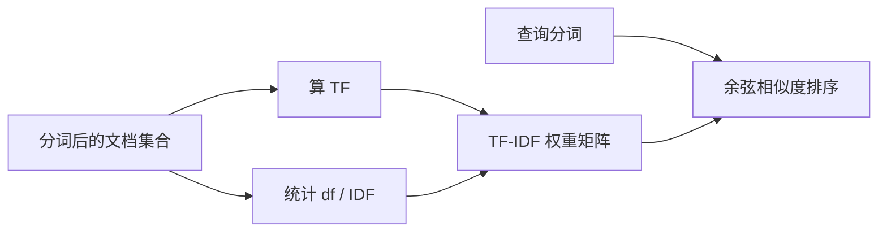
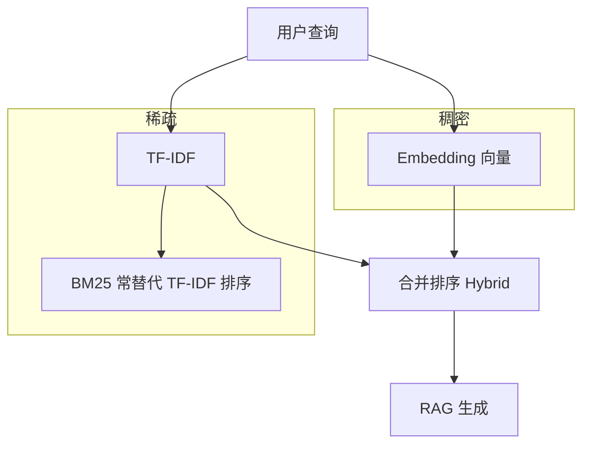

# NLP / IR / LLM 基础（二）：TF-IDF 原理完全指南

> 向量检索很火，但企业知识库仍常靠 **关键词**：哪篇文档既提到「报销」又提到「年假」，还别被满库都有的「公司」「制度」带偏？**TF-IDF**（Term Frequency–Inverse Document Frequency，词频–逆文档频率）是经典答案之一——用「词在本篇有多突出」乘以「词在全库有多罕见」给每个词项打分，再用来比查询与文档谁更贴。它是理解 **BM25**、倒排索引权重、甚至「为什么停用词要删」的台阶。前置：[中文分词与 tokenization](17.nlp-tokenization-basics-tutorial.md) 讲清 **term** 从哪来；本篇是 [企业 RAG 路线图](ENTERPRISE_RAG_ROADMAP.md) **B 轨第二篇**：公式直觉、手算例子、工程陷阱与和 RAG 的关系；代码只保留说明概念的最小片段。BM25 公式、倒排 posting 见路线图第 26～27 条后续篇。

---

## 目录

1. [前言：关键词匹配也要「加权」](#1-前言关键词匹配也要加权)
2. [从词袋到词项–文档矩阵](#2-从词袋到词项文档矩阵)
3. [TF：词频在说什么](#3-tf词频在说什么)
4. [IDF：稀有词为什么更值钱](#4-idf稀有词为什么更值钱)
5. [TF-IDF 合在一起](#5-tf-idf-合在一起)
6. [手算例子：三篇迷你文档](#6-手算例子三篇迷你文档)
7. [查询怎么和文档比：向量与余弦](#7-查询怎么和文档比向量与余弦)
8. [停用词、归一化与中文注意点](#8-停用词归一化与中文注意点)
9. [TF-IDF 的局限与何时不够](#9-tf-idf-的局限与何时不够)
10. [和 BM25、Embedding、RAG 的位置关系](#10-和-bm25embeddingrag-的位置关系)
11. [工程落地：sklearn 直觉](#11-工程落地sklearn-直觉)
12. [综合概念地图](#12-综合概念地图)
13. [常见陷阱与 FAQ](#13-常见陷阱与-faq)
14. [总结与系列下一步](#14-总结与系列下一步)

---

## 1. 前言：关键词匹配也要「加权」

典型场景：内网 3000 份制度 PDF 已切成 chunk 建索引。用户搜「研发部 差旅 住宿标准」——朴素做法是：含这些词的 chunk 越多越好就排越前。结果排第一的却是《员工手册》总则，因为「员工」「公司」「规定」在几乎每篇都出现，**高频但无区分度**的词把真正讲「住宿标准」的段落淹没了。

**TF-IDF**：一种给 **词项（term）** 在 **某篇文档** 里打权重的方法——**TF** 看词在这篇里多常见，**IDF** 看词在整个语料里多罕见；两者相乘，让「到处都是的词」权重下去、「本篇主题词」浮上来。  
通俗说：**在本篇反复出现、且全库没几篇有的词** 最值钱。

**信息检索**（IR，Information Retrieval）：从文档集合里找与需求相关的内容；TF-IDF 是 IR 课本与搜索引擎早期的核心组件之一。  
通俗说：**图书馆找书** 时，不只看「有没有这个词」，还看「这个词是不是这本书的主题」。

**读完本文，你应该能做到：**

1. 解释 **词袋模型**（Bag of Words）与词项–文档矩阵是什么。
2. 写出 **TF**、**IDF** 的直觉含义，并读懂常见变体公式（对数 IDF、归一化 TF）。
3. 对 2～3 篇小文档 **手算** 一两个词的 TF-IDF，并说明查询与文档如何比相似度。
4. 说明 **停用词** 为何存在，以及中文检索与 **分词** 的关系。
5. 列出 TF-IDF 的 **主要局限**（无语义、词序丢失、同义词），以及 RAG 里何时仍用它、何时转向向量/BM25。
6. 知道 `sklearn.feature_extraction.text.TfidfVectorizer` 在工程里对应上述哪几步。

**前置阅读**：[17：中文分词与 tokenization](17.nlp-tokenization-basics-tutorial.md)（term 粒度、jieba、索引与查询同配置）。  
**环境**：手算不需机器；试代码需 Python 3.10+ 与 `scikit-learn`（§11）。  
**本文边界（地基篇）**：讲清 **原理与直觉**；**不讲** 分布式索引、Elasticsearch 评分脚本源码、BM25 完整推导、神经网络重排序。

### 1.1 朴素关键词计数为什么不够

假设语料里 80% 的 chunk 都含「公司」「管理」「规定」。用户搜「研发 差旅 住宿标准」时，布尔检索能筛出同时含多个词的 chunk，但若只做 **命中词个数** 排序，长模板文往往因总词数多而占优。TF-IDF 在「命中」之上问第二层问题：**这些命中词里，哪个更能区分这篇与别篇？** 稀有词命中一次，常常比常见词命中三次更有用——这就是 IDF 进入排序的原因。

### 1.2 与第 17 篇的衔接

TF-IDF 的 **输入** 必须是稳定的 **term** 序列：中文先分词、英文可选词干、停用词表索引与查询共用。第 17 篇解决「切什么」；本篇解决「切完之后怎么加权」。两篇都不过关，后面 BM25 与倒排索引也无法救。

---

## 2. 从词袋到词项–文档矩阵

### 2.1 词袋模型

**词袋模型**（Bag of Words，BoW）：把一篇文档看成「一堆词的 multiset」，**丢掉词序和语法**。  
通俗说：把文章**抖进袋子**，只数每种词出现几次——「狗咬人」和「人咬狗」在袋子里统计相同。

对 RAG 的一个 **chunk** 同样适用：一个 chunk 是一行「文档」，词项来自分词结果。

### 2.2 词项–文档矩阵

设语料有 **N** 篇文档（或 N 个 chunk），词表有 **M** 个不同 term。可建 **M × N** 矩阵：行是词，列是文档，格子是 **词在该文档的出现次数**（或 0）。

| term \ doc | d₁ | d₂ | d₃ |
|------------|----|----|-----|
| 报销 | 3 | 0 | 1 |
| 年假 | 2 | 0 | 0 |
| 公司 | 5 | 8 | 7 |

读表时看 **列**：d₁ 像「报销/年假」主题；d₂、d₃ 满屏「公司」——若只数次数，「公司」会显得很「重要」，但它**不能区分**主题。IDF 就是为解决这个问题准备的。

### 2.3 稀疏存储与倒排索引（概念）

语料一大，矩阵里 **绝大多数格子是 0**（每个 chunk 只含少量词，词表却可能有几十万项）。密矩阵存不下，实际用 **倒排索引**（inverted index）：每个 term 挂一张 **posting list**（posting 列表），记录「哪些文档包含它、出现几次」。  
通俗说：**从词出发找文档**，不是从文档出发扫整张表。TF-IDF 的权重可以 **建索引时预计算**，也可以 **查询时按 BM25 公式现场算**——倒排结构是稀疏检索的工程基础，路线图第 27 条会专讲；本篇只需知道 **TF-IDF 是 posting 上的一种打分思想**。

---

## 3. TF：词频在说什么

**TF**（Term Frequency，词频）：term **t** 在文档 **d** 中出现的频率。  
通俗说：**这个词在这篇里有多「显眼」**。

### 3.1 原始计数

\[
\mathrm{tf}(t,d) = \text{词 } t \text{ 在文档 } d \text{ 中出现次数}
\]

长文档天然词多——「报销」出现 10 次可能只因篇幅长，不代表比出现 5 次的短文更贴题。

### 3.2 常见归一化

**按文档总词数归一化**：

\[
\mathrm{tf}(t,d) = \frac{\text{count}(t,d)}{\sum_{t'} \text{count}(t',d)}
\]

得到「该词占本篇词数的比例」。  
**对数归一化**（抑制超高频）：

\[
\mathrm{tf}(t,d) = 1 + \log(\text{count}(t,d)) \quad (\text{count}>0)
\]

地基篇记住：**TF 只描述「本篇内部」的突出程度**；还不区分「全库人人都有的词」。

### 3.3 为什么长文档要归一化：直觉例子

文档 A 共 50 词，「报销」出现 5 次；文档 B 共 500 词，「报销」也出现 5 次。原始计数同为 5，但 A 里「报销」更**集中**——归一化后 tf(A) = 5/50 = 0.1，tf(B) = 5/500 = 0.01。  
若用户问「报销政策」，A 往往比 B 更贴；余弦相似度也会在向量长度上进一步做校正（§7）。

---

## 4. IDF：稀有词为什么更值钱

**IDF**（Inverse Document Frequency，逆文档频率）：term **t** 在整个语料 **越少见**，IDF **越大**。  
通俗说：**全库只有几篇提到的词，像专名、术语，检索时更有区分力**。

设语料共有 **N** 篇文档，**df(t)** = 包含词 **t** 的文档篇数（document frequency，文档频率）。

经典（加 1 平滑避免除零）：

\[
\mathrm{idf}(t) = \log\frac{N+1}{\mathrm{df}(t)+1} + 1
\]

或更常见的：

\[
\mathrm{idf}(t) = \log\frac{N}{\mathrm{df}(t)} + 1
\]

**直觉**：

| 词 | df | 含义 | IDF |
|----|-----|------|-----|
| 「公司」 | N（几乎每篇都有） | 无区分度 | **低** |
| 「差旅住宿标准」 | 2 | 很少篇讲 | **高** |
| 某 OCR 错字 | 1 | 极稀有 | 很高（但也可能是噪声） |

**先错后对**：

```
❌ 检索只按「词出现次数」排序 → 「的」「公司」霸榜
✅ TF × IDF → 常见词权重被压低
```

### 4.3 为什么用对数

df 从 1 增到 2，「稀有度」的直觉落差，远大于 df 从 100 增到 101。对数 **压缩动态范围**，让 idf 不会无限大，也让「极稀有词」不至于把分数完全支配。  
不同教材常数项略有差别（+1 平滑、log 底数 2 或 e），**排序相对稳定** 比死记某一个公式更重要。

### 4.4 平滑与零 df

若语料里从未见过查询词 **t**，df(t)=0，有的公式会让 idf 极大；查询词可能是 **新词、错别字或 OOV**。工程上会：

- 忽略 idf 过高的噪声 term，或  
- 对查询与索引 **同一词表**，OOV 直接无 posting。

这与第 17 篇 **自定义词典** 同理：减少「检索词被切成不知名碎片、df=0」的情况。

---

## 5. TF-IDF 合在一起

**TF-IDF 权重**：

\[
\mathrm{tfidf}(t,d) = \mathrm{tf}(t,d) \times \mathrm{idf}(t)
\]

同一词 **t** 在全库的 idf(t) **对所有文档相同**；不同文档只因 tf 不同而 tfidf 不同。查询侧对每个查询词 **qᵢ** 也乘同一个 idf(qᵢ)（查询里该词出现次数作 tf）。因此 **idf 是语料级全局统计**，建库时算一次，查询时复用——这也是「新文档入库要更新 df」的原因。

对 **固定文档 d**，每个 term 有一个 tfidf 分数；对 **固定 term t**，在不同文档 d 上分数不同——于是可把每篇文档表示成一个 **稀疏向量**（大部分词是 0，少数词有权重）。

**查询**也转成同样维度的向量（查询里各词的 TF × 全局 IDF），再与文档向量比 **相似度**——常用 **余弦相似度**（§7）。



读图时看：**IDF 由全库统计**，查询和文档共用同一套 idf(t)。

### 5.1 文档向量的一幅小图

把三篇文档在「报销、年假、公司」三维空间标出来（只是示意，真实词表有上万维）：

- d₁ 在「报销」「年假」方向拉长；  
- d₂、d₃ 主要在「公司」轴；  
- 查询「年假 报销」的向量指向 d₁ 一侧。

高维稀疏时人眼画不出，但 **余弦算的就是这种「方向是否接近」**。Embedding 向量在另一空间做相似度；TF-IDF 向量在 **词项空间** 做相似度——空间不同，不要混比数值。

---

## 6. 手算例子：三篇迷你文档

**演示什么**：极简语料上手算 IDF 与一篇文档的两个词的 TF-IDF。  
**前置**：已分词，词即 term。

文档（已分词，一词一空格）：

- **d₁**：`报销 年假 公司 报销`
- **d₂**：`公司 制度 公司`
- **d₃**：`报销 流程 公司`

N = 3。词「报销」：出现在 d₁、d₃ → df = 2。词「年假」：只在 d₁ → df = 1。词「公司」：三篇都有 → df = 3。

用 \(\mathrm{idf}(t) = \log\frac{N}{\mathrm{df}(t)} + 1\)（自然对数，手算可用近似）：

| term | df | idf ≈ |
|------|-----|-------|
| 报销 | 2 | log(3/2)+1 ≈ 1.41 |
| 年假 | 1 | log(3/1)+1 ≈ 2.10 |
| 公司 | 3 | log(3/3)+1 = 1.00 |

对 **d₁**，原始 TF：报销 2 次、年假 1 次、公司 1 次，总 4 词。归一化 TF：

- tf(报销,d₁) = 2/4 = 0.5  
- tf(年假,d₁) = 1/4 = 0.25  

TF-IDF：

- tfidf(报销,d₁) ≈ 0.5 × 1.41 ≈ **0.71**
- tfidf(年假,d₁) ≈ 0.25 × 2.10 ≈ **0.53**

「年假」在本篇只出现 1 次，但全库稀有，**IDF 抬高了它的权重**——这正是我们想要：用户搜「年假」时，d₁ 应比只含「公司」的 d₂ 更相关。

手算不必精确到小数点后两位；**理解乘法的方向**即可：TF 大且 IDF 大 → 权重高。

### 6.1 接上查询：「年假 报销」更像哪篇？

查询 q = `年假 报销`（已分词）。简化：查询 TF 各词 0.5（两词各一次），用同一 idf 表：

- d₁ 向量在「报销」「年假」维有非零 tfidf；d₂ 只有「公司」；d₃ 有「报销」「公司」无「年假」。  
- 与 q 做点积或余弦时，**d₁** 因同时命中 **高 idf 的「年假」** 和 **「报销」** 应排最前；d₃ 次之；d₂ 与查询几乎正交。

这就是企业搜「年假报销」时，希望 **《年假管理办法》** 胜过 **《公司章程》** 的数学版故事。

### 6.2 与「布尔检索」对比

| 方式 | 规则 | 缺点 |
|------|------|------|
| 布尔 AND | 必须同时含「年假」「报销」 | 不排序，或只按时间排 |
| 原始词频求和 | 命中词次数相加 | 「公司」等高频词捣乱 |
| TF-IDF + 余弦 | 加权后比相似度 | 仍无语义，但可排序 |

---

## 7. 查询怎么和文档比：向量与余弦

把文档 **d** 看成向量 \(\vec{v_d}\)：每一维对应一个词项，值为 \(\mathrm{tfidf}(t,d)\)，没出现的词为 0。  
查询 **q** 同理得 \(\vec{v_q}\)（查询词的 TF × 语料 IDF）。

**余弦相似度**（cosine similarity）：比两个向量夹角，忽略向量长度（长短文档）影响：

\[
\cos(\vec{q},\vec{d}) = \frac{\vec{q} \cdot \vec{d}}{\|\vec{q}\| \|\vec{d}\|}
\]

通俗说：**看查询和文档「方向」是否一致**——都强调「年假、报销」还是都强调「公司」。

路线图第 33 条会专讲向量相似度；TF-IDF 场景下，文档与查询都在 **同一词表空间**，余弦是教科书默认搭配。

### 7.1 余弦为何适合长短 chunk

两篇都讲「报销」，一篇 200 字一篇 2000 字，点积可能偏向长文；余弦除以 \(\|\vec{d}\|\) 后，更比 **「主题组成是否相近」** 而非绝对长度。RAG chunk 长度常在 300～800 字波动，余弦或 BM25 的长度归一都值得做——裸 TF 排序在 chunk 场景里更容易 **长 chunk 霸榜**。

### 7.2 查询词在文档中未出现

若查询词 **t** 在文档 **d** 中 tf(t,d)=0，该维贡献为 0——**不会**因为别的词高就把不相关的文档拉上来（在纯向量模型下；若你另加了模糊匹配则另论）。这是词袋检索 **可解释** 的优点：能列出「命中了哪些 term」。

---

## 8. 停用词、归一化与中文注意点

**停用词**（stop words）：「的、是、在、了」及英文 `the, a, is` 等——几乎每篇都有、几乎无区分度。  
工程上常在分词后 **删掉** 再建矩阵，省空间、减噪声。中文是否去掉「的」因领域而异；法规文本「的」字极多但未必像英文 `the` 那么无信息——**要用评测集验证**。

与 [第 17 篇](17.nlp-tokenization-basics-tutorial.md) 的衔接：

| 环节 | 要求 |
|------|------|
| 分词 | 中文 jieba/IK；英文可 lower + 词干 |
| 索引与查询 | **同一** 分词与停用词表 |
| 领域词 | 「年假」「OKR」进用户词典，避免切碎 |

**子词 token** 是 LLM 的事；TF-IDF 词袋用的是 **人类词级 term**（或你定的 n-gram），不要混用 GPT tokenizer 的 id。

### 8.1 英文：词干提取与词形

英文 `run / runs / running` 若当三个 term，df 被拆散。IR 里常用 **stemming**（词干化）合并词形，或索引时存 **lemma**（词元原形）。中文无这类形态变化为主，**分词** 比词干更关键。

### 8.2 中文：字级 vs 词级 TF-IDF

字级 BoW 无需分词，但「自然语言处理」被拆成单字，idf 与语义聚合差；词级 + jieba 是中文知识库常见默认。第 17 篇的字级 n-gram 可作为 **召回补充通道**，与词级 TF-IDF **并行** 再融合分数（advanced，地基篇知道存在即可）。

---

## 9. TF-IDF 的局限与何时不够

| 局限 | 白话 | 后果 |
|------|------|------|
| **无语义** | 「汽车」与「轿车」不同维 | 搜一个找不到另一个 |
| **词序丢失** | BoW 不管顺序 | 「狗咬人」=「人咬狗」 |
| **同义词/多义词** | 一词多义 | 误匹配 |
| **长文档偏置** | 即使用归一化 TF，仍可能偏长 | 需余弦或 BM25 长度修正 |
| **稀疏高维** | 词表大、矩阵稀 | 存储靠倒排而非密矩阵 |

**何时仍值得用 TF-IDF**：

- 基线检索、可解释、CPU 友好、无 GPU 嵌入。
- 与 **BM25** 同属稀疏家族（BM25 可看作带饱和与长度归一化的改进，下篇展开）。
- **Hybrid RAG**：TF-IDF/BM25 一路 + 向量一路，互补。

**何时优先向量**：

- 语义 paraphrase（「怎么报销」vs「费用如何申报」）。
- 跨语言、口语化问法与书面语料错位。

### 9.1 同义词与扩展：工程补丁

TF-IDF 本身不懂「轿车=汽车」。补救（了解即可）：

- **同义词词典** 查询时扩展；  
- **伪相关反馈** 用 top 文档扩展 query；  
- 干脆加 **向量检索** 一路。

RAG 时代常见 **sparse + dense hybrid**，而不是死磕单一 TF-IDF。

### 9.2 可解释性作为优势

调试检索时，你能打印「top 词项及其 tfidf 权重」——对合规、政务、法务场景，**为什么召回了这条 chunk** 比黑盒向量有时更重要。[检索调试台](react/13.retrieval-debug-console.md) 展示的 score 与 rank，在稀疏侧往往可追溯到 term 命中。

---

## 10. 和 BM25、Embedding、RAG 的位置关系



在典型 **RAG** 链路里：

1. **离线**：chunk → 分词 → 建倒排（存 tf 或可直接算 BM25）→（可选）Embedding 入库。  
2. **在线**：查询分词 → TF-IDF/BM25 取 top-k chunk → 拼进 prompt。  
3. TF-IDF **不**替代大模型；它只负责 **找片段**。

Elasticsearch 默认相似度近年多为 **BM25**，不是裸 TF-IDF——但 IDF 思想一脉相承。学会 TF-IDF，读 BM25 文档会轻松很多。

### 10.1 BM25 相对 TF-IDF 改了两类直觉（预告）

**词频饱和**：同一个词在篇内出现 10 次与 100 次，相关性提升不应线性差 10 倍——BM25 对 tf **饱和**。  
**文档长度归一**：长文档多几个词不应自动赢——BM25 带长度先验。  
不必本篇背 BM25 公式；记住：**工业界排序默认往往是 BM25，不是 1990 年代教科书纯 tf×idf**。

### 10.2 在 RAG 流水线中的位置（逐步）

1. 用户问句 → 分词（与索引一致）  
2. 稀疏检索：TF-IDF/BM25 得 top-k **chunk_id**  
3. （可选）向量检索另一路 top-k  
4. **融合**（RRF、加权）→ 去重 → 送 LLM prompt  
5. TF-IDF **不参与** 第 5 步生成，只影响第 2 步原料

---

## 11. 工程落地：sklearn 直觉

**演示什么**：三句中文/英文句子用 `TfidfVectorizer` 得到矩阵。  
**环境**：`pip install scikit-learn`；中文需自备分词或用默认按字/空格（演示用英文更直观，中文生产接 jieba 自定义 tokenizer）。

```python
from sklearn.feature_extraction.text import TfidfVectorizer

corpus = [
    "reimburse annual leave company",
    "company policy company",
    "reimburse process company",
]
vectorizer = TfidfVectorizer()
X = vectorizer.fit_transform(corpus)  # 稀疏矩阵：行=文档，列=term
print(vectorizer.get_feature_names_out())
print(X.toarray())
```

**预期**：`reimburse` 等在 d₀、d₂ 有权重；`annual`、`leave` 仅在 d₀ 非零且 IDF 较高。  
`fit_transform` 内部：分词（英文按空格）、建词表、算 df、TF-IDF。中文 RAG 应在 `tokenizer` 参数传入 **jieba.cut** 的结果拼接，与索引管道一致。

### 11.1 查询向量 transform

```python
q = vectorizer.transform(["annual leave reimburse"])
# 与 X 同一词表；未登录词被忽略
scores = (X @ q.T).toarray().ravel()  # 稀疏点积，近似余弦前一步
```

**演示什么**：查询必须 `transform` 不能 `fit_transform`，否则 idf 统计被查询「污染」。  
**预期**：d₀ 分数最高——对应 §6 手算故事。

### 11.2 生产里你还会遇到什么

| 组件 | 作用 |
|------|------|
| Elasticsearch | 倒排 + BM25 排序 |
| `rank_bm25` | Python 纯 BM25 |
| Whoosh / Lucene | 嵌入式 IR 库 |
| sklearn | 实验与小规模原型 |

知识库到百万 chunk 时，应用 **搜索引擎** 而非内存密矩阵；sklearn 适合学习与本机几千 chunk 验证。

---

## 12. 综合概念地图

| 符号/名词 | 含义 | 通俗说 |
|-----------|------|--------|
| term | 索引里的词项 | 分词后的词 |
| tf(t,d) | t 在文档 d 的频率 | 本篇多常见 |
| df(t) | 含 t 的文档篇数 | 几篇提到过 |
| idf(t) | df 的逆函数 | 越稀有越高 |
| tfidf | tf × idf | 本篇主题词分数 |
| BoW | 词袋 | 不管顺序只计数 |
| 余弦相似度 | 向量夹角 | 查询与文档像不像 |
| df 平滑 | +1 防除零 | 小语料别 idf 无穷大 |
| posting list | 倒排列表 | 一词对应哪些文档 |

---

## 13. 常见陷阱与 FAQ

### 13.1 陷阱

**陷阱 1**：测试集/新文档的 IDF 用训练集统计泄露还好，但 **在线语料扩大** 后 IDF 应 **定期重算** 或增量更新，否则新词 idf 不对。  
**陷阱 2**：查询与文档 **分词不一致**。  
**陷阱 3**：把整个超长 PDF 当一篇算 TF——chunk 级索引更贴 RAG。  
**陷阱 4**：去掉停用词后「年假」变成「年」「假」——分词错则 TF-IDF 全错。  
**陷阱 5**：把 TF-IDF 分数当「语义相关概率」——它只是加权计数，要评测 P@k、MRR。

**陷阱 6**：语料极小（几十 chunk）时 idf 波动极大，一个词 df=1 会权重爆炸——小库先靠规则与向量，或合并 df 平滑；上线前用 **held-out 问句集** 看稳定性。

**陷阱 7**：只建 TF-IDF 不做 **chunk 重叠**（overlap）——边界切断关键词时，适当 overlap 能提高召回，与分块策略（路线图 C2）一起调，而不是单靠调 idf 常数。

### 13.2 FAQ

**Q：TF-IDF 还要手动实现吗？**  
A：研究/教学手算；生产用 Elasticsearch、Lucene、sklearn、rank_bm25 等。

**Q：和路线图第 25 条？**  
A：本篇即对应条；下接 BM25、倒排索引。学完应能向同事解释「为什么搜制度库时『公司』不该排第一」。

**Q：每个 chunk 单独 fit IDF 吗？**  
A：应对 **全库所有 chunk**（或字段）统一统计 df，查询与文档共用 idf(t)。

**Q：TF-IDF 分数有上界吗？**  
A：依赖公式；对数 tf、平滑 idf 会限制极值。用于 **排序** 时绝对值不重要。

**Q：怎么评估检索好不好？**  
A：准备标注问句–相关 chunk；看 Recall@k、MRR、NDCG——路线图评测篇会展开；调分词/停用词比盲调 idf 常数更有效。

**Q：TF-IDF 能做多字段加权吗？**  
A：可以，如标题 tf 乘 boost——Elasticsearch `multi_match` 即此类思想。

---

## 14. 总结与系列下一步

### 14.1 速记

1. **TF** = 词在本篇的突出程度；**IDF** = 词在全库的稀有程度。  
2. **TF-IDF = TF × IDF**；文档与查询变成 **稀疏向量**。  
3. 用 **余弦** 比查询与文档；**停用词**与 **分词** 决定矩阵质量。  
4. **无语义、无词序**——语义检索用 Embedding，工业排序常用 **BM25**。  
5. RAG 里 TF-IDF/BM25 负责 **找 chunk**，不负责 **生成答案**。以上五点承接第 17 篇 term，通向 BM25 与倒排。动手时建议：用十条真实业务问句，对当前 chunk 库跑一遍 BM25/TF-IDF top-5，肉眼看分词与排序是否合理，再决定是否上向量 hybrid。

### 14.2 推荐阅读

| 目标 | 文档 |
|------|------|
| 分词与 term | [17：tokenization](17.nlp-tokenization-basics-tutorial.md) |
| 路线图 B 轨 | [ENTERPRISE_RAG_ROADMAP.md](ENTERPRISE_RAG_ROADMAP.md) |
| 检索调试 UI | [React 13](react/13.retrieval-debug-console.md) |

### 14.3 留白

未展开：**BM25 公式**、**倒排 posting 列表**、**LSI/PCA 降维**、**学习排序**、**Elasticsearch 映射与 analyzer 配置**。建议下一篇写 **BM25 稀疏检索原理**，并与本篇 §6 同一迷你语料手算 BM25 分数作对比，印象更深。

---

> **初学者可能仍困惑的点**  
> - IDF 高不等于「重要」——OCR 噪声词也可能 df=1。  
> - 手算例子用归一化 TF；不同库公式略异，**比大小方向**一致即可。  
> - 向量检索火，TF-IDF 仍是 **可解释基线** 和 hybrid 的一翼。  
> - 公式常数因库而异，**排序相对关系** 比背准小数更重要。  
> - 语料更新（新员工手册、新政策）后记得 **重建或增量更新** df/idf 统计。  
- 手算 §6 的三篇文档可打印出来，查询换成你自己的业务词走一遍，比只看公式记得牢。
