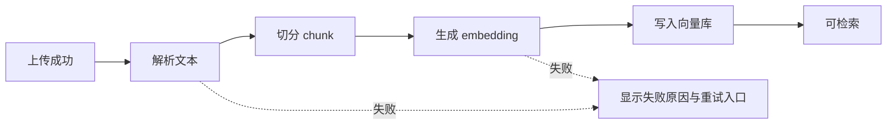
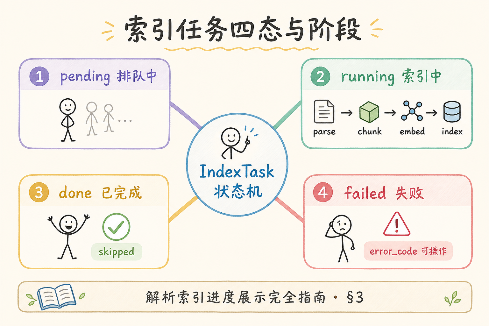
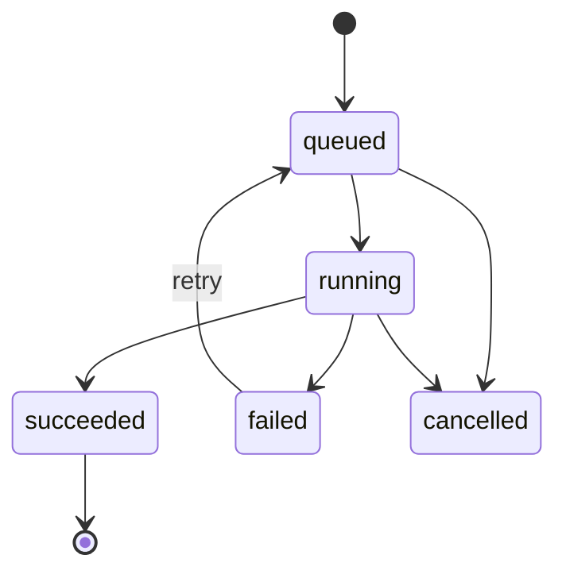
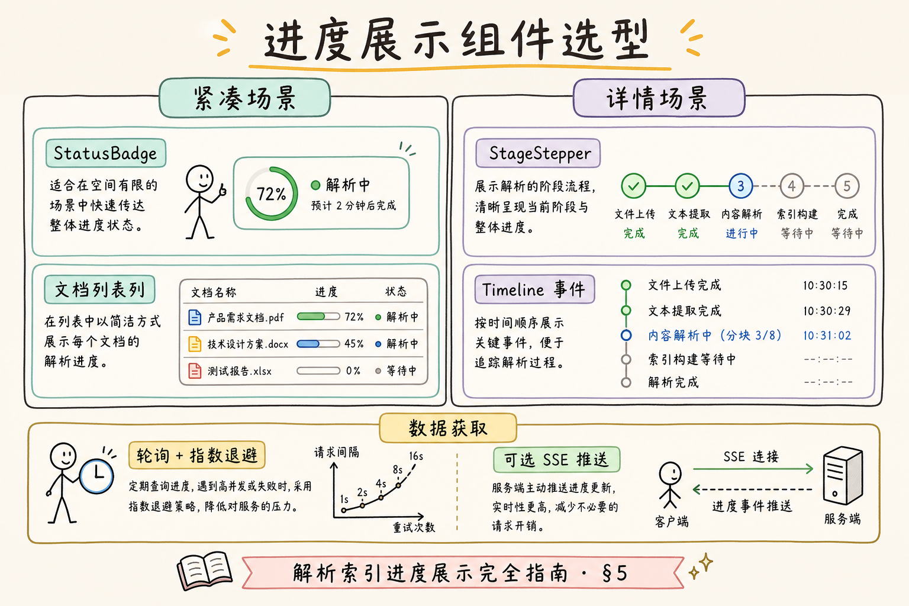
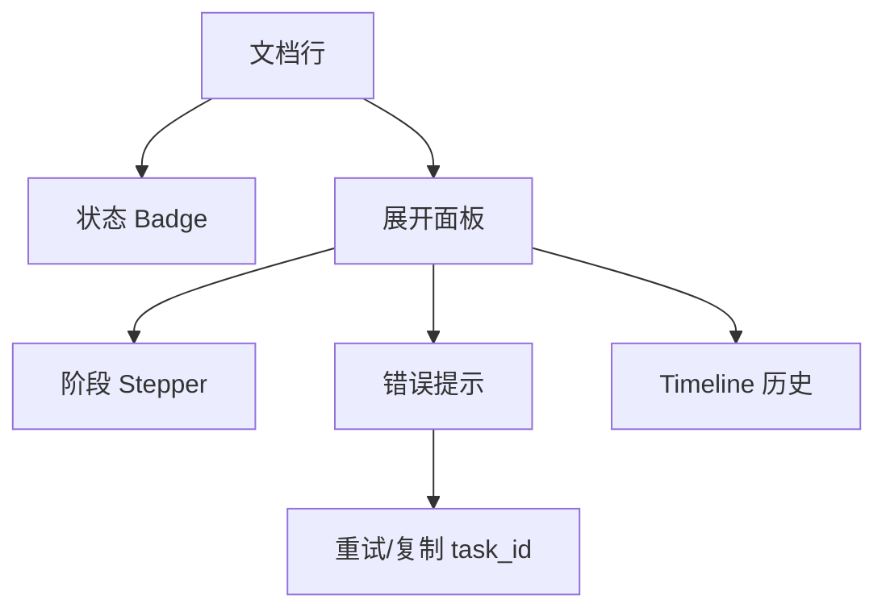
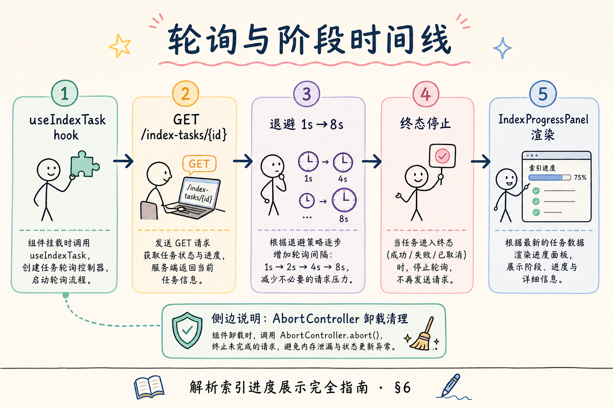
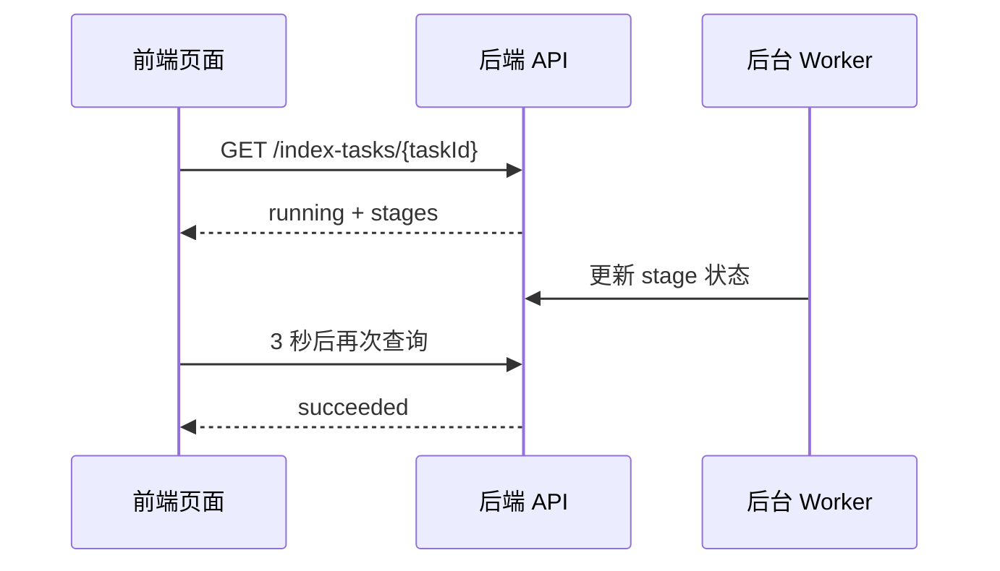

# F2 前端（十）：解析 / 索引进度展示完全指南

> 上传文档后，用户最怕看到一个永远转圈的按钮。RAG 系统的解析、切块、嵌入、写入向量库都可能耗时几十秒甚至几分钟。**索引进度展示**要解决的问题是：把后台黑盒变成用户能理解的阶段进度，让用户知道系统正在做什么、是否失败、下一步该怎么处理。

---

## 目录

1. [为什么需要索引进度 UI](#1-为什么需要索引进度-ui)
2. [索引进度展示是什么](#2-索引进度展示是什么)
3. [它解决什么问题](#3-它解决什么问题)
4. [任务状态模型](#4-任务状态模型)
5. [界面结构：Badge、Stepper、Timeline](#5-界面结构badgesteppertimeline)
6. [轮询、SSE 与退避策略](#6-轮询sse-与退避策略)
7. [React 最小实现](#7-react-最小实现)
8. [常见陷阱与 FAQ](#8-常见陷阱与-faq)
9. [总结](#9-总结)

---

## 1. 为什么需要索引进度 UI

上传文件不是 RAG 的结束，而是后台任务的开始。一个 PDF 进入知识库，通常要经过解析文本、切块、生成 embedding、写入向量库、更新元数据等步骤。

如果前端只显示“处理中”，用户会遇到三个问题：

- 不知道系统是否卡住；
- 不知道失败发生在哪一步；
- 不知道能否关闭页面或稍后回来；
- 客服和开发也拿不到明确任务状态。

进度 UI 的目标不是伪造精确百分比，而是把长任务拆成可解释的阶段。

---

## 2. 索引进度展示是什么

**索引进度展示**：前端根据后端任务状态，把文档从“上传成功”到“可检索”的过程展示成阶段、状态、错误和历史记录。

通俗说，它像快递轨迹：用户不一定需要知道每一辆车的位置，但需要知道包裹是“已揽收、运输中、派送中、签收”还是“异常”。



读图时重点看两个出口：正常路径进入“可检索”，失败路径必须告诉用户失败阶段，而不是只显示一个红色错误。

---

## 3. 它解决什么问题

| 问题 | 没有进度 UI | 有进度 UI |
|---|---|---|
| 用户等待焦虑 | 只看到 loading | 看到当前阶段和预计动作 |
| 失败排查 | 只知道失败 | 知道解析失败、嵌入失败或写库失败 |
| 重复上传 | 用户以为没提交 | 页面显示任务已在运行 |
| 客服协作 | 无法定位问题 | 可复制 task_id 和失败阶段 |
| 大文件处理 | 容易误判卡死 | 明确显示长任务仍在推进 |

索引进度 UI 的核心价值是“解释等待”。只要用户知道系统没有丢任务，等待体验就会明显改善。



---

## 4. 任务状态模型

前端不应该自己猜任务状态，而应该消费后端契约。一个最小状态模型如下：

```ts
type IndexTaskStatus =
  | "queued"
  | "running"
  | "succeeded"
  | "failed"
  | "cancelled";

type IndexStage = {
  name: "parse" | "chunk" | "embed" | "upsert";
  status: "pending" | "running" | "succeeded" | "failed" | "skipped";
  message?: string;
};

type IndexTask = {
  taskId: string;
  documentId: string;
  status: IndexTaskStatus;
  percent?: number;
  stages: IndexStage[];
  errorCode?: string;
  updatedAt: string;
};
```

状态流转建议如下：



注意：`percent` 可以没有，`stages` 更重要。很多后台任务无法给出真实百分比，但可以准确告诉你正在 parse、embed 还是 upsert。

---

## 5. 界面结构：Badge、Stepper、Timeline

一个好用的进度 UI 通常由三层组成：

| 组件 | 作用 | 示例 |
|---|---|---|
| Badge | 一眼看当前总状态 | 排队中、处理中、失败、已完成 |
| Stepper | 展示当前阶段 | 解析 → 切块 → 嵌入 → 写库 |
| Timeline | 展示历史事件 | 10:01 开始解析，10:03 写库成功 |





界面文案要避免过度技术化。例如：

| 后端状态 | 推荐文案 |
|---|---|
| `parse.running` | 正在解析文档内容 |
| `chunk.running` | 正在拆分为可检索片段 |
| `embed.running` | 正在生成语义向量 |
| `upsert.running` | 正在写入知识库索引 |
| `failed` | 处理失败，可查看原因并重试 |

初学者做 UI 时不要只给颜色。红色、黄色、绿色之外，还要有文字、图标和可复制的错误信息。

---

## 6. 轮询、SSE 与退避策略

前端获取进度有两种常见方式：

| 方式 | 适合场景 | 优点 | 注意点 |
|---|---|---|---|
| 轮询 | 简单项目、任务量不大 | 易实现、稳定 | 要做退避，别每秒打爆接口 |
| SSE | 需要实时推送 | 延迟低、体验好 | 要处理断线重连 |

推荐初期先做轮询：





退避策略建议：

- `queued/running`：每 2 到 3 秒查询一次；
- 页面不可见：降低到 10 到 30 秒；
- 连续失败：指数退避，例如 3s、6s、12s；
- `succeeded/failed/cancelled`：停止轮询；
- 登录过期或 403：停止轮询并提示重新登录。

---

## 7. React 最小实现

下面示例演示一个最小 hook。真实项目要接入你的请求库和错误处理。

```tsx
import { useEffect, useState } from "react";

type IndexTask = {
  taskId: string;
  status: "queued" | "running" | "succeeded" | "failed" | "cancelled";
  stages: { name: string; status: string; message?: string }[];
};

export function useIndexTask(taskId: string | null) {
  const [task, setTask] = useState<IndexTask | null>(null);
  const [error, setError] = useState<string | null>(null);

  useEffect(() => {
    if (!taskId) return;

    let stopped = false;
    let timer: number | undefined;

    async function poll() {
      try {
        const res = await fetch(`/api/index-tasks/${taskId}`);
        if (!res.ok) throw new Error(`HTTP ${res.status}`);
        const nextTask = (await res.json()) as IndexTask;
        if (stopped) return;

        setTask(nextTask);
        setError(null);

        if (nextTask.status === "queued" || nextTask.status === "running") {
          timer = window.setTimeout(poll, 3000);
        }
      } catch (err) {
        if (stopped) return;
        setError(err instanceof Error ? err.message : "unknown error");
        timer = window.setTimeout(poll, 6000);
      }
    }

    poll();

    return () => {
      stopped = true;
      if (timer) window.clearTimeout(timer);
    };
  }, [taskId]);

  return { task, error };
}
```

对应的展示组件可以很简单：

```tsx
export function IndexTaskPanel({ task }: { task: IndexTask }) {
  return (
    <section>
      <strong>任务状态：{task.status}</strong>
      <ol>
        {task.stages.map((stage) => (
          <li key={stage.name}>
            {stage.name}: {stage.status}
            {stage.message ? ` - ${stage.message}` : ""}
          </li>
        ))}
      </ol>
    </section>
  );
}
```

这段代码的重点是清理定时器。没有清理时，用户切换页面后仍可能继续请求接口，造成隐藏的前端压力。

---

## 8. 常见陷阱与 FAQ

这一节集中处理进度 UI 最容易误导用户的地方。判断一个设计是否合格，不只看它是否“好看”，还要看它是否诚实表达后台任务状态，并能在失败时给出可执行的下一步。

### 8.1 错：用假百分比骗用户

如果后端没有真实进度，不要从 1% 慢慢涨到 99%。更诚实的做法是展示阶段状态。

### 8.2 错：失败只显示“处理失败”

用户需要知道失败阶段和下一步。比如“PDF 解析失败，请确认文件不是扫描件或加密文件”比“失败”有用得多。

### 8.3 错：轮询永不停

任务结束后必须停止轮询。页面不可见时也要降频，否则后台打开多个标签页会持续打接口。

### 8.4 FAQ：要不要一开始就做 SSE？

不一定。内部工具、低并发后台页面可以先用轮询。只有当任务多、体验要求高、延迟敏感时，再引入 SSE。

### 8.5 FAQ：用户关闭页面后怎么办？

任务应该由后端继续执行。前端再次进入文档详情页时，根据 `documentId` 查询最近任务并恢复展示。

---

## 9. 总结

索引进度 UI 的目标是把“后台正在处理”解释清楚。最小可落地方案是：

1. 后端提供 task 状态和 stages；
2. 前端展示 Badge、Stepper、Timeline；
3. 用轮询获取状态，并在结束后停止；
4. 失败时展示阶段、原因和重试入口；
5. 大文件和长任务优先展示阶段，不伪造精确百分比。

做好这件事后，用户会更愿意等待，客服更容易定位问题，开发也能从 task_id 追到后台日志。
