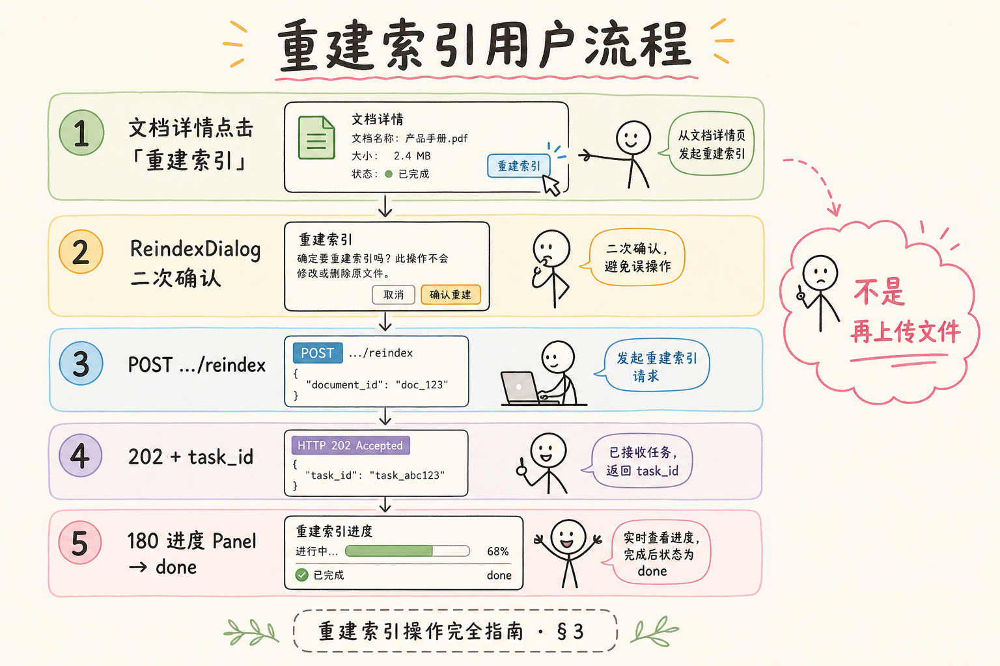
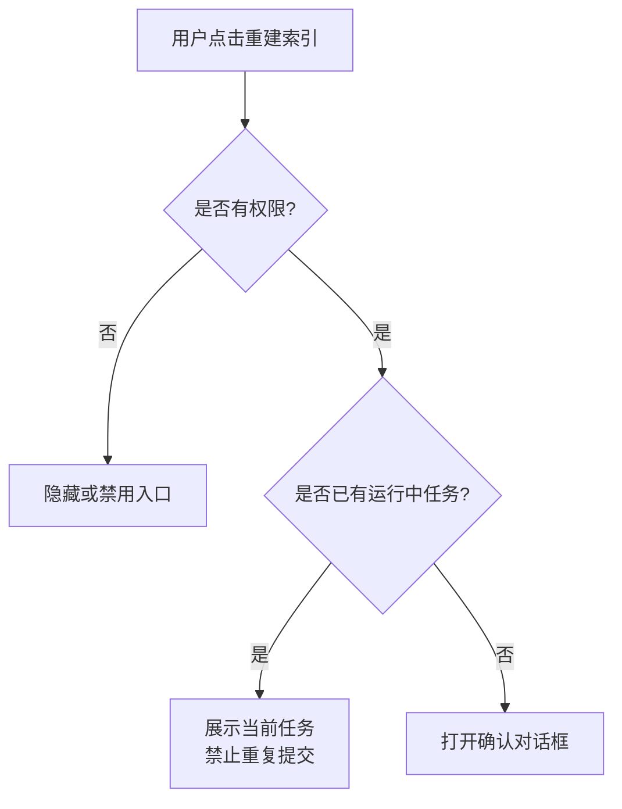
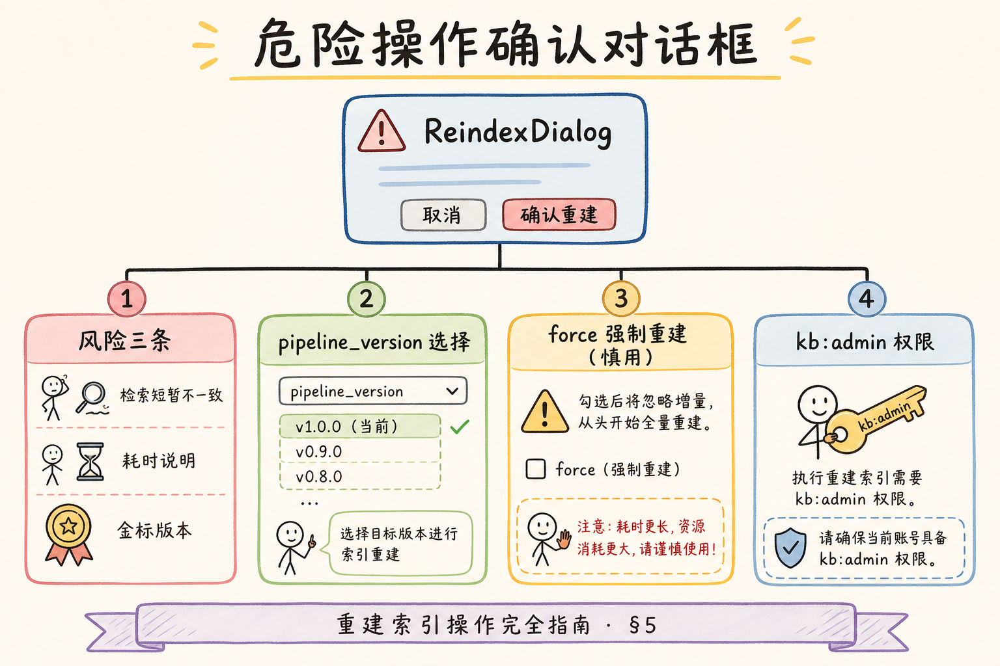
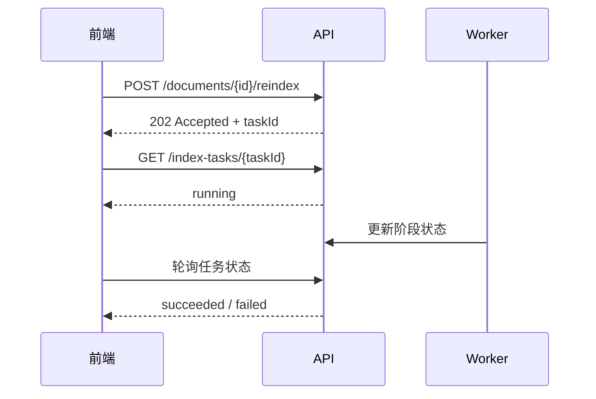
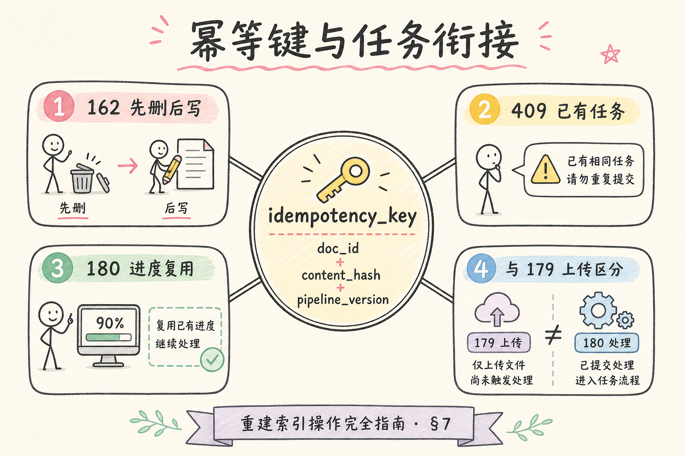

# F2 前端（十一）：重建索引操作完全指南

> “重建索引”不是“再上传一次文件”。它通常表示：原文还在，但切块策略、Embedding 模型、权限规则或向量库数据需要重新生成。**重建索引 UI**要解决的问题是：让用户安全地触发高风险后台任务，并清楚知道会影响哪些文档、是否可重复点击、失败后怎么恢复。

---

## 目录

1. [为什么需要重建索引 UI](#1-为什么需要重建索引-ui)
2. [重建索引是什么](#2-重建索引是什么)
3. [它解决什么问题](#3-它解决什么问题)
4. [操作入口与权限设计](#4-操作入口与权限设计)
5. [确认对话框与参数选择](#5-确认对话框与参数选择)
6. [提交任务与进度衔接](#6-提交任务与进度衔接)
7. [React 最小实现](#7-react-最小实现)
8. [常见陷阱与 FAQ](#8-常见陷阱与-faq)
9. [总结](#9-总结)

---

## 1. 为什么需要重建索引 UI

RAG 项目上线后，经常会遇到这些变化：

- chunk 大小调整；
- Embedding 模型升级；
- 文档权限规则变更；
- 向量库迁移或数据损坏；
- 解析器修复了之前的 PDF 兼容问题；
- 用户反馈某份文档检索不到。

这些变化不一定需要用户重新上传原文，但需要重新生成索引。如果没有专门 UI，用户只能删除再上传，结果会丢历史、丢权限、丢审计记录。

### 1.1 值班排障场景对照

| 用户反馈 | 无专门 UI 时 | 有重建索引 UI 时 |
|----------|--------------|------------------|
| “换了 Embedding 后搜不到旧文档” | 运维手工跑脚本，用户不知情 | 维护者在文档页一键重建，进度可见 |
| “PDF 解析修了但内容还是错的” | 删文档重传，审计链断裂 | 基于原文重建，保留 doc_id |
| “批量升级 chunk 策略” | 容易漏文档或重复跑 | 知识库级批量 + 任务去重 |

重建索引 UI 与 [索引进度面板](179.index-progress-ui-tutorial.md) 配合，才能把“高风险后台任务”变成可观测、可重试的产品能力。

---

## 2. 重建索引是什么

**重建索引**：基于已有原始文档，重新执行解析、切块、嵌入和写入向量库的流程。

通俗说：不是换书，而是重新给书做目录和标签。


读图时重点看“已有原文”。重建索引依赖原文仍然可用；如果原文已经删除，就不能靠重建恢复。

与“删了重传”相比，重建保留 `doc_id`、权限绑定与审计时间线，是生产环境首选。排障时要先确认对象存储里原文是否可读、解析器版本是否已升级——有时用户以为需要重建，实际是新上传走了旧 pipeline 队列。维护者应在 UI 上展示当前 `pipeline_version`，避免“点了重建却仍用上周的切块配置”的无效劳动。

---

## 3. 它解决什么问题

| 场景 | 为什么要重建 |
|---|---|
| 改了 chunk 策略 | 旧 chunk 粒度不再适合检索 |
| 换了 Embedding 模型 | 新旧向量空间不兼容 |
| 修复了解析 bug | 旧索引基于错误文本 |
| 修改权限过滤 | 需要重新写入 metadata |
| 向量库迁移 | 需要把原文重新写入新库 |

重建索引 UI 要让用户理解两点：



1. 这个操作可能耗时；
2. 操作期间搜索结果可能短暂不稳定，取决于后端是否做双写或版本切换。

### 3.1 重建期间检索行为策略

| 策略 | 用户体验 | 实现复杂度 | 适用 |
|------|----------|------------|------|
| 原地覆盖 | 重建中可能短暂无结果或混杂新旧 chunk | 低 | 内部 PoC |
| 双写后切换 | 检索稳定，切换瞬间一致 | 中 | 生产推荐 |
| 只读冻结 | 重建期间禁止问答 | 低但体验差 | 大批量迁移 |

前端文案必须与后端策略一致。若采用双写切换，确认框可写“重建完成后自动切换，期间检索不受影响”；若原地覆盖，应明确提示“重建期间该文档答案可能不完整”。

### 3.2 案例：Embedding 模型升级

某团队把 `text-embedding-3-small` 升到 `text-embedding-3-large`，未重建索引。现象：新上传文档检索正常，旧文档相似度普遍偏低。维护者在知识库管理页勾选“全库重建”，确认对话框展示影响 1,240 份文档与预计 2–4 小时。任务完成后，用 [检索调试台](182.retrieval-debug-console-tutorial.md) 抽 10 条历史 query 对比 hit 排名，确认回退消除。

---

## 4. 操作入口与权限设计

重建索引是危险操作，入口不应该像普通刷新按钮一样随处可点。

推荐入口：

- 文档详情页：针对单个文档重建；
- 知识库管理页：针对一批文档重建；
- 管理后台任务页：查看历史任务并重试失败项。



权限建议：

| 角色 | 能否重建 |
|---|---|
| 普通成员 | 通常不能 |
| 知识库维护者 | 可重建自己管理的文档 |
| 管理员 | 可批量重建 |
| 只读审计角色 | 只能查看任务历史 |

入口文案要明确，例如“重建索引”比“刷新”更准确。

### 4.1 审计与操作留痕

每次点击“确认重建”应产生可查询记录：`who`、`when`、`document_id` 或 `knowledge_base_id`、`pipeline_version`、`force` 标志。字段写入结构化日志（见 [190](190.structured-logging-rag-tutorial.md)）或审计表，便于事后回答“谁触发了昨晚的全库重建”。只读审计角色可看历史，不可点按钮——与上表权限一致。

### 4.2 入口可见性检查

- [ ] 无权限用户看不到按钮，而非点了才 403
- [ ] 已有 `running` 任务时入口变为“查看进度”
- [ ] 批量入口与单文档入口文案区分“1 份”与“N 份”

---

## 5. 确认对话框与参数选择

确认对话框不是形式主义。它要让用户知道影响范围和不可逆部分。

批量重建一旦误触，可能让上千份文档同时进入 Worker 队列，挤占正常入库任务。对话框里除数量与耗时外，应提示当前检索策略（双写或原地覆盖），与第三节表格一致。若用户不理解“重建不是重传”，可在二次确认里用一句话说明：原文不动，变的是向量与 chunk。值班收到“重建后更搜不到”的工单时，先查是否重建失败 halfway、索引是否只写了一半，再查 embedding 选型，UI 文案准确能减少误操作带来的假性事故。



建议包含：

| 字段 | 说明 |
|---|---|
| 文档名/知识库名 | 明确操作对象 |
| 影响数量 | 单文档或批量文档数 |
| pipeline 版本 | 用哪个解析/切块/embedding 配置 |
| 是否强制重建 | 是否跳过 content_hash 判断 |
| 预计耗时 | 粗略范围即可 |
| 风险提示 | 重建期间检索可能变化 |

确认文案示例：

```text
将基于当前原文重新生成索引。
这不会重新上传文件，但会替换该文档的检索片段。
任务开始后可在进度面板查看状态。
```

对于高风险租户，可以要求输入文档名或知识库名确认，避免误触批量任务。

### 5.1 参数项何时展示

| 参数 | 普通用户 | 管理后台 |
|------|----------|----------|
| pipeline 版本 | 隐藏，显示“当前配置” | 下拉可选，默认 latest |
| force 强制重建 | 不展示 | 勾选，跳过 content_hash |
| 影响文档数 | 必展示 | 必展示 |
| 预计耗时 | 区间即可 | 可附队列深度 |

`content_hash` 未变且未勾选 force 时，后端可返回“无需重建”，前端应友好提示而非报错。

---

## 6. 提交任务与进度衔接

重建索引不应该由前端等待一个长 HTTP 请求完成。更稳的方式是提交任务，后端返回 `taskId`，前端进入进度展示。



API 响应建议：

```json
{
  "taskId": "idx_123",
  "documentId": "doc_456",
  "status": "queued"
}
```

如果同一文档已经有运行中的重建任务，后端应返回已有 `taskId` 或明确的 409，而不是创建重复任务。

### 6.1 409 与重复任务的前端处理

收到 409 或 body 含已有 `taskId` 时，不要只弹“失败”：应自动跳转进度面板并高亮当前阶段（解析 / 切块 / 嵌入 / 写入）。用户刷新页面后，文档详情页应能恢复“任务进行中”状态，避免误以为未提交成功而再次点击。

### 6.2 失败阶段的可操作提示

| 失败阶段 | 建议 UI 文案 | 建议动作 |
|----------|--------------|----------|
| 解析 | 原文格式无法解析 | 检查源文件或联系上传者 |
| 嵌入 | Embedding 服务超时 | 稍后重试；展示 taskId 供值班查日志 |
| 写入向量库 | 向量库连接失败 | 检查基础设施；禁止无脑连点 |

---

## 7. React 最小实现

下面示例演示提交按钮如何防重复点击，并把任务交给进度组件展示。



```tsx
import { useState } from "react";

type ReindexResponse = {
  taskId: string;
  documentId: string;
  status: "queued" | "running";
};

export function ReindexButton({ documentId }: { documentId: string }) {
  const [submitting, setSubmitting] = useState(false);
  const [taskId, setTaskId] = useState<string | null>(null);
  const [error, setError] = useState<string | null>(null);

  async function submitReindex() {
    setSubmitting(true);
    setError(null);

    try {
      const res = await fetch(`/api/documents/${documentId}/reindex`, {
        method: "POST",
        headers: { "Content-Type": "application/json" },
        body: JSON.stringify({ force: false }),
      });

      if (!res.ok) throw new Error(`HTTP ${res.status}`);
      const data = (await res.json()) as ReindexResponse;
      setTaskId(data.taskId);
    } catch (err) {
      setError(err instanceof Error ? err.message : "提交失败");
    } finally {
      setSubmitting(false);
    }
  }

  return (
    <div>
      <button onClick={submitReindex} disabled={submitting || Boolean(taskId)}>
        {submitting ? "提交中..." : "重建索引"}
      </button>
      {taskId ? <p>任务已创建：{taskId}</p> : null}
      {error ? <p role="alert">{error}</p> : null}
    </div>
  );
}
```

真实项目里，`taskId` 应该传给上一篇的索引进度面板，而不是只显示一行文字。

示例代码故意保持最小，但生产还要处理：页面刷新后从 `GET /documents/{id}/index-tasks?status=running` 恢复状态、409 时跳转进度而非报错、提交中禁用按钮直到收到 202。联调时让测试同学连续双击“确认重建”，验证前后端幂等是否都生效——只挡前端不够，重复任务仍可能打满 embedding 配额。成功后建议在 toast 里带 `taskId` 可复制，方便用户截图给值班查 [190 结构化日志](190.structured-logging-rag-tutorial.md)。

### 7.1 与结构化日志联动

提交成功后在客户端不必打日志，但后端应对 `index_task_started` / `index_task_failed` 记录 `task_id`、`doc_id`、`pipeline_version`。值班根据用户截图的 taskId 在日志平台检索，比让用户描述“点了很多次”更快定位重复任务或 Worker 堆积。

---

## 8. 常见陷阱与 FAQ

下面这些问题都和“危险操作是否可控”有关。重建索引会改写检索结果，所以前端既要让用户能发起任务，也要避免误触、重复提交和失败后无从排查。

### 8.1 错：按钮可以连续点击

连续点击会创建多个重建任务，导致同一文档被重复写入。前端要禁用按钮，后端也要做幂等保护。

### 8.2 错：叫“刷新索引”

“刷新”容易让用户以为只是更新页面。建议使用“重建索引”，并说明会重新解析和写入检索片段。

### 8.3 错：任务失败后只提示失败

失败提示应包含阶段和建议动作。例如“嵌入服务超时，请稍后重试”比“重建失败”更可操作。

### 8.4 FAQ：重建期间还能问答吗？

取决于后端策略。简单系统可能短暂影响结果；更稳的系统会先生成新索引，再切换版本。前端需要按实际策略写清楚。

### 8.5 FAQ：要不要暴露 pipeline 版本？

内部管理后台建议暴露。普通用户可以隐藏细节，只展示“使用当前索引配置”。

### 8.6 排错：按钮一直转圈无 taskId

先查 Network：POST 是否 202、响应体是否有 `taskId`。若请求挂起，多半是网关超时——重建应异步，API 必须快速返回。若 200 但无 taskId，检查后端契约是否与前端类型一致。

### 8.7 排错：任务成功但检索仍不对

重建成功只说明 pipeline 跑完，不保证策略正确。用调试台对同一 query 看 hit 是否更新；若仍错，问题在 chunk 策略或 Embedding 选型，而非 UI。将 trace 记入 bad case 队列（见 [184](184.admin-log-eval-dashboard-tutorial.md)）做版本对比。

### 8.8 评测：如何验收重建 UI

| 检查项 | 通过标准 |
|--------|----------|
| 幂等 | 连续双击只产生一个 running 任务 |
| 权限 | 普通成员无入口；维护者仅自己库 |
| 恢复 | 刷新页面后仍显示进行中任务 |
| 失败 | 展示阶段 + taskId + 重试入口 |
| 端到端 | 重建后抽 5 条 query，hit 含新 chunk_id |

---

## 9. 总结

重建索引 UI 的重点是安全触发长任务：

落地后应用第三节的检索策略表做端到端演练：重建进行中问一个必命中 query，看答案是短暂缺失、新旧混杂还是无感切换。结果与文案不一致会迅速透支维护者信任。与 [182 检索调试台](182.retrieval-debug-console-tutorial.md) 联动验收：重建完成后抽五条历史 query，确认 hit 的 `chunk_id` 已更新。把这条检查写进发版 checklist，比事后解释“其实重建成功了只是策略没告知”更省力。

1. 明确告诉用户重建不是重新上传；
2. 入口按权限控制；
3. 确认对话框展示影响范围、版本和风险；
4. 提交后返回 taskId，并接入进度展示；
5. 前后端都要防重复提交；
6. 失败时给出阶段和下一步。

有了这个 UI，团队就能在修改 chunk 策略、Embedding 模型或权限规则后，让用户以可控方式刷新知识库检索能力。

### 9.1 本篇检查清单

- [ ] 入口按角色隐藏或禁用，批量与单文档分离
- [ ] 确认框展示影响范围、pipeline、风险与预计耗时
- [ ] POST 返回 taskId，409 时衔接已有任务
- [ ] 按钮防重复 + 后端幂等
- [ ] 失败提示含阶段与 taskId，可跳转进度面板
- [ ] 操作写入审计或结构化日志，便于值班追溯
