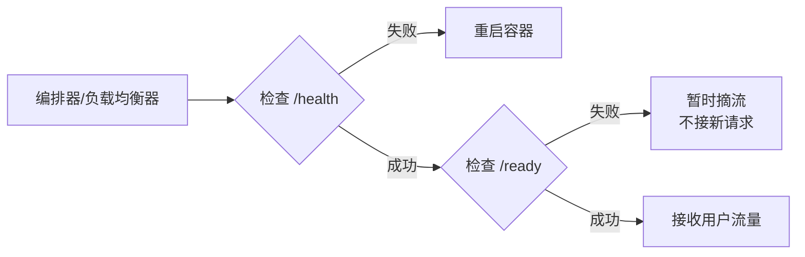
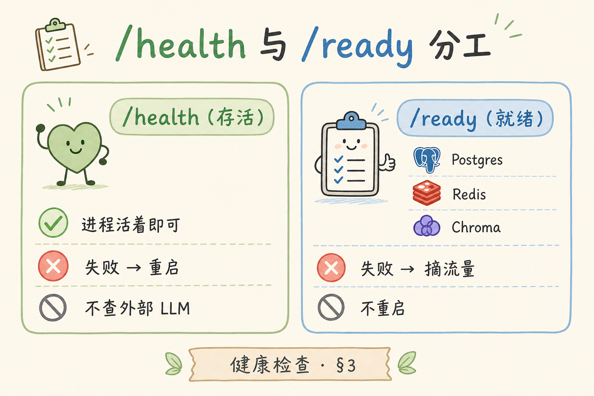
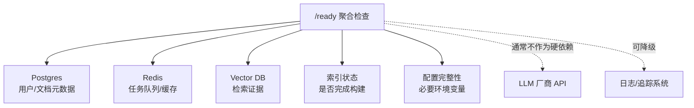
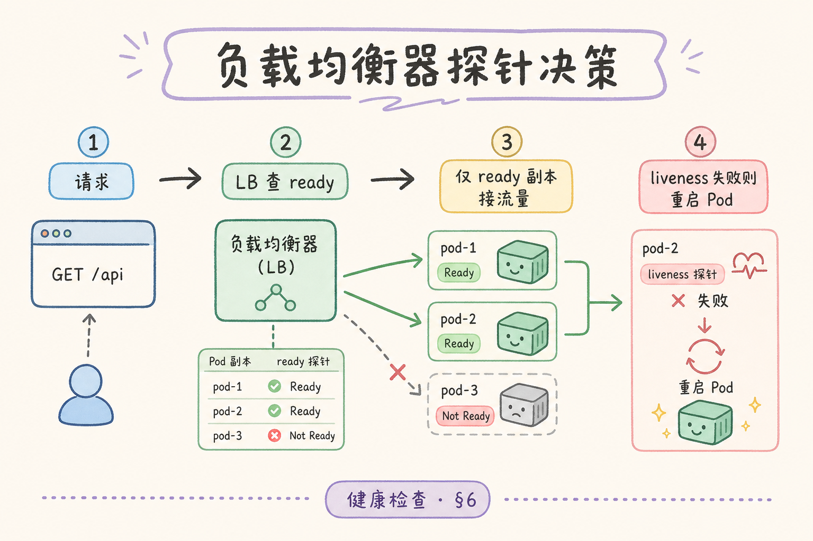
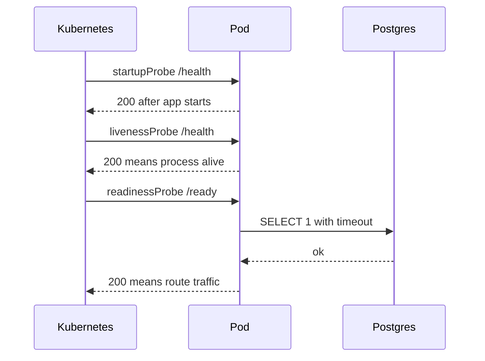
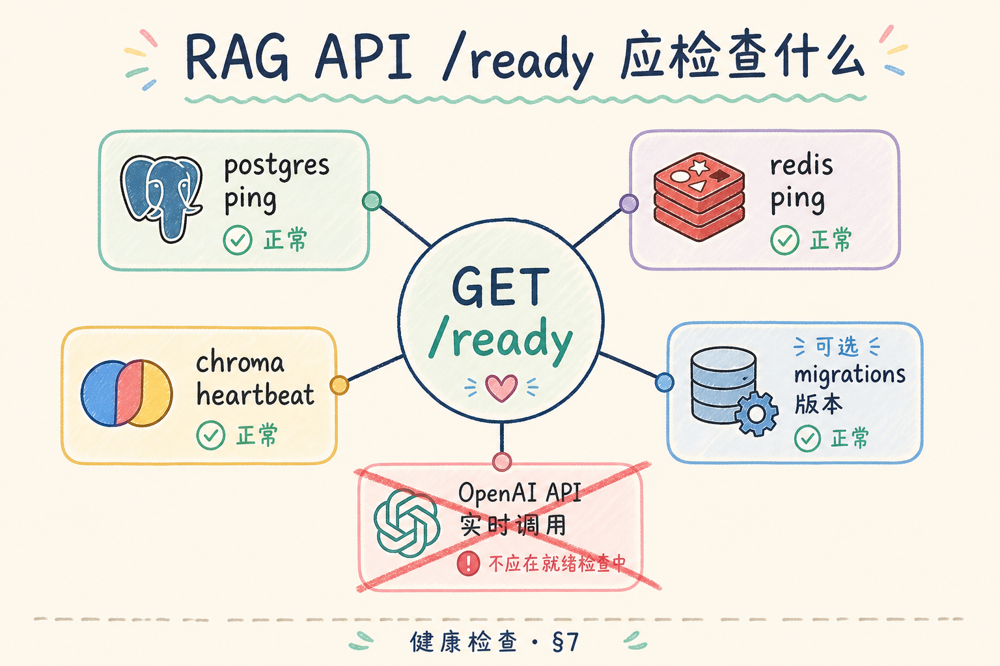

# G 生产化（四）：健康检查 /health /ready 完全指南

> 一个服务“进程还活着”，不代表它“可以接流量”。RAG 系统尤其明显：API 进程可能还在，但数据库断了、Redis 挂了、向量库正在加载索引，这时继续把用户请求打进来，只会制造大量 500。本文解释 `/health` 和 `/ready` 的分工，并给出 FastAPI、Docker Compose、Kubernetes 中的最小用法。

---

## 目录

1. [为什么需要健康检查](#1-为什么需要健康检查)
2. [/health 和 /ready 是什么](#2-health-和-ready-是什么)
3. [它们解决什么问题](#3-它们解决什么问题)
4. [RAG 服务应该检查哪些依赖](#4-rag-服务应该检查哪些依赖)
5. [FastAPI 最小实现](#5-fastapi-最小实现)
6. [Compose 与 Kubernetes 如何使用](#6-compose-与-kubernetes-如何使用)
7. [超时、降级与观测](#7-超时降级与观测)
8. [常见错误与 FAQ](#8-常见错误与-faq)
9. [总结](#9-总结)

---

## 1. 为什么需要健康检查

初学者很容易把“端口能访问”理解为“服务正常”。但生产系统里，服务正常至少分成两层：

- **进程是否活着**：程序有没有卡死、崩溃、退出；
- **服务是否可接流量**：数据库、Redis、向量库等关键依赖是否可用。

如果只检查进程，编排器会误判。比如 API 还能返回 `/health`，但查询数据库必然失败，负载均衡仍然把用户请求转进来，结果是用户看到大量错误。

RAG 服务还有一个额外难点：它依赖的组件很多，部分组件慢启动。向量库加载索引、Embedding 模型初始化、数据库迁移未完成，都可能让“进程活着但不能服务”。

### 1.1 没有健康检查时的典型故障

| 阶段 | 现象 | 根因 |
|------|------|------|
| 发布 | 新版本 50% 500 | 新 Pod ready 过早，迁移未完成 |
| 依赖重启 | 全站间歇失败 | LB 仍打向 not-ready 副本 |
| 向量库升级 | API “活着”但检索全超时 | ready 未检查向量库 |
| 凌晨扩容 | 冷启动 Pod 接流后崩溃 | 无 startupProbe，liveness 误杀 |

健康检查是编排器与负载均衡器做决策的**唯一自动化信号**，实现草率等于没有护栏。

### 1.2 与可观测的关系

`/ready` 返回 503 时应打结构化日志 `ready_fail`（见 [190](190.structured-logging-rag-tutorial.md)），并暴露 `rag_ready` 指标（见 [191](191.prometheus-metrics-rag-tutorial.md)）。探针失败不是只靠 `kubectl describe` 人肉看，而要能关联到依赖组件与时间线。

---

## 2. /health 和 /ready 是什么

在生产编排里，这两个端点触发**完全不同的运维动作**：`/health` 失败通常导致容器重启；`/ready` 失败通常导致暂时摘流、不接新请求。公网 Ingress 可对 `/ready` 限制内网访问，避免攻击者探测依赖拓扑。响应契约应稳定：health 返回极简 JSON，ready 失败返回 503 与各组件布尔状态，不要暴露内网 IP 或完整异常栈。

**/health**：健康检查，回答“进程是否还活着”。它应该非常轻，不做外部网络请求，不查数据库。

**/ready**：就绪检查，回答“现在是否可以接收真实用户流量”。它可以检查数据库、Redis、向量库、必要配置、迁移版本等硬依赖。



读图时重点看两个动作：`/health` 失败通常意味着“重启”，`/ready` 失败通常意味着“先别给它流量”。这两个动作不能混用。

### 2.1 响应契约建议

| 端点 | HTTP | body 要点 |
|------|------|-----------|
| `/health` | 200 | `{"status":"ok"}`，无依赖明细 |
| `/ready` | 200 | `{"status":"ready","checks":{...}}` |
| `/ready` 失败 | 503 | `not_ready` + 各组件布尔，无内网 IP |

公网 Ingress 可对 `/ready` 限制内网访问或仅让 kubelet 访问，避免攻击者探测依赖拓扑。

---

## 3. 它们解决什么问题

探针语义混用是 RAG 线上事故的常见根因：liveness 查数据库会在 DB 抖动时误杀健康 Pod；readiness ping LLM 厂商会在限流时摘掉全部副本。正确分工是——**该重启进程吗** 才进 `/health`；**该别接用户流量吗** 才进 `/ready`；只是体验变差则标记 degraded，ready 仍 200。编排器与负载均衡器依赖这两类信号做自动化决策，实现草率等于没有护栏。

| 场景 | `/health` 应该怎样 | `/ready` 应该怎样 |
|---|---|---|
| API 进程卡死 | 失败，让编排器重启 | 通常访问不到 |
| Postgres 断开 | 仍然成功 | 失败，返回 503 |
| Redis 断开，Worker 无法消费任务 | 仍然成功 | 视业务是否硬依赖，通常失败 |
| OpenAI API 抖动 | 仍然成功 | 通常不检查，避免厂商抖动杀死服务 |
| 向量库索引加载中 | 成功 | 失败，加载完成后成功 |
| 日志系统不可用 | 成功 | 多数情况仍成功，但标记 degraded |

这里有一个关键原则：**不要把所有外部服务都塞进 `/ready`。**  


只有“没有它就无法正确处理核心请求”的依赖，才应该影响 ready。

### 3.1 决策口诀

- 挂了该**重启进程**吗？→ 才进 liveness `/health`
- 挂了该**别接用户流量**吗？→ 才进 readiness `/ready`
- 只是**体验变差**吗？→ degraded，ready 仍 200

---

## 4. RAG 服务应该检查哪些依赖

依赖分类决定 ready 的语义：Postgres、向量库、任务队列等硬依赖失败应 503；Langfuse 等观测系统挂了可 degraded 仍接流；LLM 厂商 API 多数不放进 ready——厂商短暂抖动若导致全副本 not ready，反而扩大故障。大批量入库期间可设 `index_warmup_complete` 标志，构建完成前 ready 503 但 health 200，对外展示维护页比半可用反复 500 更可控。

RAG 系统通常有这几类依赖：



建议把依赖分成三类：

| 类型 | 例子 | ready 失败吗 | 原因 |
|---|---|---|---|
| 硬依赖 | Postgres、向量库、必要 Redis | 是 | 没有它核心问答无法完成 |
| 软依赖 | Langfuse、非核心统计服务 | 否，可标记 degraded | 不应因为观测系统挂了杀业务 |
| 外部不稳定服务 | LLM API、第三方搜索 API | 多数不检查 | 厂商抖动会导致所有副本被摘流 |

“不检查 LLM API”对初学者可能反直觉。原因是 LLM 厂商短暂超时很常见，如果 `/ready` 每几秒 ping 一次厂商，一旦厂商抖动，Kubernetes 会把所有 Pod 都摘掉，反而扩大故障。

### 4.1 索引构建期的 ready 策略

大批量文档入库时，可设内部标志 `index_warmup_complete`：构建完成前 `/ready` 返回 503，但 `/health` 仍 200。对外维护页或 API 返回“系统升级中”，比半可用状态反复 500 更可控。

### 4.2 Worker 无 HTTP 时的健康信号

| 方式 | 适用 |
|------|------|
| `celery inspect ping` | Compose healthcheck `exec` |
| 轻量 sidecar `:8081/health` | K8s liveness |
| 队列消费延迟 + 任务失败率 | HPA 与告警 |

Worker 的“就绪”往往是**能消费队列且依赖可用**，不一定需要与 API 相同的 `/ready` 实现。

---

## 5. FastAPI 最小实现

实现 `/ready` 时要兼顾**正确性与探针预算**：并发检查依赖、单依赖短超时、总超时 2～3 秒；向量库用轻量 ping 而非全量检索；探针路径跳过 access log 降低噪音。停 Postgres 后应表现为 ready 红、health 绿——这是分工是否正确的冒烟测试。ready 失败时打 `ready_fail` 结构化日志并暴露 `rag_ready` 指标，便于与 [190](190.structured-logging-rag-tutorial.md)、[191](191.prometheus-metrics-rag-tutorial.md) 联动下钻。

下面示例用两个端点表达分工。为了简洁，依赖检查函数用伪实现表示，实际项目中要换成你自己的数据库、Redis、向量库客户端。

```python
from fastapi import FastAPI
from fastapi.responses import JSONResponse
import asyncio

app = FastAPI()


@app.get("/health")
async def health():
    return {"status": "ok"}


async def check_postgres():
    # 示例：真实项目里用 SELECT 1，并设置短超时
    await asyncio.sleep(0.01)
    return True


async def check_redis():
    await asyncio.sleep(0.01)
    return True


async def check_vector_db():
    await asyncio.sleep(0.01)
    return True


@app.get("/ready")
async def ready():
    checks = {
        "postgres": check_postgres(),
        "redis": check_redis(),
        "vector_db": check_vector_db(),
    }

    results = {}
    try:
        values = await asyncio.wait_for(
            asyncio.gather(*checks.values(), return_exceptions=True),
            timeout=2.0,
        )
    except asyncio.TimeoutError:
        return JSONResponse(
            status_code=503,
            content={"status": "not_ready", "reason": "ready_timeout"},
        )

    for name, value in zip(checks.keys(), values):
        results[name] = value is True

    if not all(results.values()):
        return JSONResponse(
            status_code=503,
            content={"status": "not_ready", "checks": results},
        )

    return {"status": "ready", "checks": results}
```

这段代码有三个重点：

- `/health` 不查外部依赖，保证它足够轻；
- `/ready` 并发检查依赖，避免串行检查拖慢；
- ready 有总超时，防止探针本身卡死。

### 5.1 生产化补充点

| 项 | 建议 |
|----|------|
| DB 检查 | `SELECT 1` + 连接池，勿每次新建连接 |
| 向量库 | 轻量 `list_collections` 或 ping，勿全量检索 |
| 异常 | `return_exceptions=True` 后区分 False 与 Exception 类型 |
| 中间件 | 探针路径跳过 access log，降低噪音 |

### 5.2 评测：实现是否合格

| 检查 | 通过 |
|------|------|
| `/health` P99 < 10ms | 无外部 IO |
| `/ready` 总超时 ≤ 3s | 有 `wait_for` |
| 依赖失败返回 503 + checks | 非 500 未捕获 |
| 停 Postgres 后 ready 红、health 绿 | 分工正确 |

---

## 6. Compose 与 Kubernetes 如何使用

这一节把前面的概念落到编排配置里。你不需要一次背完所有字段，只要先记住：Compose 更像本地联调保护网，Kubernetes 会把 `/health`、`/ready` 和慢启动拆成不同探针。

### 6.1 Docker Compose

Compose 的 `healthcheck` 可以检查容器是否健康。开发环境里通常用 `/ready`，因为你希望依赖没起来时 API 显示 unhealthy。

```yaml
services:
  api:
    build:
      context: ./backend
      target: api
    ports:
      - "8000:8000"
    healthcheck:
      test: ["CMD", "curl", "-f", "http://localhost:8000/ready"]
      interval: 10s
      timeout: 3s
      retries: 3
      start_period: 30s
```

如果镜像里没有 `curl`，可以改用 Python 标准库或在运行镜像里安装轻量检查工具。不要为了健康检查把大型调试工具塞进生产镜像。

### 6.2 Kubernetes

Kubernetes 通常分三类探针：

- **startupProbe**：启动探针，给慢启动应用更长时间；
- **livenessProbe**：存活探针，失败时重启容器；
- **readinessProbe**：就绪探针，失败时摘流。

```yaml
livenessProbe:
  httpGet:
    path: /health
    port: 8000
  periodSeconds: 10
  timeoutSeconds: 2
  failureThreshold: 3

readinessProbe:
  httpGet:
    path: /ready
    port: 8000
  periodSeconds: 5
  timeoutSeconds: 3
  failureThreshold: 3

startupProbe:
  httpGet:
    path: /health
    port: 8000
  periodSeconds: 5
  failureThreshold: 24
```

上述 startup 等价于最多约 120s 启动宽限期，适合加载 embedding 模型或等待 sidecar 的场景，按实测调整。

### 6.3 探针参数与 RAG 冷启动

| 探针 | 路径 | 失败含义 |
|------|------|----------|
| startup | `/health` | 仍在启动，暂不杀 |
| liveness | `/health` | 重启 Pod |
| readiness | `/ready` | 从 Service 摘掉 |

`failureThreshold × periodSeconds` 决定容忍多久 not-ready。索引重建期间可临时调高 readiness `failureThreshold`，或主动 scale API 到 0 再恢复，避免用户流量进入。





结论：`/health` 和 `/ready` 都是 HTTP 路径，但它们触发的是完全不同的运维动作。

---

## 7. 超时、降级与观测

ready 检查要短、稳、可观测。



| 项目 | 建议 |
|---|---|
| 单个依赖超时 | 0.5s 到 1s 起步，按实际 P99 调整 |
| 总 ready 超时 | 2s 到 3s |
| 失败响应 | 503 + 简短组件状态 |
| 日志事件 | `ready_fail`，包含失败组件和耗时 |
| 指标 | `rag_ready`、`ready_check_duration_seconds` |

失败响应可以这样设计：

```json
{
  "status": "not_ready",
  "checks": {
    "postgres": true,
    "redis": false,
    "vector_db": true
  }
}
```

不要在公网暴露详细内网信息，例如数据库 IP、账号、完整异常栈。ready 的响应是给编排器和内部排障看的，不是给终端用户看的。

对于软依赖，可以返回 degraded：

```json
{
  "status": "ready",
  "degraded": true,
  "degraded_components": ["langfuse"]
}
```

这表示核心问答仍可用，但观测或辅助能力暂时不可用。产品侧可以展示维护提示，而不是让整个服务停止接流量。

### 7.1 排错：ready 间歇性失败

| 可能原因 | 验证 |
|----------|------|
| DB 连接池耗尽 | 指标看 active connections |
| 向量库偶发慢查询 | 单独压测 ping 接口 P99 |
| 探针超时过短 | 对比应用内 check 耗时 |
| 网络策略间歇 | 同 Pod `curl` 依赖地址 |

调大超时前先确认不是依赖真故障；否则只是把 503 从探针层推到用户层。

### 7.2 告警建议

| 告警 | 条件 | 动作 |
|------|------|------|
| 全副本 not ready | ready=0 持续 2min | 查依赖，非盲目重启 |
| ready 检查变慢 | P95 > 1s | 优化连接池或依赖 |
| liveness 重启率 | 重启 > 3 次/小时 | 查 OOM 或死锁 |

---

## 8. 常见错误与 FAQ

下面这些错误都很常见，而且大多不是语法问题，而是把“进程存活”和“业务就绪”混在了一起。排查时先问：这个失败应该导致重启，还是只应该暂时摘流？

### 8.1 错：/health 里查数据库

`/health` 查数据库会导致数据库抖动时容器被重启。重启并不能修好数据库，反而会扩大故障。

正确做法：`/health` 只检查进程，数据库放到 `/ready`。

### 8.2 错：/ready 里 ping LLM 厂商

LLM 厂商 API 抖动时，所有 Pod 可能同时 not ready，系统瞬间无副本可用。

正确做法：LLM 调用失败在业务层做重试、熔断、错误提示，不作为 ready 的硬条件。

### 8.3 错：ready 检查没有超时

没有超时的 ready 可能自己卡死，导致编排器看到探针超时但你看不到明确原因。

正确做法：每个依赖设置短超时，并记录 `ready_fail` 日志。

### 8.4 错：Worker 没有 HTTP 就完全不检查

Celery Worker 不一定暴露 HTTP，但仍然需要健康信号。

可选做法：

- Compose 里用 `celery inspect ping` 做 exec 检查；
- Kubernetes 里用 sidecar 暴露轻量 `/health`；
- 用队列长度、任务失败率等指标补充判断。

### 8.5 FAQ：/ready 失败一定要重启吗？

不一定。ready 失败多数表示“暂时不能接流量”，不是“进程坏了”。例如 Postgres 正在重启，API 进程本身没问题，等数据库恢复后 ready 会自动变绿。

### 8.6 FAQ：能否共用一个 `/healthz` 给所有探针？

不建议。三类探针语义不同，合并后要么误重启要么误接流。至少保持 `/health` 与 `/ready` 分离。

### 8.7 案例：发布后流量打进半初始化 Pod

团队把 liveness 和 readiness 都指向 `/health`，新版本带大模型本地缓存，启动 90s。结果流量在 30s 就进入，检索全空。修复：加 startupProbe，readiness 改 `/ready` 并检查向量库连通与迁移版本。

---

## 9. 总结

健康检查的核心是分清两个问题：

- `/health`：进程还活着吗？失败就重启。
- `/ready`：现在能接真实流量吗？失败就摘流。

对 RAG 服务来说，ready 应该检查 Postgres、Redis、向量库、索引状态、必要配置等硬依赖；不要随手把 LLM 厂商、日志系统这类外部或软依赖都放进 ready。实现时要有短超时、并发检查、结构化日志和指标，这样出问题时才能快速判断是“服务挂了”还是“依赖暂时不可用”。

### 9.1 本篇检查清单

- [ ] `/health` 无外部依赖，响应极轻
- [ ] `/ready` 只含硬依赖，有总超时与并发检查
- [ ] K8s：startup / liveness / readiness 路径与语义正确
- [ ] ready 失败打 `ready_fail` 日志并暴露 `rag_ready` 指标
- [ ] 公网不暴露 ready 详细拓扑
- [ ] Worker 有队列或 sidecar 级健康信号

一句话记忆：**活着不等于能答；探针分工错了，比没有探针更糟。**
