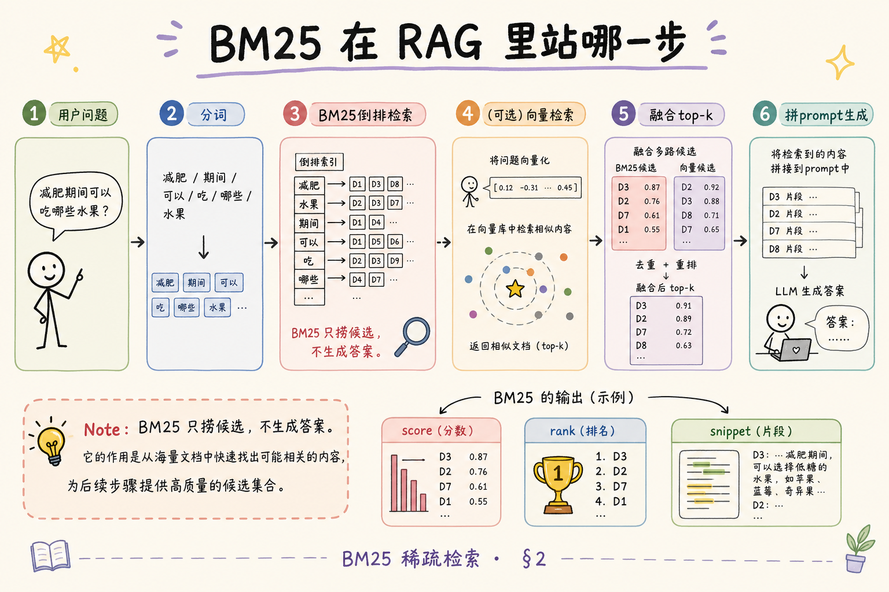
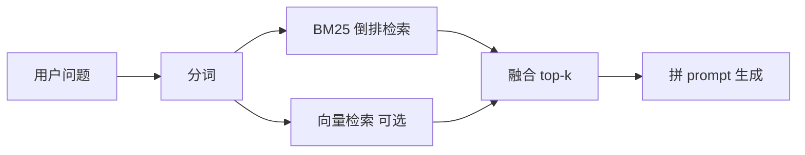
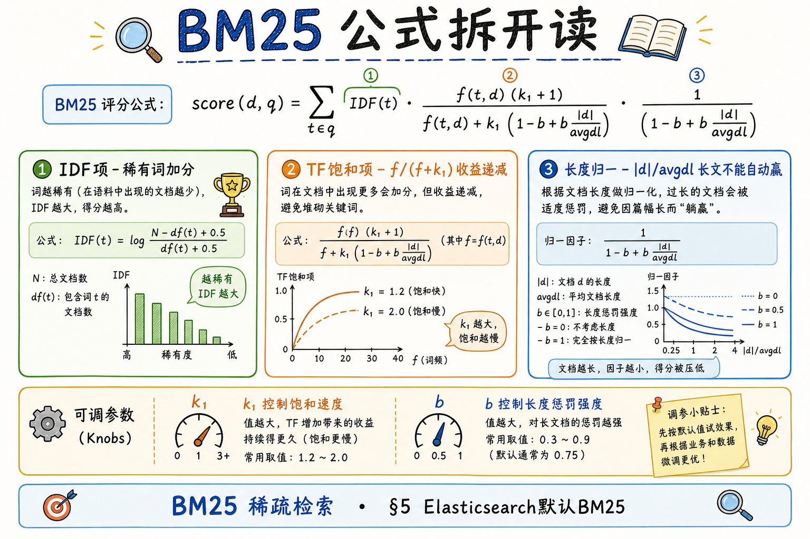
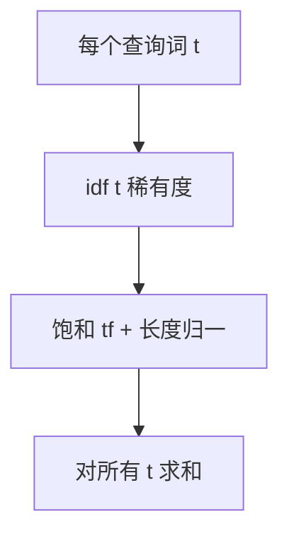
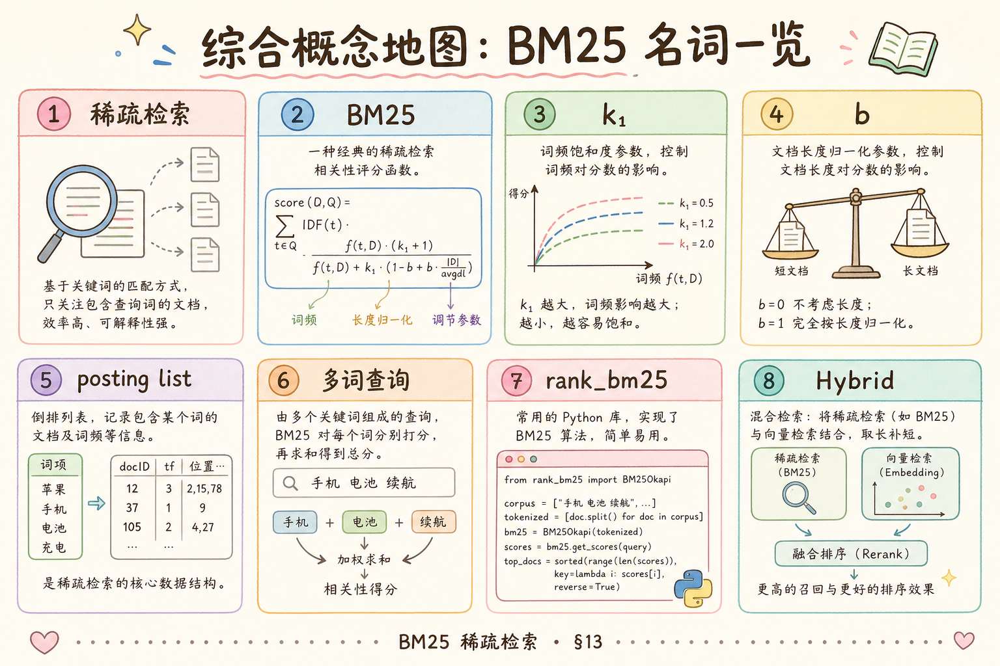

# NLP / IR / LLM 基础（三）：BM25 稀疏检索原理完全指南

> 你学完 TF-IDF，用 `sklearn` 或 Elasticsearch 做企业知识库检索——同事说「我们默认 **BM25**」，调试台里每行 chunk 有个 **score**，和向量相似度不是一回事。TF-IDF 乘积能排序，但 **词频无限涨**、**长 chunk 霸榜** 两类老毛病还在；BM25（Best Matching 25，第 25 次改进的一类经典公式族）在 **IDF** 思想上加了 **词频饱和** 与 **文档长度归一**，成了 Lucene、Elasticsearch 的默认文本相关度。这篇是 [企业 RAG 路线图](ENTERPRISE_RAG_ROADMAP.md) **B 轨第三篇**、接 [TF-IDF 原理](18.tfidf-principles-tutorial.md)：概念为主、与第 18 篇同一迷你语料对照、说明 RAG 里稀疏一路怎么工作；代码仅最小片段。倒排 posting 结构见路线图第 27 条；前置 [分词](17.nlp-tokenization-basics-tutorial.md)。

---

## 目录

1. [前言：从 TF-IDF 到「工业默认」](#1-前言从-tf-idf-到工业默认)
2. [稀疏检索在 RAG 里站哪一步](#2-稀疏检索在-rag-里站哪一步)
3. [TF-IDF 留下的两个问题](#3-tf-idf-留下的两个问题)
4. [BM25 在解决什么：概率检索直觉](#4-bm25-在解决什么概率检索直觉)
5. [BM25 公式拆开读](#5-bm25-公式拆开读)
6. [参数 k1、b：调什么旋钮](#6-参数-k1b调什么旋钮)
7. [与第 18 篇同一语料：直觉对比](#7-与第-18-篇同一语料直觉对比)
8. [查询打分：多词怎么累加](#8-查询打分多词怎么累加)
9. [倒排索引上怎么算 BM25](#9-倒排索引上怎么算-bm25)
10. [Elasticsearch、Lucene 与 rank_bm25](#10-elasticsearchlucene-与-rank_bm25)
11. [和向量检索、Hybrid RAG](#11-和向量检索hybrid-rag)
12. [中文与工程注意点](#12-中文与工程注意点)
13. [综合概念地图](#13-综合概念地图)
14. [常见陷阱与 FAQ](#14-常见陷阱与-faq)
15. [总结与系列下一步](#15-总结与系列下一步)

---

## 1. 前言：从 TF-IDF 到「工业默认」

典型场景：制度库 2 万个 chunk，用户问「年假报销流程」。TF-IDF 余弦能排出前几名，但你发现：**一篇 2000 字的《员工手册》总则** 因词多、命中多，总压在 **300 字的《年假管理办法》** 上；还有篇 FAQ 里「报销」一词出现二十次，分数爆炸。Elasticsearch 开箱的 **similarity: BM25** 正是为缓解这类现象设计的。

**BM25**（Okapi BM25）：基于 **概率相关度模型**（Probabilistic IR）的排序函数，对查询 term 与文档的相关性打分；Elasticsearch 7.x 起默认取代纯 TF-IDF 作为文本相似度。  
通俗说：**仍看关键词命中**，但「同一词多出现几次」收益递减，「文档特别长」不能自动赢。

**稀疏检索**（sparse retrieval）：用 **词项匹配 + 权重** 找文档，文档向量绝大多数维为 0；相对 **稠密向量**（Embedding）检索而言。  
通俗说：**靠字典查索引**，不是把全文压成 768 维向量再比距离。

**读完本文，你应该能做到：**

1. 说出 TF-IDF 的两类弱点，以及 BM25 如何用 **饱和 tf** 与 **长度归一** 应对。
2. 读懂 BM25 常见公式里 **IDF、TF 项、长度项** 各自含义（不必背常数推导）。
3. 解释 **k1、b** 调大调小的方向性影响。
4. 描述查询 **q** 与文档 **d** 的分数如何对 **共有 term** 累加。
5. 说明 BM25 在 **倒排索引** 上如何与 posting list 配合（概念级）。
6. 在 RAG 里定位 BM25 与 **向量检索、重排序** 的分工。

**前置阅读**：[18：TF-IDF](18.tfidf-principles-tutorial.md)、[17：分词](17.nlp-tokenization-basics-tutorial.md)。  
**环境**：手算不需代码；试验可用 `pip install rank-bm25` 或本地 Elasticsearch。  
**本文边界**：不推公式概率推导、不写分布式 Sharding、不讲学习排序（LTR）训练。

### 1.1 为什么 Elasticsearch 默认换成 BM25

早期 Lucene 使用 **TF-IDF 相似度**，在长网页、新闻正文上容易出现「长文霸榜」。BM25 在 TREC 等评测中长期表现稳定，且参数 **k1、b 有明确物理含义**，调参比「换 idf 公式里常数」更有据可依。你用 `match` 查询看到的排序，底层已在替你做饱和与长度修正——**不必自己再实现一遍 TF-IDF 余弦**，除非做教学对比或极小原型。

### 1.2 与第 18 篇如何对照阅读

建议并排打开 [18 篇 §6](18.tfidf-principles-tutorial.md) 与本文 §7：同一组 d₁～d₃ 与查询「年假 报销」。先算 TF-IDF 理解 **idf 与 tf 乘积**，再读 BM25 看 **同一命中下分数如何因 f 饱和、|d| 变化**。两篇文章共用 **N、df、avgdl** 语言，后续倒排索引篇会共用 **posting** 语言。

---

## 2. 稀疏检索在 RAG 里站哪一步





读图：**BM25 只负责从 chunk 库捞出候选**；不生成答案。与 [检索调试台](react/13.retrieval-debug-console.md) 里看到的 **score、rank、snippet** 直接相关——调试「为什么召回这条」时，稀疏侧常能追溯到 **命中了哪些 term、BM25 贡献多少**。

| 步骤 | 稀疏一路输入 | 输出 |
|------|--------------|------|
| 建库 | 分词后的 chunk | 倒排 + 统计 df、平均长度 |
| 查询 | 分词后的问句 | 按 BM25 排序的 chunk_id 列表 |

### 2.1 稀疏 vs 稠密：一张对照表

| | BM25 稀疏 | Embedding 稠密 |
|---|-----------|----------------|
| 索引存什么 | posting：term→(doc, tf) | 向量：doc→float[] |
| 查询做什么 | 分词 → 倒排查找 | 问句编码 → 近邻搜索 |
| 强项 | 专有词、精确匹配 | 换说法、语义相近 |
| 典型组件 | ES、Lucene | Milvus、pgvector、FAISS |

两路 **索引对象** 都是 chunk；许多团队 **同时建** 倒排与向量，查询时融合（§11）。离线建库时：同一批 chunk 文本 **走一遍分词写倒排**，**走一遍 Embedding 写向量库**——数据源一致，索引形态不同，查询时再在应用层合并两路 top-k 结果。

---

## 3. TF-IDF 留下的两个问题

### 3.1 词频线性膨胀

TF-IDF 若用原始计数或简单归一化，**term 在篇内出现次数翻倍，权重近似翻倍**。但相关性往往 **饱和**：「报销」出现 3 次与 30 次，对「这篇讲报销」的判断提升有限，后者还可能只是模板重复。

### 3.2 文档长度偏置

长 chunk 总词数多，即使 **主题一般**，也更容易在更多查询词上「蹭到」非零 tf。RAG chunk 长度不一（300～800 字常见），裸 TF 或弱归一时 **长 chunk 霸榜** 是实测常见坑（第 18 篇 §7 已提余弦缓解；BM25 在公式内内置长度项）。

### 3.3 协调因子（了解即可）

Elasticsearch 的 `_score` 有时还乘 **query coordination** 等因子：命中查询中 **更多不同 term** 的文档略加分，鼓励「多词都中」而非「一词刷爆」。不同版本 ES 细节略有差异；调试时以 **同一 ES 版本内排序** 为准，不必手算协调项。

### 3.4 和 BM25 的关系一句话

**BM25 保留 IDF 思想（稀有词更重要），改 tf 为饱和函数，并显式引入文档长度与语料平均长度之比。**

---

## 4. BM25 在解决什么：概率检索直觉

**概率相关度**（Probabilistic Relevance）：把「文档 d 与查询 q 相关」看成概率问题，用观测到的词频统计去 **估计** 相关度分数，而非几何向量夹角 alone。  
通俗说：**根据词出现情况赌这篇有多相关**——赌局规则编码进 BM25 公式。

**Okapi** 名称来自英国 Okapi 系统；**BM25** 是其中一套经大量 TREC 评测验证的公式族。你不需要推贝叶斯，只需知道：**分数越高，越应该排在前面**；分数对 **查询中每个命中 term** 贡献相加（常见实现）。

### 4.1 从「相关 / 不相关」到打分

经典概率检索想象：每篇文档要么相关、要么不相关（二分类），观测到查询词在文档中出现会 **提高相关似然**。BM25 公式是这种思想在 **词频统计** 上的闭式近似，工程上好用、可解释。  
与向量检索的「语义距离」互补：**BM25 不声称懂语义**，只声称「这些词同时出现的方式很像相关文档」。

### 4.2 稀疏检索为何叫 sparse

一篇 chunk 词表可能有上万元项，但一篇实际只有几十～几百个不同 term 非零——向量在词项空间里 **极稀疏**。BM25 只在这些 **非零维**（命中 term）上累加分数，不必把整篇向量与查询向量逐维相乘（与 TF-IDF 稀疏点积同类）。

---

## 5. BM25 公式拆开读

以下是与 Elasticsearch 默认实现一致的常见形式（Lucence 系）。查询 **q**、文档 **d**，对查询中的 term **t**：

**IDF 项**（与 TF-IDF 同族，稀有词分高）：

\[
\mathrm{idf}(t) = \ln\left(1 + \frac{N - \mathrm{df}(t) + 0.5}{\mathrm{df}(t) + 0.5}\right)
\]

- **N**：语料文档（chunk）总数  
- **df(t)**：包含 **t** 的文档数  

**TF 饱和项**（含长度归一）：

\[
\text{score}(t,d) = \mathrm{idf}(t) \cdot \frac{f(t,d)\,(k_1+1)}{f(t,d) + k_1\left(1 - b + b\,\dfrac{|d|}{\mathrm{avgdl}}\right)}
\]

- **f(t,d)**：t 在文档 d 中的词频  
- **|d|**：文档 d 的长度（词数）  
- **avgdl**：语料平均文档长度  
- **k1**、**b**：可调参数（§6）  

文档 **d** 对查询 **q** 的总分（常见）：

\[
\mathrm{BM25}(q,d) = \sum_{t \in q} \text{score}(t,d)
\]

只对 **查询里出现、且文档也包含** 的 term 求和；文档不含该 term 则该项为 0。





读图：每个查询词独立贡献；**idf** 全库共享；**f 与 |d|** 因文档而异。

### 5.1 IDF 项与 TF-IDF 的异同

BM25 的 idf 形状与 [18 篇 §4](18.tfidf-principles-tutorial.md) 类似：df 越小，idf 越大；df 接近 N 时 idf 趋近 0。分母里的 **+0.5** 是平滑，避免 df=0 或极端值。  
**区别在 tf 项**：TF-IDF 常线性或对数 tf；BM25 用 **分式饱和** 把 f 的增长压住，并除以长度归一项。

### 5.2 查询里没有的词不算分

文档 d 若不含查询 term **t**，则 f(t,d)=0，该项 score 为 0——**不会对未命中词扣分**，只是不加分。排序是 **相对排名**；全不命中则 BM25=0。这与「布尔 AND 必须全有」不同，适合自然语言长短不一的问句。

---

## 6. 参数 k1、b：调什么旋钮

| 参数 | 典型默认 | 调大时直觉 | 调小时直觉 |
|------|----------|------------|------------|
| **k1** | 1.2～2.0（ES 默认 1.2） | 词频 **饱和更慢**，高频词权重更大 | 更快饱和，词频影响弱 |
| **b** | 0.75 | **长度归一更强**，长文档更吃亏 | 长度影响弱，长文更易靠前 |

**b = 0**：不考虑长度（不推荐于长度差大的 chunk 库）。  
**b = 1**：长度惩罚最强。  
地基篇：**先用默认**，用业务问句集看 Recall@5 再动；盲目调参不如修分词与停用词。

### 6.1 词频饱和长什么样（直觉图）

设 k1=1.2、b=0.75，某 term 的 idf 固定，只看 f(t,d) 从 1 增到 20 时 **TF 项分子分母** 的行为：第 1 次出现贡献最大；从 2→5 仍有明显提升；从 10→20 **几乎平坦**——这就是「饱和」。  
若用 TF-IDF 线性 tf，10 次出现的 term 对分数的影响可能是 2 次的 5 倍；BM25 则接近 **对数式收益递减**，更贴近「重复刷同一个词不代表主题更强」的直觉。

### 6.2 长度项在做什么

分母里的 \(1 - b + b \cdot |d|/\mathrm{avgdl}\)：当文档长度 **|d| = avgdl** 时，该项为 1，无额外惩罚；**|d| 远大于 avgdl** 时，分母变大，**同样 f(t,d) 贡献被压低**。短而聚焦的 chunk 在 RAG 里常更利于精确命中——BM25 与「小块检索」产品取向一致。

---

## 7. 与第 18 篇同一语料：直觉对比

沿用 [18 篇 §6](18.tfidf-principles-tutorial.md) 三篇（已分词）：

- **d₁**：`报销 年假 公司 报销`（|d₁|=4）  
- **d₂**：`公司 制度 公司`（|d₂|=3）  
- **d₃**：`报销 流程 公司`（|d₃|=3）  

N=3，avgdl = (4+3+3)/3 ≈ 3.33。查询 **q** = `年假 报销`。

**TF-IDF 故事回顾**：「年假」仅 d₁ 有，idf 高；「报销」d₁、d₃ 有。  
**BM25 额外行为**：

1. d₁ 中「报销」出现 **2 次**，TF-IDF 线性抬高；BM25 中第二、第三次「报销」**边际贡献递减**——不会简单 ×2 霸榜。  
2. 若把 d₂ 换成极长模板（|d| 很大），TF-IDF 余弦虽有帮助，BM25 分母里 **|d|/avgdl** 项会 **压低** 每个 term 的 tf 贡献，长文不易仅凭「蹭词多」赢。  
3. 查询只含「年假」「报销」时，d₂ 若完全不含二者，BM25=0（无命中），不会因「公司」等无关词得分。

手算不必带满 k1、b 小数；**方向** 比精确分数重要：BM25 让 **「主题集中、含稀有查询词」** 的中等长度 chunk 更公平。

### 7.1 极端对比：刷词 spam 文档

构造 **d₄**：`报销` 重复 50 次、无其他词，|d₄|=50。TF-IDF 可能对「报销」查询给极高 tf；BM25 中 f 饱和使 **第 20 次以后的「报销」几乎不再加分**。d₄ 还可能因 |d| 大于 avgdl 被长度项进一步压分。  
这不是说 spam 绝不可能靠前——若全库只有 d₄ 含「报销」，idf 仍高——但 **无意义重复** 的排序优势被削弱。反作弊、模板页去重仍是另一层（路线图去重篇）。

### 7.2 查询只命中一个稀有词

查询「年假」时，仅 d₁ 含该词；d₃ 虽含「报销」但 BM25 对「年假」项为 0。排序主要由 **idf(年假) × 饱和 tf** 决定——**稀有查询词** 在 BM25 里仍扮演「一票否决权」式的拉分角色，与 TF-IDF 一致。

---

## 8. 查询打分：多词怎么累加

查询 `研发 差旅 住宿标准` 分词后 4 个 term（假设未去停用）。文档 d 的 BM25 分数 ≈ 四个 term 各自 **score(t,d)** 之和（若某 term 不在 d 中，该项 0）。

**AND 直觉 vs BM25**：布尔 AND 要求全有；BM25 **部分命中也有分**，命中越多、命中词越稀有，总分越高——这是 **软匹配排序**，更适合自然语言问句。

**查询 term 权重**：标准 BM25 对查询中重复词可多次累加；Elasticsearch 可用 `boost` 给某字段或某词加权（标题 boost 常见）。

### 8.1 多词查询的「软 AND」

用户问「研发部差旅住宿标准」——五词全中的 chunk 理应最高；但 **命中其中三个稀有词** 的 chunk，往往仍应好于 **只命中「公司」「规定」两个常见词** 的长文。BM25 通过 **idf 加权求和** 实现这种软排序，无需用户写布尔式。  
若业务要求 **必须含某词**（如「年假」），可用 ES `must` 子句硬过滤，再在满足 must 的集合内按 BM25 排——**过滤与打分分工**。

### 8.2 零结果与放宽

全库无 chunk 同时含所有查询词时，BM25 仍可能对 **部分命中** 的文档给正分；若仍零结果，应检查 **分词是否过细**（17 篇）、是否应 **同义词扩展** 或转向 **向量一路**，而不是先把 k1 调到极端。

---

## 9. 倒排索引上怎么算 BM25

**倒排索引**（inverted index）：每个 term → **posting list**，每条 posting 常含 `(doc_id, tf)`，有时存预计算量。  
通俗说：**词典 + 倒排表**——查「报销」立刻拿到含它的所有 chunk 及次数。

查询流程（概念）：

1. 对查询中每个 term **t**，取 posting list（候选文档集合）。  
2. 对各候选 d，用全局 **N、df(t)、avgdl** 与 posting 里的 **tf**，按公式算 **score(t,d)**。  
3. 对同一 d 累加所有 t 的贡献，得 **BM25(q,d)**。  
4. 按分数降序取 top-k。

**WAND、Block-Max** 等加速技巧跳过大量低分文档——工程优化，地基篇知道「不必对每个 d 全库扫」即可。

与第 18 篇关系：**IDF 统计建库时算**；**f(t,d) 在 posting 里**；查询时 **现场组合** 成 BM25（或近似预计算）。

### 9.1 posting 里通常存什么

对 term「报销」，posting list 可能类似：

| doc_id | tf |
|--------|-----|
| chunk_101 | 2 |
| chunk_305 | 1 |
| chunk_882 | 5 |

查询含「报销」时，只遍历这张表上的行。多 term 查询时，引擎对 posting **求交或按块合并**，BM25 分数在遍历候选时累加——**不会** 全库扫描每个 chunk。

### 9.2 建库时要的全局统计

除 (term, doc) 的 tf 外，还需 **N**、各 term 的 **df**、**avgdl**。新 chunk 入库会更新 df 与 avgdl；大库可接受，极小库 idf 波动大（同 TF-IDF 篇）。

---

## 10. Elasticsearch、Lucene 与 rank_bm25

**Elasticsearch** 文本字段默认 **BM25**；`match` 查询返回的 `_score` 即基于 BM25（经 boost、协调因子等包装）。  
映射里可设 `similarity: BM25`，参数 `k1`、`b`。

**演示什么**：Python 小库用 `rank_bm25`。  
**环境**：`pip install rank-bm25`。

```python
from rank_bm25 import BM25Okapi

corpus = [
    ["报销", "年假", "公司", "报销"],
    ["公司", "制度", "公司"],
    ["报销", "流程", "公司"],
]
bm25 = BM25Okapi(corpus)  # 内部 tokenized 文档列表
query = ["年假", "报销"]
scores = bm25.get_scores(query)
# scores[i] 即第 i 篇文档对 query 的 BM25 分
```

**预期**：索引 0（d₁）最高——与 §7 一致。中文生产：**先 jieba 再传入**，与索引管道一致。

| 工具 | 场景 |
|------|------|
| Elasticsearch / OpenSearch | 百万级 chunk、聚合、权限过滤 |
| Lucene | ES 底层；Java 生态 |
| rank_bm25 | 原型、离线评测、几千篇 |
| Whoosh | 轻量嵌入式 |

### 10.1 Elasticsearch 查询在干什么（概念）

`GET /chunks/_search` + `match: { "content": "年假报销" }` 时：analyzer 把查询切成 term → 对每个 term 查倒排 → 对命中 chunk 累加 BM25 分量 → 按 `_score` 排序返回。  
`multi_match` 可搜 `title` 与 `content` 两字段，各自有长度与 boost。权限过滤（`filter`）常在打分前缩小候选集——**filter 不改变 BM25 公式**，只减候选。

### 10.2 BM25L、BM25+（了解即可）

**BM25L**、**BM25+** 等变体主要缓解 **超长文档** tf 下界、分数漂移等问题。Elasticsearch 默认 **Okapi BM25** 已覆盖多数企业知识库；除非你读论文或特殊场景，**不必** 第一篇就换公式族。

---

## 11. 和向量检索、Hybrid RAG

| 维度 | BM25 稀疏 | Embedding 稠密 |
|------|-----------|----------------|
| 匹配 | 词项重合、稀有词 | 语义相近、paraphrase |
| 失败模式 | 同义词、口语换说法 | 专有名词、数字、罕见实体 |
| 成本 | CPU、倒排，无 GPU | 向量化 API、向量库 |
| 可解释 | 命中词、tf、idf | 相似度数字，难解释 |

**Hybrid**（混合检索）：两路各取 top-k，用 **RRF**（Reciprocal Rank Fusion，倒数排名融合）或加权合并。  
通俗说：**关键词一路 + 语义一路**，取长补短——企业 RAG 常见默认架构。

BM25 **不**解决幻觉；只提高 **送进 LLM 的 chunk 是否相关**。生成质量还取决于 prompt、模型与引用归因（路线图 40～41 条）。

### 11.1 RRF 融合在说什么（概念）

**RRF**（Reciprocal Rank Fusion）：稀疏一路排名 r₁，稠密一路排名 r₂，同一 chunk 的综合分常形如 \(\sum 1/(k + r)\)。  
通俗说：**两路各自前几名「投票」**，不强行把 BM25 分数与余弦相似度同一量纲相加——避免「分数尺度不一致」的坑。k 常取 60 左右，地基篇知道 **Hybrid 常用排名融合** 即可。

### 11.2 何时稀疏一路可以占主导

专有名词密集（产品型号、法规条文号）、用户复制粘贴关键词提问、语料与问句 **用词高度重叠** 时，BM25 往往已很强。口语化「怎么搞报销」类问法，向量一路权重通常要上来——**用标注问句集** 看哪类失败再多加一路，而非凭直觉。

---

## 12. 中文与工程注意点

1. **分词**：与 [17 篇](17.nlp-tokenization-basics-tutorial.md) 相同——索引、查询同一 analyzer；`报销流程` 切成 `报销/流程` 还是 `报销流程` 影响 posting。  
2. **停用词**：「的、是」是否删除影响 df 与长度；法规库慎用一刀切。  
3. **chunk 级索引**：一篇 PDF 多个 chunk，每 chunk 独立 |d|；勿整篇 PDF 当一个 |d| 极大文档。  
4. **字段 boost**：标题、小节名权重可高于正文——`multi_match` 的 `title^2`。  
5. **分数不可跨索引比**：不同索引 N、avgdl 不同，_score 绝对值只在本查询内排序有意义。

### 12.1 评测稀疏一路看什么

准备 30～100 条 **业务问句 + 相关 chunk 标注**（或弱标注：点击、点赞）。每次改分词、停用词、k1、b 或 chunk 策略后，看 **Recall@5、MRR@10** 是否提升。  
BM25 调试台（[React 13](react/13.retrieval-debug-console.md)）适合肉眼查 **top-k 是否含应有关键词**；指标适合回归测试。不要只盯 `_score` 绝对值大小。

---

## 13. 综合概念地图

| 名词 | 通俗说 |
|------|--------|
| BM25 | 带饱和与长度修正的关键词打分 |
| k1 | 控制词频多重要 |
| b | 控制文档长度多重要 |
| avgdl | 语料平均长度标尺 |
| posting | 某词出现在哪些文档、几次 |
| sparse | 靠词项命中，不靠向量 |
| _score | ES 返回的相关度（常基于 BM25） |
| avgdl | 语料平均文档长度，长度归一标尺 |
| saturated tf | 词频收益递减的 tf 项 |

**决策树**：



```
要可解释关键词检索？
├─ 是 → 倒排 + BM25（ES 或 rank_bm25）
└─ 还要 paraphrase？
    └─ Hybrid：BM25 + 向量 + 融合
```

---

## 14. 常见陷阱与 FAQ

### 14.1 陷阱

**陷阱 1**：把 ES 的 `_score` 当 0～1 概率。  
**陷阱 2**：查询未分词与索引不一致。  
**陷阱 3**：极小语料（几十 chunk）上 idf 极端，BM25 波动大——需更多数据或平滑。  
**陷阱 4**：只调 k1、b 不修 **chunk 边界** 切断关键词。  
**陷阱 5**：以为 BM25 能匹配「汽车↔轿车」——需向量或同义词表。  
**陷阱 6**：全库重建后未 **refresh** 索引统计，avgdl、df 陈旧（ES 最终一致）。

**陷阱 7**：用 BM25 分数阈值 `score > 0.5` 过滤——`_score` 无固定上界，阈值无通用意义；用 top-k 或相对排名。

### 14.2 FAQ

**Q：BM25 和 TF-IDF 还要学哪个？**  
A：先 TF-IDF 懂 idf；生产排序学 BM25；ES 用户直接 BM25。

**Q：和路线图第 26 条？**  
A：本篇对应该条；下接倒排索引（27）。

**Q：BM25Okapi 与 BM25L、BM25+？**  
A：变体，处理长文档、下界等；ES 默认 Okapi；地基篇知道有族谱即可。

**Q：RAG top-k 取多少？**  
A：看 context 窗口与 chunk 长；常 5～20；用评测集扫。

**Q：能否用 BM25 做重排序？**  
A：常作 **第一阶召回**；二阶可用交叉编码器 rerank，属进阶。

**Q：BM25 需要训练吗？**  
A：**不需要** 标注训练即可用；k1、b 可用评测集调，但非机器学习训练。LTR 用点击日志学排序是另一条路。

**Q：单字查询中文怎么办？**  
A：单字 df 往往极高、idf 低；鼓励用户多字查询，或 n-gram 补充通道（17 篇）。

**Q：开源向量库还要 BM25 吗？**  
A：要。向量解决语义；BM25 解决型号、条款号、用户复制关键词——Hybrid 是常态。两路索引同一批 chunk，查询层融合即可，不必二选一。

---

## 15. 总结与系列下一步

### 15.1 速记

1. **BM25 = IDF + 饱和 TF + 长度归一**，工业默认稀疏打分。  
2. **k1** 管词频饱和，**b** 管长度惩罚；默认往往够用。  
3. 查询分数 = **各命中 term 贡献之和**；倒排只扫相关 posting。  
4. RAG：**BM25 找 chunk**，向量补语义；RRF 等融合常见。  
5. 中文成败在 **分词与 chunk**，不在 k1 第三位小数。以上承接 TF-IDF，通向倒排索引实现。建议用 `rank_bm25` 跑通 [18 篇 §6](18.tfidf-principles-tutorial.md) 语料，打印 `scores` 与 TF-IDF 排序对照一次；再挑三条真实业务问句在 ES 或 rank_bm25 上看 top-5 是否含预期关键词，比死记公式更有效。

### 15.2 推荐阅读

| 文档 | 内容 |
|------|------|
| [18 TF-IDF](18.tfidf-principles-tutorial.md) | 对照 §7 语料 |
| [17 分词](17.nlp-tokenization-basics-tutorial.md) | term 来源 |
| [React 13 调试台](react/13.retrieval-debug-console.md) | 看 score |
| [路线图](ENTERPRISE_RAG_ROADMAP.md) | B 轨 27+ |

### 15.3 留白

未展开：**倒排压缩、跳表、WAND**、**BM25 调参网格搜索**、**ColBERT 晚期交互**、**ES dense_vector 与 BM25 组合查询语法**。建议下一篇：**倒排索引概念**（路线图 27），把 posting、词典、压缩与本文 BM25 打分串成完整稀疏检索实现图景。

---

> **初学者可能仍困惑的点**  
> - 公式吓人，记住 **饱和 + 长度** 两词即可指导调参。  
> - `_score` 只在一次查询内比大小，不是百分比。  
> - 与向量不是二选一，**Hybrid** 是 RAG 常态。  
> - 饱和的意思是：**多刷同一个词，不如多覆盖几个不同的查询词**。  
> - 改 k1、b 之前，先确认 **分词、chunk、停用词** 已与业务对齐——否则是在给脏数据调曲线。  
> - Elasticsearch 文档里的 `similarity` 配置改的是 BM25 的 k1、b，不是换一套无关算法。  
> - 记住 **BM25 解决的是排序公平性**，不是理解同义词——那是向量路的职责。
