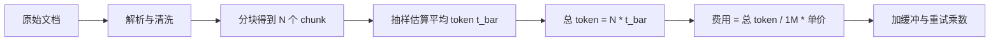
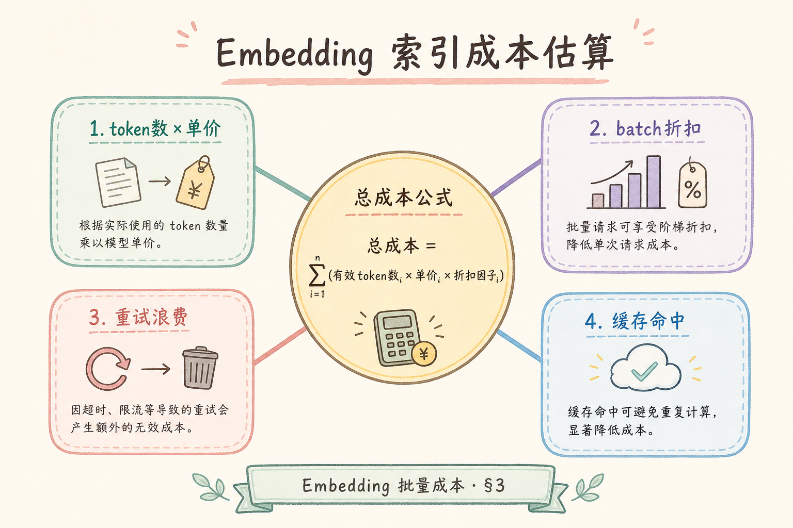
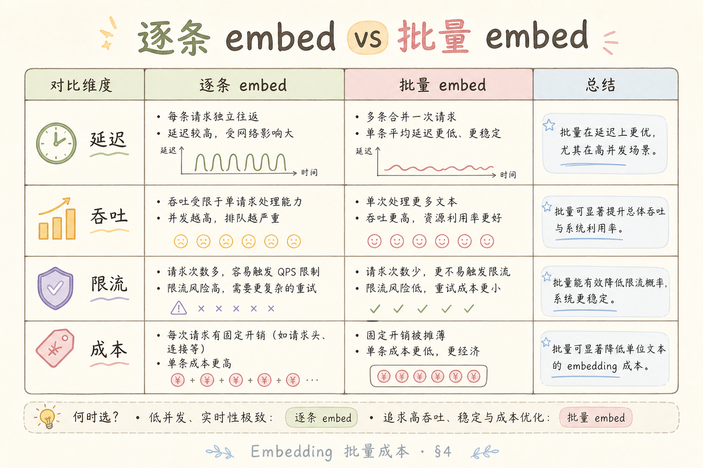
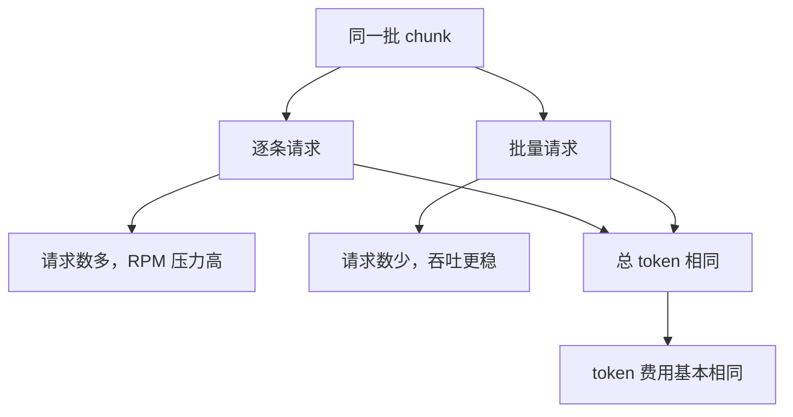
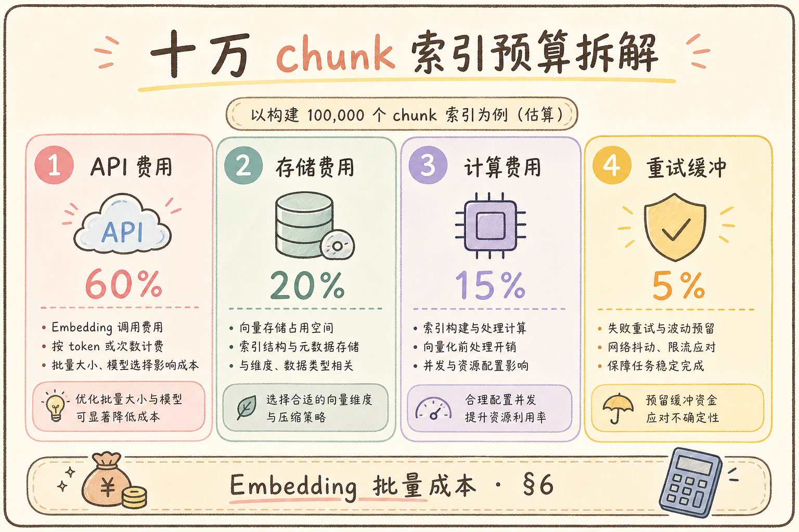
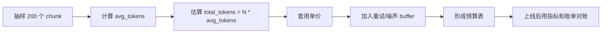
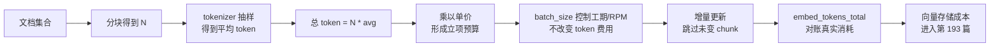

# G 生产化（七）：Embedding 批次成本估算完全指南

> 财务问：「把十万份 PDF 索引进知识库，Embedding 要多少钱？」——若你只会说「看账单」，立项阶段就输了。索引成本 **≈ 总 token 数 × 单价**，而 token 数由 **[63 分块](63.markdown-ast-chunking-tutorial.md) 策略** 与 **文档字数** 决定；批不批、怎么批影响 **[67 批量 Embedding](67.embedding-batching-tutorial.md)** 的 **时间与限流**，但 **同模型下 token 费通常与是否批量无关**。[27 Token 计费](27.token-counting-billing-tutorial.md) 教你看懂 input 单价；本篇专注 **索引路径 embed 成本估算、批次规划、重索引预算**。路线图第 **209** 条，**地基篇**。

---

## 目录

1. [前言：索引账单从哪来](#1-前言索引账单从哪来)
2. [本文边界与动手路径](#2-本文边界与动手路径)
3. [成本公式与变量](#3-成本公式与变量)
4. [从文档到 token：估算流水线](#4-从文档到-tokent估算流水线)
5. [单价、计费单位与厂商差异](#5-单价计费单位与厂商差异)
6. [批量 vs 逐条：钱与时间](#6-批量-vs-逐条钱与时间)
7. [重索引与增量：乘数效应](#7-重索引与增量乘数效应)
8. [先错对对：五种典型翻车](#8-先错对对五种典型翻车)
9. [综合实战：十万 chunk 预算表](#9-综合实战十万-chunk-预算表)
10. [与监控、配额联动](#10-与监控配额联动)
11. [综合概念地图](#11-综合概念地图)
12. [常见陷阱与 FAQ](#12-常见陷阱与-faq)
13. [总结与系列下一步](#13-总结与系列下一步)

## 1. 前言：索引账单从哪来

RAG **一次性索引费** 常被低估：

- 法务部丢 **5GB PDF**——chunk 后 **百万级** 文本块；  
- 换 [25 Embedding 模型](25.embedding-vector-tutorial.md)——[76 Chroma](76.chroma-vector-db-tutorial.md) 要 **全量重建**；  
- 开发环境误对 **生产库** 跑 reindex——一夜 **四位数美元**。

**Embedding 批次成本估算**：在索引前，用 **chunk 数 × 每块 token × 单价** 粗算费用，并结合 **batch 策略** 评估 **工期与 RPM 风险**。  
通俗说：**发货前先称重量价，别等账单到了才慌**。

它解决的问题很具体：在老板问“这批文档建索引要多少钱、要跑多久、会不会打爆限流”时，你能给出可复核的数字，而不是回答“应该不贵”。本文的用法也很直接：先抽样算平均 token，再套公式，再把重试、重索引、存储和配额作为乘数或单独预算行。

换句话说，本篇回答的是：Embedding 成本估算是什么、有什么用、解决什么预算风险、怎么用抽样脚本和预算表落地。

**读完本文，你应该能做到：**

1. 写出 §3 **核心公式** 并做数量级估算。  
2. 用 tiktoken 或厂商工具 **抽样估 token/chunk**（衔接 [27 篇](27.token-counting-billing-tutorial.md)）。  
3. 说明 **批量不改变 token 费** 但改变 **吞吐与 429**（[67 篇](67.embedding-batching-tutorial.md)）。  
4. 做 **重索引 / 换模型** 预算乘数（§7）。  
5. 在 [`04-fullstack-assistant`](projects/04-fullstack-assistant/) 立项表填 **索引预算行**。

## 2. 本文边界与动手路径

**档位：G 地基篇（209）。**

本篇只估算索引阶段 Embedding 的 API 费用，不混聊天 LLM 费与向量存储月费——边界清楚后预算表才不会打架。完整 FinOps 视图应串联 [193 向量存储](193.vector-storage-cost-tutorial.md) 与 [194 Token 优化](194.llm-token-cost-optimization-tutorial.md)。动手路径：手算数量级 → 脚本抽样 avg_tokens → 填预算表 → 对照 [67 批量](67.embedding-batching-tutorial.md) 定 batch_size 防 429。

本文只估算“索引阶段生成 Embedding”的成本，不估聊天时的 LLM 输入输出费，也不估长期向量存储费。这样边界清楚后，预算表才不会把不同账单混在一起。

如果你要做完整成本表，可以把本文结果作为第一行，然后继续阅读第 193 篇补存储费，第 194 篇补生成费。

| 步骤 | 验收 |
|------|------|
| A | 手算 1 万字中文 ≈ 多少 token | 数量级正确 |
| B | 脚本抽样 100 chunk 均值 | 得到 avg_tokens |
| C | 填 §9 预算表 | 总费 ±30% |
| D | 读 67 篇定 batch_size | RPM 不爆 |

**前置必读：**

| 篇目 | 衔接点 |
|------|--------|
| [27 Token 计费](27.token-counting-billing-tutorial.md) | input 单价、tokenizer |
| [67 批量 Embedding](67.embedding-batching-tutorial.md) | batch_size、RPM、TPM |
| [49 增量更新](49.incremental-update-tutorial.md) | 跳过未变 chunk 省钱 |
| [192→193](193.vector-storage-cost-tutorial.md) | 向量存储费另篇 |

## 3. 成本公式与变量

预算抓三个变量即可起步：`N`（chunk 总数）、`t̄`（平均每块 token）、`p`（每百万 token 单价）。漏掉 overlap、重试、重索引乘数会导致立项通过、账单超标。换 embedding 模型通常意味着全量 re-embed，费用接近新索引全额，应在 [154 参数版本](154.param-version-management-tutorial.md) 里留变更记录并提前通知财务。

先用一张图把账单从哪里来讲清：Embedding API 通常按输入 token 计费，批大小只改变请求组织方式，不改变文本本身的 token 数。



这张图的结论是：预算先抓 `N`、平均 token 和单价三个变量，再讨论 batch_size。

### 3.1 核心公式

```text
索引 Embedding 费用 ≈ Σ (每个 chunk 的 token 数) × (每百万 token 单价)
                    = 总 token 数 / 1_000_000 × 单价（USD/1M tokens）
```

记：

- \(N\) = chunk 总数  
- \(\bar{t}\) = 平均每 chunk token 数  
- \(p\) = 每百万 token 价格（美元）

则 **\( \text{Cost} \approx N \times \bar{t} / 10^6 \times p \)**。

**示例：** \(N=100{,}000\)，\(\bar{t}=120\)，\(p=\$0.02\)（示意价，以官网为准）

```text
总 token = 100,000 × 120 = 12,000,000
费用 ≈ 12 × $0.02 = $0.24
```

——看起来便宜？**\(\bar{t}\) 变大或 \(N\) 百万级** 就可观：\(N=1{,}000{,}000\)，\(\bar{t}=256\) → 256M tokens → **\$5.12**（仍示意）；企业 **多库多租户重复索引** 会累加。

### 3.2 别忘的乘数

| 乘数 | 说明 |
|------|------|
| 重试冗余 | +5～15%（[69 限流重试](69.embedding-retry-rate-limit-tutorial.md)） |
| 重索引 | 换模型 ×1 全量（[162 幂等](162.idempotent-reindex-tutorial.md)） |
| 失败重跑 | 无 [49 增量](49.incremental-update-tutorial.md) 时 ×2 |
| 多语言重复 | 同一 doc 中英双份 chunk ×2 |

## 4. 从文档到 token：估算流水线

这一节回答“怎么用公式”。不要从文档页数直接跳到价格，要先经过解析、分块、tokenizer 抽样三步，否则 OCR 噪声、表格重复 header、overlap 都会让估算偏离。



```text
原始字数/页数
  → 解析损耗（36 篇）
  → 分块数 N（chunk_size overlap）
  → 抽样或全量 tokenizer
  → N × t̄
  → × 单价
```

### 4.1 粗算经验（无 tiktoken 时）

沿用 [27 篇](27.token-counting-billing-tutorial.md) 经验：

| 文本类型 | token / 汉字 | token / 英文词 |
|----------|----------------|----------------|
| 中文技术文档 | ~1.5–2.0 | — |
| 英文 | — | ~1.3 token/词 |
| 中英混合 | 保守取高 | |

**chunk_size=512 token** 时，每块 **顶格接近 512**；overlap 10% 使 **总 token 略高于「字数换算」**。

### 4.2 抽样脚本（推荐）

下面脚本演示最小抽样估算：从已有 chunk 列表里随机取最多 200 个，计算平均 token，再乘以全量 chunk 数。运行前需要准备 `all_chunks`，其中每个元素至少有 `.text` 字段。

```python
import tiktoken
import random

enc = tiktoken.get_encoding("cl100k_base")  # OpenAI 系示意
sample = random.sample(all_chunks, min(200, len(all_chunks)))
avg_t = sum(len(enc.encode(c.text)) for c in sample) / len(sample)
total_tokens = avg_t * len(all_chunks)
print(f"chunks={len(all_chunks)} avg_tokens={avg_t:.1f} total≈{total_tokens:,.0f}")
```

输出里的 `avg_tokens` 是后面预算表的核心变量。**换模型** 换 encoding；BGE 本地 **不计 API 费**，但计 **GPU 电费**（另一本账）。

## 5. 单价、计费单位与厂商差异

写预算必须标注 **价格来源日期** 与 **安全系数**（公示价 ×1.1）。本地 GPU 推理无 token 费，但要计折旧、电价与运维人力——FinOps 表应分「API token」与「自建算力」两行。Batch API 若支持异步半价，需读厂商文档，与在线 batch（[67](67.embedding-batching-tutorial.md)）不是同一概念。

单价不是固定常识，而是供应商、区域、模型和计费单位共同决定的结果。写预算时必须标注“价格来源日期”，否则下个月复盘时很难解释偏差。

初学者可以先按“API token 费”和“本地 GPU 成本”两类记账。前者看官网单价，后者看机器折旧、电费和运维时间。

| 厂商类型 | 计费 | 备注 |
|----------|------|------|
| OpenAI 类 | $/1M tokens input | 价格常变，查官网 |
| 云厂商统一价 | 可能含免费档 | 注意区域 |
| 本地 GPU | 无 token 费 | 折旧+电+运维 |

**Batch API**（异步半价类）若可用——**工期换金钱**；与 [67 篇](67.embedding-batching-tutorial.md) 在线 batch 不同，需读厂商文档。

**重要：** 估算用 **「公示价 × 1.1 安全系数」**，立项留 buffer。

## 6. 批量 vs 逐条：钱与时间

工程上为 batch 的理由是 **不 429、更快完工、更稳吞吐**——不是「同文本更便宜」。TPM 上限决定理论最短 embed 工期，实际还要叠加解析 CPU 与向量写入 IO。batch 过大可能 OOM，需在 [67 篇](67.embedding-batching-tutorial.md) 与实测间折中。

批量和逐条的差别在“怎么发请求”，不在“文本是否计费”。





这张图的重点是纠正误解：batch 能减少 429 和工期，但不能把同一段文本变便宜。

| 维度 | 逐条 embed | 批量 embed（67 篇） |
|------|------------|---------------------|
| **token 费用** | 相同 | **相同**（同文本） |
| 请求次数 | \(N\) 次 | \(N / \text{batch\_size}\) |
| RPM 风险 | 极高 | 低 |
| 工期 | 长 | 短 |
| OOM | 低 | batch 过大则高 |

**结论：** 批量是 **工程优化**，不是 **降价魔法**——别为「省钱」而批，要为 **不 429、更快完工** 而批。

### 6.1 TPM 与工期

若 TPM 上限 1M，总 token 12M——**理论最快 12 分钟**（满占）；实际解析+upsert 更长。粗算工期：

```text
索引时长 ≈ max(解析 CPU, 总token/TPM, 向量写入 IO)
```

## 7. 重索引与增量：乘数效应
Embedding 成本的真正放大器通常不是单次调用，而是重索引、失败重试和批量任务。只要文档量、chunk 数和模型价格相乘，任何一次全量重跑都可能变成明显账单。

### 7.1 换 Embedding 模型

[76 Chroma](76.chroma-vector-db-tutorial.md)：换模型 **新 collection 全量 embed**——费用 ≈ **新索引全额**，旧库可并行保留对比（存储费见 193 篇）。

### 7.2 增量（49 篇）

`content_hash` 未变 **跳过 embed**——日常费用 **≈ 日增量文档**；全量 reindex 仍是 **全额乘数**。

### 7.3 参数变更

只改 `chunk_size`——**N 与 \(\bar{t}\) 都变**，必须 **重算** 而非线性比例。

### 4.3 Token 与字符换算

中文约一点五个字符一 token（见 [27 篇](27.token-counting-billing-tutorial.md)）；批前用 `tiktoken` 估算，超预算拆批。

### 5.3 批大小与限流

[67 批处理](67.embedding-batching-tutorial.md) 推荐 32～128 条；遇 [69 限流](69.embedding-retry-rate-limit-tutorial.md) 指数退避。

### 6.3 费用公式

`cost = tokens * price_per_million / 1e6`；看板展示「若批大小加倍」模拟器。

### 7.3 缓存节省

[68 缓存](68.embedding-cache-tutorial.md) 键 `hash(text)+model`，命中跳过 API，月报单独列节省额。

### 8.3 重试成本

失败重试重复计费，日志打 `retry_count`，与 [163 DLQ](163.retry-dead-letter-tutorial.md) 统计。

### 9.2 代码：动态批

```python
def batches(items, max_tokens=8000):
    buf, tok = [], 0
    for it in items:
        t = count_tokens(it)
        if tok + t > max_tokens and buf:
            yield buf; buf, tok = [], 0
        buf.append(it); tok += t
    if buf: yield buf
```

### 10.3 与 183 看板

embed 费用卡片数据源与本篇公式一致，字段 `embed_tokens, embed_cost_usd`。

### 10.4 模型切换成本

换 Embedding 模型需全量 re-embed，预算一次性 spike，提前通知财务。

---

## 8. 先错对对：五种典型翻车

这些错误不会让代码报错，但会让立项预算、执行工期与最终账单对不上——发现时往往已花完钱。索引前用本节对照表逐项排除：tokenizer 抽样、overlap 系数、环境隔离、重试 buffer、batch 误解。

下面这些错误都会让预算低估。初学者读表时重点看“漏掉了哪个变量”：tokenizer、overlap、环境隔离、重试，还是批量 API 的真实含义。

这些翻车不一定让代码报错，但会让立项预算、执行工期和最终账单对不上。

预算类错误最麻烦的是发现太晚：账单出来时已经花完钱，所以要在索引前就把这些项逐条排除。

| 错 | 对 |
|----|-----|
| 用汉字数当 token 精算 | tiktoken 抽样 |
| 以为 batch 半价 token | 只减请求次数 |
| 忽略 overlap | 块数上调 10～20% |
| 开发对 prod 全量 reindex | 环境隔离 Key+库 |
| 估算不含重试 | ×1.1 系数 |

## 9. 综合实战：十万 chunk 预算表

索引预算需要把“文本处理”和“向量计费”拆开看。下面这张图把抽样、估算、缓冲和对账串成一条线。





这张图的结论是：预算不是单纯填一个价格，而是要说明 token 数从哪里来、缓冲为什么存在、上线后如何验证。

预算表每一行都要能说明来源：抽样、官网单价、历史重试率。PoC 阶段 ±30% 偏差可接受；上线后用 `rag_embed_tokens_total` 与云账单交叉验证，偏差超 15% 应复盘 chunk 策略或漏埋点。十万 chunk 看似便宜，百万级 × 高 `t̄` 会数量级跳变——**必须先抽样再立项**。

**场景：** 内部知识库，PDF 已解析，**chunk 数 N=100,000**，`text-embedding-3-small` 类模型，公示价 **\$0.02/1M**（示意）。

| 行 | 计算 | 结果 |
|----|------|------|
| 抽样 avg_tokens | 200 chunk 均值 | 118 |
| 总 token | 100k×118 | 11.8M |
| Embed API | 11.8×\$0.02 | **~\$0.24** |
| 重试 buffer 10% | | \$0.026 |
| **合计 Embed** | | **~\$0.27** |
| 解析（本地 CPU） | 运维摊销 | 另计 |
| Chroma 存储 | 193 篇 | 另计 |
| 首次全量工期 | 11.8M TPM 1M | ~12min embed 下限 |

**若 N=1,000,000，avg=200：** 200M tokens → **\$4 + buffer**——数量级跳变，**必须先抽样再立项**。

### 9.1 表格模板（复制到 Wiki）

```markdown
| 项目 | 值 |
|------|-----|
| 文档数 | |
| 预估 chunk 数 N | |
| 抽样 avg_tokens | |
| 总 token | N × avg |
| 单价 $/1M | |
| Embed 费用估算 | |
| 重索引乘数 | 1× / 2× |
| batch_size（67） | |
| 预估工期 | |
```

## 10. 与监控、配额联动
Embedding 成本的真正放大器通常不是单次调用，而是重索引、失败重试和批量任务。只要文档量、chunk 数和模型价格相乘，任何一次全量重跑都可能变成明显账单。

### 10.1 Prometheus（191 篇）

如果项目已经接入 Prometheus，可以把每次 embedding 的实际 token 数累加成指标。这样预算表不是一次性文档，而能和真实账单对账。

```python
EMBED_TOKENS = Counter("rag_embed_tokens_total", "Embedded tokens")
# 每次 embed_batch 后 inc(actual_tokens)
```

月末 `increase(rag_embed_tokens_total[30d])` 与云账单 **交叉验证**。如果指标明显低于账单，优先查是否有漏埋点、重试未计入、其他环境共用 Key。

### 10.2 配额与告警

- 云控制台 **月度预算告警**；  
- [188 密钥](188.secrets-management-rag-tutorial.md) **分环境 Key 限额**；  
- Worker **并发上限** 防 embed 风暴（[159 Celery](159.celery-async-queue-tutorial.md)）。

### 10.3 与 27 篇 Token 计费对照

| 路径 | 计费 |
|------|------|
| 索引 embed | 几乎全是 **input tokens** |
| 在线 RAG chat | input（资料+问题）+ output（回答） |

**209 只管索引 embed**；聊天费在 27、211 篇。

## 11. 综合概念地图

把「抽样 → 预算 → batch 执行 → 监控对账」写进 runbook，每次换模型或调 chunk 参数都可复用，而非临时拍脑袋。与 [191 Prometheus](191.prometheus-metrics-rag-tutorial.md) 的 `rag_embed_tokens_total` 联动后，FinOps 从一次性表格变成持续校验。

读这张图时，按“估算前、执行中、执行后”三段看：前面算预算，中间控制批量和限流，后面用指标和账单校验。

这也是本文的实际用法：先用抽样得到预算，再用 batch 控制执行，最后用监控证明预算没有失真。

把这条闭环写进 runbook，后续每次重索引都能复用，而不是每次临时重新估。



结论：Embedding 成本管理不是一次公式计算，而是一条从抽样、预算、执行、监控到复盘的闭环。

## 12. 常见陷阱与 FAQ
最后用 FAQ 检查 Embedding 工程是否稳固。重点看模型版本、向量维度、归一化、批量任务和缓存是否保持一致。

### 12.1 空 chunk 也计费

清洗不足（[62 清洗](62.text-cleaning-tutorial.md)）——无意义短块仍占 N。

### 12.2 元数据塞进 embed 文本

把 `doc_id` 标题重复进每块——**人为放大 \(\bar{t}\)**。

### 12.3 多模态 embed（前瞻）

图片页按 **patch 数** 计费——远超纯文本，路线图 227+。

### 12.4 FAQ

**Q：本地 BGE 怎么估？**  
A：无 token 费；估 **GPU 小时 × 电价** 与 **人力运维**。

**Q：和 67 篇关系？**  
A：67 教 **怎么批**；209 教 **批完花多少钱**。

**Q：Chat 比 embed 贵？**  
A：单 token 价可能更高，且含 output；但 **索引只做一次，查询天天有**——两者都要估。

### 12.5 按部门分摊成本

多租户 RAG 用 `tenant_id` 在 **索引任务表** 累计 `embed_tokens`——月末 SQL 汇总各部门占比。指标路径：`rag_embed_tokens_total{tenant_id}` **仅当租户数 <20** 时做 label，否则用 **日志聚合**（190 篇）避免基数爆炸（191 篇）。

### 12.6 文档类型对 token 的影响

| 类型 | 特点 |
|------|------|
| 纯文本 Markdown | 可预测 |
| 扫描 PDF OCR | 噪声多，chunk 短碎，**N 上升** |
| 表格密集 | 解析重复 header，token 虚高 |
| 代码仓库 | 符号多，英文 token 密 |

立项前 **按类型抽样** 三类文档各 50 chunk，加权平均 \(\bar{t}\)。

### 12.7 chunk_size 与 overlap 的敏感性分析

设字数固定，chunk 变小 → **N 变大**，但每块 \(\bar{t}\) 变小——总 token **未必线性**。经验：overlap 从 0% 提到 15%，总 token 常 **+10～18%**。改参数后 **必须重跑抽样**，不能心算比例。

---
## 13. 总结与系列下一步

能手算十万 chunk 数量级、解释 overlap 对总 token 的影响、说明 dev 误触 prod reindex 的财务后果——是本篇最低验收。索引 embed 几乎全是 input tokens；聊天费在 [27](27.token-counting-billing-tutorial.md) 与 [194](194.llm-token-cost-optimization-tutorial.md)。

209 条核心公式：**费用 ≈ N × t̄ / 10⁶ × 单价**。批量改工期与限流，不改同文本 token 费；增量 [49](49.incremental-update-tutorial.md) 可让日常费用接近日增量，全量 reindex 仍是全额乘数。必读 [27 Token 计费](27.token-counting-billing-tutorial.md) 理解 tokenizer 与单价；必读 [67 批量 Embedding](67.embedding-batching-tutorial.md) 理解 batch_size、RPM、TPM。下一步读 [193 向量存储成本](193.vector-storage-cost-tutorial.md)，把「生成向量花多少钱」扩展到「长期存多久、占多少盘」。

### 13.1 能力自检

能手算十万 chunk 数量级费用？能解释 overlap 对总 token 的影响？能说明 dev 误触 prod reindex 的财务后果？

## 14. 预算表模板

立项时不要只写「预计很便宜」——工程、财务、产品应讨论同一组变量。模板复制到 Wiki 后，每次大批量入库或换模型前更新一行「重索引乘数」与「缓冲 %」，评审会上可直接对照 [184 看板](184.admin-log-eval-dashboard-tutorial.md) 的 embed 费用卡片。

立项时不要只写“预计很便宜”，至少填一张可复核的表：

下面模板适合直接复制到项目 Wiki。每一行都要能说明来源：是抽样得到、供应商官网得到，还是根据历史重试率预估。

| 项目 | 示例 | 说明 |
|------|------|------|
| 文档数 | 10,000 | 原始文档数量 |
| chunk 数 N | 100,000 | 分块后的数量 |
| 平均 token t_bar | 120 | 抽样得到 |
| 总 token | 12,000,000 | `N * t_bar` |
| 单价 | 0.02 USD / 1M token | 以供应商官网为准 |
| API 费 | 0.24 USD | `总 token / 1M * 单价` |
| 缓冲 | 15% | 重试、OCR 噪声、估算偏差 |

这张表的作用是让工程、财务、产品讨论同一组变量，而不是凭感觉争论。

## 15. 估算 FAQ 补充

**批量 Embedding 能降低 token 费用吗？** 不能。批量降低的是请求次数、429 风险和总工期，不会改变同一批文本的 token 总量。

**为什么不能用汉字数直接算？** 因为 tokenizer 会受中英文混排、代码、OCR 噪声影响。正确做法是抽样 chunk，用 [27 Token 计费](27.token-counting-billing-tutorial.md) 的方法估算。

**换 embedding 模型要重新花钱吗？** 通常要。不同模型向量空间不兼容，旧向量不能直接复用，必须全量或按增量重新 embed。

**估算偏差多少算正常？** PoC 阶段 ±30% 可以接受；上线后应把指标与账单对齐，偏差超过 15% 要复盘。

## 16. 收束与下一步

Embedding 成本管理是一条闭环：抽样估 token → 立项预算 → batch 控制执行 → 指标与账单对账 → 复盘偏差。真正容易错的是变量来源与乘数，而非公式本身。存储与查询成本进入 [193 篇](193.vector-storage-cost-tutorial.md) 后，才算完成索引侧 FinOps 拼图。

Embedding 成本估算的核心公式很简单：`费用 ≈ chunk 数 × 平均 token / 1M × 单价`。真正容易错的是变量来源：chunk 数受分块策略影响，平均 token 要抽样，重试和重索引会放大账单。

下一步读 [193 向量存储成本](193.vector-storage-cost-tutorial.md)，把“生成向量要花多少钱”扩展到“长期存储和查询要花多少钱”。
