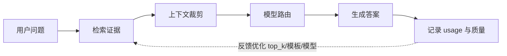
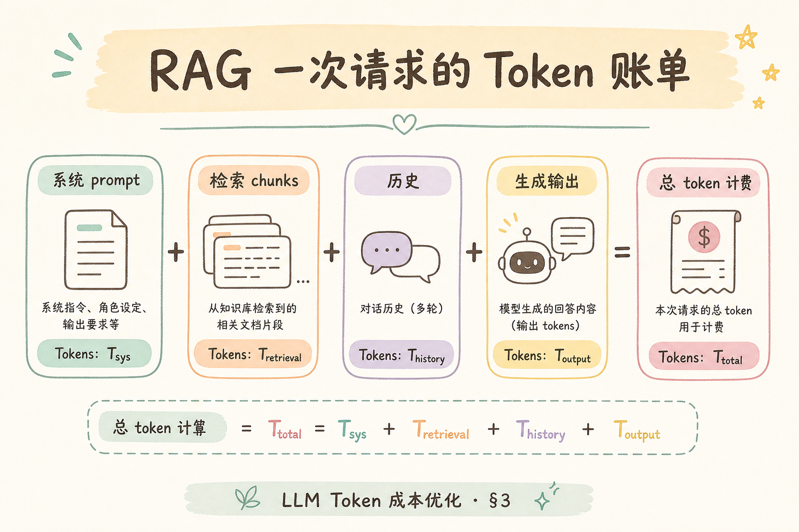
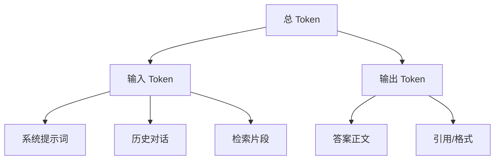
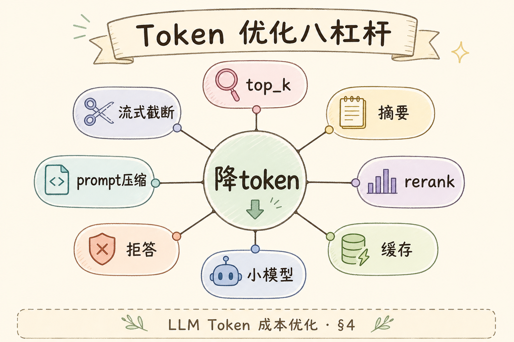
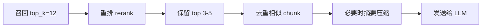
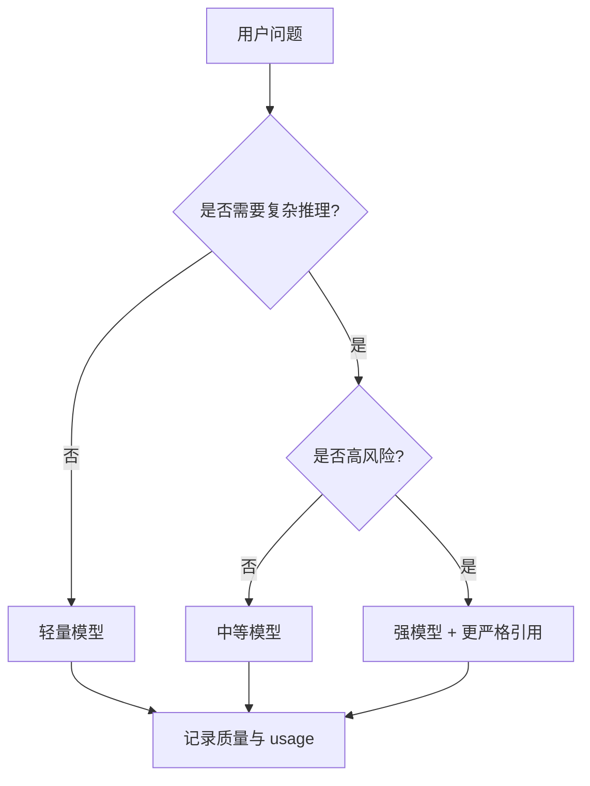

# G 生产（十六）：LLM Token 成本优化完全指南

> RAG 系统上线后，成本往往不是从服务器开始爆，而是从 Token 开始悄悄上涨。用户问一句话，系统会把历史对话、检索片段、系统提示词、引用规则一起发给模型。**Token 成本优化**要解决的问题是：在不明显牺牲答案质量的前提下，让每次请求少带无用内容、少走昂贵模型、少生成废话。

---

## 目录

1. [为什么 Token 成本会失控](#1-为什么-token-成本会失控)
2. [Token 成本优化是什么](#2-token-成本优化是什么)
3. [一次 RAG 问答的 Token 账单](#3-一次-rag-问答的-token-账单)
4. [四个优化杠杆](#4-四个优化杠杆)
5. [检索侧：少而精地给证据](#5-检索侧少而精地给证据)
6. [Prompt 侧：模板、历史与输出上限](#6-prompt-侧模板历史与输出上限)
7. [模型路由：简单问题别上重模型](#7-模型路由简单问题别上重模型)
8. [如何度量省钱有没有伤质量](#8-如何度量省钱有没有伤质量)
9. [常见陷阱与 FAQ](#9-常见陷阱与-faq)
10. [总结](#10-总结)

---

## 1. 为什么 Token 成本会失控

**Token** 可以粗略理解为模型计费和处理文本的基本单位。中文、英文、符号会被切成若干 token，模型通常按输入 token 和输出 token 分别计费。

RAG 问答不是只把用户问题发给模型。一次请求常常包含：

- 系统提示词：告诉模型角色、格式、引用规则；
- 用户问题：本次真实问题；
- 历史对话：为了理解上下文；
- 检索证据：从文档库取回的 chunk；
- 输出内容：模型最终生成的答案。

如果不控制，这些内容会越堆越多。尤其是多轮对话和过大的 `top_k`，会让每次调用都带上大量“看似有用、实际无关”的文本。

---

## 2. Token 成本优化是什么

成本优化的本质是「让每个 token 都有理由存在」，而不是无脑缩短上下文。反馈闭环很重要：记录 usage、质量分与用户反馈，持续调 `top_k`、模板与路由。与 [192 embedding 成本](192.embedding-batch-cost-tutorial.md)（索引一次性）和本篇（查询持续性）配合，才能画出完整 FinOps 视图。

**Token 成本优化**：通过控制输入上下文、检索数量、模型选择和输出长度，降低每次 LLM 调用成本，同时维持可接受的答案质量。

通俗说，它不是简单地“少给模型内容”，而是“只给模型真正需要的内容”。



读图时重点看最后的反馈：成本优化不是一次性配置，而是根据 usage、质量分和用户反馈持续调参。

---

## 3. 一次 RAG 问答的 Token 账单

按租户与路由聚合四块成本，才能发现「某类 FAQ 是否应走轻量模型」或「某租户历史对话是否过长」。周报复盘时同时看总量与 P95 长尾，避免被平均值掩盖最贵 1% 请求。

FinOps 第一步是拆分账单：固定提示词、历史对话、检索证据、输出答案——哪一块占比最高，优化就从哪下手。很多团队只盯输出 token，实则多轮对话 + 过大 `top_k` 让输入成为主成本。记录 `prompt_tokens`/`completion_tokens` 按路由与租户聚合，才能发现「某条 FAQ 路径是否该走便宜模型」。

一笔账可以拆成四块：

| 成本块 | 内容 | 常见浪费 |
|---|---|---|
| 固定提示词 | system prompt、格式要求 | 规则重复、模板过长 |
| 历史对话 | 前几轮用户与助手消息 | 全量塞入，越聊越贵 |
| 检索证据 | top_k 个 chunk | chunk 太长、相关性低 |
| 输出答案 | 模型生成文本 | 没有限制长度，解释跑题 |





优化时不要只盯输出。很多 RAG 系统的输入 token 才是主要成本，因为每次都把多段文档片段发给模型。

---

## 4. 四个优化杠杆

杠杆之间会打架：检索裁太狠漏证据、prompt 砍规则输出飘、路由错把合规题交给便宜模型。用评测集看 **引用准确率与拒答质量** 是否随 token 下降而下降——只降费不伤质才是合格优化。

优化顺序建议：**先度量 → 再检索裁剪 → 再 prompt/历史 → 最后模型路由**。四个杠杆全拉满容易伤质量；应用评测集对比引用准确率与用户满意度后，再逐步收紧。检索侧裁太狠会漏证据，prompt 规则砍太多会输出不稳，路由错会把高风险问题交给便宜模型。

初学者先掌握四个杠杆即可。



| 杠杆 | 做什么 | 风险 |
|---|---|---|
| 检索侧裁剪 | 减少无关 chunk，压缩证据 | 裁太狠会漏证据 |
| Prompt 精简 | 去掉重复规则，模板短而明确 | 规则太少会输出不稳 |
| 历史管理 | 只保留必要对话或摘要 | 摘要错误会丢上下文 |
| 模型路由 | 简单问题用便宜模型 | 路由错会伤答案质量 |

成本优化不是四个开关全拉满。更稳的顺序是：先度量，再改检索，再改 prompt，最后做模型路由。

---

## 5. 检索侧：少而精地给证据

RAG 里最常见的浪费是 `top_k` 设置过大。比如用户问“退款政策是否支持 7 天内申请”，检索返回 10 段，其中 2 段真正相关，剩下 8 段只是占上下文。

推荐流程：



最小策略：

- 先召回稍多一些，例如 `top_k=10`；
- 用 reranker 或相似度阈值筛掉弱相关片段；
- 对同一文档相邻片段做去重；
- 给模型的最终证据控制在 3 到 5 段；
- 每段保留标题、来源和关键句，别只塞裸文本。

不要为了省钱直接 `top_k=1`。这会让模型缺少交叉验证证据，答案看起来省钱，但错误率会上升。

---

## 6. Prompt 侧：模板、历史与输出上限

重复规则在 system prompt 里堆叠是隐形浪费——同一句「请勿编造」出现五次，乘上日请求量就是可观 token。历史策略按场景选：独立问答不带历史最省；长对话用摘要但要防摘要丢条件；表单式任务保留结构化槽位。输出边界（条数、字数）不是粗暴限制，而是减少模型铺垫与跑题。

Prompt 成本优化要先去掉重复，再控制动态内容。

差的写法：

```text
你是一个专业、严谨、负责、耐心、准确、细致的助手。请严格根据资料回答。
请不要编造。请引用资料。请只根据资料回答。请保持准确。
```

更好的写法：

```text
你是企业知识库问答助手。只基于给定资料回答；资料不足时说“不确定”。
回答必须包含：结论、依据、引用来源。
```

历史对话也要控制。可用策略如下：

| 策略 | 适用场景 | 说明 |
|---|---|---|
| 最近 N 轮 | 简单聊天 | 保留最近 3 到 5 轮 |
| 会话摘要 | 长对话 | 把旧对话压成短摘要 |
| 只保留槽位 | 表单式任务 | 保留用户目标、限制、已确认条件 |
| 不带历史 | 独立问答 | 用户问题完整时最省钱 |

输出也要设边界，例如“用 5 条以内回答”“每条不超过 40 字”。这不是粗暴限制，而是让模型少生成不必要的铺垫。

---

## 7. 模型路由：简单问题别上重模型

路由先从规则起步：FAQ 命中、问题长度、检索置信度、合规风险标签——不要第一天就上复杂分类器。每条请求记录 `model` 与质量结果，便于复盘「便宜模型是否伤了引用」。法律、财务、权限类问题默认强模型 + 更严引用，低成本模型只承接低风险路径。

**模型路由**：根据问题难度、风险和场景选择不同模型。

通俗说：不是每个问题都需要“最贵的专家”。查一个定义、改一个格式、总结短文，可以走便宜模型；复杂推理、合规高风险回答，再走强模型。



路由最小实现可以先从规则开始：

| 条件 | 路由 |
|---|---|
| 问题少于 30 字且命中 FAQ | 轻量模型 |
| 需要跨文档比较 | 中等或强模型 |
| 涉及法律、财务、权限、安全 | 强模型 |
| 检索置信度低 | 强模型或拒答 |

后续再用分类器或评测数据优化，不要一开始就做复杂路由系统。

---

## 8. 如何度量省钱有没有伤质量

验收流程：50～100 条真实问题作评测集 → 记录优化前后 token 与答案 → 调 top_k/prompt/历史 → 对比拒答率、引用准确率、人工评分。只看平均 token 会掩盖 P95/P99 长尾——最贵的那 1% 请求往往是多轮长对话或大 `top_k`。费用降了但引用准确率掉，不是优化，是把成本转成质量债。

只看账单下降是不够的。你还要确认答案质量没有被省坏。

至少记录这些字段：

| 字段 | 用途 |
|---|---|
| `prompt_tokens` | 输入成本 |
| `completion_tokens` | 输出成本 |
| `total_tokens` | 单次总成本 |
| `model` | 哪个模型产生费用 |
| `top_k` | 检索参数 |
| `answer_has_citation` | 是否有引用 |
| `user_feedback` | 用户是否满意 |
| `eval_score` | 离线评测质量 |

一个实用的验收方式：

1. 选 50 到 100 条真实问题作为评测集；
2. 记录优化前的成本和答案；
3. 调整 top_k、prompt、历史策略；
4. 对比平均 token、拒答率、引用准确率、人工评分；
5. 只有质量基本持平时，才把优化上线。

---

## 9. 常见陷阱与 FAQ

下面这些问题的共同点是：表面上省了 token，实际把质量、可信度或排障能力牺牲掉了。做成本优化时，要同时看费用和答案质量，不能只看账单下降。

### 9.1 错：为了省 token 删除引用规则

引用规则通常很短，但能显著降低“看起来像事实但无依据”的回答。不要先砍安全和可信度规则。

### 9.2 错：top_k 越小越好

`top_k=1` 成本低，但容易漏掉关键上下文。更好的做法是先召回，再重排，再裁剪。

### 9.3 错：只看平均 token

平均值会掩盖少量超大请求。要同时看 P95、P99，找到最贵的长尾请求。

### 9.4 FAQ：摘要历史会不会出错？

会。摘要本身也是模型生成内容，可能遗漏条件。重要业务可以保留结构化槽位，例如“客户类型、产品版本、已确认限制”，不要只依赖自然语言摘要。

### 9.5 FAQ：模型路由会不会让答案不稳定？

会，所以先从低风险问题开始路由，并记录每条请求的模型与质量。不要把高风险问题直接交给便宜模型。

---

## 10. 总结

LLM Token 成本优化的目标不是“让上下文越短越好”，而是“让每个 token 都有理由存在”。

上线前用评测集确认：费用下降是否伴随引用准确率、拒答质量或满意度明显下降。优化若只降账单却抬高幻觉与投诉，只是把成本转移成质量与品牌风险。索引侧一次性费用见 [192](192.embedding-batch-cost-tutorial.md)，存储月费见 [193](193.vector-storage-cost-tutorial.md)，三者同表才完整。


优先顺序建议是：

1. 记录 usage，先看钱花在哪里；
2. 控制检索证据，减少无关 chunk；
3. 精简 prompt 和历史对话；
4. 给输出长度设边界；
5. 用模型路由处理不同难度的问题；
6. 用评测集确认质量没有被省坏。

如果一个优化只降低费用，却明显降低引用准确率、拒答质量或用户满意度，它不是优化，只是把成本转移成了质量问题。
