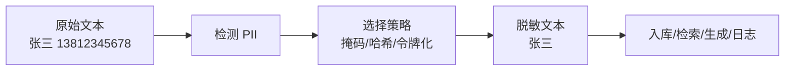
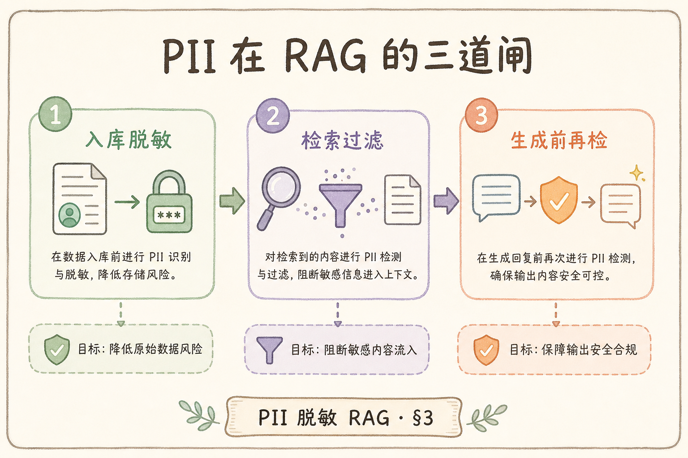
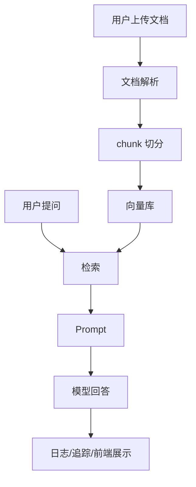
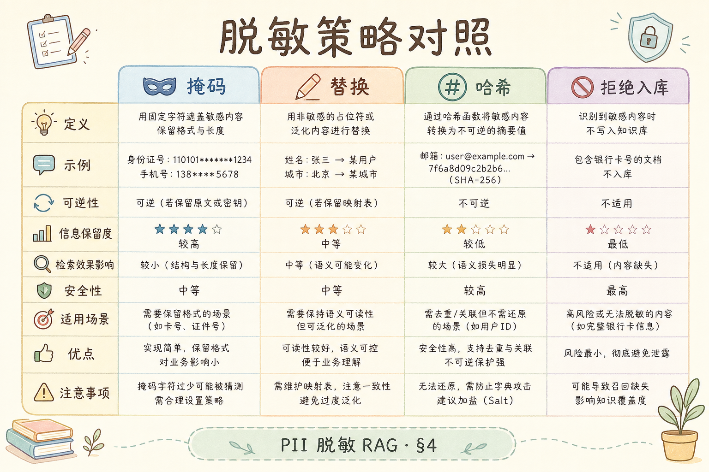
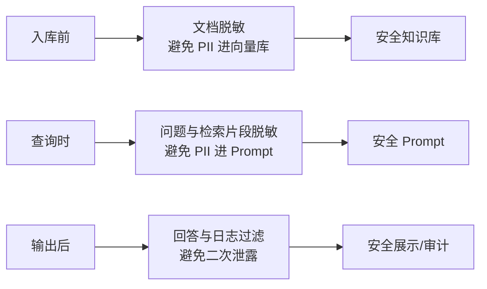

# G 生产（十七）：RAG 链路 PII 脱敏完全指南

> RAG 系统会把用户问题、文档片段、检索日志、模型回答串成一条长链路。如果里面混进手机号、身份证号、邮箱、客户地址等个人信息，泄露面会比普通接口更大。**PII 脱敏**要解决的问题是：在不破坏业务可用性的前提下，尽量避免个人信息进入日志、向量库、Prompt 和模型输出。

---

## 目录

1. [为什么 RAG 更容易放大 PII 风险](#1-为什么-rag-更容易放大-pii-风险)
2. [PII 与脱敏是什么](#2-pii-与脱敏是什么)
3. [PII 在 RAG 链路的入口](#3-pii-在-rag-链路的入口)
4. [三类检测方法](#4-三类检测方法)
5. [三类脱敏策略](#5-三类脱敏策略)
6. [入库前、查询时、输出后三道闸](#6-入库前查询时输出后三道闸)
7. [最小代码示例](#7-最小代码示例)
8. [审计、例外与回溯](#8-审计例外与回溯)
9. [常见陷阱与 FAQ](#9-常见陷阱与-faq)
10. [总结](#10-总结)

---

## 1. 为什么 RAG 更容易放大 PII 风险

**PII**（Personally Identifiable Information，个人可识别信息）指能直接或间接识别个人的信息，例如手机号、邮箱、身份证号、住址、银行卡号、客户编号和某些组合信息。

普通接口可能只在数据库里处理 PII；RAG 链路会额外经过：

- 文档解析：上传的合同、工单、邮件里可能包含 PII；
- 切分入库：PII 可能进入 chunk 和向量库元数据；
- 检索召回：PII 可能被带进 Prompt；
- 模型生成：PII 可能被原样复述；
- 日志观测：问题、上下文、回答可能被写入日志。

所以 RAG 的 PII 治理不能只在一个接口上补正则，而要覆盖整条链路。

---

## 2. PII 与脱敏是什么

脱敏策略按场景分：前端展示用掩码；发给模型用令牌化占位；日志关联用加盐哈希；合规删除则彻底移除原文与索引。检测与脱敏是两步——正则/NER 找到位置，策略决定替换成什么。不要把合规责任交给模型「自觉不泄露」。

**脱敏**：把敏感信息替换成不可直接识别的形式，例如把 `13812345678` 变成 `138****5678` 或 `<PHONE_1>`。

脱敏不是简单删除。不同场景需要保留不同程度的信息：

| 场景 | 目标 | 示例 |
|---|---|---|
| 展示给客服 | 能识别大概对象但不泄露完整值 | `138****5678` |
| 发给模型 | 保留语义占位 | `<PHONE_1>` |
| 日志排查 | 能关联同一用户但不可还原 | 哈希值 |
| 合规删除 | 彻底移除 | 删除原文与索引 |



读图时注意：检测和脱敏是两步。检测负责找到敏感信息，策略负责决定替换成什么。

---

## 3. PII 在 RAG 链路的入口

治理顺序反映泄漏面：知识库入库、用户提问、系统日志都可能引入 PII，但日志与 Prompt 最容易被忽视也最难回收——一条含完整 prompt 的 debug 日志可能同步到境外观测平台。先控制出站（Prompt/日志），再控制长期存储（向量库），最后规划历史数据回溯。





PII 可能出现在三条入口：

1. **知识库入口**：合同、简历、客服记录、邮件导入；
2. **查询入口**：用户直接在问题里输入手机号、订单号、身份证号；
3. **系统日志入口**：开发者为了排查问题，把原始 prompt 和检索上下文全量记录。

治理顺序建议是：先控制日志和 Prompt，再控制入库，再做复杂的删除回溯。因为日志和 Prompt 最容易被忽略，也最容易扩散。

---

## 4. 三类检测方法

生产落地可先用规则覆盖手机号、邮箱、身份证等高确定性字段，再抽样评估误伤与漏报；身份证、银行卡应加校验位逻辑，避免把订单号误判。NER 与分类器适合人名、地址等变体，但需金标与版本管理。不要假设「模型会自动识别所有 PII」。

| 方法 | 适合检测 | 优点 | 缺点 |
|---|---|---|---|
| 规则/正则 | 手机号、邮箱、身份证号 | 快、可解释 | 容易误伤或漏掉变体 |
| NER 模型 | 人名、地址、组织 | 覆盖自然语言 | 需要模型和评测 |
| 分类器 | 整段是否含敏感信息 | 适合复杂场景 | 不一定能定位具体位置 |

初期可以先用规则覆盖高确定性字段，再用人工抽样评估误伤和漏报。不要一开始就依赖“模型会自动识别所有 PII”。

身份证、银行卡这类字段最好加校验逻辑。只用正则匹配位数，可能把普通订单号误判成身份证号。

---

## 5. 三类脱敏策略

检测出 PII 之后，下一步不是机械删除，而是按使用场景选择替换方式。前端展示、模型输入、日志排查和合规删除需要的保留程度不同，所以脱敏策略也要分开。



### 5.1 掩码

掩码保留部分可读信息，适合前端展示。

```text
13812345678 -> 138****5678
alice@example.com -> a***@example.com
```

优点是人能看懂，缺点是仍可能被组合识别。

### 5.2 哈希

哈希把原始值变成固定摘要，适合日志关联。

```text
13812345678 -> sha256:9f2a...
```

同一个手机号每次哈希结果相同，方便排查“同一用户多次触发问题”。但如果没有 salt，低空间字段可能被撞库。

### 5.3 令牌化

令牌化把敏感值替换成占位符，适合发给模型。

```text
请查询 13812345678 的订单
-> 请查询 <PHONE_1> 的订单
```

模型仍然知道这里有一个手机号，但看不到真实号码。

---

## 6. 入库前、查询时、输出后三道闸

入库前脱敏减少向量库长期存明文；查询时令牌化减少发给外部 LLM 的 PII；输出后过滤防止模型复述与日志二次扩散。若资源只够做一处，优先 **Prompt 与日志**——这两处最易把数据发往第三方且难回收。

资源有限时优先级：日志与 Prompt 前脱敏 > 入库前脱敏 > 复杂历史回溯。原因是日志与 Prompt 最容易把 PII 发往外部模型或观测 SaaS，且一旦发生难以回收。三道闸分别阻断「长期存向量库」「发给 LLM」「展示与二次泄露」三条传播路径。



三道闸的分工：

| 位置 | 主要目标 | 典型做法 |
|---|---|---|
| 入库前 | 不让敏感原文长期留在向量库 | 文档解析后先检测脱敏，再 chunk |
| 查询时 | 不把用户输入和召回片段原样发给模型 | Prompt 前做令牌化 |
| 输出后 | 防止模型复述或拼接出敏感信息 | 回答过滤 + 日志脱敏 |

如果只能先做一处，优先做日志和 Prompt 前脱敏。因为这两处最容易把 PII 发送给外部模型或观测平台。

---

## 7. 最小代码示例

单元测试用 mock server，不要把真实 prod key 放进 pytest fixture。`Settings` 的 `__repr__` 与 debug 日志勿打印完整 `database_url`——RAG 调试检索时尤其容易 `logger.debug(settings)` 泄漏。

示例中的 `pii` 字典含原文，**禁止直接写日志**——生产应只记类型、数量、hash 与 `trace_id`。规则覆盖只是起点，真实项目要扩展校验、审计、例外审批与误伤处理，并与 [196 审计](196.audit-log-rag-tutorial.md) 的 `policy_version` 对齐。

下面示例只演示手机号和邮箱规则。真实项目要扩展校验、审计、例外和误伤处理。

```python
import re

PHONE_RE = re.compile(r"(?<!\d)1[3-9]\d{9}(?!\d)")
EMAIL_RE = re.compile(r"[A-Za-z0-9._%+-]+@[A-Za-z0-9.-]+\.[A-Za-z]{2,}")


def redact_pii(text: str) -> tuple[str, dict[str, list[str]]]:
    found = {"phone": [], "email": []}

    def replace_phone(match: re.Match) -> str:
        value = match.group(0)
        found["phone"].append(value)
        return "<PHONE>"

    def replace_email(match: re.Match) -> str:
        value = match.group(0)
        found["email"].append(value)
        return "<EMAIL>"

    text = PHONE_RE.sub(replace_phone, text)
    text = EMAIL_RE.sub(replace_email, text)
    return text, found


raw = "请查询 alice@example.com 和 13812345678 的订单。"
safe_text, pii = redact_pii(raw)
print(safe_text)
print(pii)
```

预期输出：

```text
请查询 <EMAIL> 和 <PHONE> 的订单。
{'phone': ['13812345678'], 'email': ['alice@example.com']}
```

注意：`pii` 里的原始值不能随便写日志。真实系统可以只记录类型、数量、哈希和 trace_id。

---

## 8. 审计、例外与回溯

误伤例外（如产品编号形似手机号）须走审批与版本化白名单，禁止开发者随手 `if doc_id==` 绕过。已入库 PII 需回溯：定位文档 → 删 chunk → 重新脱敏 embed → 更新索引，并记审计。只改新文档无法通过合规检查。

PII 脱敏不能只靠代码，还需要可审计流程。

建议记录：

| 字段 | 说明 |
|---|---|
| `trace_id` | 哪次请求触发 |
| `pii_types` | 命中的类型，例如 phone/email |
| `pii_count` | 命中数量 |
| `action` | mask/hash/tokenize/block |
| `policy_version` | 用的是哪版规则 |
| `review_required` | 是否需要人工复核 |

不要记录完整 PII 原文。排查需要关联时，用加 salt 的哈希值更安全。

对于误伤要有例外机制。例如“产品编号 13812345678”可能被当成手机号。例外机制应该经过审批和版本管理，不要让开发者随手在代码里加白名单。

---

## 9. 常见陷阱与 FAQ

PII 脱敏最容易出错的地方，是只在某一个点做处理，却以为整条链路都安全了。下面这些问题都应该在代码评审和上线检查中反复确认。

### 9.1 错：只在日志里脱敏

如果向量库和 Prompt 里仍然是明文，日志脱敏只是最后一层补救。正确做法是链路前段就尽量减少明文传播。

### 9.2 错：把所有数字都删掉

过度脱敏会破坏业务。例如订单号、合同编号、金额、日期可能是回答所需证据。脱敏规则要按类型和场景区分。

### 9.3 错：相信 LLM 自己不会泄露

模型会复述上下文。如果 Prompt 里有手机号，模型就可能原样输出。不要把合规责任交给模型自觉。

### 9.4 FAQ：脱敏后还能做检索吗？

能，但要设计好。一般做法是保留非敏感语义，把 PII 替换成稳定占位符。比如“张三的手机号是 <PHONE>”仍能表达“这里有联系方式”，但不会暴露号码。

### 9.5 FAQ：已经入库的 PII 怎么办？

需要回溯任务：定位受影响文档、删除原 chunk、重新脱敏、重新嵌入、更新索引，并保留审计记录。只改新文档不够。

---

## 10. 总结

RAG 链路的 PII 风险来自“传播链变长”：文档、chunk、向量库、Prompt、回答、日志都可能复制敏感信息。


最小可落地方案是：

1. 明确定义哪些字段算 PII；
2. 用规则先覆盖手机号、邮箱、身份证等高确定性类型；
3. 在入库前、Prompt 前、日志前设置三道脱敏闸；
4. 按场景选择掩码、哈希或令牌化；
5. 记录审计信息，但不记录完整原文；
6. 给历史数据准备回溯和重建索引流程。

脱敏的目标不是让文本完全失去信息，而是在“业务仍可用”和“个人信息不扩散”之间建立清晰边界。
